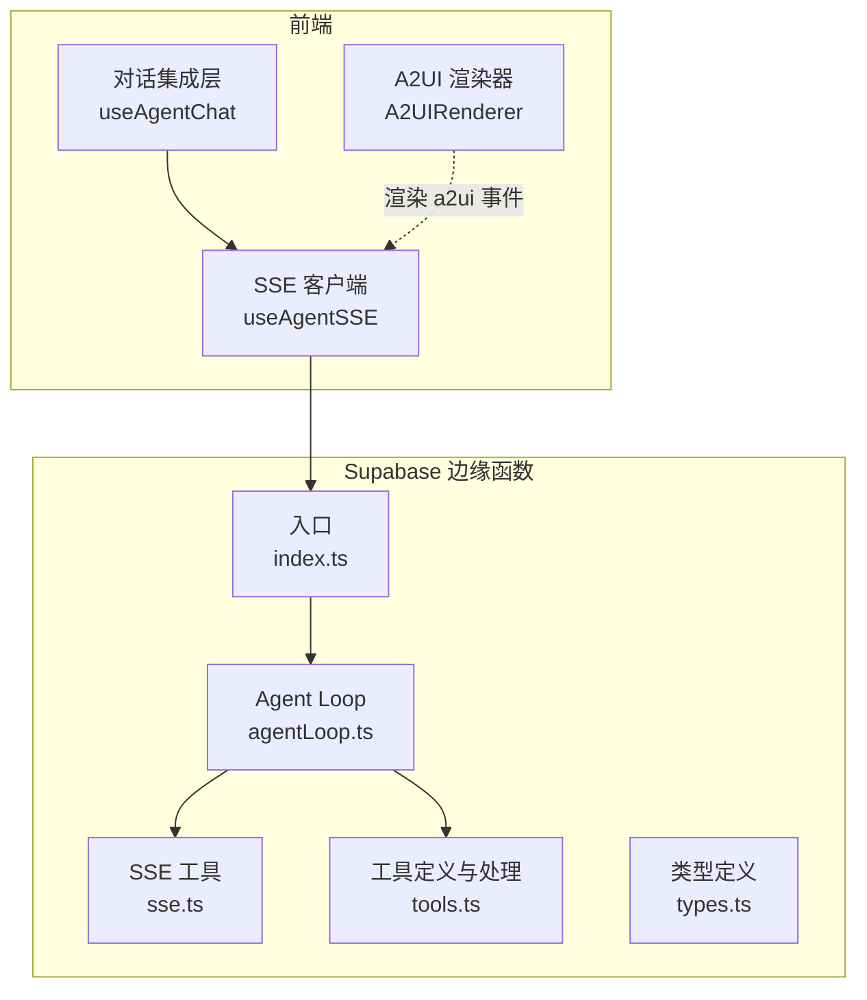
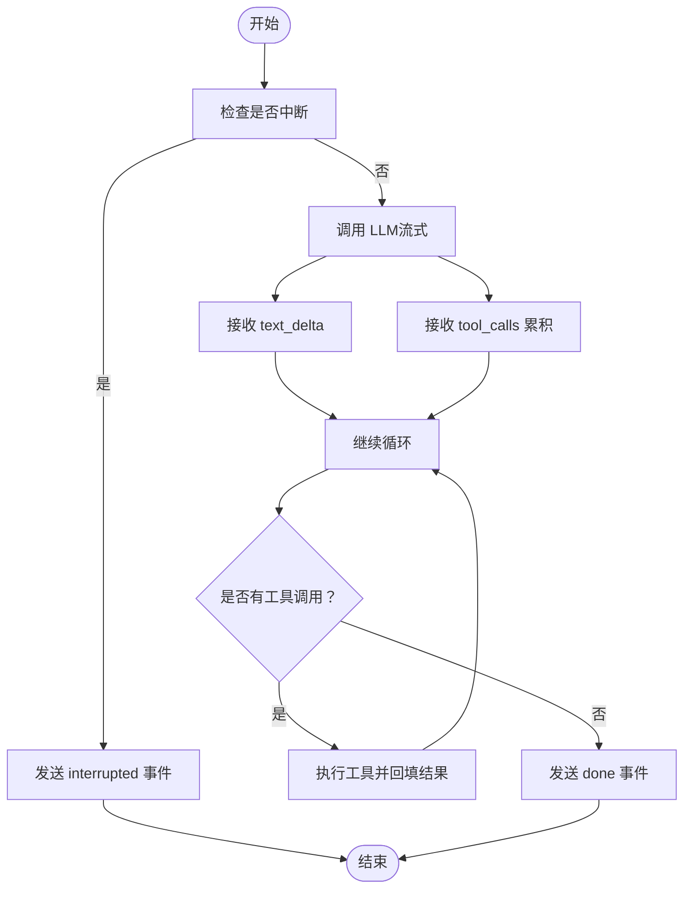
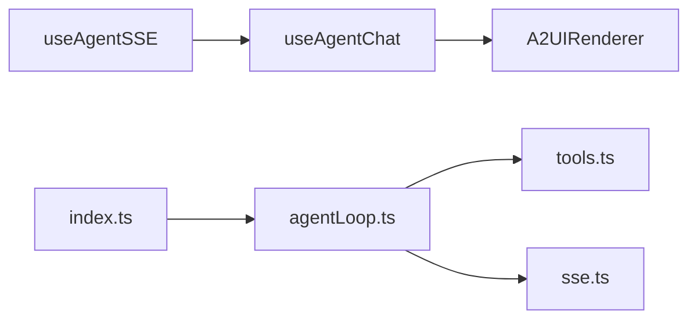

# AI Assistant API

<cite>
**本文引用的文件**
- [index.ts](file://app/supabase/functions/ai-assistant/index.ts)
- [types.ts](file://app/supabase/functions/ai-assistant/types.ts)
- [sse.ts](file://app/supabase/functions/ai-assistant/sse.ts)
- [tools.ts](file://app/supabase/functions/ai-assistant/tools.ts)
- [agentLoop.ts](file://app/supabase/functions/ai-assistant/agentLoop.ts)
- [sseClient.ts](file://app/src/lib/agent/sseClient.ts)
- [useAgentChat.ts](file://app/src/hooks/useAgentChat.ts)
- [agent.ts](file://app/src/types/agent.ts)
- [A2UIRenderer.tsx](file://app/src/components/agent/a2ui/A2UIRenderer.tsx)
</cite>

## 目录
1. [简介](#简介)
2. [项目结构](#项目结构)
3. [核心组件](#核心组件)
4. [架构总览](#架构总览)
5. [详细组件分析](#详细组件分析)
6. [依赖关系分析](#依赖关系分析)
7. [性能考量](#性能考量)
8. [故障排查指南](#故障排查指南)
9. [结论](#结论)
10. [附录](#附录)

## 简介
本文件为 OPC-Starter 项目中 AI Assistant API 的权威技术文档，聚焦基于 Server-Sent Events（SSE）的流式响应接口规范，覆盖以下要点：
- 端点与请求/响应格式：POST /functions/v1/ai-assistant
- 请求头与鉴权：Authorization、CORS
- 请求体结构：messages、context、threadId
- 消息结构与上下文参数
- SSE 事件类型与数据格式：text_delta、tool_call、a2ui、done、error、interrupted
- 工具调用规范：navigateToPage、getCurrentContext、renderUI
- Agent Loop 模式与最大迭代限制
- 客户端实现指南与最佳实践

## 项目结构
该功能由“边缘函数（Edge Function）+ 前端 SSE 客户端 + 工具执行器 + A2UI 渲染器”构成，前后端通过 SSE 流式协议交互。



图表来源
- [index.ts:22-113](file://app/supabase/functions/ai-assistant/index.ts#L22-L113)
- [agentLoop.ts:21-137](file://app/supabase/functions/ai-assistant/agentLoop.ts#L21-L137)
- [sse.ts:26-39](file://app/supabase/functions/ai-assistant/sse.ts#L26-L39)
- [tools.ts:10-77](file://app/supabase/functions/ai-assistant/tools.ts#L10-L77)
- [sseClient.ts:311-463](file://app/src/lib/agent/sseClient.ts#L311-L463)
- [useAgentChat.ts:299-367](file://app/src/hooks/useAgentChat.ts#L299-L367)
- [A2UIRenderer.tsx:91-171](file://app/src/components/agent/a2ui/A2UIRenderer.tsx#L91-L171)

章节来源
- [index.ts:10-116](file://app/supabase/functions/ai-assistant/index.ts#L10-L116)
- [agentLoop.ts:1-138](file://app/supabase/functions/ai-assistant/agentLoop.ts#L1-L138)
- [sse.ts:13-24](file://app/supabase/functions/ai-assistant/sse.ts#L13-L24)
- [tools.ts:1-191](file://app/supabase/functions/ai-assistant/tools.ts#L1-L191)
- [sseClient.ts:1-484](file://app/src/lib/agent/sseClient.ts#L1-L484)
- [useAgentChat.ts:1-380](file://app/src/hooks/useAgentChat.ts#L1-L380)
- [A2UIRenderer.tsx:1-244](file://app/src/components/agent/a2ui/A2UIRenderer.tsx#L1-L244)

## 核心组件
- 边缘函数入口：负责鉴权、构造系统提示、将消息转换为 OpenAI 兼容格式、启动 Agent Loop 并通过 SSE 写出事件。
- Agent Loop：驱动 LLM 流式生成，聚合工具调用，回填工具结果，循环直至完成或达到最大迭代。
- SSE 工具：封装 SSE 写入、消息格式转换、工具调用累积与构建。
- 工具定义与处理：声明可用工具（navigateToPage、getCurrentContext、renderUI），并处理工具调用与结果。
- 前端 SSE 客户端：解析 SSE 事件、维护重试与中断、桥接工具调用与 UI 渲染。
- A2UI 渲染器：接收后端 a2ui 事件，将 JSON 组件树渲染为 React 组件。

章节来源
- [index.ts:22-113](file://app/supabase/functions/ai-assistant/index.ts#L22-L113)
- [agentLoop.ts:21-137](file://app/supabase/functions/ai-assistant/agentLoop.ts#L21-L137)
- [sse.ts:26-106](file://app/supabase/functions/ai-assistant/sse.ts#L26-L106)
- [tools.ts:10-191](file://app/supabase/functions/ai-assistant/tools.ts#L10-L191)
- [sseClient.ts:246-481](file://app/src/lib/agent/sseClient.ts#L246-L481)
- [A2UIRenderer.tsx:91-171](file://app/src/components/agent/a2ui/A2UIRenderer.tsx#L91-L171)

## 架构总览
下面的序列图展示了从客户端发送消息到服务端完成一次 Agent Loop 的完整流程，包括文本增量、工具调用、A2UI 渲染与最终完成事件。

```mermaid
sequenceDiagram
participant Client as "客户端"
participant SSE as "SSE 客户端<br/>useAgentSSE"
participant Edge as "边缘函数<br/>index.ts"
participant Loop as "Agent Loop<br/>agentLoop.ts"
participant Tools as "工具处理<br/>tools.ts"
participant SSEUtil as "SSE 工具<br/>sse.ts"
Client->>SSE : "sendMessage(messages, context)"
SSE->>Edge : "POST /functions/v1/ai-assistant"
Edge->>SSEUtil : "convertToOpenAIMessages()"
Edge->>Loop : "runAgentLoop(messages, sse)"
Loop->>Loop : "流式调用 LLMqwen-plus"
Loop-->>SSE : "text_delta增量文本"
Loop-->>SSE : "tool_call工具调用"
SSE-->>Client : "text_delta 事件"
SSE-->>Client : "tool_call 事件"
Client->>SSE : "executeToolCall()本地执行"
SSE-->>Edge : "工具结果tool_call_id"
Edge->>Loop : "回填 tool 消息"
Loop->>Loop : "继续 LLM 推理"
Loop-->>SSE : "a2ui渲染 UI"
SSE-->>Client : "a2ui 事件"
Client->>SSE : "用户与 A2UI 交互"
SSE-->>Edge : "可选：工具结果回传"
Loop-->>SSE : "done完成"
SSE-->>Client : "done 事件"
```

图表来源
- [index.ts:82-100](file://app/supabase/functions/ai-assistant/index.ts#L82-L100)
- [agentLoop.ts:43-131](file://app/supabase/functions/ai-assistant/agentLoop.ts#L43-L131)
- [tools.ts:161-191](file://app/supabase/functions/ai-assistant/tools.ts#L161-L191)
- [sse.ts:26-39](file://app/supabase/functions/ai-assistant/sse.ts#L26-L39)
- [sseClient.ts:311-463](file://app/src/lib/agent/sseClient.ts#L311-L463)

## 详细组件分析

### 接口规范：POST /functions/v1/ai-assistant
- 方法：POST
- 路径：/functions/v1/ai-assistant
- 鉴权：Authorization: Bearer <access_token>
- CORS：允许跨域请求
- Content-Type：application/json
- Accept：text/event-stream

请求体字段
- messages: 数组，元素为 RequestMessage
  - role: 'user' | 'assistant' | 'tool'
  - content: 字符串
  - tool_call_id: 当 role=tool 时必填
  - name: 当 role=tool 时可选
- context: 可选，AgentContext
  - currentPage: 'dashboard' | 'persons' | 'profile' | 'settings' | 'cloud-storage' | 'other'
  - viewContext: { viewMode, teamId, teamName }
- threadId: 可选，会话标识

响应：SSE 流，事件类型包括 text_delta、tool_call、a2ui、done、error、interrupted

章节来源
- [index.ts:40-62](file://app/supabase/functions/ai-assistant/index.ts#L40-L62)
- [index.ts:66-80](file://app/supabase/functions/ai-assistant/index.ts#L66-L80)
- [types.ts:16-27](file://app/supabase/functions/ai-assistant/types.ts#L16-L27)
- [types.ts:7-14](file://app/supabase/functions/ai-assistant/types.ts#L7-L14)
- [sse.ts:13-24](file://app/supabase/functions/ai-assistant/sse.ts#L13-L24)

### SSE 事件规范
- text_delta
  - 用途：流式输出文本增量
  - 数据：{ content: string }
- tool_call
  - 用途：LLM 请求调用某个工具
  - 数据：{ id: string, name: string, arguments: Record<string, unknown> }
- a2ui
  - 用途：后端触发前端渲染 A2UI 组件
  - 数据：A2UIServerMessage（包含 beginRendering 等）
- done
  - 用途：对话完成
  - 数据：{ iterations: number, usage: { prompt_tokens, completion_tokens } }
- error
  - 用途：错误事件
  - 数据：{ message: string, code?: string }
- interrupted
  - 用途：用户中断或达到最大迭代限制
  - 数据：{ reason: 'user_abort' | string, iterations: number }

章节来源
- [agentLoop.ts:63-76](file://app/supabase/functions/ai-assistant/agentLoop.ts#L63-L76)
- [agentLoop.ts:83-113](file://app/supabase/functions/ai-assistant/agentLoop.ts#L83-L113)
- [agentLoop.ts:116-136](file://app/supabase/functions/ai-assistant/agentLoop.ts#L116-L136)
- [tools.ts:177-181](file://app/supabase/functions/ai-assistant/tools.ts#L177-L181)
- [tools.ts:96-101](file://app/supabase/functions/ai-assistant/tools.ts#L96-L101)
- [agent.ts:155-221](file://app/src/types/agent.ts#L155-L221)

### 工具调用规范
- navigateToPage
  - 作用：导航到指定页面
  - 参数：{ page: 'home' | 'persons' | 'profile' | 'settings' | 'storage' }
- getCurrentContext
  - 作用：获取当前应用上下文
  - 参数：无
- renderUI
  - 作用：生成 A2UI 组件供用户交互
  - 参数：
    - surfaceId: string（可选）
    - component: { id, type, props, children }
    - dataModel: object（可选）

工具处理流程
- Agent Loop 在流式响应中收集工具调用，累积参数后统一提交给工具处理
- 工具处理：
  - renderUI：向前端发送 a2ui 事件，同时返回富结果（包含 suggestedNextStep、context 等）
  - 其他工具：向前端发送 tool_call 事件，并返回富结果

章节来源
- [tools.ts:10-77](file://app/supabase/functions/ai-assistant/tools.ts#L10-L77)
- [tools.ts:161-191](file://app/supabase/functions/ai-assistant/tools.ts#L161-L191)
- [agentLoop.ts:89-110](file://app/supabase/functions/ai-assistant/agentLoop.ts#L89-L110)

### Agent Loop 模式与最大迭代限制
- 模式：LLM 流式生成 → 工具调用 → 结果回填 → 再次调用 LLM，直到无工具调用或达到上限
- 最大迭代：默认 5 次；超过则发送 error 事件
- 中断：前端可主动中断（AbortController），服务端检测到后发送 interrupted 事件



图表来源
- [agentLoop.ts:32-131](file://app/supabase/functions/ai-assistant/agentLoop.ts#L32-L131)

章节来源
- [agentLoop.ts:21-137](file://app/supabase/functions/ai-assistant/agentLoop.ts#L21-L137)

### 客户端实现指南与最佳实践
- 鉴权：使用 Supabase 获取 access_token，附加到 Authorization 头
- SSE 解析：按 event/data 行解析，注意缓冲区拼接与事件边界
- 重试策略：指数退避重试，最多 3 次，默认启用
- 中断机制：支持用户中断（AbortController），前端需在每次请求前创建新的 AbortController
- 文本增量：累计 content 并实时更新 UI
- 工具调用：收到 tool_call 后在前端执行工具，完成后将结果以 tool_call_id 回传给后端
- A2UI 渲染：收到 a2ui 事件后交由 A2UIRenderer 渲染，支持严格/非严格模式与安全校验
- 错误处理：捕获 error 事件并展示；interrupted 事件需清理 UI 状态

章节来源
- [sseClient.ts:246-481](file://app/src/lib/agent/sseClient.ts#L246-L481)
- [useAgentChat.ts:299-367](file://app/src/hooks/useAgentChat.ts#L299-L367)
- [A2UIRenderer.tsx:91-171](file://app/src/components/agent/a2ui/A2UIRenderer.tsx#L91-L171)

## 依赖关系分析
- 前端依赖
  - useAgentSSE：封装 fetch + SSE 解析 + 重试 + 中断
  - useAgentChat：整合上下文、消息、工具执行、A2UI 渲染
  - A2UIRenderer：渲染 JSON 组件树
- 后端依赖
  - index.ts：鉴权、构造系统提示、启动 Agent Loop
  - agentLoop.ts：LLM 调用、工具调用循环、SSE 输出
  - sse.ts：SSE 写入、消息转换、工具调用累积
  - tools.ts：工具定义、工具执行与富结果



图表来源
- [index.ts:22-113](file://app/supabase/functions/ai-assistant/index.ts#L22-L113)
- [agentLoop.ts:21-137](file://app/supabase/functions/ai-assistant/agentLoop.ts#L21-L137)
- [sse.ts:26-39](file://app/supabase/functions/ai-assistant/sse.ts#L26-L39)
- [tools.ts:10-77](file://app/supabase/functions/ai-assistant/tools.ts#L10-L77)
- [sseClient.ts:246-481](file://app/src/lib/agent/sseClient.ts#L246-L481)
- [useAgentChat.ts:299-367](file://app/src/hooks/useAgentChat.ts#L299-L367)
- [A2UIRenderer.tsx:91-171](file://app/src/components/agent/a2ui/A2UIRenderer.tsx#L91-L171)

## 性能考量
- 流式输出：text_delta 逐字增量推送，降低首屏延迟
- 工具调用：工具执行在前端完成，减少后端往返
- 最大迭代：限制 Agent Loop 次数，防止长尾耗时
- 重试策略：指数退避，避免雪崩
- 中断机制：快速释放资源，提升用户体验

## 故障排查指南
常见错误与定位
- 401 未授权：检查 Authorization 头是否携带有效 access_token
- 400 缺少 messages：确保请求体包含非空 messages 数组
- 500 服务器内部错误：查看边缘函数日志，关注 LLM 调用异常与工具参数解析失败
- SSE 解析失败：确认事件边界与缓冲区拼接逻辑正确
- 中断未生效：确认前端每次请求均创建新的 AbortController 并调用 abort

章节来源
- [index.ts:27-62](file://app/supabase/functions/ai-assistant/index.ts#L27-L62)
- [index.ts:101-112](file://app/supabase/functions/ai-assistant/index.ts#L101-L112)
- [agentLoop.ts:124-130](file://app/supabase/functions/ai-assistant/agentLoop.ts#L124-L130)
- [sseClient.ts:146-198](file://app/src/lib/agent/sseClient.ts#L146-L198)

## 结论
AI Assistant API 通过 SSE 提供低延迟、可中断的流式对话体验，结合 Agent Loop 与工具调用实现“思考—行动—反馈”的闭环。前端通过 useAgentSSE 与 useAgentChat 简化集成，后端通过 agentLoop.ts 与 tools.ts 明确职责划分。遵循本文档的请求/响应规范、事件格式与客户端实现指南，可稳定地构建智能代理交互体验。

## 附录

### 请求/响应示例（路径引用）
- 请求体示例（messages/context/threadId）
  - [index.ts:66-80](file://app/supabase/functions/ai-assistant/index.ts#L66-L80)
- SSE 事件解析（text_delta/tool_call/a2ui/done/error/interrupted）
  - [sseClient.ts:92-144](file://app/src/lib/agent/sseClient.ts#L92-L144)
  - [agent.ts:155-221](file://app/src/types/agent.ts#L155-L221)
- 工具调用参数（navigateToPage/getCurrentContext/renderUI）
  - [tools.ts:10-77](file://app/supabase/functions/ai-assistant/tools.ts#L10-L77)
- Agent Loop 最大迭代与中断
  - [agentLoop.ts:26-26](file://app/supabase/functions/ai-assistant/agentLoop.ts#L26-L26)
  - [agentLoop.ts:133-136](file://app/supabase/functions/ai-assistant/agentLoop.ts#L133-L136)