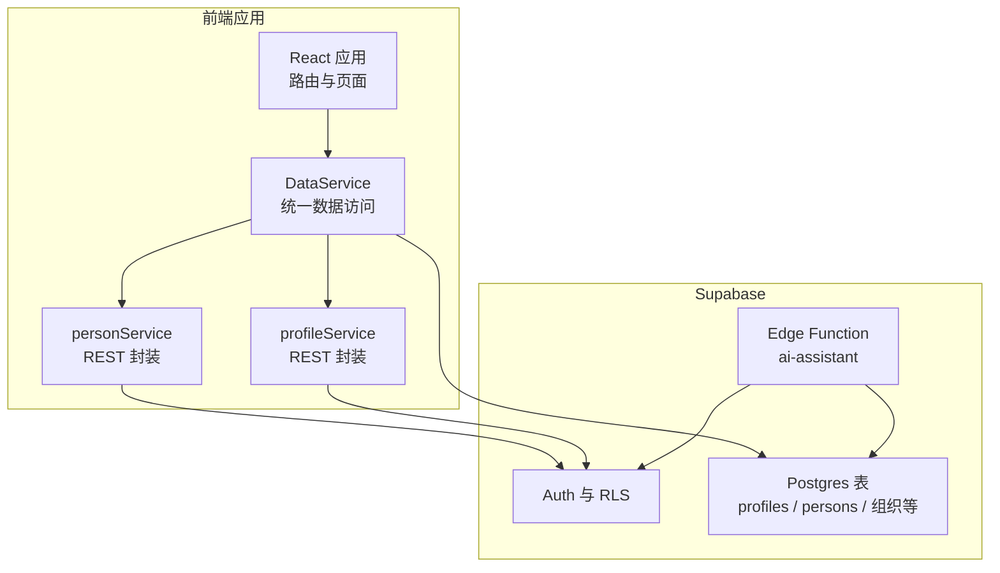
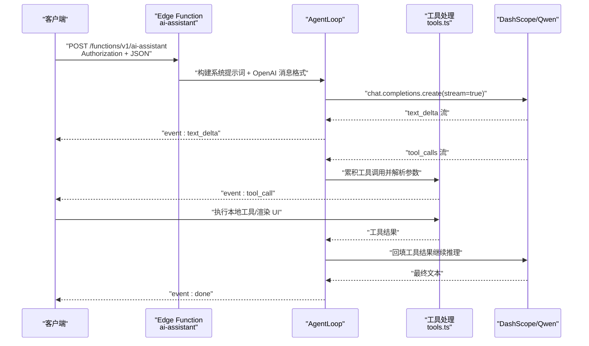
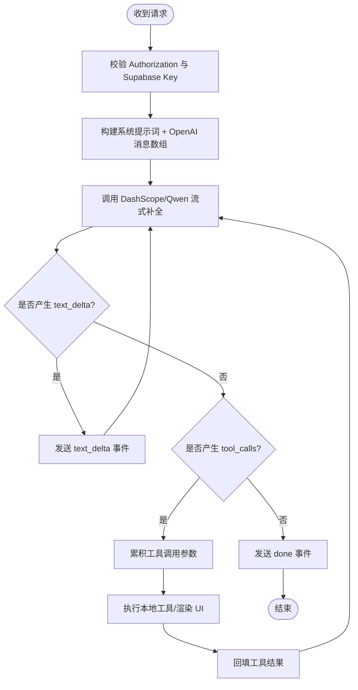
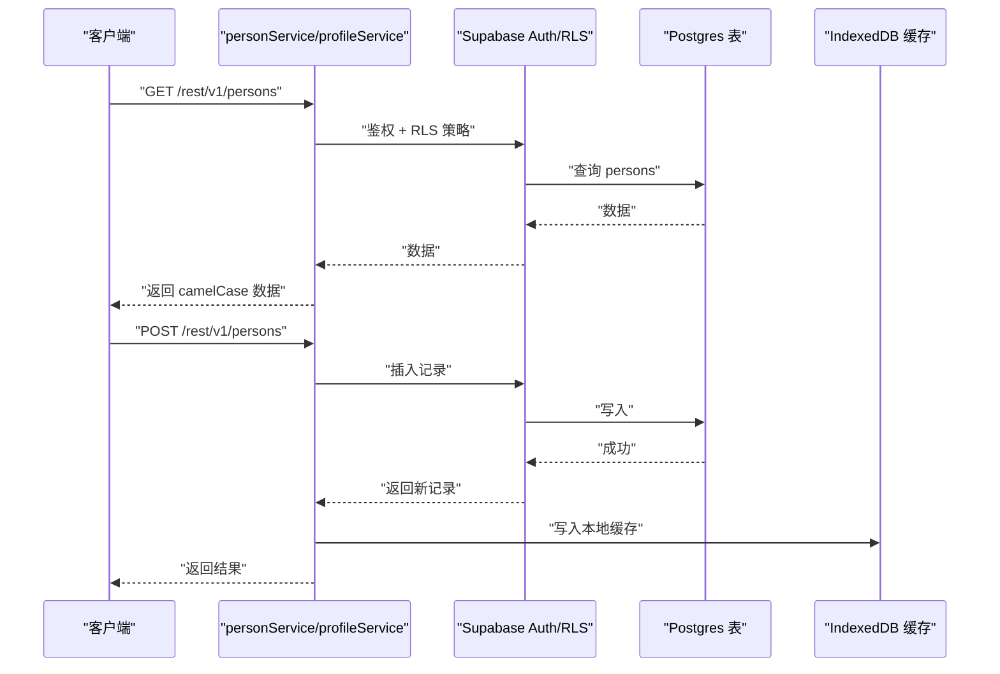
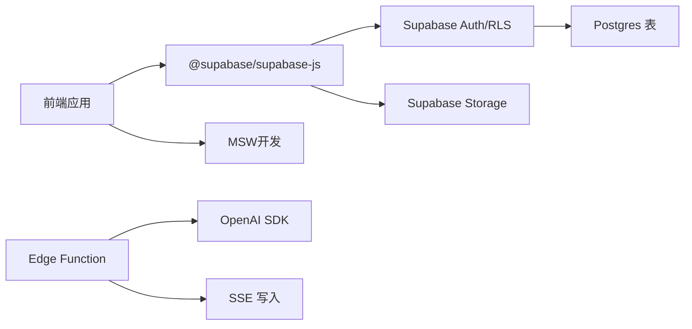

# API 接口文档

<cite>
**本文引用的文件**
- [index.ts](file://app/supabase/functions/ai-assistant/index.ts)
- [sse.ts](file://app/supabase/functions/ai-assistant/sse.ts)
- [types.ts](file://app/supabase/functions/ai-assistant/types.ts)
- [tools.ts](file://app/supabase/functions/ai-assistant/tools.ts)
- [agentLoop.ts](file://app/supabase/functions/ai-assistant/agentLoop.ts)
- [API.md](file://docs/API.md)
- [personService.ts](file://app/src/services/api/personService.ts)
- [profileService.ts](file://app/src/services/api/profileService.ts)
- [DataService.ts](file://app/src/services/data/DataService.ts)
- [client.ts](file://app/src/lib/supabase/client.ts)
- [setup.sql](file://app/supabase/setup.sql)
- [env.local.example](file://app/env.local.example)
- [handlers/index.ts](file://app/src/mocks/handlers/index.ts)
- [agentHandlers.ts](file://app/src/mocks/handlers/agentHandlers.ts)
</cite>

## 目录
1. [简介](#简介)
2. [项目结构](#项目结构)
3. [核心组件](#核心组件)
4. [架构总览](#架构总览)
5. [详细组件分析](#详细组件分析)
6. [依赖分析](#依赖分析)
7. [性能考量](#性能考量)
8. [故障排查指南](#故障排查指南)
9. [结论](#结论)
10. [附录](#附录)

## 简介
本文件为 OPC-Starter 项目的完整 API 接口文档，覆盖以下方面：
- AI Assistant Edge Function 的 SSE 流式响应接口规范，包括连接处理、消息格式、事件类型、实时交互模式与 Agent Loop 循环机制
- 数据服务 API 的 RESTful 接口规范，涵盖 CRUD、查询、同步接口的 HTTP 方法、URL 模式、请求响应格式与认证方式
- Edge Functions 的 API 规范，包括函数调用方式、参数传递、返回值处理
- 错误处理策略、安全考虑、速率限制、版本信息
- 常见使用案例、客户端实现指南、性能优化技巧
- 协议特定的调试工具与监控方法

## 项目结构
本项目采用前后端分离与边缘函数结合的架构：
- 前端应用位于 app/src，提供用户界面与数据服务封装
- Supabase Edge Functions 位于 app/supabase/functions/ai-assistant，提供 AI Assistant 的 SSE 流式响应
- 数据层通过 Supabase Auth、RLS 与 Postgres 表结构支撑，配合前端数据服务实现离线队列、增量同步与冲突解决

图表来源
- [client.ts:1-34](file://app/src/lib/supabase/client.ts#L1-L34)
- [setup.sql:1-505](file://app/supabase/setup.sql#L1-L505)
- [index.ts:1-116](file://app/supabase/functions/ai-assistant/index.ts#L1-L116)

章节来源
- [client.ts:1-34](file://app/src/lib/supabase/client.ts#L1-L34)
- [setup.sql:1-505](file://app/supabase/setup.sql#L1-L505)

## 核心组件
- AI Assistant Edge Function：基于 OpenAI 兼容模式调用通义千问，使用 SSE 流式返回文本增量、工具调用与 A2UI 渲染事件
- 数据服务层：统一抽象读写、离线队列、增量同步、冲突解决与实时订阅
- REST API 封装：personService 与 profileService 提供标准 CRUD 与业务操作接口

章节来源
- [index.ts:1-116](file://app/supabase/functions/ai-assistant/index.ts#L1-L116)
- [agentLoop.ts:1-138](file://app/supabase/functions/ai-assistant/agentLoop.ts#L1-L138)
- [DataService.ts:1-419](file://app/src/services/data/DataService.ts#L1-L419)
- [personService.ts:1-171](file://app/src/services/api/personService.ts#L1-L171)
- [profileService.ts:1-345](file://app/src/services/api/profileService.ts#L1-L345)

## 架构总览
AI Assistant 的交互流程采用 Agent Loop 模式：前端发起 SSE 请求，后端将消息转为 OpenAI 格式并调用 LLM；若返回工具调用则前端执行本地工具，再将结果回填至 LLM，直至纯文本回复完成。

图表来源
- [index.ts:22-113](file://app/supabase/functions/ai-assistant/index.ts#L22-L113)
- [agentLoop.ts:21-137](file://app/supabase/functions/ai-assistant/agentLoop.ts#L21-L137)
- [tools.ts:161-190](file://app/supabase/functions/ai-assistant/tools.ts#L161-L190)
- [sse.ts:26-39](file://app/supabase/functions/ai-assistant/sse.ts#L26-L39)

## 详细组件分析

### AI Assistant Edge Function 接口规范
- 端点
  - POST /functions/v1/ai-assistant
- 请求头
  - Authorization: Bearer <supabase_access_token>
  - Content-Type: application/json
  - apikey: Supabase 匿名密钥
- 请求体
  - messages: RequestMessage[]（至少一条）
  - context?: AgentContext（可选）
  - threadId?: string（可选）
- 响应
  - Content-Type: text/event-stream
  - 事件类型：
    - text_delta: 增量文本内容
    - tool_call: 工具调用（前端执行）
    - a2ui: A2UI 界面渲染事件
    - done: 对话完成（含迭代次数与 token 用量）
    - error: 错误信息
    - interrupted: 用户中断
- 错误码
  - 401: 缺少或无效的 Authorization 头
  - 400: messages 为空
  - 405: 非 POST 请求
  - 500: 服务器内部错误（如未配置 API Key）

图表来源
- [index.ts:34-112](file://app/supabase/functions/ai-assistant/index.ts#L34-L112)
- [agentLoop.ts:43-131](file://app/supabase/functions/ai-assistant/agentLoop.ts#L43-L131)
- [sse.ts:41-106](file://app/supabase/functions/ai-assistant/sse.ts#L41-L106)

章节来源
- [API.md:1-172](file://docs/API.md#L1-L172)
- [index.ts:1-116](file://app/supabase/functions/ai-assistant/index.ts#L1-L116)
- [sse.ts:1-180](file://app/supabase/functions/ai-assistant/sse.ts#L1-L180)
- [types.ts:1-55](file://app/supabase/functions/ai-assistant/types.ts#L1-L55)
- [tools.ts:1-191](file://app/supabase/functions/ai-assistant/tools.ts#L1-L191)
- [agentLoop.ts:1-138](file://app/supabase/functions/ai-assistant/agentLoop.ts#L1-L138)

### 数据服务 API（RESTful 接口）
- 认证方式
  - Supabase Auth：Bearer Token（Authorization 头）
  - Supabase RLS：按用户隔离与角色控制
- 端点与方法
  - GET /rest/v1/persons
  - GET /rest/v1/persons?select=* (按名称排序)
  - GET /rest/v1/persons?id=eq.{id}&select=*
  - POST /rest/v1/persons
  - PATCH /rest/v1/persons?id=eq.{id}
  - DELETE /rest/v1/persons?id=eq.{id}
  - GET /rest/v1/profiles?id=eq.{userId}&select=*
  - PATCH /rest/v1/profiles?id=eq.{userId}
  - 上传头像：通过 Storage API（Supabase Storage）
- 请求与响应
  - 请求体：JSON（字段命名遵循后端 snake_case）
  - 响应体：JSON（字段命名遵循前端 camelCase）
- 同步机制
  - 读优先本地 IndexedDB，写优先云端 Supabase，随后更新本地缓存
  - 实时订阅：Supabase Realtime 订阅 persons 表，自动同步变更
  - 离线队列：网络恢复后自动重试写操作
  - 冲突解决：基于时间戳与合并策略

图表来源
- [personService.ts:48-171](file://app/src/services/api/personService.ts#L48-L171)
- [profileService.ts:14-345](file://app/src/services/api/profileService.ts#L14-L345)
- [DataService.ts:326-414](file://app/src/services/data/DataService.ts#L326-L414)
- [setup.sql:122-181](file://app/supabase/setup.sql#L122-L181)

章节来源
- [personService.ts:1-171](file://app/src/services/api/personService.ts#L1-L171)
- [profileService.ts:1-345](file://app/src/services/api/profileService.ts#L1-L345)
- [DataService.ts:1-419](file://app/src/services/data/DataService.ts#L1-L419)
- [setup.sql:1-505](file://app/supabase/setup.sql#L1-L505)

### Edge Functions API 规范
- 函数入口：/functions/v1/ai-assistant
- 调用方式：HTTP POST（SSE 流）
- 参数传递：JSON 请求体（messages/context/threadId）
- 返回值处理：SSE 事件流（text_delta/tool_call/a2ui/done/error/interrupted）
- 环境变量（需在 Supabase Dashboard → Edge Functions → Secrets 配置）
  - ALIYUN_BAILIAN_API_KEY：百炼 API Key
  - SUPABASE_URL/SUPABASE_ANON_KEY：Supabase 服务端凭据（用于后端鉴权）
- 版本信息
  - Edge Function 版本：v2.1.0（模块化拆分版本）

章节来源
- [index.ts:1-116](file://app/supabase/functions/ai-assistant/index.ts#L1-L116)
- [env.local.example:34-44](file://app/env.local.example#L34-L44)

## 依赖分析
- 前端依赖
  - @supabase/supabase-js：与 Supabase 交互
  - MSW（Mock Service Worker）：开发阶段拦截与模拟请求
- 后端依赖
  - OpenAI SDK（兼容 DashScope/Qwen）：流式补全与工具调用
  - TransformStream/WritableStream：SSE 写入
- 数据层依赖
  - Supabase Auth/RLS：用户鉴权与数据隔离
  - Postgres 表结构：profiles/persons/organizations 等
  - Supabase Storage：头像上传与私有存储

图表来源
- [client.ts:1-34](file://app/src/lib/supabase/client.ts#L1-L34)
- [index.ts:10-20](file://app/supabase/functions/ai-assistant/index.ts#L10-L20)
- [agentLoop.ts:7-19](file://app/supabase/functions/ai-assistant/agentLoop.ts#L7-L19)

章节来源
- [client.ts:1-34](file://app/src/lib/supabase/client.ts#L1-L34)
- [index.ts:1-116](file://app/supabase/functions/ai-assistant/index.ts#L1-L116)
- [agentLoop.ts:1-138](file://app/supabase/functions/ai-assistant/agentLoop.ts#L1-L138)

## 性能考量
- SSE 流式响应
  - 使用 TransformStream 将增量文本直接写入 SSE，避免一次性缓冲
  - 控制工具调用累积与回填节奏，减少不必要的重复推理
- 离线与同步
  - 写操作先云端后本地，降低前端阻塞
  - 离线队列重试与指数退避，提升网络波动下的稳定性
- LLM 调用
  - 最大迭代次数限制（默认 5），防止长时间占用
  - 流式 usage 统计，便于成本与性能监控
- 图片上传
  - 前端压缩至 WebP，减小带宽与存储开销

章节来源
- [agentLoop.ts:25-137](file://app/supabase/functions/ai-assistant/agentLoop.ts#L25-L137)
- [DataService.ts:246-278](file://app/src/services/data/DataService.ts#L246-L278)
- [profileService.ts:140-199](file://app/src/services/api/profileService.ts#L140-L199)

## 故障排查指南
- 常见错误与定位
  - 401 未授权：检查 Authorization 头与 Supabase 匿名密钥
  - 400 messages 为空：确认请求体包含至少一条消息
  - 405 非 POST：确保使用 POST 方法
  - 500 服务器错误：检查 ALIYUN_BAILIAN_API_KEY 是否配置
- SSE 事件调试
  - text_delta：前端应持续拼接 content 字段
  - tool_call：前端执行本地工具并回填结果
  - a2ui：前端渲染动态 UI 组件
  - done/error/interrupted：前端停止流并处理结果或错误
- 数据同步问题
  - 检查网络状态与离线队列处理
  - 关注冲突统计与最后同步时间
- Mock 调试
  - 开启 VITE_ENABLE_MSW=true，使用 MSW 拦截 /supabase-proxy REST 请求
  - 使用 agentHandlers.ts 预设场景进行快速验证

章节来源
- [API.md:150-172](file://docs/API.md#L150-L172)
- [index.ts:22-113](file://app/supabase/functions/ai-assistant/index.ts#L22-L113)
- [agentHandlers.ts:1-338](file://app/src/mocks/handlers/agentHandlers.ts#L1-L338)
- [handlers/index.ts:1-28](file://app/src/mocks/handlers/index.ts#L1-L28)

## 结论
本项目通过 Edge Function 的 SSE 流式能力与前端数据服务的离线/同步机制，提供了稳定、可扩展的 AI 助手与数据访问体验。遵循本文档的接口规范与最佳实践，可在保证安全性与性能的前提下，快速集成与扩展业务功能。

## 附录

### 接口一览表（摘要）
- AI Assistant（SSE）
  - 方法：POST
  - 路径：/functions/v1/ai-assistant
  - 头部：Authorization, Content-Type, apikey
  - 事件：text_delta, tool_call, a2ui, done, error, interrupted
- Person（REST）
  - GET /rest/v1/persons
  - GET /rest/v1/persons?id=eq.{id}
  - POST /rest/v1/persons
  - PATCH /rest/v1/persons?id=eq.{id}
  - DELETE /rest/v1/persons?id=eq.{id}
- Profile（REST）
  - GET /rest/v1/profiles?id=eq.{userId}
  - PATCH /rest/v1/profiles?id=eq.{userId}

章节来源
- [API.md:11-67](file://docs/API.md#L11-L67)
- [personService.ts:48-171](file://app/src/services/api/personService.ts#L48-L171)
- [profileService.ts:14-345](file://app/src/services/api/profileService.ts#L14-L345)