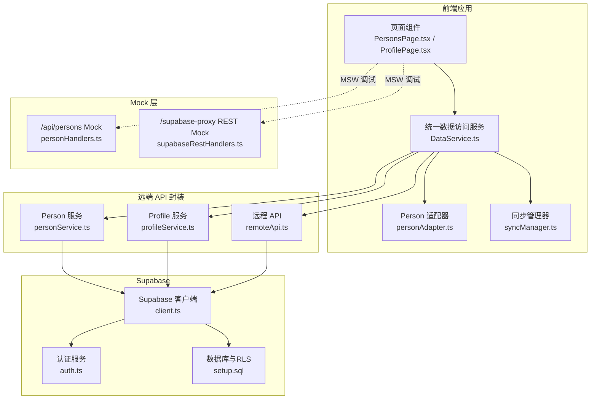
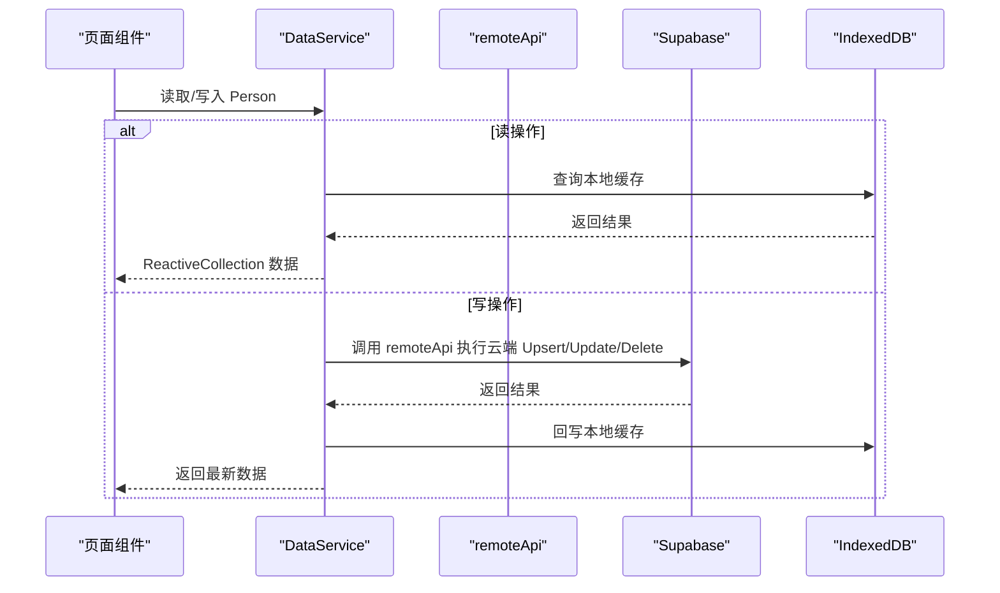
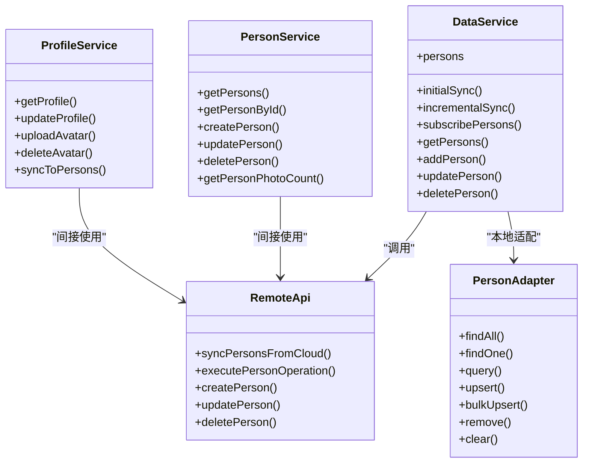

# 数据服务 API

<cite>
**本文引用的文件**
- [app/src/services/data/DataService.ts](file://app/src/services/data/DataService.ts)
- [app/src/services/api/personService.ts](file://app/src/services/api/personService.ts)
- [app/src/services/api/profileService.ts](file://app/src/services/api/profileService.ts)
- [app/src/services/data/remote/remoteApi.ts](file://app/src/services/data/remote/remoteApi.ts)
- [app/src/services/data/adapters/personAdapter.ts](file://app/src/services/data/adapters/personAdapter.ts)
- [app/src/services/data/sync/syncManager.ts](file://app/src/services/data/sync/syncManager.ts)
- [app/src/types/person.ts](file://app/src/types/person.ts)
- [app/src/types/api.ts](file://app/src/types/api.ts)
- [app/src/lib/supabase/client.ts](file://app/src/lib/supabase/client.ts)
- [app/src/lib/supabase/auth.ts](file://app/src/lib/supabase/auth.ts)
- [app/supabase/setup.sql](file://app/supabase/setup.sql)
- [app/src/mocks/handlers/personHandlers.ts](file://app/src/mocks/handlers/personHandlers.ts)
- [app/src/mocks/handlers/supabaseRestHandlers.ts](file://app/src/mocks/handlers/supabaseRestHandlers.ts)
- [app/src/pages/PersonsPage.tsx](file://app/src/pages/PersonsPage.tsx)
- [app/src/pages/ProfilePage.tsx](file://app/src/pages/ProfilePage.tsx)
</cite>

## 目录
1. [简介](#简介)
2. [项目结构](#项目结构)
3. [核心组件](#核心组件)
4. [架构总览](#架构总览)
5. [详细组件分析](#详细组件分析)
6. [依赖分析](#依赖分析)
7. [性能考虑](#性能考虑)
8. [故障排查指南](#故障排查指南)
9. [结论](#结论)
10. [附录](#附录)

## 简介
本文件面向前端与全栈开发者，系统化梳理基于 Supabase 的数据服务 API 规范与实现，重点覆盖以下方面：
- 基于 Supabase 的 RESTful 接口规范与调用方式
- Person 与 Profile 实体的 CRUD 接口定义、参数与响应格式
- 数据同步策略（初始同步、增量同步、离线队列、冲突解决）
- 认证与授权要求（Supabase Auth/RBAC）
- 错误处理、状态码与数据验证规则
- 前端数据服务层集成方式与最佳实践

## 项目结构
围绕“统一数据访问服务”与“远端 API 封装”的双层设计：
- 统一数据访问服务（DataService）：负责本地 IndexedDB 与云端 Supabase 的协调、离线队列、实时订阅、冲突解决与同步编排
- 远端 API 封装（personService/profileService/remoteApi）：对 Supabase REST/Realtime 进行语义化封装，提供 Person/Profile 的 CRUD 与同步能力
- 类型系统：Person、Profile、API 响应与分页等类型定义
- Supabase 配置与策略：客户端初始化、认证服务、数据库模式与 RLS 策略
- Mock 层：MSW 拦截 /supabase-proxy 与 /api 前缀，便于离线/联调测试

图表来源
- [app/src/services/data/DataService.ts:71-419](file://app/src/services/data/DataService.ts#L71-L419)
- [app/src/services/api/personService.ts:1-171](file://app/src/services/api/personService.ts#L1-L171)
- [app/src/services/api/profileService.ts:1-345](file://app/src/services/api/profileService.ts#L1-L345)
- [app/src/services/data/remote/remoteApi.ts:21-164](file://app/src/services/data/remote/remoteApi.ts#L21-L164)
- [app/src/services/data/adapters/personAdapter.ts:12-47](file://app/src/services/data/adapters/personAdapter.ts#L12-L47)
- [app/src/services/data/sync/syncManager.ts:14-48](file://app/src/services/data/sync/syncManager.ts#L14-L48)
- [app/src/lib/supabase/client.ts:1-34](file://app/src/lib/supabase/client.ts#L1-L34)
- [app/src/lib/supabase/auth.ts:1-120](file://app/src/lib/supabase/auth.ts#L1-L120)
- [app/supabase/setup.sql:1-505](file://app/supabase/setup.sql#L1-L505)
- [app/src/mocks/handlers/personHandlers.ts:1-46](file://app/src/mocks/handlers/personHandlers.ts#L1-L46)
- [app/src/mocks/handlers/supabaseRestHandlers.ts:1-293](file://app/src/mocks/handlers/supabaseRestHandlers.ts#L1-L293)

章节来源
- [app/src/services/data/DataService.ts:1-419](file://app/src/services/data/DataService.ts#L1-L419)
- [app/src/services/api/personService.ts:1-171](file://app/src/services/api/personService.ts#L1-L171)
- [app/src/services/api/profileService.ts:1-345](file://app/src/services/api/profileService.ts#L1-L345)
- [app/src/services/data/remote/remoteApi.ts:1-164](file://app/src/services/data/remote/remoteApi.ts#L1-L164)
- [app/src/services/data/adapters/personAdapter.ts:1-47](file://app/src/services/data/adapters/personAdapter.ts#L1-L47)
- [app/src/services/data/sync/syncManager.ts:1-48](file://app/src/services/data/sync/syncManager.ts#L1-L48)
- [app/src/lib/supabase/client.ts:1-34](file://app/src/lib/supabase/client.ts#L1-L34)
- [app/src/lib/supabase/auth.ts:1-120](file://app/src/lib/supabase/auth.ts#L1-L120)
- [app/supabase/setup.sql:1-505](file://app/supabase/setup.sql#L1-L505)
- [app/src/mocks/handlers/personHandlers.ts:1-46](file://app/src/mocks/handlers/personHandlers.ts#L1-L46)
- [app/src/mocks/handlers/supabaseRestHandlers.ts:1-293](file://app/src/mocks/handlers/supabaseRestHandlers.ts#L1-L293)

## 核心组件
- 统一数据访问服务（DataService）
  - 读优先本地 IndexedDB，写优先云端 Supabase，再回写本地缓存
  - 提供 Person 集合的 ReactiveCollection 适配与查询能力
  - 管理网络状态、离线队列、实时订阅、冲突解决与同步编排
- 远端 API 封装
  - personService：Person 的 CRUD 与照片数查询（基于 Supabase REST）
  - profileService：Profile 的读取/更新、头像上传/删除、与 persons 表的同步
  - remoteApi：统一执行云端 Upsert/Update/Delete，并支持从云端同步人员
- 类型系统
  - Person、PersonStats、通用 API 响应与分页、照片查询/上传等类型
- Supabase 配置与策略
  - client.ts：根据环境变量与 MSW 模式切换 URL 与匿名密钥
  - auth.ts：封装注册/登录/登出、当前用户获取、会话监听
  - setup.sql：数据库模式、RLS 策略、触发器、存储桶与函数

章节来源
- [app/src/services/data/DataService.ts:71-419](file://app/src/services/data/DataService.ts#L71-L419)
- [app/src/services/api/personService.ts:1-171](file://app/src/services/api/personService.ts#L1-L171)
- [app/src/services/api/profileService.ts:1-345](file://app/src/services/api/profileService.ts#L1-L345)
- [app/src/services/data/remote/remoteApi.ts:21-164](file://app/src/services/data/remote/remoteApi.ts#L21-L164)
- [app/src/types/person.ts:1-30](file://app/src/types/person.ts#L1-L30)
- [app/src/types/api.ts:1-65](file://app/src/types/api.ts#L1-L65)
- [app/src/lib/supabase/client.ts:1-34](file://app/src/lib/supabase/client.ts#L1-L34)
- [app/src/lib/supabase/auth.ts:1-120](file://app/src/lib/supabase/auth.ts#L1-L120)
- [app/supabase/setup.sql:1-505](file://app/supabase/setup.sql#L1-L505)

## 架构总览
统一数据访问服务作为中枢，协调本地缓存、云端 Supabase、实时订阅与离线队列；远端 API 封装提供语义化的 CRUD 与同步方法。

图表来源
- [app/src/services/data/DataService.ts:326-414](file://app/src/services/data/DataService.ts#L326-L414)
- [app/src/services/data/remote/remoteApi.ts:64-131](file://app/src/services/data/remote/remoteApi.ts#L64-L131)
- [app/src/services/data/adapters/personAdapter.ts:12-47](file://app/src/services/data/adapters/personAdapter.ts#L12-L47)

章节来源
- [app/src/services/data/DataService.ts:326-414](file://app/src/services/data/DataService.ts#L326-L414)
- [app/src/services/data/remote/remoteApi.ts:64-131](file://app/src/services/data/remote/remoteApi.ts#L64-L131)
- [app/src/services/data/adapters/personAdapter.ts:12-47](file://app/src/services/data/adapters/personAdapter.ts#L12-L47)

## 详细组件分析

### Person 实体与 CRUD 接口
- 接口职责
  - 列表与详情：基于 Supabase REST 的 select/order/maybeSingle
  - 新增：基于 Supabase REST 的 insert，返回单条记录
  - 更新：基于 Supabase REST 的 update，按 id 精准更新
  - 删除：基于 Supabase REST 的 delete，按 id 精准删除
  - 照片数统计：基于 faces 表 count 查询
- 认证要求
  - 新增/更新/删除均需已登录用户上下文（authService.getCurrentUser）
- 参数与响应
  - 请求参数：遵循 Supabase REST 约定（如 eq、order、select）
  - 响应格式：标准错误对象与业务数据对象
- 错误处理
  - 捕获并抛出 Supabase 错误，上层统一处理
- 数据模型
  - Person 字段：id、name、avatar、department、joinedAt、photoCount、tags、position、bio

章节来源
- [app/src/services/api/personService.ts:48-171](file://app/src/services/api/personService.ts#L48-L171)
- [app/src/types/person.ts:8-18](file://app/src/types/person.ts#L8-L18)

### Profile 实体与 CRUD 接口
- 接口职责
  - 获取当前用户 Profile：profiles 表 select + maybeSingle
  - 若不存在则自动创建默认 Profile（处理主键冲突）
  - 更新 Profile：profiles 表 update，同时异步同步到 persons 表
  - 头像上传：压缩 WebP 后上传至 Supabase Storage，更新 avatar_url 并同步到 persons
  - 头像删除：删除存储文件并清空 avatar_url，同步到 persons
- 认证要求
  - 所有操作均需已登录用户
- 数据模型
  - UserProfile：id、email、fullName、nickname、gender、team、avatarUrl、bio、createdAt、updatedAt
  - 与 persons 表的同步字段：user_id、name、avatar、department、joined_at、is_self

章节来源
- [app/src/services/api/profileService.ts:14-345](file://app/src/services/api/profileService.ts#L14-L345)
- [app/src/lib/supabase/auth.ts:76-101](file://app/src/lib/supabase/auth.ts#L76-L101)
- [app/supabase/setup.sql:122-139](file://app/supabase/setup.sql#L122-L139)

### 统一数据访问服务（DataService）
- 设计原则
  - 读优先本地、写优先云端、实时订阅驱动
  - 离线队列保证网络异常下的数据一致性
  - 冲突解决与同步编排确保最终一致
- 关键能力
  - 同步状态管理：idle/syncing/synced/error
  - 初始同步与增量同步：从云端 profiles 表拉取并写入本地
  - 离线队列：记录写操作，网络恢复后重放
  - 实时订阅：订阅 Supabase Realtime，本地自动更新
  - 冲突检测与解决：基于本地/云端数据合并策略
- 外部依赖
  - supabase 客户端、personDB、ReactiveCollection、适配器、网络管理器、冲突解决器、同步编排器、远程 API

章节来源
- [app/src/services/data/DataService.ts:71-419](file://app/src/services/data/DataService.ts#L71-L419)
- [app/src/services/data/sync/syncManager.ts:14-48](file://app/src/services/data/sync/syncManager.ts#L14-L48)

### 远程 API（remoteApi）
- 能力边界
  - 从云端同步人员（profiles 表）
  - 执行 Person 写操作（create/update/delete）
  - 数据格式转换（camelCase ↔ snake_case）
- 与 DataService 的协作
  - DataService 调用 remoteApi 执行云端操作，再回写本地缓存

章节来源
- [app/src/services/data/remote/remoteApi.ts:21-164](file://app/src/services/data/remote/remoteApi.ts#L21-L164)

### 本地适配器（personAdapter）
- 职责
  - 将 IndexedDB 的 Person 文档适配为 ReactiveCollection 接口
  - 支持 findAll/findOne/query/upsert/bulkUpsert/remove/clear
- 与 ReactiveCollection 的关系
  - 作为 LocalAdapter 实现，驱动响应式集合更新

章节来源
- [app/src/services/data/adapters/personAdapter.ts:12-47](file://app/src/services/data/adapters/personAdapter.ts#L12-L47)

### 认证与授权（Supabase）
- 客户端初始化
  - MSW 模式下使用 /supabase-proxy 代理路径，确保 Service Worker 可拦截
  - 非 MSW 模式下读取环境变量配置
- 认证服务
  - 注册/登录/登出、当前用户获取（带缓存）、会话监听
- 数据库与 RLS
  - profiles、organizations、organization_members、agent_* 表的 RLS 策略
  - 触发器：新增用户自动创建 profile、更新时间戳、组织同步

章节来源
- [app/src/lib/supabase/client.ts:1-34](file://app/src/lib/supabase/client.ts#L1-L34)
- [app/src/lib/supabase/auth.ts:29-120](file://app/src/lib/supabase/auth.ts#L29-L120)
- [app/supabase/setup.sql:122-181](file://app/supabase/setup.sql#L122-L181)
- [app/supabase/setup.sql:242-336](file://app/supabase/setup.sql#L242-L336)

### 数据同步与离线队列
- 初始同步
  - 从 profiles 表按 created_at 降序拉取，写入本地 personDB
- 增量同步
  - 通过 Realtime 订阅与冲突解决器进行增量更新
- 离线队列
  - 网络离线时将写操作入队，网络恢复后重放执行
- 冲突解决
  - 基于本地/云端数据合并策略，统计冲突胜负与合并次数

章节来源
- [app/src/services/data/DataService.ts:201-224](file://app/src/services/data/DataService.ts#L201-L224)
- [app/src/services/data/remote/remoteApi.ts:111-131](file://app/src/services/data/remote/remoteApi.ts#L111-L131)

### Mock 层（MSW）
- /api/persons
  - GET：返回本地 personDB 数据，支持 404 场景
  - GET /:id：按 id 查询，不存在返回 404
- /supabase-proxy REST
  - 拦截 /rest/v1/*，模拟 GET/POST/PATCH/DELETE，支持 select/order/count 等查询参数
  - 支持 Prefer: return=representation 与 count=exact

章节来源
- [app/src/mocks/handlers/personHandlers.ts:1-46](file://app/src/mocks/handlers/personHandlers.ts#L1-L46)
- [app/src/mocks/handlers/supabaseRestHandlers.ts:1-293](file://app/src/mocks/handlers/supabaseRestHandlers.ts#L1-L293)

## 依赖分析
- 组件耦合
  - DataService 依赖 remoteApi、personDB、ReactiveCollection、适配器、网络/同步/冲突模块
  - personService/profileService 依赖 supabase 客户端与 authService
  - remoteApi 依赖 supabase 客户端与 personDB
- 外部依赖
  - @supabase/supabase-js、IndexedDB（通过 personDB）、MSW（开发调试）

图表来源
- [app/src/services/data/DataService.ts:71-419](file://app/src/services/data/DataService.ts#L71-L419)
- [app/src/services/data/remote/remoteApi.ts:21-164](file://app/src/services/data/remote/remoteApi.ts#L21-L164)
- [app/src/services/data/adapters/personAdapter.ts:12-47](file://app/src/services/data/adapters/personAdapter.ts#L12-L47)
- [app/src/services/api/personService.ts:48-171](file://app/src/services/api/personService.ts#L48-L171)
- [app/src/services/api/profileService.ts:14-345](file://app/src/services/api/profileService.ts#L14-L345)

章节来源
- [app/src/services/data/DataService.ts:71-419](file://app/src/services/data/DataService.ts#L71-L419)
- [app/src/services/data/remote/remoteApi.ts:21-164](file://app/src/services/data/remote/remoteApi.ts#L21-L164)
- [app/src/services/data/adapters/personAdapter.ts:12-47](file://app/src/services/data/adapters/personAdapter.ts#L12-L47)
- [app/src/services/api/personService.ts:48-171](file://app/src/services/api/personService.ts#L48-L171)
- [app/src/services/api/profileService.ts:14-345](file://app/src/services/api/profileService.ts#L14-L345)

## 性能考虑
- 读性能
  - 本地 IndexedDB 优先，减少网络往返
  - ReactiveCollection 提供响应式查询与过滤
- 写性能
  - 云端 Upsert/Update/Delete 后立即回写本地，避免二次查询
  - 批量写入建议通过离线队列合并提交
- 网络与离线
  - 网络状态监听与延迟重试，降低抖动影响
  - 离线队列持久化，重启后继续重放
- 实时性
  - Supabase Realtime 订阅，最小化延迟
  - 冲突解决采用合并策略，避免重复更新

## 故障排查指南
- 常见错误与定位
  - 未登录：创建/更新/删除 Person 抛出“用户未登录”错误
  - 查询失败：Supabase 返回错误对象，检查网络与权限
  - 主键冲突：创建 Profile 时可能因并发导致 23505，自动回退重试
  - 离线队列堆积：检查网络状态与队列处理日志
- 日志与监控
  - DataService/remoteApi 中包含详细日志输出，便于定位问题
  - 同步状态回调可用于 UI 展示与埋点
- 建议排查步骤
  - 确认 Supabase 环境变量与 MSW 模式配置
  - 检查 RLS 策略是否允许当前用户访问目标表
  - 使用 MSW Mock 验证请求路径与参数是否符合预期

章节来源
- [app/src/services/api/personService.ts:92-152](file://app/src/services/api/personService.ts#L92-L152)
- [app/src/services/api/profileService.ts:38-82](file://app/src/services/api/profileService.ts#L38-L82)
- [app/src/services/data/DataService.ts:242-262](file://app/src/services/data/DataService.ts#L242-L262)
- [app/src/services/data/sync/syncManager.ts:19-27](file://app/src/services/data/sync/syncManager.ts#L19-L27)

## 结论
本数据服务 API 以 Supabase 为核心，结合本地 IndexedDB 与实时订阅，提供了高可用、可离线、可扩展的数据访问能力。通过统一的 DataService 与语义化的远端 API 封装，前端可以以一致的方式处理本地与云端数据，满足组织管理、人员与头像同步等场景需求。

## 附录

### API 接口规范（Person）
- 获取人员列表
  - 方法：GET
  - URL：/supabase-proxy/rest/v1/persons 或 https://*.supabase.co/rest/v1/persons
  - 查询参数：select、order、limit、offset 等（遵循 Supabase REST）
  - 认证：需要已登录用户
  - 响应：Person 数组
- 获取人员详情
  - 方法：GET
  - URL：/supabase-proxy/rest/v1/persons?id=eq.{id}
  - 认证：需要已登录用户
  - 响应：Person 或 null
- 创建人员
  - 方法：POST
  - URL：/supabase-proxy/rest/v1/persons
  - 请求体：包含 name、avatar、tags 等字段
  - 认证：需要已登录用户
  - 响应：创建后的 Person
- 更新人员
  - 方法：PATCH
  - URL：/supabase-proxy/rest/v1/persons?id=eq.{id}
  - 请求体：部分字段（name、avatar、tags）
  - 认证：需要已登录用户
  - 响应：无内容（204）
- 删除人员
  - 方法：DELETE
  - URL：/supabase-proxy/rest/v1/persons?id=eq.{id}
  - 认证：需要已登录用户
  - 响应：无内容（204）
- 获取照片数
  - 方法：GET
  - URL：/supabase-proxy/rest/v1/faces?select=count&person_id=eq.{personId}
  - 认证：需要已登录用户
  - 响应：整数（count）

章节来源
- [app/src/services/api/personService.ts:48-171](file://app/src/services/api/personService.ts#L48-L171)
- [app/src/mocks/handlers/supabaseRestHandlers.ts:111-153](file://app/src/mocks/handlers/supabaseRestHandlers.ts#L111-L153)

### API 接口规范（Profile）
- 获取当前用户 Profile
  - 方法：GET
  - URL：/supabase-proxy/rest/v1/profiles?id=eq.{userId}
  - 认证：需要已登录用户
  - 响应：UserProfile
- 更新 Profile
  - 方法：PATCH
  - URL：/supabase-proxy/rest/v1/profiles?id=eq.{userId}
  - 请求体：full_name、nickname、gender、team、bio
  - 认证：需要已登录用户
  - 响应：更新后的 UserProfile
- 上传头像
  - 方法：POST
  - URL：/supabase-proxy/rest/v1/profiles?id=eq.{userId}
  - 请求体：avatar_url（公共可访问 URL）
  - 认证：需要已登录用户
  - 响应：无内容（204）
- 删除头像
  - 方法：DELETE
  - URL：/supabase-proxy/rest/v1/profiles?id=eq.{userId}
  - 请求体：清空 avatar_url
  - 认证：需要已登录用户
  - 响应：无内容（204）

章节来源
- [app/src/services/api/profileService.ts:14-345](file://app/src/services/api/profileService.ts#L14-L345)
- [app/src/mocks/handlers/supabaseRestHandlers.ts:261-275](file://app/src/mocks/handlers/supabaseRestHandlers.ts#L261-L275)

### 数据模型
- Person
  - 字段：id、name、avatar、department、joinedAt、photoCount、tags、position、bio
- UserProfile
  - 字段：id、email、fullName、nickname、gender、team、avatarUrl、bio、createdAt、updatedAt
- API 响应与分页
  - ApiResponse：success、data、message、error
  - 分页：items、total、page、pageSize、totalPages

章节来源
- [app/src/types/person.ts:8-29](file://app/src/types/person.ts#L8-L29)
- [app/src/types/api.ts:8-32](file://app/src/types/api.ts#L8-L32)

### 前端集成与最佳实践
- 页面组件
  - PersonsPage：组织树与成员管理，依赖 useOrganization 与 DataService
  - ProfilePage：个人信息与头像管理，依赖 useProfileStore 与 profileService
- 集成要点
  - 使用 DataService 的 ReactiveCollection 进行响应式渲染
  - 写操作统一通过 DataService.addPerson/updatePerson/deletePerson
  - 实时订阅通过 subscribePersons 获取变更事件
  - 离线场景下利用离线队列与重试机制
- 调试建议
  - 开启 MSW 模式，使用 /api 与 /supabase-proxy 前缀进行联调
  - 通过同步状态回调与日志定位问题

章节来源
- [app/src/pages/PersonsPage.tsx:1-214](file://app/src/pages/PersonsPage.tsx#L1-L214)
- [app/src/pages/ProfilePage.tsx:1-182](file://app/src/pages/ProfilePage.tsx#L1-L182)
- [app/src/services/data/DataService.ts:187-214](file://app/src/services/data/DataService.ts#L187-L214)