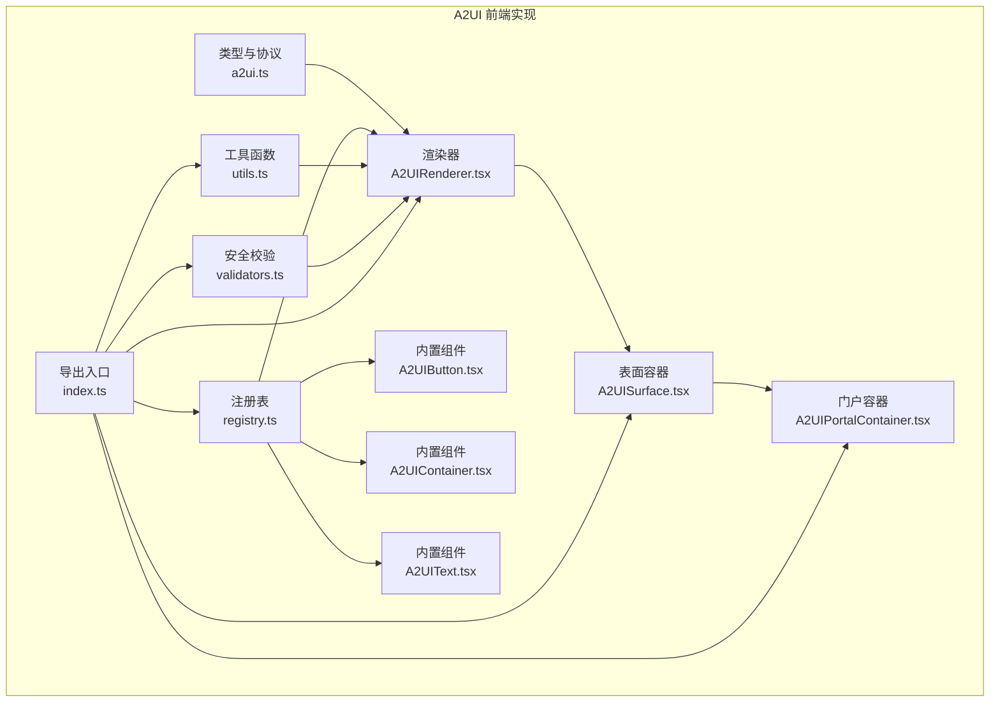
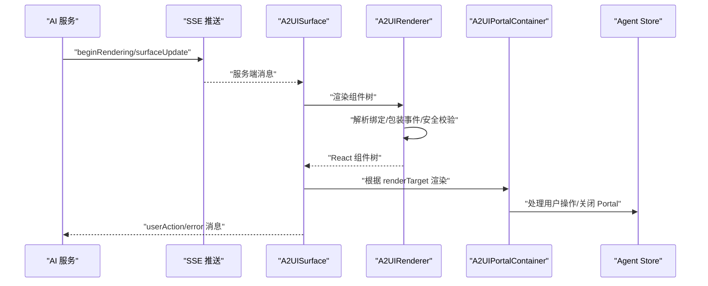
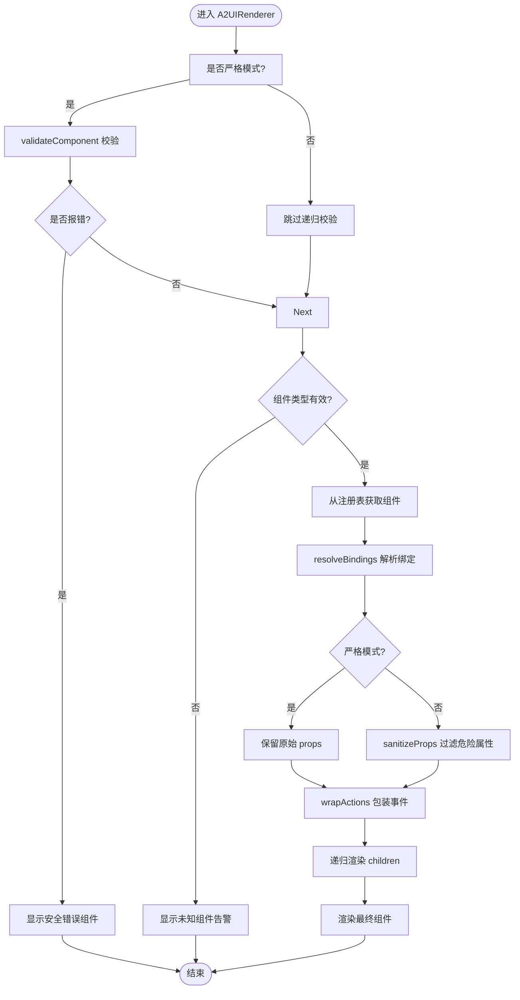
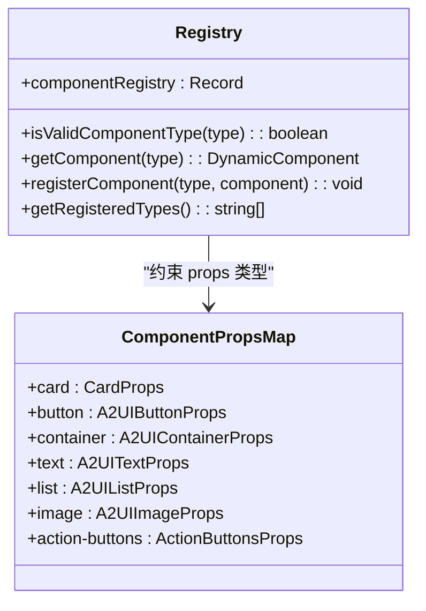
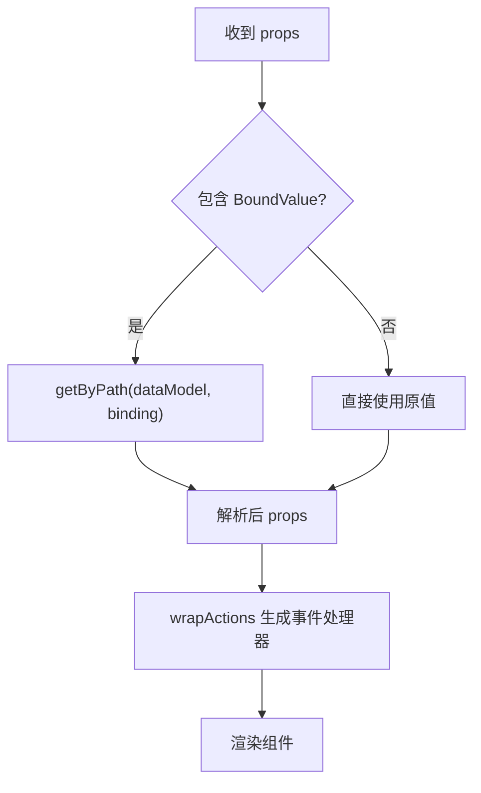
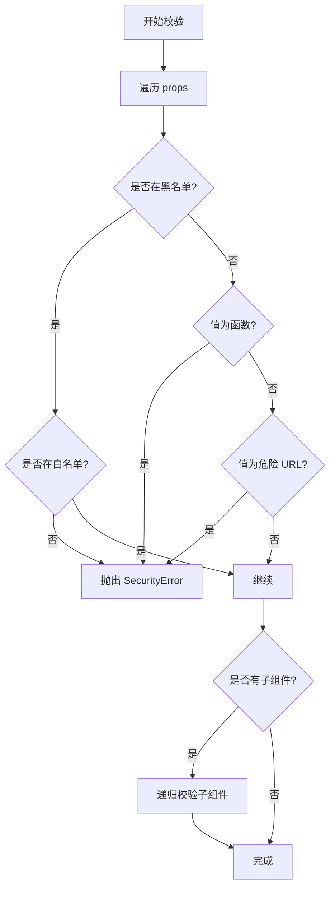
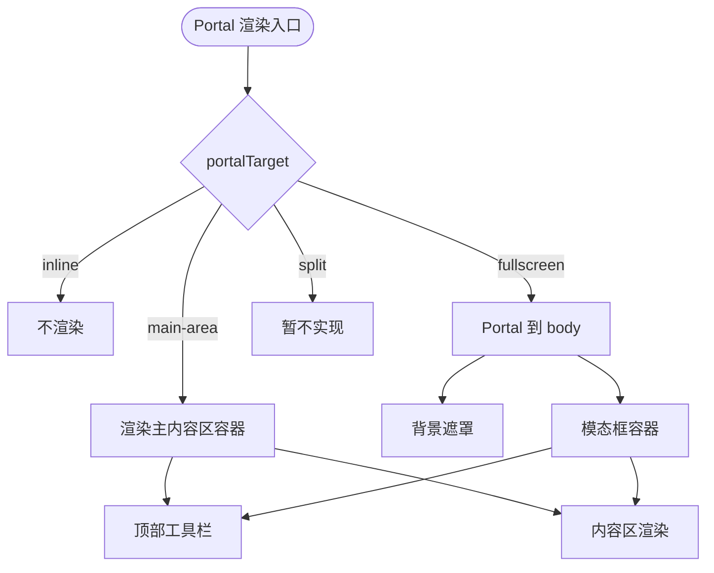
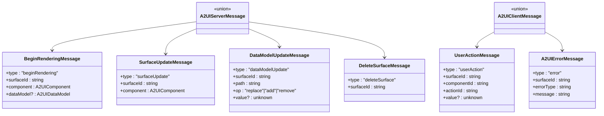
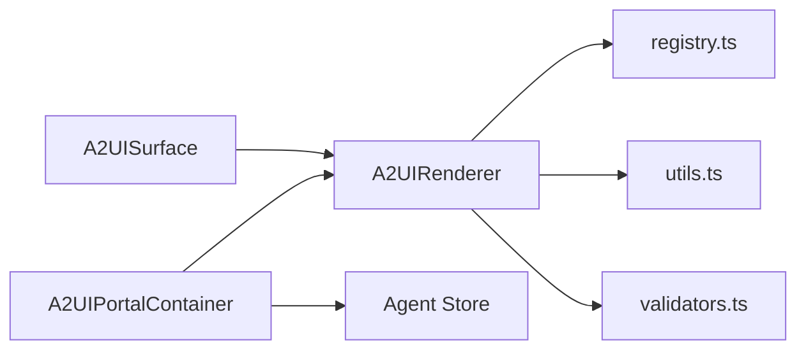

# A2UI 动态渲染系统

<cite>
**本文档引用的文件**
- [a2ui.ts](file://app/src/types/a2ui.ts)
- [A2UIRenderer.tsx](file://app/src/components/agent/a2ui/A2UIRenderer.tsx)
- [registry.ts](file://app/src/components/agent/a2ui/registry.ts)
- [utils.ts](file://app/src/components/agent/a2ui/utils.ts)
- [validators.ts](file://app/src/components/agent/a2ui/validators.ts)
- [A2UISurface.tsx](file://app/src/components/agent/a2ui/A2UISurface.tsx)
- [A2UIPortalContainer.tsx](file://app/src/components/agent/a2ui/A2UIPortalContainer.tsx)
- [index.ts](file://app/src/components/agent/a2ui/index.ts)
- [A2UIButton.tsx](file://app/src/components/agent/a2ui/components/A2UIButton.tsx)
- [A2UIContainer.tsx](file://app/src/components/agent/a2ui/components/A2UIContainer.tsx)
- [A2UIText.tsx](file://app/src/components/agent/a2ui/components/A2UIText.tsx)
- [tools.ts](file://app/supabase/functions/ai-assistant/tools.ts)
</cite>

## 目录
1. [简介](#简介)
2. [项目结构](#项目结构)
3. [核心组件](#核心组件)
4. [架构总览](#架构总览)
5. [详细组件分析](#详细组件分析)
6. [依赖关系分析](#依赖关系分析)
7. [性能考虑](#性能考虑)
8. [故障排查指南](#故障排查指南)
9. [结论](#结论)
10. [附录](#附录)

## 简介
A2UI（Agent-to-UI）协议旨在将 AI 生成的界面描述以标准化的消息格式下发至前端，由 A2UI Renderer 动态解析并渲染为 React 组件树。该系统通过“组件注册表 + 数据绑定 + 安全校验”的设计，实现从 AI 输出到动态 UI 的无缝转换，并提供多种渲染目标（内联、主内容区、全屏模态）与事件驱动的交互能力。

## 项目结构
A2UI 前端实现位于 app/src/components/agent/a2ui 目录，主要包含以下模块：
- 类型定义与协议：a2ui.ts
- 渲染器：A2UIRenderer.tsx
- 组件注册表：registry.ts
- 工具函数：utils.ts（路径解析、事件包装、深拷贝、ID 生成）
- 安全校验：validators.ts（危险属性过滤、URL 白名单、递归校验）
- 表面容器：A2UISurface.tsx（承载单个渲染树）
- 门户容器：A2UIPortalContainer.tsx（根据渲染目标渲染到主内容区或全屏）
- 导出入口：index.ts
- 内置组件：A2UIButton.tsx、A2UIContainer.tsx、A2UIText.tsx 等

图表来源
- [a2ui.ts:1-231](file://app/src/types/a2ui.ts#L1-L231)
- [A2UIRenderer.tsx:1-244](file://app/src/components/agent/a2ui/A2UIRenderer.tsx#L1-L244)
- [registry.ts:1-129](file://app/src/components/agent/a2ui/registry.ts#L1-L129)
- [utils.ts:1-172](file://app/src/components/agent/a2ui/utils.ts#L1-L172)
- [validators.ts:1-179](file://app/src/components/agent/a2ui/validators.ts#L1-L179)
- [A2UISurface.tsx:1-112](file://app/src/components/agent/a2ui/A2UISurface.tsx#L1-L112)
- [A2UIPortalContainer.tsx:1-167](file://app/src/components/agent/a2ui/A2UIPortalContainer.tsx#L1-L167)
- [index.ts:1-55](file://app/src/components/agent/a2ui/index.ts#L1-L55)

章节来源
- [a2ui.ts:1-231](file://app/src/types/a2ui.ts#L1-L231)
- [index.ts:1-55](file://app/src/components/agent/a2ui/index.ts#L1-L55)

## 核心组件
- A2UIRenderer：递归渲染组件树，负责组件类型校验、属性绑定解析、事件包装、子组件递归渲染与错误边界封装。
- A2UISurface：承载单个 Surface 的组件树与数据模型，统一处理用户操作消息与渲染错误。
- A2UIPortalContainer：根据渲染目标将内容渲染到主内容区或全屏模态，支持标题、关闭/最小化按钮与背景遮罩。
- 组件注册表：集中管理 A2UI 组件类型到 React 组件的映射，支持注册自定义组件。
- 工具函数：提供路径读取/写入/删除、绑定解析、事件包装、深拷贝与 ID 生成。
- 安全校验：过滤危险属性与 URL，支持白名单放行，提供严格/宽松两种模式。

章节来源
- [A2UIRenderer.tsx:1-244](file://app/src/components/agent/a2ui/A2UIRenderer.tsx#L1-L244)
- [A2UISurface.tsx:1-112](file://app/src/components/agent/a2ui/A2UISurface.tsx#L1-L112)
- [A2UIPortalContainer.tsx:1-167](file://app/src/components/agent/a2ui/A2UIPortalContainer.tsx#L1-L167)
- [registry.ts:1-129](file://app/src/components/agent/a2ui/registry.ts#L1-L129)
- [utils.ts:1-172](file://app/src/components/agent/a2ui/utils.ts#L1-L172)
- [validators.ts:1-179](file://app/src/components/agent/a2ui/validators.ts#L1-L179)

## 架构总览
A2UI 的工作流分为三部分：
- 消息协议：BeginRendering/SurfaceUpdate/DataModelUpdate/DeleteSurface（服务端 → 客户端）
- 渲染执行：A2UIRenderer 解析组件树，解析绑定，包装事件，递归渲染
- 交互回传：用户操作经 A2UISurface 包装为 UserActionMessage 回传给服务端

图表来源
- [A2UISurface.tsx:30-81](file://app/src/components/agent/a2ui/A2UISurface.tsx#L30-L81)
- [A2UIRenderer.tsx:91-171](file://app/src/components/agent/a2ui/A2UIRenderer.tsx#L91-L171)
- [A2UIPortalContainer.tsx:21-164](file://app/src/components/agent/a2ui/A2UIPortalContainer.tsx#L21-L164)
- [a2ui.ts:76-167](file://app/src/types/a2ui.ts#L76-L167)

## 详细组件分析

### A2UIRenderer 渲染器
职责与流程：
- 安全校验：严格模式下递归校验组件树；非严格模式对当前组件 props 做安全过滤。
- 组件匹配：通过注册表查找对应 React 组件。
- 数据绑定：将 props 中的 BoundValue 解析为 dataModel 中的实际值。
- 事件包装：将 actions 映射转换为 React 事件处理器，统一通过 onAction 回调。
- 子组件递归：遍历 children，重复上述步骤。
- 错误边界：A2UIRendererSafe 提供错误捕获与降级显示。

图表来源
- [A2UIRenderer.tsx:91-171](file://app/src/components/agent/a2ui/A2UIRenderer.tsx#L91-L171)
- [validators.ts:74-111](file://app/src/components/agent/a2ui/validators.ts#L74-L111)
- [utils.ts:84-132](file://app/src/components/agent/a2ui/utils.ts#L84-L132)
- [registry.ts:102-121](file://app/src/components/agent/a2ui/registry.ts#L102-L121)

章节来源
- [A2UIRenderer.tsx:1-244](file://app/src/components/agent/a2ui/A2UIRenderer.tsx#L1-L244)
- [validators.ts:1-179](file://app/src/components/agent/a2ui/validators.ts#L1-L179)
- [utils.ts:1-172](file://app/src/components/agent/a2ui/utils.ts#L1-L172)
- [registry.ts:1-129](file://app/src/components/agent/a2ui/registry.ts#L1-L129)

### 组件注册机制
- 内置组件：基础 UI（Card、Slider、Input、Progress、Badge）、布局组件（Container、List、Text、Image）、业务组件（ActionButtons）。
- 扩展点：registerComponent(type, component) 支持动态注册自定义组件，覆盖时给出警告。
- 类型安全：通过 ComponentPropsMap 在消费侧约束 props 类型。

图表来源
- [registry.ts:47-97](file://app/src/components/agent/a2ui/registry.ts#L47-L97)
- [index.ts:13-19](file://app/src/components/agent/a2ui/index.ts#L13-L19)

章节来源
- [registry.ts:1-129](file://app/src/components/agent/a2ui/registry.ts#L1-L129)
- [index.ts:1-55](file://app/src/components/agent/a2ui/index.ts#L1-L55)

### 数据绑定与事件处理
- 绑定解析：resolveBindings 将 { binding: "path.to.value" } 解析为 dataModel 中的实际值。
- 路径操作：getByPath/setByPath/deleteByPath 支持点号路径访问与修改。
- 事件包装：wrapActions 将 { click: "submit" } 转换为 onClick={(v)=>onAction(id,"submit",v)}。
- 深拷贝：deepMerge 用于安全合并对象属性。
- ID 生成：generateId 用于组件与 Surface 的唯一标识。

图表来源
- [utils.ts:84-132](file://app/src/components/agent/a2ui/utils.ts#L84-L132)
- [a2ui.ts:45-47](file://app/src/types/a2ui.ts#L45-L47)

章节来源
- [utils.ts:1-172](file://app/src/components/agent/a2ui/utils.ts#L1-L172)
- [a2ui.ts:1-231](file://app/src/types/a2ui.ts#L1-L231)

### 安全校验与风险控制
- 危险属性黑名单：DOM 事件、dangerouslySetInnerHTML、href/src/formAction 等。
- URL 白名单：image/photo/video 等组件允许特定属性放行。
- 严格模式：validateComponent 递归校验并抛出 SecurityError。
- 宽松模式：sanitizeProps 过滤危险项并记录日志。
- 校验工具：validateComponentTree 返回错误列表，便于批量诊断。

图表来源
- [validators.ts:74-111](file://app/src/components/agent/a2ui/validators.ts#L74-L111)
- [validators.ts:143-178](file://app/src/components/agent/a2ui/validators.ts#L143-L178)

章节来源
- [validators.ts:1-179](file://app/src/components/agent/a2ui/validators.ts#L1-L179)

### 渲染目标与门户容器
- 渲染目标：inline（内联）、main-area（主内容区覆盖）、fullscreen（全屏模态）、split（分屏，暂未实现）。
- 门户配置：showClose/showMinimize/backdrop/onClose/title。
- 主内容区：绝对定位覆盖，带顶部工具栏与滚动内容区。
- 全屏模态：Portal 渲染到 body，支持背景遮罩与点击关闭。

图表来源
- [A2UIPortalContainer.tsx:21-164](file://app/src/components/agent/a2ui/A2UIPortalContainer.tsx#L21-L164)
- [a2ui.ts:15-37](file://app/src/types/a2ui.ts#L15-L37)

章节来源
- [A2UIPortalContainer.tsx:1-167](file://app/src/components/agent/a2ui/A2UIPortalContainer.tsx#L1-L167)
- [a2ui.ts:1-231](file://app/src/types/a2ui.ts#L1-L231)

### 消息格式规范
- 服务端消息（Server → Client）：
  - beginRendering：创建新 Surface 并渲染初始组件树，可附带初始数据模型。
  - surfaceUpdate：替换指定 Surface 的组件树。
  - dataModelUpdate：基于 JSON Path 对 Surface 的数据模型进行增量更新（replace/add/remove）。
  - deleteSurface：删除指定 Surface。
- 客户端消息（Client → Server）：
  - userAction：用户在组件上触发的操作，携带 surfaceId/componentId/actionId/value。
  - error：客户端向服务端报告的错误信息。

图表来源
- [a2ui.ts:76-167](file://app/src/types/a2ui.ts#L76-L167)

章节来源
- [a2ui.ts:1-231](file://app/src/types/a2ui.ts#L1-L231)

### 组件开发示例与最佳实践
- 自定义组件扩展：
  - 在注册表中注册：registerComponent("my-button", MyButton)。
  - 通过 ComponentPropsMap 约束 props 类型，确保类型安全。
  - 在组件中处理数据绑定与事件，保持与 A2UI 约定一致。
- 集成现有组件：
  - 使用 A2UIButton/A2UIContainer/A2UIText 等内置组件，遵循 props 命名约定（如 text/content、variant/size/color）。
  - 通过 actions 映射事件，避免直接传递 React 事件处理器。
- 生命周期与状态同步：
  - 使用 Surface 管理组件树与数据模型，通过 dataModelUpdate 实现增量更新。
  - 在严格模式下进行安全校验，确保渲染稳定性。
- 事件处理与状态同步：
  - 通过 wrapActions 统一封装事件，确保 actionId 与组件 ID 的一致性。
  - 在 A2UISurface 中收集 userAction 并回传服务端，实现前后端状态同步。

章节来源
- [registry.ts:113-121](file://app/src/components/agent/a2ui/registry.ts#L113-L121)
- [utils.ts:111-132](file://app/src/components/agent/a2ui/utils.ts#L111-L132)
- [A2UISurface.tsx:38-63](file://app/src/components/agent/a2ui/A2UISurface.tsx#L38-L63)
- [validators.ts:74-111](file://app/src/components/agent/a2ui/validators.ts#L74-L111)

## 依赖关系分析
- A2UIRenderer 依赖：
  - 注册表：组件类型到 React 组件的映射。
  - 工具函数：绑定解析、事件包装、深拷贝、ID 生成。
  - 安全校验：严格/宽松两种模式下的安全策略。
- A2UISurface 依赖：
  - A2UIRendererSafe：带错误边界的渲染器。
  - 用户回调：onAction/onError。
- A2UIPortalContainer 依赖：
  - Agent Store：读取 portalContent/portalTarget/portalDataModel，调用 closePortal/handleUserAction。
  - A2UIRenderer：渲染内容。

图表来源
- [A2UIRenderer.tsx:9-11](file://app/src/components/agent/a2ui/A2UIRenderer.tsx#L9-L11)
- [A2UISurface.tsx](file://app/src/components/agent/a2ui/A2UISurface.tsx#L9)
- [A2UIPortalContainer.tsx:9-26](file://app/src/components/agent/a2ui/A2UIPortalContainer.tsx#L9-L26)

章节来源
- [A2UIRenderer.tsx:1-244](file://app/src/components/agent/a2ui/A2UIRenderer.tsx#L1-L244)
- [A2UISurface.tsx:1-112](file://app/src/components/agent/a2ui/A2UISurface.tsx#L1-L112)
- [A2UIPortalContainer.tsx:1-167](file://app/src/components/agent/a2ui/A2UIPortalContainer.tsx#L1-L167)

## 性能考虑
- 渲染优化：
  - 使用 useMemo 缓存安全校验结果，避免重复计算。
  - 严格模式下递归校验成本较高，建议在交互密集场景使用非严格模式并配合 sanitizeProps。
- 绑定解析：
  - resolveBindings 会遍历 props，建议减少不必要的绑定层级，优先使用简单路径。
- 事件包装：
  - wrapActions 为每个组件生成事件处理器，注意避免在 props 中传递大对象导致重渲染。
- 错误边界：
  - A2UIRendererSafe 提供错误捕获，建议在关键 Surface 上启用，避免单点崩溃影响全局。

## 故障排查指南
- 未知组件类型：
  - 现象：渲染为未知组件告警。
  - 排查：确认组件类型是否已在注册表中注册，或通过 registerComponent 扩展。
- 安全校验失败：
  - 现象：显示安全错误组件或抛出 SecurityError。
  - 排查：检查 props 中是否存在危险属性或危险 URL；必要时调整为白名单组件或使用安全替代方案。
- 绑定值为空：
  - 现象：绑定解析后值为 undefined。
  - 排查：确认 dataModel 中存在对应路径，检查绑定路径是否正确。
- 事件未触发：
  - 现象：用户操作无响应。
  - 排查：确认 actions 映射是否正确，事件名称是否符合 wrapActions 的命名规则（click→onClick）。
- Portal 无法关闭：
  - 现象：ESC 键无效或关闭按钮不可用。
  - 排查：检查 portalConfig 中 showClose/onClose 配置，确认 Agent Store 的 closePortal/handleUserAction 是否正确调用。

章节来源
- [A2UIRenderer.tsx:134-143](file://app/src/components/agent/a2ui/A2UIRenderer.tsx#L134-L143)
- [validators.ts:58-68](file://app/src/components/agent/a2ui/validators.ts#L58-L68)
- [utils.ts:84-102](file://app/src/components/agent/a2ui/utils.ts#L84-L102)
- [A2UIPortalContainer.tsx:29-44](file://app/src/components/agent/a2ui/A2UIPortalContainer.tsx#L29-L44)

## 结论
A2UI 动态渲染系统通过标准化的消息协议、严格的安全部署与灵活的组件注册机制，实现了从 AI 输出到动态 UI 的高效转换。其核心优势在于：
- 类型安全与安全校验：通过严格/宽松双模式保障渲染安全。
- 组件生态：内置丰富组件与开放扩展点，满足多样化业务需求。
- 渲染目标多样：支持内联、主内容区覆盖与全屏模态，适配不同交互场景。
- 事件与状态同步：统一的事件包装与消息回传机制，确保前后端协同一致。

## 附录
- 服务端集成参考：AI Assistant 工具通过 SSE 推送 beginRendering 消息，包含组件树与数据模型，前端据此创建 Surface 并渲染。
  
章节来源
- [tools.ts:79-113](file://app/supabase/functions/ai-assistant/tools.ts#L79-L113)