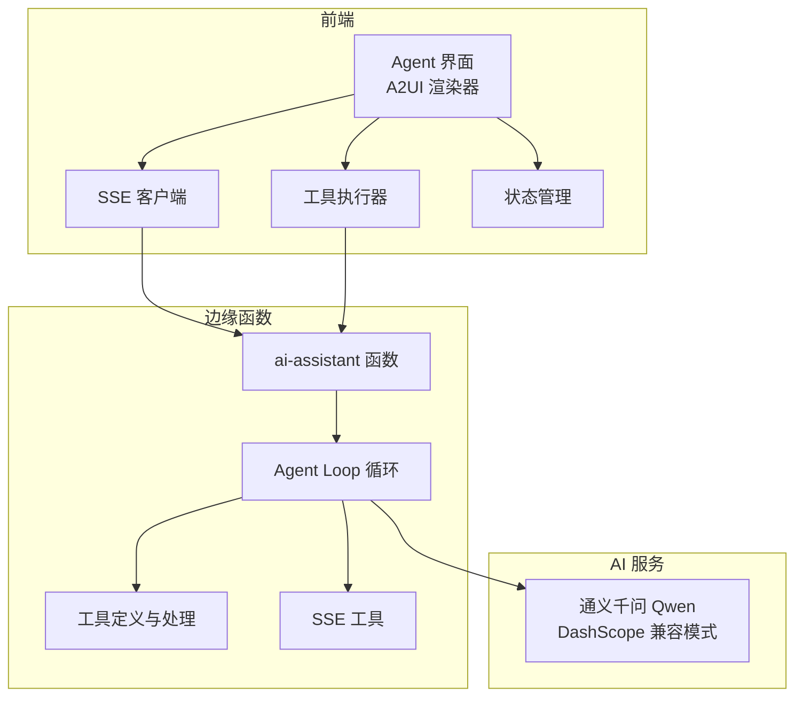
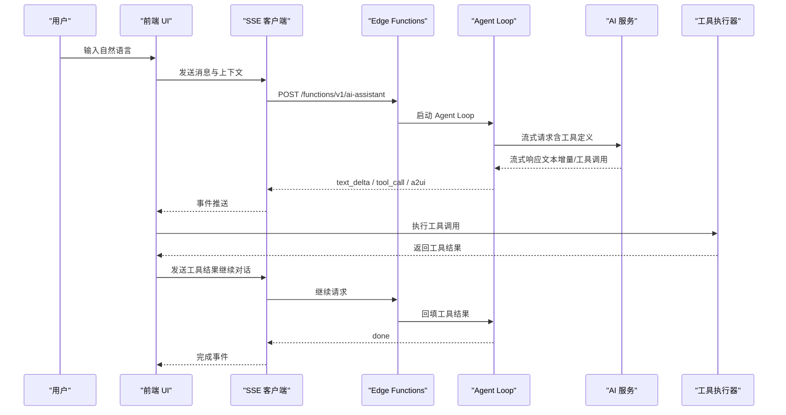
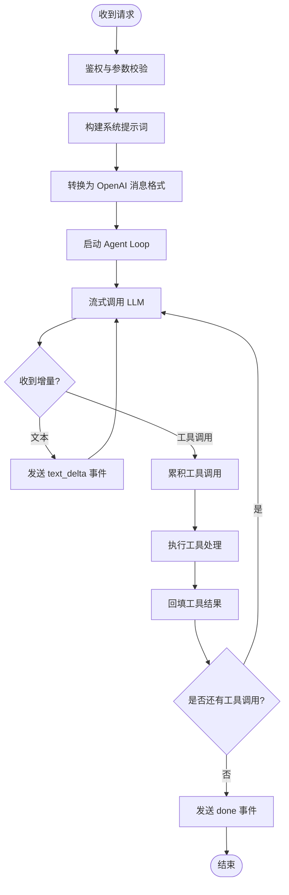
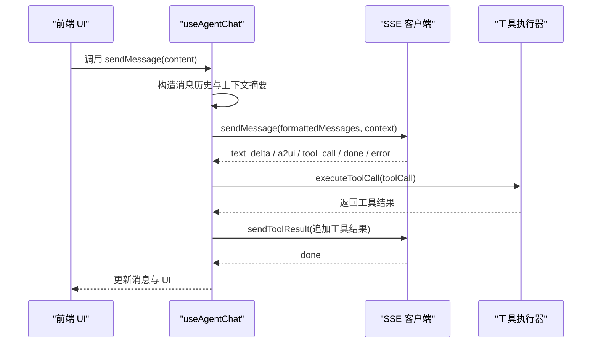
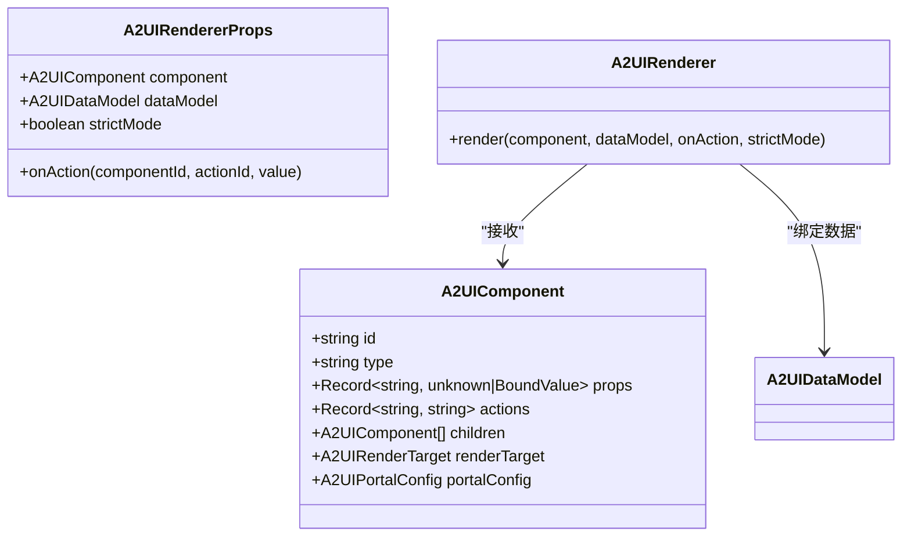
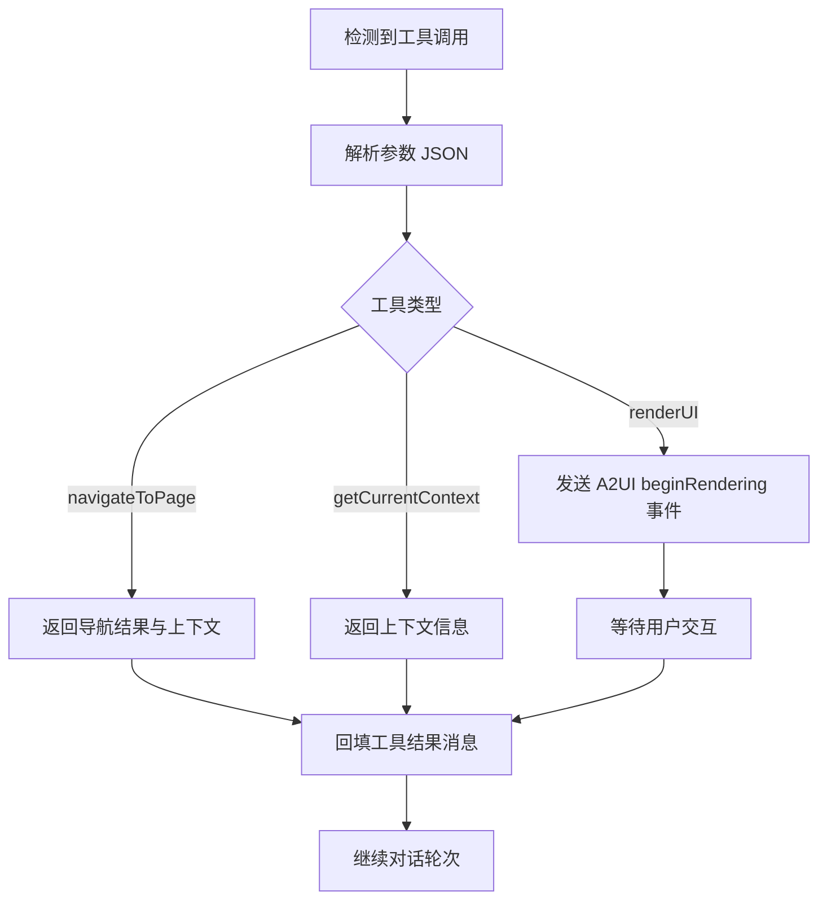
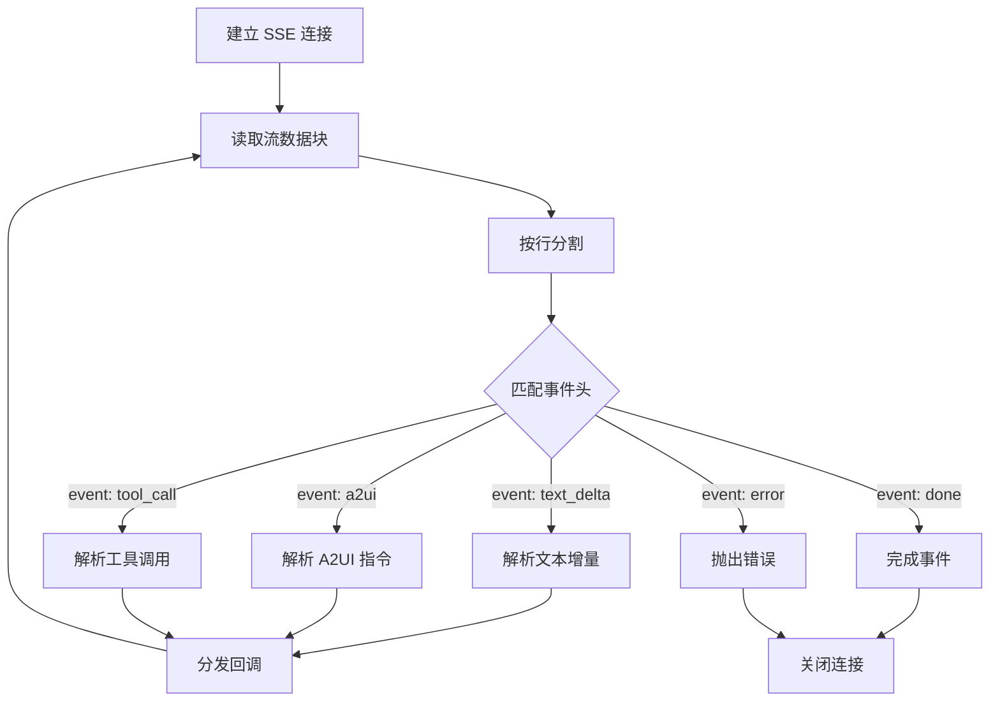
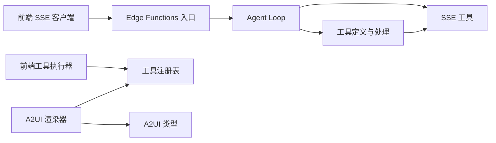

# Agent Studio 系统

<cite>
**本文引用的文件**
- [app/supabase/functions/ai-assistant/index.ts](file://app/supabase/functions/ai-assistant/index.ts)
- [app/supabase/functions/ai-assistant/sse.ts](file://app/supabase/functions/ai-assistant/sse.ts)
- [app/supabase/functions/ai-assistant/tools.ts](file://app/supabase/functions/ai-assistant/tools.ts)
- [app/supabase/functions/ai-assistant/agentLoop.ts](file://app/supabase/functions/ai-assistant/agentLoop.ts)
- [app/supabase/functions/ai-assistant/types.ts](file://app/supabase/functions/ai-assistant/types.ts)
- [app/src/types/a2ui.ts](file://app/src/types/a2ui.ts)
- [app/src/components/agent/a2ui/index.ts](file://app/src/components/agent/a2ui/index.ts)
- [app/src/components/agent/a2ui/A2UIRenderer.tsx](file://app/src/components/agent/a2ui/A2UIRenderer.tsx)
- [app/src/hooks/useAgentChat.ts](file://app/src/hooks/useAgentChat.ts)
- [app/src/lib/agent/sseClient.ts](file://app/src/lib/agent/sseClient.ts)
- [app/src/lib/agent/toolExecutor.ts](file://app/src/lib/agent/toolExecutor.ts)
- [app/src/lib/agent/tools/index.ts](file://app/src/lib/agent/tools/index.ts)
- [app/src/services/data/DataService.ts](file://app/src/services/data/DataService.ts)
</cite>

## 目录
1. [引言](#引言)
2. [项目结构](#项目结构)
3. [核心组件](#核心组件)
4. [架构总览](#架构总览)
5. [详细组件分析](#详细组件分析)
6. [依赖关系分析](#依赖关系分析)
7. [性能考虑](#性能考虑)
8. [故障排查指南](#故障排查指南)
9. [结论](#结论)
10. [附录](#附录)

## 引言
Agent Studio 是一个基于边缘函数（Edge Functions）与前端实时流式通信的智能代理系统，提供自然语言驱动的交互体验与动态 UI 渲染能力。其核心特性包括：
- A2UI 动态 UI 协议：通过服务端生成组件树，前端以安全渲染器即时呈现，支持多种渲染目标与交互动作。
- 自然语言驱动的交互：用户以自然语言提问或表达意图，系统通过工具链式调用完成导航、上下文查询与界面渲染。
- SSE（Server-Sent Events）流式通信：前端以长连接订阅事件流，逐步接收文本增量、工具调用与 UI 渲染指令，提升交互流畅度与实时性。
- 工具链式调用：系统在多轮对话中识别工具调用，累积参数并回填结果，形成“思考→行动→反馈”的闭环。
- Edge Functions 集成：基于 Supabase Edge Functions 的 ai-assistant 函数，统一接入 AI 服务（兼容 OpenAI 接口），负责消息转换、工具定义与流式输出。

## 项目结构
系统采用前后端分离与模块化设计：
- 前端（React + TypeScript）：负责 UI 渲染、SSE 客户端、工具执行器与状态管理。
- 后端（Edge Functions）：提供 ai-assistant 函数，封装 AI 服务调用、工具处理与 SSE 输出。
- 数据层：统一数据访问服务，支持本地 IndexedDB 与云端 Supabase 的一致性与离线队列。

图表来源
- [app/src/lib/agent/sseClient.ts:246-481](file://app/src/lib/agent/sseClient.ts#L246-L481)
- [app/src/lib/agent/toolExecutor.ts:39-64](file://app/src/lib/agent/toolExecutor.ts#L39-L64)
- [app/supabase/functions/ai-assistant/index.ts:22-113](file://app/supabase/functions/ai-assistant/index.ts#L22-L113)
- [app/supabase/functions/ai-assistant/agentLoop.ts:21-137](file://app/supabase/functions/ai-assistant/agentLoop.ts#L21-L137)
- [app/supabase/functions/ai-assistant/tools.ts:10-77](file://app/supabase/functions/ai-assistant/tools.ts#L10-L77)
- [app/supabase/functions/ai-assistant/sse.ts:26-39](file://app/supabase/functions/ai-assistant/sse.ts#L26-L39)

章节来源
- [app/src/lib/agent/sseClient.ts:1-484](file://app/src/lib/agent/sseClient.ts#L1-L484)
- [app/src/lib/agent/toolExecutor.ts:1-67](file://app/src/lib/agent/toolExecutor.ts#L1-L67)
- [app/supabase/functions/ai-assistant/index.ts:1-116](file://app/supabase/functions/ai-assistant/index.ts#L1-L116)
- [app/supabase/functions/ai-assistant/agentLoop.ts:1-138](file://app/supabase/functions/ai-assistant/agentLoop.ts#L1-L138)
- [app/supabase/functions/ai-assistant/tools.ts:1-191](file://app/supabase/functions/ai-assistant/tools.ts#L1-L191)
- [app/supabase/functions/ai-assistant/sse.ts:1-180](file://app/supabase/functions/ai-assistant/sse.ts#L1-L180)

## 核心组件
- Edge Functions 入口与路由：负责鉴权、请求校验、构建系统提示词、启动 Agent Loop，并以 SSE 输出事件流。
- Agent Loop：封装 LLM 调用与工具循环，支持流式增量输出、工具调用累积与结果回填。
- SSE 工具：提供 SSE 写入器、消息格式转换、工具调用累积与系统提示词构建。
- 工具定义与处理：声明可用工具（导航、上下文查询、A2UI 渲染），并处理工具调用与结果封装。
- 前端 SSE 客户端：解析事件流、调度回调、支持自动重试与中断控制。
- 工具执行器：桥接前端工具调用与实际业务逻辑，集中暴露可用工具清单。
- A2UI 协议与渲染器：定义组件树、消息协议与渲染目标，前端安全渲染组件树并处理用户动作。
- 状态与集成：useAgentChat 将 SSE、工具执行与状态管理整合，提供统一的对话能力。

章节来源
- [app/supabase/functions/ai-assistant/index.ts:22-113](file://app/supabase/functions/ai-assistant/index.ts#L22-L113)
- [app/supabase/functions/ai-assistant/agentLoop.ts:21-137](file://app/supabase/functions/ai-assistant/agentLoop.ts#L21-L137)
- [app/supabase/functions/ai-assistant/sse.ts:26-179](file://app/supabase/functions/ai-assistant/sse.ts#L26-L179)
- [app/supabase/functions/ai-assistant/tools.ts:10-191](file://app/supabase/functions/ai-assistant/tools.ts#L10-L191)
- [app/src/lib/agent/sseClient.ts:246-481](file://app/src/lib/agent/sseClient.ts#L246-L481)
- [app/src/lib/agent/toolExecutor.ts:39-64](file://app/src/lib/agent/toolExecutor.ts#L39-L64)
- [app/src/types/a2ui.ts:1-231](file://app/src/types/a2ui.ts#L1-L231)
- [app/src/components/agent/a2ui/A2UIRenderer.tsx:77-171](file://app/src/components/agent/a2ui/A2UIRenderer.tsx#L77-L171)
- [app/src/hooks/useAgentChat.ts:47-377](file://app/src/hooks/useAgentChat.ts#L47-L377)

## 架构总览
Agent Studio 的交互流程如下：
- 用户通过前端输入自然语言消息，useAgentChat 构造消息历史与上下文摘要，调用 SSE 客户端发送至 Edge Functions。
- Edge Functions 验证用户身份与请求合法性，构建系统提示词与 OpenAI 格式消息，启动 Agent Loop。
- Agent Loop 流式调用 LLM，前端 SSE 客户端持续接收 text_delta 与 a2ui 事件。
- 当 LLM 产生工具调用时，Agent Loop 累积参数并回填工具结果；若工具返回 A2UI 组件，前端渲染器即时呈现。
- 对话完成后，前端更新消息状态，工具执行器按序执行待处理工具调用并回填结果。

图表来源
- [app/src/hooks/useAgentChat.ts:299-377](file://app/src/hooks/useAgentChat.ts#L299-L377)
- [app/src/lib/agent/sseClient.ts:369-410](file://app/src/lib/agent/sseClient.ts#L369-L410)
- [app/supabase/functions/ai-assistant/index.ts:82-100](file://app/supabase/functions/ai-assistant/index.ts#L82-L100)
- [app/supabase/functions/ai-assistant/agentLoop.ts:42-131](file://app/supabase/functions/ai-assistant/agentLoop.ts#L42-L131)
- [app/src/lib/agent/toolExecutor.ts:40-43](file://app/src/lib/agent/toolExecutor.ts#L40-L43)

## 详细组件分析

### Edge Functions：ai-assistant 入口与 Agent Loop
- 入口职责：鉴权（Supabase）、参数校验、构建系统提示词、启动 SSE 写入器与 Agent Loop。
- Agent Loop：封装 LLM 调用（流式）、工具调用累积、结果回填与完成事件。
- 工具处理：根据工具名执行对应逻辑，渲染 A2UI 组件或返回导航/上下文信息。
- SSE 工具：提供跨域头、SSE 写入器、消息格式转换与工具调用累积。

图表来源
- [app/supabase/functions/ai-assistant/index.ts:66-98](file://app/supabase/functions/ai-assistant/index.ts#L66-L98)
- [app/supabase/functions/ai-assistant/agentLoop.ts:42-131](file://app/supabase/functions/ai-assistant/agentLoop.ts#L42-L131)
- [app/supabase/functions/ai-assistant/sse.ts:26-39](file://app/supabase/functions/ai-assistant/sse.ts#L26-L39)
- [app/supabase/functions/ai-assistant/tools.ts:161-191](file://app/supabase/functions/ai-assistant/tools.ts#L161-L191)

章节来源
- [app/supabase/functions/ai-assistant/index.ts:22-113](file://app/supabase/functions/ai-assistant/index.ts#L22-L113)
- [app/supabase/functions/ai-assistant/agentLoop.ts:21-137](file://app/supabase/functions/ai-assistant/agentLoop.ts#L21-L137)
- [app/supabase/functions/ai-assistant/sse.ts:26-179](file://app/supabase/functions/ai-assistant/sse.ts#L26-L179)
- [app/supabase/functions/ai-assistant/tools.ts:10-191](file://app/supabase/functions/ai-assistant/tools.ts#L10-L191)
- [app/supabase/functions/ai-assistant/types.ts:7-55](file://app/supabase/functions/ai-assistant/types.ts#L7-L55)

### 前端：SSE 客户端与工具执行器
- SSE 客户端：解析事件流、支持自动重试、中断控制与错误处理；将事件分发给上层回调。
- 工具执行器：统一暴露工具清单与执行入口，简化前端调用；支持批量执行与元数据查询。
- useAgentChat：整合 SSE、工具执行与状态管理，提供 sendMessage、abort、isStreaming 等能力。

图表来源
- [app/src/hooks/useAgentChat.ts:299-377](file://app/src/hooks/useAgentChat.ts#L299-L377)
- [app/src/lib/agent/sseClient.ts:369-410](file://app/src/lib/agent/sseClient.ts#L369-L410)
- [app/src/lib/agent/toolExecutor.ts:39-64](file://app/src/lib/agent/toolExecutor.ts#L39-L64)

章节来源
- [app/src/lib/agent/sseClient.ts:246-481](file://app/src/lib/agent/sseClient.ts#L246-L481)
- [app/src/lib/agent/toolExecutor.ts:1-67](file://app/src/lib/agent/toolExecutor.ts#L1-L67)
- [app/src/hooks/useAgentChat.ts:47-377](file://app/src/hooks/useAgentChat.ts#L47-L377)

### A2UI 协议与渲染系统
- 协议定义：包含渲染目标（内联、主内容区、全屏、分屏）、Portal 配置、组件树、数据模型与消息类型。
- 渲染器：安全校验组件类型与属性，解析数据绑定，包装事件处理器，递归渲染子组件。
- 组件注册：统一注册表管理内置组件类型，支持校验与获取组件实现。
- 业务组件：提供按钮、容器、列表、文本、图片等基础与业务组件。

图表来源
- [app/src/types/a2ui.ts:53-68](file://app/src/types/a2ui.ts#L53-L68)
- [app/src/types/a2ui.ts:226-231](file://app/src/types/a2ui.ts#L226-L231)
- [app/src/components/agent/a2ui/A2UIRenderer.tsx:77-171](file://app/src/components/agent/a2ui/A2UIRenderer.tsx#L77-L171)

章节来源
- [app/src/types/a2ui.ts:1-231](file://app/src/types/a2ui.ts#L1-L231)
- [app/src/components/agent/a2ui/A2UIRenderer.tsx:1-244](file://app/src/components/agent/a2ui/A2UIRenderer.tsx#L1-L244)
- [app/src/components/agent/a2ui/index.ts:1-55](file://app/src/components/agent/a2ui/index.ts#L1-L55)

### 工具链式调用工作流
- 工具定义：以 OpenAI function 格式声明工具，包含名称、描述与参数约束。
- 工具处理：根据工具名执行对应逻辑；对于 A2UI 渲染，直接通过 SSE 发送 beginRendering 事件；对于导航与上下文查询，返回富结果并标记下一步建议。
- Agent Loop：累积工具调用参数，解析 JSON，执行工具并回填结果；若工具返回 UI 组件，前端即时渲染。

图表来源
- [app/supabase/functions/ai-assistant/tools.ts:161-191](file://app/supabase/functions/ai-assistant/tools.ts#L161-L191)
- [app/supabase/functions/ai-assistant/agentLoop.ts:89-113](file://app/supabase/functions/ai-assistant/agentLoop.ts#L89-L113)
- [app/src/hooks/useAgentChat.ts:137-219](file://app/src/hooks/useAgentChat.ts#L137-L219)

章节来源
- [app/supabase/functions/ai-assistant/tools.ts:10-191](file://app/supabase/functions/ai-assistant/tools.ts#L10-L191)
- [app/supabase/functions/ai-assistant/agentLoop.ts:42-131](file://app/supabase/functions/ai-assistant/agentLoop.ts#L42-L131)
- [app/src/hooks/useAgentChat.ts:137-219](file://app/src/hooks/useAgentChat.ts#L137-L219)

### SSE（Server-Sent Events）流式通信机制
- 事件类型：text_delta（文本增量）、a2ui（A2UI 渲染指令）、tool_call（工具调用）、done（完成）、error（错误）。
- 前端解析：按行解析 event 与 data，组装事件对象并分发给回调。
- 自动重试：指数退避重试，支持中断与错误上报。
- 中断控制：H2A 异步转向，用户可随时中断当前任务。

图表来源
- [app/src/lib/agent/sseClient.ts:152-198](file://app/src/lib/agent/sseClient.ts#L152-L198)
- [app/src/lib/agent/sseClient.ts:270-306](file://app/src/lib/agent/sseClient.ts#L270-L306)
- [app/src/lib/agent/sseClient.ts:311-410](file://app/src/lib/agent/sseClient.ts#L311-L410)

章节来源
- [app/src/lib/agent/sseClient.ts:1-484](file://app/src/lib/agent/sseClient.ts#L1-L484)

## 依赖关系分析
- 前端依赖 Edge Functions 的 ai-assistant 函数，通过 Supabase Gateway 调用。
- Agent Loop 依赖工具定义与 SSE 工具，工具处理依赖 A2UI 协议与系统提示词。
- 前端渲染器依赖 A2UI 类型与组件注册表，工具执行器依赖工具注册表与导航回调。

图表来源
- [app/src/lib/agent/sseClient.ts:317-327](file://app/src/lib/agent/sseClient.ts#L317-L327)
- [app/supabase/functions/ai-assistant/index.ts:82-100](file://app/supabase/functions/ai-assistant/index.ts#L82-L100)
- [app/supabase/functions/ai-assistant/agentLoop.ts:13-14](file://app/supabase/functions/ai-assistant/agentLoop.ts#L13-L14)
- [app/supabase/functions/ai-assistant/tools.ts:10-77](file://app/supabase/functions/ai-assistant/tools.ts#L10-L77)
- [app/src/types/a2ui.ts:1-231](file://app/src/types/a2ui.ts#L1-L231)
- [app/src/components/agent/a2ui/index.ts:12-19](file://app/src/components/agent/a2ui/index.ts#L12-L19)

章节来源
- [app/src/lib/agent/sseClient.ts:1-484](file://app/src/lib/agent/sseClient.ts#L1-L484)
- [app/supabase/functions/ai-assistant/index.ts:1-116](file://app/supabase/functions/ai-assistant/index.ts#L1-L116)
- [app/supabase/functions/ai-assistant/agentLoop.ts:1-138](file://app/supabase/functions/ai-assistant/agentLoop.ts#L1-L138)
- [app/supabase/functions/ai-assistant/tools.ts:1-191](file://app/supabase/functions/ai-assistant/tools.ts#L1-L191)
- [app/src/types/a2ui.ts:1-231](file://app/src/types/a2ui.ts#L1-L231)
- [app/src/components/agent/a2ui/index.ts:1-55](file://app/src/components/agent/a2ui/index.ts#L1-L55)

## 性能考虑
- 流式传输：SSE 逐段推送文本与事件，降低首字节延迟，提升感知速度。
- 工具累积：Agent Loop 在内存中累积工具参数，减少网络往返与重复调用。
- 前端渲染：A2UI 渲染器支持严格模式与安全过滤，避免不必要重渲染与 XSS 风险。
- 离线与一致性：数据层通过本地缓存与云端同步结合，保障在网络不稳定场景下的用户体验。

## 故障排查指南
- 未登录或会话过期：SSE 客户端在获取访问令牌时失败，需重新登录。
- 请求被中断：用户点击中断按钮，前端会触发 AbortController，Edge Functions 捕获并发送中断事件。
- 工具参数解析失败：Agent Loop 在解析工具参数 JSON 时失败，记录告警并继续后续流程。
- SSE 解析异常：前端解析事件行时出现异常，记录错误并尝试继续解析后续事件。
- Edge 函数错误：Edge Functions 在处理过程中抛出错误，通过 SSE 发送 error 事件并关闭连接。

章节来源
- [app/src/lib/agent/sseClient.ts:257-265](file://app/src/lib/agent/sseClient.ts#L257-L265)
- [app/src/lib/agent/sseClient.ts:392-408](file://app/src/lib/agent/sseClient.ts#L392-L408)
- [app/supabase/functions/ai-assistant/agentLoop.ts:94-98](file://app/supabase/functions/ai-assistant/agentLoop.ts#L94-L98)
- [app/src/lib/agent/sseClient.ts:140-144](file://app/src/lib/agent/sseClient.ts#L140-L144)
- [app/supabase/functions/ai-assistant/index.ts:101-112](file://app/supabase/functions/ai-assistant/index.ts#L101-L112)

## 结论
Agent Studio 通过 Edge Functions 与前端实时流式通信，实现了自然语言驱动的智能代理体验。A2UI 协议与渲染系统提供了灵活的动态界面生成能力；工具链式调用确保了从“思考”到“行动”的闭环；SSE 流式通信提升了交互的实时性与流畅度。整体架构清晰、模块解耦，便于扩展与维护。

## 附录
- 使用示例与最佳实践
  - 自然语言交互：用户以自然语言提问，系统自动识别意图并可能触发 A2UI 渲染或工具调用。
  - A2UI 渲染：当需要用户选择或确认时，系统通过 renderUI 生成组件树，前端安全渲染并等待用户交互。
  - 工具调用：导航到指定页面、获取当前上下文或执行业务操作，工具返回富结果并建议下一步。
  - 错误处理：前端捕获 SSE 错误并提示用户，支持自动重试与手动重试。
  - 中断控制：用户可随时中断当前任务，系统清理状态并提示已中断。
- 数据一致性与离线支持：通过统一数据访问服务实现本地缓存与云端同步，保障在网络波动下的稳定性。