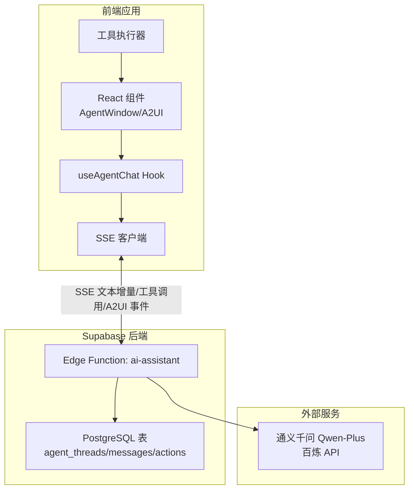
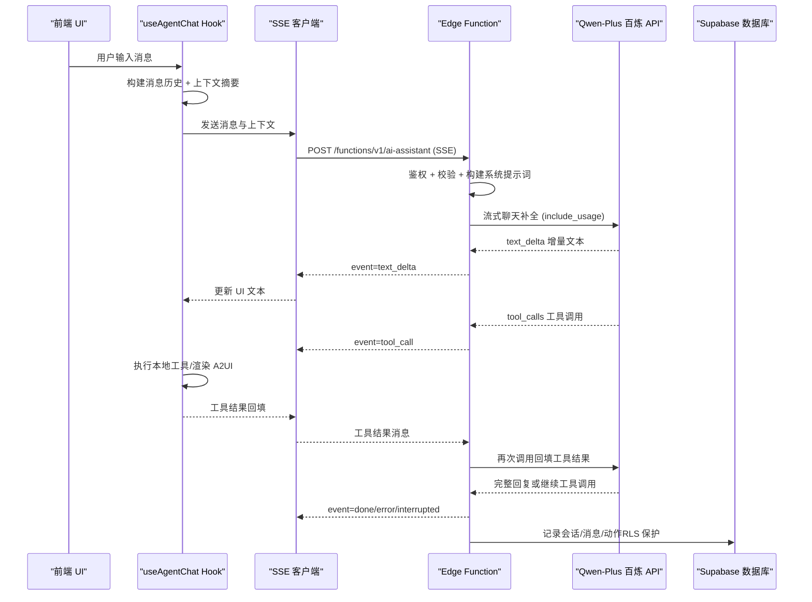
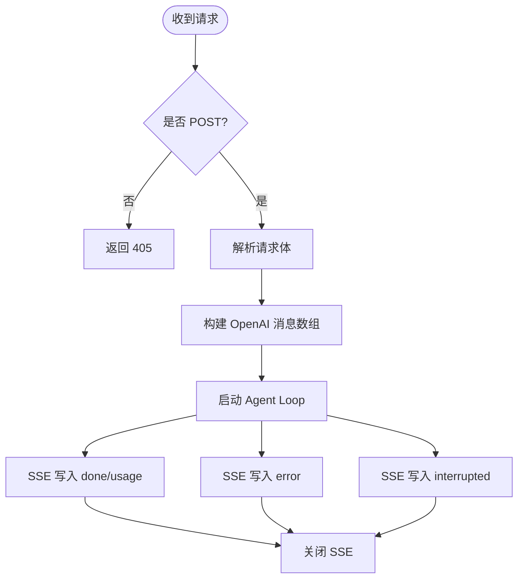
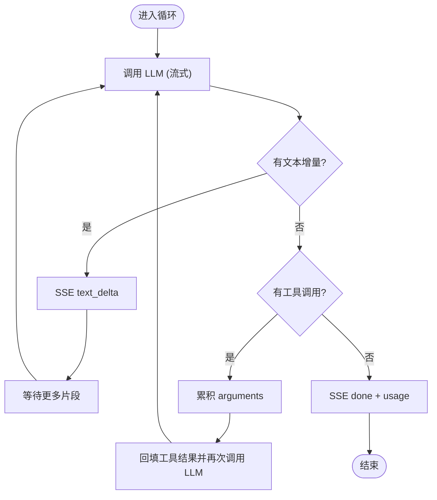
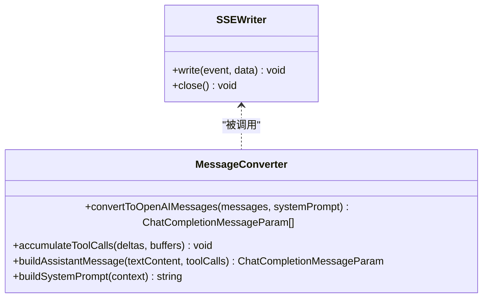
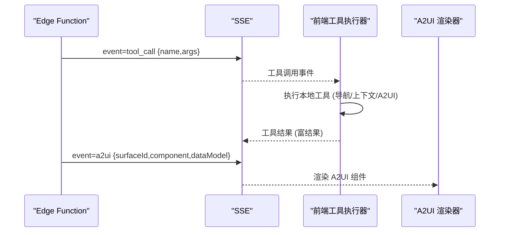
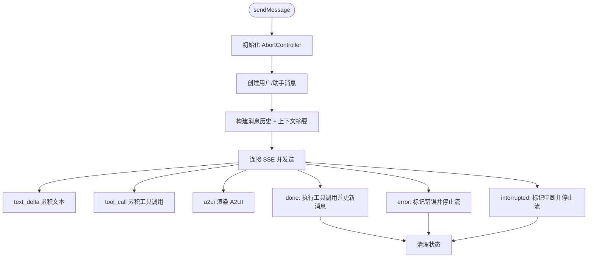
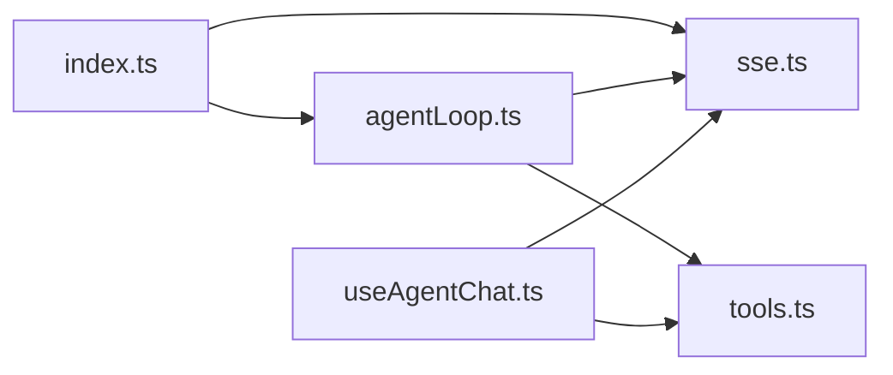

# Edge Functions 集成

<cite>
**本文引用的文件**
- [index.ts](file://app/supabase/functions/ai-assistant/index.ts)
- [agentLoop.ts](file://app/supabase/functions/ai-assistant/agentLoop.ts)
- [sse.ts](file://app/supabase/functions/ai-assistant/sse.ts)
- [tools.ts](file://app/supabase/functions/ai-assistant/tools.ts)
- [types.ts](file://app/supabase/functions/ai-assistant/types.ts)
- [useAgentChat.ts](file://app/src/hooks/useAgentChat.ts)
- [setup.sql](file://app/supabase/setup.sql)
- [API.md](file://docs/API.md)
- [Architecture.md](file://docs/Architecture.md)
- [env.local.example](file://app/env.local.example)
- [ALIYUN-DEPLOY.md](file://ALIYUN-DEPLOY.md)
- [package.json](file://app/package.json)
</cite>

## 目录
1. [引言](#引言)
2. [项目结构](#项目结构)
3. [核心组件](#核心组件)
4. [架构总览](#架构总览)
5. [详细组件分析](#详细组件分析)
6. [依赖分析](#依赖分析)
7. [性能考虑](#性能考虑)
8. [故障排除指南](#故障排除指南)
9. [结论](#结论)
10. [附录](#附录)

## 引言
本文件系统性阐述 Supabase Edge Functions 在 Agent Studio 中的集成方案，聚焦 AI Assistant 函数的架构设计与实现要点，包括代理循环处理、SSE 响应生成、工具调用执行等核心能力；梳理函数间的数据流转机制（消息传递、状态管理、错误传播）；明确部署与配置要求（环境变量、权限策略、监控指标）；解释与前端的通信协议（请求格式、响应结构、认证机制）；并提供扩展开发示例与调试排障建议。

## 项目结构
本项目采用“前端 React 应用 + Supabase 后端 + Edge Functions”的三层架构。AI Assistant 作为 Edge Function 部署在 Supabase 上，前端通过 SSE 与之进行流式通信，并在本地执行工具调用，最终驱动 A2UI 动态渲染。

图表来源
- [Architecture.md: 22-107:22-107](file://docs/Architecture.md#L22-L107)
- [index.ts: 22-113:22-113](file://app/supabase/functions/ai-assistant/index.ts#L22-L113)
- [agentLoop.ts: 21-137:21-137](file://app/supabase/functions/ai-assistant/agentLoop.ts#L21-L137)

章节来源
- [Architecture.md: 160-196:160-196](file://docs/Architecture.md#L160-L196)
- [API.md: 1-172:1-172](file://docs/API.md#L1-L172)

## 核心组件
- Edge Function 入口与认证：负责请求校验、鉴权、SSE 响应头设置、消息转译与系统提示词构建，并启动 Agent Loop。
- Agent Loop：实现 LLM 调用与工具循环，支持流式增量文本、工具调用累积与回填、最大迭代限制与中断处理。
- SSE 工具：封装 CORS 与 SSE 头、事件写入器、消息格式转换、工具调用累积与助手消息构建、系统提示词生成。
- 工具定义与处理：声明可用工具（导航、上下文、A2UI 渲染），并在前端执行本地工具，同时向后端返回富结果。
- 类型系统：统一前后端消息、上下文、SSE 写入器、工具调用结果等接口定义。
- 前端集成：useAgentChat Hook 负责消息编排、SSE 事件处理、工具调用执行、A2UI 渲染与状态管理。

章节来源
- [index.ts: 10-116:10-116](file://app/supabase/functions/ai-assistant/index.ts#L10-L116)
- [agentLoop.ts: 7-138:7-138](file://app/supabase/functions/ai-assistant/agentLoop.ts#L7-L138)
- [sse.ts: 7-180:7-180](file://app/supabase/functions/ai-assistant/sse.ts#L7-L180)
- [tools.ts: 7-191:7-191](file://app/supabase/functions/ai-assistant/tools.ts#L7-L191)
- [types.ts: 7-55:7-55](file://app/supabase/functions/ai-assistant/types.ts#L7-L55)
- [useAgentChat.ts: 8-380:8-380](file://app/src/hooks/useAgentChat.ts#L8-L380)

## 架构总览
下图展示了从前端到 Edge Function、再到 LLM 与数据库的完整链路，以及工具调用与 A2UI 的协作关系。

图表来源
- [API.md: 69-172:69-172](file://docs/API.md#L69-L172)
- [index.ts: 34-113:34-113](file://app/supabase/functions/ai-assistant/index.ts#L34-L113)
- [agentLoop.ts: 42-131:42-131](file://app/supabase/functions/ai-assistant/agentLoop.ts#L42-L131)
- [useAgentChat.ts: 299-377:299-377](file://app/src/hooks/useAgentChat.ts#L299-L377)
- [setup.sql: 342-437:342-437](file://app/supabase/setup.sql#L342-L437)

## 详细组件分析

### Edge Function 入口与认证
- 请求处理：OPTIONS 预检、非 POST 拒绝、JSON 解析、SSE 响应头设置。
- 认证与鉴权：从请求头提取 Authorization，使用 Supabase 客户端 getUser 校验用户有效性。
- 上下文与消息：接收 messages/context/threadId，构建 OpenAI 兼容消息数组，启动 Agent Loop。
- 错误处理：捕获运行时错误并通过 SSE 发送 error 事件，最后关闭流。

图表来源
- [index.ts: 22-113:22-113](file://app/supabase/functions/ai-assistant/index.ts#L22-L113)
- [sse.ts: 13-39:13-39](file://app/supabase/functions/ai-assistant/sse.ts#L13-L39)

章节来源
- [index.ts: 22-113:22-113](file://app/supabase/functions/ai-assistant/index.ts#L22-L113)

### Agent Loop：多轮工具循环
- LLM 调用：使用 OpenAI SDK 兼容模式调用 Qwen-Plus，开启流式与 usage 回传。
- 文本增量：将 choices.delta.content 通过 SSE text_delta 事件推送。
- 工具调用累积：按索引累积 tool_calls 的 arguments，结束后一次性回填。
- 工具执行：在前端执行本地工具，返回富结果（success/message/context/executed/suggestedNextStep/surfaceId）。
- 终止条件：达到最大迭代次数、显式中断（AbortSignal）、或无工具调用的纯文本回复。

图表来源
- [agentLoop.ts: 42-131:42-131](file://app/supabase/functions/ai-assistant/agentLoop.ts#L42-L131)
- [sse.ts: 64-106:64-106](file://app/supabase/functions/ai-assistant/sse.ts#L64-L106)

章节来源
- [agentLoop.ts: 21-137:21-137](file://app/supabase/functions/ai-assistant/agentLoop.ts#L21-L137)

### SSE 工具：事件流与消息转换
- CORS 与 SSE 头：统一跨域与响应头设置。
- 事件写入器：将事件与数据编码为 SSE 格式并写入流。
- 消息转换：将前端消息转换为 OpenAI 兼容的消息数组，保留 tool_call_id。
- 工具调用累积：按索引合并增量 arguments。
- 助手消息构建：将累积的工具调用与文本组合为 assistant 消息。
- 系统提示词：根据当前页面与视图上下文生成定制化系统提示。

图表来源
- [sse.ts: 26-180:26-180](file://app/supabase/functions/ai-assistant/sse.ts#L26-L180)

章节来源
- [sse.ts: 26-180:26-180](file://app/supabase/functions/ai-assistant/sse.ts#L26-L180)

### 工具定义与处理：导航、上下文、A2UI
- 工具清单：navigateToPage、getCurrentContext、renderUI（A2UI 组件渲染）。
- 工具调用处理：前端执行本地工具，返回富结果；后端通过 SSE tool_call 事件通知前端。
- A2UI 渲染：后端发出 a2ui 事件，前端渲染动态 UI 并维护 surfaceId 与 dataModel。

图表来源
- [tools.ts: 10-77:10-77](file://app/supabase/functions/ai-assistant/tools.ts#L10-L77)
- [tools.ts: 161-191:161-191](file://app/supabase/functions/ai-assistant/tools.ts#L161-L191)
- [API.md: 73-124:73-124](file://docs/API.md#L73-L124)

章节来源
- [tools.ts: 10-191:10-191](file://app/supabase/functions/ai-assistant/tools.ts#L10-L191)

### 类型系统：统一接口契约
- AgentContext：当前页面与视图上下文。
- RequestMessage：消息结构（role/content/toolCallId/name）。
- AIAssistantRequest：请求体（messages/context/threadId）。
- SSEWriter：SSE 写入器接口。
- ToolCallResult/RichToolResult：工具调用结果与富结果。
- StreamingToolCall：流式工具调用缓冲。

章节来源
- [types.ts: 7-55:7-55](file://app/supabase/functions/ai-assistant/types.ts#L7-L55)

### 前端集成：useAgentChat Hook
- 状态管理：通过 useAgentStore 管理会话、消息、流状态与错误。
- 事件处理：text_delta 累积文本；tool_call 累积工具调用；a2ui 渲染 A2UI；done/error/interrupted 处理。
- 工具执行：在本地执行工具，回填结果并更新消息。
- 中断机制：AbortController 支持 H2A 异步转向（用户中断）。

图表来源
- [useAgentChat.ts: 299-377:299-377](file://app/src/hooks/useAgentChat.ts#L299-L377)
- [useAgentChat.ts: 97-258:97-258](file://app/src/hooks/useAgentChat.ts#L97-L258)

章节来源
- [useAgentChat.ts: 8-380:8-380](file://app/src/hooks/useAgentChat.ts#L8-L380)

## 依赖分析
- 外部依赖
  - OpenAI SDK 兼容客户端：调用通义千问 Qwen-Plus。
  - Supabase 客户端：鉴权与数据库访问。
  - 浏览器/Edge Runtime：SSE、TransformStream、TextEncoder。
- 内部模块耦合
  - index.ts 依赖 sse.ts（CORS/SSE 头、消息转换、系统提示词）、agentLoop.ts（代理循环）、types.ts（类型）。
  - agentLoop.ts 依赖 OpenAI SDK、tools.ts（工具定义与处理）、sse.ts（事件写入与消息构建）。
  - 前端 useAgentChat.ts 依赖 SSE 客户端、工具执行器、A2UI 渲染器与状态存储。

图表来源
- [index.ts: 13-20:13-20](file://app/supabase/functions/ai-assistant/index.ts#L13-L20)
- [agentLoop.ts: 7-14:7-14](file://app/supabase/functions/ai-assistant/agentLoop.ts#L7-L14)

章节来源
- [index.ts: 10-20:10-20](file://app/supabase/functions/ai-assistant/index.ts#L10-L20)
- [agentLoop.ts: 7-14:7-14](file://app/supabase/functions/ai-assistant/agentLoop.ts#L7-L14)
- [package.json: 63-84:63-84](file://app/package.json#L63-L84)

## 性能考虑
- 流式响应：开启 include_usage 以统计 prompt/completion tokens，便于成本与性能监控。
- 工具调用批处理：后端累积工具调用后再回填，减少往返次数。
- 前端中断：AbortController 支持快速取消，避免无效计算。
- 数据库存取：Agent 会话与消息表启用 RLS 与索引，降低查询开销。
- LLM 选择：Qwen-Plus 适合多轮对话与工具调用场景，注意控制上下文长度与迭代次数。

章节来源
- [agentLoop.ts: 47-76:47-76](file://app/supabase/functions/ai-assistant/agentLoop.ts#L47-L76)
- [setup.sql: 342-437:342-437](file://app/supabase/setup.sql#L342-L437)

## 故障排除指南
- 常见错误与处理
  - 401 缺少或无效 Authorization：检查前端是否携带 Bearer Token，后端是否正确解析。
  - 400 messages 为空：确保请求体包含至少一条用户消息。
  - 405 非 POST 请求：确认使用 POST 方法。
  - 500 服务器内部错误：常见于未配置 ALIYUN_BAILIAN_API_KEY，检查 Edge Functions Secrets。
  - 超时/中断：达到最大迭代次数或用户中断，SSE 会发送 interrupted，前端应提示重试。
- 调试建议
  - 后端：查看日志输出（认证成功、请求接收、错误堆栈）。
  - 前端：启用自动重试与错误状态，观察 SSE 事件序列与工具执行结果。
  - 数据库：确认 agent_threads/messages/actions 表的 RLS 策略与数据一致性。

章节来源
- [API.md: 150-158:150-158](file://docs/API.md#L150-L158)
- [index.ts: 34-62:34-62](file://app/supabase/functions/ai-assistant/index.ts#L34-L62)
- [agentLoop.ts: 133-136:133-136](file://app/supabase/functions/ai-assistant/agentLoop.ts#L133-L136)

## 结论
本集成方案以 Supabase Edge Functions 为核心，结合 SSE 流式通信与前端本地工具执行，实现了高交互性的 AI Assistant。通过 Agent Loop 与工具调用回填，系统能够在多轮对话中灵活地导航页面、获取上下文与渲染 A2UI。完善的类型系统、错误传播与中断机制保障了稳定性与可观测性。配合数据库 RLS 与合理的性能策略，可在保证安全的前提下获得良好的用户体验。

## 附录

### 通信协议与请求/响应规范
- 端点：POST /functions/v1/ai-assistant
- 请求头：Authorization、Content-Type、apikey
- 请求体：messages、context、threadId
- SSE 事件：text_delta、tool_call、a2ui、done、error、interrupted
- 错误码：401、400、405、500

章节来源
- [API.md: 11-172:11-172](file://docs/API.md#L11-L172)

### 部署与配置要求
- Edge Functions Secrets
  - ALIYUN_BAILIAN_API_KEY：百炼 API Key
  - SUPABASE_URL、SUPABASE_ANON_KEY、SUPABASE_SERVICE_ROLE_KEY：由 Supabase 自动注入
- 前端环境变量（参考）
  - VITE_SUPABASE_URL、VITE_SUPABASE_ANON_KEY、VITE_SUPABASE_EDGE_FUNCTION_URL
- 数据库初始化
  - 执行 app/supabase/setup.sql 初始化表结构与 RLS 策略

章节来源
- [ALIYUN-DEPLOY.md: 380-389:380-389](file://ALIYUN-DEPLOY.md#L380-L389)
- [env.local.example: 32-43:32-43](file://app/env.local.example#L32-L43)
- [setup.sql: 1-505:1-505](file://app/supabase/setup.sql#L1-L505)

### 开发与扩展示例
- 新增工具
  - 后端：在 tools.ts 中新增 OpenAI 格式工具定义与处理逻辑
  - 前端：在工具注册表中注册本地工具实现，处理 tool_call 事件并返回富结果
- 新增页面与上下文
  - 在系统提示词中扩展页面映射，使 Agent 更好地理解上下文
- 性能优化
  - 控制消息历史长度、合理设置最大迭代次数、利用中断机制避免长耗时请求

章节来源
- [tools.ts: 10-77:10-77](file://app/supabase/functions/ai-assistant/tools.ts#L10-L77)
- [sse.ts: 108-179:108-179](file://app/supabase/functions/ai-assistant/sse.ts#L108-L179)
- [agentLoop.ts: 26-27:26-27](file://app/supabase/functions/ai-assistant/agentLoop.ts#L26-L27)