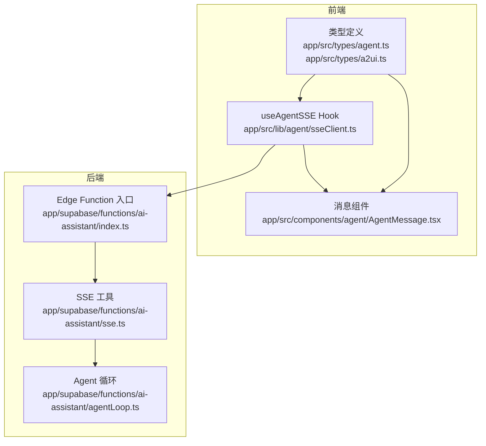
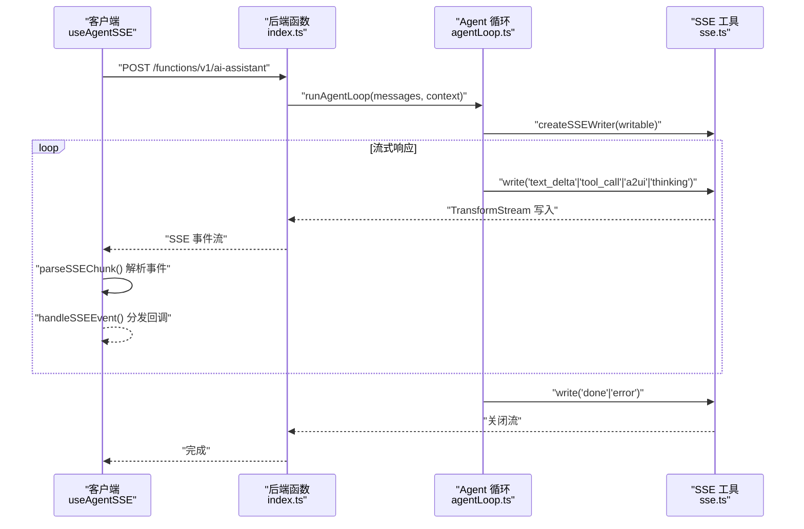
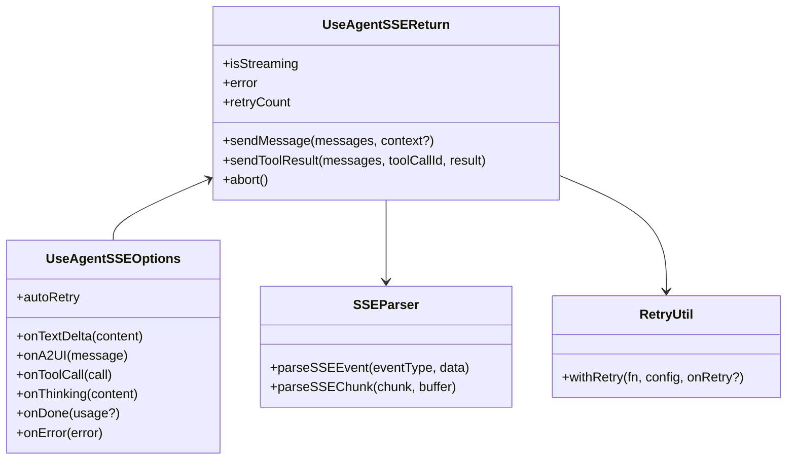
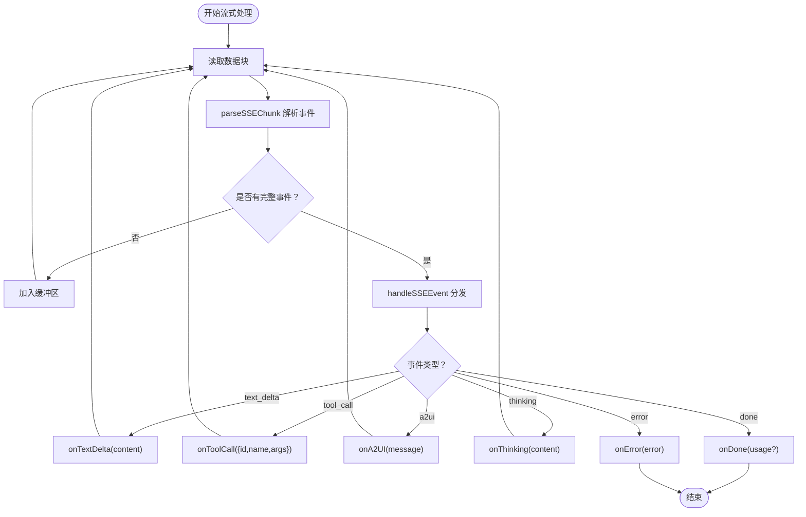
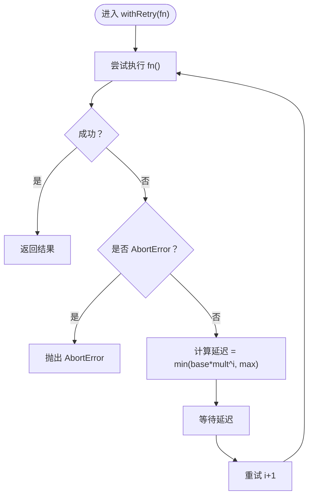
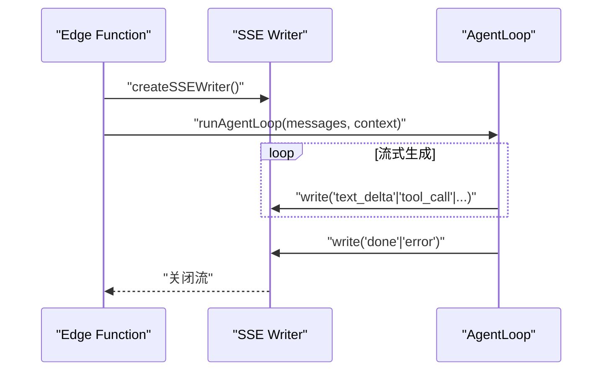
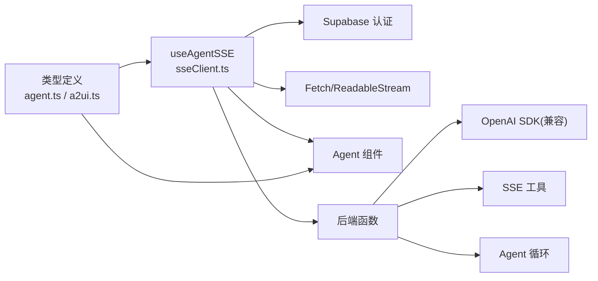

# SSE 通信机制

<cite>
**本文档引用的文件**
- [app/src/lib/agent/sseClient.ts](file://app/src/lib/agent/sseClient.ts)
- [app/src/lib/agent/__tests__/sseClient.test.ts](file://app/src/lib/agent/__tests__/sseClient.test.ts)
- [app/src/types/agent.ts](file://app/src/types/agent.ts)
- [app/src/types/a2ui.ts](file://app/src/types/a2ui.ts)
- [app/supabase/functions/ai-assistant/index.ts](file://app/supabase/functions/ai-assistant/index.ts)
- [app/supabase/functions/ai-assistant/sse.ts](file://app/supabase/functions/ai-assistant/sse.ts)
- [app/supabase/functions/ai-assistant/agentLoop.ts](file://app/supabase/functions/ai-assistant/agentLoop.ts)
- [app/src/components/agent/AgentThread.tsx](file://app/src/components/agent/AgentThread.tsx)
- [app/src/components/agent/AgentMessage.tsx](file://app/src/components/agent/AgentMessage.tsx)
</cite>

## 目录
1. [引言](#引言)
2. [项目结构](#项目结构)
3. [核心组件](#核心组件)
4. [架构总览](#架构总览)
5. [详细组件分析](#详细组件分析)
6. [依赖关系分析](#依赖关系分析)
7. [性能考虑](#性能考虑)
8. [故障排除指南](#故障排除指南)
9. [结论](#结论)
10. [附录](#附录)

## 引言
本文件系统性阐述 Agent Studio 中的 Server-Sent Events（SSE）通信机制，重点围绕 useAgentSSE Hook 的架构设计与实现细节展开，涵盖连接建立、事件解析、流式数据处理、事件类型定义与处理、重试机制、错误处理策略，以及在前端组件中的集成方式与最佳实践。同时结合后端 Edge Function 的实现，说明从 Supabase Edge Function 到前端客户端的完整数据流。

## 项目结构
SSE 通信涉及前后端协同：
- 前端：React Hook useAgentSSE 负责与后端 SSE 流交互，解析事件并分发给上层组件。
- 后端：Supabase Edge Function 接收请求，通过 OpenAI SDK 兼容模式调用通义千问，按流式方式推送 text_delta、tool_call、a2ui、thinking、done、error 等事件。
- 类型定义：统一定义 AgentMessage、SSE 事件类型、A2UI 协议等，确保前后端契约一致。

图表来源
- [app/src/lib/agent/sseClient.ts:1-484](file://app/src/lib/agent/sseClient.ts#L1-L484)
- [app/src/types/agent.ts:1-349](file://app/src/types/agent.ts#L1-L349)
- [app/src/types/a2ui.ts:1-231](file://app/src/types/a2ui.ts#L1-L231)
- [app/supabase/functions/ai-assistant/index.ts:1-116](file://app/supabase/functions/ai-assistant/index.ts#L1-L116)
- [app/supabase/functions/ai-assistant/sse.ts:1-180](file://app/supabase/functions/ai-assistant/sse.ts#L1-L180)
- [app/supabase/functions/ai-assistant/agentLoop.ts:1-138](file://app/supabase/functions/ai-assistant/agentLoop.ts#L1-L138)

章节来源
- [app/src/lib/agent/sseClient.ts:1-484](file://app/src/lib/agent/sseClient.ts#L1-L484)
- [app/supabase/functions/ai-assistant/index.ts:1-116](file://app/supabase/functions/ai-assistant/index.ts#L1-L116)

## 核心组件
- useAgentSSE Hook：封装 SSE 连接、事件解析、流式读取、重试与中断控制，向上提供 sendMessage、sendToolResult、abort 等方法及状态管理。
- SSE 事件类型：text_delta、a2ui、tool_call、thinking、done、error，分别对应流式文本增量、A2UI 渲染指令、工具调用、思考过程、完成统计、错误信息。
- 后端 SSE Writer：将后端生成的事件以 SSE 格式写入响应流，前端逐块解析并分发到回调。

章节来源
- [app/src/lib/agent/sseClient.ts:49-82](file://app/src/lib/agent/sseClient.ts#L49-L82)
- [app/src/types/agent.ts:150-221](file://app/src/types/agent.ts#L150-L221)
- [app/supabase/functions/ai-assistant/sse.ts:26-39](file://app/supabase/functions/ai-assistant/sse.ts#L26-L39)

## 架构总览
SSE 通信链路如下：
- 前端通过 useAgentSSE 建立到 Supabase Edge Function 的 SSE 连接。
- 后端根据请求构建系统提示与消息序列，调用大模型并开启流式输出。
- 后端按事件类型写入 SSE，前端按块解析并触发相应回调。
- 前端在收到工具调用时，可调用 sendToolResult 将工具执行结果回传，继续 Agent 循环。

图表来源
- [app/supabase/functions/ai-assistant/index.ts:82-100](file://app/supabase/functions/ai-assistant/index.ts#L82-L100)
- [app/supabase/functions/ai-assistant/agentLoop.ts:42-76](file://app/supabase/functions/ai-assistant/agentLoop.ts#L42-L76)
- [app/supabase/functions/ai-assistant/sse.ts:26-39](file://app/supabase/functions/ai-assistant/sse.ts#L26-L39)
- [app/src/lib/agent/sseClient.ts:311-364](file://app/src/lib/agent/sseClient.ts#L311-L364)

## 详细组件分析

### useAgentSSE Hook 架构设计
- 状态管理：isStreaming、error、retryCount；通过 AbortController 支持请求中断。
- 认证：从 Supabase 获取 access_token，并附加到 Authorization 头。
- 请求执行：构造消息体（去除工具调用消息的 tool_call_id 字段），调用后端 Edge Function。
- 流式读取：使用 TextDecoder 与 Reader 逐块读取，parseSSEChunk 解析事件，handleSSEEvent 分发到回调。
- 重试机制：withRetry 实现指数退避，支持最大重试次数、最大延迟与自定义 onRetry 回调。
- 工具结果回传：sendToolResult 自动追加 tool 角色消息，携带 tool_call_id，继续对话循环。

图表来源
- [app/src/lib/agent/sseClient.ts:49-82](file://app/src/lib/agent/sseClient.ts#L49-L82)
- [app/src/lib/agent/sseClient.ts:92-144](file://app/src/lib/agent/sseClient.ts#L92-L144)
- [app/src/lib/agent/sseClient.ts:205-237](file://app/src/lib/agent/sseClient.ts#L205-L237)

章节来源
- [app/src/lib/agent/sseClient.ts:246-481](file://app/src/lib/agent/sseClient.ts#L246-L481)

### SSE 事件类型与处理机制
- text_delta：流式文本增量，前端拼接并回调 onTextDelta。
- tool_call：工具调用，包含 id、name、arguments，前端回调 onToolCall，随后可通过 sendToolResult 回传结果。
- a2ui：A2UI 消息，包含 beginRendering、surfaceUpdate、dataModelUpdate、deleteSurface 等类型，前端回调 onA2UI 并驱动 UI 渲染。
- thinking：思考过程提示，前端回调 onThinking。
- done：对话结束，携带 usage 统计，前端回调 onDone 并停止流式状态。
- error：错误事件，前端回调 onError 并设置 error 状态。

图表来源
- [app/src/lib/agent/sseClient.ts:152-198](file://app/src/lib/agent/sseClient.ts#L152-L198)
- [app/src/lib/agent/sseClient.ts:270-306](file://app/src/lib/agent/sseClient.ts#L270-L306)

章节来源
- [app/src/types/agent.ts:150-221](file://app/src/types/agent.ts#L150-L221)
- [app/src/lib/agent/sseClient.ts:92-144](file://app/src/lib/agent/sseClient.ts#L92-L144)

### 重试机制设计
- 配置项：最大重试次数、基础延迟、最大延迟、退避倍数。
- 指数退避：第 n 次延迟 = min(baseDelay * backoffMultiplier^(n-1), maxDelay)。
- 中止保护：AbortError 不重试，直接抛出。
- 回调通知：每次重试触发 onRetry(attempt, error)，便于 UI 展示重试进度。

图表来源
- [app/src/lib/agent/sseClient.ts:205-237](file://app/src/lib/agent/sseClient.ts#L205-L237)

章节来源
- [app/src/lib/agent/sseClient.ts:29-34](file://app/src/lib/agent/sseClient.ts#L29-L34)
- [app/src/lib/agent/sseClient.test.ts:484-551](file://app/src/lib/agent/__tests__/sseClient.test.ts#L484-L551)

### 后端实现要点
- Edge Function 入口：校验请求方法、鉴权头、用户有效性；解析请求体；创建 TransformStream 与 SSE Writer；启动 Agent 循环。
- Agent 循环：调用通义千问，开启流式输出；累积工具调用参数；按块推送 text_delta、tool_call、a2ui、thinking 等事件；最终 done 或 error。
- SSE 工具：统一的 SSE 写入器，保证事件格式与响应头设置。

图表来源
- [app/supabase/functions/ai-assistant/index.ts:82-100](file://app/supabase/functions/ai-assistant/index.ts#L82-L100)
- [app/supabase/functions/ai-assistant/agentLoop.ts:42-76](file://app/supabase/functions/ai-assistant/agentLoop.ts#L42-L76)
- [app/supabase/functions/ai-assistant/sse.ts:26-39](file://app/supabase/functions/ai-assistant/sse.ts#L26-L39)

章节来源
- [app/supabase/functions/ai-assistant/index.ts:22-113](file://app/supabase/functions/ai-assistant/index.ts#L22-L113)
- [app/supabase/functions/ai-assistant/agentLoop.ts:21-137](file://app/supabase/functions/ai-assistant/agentLoop.ts#L21-L137)
- [app/supabase/functions/ai-assistant/sse.ts:19-39](file://app/supabase/functions/ai-assistant/sse.ts#L19-L39)

### 前端组件集成示例
- AgentThread：渲染消息列表，自动滚动到底部，支持 A2UI Surface 渲染与工具调用状态展示。
- AgentMessage：根据消息角色渲染不同样式，支持流式输出光标、A2UI 组件、工具调用状态等。
- 集成 useAgentSSE：在聊天组件中注入 onTextDelta、onToolCall、onA2UI、onDone、onError 回调，配合 isStreaming 控制 UI 状态。

章节来源
- [app/src/components/agent/AgentThread.tsx:19-55](file://app/src/components/agent/AgentThread.tsx#L19-L55)
- [app/src/components/agent/AgentMessage.tsx:24-148](file://app/src/components/agent/AgentMessage.tsx#L24-L148)

## 依赖关系分析
- useAgentSSE 依赖 Supabase 认证（获取 access_token）、浏览器 Fetch 与 ReadableStream API、TextDecoder。
- 后端依赖 OpenAI SDK（兼容模式）、Deno 标准库、Supabase 客户端。
- 类型定义贯穿前后端，确保事件契约一致。

图表来源
- [app/src/types/agent.ts:1-349](file://app/src/types/agent.ts#L1-L349)
- [app/src/types/a2ui.ts:1-231](file://app/src/types/a2ui.ts#L1-L231)
- [app/src/lib/agent/sseClient.ts:1-484](file://app/src/lib/agent/sseClient.ts#L1-L484)
- [app/supabase/functions/ai-assistant/index.ts:1-116](file://app/supabase/functions/ai-assistant/index.ts#L1-L116)
- [app/supabase/functions/ai-assistant/sse.ts:1-180](file://app/supabase/functions/ai-assistant/sse.ts#L1-L180)
- [app/supabase/functions/ai-assistant/agentLoop.ts:1-138](file://app/supabase/functions/ai-assistant/agentLoop.ts#L1-L138)

章节来源
- [app/src/lib/agent/sseClient.ts:8-22](file://app/src/lib/agent/sseClient.ts#L8-L22)
- [app/supabase/functions/ai-assistant/index.ts:48-52](file://app/supabase/functions/ai-assistant/index.ts#L48-L52)

## 性能考虑
- 流式解析：前端采用分块解析与缓冲区拼接，避免一次性解析大块数据，降低内存峰值。
- 指数退避：合理设置最大重试次数与最大延迟，避免频繁重试导致资源浪费。
- 中断优先：AbortController 保证用户取消时立即释放资源，避免无效网络占用。
- UI 渲染优化：仅在必要时更新状态，如 A2UI beginRendering 时才渲染 Surface，减少不必要的重渲染。
- 后端并发：Agent 循环限制最大迭代次数，防止长时间占用资源；流式输出及时关闭，释放连接。

## 故障排除指南
- 认证失败：检查 Supabase Session 是否存在与 access_token 是否有效；确认 VITE_SUPABASE_URL 环境变量正确。
- HTTP 错误：后端返回非 2xx 状态码时，前端捕获并触发 onError；检查后端日志定位具体原因。
- SSE 解析异常：parseSSEChunk 对不完整事件进行缓冲，若持续失败，检查后端事件格式是否符合 event/data/空行规范。
- 重试策略：启用 autoRetry 时，关注 onRetry 回调；若为 AbortError，需检查用户中断逻辑。
- 工具调用：确保 sendToolResult 传入正确的 tool_call_id 与 JSON 可序列化结果；后端会将 tool 角色消息回填至对话历史。

章节来源
- [app/src/lib/agent/sseClient.ts:319-332](file://app/src/lib/agent/sseClient.ts#L319-L332)
- [app/src/lib/agent/sseClient.ts:399-407](file://app/src/lib/agent/sseClient.ts#L399-L407)
- [app/src/lib/agent/__tests__/sseClient.test.ts:314-355](file://app/src/lib/agent/__tests__/sseClient.test.ts#L314-L355)

## 结论
useAgentSSE Hook 通过标准化的 SSE 事件解析与流式处理，实现了与后端 Agent 循环的稳定通信。结合指数退避重试、中断控制与完善的事件类型体系，既保证了用户体验，也兼顾了系统的健壮性与可维护性。前端组件通过回调与状态管理，能够灵活地渲染文本、A2UI、工具调用等丰富内容，形成完整的智能对话体验。

## 附录

### 使用示例（集成步骤）
- 在组件中引入 useAgentSSE，并注册回调：
  - onTextDelta：接收流式文本增量
  - onToolCall：处理工具调用，随后调用 sendToolResult 回传结果
  - onA2UI：接收 A2UI 消息并渲染 Surface
  - onThinking：显示思考过程提示
  - onDone：接收 usage 统计并结束流式状态
  - onError：处理错误并展示
- 调用 sendMessage 发送消息；调用 abort 中断当前请求；在工具调用后调用 sendToolResult 继续对话循环。

章节来源
- [app/src/lib/agent/sseClient.ts:369-463](file://app/src/lib/agent/sseClient.ts#L369-L463)
- [app/src/components/agent/AgentThread.tsx:131-142](file://app/src/components/agent/AgentThread.tsx#L131-L142)
- [app/src/components/agent/AgentMessage.tsx:86-113](file://app/src/components/agent/AgentMessage.tsx#L86-L113)