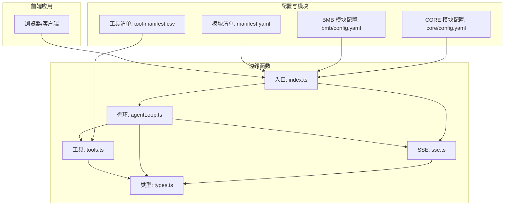
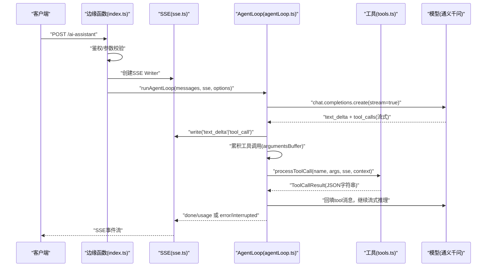
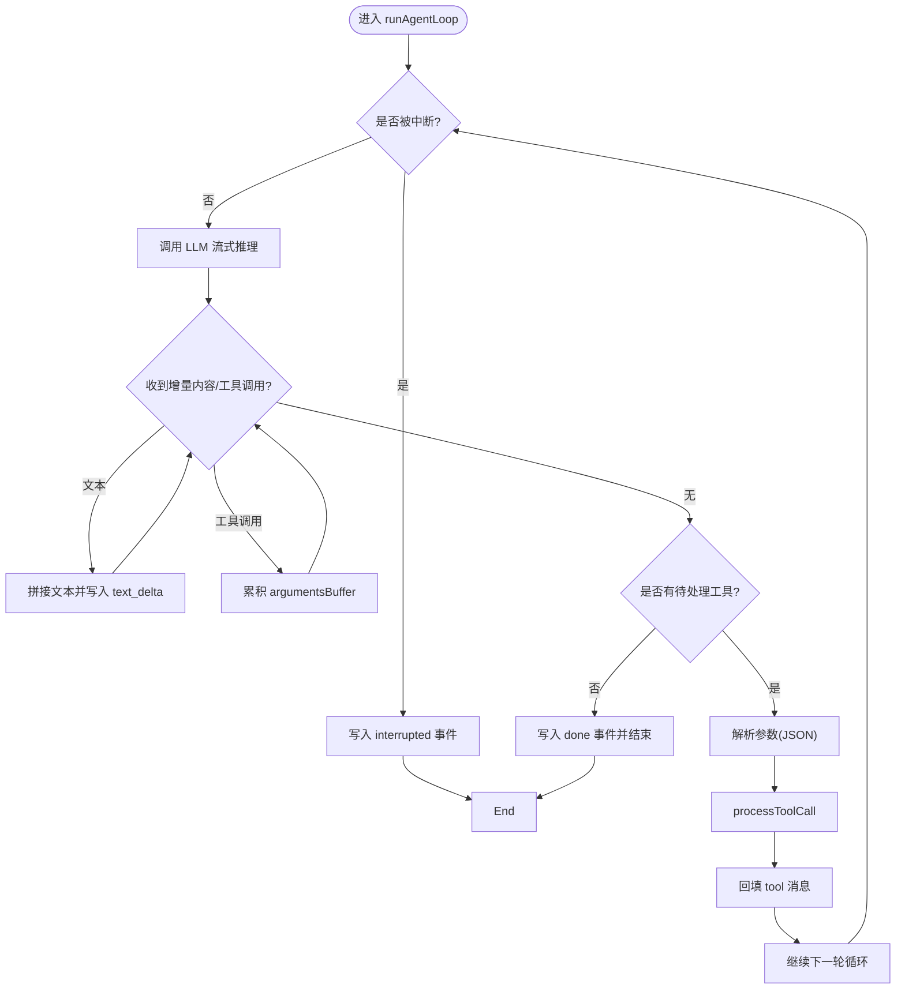
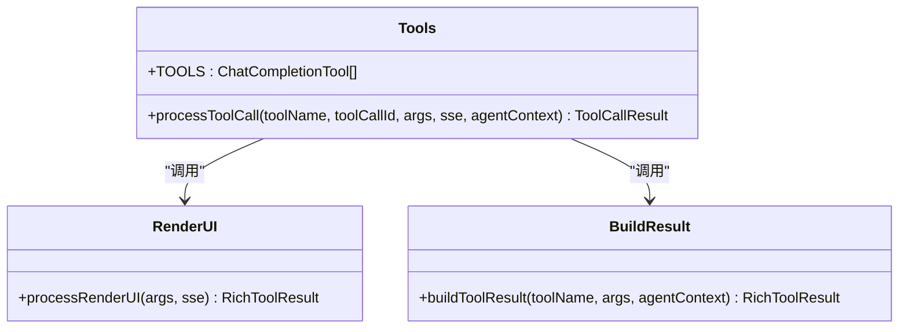
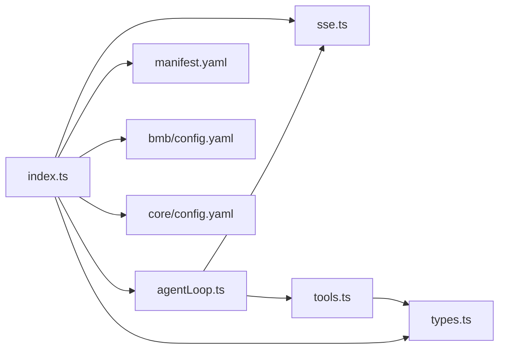

# 工具链执行系统

<cite>
**本文引用的文件**
- [app/supabase/functions/ai-assistant/index.ts](file://app/supabase/functions/ai-assistant/index.ts)
- [app/supabase/functions/ai-assistant/agentLoop.ts](file://app/supabase/functions/ai-assistant/agentLoop.ts)
- [app/supabase/functions/ai-assistant/tools.ts](file://app/supabase/functions/ai-assistant/tools.ts)
- [app/supabase/functions/ai-assistant/types.ts](file://app/supabase/functions/ai-assistant/types.ts)
- [app/supabase/functions/ai-assistant/sse.ts](file://app/supabase/functions/ai-assistant/sse.ts)
- [_bmad/_config/manifest.yaml](file://_bmad/_config/manifest.yaml)
- [_bmad/_config/tool-manifest.csv](file://_bmad/_config/tool-manifest.csv)
- [_bmad/bmb/config.yaml](file://_bmad/bmb/config.yaml)
- [_bmad/core/config.yaml](file://_bmad/core/config.yaml)
</cite>

## 目录
1. [引言](#引言)
2. [项目结构](#项目结构)
3. [核心组件](#核心组件)
4. [架构总览](#架构总览)
5. [详细组件分析](#详细组件分析)
6. [依赖关系分析](#依赖关系分析)
7. [性能考量](#性能考量)
8. [故障排查指南](#故障排查指南)
9. [结论](#结论)
10. [附录](#附录)

## 引言
本文件系统性阐述“工具链执行系统”的设计与实现，聚焦于工具发现、参数传递、执行调度、结果处理与生命周期管理。该系统以 Server-Sent Events（SSE）驱动的流式对话为核心，结合 LLM 的函数调用能力，形成“LLM 生成 → 工具调用 → 结果回填 → 再次调用”的 Agent Loop 模式。同时，系统通过统一的工具注册表与类型约束，确保工具定义规范、参数校验与返回值一致性，并提供可扩展的工具开发范式。

## 项目结构
本项目采用“前端 + 边缘函数 + 工作流与工具配置”的分层组织方式：
- 前端应用位于 app/src 与 app/supabase/functions/ai-assistant，负责用户交互与边缘函数编排
- 边缘函数 ai-assistant 提供 SSE 流式响应、消息转换、工具注册与执行
- 工具链与模块配置位于 _bmad/_config 与各模块子目录，描述工具清单与模块安装信息

图表来源
- [app/supabase/functions/ai-assistant/index.ts:1-116](file://app/supabase/functions/ai-assistant/index.ts#L1-L116)
- [app/supabase/functions/ai-assistant/agentLoop.ts:1-138](file://app/supabase/functions/ai-assistant/agentLoop.ts#L1-L138)
- [app/supabase/functions/ai-assistant/tools.ts:1-191](file://app/supabase/functions/ai-assistant/tools.ts#L1-L191)
- [app/supabase/functions/ai-assistant/types.ts:1-55](file://app/supabase/functions/ai-assistant/types.ts#L1-L55)
- [app/supabase/functions/ai-assistant/sse.ts:1-180](file://app/supabase/functions/ai-assistant/sse.ts#L1-L180)
- [_bmad/_config/manifest.yaml:1-33](file://_bmad/_config/manifest.yaml#L1-L33)
- [_bmad/_config/tool-manifest.csv:1-2](file://_bmad/_config/tool-manifest.csv#L1-L2)
- [_bmad/bmb/config.yaml:1-13](file://_bmad/bmb/config.yaml#L1-L13)
- [_bmad/core/config.yaml:1-10](file://_bmad/core/config.yaml#L1-L10)

章节来源
- [app/supabase/functions/ai-assistant/index.ts:1-116](file://app/supabase/functions/ai-assistant/index.ts#L1-L116)
- [_bmad/_config/manifest.yaml:1-33](file://_bmad/_config/manifest.yaml#L1-L33)

## 核心组件
- 边缘函数入口：负责鉴权、请求解析、SSE 流建立与 Agent Loop 启动
- Agent Loop：封装 LLM 调用、流式增量接收、工具调用累积与消息回填
- 工具注册表与处理器：集中声明可用工具、参数校验与执行结果构建
- SSE 工具集：提供跨域响应头、SSE 写入器、消息格式转换与工具调用累积
- 类型系统：统一定义请求消息、工具调用结果、Agent 上下文与流式工具调用结构
- 配置与清单：模块安装信息、工具清单与模块配置，支撑工具链发现与加载

章节来源
- [app/supabase/functions/ai-assistant/index.ts:22-113](file://app/supabase/functions/ai-assistant/index.ts#L22-L113)
- [app/supabase/functions/ai-assistant/agentLoop.ts:21-137](file://app/supabase/functions/ai-assistant/agentLoop.ts#L21-L137)
- [app/supabase/functions/ai-assistant/tools.ts:10-77](file://app/supabase/functions/ai-assistant/tools.ts#L10-L77)
- [app/supabase/functions/ai-assistant/sse.ts:13-180](file://app/supabase/functions/ai-assistant/sse.ts#L13-L180)
- [app/supabase/functions/ai-assistant/types.ts:7-55](file://app/supabase/functions/ai-assistant/types.ts#L7-L55)
- [_bmad/_config/tool-manifest.csv:1-2](file://_bmad/_config/tool-manifest.csv#L1-L2)
- [_bmad/_config/manifest.yaml:1-33](file://_bmad/_config/manifest.yaml#L1-L33)

## 架构总览
系统采用“边缘函数 + Agent Loop + 工具注册表”的三层架构：
- 入口层：接收 HTTP 请求，进行鉴权与参数校验，构造系统提示与消息序列，启动 SSE 流
- 协议层：将消息转换为 OpenAI 兼容格式，启用流式响应与用量统计
- 执行层：LLM 生成文本与工具调用；工具调用累积后回填至消息序列，再次调用 LLM 直至完成或达到迭代上限

图表来源
- [app/supabase/functions/ai-assistant/index.ts:82-98](file://app/supabase/functions/ai-assistant/index.ts#L82-L98)
- [app/supabase/functions/ai-assistant/agentLoop.ts:43-110](file://app/supabase/functions/ai-assistant/agentLoop.ts#L43-L110)
- [app/supabase/functions/ai-assistant/tools.ts:161-190](file://app/supabase/functions/ai-assistant/tools.ts#L161-L190)
- [app/supabase/functions/ai-assistant/sse.ts:26-39](file://app/supabase/functions/ai-assistant/sse.ts#L26-L39)

## 详细组件分析

### 组件一：边缘函数入口（index.ts）
职责与流程
- 方法校验与预处理：仅接受 POST；OPTIONS 返回 CORS 预检
- 认证与鉴权：读取 Authorization 头，基于 Supabase 客户端 getUser 校验用户
- 请求体解析：提取 messages、context、threadId
- SSE 初始化：创建 TransformStream 与 SSE Writer，构建系统提示与 OpenAI 消息
- Agent Loop 启动：传入消息、SSE 与 Agent 上下文，捕获异常并关闭流

关键点
- 安全：强制 Authorization 头与 Supabase 用户校验
- 可观测：日志记录请求摘要与错误堆栈
- 可扩展：通过 options 注入 agentContext、信号控制与迭代上限

章节来源
- [app/supabase/functions/ai-assistant/index.ts:22-113](file://app/supabase/functions/ai-assistant/index.ts#L22-L113)

### 组件二：Agent Loop（agentLoop.ts）
职责与流程
- 迭代控制：默认最多 5 次循环，支持 AbortSignal 中断
- 流式处理：监听 text_delta 与 tool_calls，累积工具调用参数
- 工具调用：解析参数、调用工具处理器、回填 tool 消息
- 统计与收尾：累计 prompt/completion tokens，输出 done 事件

关键点
- 并发与顺序：逐个工具串行执行，保证消息回填顺序
- 错误处理：捕获 LLM 调用错误并上报
- 中断机制：支持用户主动中断，发送 interrupted 事件

图表来源
- [app/supabase/functions/ai-assistant/agentLoop.ts:21-137](file://app/supabase/functions/ai-assistant/agentLoop.ts#L21-L137)

章节来源
- [app/supabase/functions/ai-assistant/agentLoop.ts:21-137](file://app/supabase/functions/ai-assistant/agentLoop.ts#L21-L137)

### 组件三：工具注册表与处理器（tools.ts）
职责与流程
- 工具注册：以 OpenAI 函数规范定义工具，包含名称、描述与 JSON Schema 参数
- 工具执行：根据工具名分派处理逻辑，构建富结果（RichToolResult），支持 SSE 事件写入
- 特殊工具：
  - renderUI：生成 A2UI 界面，写入 beginRendering 事件，返回 surfaceId 与上下文
  - getCurrentContext：返回 Agent 上下文中的页面与视图信息
  - navigateToPage：根据枚举映射页面名称，返回导航建议

关键点
- 参数校验：对 renderUI 的 component 与 type 进行基础校验
- 结果标准化：统一 RichToolResult 字段，便于上层消费
- 可扩展：新增工具只需在注册表中添加定义并在分派器中实现处理逻辑

图表来源
- [app/supabase/functions/ai-assistant/tools.ts:10-77](file://app/supabase/functions/ai-assistant/tools.ts#L10-L77)
- [app/supabase/functions/ai-assistant/tools.ts:79-113](file://app/supabase/functions/ai-assistant/tools.ts#L79-L113)
- [app/supabase/functions/ai-assistant/tools.ts:115-159](file://app/supabase/functions/ai-assistant/tools.ts#L115-L159)
- [app/supabase/functions/ai-assistant/tools.ts:161-190](file://app/supabase/functions/ai-assistant/tools.ts#L161-L190)

章节来源
- [app/supabase/functions/ai-assistant/tools.ts:10-77](file://app/supabase/functions/ai-assistant/tools.ts#L10-L77)
- [app/supabase/functions/ai-assistant/tools.ts:79-159](file://app/supabase/functions/ai-assistant/tools.ts#L79-L159)
- [app/supabase/functions/ai-assistant/tools.ts:161-190](file://app/supabase/functions/ai-assistant/tools.ts#L161-L190)

### 组件四：SSE 工具集（sse.ts）
职责与流程
- CORS 与 SSE 头：统一设置跨域与流式响应头
- SSE 写入器：编码并写入事件，支持关闭
- 消息转换：将内部消息转换为 OpenAI 兼容的消息数组
- 工具调用累积：按索引累积工具调用的参数缓冲区
- 助手消息构建：将文本与工具调用组装为 assistant 消息
- 系统提示构建：根据 Agent 上下文动态生成系统提示

关键点
- 流式稳定性：使用 TransformStream 与 TextEncoder 保证事件可靠写入
- 参数完整性：通过 Map 索引累积工具参数，避免片段丢失
- 上下文注入：系统提示动态反映当前页面与团队信息

章节来源
- [app/supabase/functions/ai-assistant/sse.ts:13-39](file://app/supabase/functions/ai-assistant/sse.ts#L13-L39)
- [app/supabase/functions/ai-assistant/sse.ts:41-62](file://app/supabase/functions/ai-assistant/sse.ts#L41-L62)
- [app/supabase/functions/ai-assistant/sse.ts:64-88](file://app/supabase/functions/ai-assistant/sse.ts#L64-L88)
- [app/supabase/functions/ai-assistant/sse.ts:90-106](file://app/supabase/functions/ai-assistant/sse.ts#L90-L106)
- [app/supabase/functions/ai-assistant/sse.ts:108-179](file://app/supabase/functions/ai-assistant/sse.ts#L108-L179)

### 组件五：类型系统（types.ts）
职责与流程
- AgentContext：定义当前页面与视图上下文
- RequestMessage：统一的三方消息结构（含 tool_call 关联字段）
- AIAssistantRequest：请求体结构，包含消息、上下文与线程 ID
- SSEWriter：抽象的事件写入接口
- ToolCallResult/RichToolResult：工具调用结果与富结果
- StreamingToolCall：流式工具调用的累积结构

关键点
- 类型一致性：确保工具调用、消息转换与事件写入的强类型约束
- 可扩展性：新增字段只需在对应接口中扩展

章节来源
- [app/supabase/functions/ai-assistant/types.ts:7-55](file://app/supabase/functions/ai-assistant/types.ts#L7-L55)

### 组件六：配置与清单（manifest.yaml、tool-manifest.csv、模块配置）
职责与流程
- manifest.yaml：记录模块安装版本、来源与 IDE 列表
- tool-manifest.csv：工具清单（当前为空，预留扩展）
- 模块配置：BMB/CORE 模块的输出路径与语言设置

关键点
- 模块化：通过 manifest.yaml 描述模块来源与版本，便于工具链发现
- 清单化：tool-manifest.csv 作为未来工具注册的扩展点
- 配置驱动：模块配置影响生成物与输出路径

章节来源
- [_bmad/_config/manifest.yaml:1-33](file://_bmad/_config/manifest.yaml#L1-L33)
- [_bmad/_config/tool-manifest.csv:1-2](file://_bmad/_config/tool-manifest.csv#L1-L2)
- [_bmad/bmb/config.yaml:1-13](file://_bmad/bmb/config.yaml#L1-L13)
- [_bmad/core/config.yaml:1-10](file://_bmad/core/config.yaml#L1-L10)

## 依赖关系分析
- 入口依赖：index.ts 依赖 SSE 工具集与 Agent Loop
- Agent Loop 依赖：agentLoop.ts 依赖 OpenAI SDK、工具注册表与 SSE 工具集
- 工具依赖：tools.ts 依赖类型系统与 SSE 写入器
- 配置依赖：入口与 Agent Loop 间接依赖 manifest.yaml 与模块配置

图表来源
- [app/supabase/functions/ai-assistant/index.ts:10-20](file://app/supabase/functions/ai-assistant/index.ts#L10-L20)
- [app/supabase/functions/ai-assistant/agentLoop.ts:7-14](file://app/supabase/functions/ai-assistant/agentLoop.ts#L7-L14)
- [app/supabase/functions/ai-assistant/tools.ts:7-8](file://app/supabase/functions/ai-assistant/tools.ts#L7-L8)
- [_bmad/_config/manifest.yaml:1-33](file://_bmad/_config/manifest.yaml#L1-L33)
- [_bmad/bmb/config.yaml:1-13](file://_bmad/bmb/config.yaml#L1-L13)
- [_bmad/core/config.yaml:1-10](file://_bmad/core/config.yaml#L1-L10)

章节来源
- [app/supabase/functions/ai-assistant/index.ts:10-20](file://app/supabase/functions/ai-assistant/index.ts#L10-L20)
- [app/supabase/functions/ai-assistant/agentLoop.ts:7-14](file://app/supabase/functions/ai-assistant/agentLoop.ts#L7-L14)
- [app/supabase/functions/ai-assistant/tools.ts:7-8](file://app/supabase/functions/ai-assistant/tools.ts#L7-L8)

## 性能考量
- 流式传输：利用 SSE 与 OpenAI 流式响应，降低首字节延迟，提升交互体验
- 参数累积：通过 Map 索引累积工具参数，避免重复解析与丢包
- 迭代上限：限制 Agent Loop 最大迭代次数，防止长尾耗时
- 中断机制：通过 AbortSignal 实现用户主动中断，释放资源
- 日志与监控：在关键节点输出日志，便于定位性能瓶颈与异常

## 故障排查指南
常见问题与处理
- 认证失败：检查 Authorization 头与 Supabase 用户状态
- 缺少 API Key：确认环境变量 ALIYUN_BAILIAN_API_KEY 是否配置
- 请求体非法：确保 messages 非空且格式正确
- 工具参数解析失败：检查工具调用 arguments 是否为合法 JSON
- LLM 调用错误：关注 Agent Loop 中的错误事件与日志
- 中断与超时：确认中断信号与最大迭代次数设置

章节来源
- [app/supabase/functions/ai-assistant/index.ts:35-62](file://app/supabase/functions/ai-assistant/index.ts#L35-L62)
- [app/supabase/functions/ai-assistant/agentLoop.ts:124-130](file://app/supabase/functions/ai-assistant/agentLoop.ts#L124-L130)
- [app/supabase/functions/ai-assistant/tools.ts:94-98](file://app/supabase/functions/ai-assistant/tools.ts#L94-L98)

## 结论
本工具链执行系统以 SSE 与 Agent Loop 为核心，结合统一的工具注册表与类型系统，实现了从工具发现、参数传递、执行调度到结果处理的完整闭环。通过模块化配置与可扩展的工具定义规范，系统既满足即用场景，又为后续工具生态建设提供了清晰路径。

## 附录

### 工具定义规范
- 工具接口标准
  - 使用 OpenAI 函数规范定义工具，包含名称、描述与 JSON Schema 参数
  - 参数对象需声明必填字段与枚举值，确保 LLM 调用安全
- 参数验证
  - 在工具处理器中进行基础校验（如 renderUI 的 component/type）
  - 对 JSON 参数进行解析与兜底处理
- 返回值处理
  - 统一返回 RichToolResult，包含 success/message/context/suggestedNextStep/executed/surfaceId 等字段
  - 将结果序列化为字符串回填至消息流

章节来源
- [app/supabase/functions/ai-assistant/tools.ts:10-77](file://app/supabase/functions/ai-assistant/tools.ts#L10-L77)
- [app/supabase/functions/ai-assistant/tools.ts:115-159](file://app/supabase/functions/ai-assistant/tools.ts#L115-L159)
- [app/supabase/functions/ai-assistant/types.ts:40-47](file://app/supabase/functions/ai-assistant/types.ts#L40-L47)

### 工具调用生命周期管理
- 生命周期阶段
  - 发现与注册：在 TOOLS 中声明工具
  - 参数解析：从流式增量中累积并解析参数
  - 执行与回填：调用工具处理器，回填 tool 消息
  - 结果消费：上层事件消费 done/usage/error/interrupted
- 状态跟踪
  - 文本增量：text_delta
  - 工具调用：tool_call
  - 完成与用量：done/usage
  - 错误与中断：error/interrupted
- 超时与中断
  - 通过 AbortSignal 实现用户中断
  - 通过 maxIterations 控制最大迭代次数

章节来源
- [app/supabase/functions/ai-assistant/agentLoop.ts:32-131](file://app/supabase/functions/ai-assistant/agentLoop.ts#L32-L131)
- [app/supabase/functions/ai-assistant/sse.ts:26-39](file://app/supabase/functions/ai-assistant/sse.ts#L26-L39)

### 开发新工具示例（步骤指引）
- 步骤一：在工具注册表中添加新工具定义（名称、描述、参数 Schema）
- 步骤二：在工具处理器中实现处理逻辑，返回富结果
- 步骤三：在系统提示中更新可用工具列表，确保 LLM 了解新工具
- 步骤四：在前端或 UI 层对接新工具的事件与结果展示

章节来源
- [app/supabase/functions/ai-assistant/tools.ts:10-77](file://app/supabase/functions/ai-assistant/tools.ts#L10-L77)
- [app/supabase/functions/ai-assistant/sse.ts:108-179](file://app/supabase/functions/ai-assistant/sse.ts#L108-L179)

### 调试技巧
- 启用详细日志：在关键路径输出请求摘要、工具调用与错误信息
- 使用 SSE 事件：通过浏览器开发者工具观察 text_delta/tool_call/done/error/interrupted
- 参数校验：在工具处理器中打印参数与解析结果，定位 JSON 解析问题
- 中断测试：模拟用户中断，验证 interrupted 事件与资源回收

章节来源
- [app/supabase/functions/ai-assistant/index.ts:64-80](file://app/supabase/functions/ai-assistant/index.ts#L64-L80)
- [app/supabase/functions/ai-assistant/agentLoop.ts:33-37](file://app/supabase/functions/ai-assistant/agentLoop.ts#L33-L37)
- [app/supabase/functions/ai-assistant/tools.ts:82-87](file://app/supabase/functions/ai-assistant/tools.ts#L82-L87)

### 性能优化策略
- 流式优先：尽量使用 SSE 与流式模型响应
- 参数累积：避免重复解析，减少内存占用
- 迭代控制：合理设置最大迭代次数，防止长尾耗时
- 中断机制：及时响应用户中断，释放计算资源

章节来源
- [app/supabase/functions/ai-assistant/agentLoop.ts:26-27](file://app/supabase/functions/ai-assistant/agentLoop.ts#L26-L27)
- [app/supabase/functions/ai-assistant/sse.ts:26-39](file://app/supabase/functions/ai-assistant/sse.ts#L26-L39)

### 安全防护措施
- 认证与授权：强制 Authorization 头并通过 Supabase 校验用户
- CORS 配置：统一设置允许的来源与方法
- 输入校验：对工具参数进行基础校验与 JSON 解析兜底
- 错误隔离：捕获异常并返回结构化错误信息，避免泄露内部细节

章节来源
- [app/supabase/functions/ai-assistant/index.ts:35-62](file://app/supabase/functions/ai-assistant/index.ts#L35-L62)
- [app/supabase/functions/ai-assistant/sse.ts:13-24](file://app/supabase/functions/ai-assistant/sse.ts#L13-L24)
- [app/supabase/functions/ai-assistant/tools.ts:94-98](file://app/supabase/functions/ai-assistant/tools.ts#L94-L98)