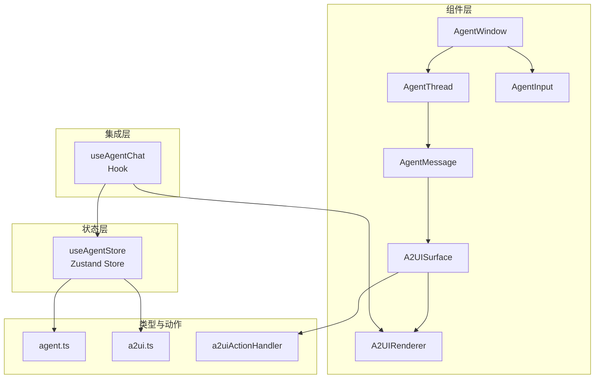
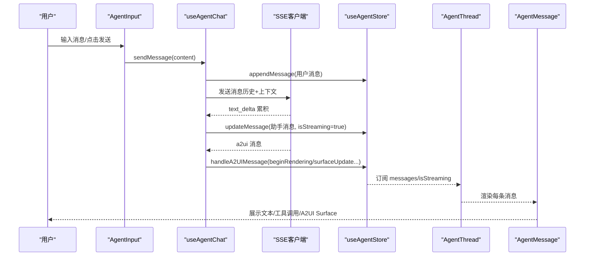
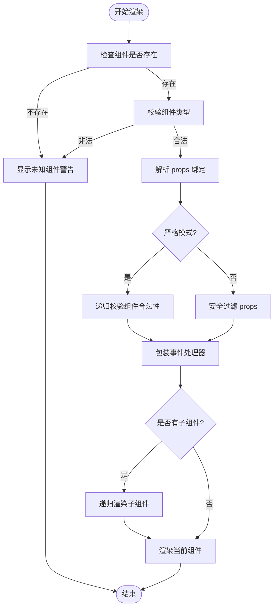
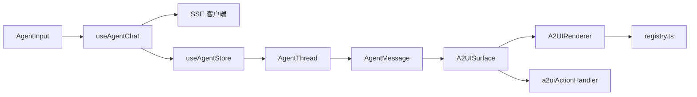

# Agent 专用组件

<cite>
**本文引用的文件**
- [AgentWindow.tsx](file://app/src/components/agent/AgentWindow.tsx)
- [AgentThread.tsx](file://app/src/components/agent/AgentThread.tsx)
- [AgentMessage.tsx](file://app/src/components/agent/AgentMessage.tsx)
- [AgentInput.tsx](file://app/src/components/agent/AgentInput.tsx)
- [A2UIRenderer.tsx](file://app/src/components/agent/a2ui/A2UIRenderer.tsx)
- [A2UISurface.tsx](file://app/src/components/agent/a2ui/A2UISurface.tsx)
- [registry.ts](file://app/src/components/agent/a2ui/registry.ts)
- [A2UIButton.tsx](file://app/src/components/agent/a2ui/components/A2UIButton.tsx)
- [A2UIContainer.tsx](file://app/src/components/agent/a2ui/components/A2UIContainer.tsx)
- [useAgentStore.ts](file://app/src/stores/useAgentStore.ts)
- [useAgentChat.ts](file://app/src/hooks/useAgentChat.ts)
- [a2uiActionHandler.ts](file://app/src/lib/agent/a2uiActionHandler.ts)
- [agent.ts](file://app/src/types/agent.ts)
- [a2ui.ts](file://app/src/types/a2ui.ts)
</cite>

## 目录
1. [简介](#简介)
2. [项目结构](#项目结构)
3. [核心组件](#核心组件)
4. [架构总览](#架构总览)
5. [详细组件分析](#详细组件分析)
6. [依赖关系分析](#依赖关系分析)
7. [性能考量](#性能考量)
8. [故障排查指南](#故障排查指南)
9. [结论](#结论)
10. [附录](#附录)

## 简介
本文件面向 AI Agent 专用组件体系，聚焦于对话与动态界面渲染两大能力域，涵盖 AgentWindow（悬浮对话窗口）、AgentThread（消息列表）、AgentMessage（消息气泡）、AgentInput（输入框）、A2UIRenderer（动态界面渲染器）与 A2UISurface（Surface 容器）等核心模块。文档深入解析组件的交互模式（流式消息、工具调用反馈、A2UI 动态渲染）、状态管理机制（消息历史、用户输入、Agent 回复、Surface/Portal 状态），并提供最佳实践与可扩展性建议。

## 项目结构
Agent 专用组件位于前端应用的组件目录中，采用按功能分层与按领域聚合相结合的方式组织：
- 组件层：AgentWindow、AgentThread、AgentMessage、AgentInput、A2UIRenderer、A2UISurface 及其子组件
- 状态层：Zustand Store（useAgentStore）集中管理会话、消息、Surface、Portal、上下文与 UI 状态
- 集成层：Hook（useAgentChat）整合 SSE 客户端、工具执行器与 Store，提供统一的对话能力
- 类型层：agent.ts 与 a2ui.ts 定义消息、工具、A2UI 协议与 Store 类型
- 动作处理：a2uiActionHandler 处理 A2UI 组件触发的本地动作（如导航）

图表来源
- [AgentWindow.tsx:1-243](file://app/src/components/agent/AgentWindow.tsx#L1-L243)
- [AgentThread.tsx:1-183](file://app/src/components/agent/AgentThread.tsx#L1-L183)
- [AgentMessage.tsx:1-177](file://app/src/components/agent/AgentMessage.tsx#L1-L177)
- [AgentInput.tsx:1-211](file://app/src/components/agent/AgentInput.tsx#L1-L211)
- [A2UISurface.tsx:1-112](file://app/src/components/agent/a2ui/A2UISurface.tsx#L1-L112)
- [A2UIRenderer.tsx:1-244](file://app/src/components/agent/a2ui/A2UIRenderer.tsx#L1-L244)
- [useAgentStore.ts:1-482](file://app/src/stores/useAgentStore.ts#L1-L482)
- [useAgentChat.ts:1-380](file://app/src/hooks/useAgentChat.ts#L1-L380)
- [a2uiActionHandler.ts:1-77](file://app/src/lib/agent/a2uiActionHandler.ts#L1-L77)
- [agent.ts:1-349](file://app/src/types/agent.ts#L1-L349)
- [a2ui.ts:1-231](file://app/src/types/a2ui.ts#L1-L231)

章节来源
- [AgentWindow.tsx:1-243](file://app/src/components/agent/AgentWindow.tsx#L1-L243)
- [AgentThread.tsx:1-183](file://app/src/components/agent/AgentThread.tsx#L1-L183)
- [AgentMessage.tsx:1-177](file://app/src/components/agent/AgentMessage.tsx#L1-L177)
- [AgentInput.tsx:1-211](file://app/src/components/agent/AgentInput.tsx#L1-L211)
- [A2UISurface.tsx:1-112](file://app/src/components/agent/a2ui/A2UISurface.tsx#L1-L112)
- [A2UIRenderer.tsx:1-244](file://app/src/components/agent/a2ui/A2UIRenderer.tsx#L1-L244)
- [useAgentStore.ts:1-482](file://app/src/stores/useAgentStore.ts#L1-L482)
- [useAgentChat.ts:1-380](file://app/src/hooks/useAgentChat.ts#L1-L380)
- [a2uiActionHandler.ts:1-77](file://app/src/lib/agent/a2uiActionHandler.ts#L1-L77)
- [agent.ts:1-349](file://app/src/types/agent.ts#L1-L349)
- [a2ui.ts:1-231](file://app/src/types/a2ui.ts#L1-L231)

## 核心组件
- AgentWindow：悬浮对话窗口容器，支持拖拽、最小化、恢复上次对话、清空对话、切换新对话；内部组合 AgentThread 与 AgentInput，并与 Store 状态联动。
- AgentThread：消息列表渲染器，负责自动滚动至最新消息、空状态智能推荐、以及将用户操作回调传递给 Store。
- AgentMessage：单条消息渲染器，支持文本流式输出光标、系统错误高亮、A2UI Surface 渲染、工具调用展示与时间戳。
- AgentInput：用户输入组件，支持多行自适应高度、快捷键发送、中断生成、上下文同步、推荐提示词占位。
- A2UISurface：单个 Surface 的容器，负责接收用户操作并回传到 Store，同时承载 A2UIRendererSafe。
- A2UIRenderer：A2UI 核心渲染器，递归解析组件树、绑定数据模型、包装事件、执行安全校验与边界保护。

章节来源
- [AgentWindow.tsx:36-242](file://app/src/components/agent/AgentWindow.tsx#L36-L242)
- [AgentThread.tsx:19-55](file://app/src/components/agent/AgentThread.tsx#L19-L55)
- [AgentMessage.tsx:24-148](file://app/src/components/agent/AgentMessage.tsx#L24-L148)
- [AgentInput.tsx:34-210](file://app/src/components/agent/AgentInput.tsx#L34-L210)
- [A2UISurface.tsx:30-81](file://app/src/components/agent/a2ui/A2UISurface.tsx#L30-L81)
- [A2UIRenderer.tsx:91-171](file://app/src/components/agent/a2ui/A2UIRenderer.tsx#L91-L171)

## 架构总览
Agent 专用组件围绕“对话 + 动态界面”两条主线构建：
- 对话主线：AgentInput -> useAgentChat -> SSE 客户端 -> Store（消息、流式状态、工具调用）-> AgentThread -> AgentMessage
- A2UI 主线：AI 服务端 -> A2UI 消息（beginRendering/surfaceUpdate/dataModelUpdate/deleteSurface）-> Store（Surface/Portal 状态）-> A2UISurface -> A2UIRenderer -> 注册组件树

图表来源
- [AgentInput.tsx:69-82](file://app/src/components/agent/AgentInput.tsx#L69-L82)
- [useAgentChat.ts:299-367](file://app/src/hooks/useAgentChat.ts#L299-L367)
- [useAgentStore.ts:118-164](file://app/src/stores/useAgentStore.ts#L118-L164)
- [AgentThread.tsx:27-32](file://app/src/components/agent/AgentThread.tsx#L27-L32)
- [AgentMessage.tsx:85-113](file://app/src/components/agent/AgentMessage.tsx#L85-L113)

## 详细组件分析

### AgentWindow：悬浮对话窗口容器
- 功能要点
  - 窗口尺寸与位置：默认展开与最小化尺寸，窗口大小切换平滑过渡，初始位置计算在右下角。
  - 交互控制：拖拽移动、最小化/最大化切换、清空对话、关闭窗口。
  - 生命周期：打开时检测上次会话并弹窗询问恢复；关闭时重置检查状态。
  - 内容区域：最小化时不渲染消息与输入，仅显示标题栏；展开时渲染 AgentThread 与 AgentInput。
- 状态与 Store
  - 读取 currentThreadId、isStreaming；创建/加载/清空会话；与 AgentThread、AgentInput 协作。
- 可扩展性
  - 可通过外部传入 isOpen/onClose 控制显示与隐藏；按钮组可按需增删。

章节来源
- [AgentWindow.tsx:28-31](file://app/src/components/agent/AgentWindow.tsx#L28-L31)
- [AgentWindow.tsx:54-69](file://app/src/components/agent/AgentWindow.tsx#L54-L69)
- [AgentWindow.tsx:71-90](file://app/src/components/agent/AgentWindow.tsx#L71-L90)
- [AgentWindow.tsx:97-118](file://app/src/components/agent/AgentWindow.tsx#L97-L118)
- [AgentWindow.tsx:120-124](file://app/src/components/agent/AgentWindow.tsx#L120-L124)
- [AgentWindow.tsx:129-241](file://app/src/components/agent/AgentWindow.tsx#L129-L241)

### AgentThread：消息列表与空状态
- 功能要点
  - 自动滚动：监听 messages 与 isStreaming，滚动到底部。
  - 空状态：根据上下文感知推荐（页面、选中照片等），展示智能建议按钮。
  - 建议按钮：点击后通过 useAgentChat 发送带导航提示的建议内容。
- 与 Store 的协作
  - 读取 messages、isStreaming；订阅 handleUserAction 以响应 A2UI 用户操作。

章节来源
- [AgentThread.tsx:19-55](file://app/src/components/agent/AgentThread.tsx#L19-L55)
- [AgentThread.tsx:60-114](file://app/src/components/agent/AgentThread.tsx#L60-L114)
- [AgentThread.tsx:120-182](file://app/src/components/agent/AgentThread.tsx#L120-L182)

### AgentMessage：消息气泡与 A2UI/SSE 集成
- 功能要点
  - 角色区分：用户/助手/系统（错误）头像与样式。
  - 流式输出：isStreaming 时显示光标动画；无内容时显示加载状态。
  - A2UI 渲染：遍历 a2uiMessages，仅渲染 beginRendering 且含有效 component 的消息。
  - 工具调用：展示工具名称与执行结果（成功/失败）徽标。
  - 时间戳：按日/时间格式化显示。
- 与 Store 的协作
  - 通过 onAction 将用户操作回传给 Store 的 handleUserAction。

章节来源
- [AgentMessage.tsx:24-148](file://app/src/components/agent/AgentMessage.tsx#L24-L148)
- [AgentMessage.tsx:153-176](file://app/src/components/agent/AgentMessage.tsx#L153-L176)

### AgentInput：输入框与上下文同步
- 功能要点
  - 多行自适应高度：根据内容动态调整 textarea 高度，最大高度限制。
  - 发送控制：Enter 发送（Shift+Enter 换行），禁用状态下不可发送；中断生成。
  - 上下文同步：将 useAgentContext 同步到 Store 的 context。
  - 推荐提示词：预留扩展点（当前为空数组），可按条件动态显示。
  - 状态提示：显示错误与重试次数，提供风险提示。
- 与 Hook 的协作
  - 使用 useAgentChat 的 sendMessage/abort/isStreaming/error/retryCount。

章节来源
- [AgentInput.tsx:34-210](file://app/src/components/agent/AgentInput.tsx#L34-L210)

### A2UISurface：Surface 容器与错误边界
- 功能要点
  - 用户操作桥接：将组件触发的 action 包装为 UserActionMessage 并回传。
  - 渲染边界：通过 A2UIRendererSafe 提供错误边界与严格模式开关。
  - 占位符：当无组件时显示等待占位。
- 与 Store 的协作
  - 通过 onAction 将用户操作交由 Store 处理。

章节来源
- [A2UISurface.tsx:30-81](file://app/src/components/agent/a2ui/A2UISurface.tsx#L30-L81)
- [A2UISurface.tsx:86-111](file://app/src/components/agent/a2ui/A2UISurface.tsx#L86-L111)

### A2UIRenderer：动态渲染器与安全校验
- 功能要点
  - 组件解析：校验组件类型、解析 props 绑定、包装事件处理器、递归渲染子组件。
  - 安全校验：严格模式下递归校验组件合法性；非严格模式对当前组件 props 做安全过滤。
  - 错误边界：A2UIRendererSafe 提供错误捕获与友好提示。
  - 未知组件：显示警告并保留渲染位置。
- 与注册表协作
  - 通过 registry.ts 查找组件实现，支持扩展注册。

图表来源
- [A2UIRenderer.tsx:91-171](file://app/src/components/agent/a2ui/A2UIRenderer.tsx#L91-L171)
- [registry.ts:75-111](file://app/src/components/agent/a2ui/registry.ts#L75-L111)

章节来源
- [A2UIRenderer.tsx:91-171](file://app/src/components/agent/a2ui/A2UIRenderer.tsx#L91-L171)
- [A2UIRenderer.tsx:176-243](file://app/src/components/agent/a2ui/A2UIRenderer.tsx#L176-L243)
- [registry.ts:75-111](file://app/src/components/agent/a2ui/registry.ts#L75-L111)

### A2UI 组件注册与内置组件
- 注册表：registry.ts 维护 A2UI 组件类型到 React 组件的映射，支持扩展注册与查询。
- 内置布局与基础组件：container、list、text、image、button、input、slider、progress、badge 等。
- 包装组件：A2UIButton 支持 AI 返回的 text 属性直接渲染为按钮文本。

章节来源
- [registry.ts:75-111](file://app/src/components/agent/a2ui/registry.ts#L75-L111)
- [A2UIButton.tsx:21-23](file://app/src/components/agent/a2ui/components/A2UIButton.tsx#L21-L23)
- [A2UIContainer.tsx:55-79](file://app/src/components/agent/a2ui/components/A2UIContainer.tsx#L55-L79)

### A2UI 动作处理与导航
- 动作处理：a2uiActionHandler 根据 actionId 路由到对应处理函数，当前主要支持页面导航动作。
- 与 Store 协作：AgentStore 的 handleUserAction 调用该处理器并生成助手消息反馈。

章节来源
- [a2uiActionHandler.ts:26-74](file://app/src/lib/agent/a2uiActionHandler.ts#L26-L74)
- [useAgentStore.ts:296-332](file://app/src/stores/useAgentStore.ts#L296-L332)

## 依赖关系分析
- 组件耦合
  - AgentWindow 依赖 AgentThread、AgentInput、useAgentStore；AgentThread 依赖 AgentMessage；AgentMessage 依赖 A2UISurface；A2UISurface 依赖 A2UIRenderer。
- 状态与集成
  - useAgentChat 作为集成层，连接 SSE、工具执行器与 Store；Store 负责 Surface/Portal 状态与消息历史。
- 类型契约
  - agent.ts 与 a2ui.ts 定义消息、工具、A2UI 协议与 Store 类型，确保跨层一致性。

图表来源
- [AgentInput.tsx:34-59](file://app/src/components/agent/AgentInput.tsx#L34-L59)
- [useAgentChat.ts:47-83](file://app/src/hooks/useAgentChat.ts#L47-L83)
- [useAgentStore.ts:60-343](file://app/src/stores/useAgentStore.ts#L60-L343)
- [AgentThread.tsx:19-25](file://app/src/components/agent/AgentThread.tsx#L19-L25)
- [AgentMessage.tsx:12-12](file://app/src/components/agent/AgentMessage.tsx#L12-L12)
- [A2UISurface.tsx:30-37](file://app/src/components/agent/a2ui/A2UISurface.tsx#L30-L37)
- [A2UIRenderer.tsx:91-171](file://app/src/components/agent/a2ui/A2UIRenderer.tsx#L91-L171)
- [registry.ts:75-111](file://app/src/components/agent/a2ui/registry.ts#L75-L111)
- [a2uiActionHandler.ts:26-74](file://app/src/lib/agent/a2uiActionHandler.ts#L26-L74)

章节来源
- [useAgentChat.ts:47-83](file://app/src/hooks/useAgentChat.ts#L47-L83)
- [useAgentStore.ts:60-343](file://app/src/stores/useAgentStore.ts#L60-L343)
- [registry.ts:75-111](file://app/src/components/agent/a2ui/registry.ts#L75-L111)

## 性能考量
- 渲染性能
  - AgentThread 使用自动滚动与按需渲染，减少不必要的重排。
  - AgentMessage 在 isStreaming 时仅更新文本增量，避免整体重渲染。
- 状态更新
  - Store 使用局部更新（如 updateMessage、updateDataModel），降低订阅范围。
- 渲染器健壮性
  - A2UIRendererSafe 提供错误边界，避免单个组件异常影响全局。
- 资源释放
  - 中断生成时及时清理 AbortController 与 SSE 连接，防止内存泄漏。

## 故障排查指南
- 流式输出异常
  - 现象：助手消息长时间处于 isStreaming 且无内容。
  - 排查：检查 SSE 事件流是否正常到达；查看 useAgentChat 的 handleTextDelta 与 handleDone 是否被调用。
- A2UI 渲染失败
  - 现象：Surface 显示“组件渲染失败”或未知组件警告。
  - 排查：确认组件类型是否在注册表中；严格模式下检查组件合法性；查看 A2UIRendererSafe 的错误提示。
- 工具调用未生效
  - 现象：消息中出现工具调用但无结果或 UI。
  - 排查：确认工具执行器返回的 result.ui 是否存在；检查 A2UI 消息是否正确下发到 Store。
- 用户操作无响应
  - 现象：点击 A2UI 组件无反应。
  - 排查：确认 A2UISurface 的 onAction 是否回传；检查 Store 的 handleUserAction 是否被调用；核对 actionId 是否在 a2uiActionHandler 中有对应处理。

章节来源
- [useAgentChat.ts:94-132](file://app/src/hooks/useAgentChat.ts#L94-L132)
- [useAgentChat.ts:134-152](file://app/src/hooks/useAgentChat.ts#L134-L152)
- [useAgentChat.ts:154-219](file://app/src/hooks/useAgentChat.ts#L154-L219)
- [A2UIRenderer.tsx:176-243](file://app/src/components/agent/a2ui/A2UIRenderer.tsx#L176-L243)
- [a2uiActionHandler.ts:26-74](file://app/src/lib/agent/a2uiActionHandler.ts#L26-L74)

## 结论
Agent 专用组件体系以对话与动态界面为核心，通过清晰的组件边界、完善的 Store 状态管理与严格的 A2UI 渲染协议，实现了流畅的流式消息体验、可靠的工具调用反馈与灵活的动态 UI 渲染。借助注册表与动作处理器，系统具备良好的可扩展性与可维护性，适合在复杂业务场景中持续演进。

## 附录

### A2UI 协议与类型概览
- 渲染目标：inline/main-area/fullscreen/split
- 消息类型：beginRendering/surfaceUpdate/dataModelUpdate/deleteSurface
- 组件类型：card/button/container/list/text/image/input/slider/progress/badge/action-buttons 等

章节来源
- [a2ui.ts:15-20](file://app/src/types/a2ui.ts#L15-L20)
- [a2ui.ts:129-134](file://app/src/types/a2ui.ts#L129-L134)
- [a2ui.ts:175-207](file://app/src/types/a2ui.ts#L175-L207)