# UI 组件系统

<cite>
**本文引用的文件**
- [app/src/components/ui/button.tsx](file://app/src/components/ui/button.tsx)
- [app/src/components/ui/input.tsx](file://app/src/components/ui/input.tsx)
- [app/src/components/ui/dialog.tsx](file://app/src/components/ui/dialog.tsx)
- [app/src/components/ui/card.tsx](file://app/src/components/ui/card.tsx)
- [app/src/components/business/AvatarUploader.tsx](file://app/src/components/business/AvatarUploader.tsx)
- [app/src/components/organization/OrgTree.tsx](file://app/src/components/organization/OrgTree.tsx)
- [app/src/components/business/SyncStatus.tsx](file://app/src/components/business/SyncStatus.tsx)
- [app/src/components/agent/AgentWindow.tsx](file://app/src/components/agent/AgentWindow.tsx)
- [app/src/components/agent/AgentThread.tsx](file://app/src/components/agent/AgentThread.tsx)
- [app/src/components/agent/AgentMessage.tsx](file://app/src/components/agent/AgentMessage.tsx)
- [app/src/components/agent/AgentInput.tsx](file://app/src/components/agent/AgentInput.tsx)
- [app/src/stores/useAgentStore.ts](file://app/src/stores/useAgentStore.ts)
- [app/src/lib/utils.ts](file://app/src/lib/utils.ts)
- [app/src/index.css](file://app/src/index.css)
- [app/tailwind.config.js](file://app/tailwind.config.js)
- [app/components.json](file://app/components.json)
- [docs/DESIGN_TOKENS.md](file://docs/DESIGN_TOKENS.md)
- [app/package.json](file://app/package.json)
</cite>

## 目录
1. [简介](#简介)
2. [项目结构](#项目结构)
3. [核心组件](#核心组件)
4. [架构总览](#架构总览)
5. [详细组件分析](#详细组件分析)
6. [依赖分析](#依赖分析)
7. [性能考虑](#性能考虑)
8. [故障排查指南](#故障排查指南)
9. [结论](#结论)
10. [附录](#附录)

## 简介
本文件系统性梳理基于 Tailwind CSS 与 shadcn/ui 的设计系统与组件体系，覆盖设计令牌、颜色系统、间距规范、通用 UI 组件库（Button、Input、Dialog、Card 等），以及业务组件（头像上传、组织树、同步状态）与 Agent 专用组件（AgentWindow、AgentThread、AgentMessage、AgentInput）。文档同时提供使用示例、最佳实践、自定义指南，并说明响应式设计与无障碍访问支持。

## 项目结构
- 设计系统与主题
  - 设计令牌与颜色系统：通过 CSS 变量在 `index.css` 中集中定义，支持明/暗两套主题。
  - Tailwind v4 配置：在 `tailwind.config.js` 中扩展动画与关键帧；`components.json` 配置 shadcn/ui 的别名与样式风格。
- 组件分层
  - 通用 UI 组件：位于 `app/src/components/ui/`，采用 class-variance-authority 与 cn 工具进行变体与类名合并。
  - 业务组件：位于 `app/src/components/business/` 与 `app/src/components/organization/`，封装业务场景交互。
  - Agent 专用组件：位于 `app/src/components/agent/`，围绕对话窗口、消息列表、输入与状态管理构建。
- 状态管理
  - Agent 状态：使用 Zustand 管理会话、消息、Surface、Portal 与上下文，持久化关键状态。

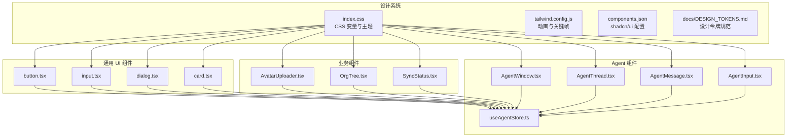

**图表来源**
- [app/src/index.css:1-218](file://app/src/index.css#L1-L218)
- [app/tailwind.config.js:1-39](file://app/tailwind.config.js#L1-L39)
- [app/components.json:1-21](file://app/components.json#L1-L21)
- [docs/DESIGN_TOKENS.md:1-200](file://docs/DESIGN_TOKENS.md#L1-L200)
- [app/src/components/ui/button.tsx:1-64](file://app/src/components/ui/button.tsx#L1-L64)
- [app/src/components/ui/input.tsx:1-26](file://app/src/components/ui/input.tsx#L1-L26)
- [app/src/components/ui/dialog.tsx:1-105](file://app/src/components/ui/dialog.tsx#L1-L105)
- [app/src/components/ui/card.tsx:1-59](file://app/src/components/ui/card.tsx#L1-L59)
- [app/src/components/business/AvatarUploader.tsx:1-258](file://app/src/components/business/AvatarUploader.tsx#L1-L258)
- [app/src/components/organization/OrgTree.tsx:1-164](file://app/src/components/organization/OrgTree.tsx#L1-L164)
- [app/src/components/business/SyncStatus.tsx:1-171](file://app/src/components/business/SyncStatus.tsx#L1-L171)
- [app/src/components/agent/AgentWindow.tsx:1-243](file://app/src/components/agent/AgentWindow.tsx#L1-L243)
- [app/src/components/agent/AgentThread.tsx:1-183](file://app/src/components/agent/AgentThread.tsx#L1-L183)
- [app/src/components/agent/AgentMessage.tsx:1-177](file://app/src/components/agent/AgentMessage.tsx#L1-L177)
- [app/src/components/agent/AgentInput.tsx:1-211](file://app/src/components/agent/AgentInput.tsx#L1-L211)
- [app/src/stores/useAgentStore.ts:1-482](file://app/src/stores/useAgentStore.ts#L1-L482)

**章节来源**
- [app/src/index.css:1-218](file://app/src/index.css#L1-L218)
- [app/tailwind.config.js:1-39](file://app/tailwind.config.js#L1-L39)
- [app/components.json:1-21](file://app/components.json#L1-L21)
- [docs/DESIGN_TOKENS.md:1-200](file://docs/DESIGN_TOKENS.md#L1-L200)

## 核心组件
- 设计令牌与颜色系统
  - 语义化颜色：background、foreground、card、popover、primary、secondary、muted、accent、destructive、success、warning、border、ring 等，分别提供明/暗两套值。
  - 字体系统：display 字体用于标题，sans 字体用于正文；字重规范覆盖 Regular/Medium/Semi-bold/Bold/Extra-bold。
  - 圆角与阴影：提供 `--radius-sm/md/lg` 与卡片/悬浮/弹出层阴影规范。
  - Tailwind v4 语法：渐变使用 `bg-linear-to-r`，透明度使用 `bg-primary/50`。
- 通用 UI 组件
  - Button：支持 default、destructive、outline、secondary、ghost、link、accent、success 等变体与 default、sm、lg、icon 尺寸；通过 Radix Slot 支持 asChild。
  - Input：统一边框、聚焦环、禁用态与 placeholder 样式；适配移动端文本大小。
  - Dialog：根组件、触发器、Portal、Overlay、Content、Header/Footer、Title/Description 子组件；内置关闭按钮与无障碍标签。
  - Card：Card、CardHeader、CardTitle、CardDescription、CardContent、CardFooter 子组件组合。
- 工具函数
  - cn：基于 clsx 与 tailwind-merge 的类名合并工具，避免冲突与重复。

**章节来源**
- [docs/DESIGN_TOKENS.md:13-182](file://docs/DESIGN_TOKENS.md#L13-L182)
- [app/src/components/ui/button.tsx:10-64](file://app/src/components/ui/button.tsx#L10-L64)
- [app/src/components/ui/input.tsx:8-26](file://app/src/components/ui/input.tsx#L8-L26)
- [app/src/components/ui/dialog.tsx:9-105](file://app/src/components/ui/dialog.tsx#L9-L105)
- [app/src/components/ui/card.tsx:8-59](file://app/src/components/ui/card.tsx#L8-L59)
- [app/src/lib/utils.ts:7-9](file://app/src/lib/utils.ts#L7-L9)

## 架构总览
UI 组件系统以“设计令牌 → 主题 → 通用组件 → 业务组件 → Agent 专用组件”的层次化方式组织。设计令牌通过 CSS 变量在全局生效，Tailwind v4 提供原子化样式与动画能力，shadcn/ui 提供可定制的通用组件基底。业务与 Agent 组件在各自领域内复用通用组件并注入业务状态与交互。

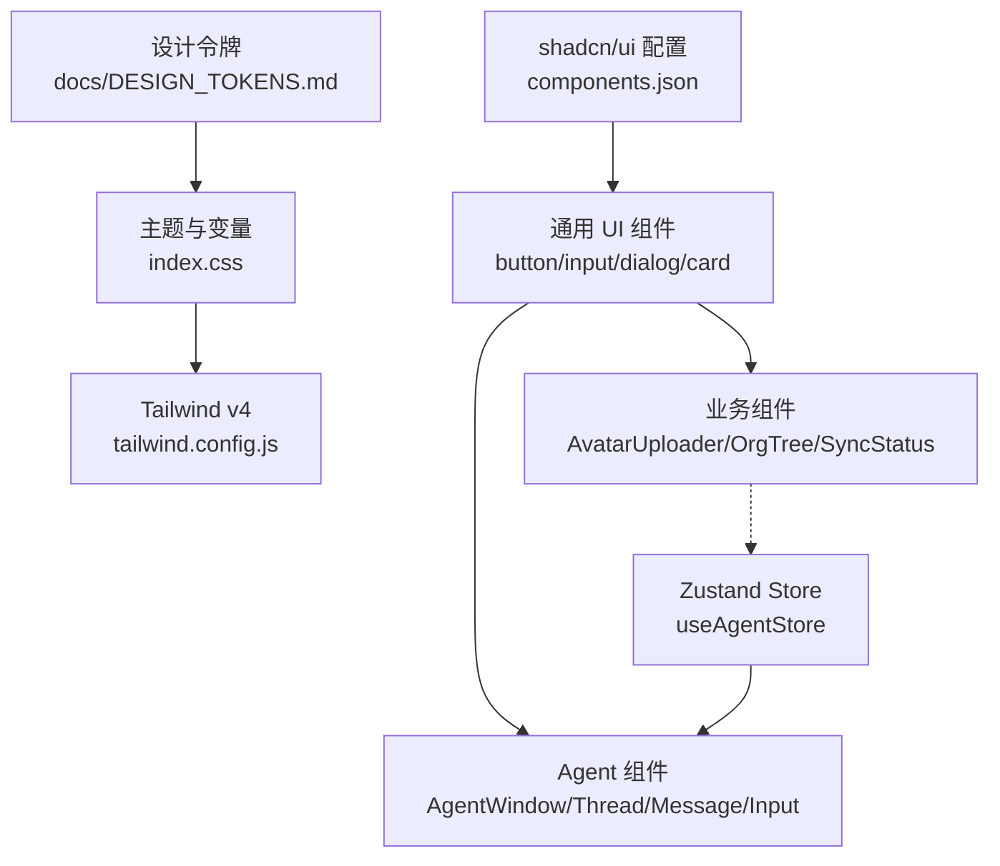

**图表来源**
- [docs/DESIGN_TOKENS.md:1-200](file://docs/DESIGN_TOKENS.md#L1-L200)
- [app/src/index.css:1-218](file://app/src/index.css#L1-L218)
- [app/tailwind.config.js:1-39](file://app/tailwind.config.js#L1-L39)
- [app/components.json:1-21](file://app/components.json#L1-L21)
- [app/src/components/ui/button.tsx:1-64](file://app/src/components/ui/button.tsx#L1-L64)
- [app/src/components/business/AvatarUploader.tsx:1-258](file://app/src/components/business/AvatarUploader.tsx#L1-L258)
- [app/src/components/organization/OrgTree.tsx:1-164](file://app/src/components/organization/OrgTree.tsx#L1-L164)
- [app/src/components/business/SyncStatus.tsx:1-171](file://app/src/components/business/SyncStatus.tsx#L1-L171)
- [app/src/components/agent/AgentWindow.tsx:1-243](file://app/src/components/agent/AgentWindow.tsx#L1-L243)
- [app/src/components/agent/AgentThread.tsx:1-183](file://app/src/components/agent/AgentThread.tsx#L1-L183)
- [app/src/components/agent/AgentMessage.tsx:1-177](file://app/src/components/agent/AgentMessage.tsx#L1-L177)
- [app/src/components/agent/AgentInput.tsx:1-211](file://app/src/components/agent/AgentInput.tsx#L1-L211)
- [app/src/stores/useAgentStore.ts:1-482](file://app/src/stores/useAgentStore.ts#L1-L482)

## 详细组件分析

### 通用 UI 组件库
- Button
  - 变体与尺寸：通过 cva 定义多变体与尺寸，结合 cn 合并类名；支持 asChild 透传至 Slot。
  - 无障碍与焦点：默认启用 ring-offset、focus-visible 聚焦环与 outline。
  - 自定义：可通过 variants/size/defaultVariants 扩展新变体或尺寸。
- Input
  - 统一样式：边框、圆角、placeholder、禁用态与移动端文本大小。
  - 可扩展：支持 type 与原生 input 属性透传。
- Dialog
  - 结构化子组件：Root、Trigger、Portal、Overlay、Content、Header/Footer、Title/Description。
  - 动画与可访问性：内置淡入淡出、缩放与滑入滑出动画；关闭按钮含 sr-only 标签。
- Card
  - 组合式子组件：Header/Title/Description/Content/Footer，便于灵活布局。

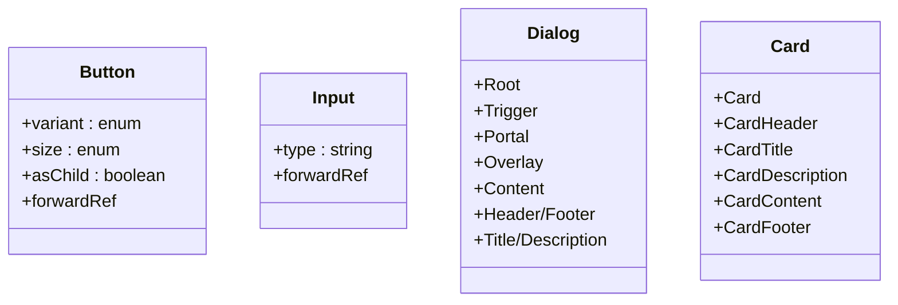

**图表来源**
- [app/src/components/ui/button.tsx:48-64](file://app/src/components/ui/button.tsx#L48-L64)
- [app/src/components/ui/input.tsx:8-26](file://app/src/components/ui/input.tsx#L8-L26)
- [app/src/components/ui/dialog.tsx:9-105](file://app/src/components/ui/dialog.tsx#L9-L105)
- [app/src/components/ui/card.tsx:8-59](file://app/src/components/ui/card.tsx#L8-L59)

**章节来源**
- [app/src/components/ui/button.tsx:1-64](file://app/src/components/ui/button.tsx#L1-L64)
- [app/src/components/ui/input.tsx:1-26](file://app/src/components/ui/input.tsx#L1-L26)
- [app/src/components/ui/dialog.tsx:1-105](file://app/src/components/ui/dialog.tsx#L1-L105)
- [app/src/components/ui/card.tsx:1-59](file://app/src/components/ui/card.tsx#L1-L59)

### 业务组件

#### 头像上传组件 AvatarUploader
- 功能要点
  - 支持点击与拖拽上传；文件校验（格式、大小）与图片尺寸校验。
  - 预览与裁剪：基于 AvatarCropper 进行二次处理。
  - 上传进度与错误提示：集成 Progress 与 Button。
  - 删除头像与加载遮罩：悬停遮罩与加载动画。
- 交互流程

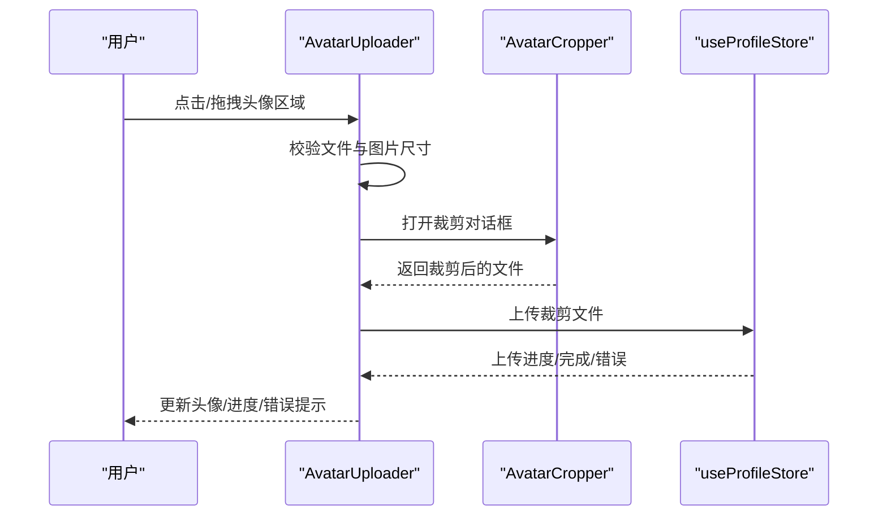

**图表来源**
- [app/src/components/business/AvatarUploader.tsx:30-130](file://app/src/components/business/AvatarUploader.tsx#L30-L130)
- [app/src/components/business/AvatarUploader.tsx:118-152](file://app/src/components/business/AvatarUploader.tsx#L118-L152)

**章节来源**
- [app/src/components/business/AvatarUploader.tsx:1-258](file://app/src/components/business/AvatarUploader.tsx#L1-L258)

#### 组织树组件 OrgTree
- 功能要点
  - 递归渲染组织层级树，支持节点展开/折叠与选中高亮。
  - 根节点默认展开；根据层级动态设置左侧缩进。
  - 成员数量展示与图标区分（文件夹/建筑）。
- 交互流程

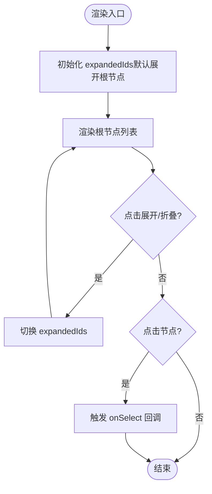

**图表来源**
- [app/src/components/organization/OrgTree.tsx:116-138](file://app/src/components/organization/OrgTree.tsx#L116-L138)
- [app/src/components/organization/OrgTree.tsx:38-47](file://app/src/components/organization/OrgTree.tsx#L38-L47)

**章节来源**
- [app/src/components/organization/OrgTree.tsx:1-164](file://app/src/components/organization/OrgTree.tsx#L1-L164)

#### 同步状态组件 SyncStatus
- 功能要点
  - 基于数据服务统计（在线状态、队列大小、最后同步时间、错误状态）决定可见性与显示内容。
  - 支持手动同步按钮；在 MSW 模式下隐藏。
  - 相对时间格式化与开发模式下的统计信息展示。
- 交互流程

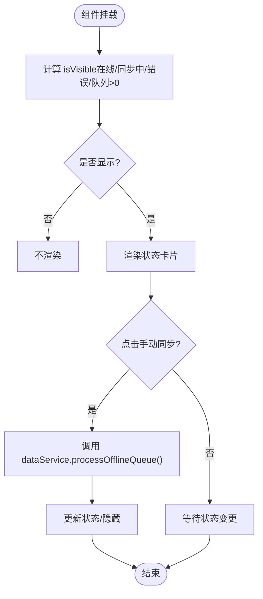

**图表来源**
- [app/src/components/business/SyncStatus.tsx:17-54](file://app/src/components/business/SyncStatus.tsx#L17-L54)
- [app/src/components/business/SyncStatus.tsx:32-44](file://app/src/components/business/SyncStatus.tsx#L32-L44)

**章节来源**
- [app/src/components/business/SyncStatus.tsx:1-171](file://app/src/components/business/SyncStatus.tsx#L1-L171)

### Agent 专用组件

#### Agent 窗口 AgentWindow
- 功能要点
  - 可拖拽、可最小化；右下角初始定位；支持恢复上次对话或新建对话。
  - 标题栏包含清空对话、最小化/最大化、关闭按钮；根据 isStreaming 显示状态文案。
  - 内容区包含 AgentThread 与 AgentInput。
- 状态与生命周期

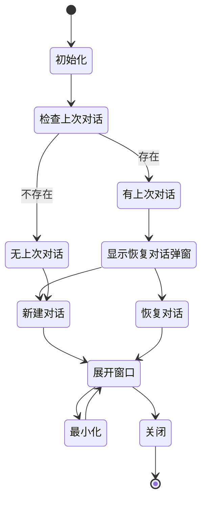

**图表来源**
- [app/src/components/agent/AgentWindow.tsx:36-90](file://app/src/components/agent/AgentWindow.tsx#L36-L90)
- [app/src/components/agent/AgentWindow.tsx:97-118](file://app/src/components/agent/AgentWindow.tsx#L97-L118)

**章节来源**
- [app/src/components/agent/AgentWindow.tsx:1-243](file://app/src/components/agent/AgentWindow.tsx#L1-L243)

#### Agent 消息列表 AgentThread 与消息 AgentMessage
- AgentThread
  - 自动滚动到底部；空状态时渲染上下文感知的智能推荐按钮。
  - 建议按钮支持导航提示与执行能力判断。
- AgentMessage
  - 区分用户/助手/系统错误三种角色；支持流式输出光标、A2UI Surface 渲染、工具调用展示与时间戳。
- 交互流程

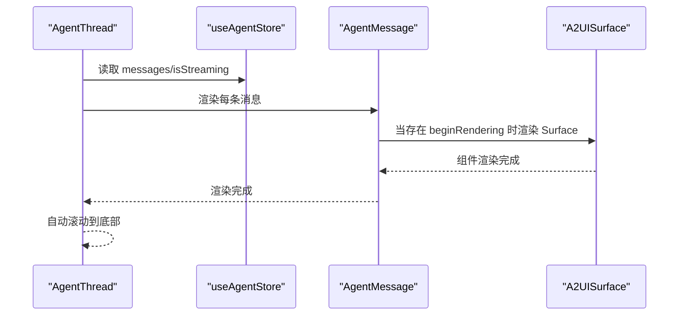

**图表来源**
- [app/src/components/agent/AgentThread.tsx:19-55](file://app/src/components/agent/AgentThread.tsx#L19-L55)
- [app/src/components/agent/AgentMessage.tsx:24-113](file://app/src/components/agent/AgentMessage.tsx#L24-L113)

**章节来源**
- [app/src/components/agent/AgentThread.tsx:1-183](file://app/src/components/agent/AgentThread.tsx#L1-L183)
- [app/src/components/agent/AgentMessage.tsx:1-177](file://app/src/components/agent/AgentMessage.tsx#L1-L177)

#### Agent 输入组件 AgentInput
- 功能要点
  - 自动调整高度的多行输入框；支持 Enter 发送、Shift+Enter 换行。
  - 上下文提示（如已选择照片数量）；推荐提示词区域（条件显示）。
  - 流式输出时显示“停止生成”按钮；错误状态与重试提示。
- 交互流程

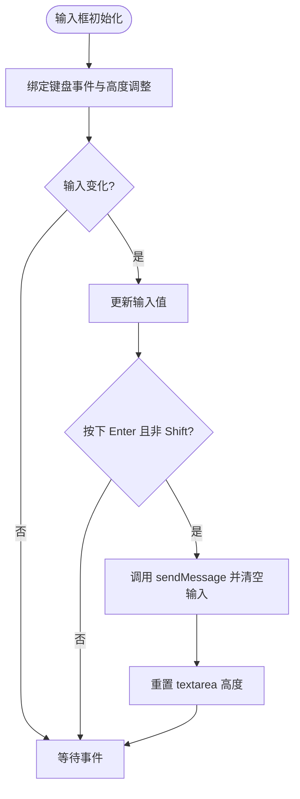

**图表来源**
- [app/src/components/agent/AgentInput.tsx:34-82](file://app/src/components/agent/AgentInput.tsx#L34-L82)
- [app/src/components/agent/AgentInput.tsx:90-97](file://app/src/components/agent/AgentInput.tsx#L90-L97)

**章节来源**
- [app/src/components/agent/AgentInput.tsx:1-211](file://app/src/components/agent/AgentInput.tsx#L1-L211)

#### Agent 状态管理 useAgentStore
- 会话管理：创建/加载/清空线程；持久化 lastAgentThreadId。
- 消息管理：追加/更新消息；占位 sendMessage 逻辑。
- Surface 与 Portal：beginRendering/surfaceUpdate/dataModelUpdate/deleteSurface 消息路由；移动端 renderTarget 自动升级。
- 用户操作：handleUserAction 调用 A2UI Action Handler 并生成通知消息。
- 工具函数：useA2UIMessageHandler、getLastThreadId、useHasLastThread。

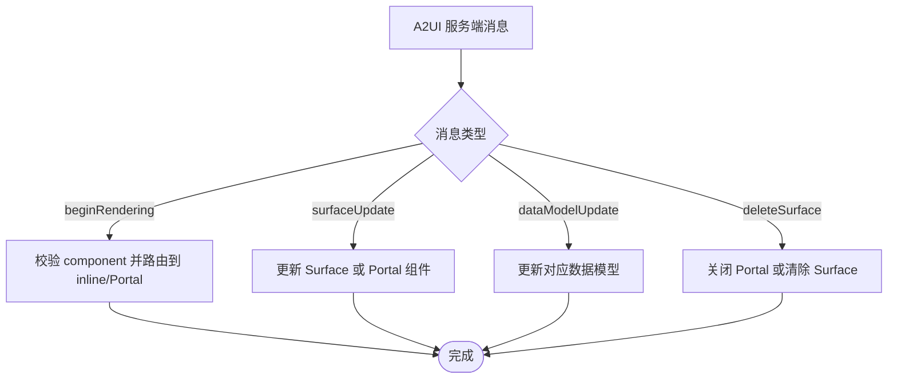

**图表来源**
- [app/src/stores/useAgentStore.ts:368-456](file://app/src/stores/useAgentStore.ts#L368-L456)

**章节来源**
- [app/src/stores/useAgentStore.ts:1-482](file://app/src/stores/useAgentStore.ts#L1-L482)

## 依赖分析
- 设计系统依赖
  - CSS 变量与 @theme：在 `index.css` 中集中定义颜色、圆角与字体变量。
  - Tailwind v4：在 `tailwind.config.js` 中扩展动画与关键帧；`components.json` 指定 shadcn/ui 风格与别名。
- 组件依赖
  - 通用 UI 组件依赖 Radix UI（Slot、Dialog）、class-variance-authority、cn 工具。
  - Agent 组件依赖 react-draggable、lucide-react、Zustand；业务组件依赖 store 与 service。
- 第三方库
  - package.json 中包含 react、react-dom、tailwindcss、zustand、lucide-react、@radix-ui 等。

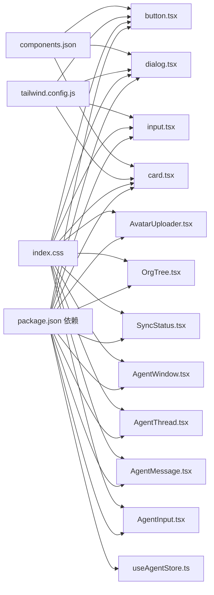

**图表来源**
- [app/package.json:48-84](file://app/package.json#L48-L84)
- [app/src/index.css:1-218](file://app/src/index.css#L1-L218)
- [app/tailwind.config.js:1-39](file://app/tailwind.config.js#L1-L39)
- [app/components.json:1-21](file://app/components.json#L1-L21)
- [app/src/components/ui/button.tsx:1-64](file://app/src/components/ui/button.tsx#L1-L64)
- [app/src/components/ui/dialog.tsx:1-105](file://app/src/components/ui/dialog.tsx#L1-L105)
- [app/src/components/ui/input.tsx:1-26](file://app/src/components/ui/input.tsx#L1-L26)
- [app/src/components/ui/card.tsx:1-59](file://app/src/components/ui/card.tsx#L1-L59)
- [app/src/components/business/AvatarUploader.tsx:1-258](file://app/src/components/business/AvatarUploader.tsx#L1-L258)
- [app/src/components/organization/OrgTree.tsx:1-164](file://app/src/components/organization/OrgTree.tsx#L1-L164)
- [app/src/components/business/SyncStatus.tsx:1-171](file://app/src/components/business/SyncStatus.tsx#L1-L171)
- [app/src/components/agent/AgentWindow.tsx:1-243](file://app/src/components/agent/AgentWindow.tsx#L1-L243)
- [app/src/components/agent/AgentThread.tsx:1-183](file://app/src/components/agent/AgentThread.tsx#L1-L183)
- [app/src/components/agent/AgentMessage.tsx:1-177](file://app/src/components/agent/AgentMessage.tsx#L1-L177)
- [app/src/components/agent/AgentInput.tsx:1-211](file://app/src/components/agent/AgentInput.tsx#L1-L211)
- [app/src/stores/useAgentStore.ts:1-482](file://app/src/stores/useAgentStore.ts#L1-L482)

**章节来源**
- [app/package.json:48-84](file://app/package.json#L48-L84)

## 性能考虑
- 组件渲染
  - Button、Input、Dialog、Card 等通用组件通过 cva 与 cn 合并类名，减少重复样式计算。
  - AgentThread 使用自动滚动锚点与按需渲染，避免不必要的重排。
- 动画与过渡
  - Tailwind v4 动画（fade-in、slide-up、shimmer）在 `tailwind.config.js` 中定义，避免复杂 JS 动画带来的性能损耗。
- 状态管理
  - useAgentStore 使用 Zustand 与持久化中间件，仅持久化必要字段，降低存储与序列化成本。
- 图片与上传
  - AvatarUploader 在上传前进行文件与尺寸校验，减少无效请求与渲染开销。

[本节为通用指导，无需特定文件分析]

## 故障排查指南
- 设计令牌与主题
  - 若颜色不随主题切换，请检查 `index.css` 中 CSS 变量与 `@variant dark` 的定义是否正确。
  - Tailwind v4 语法错误（如 gradient 旧语法）会导致样式失效，应使用 `bg-linear-to-r` 与 `bg-primary/50`。
- 通用组件
  - Button 未生效：确认 variants/size/defaultVariants 配置与类名合并逻辑。
  - Dialog 无障碍问题：确保关闭按钮包含 sr-only 标签与可访问性属性。
- 业务组件
  - AvatarUploader 上传失败：检查文件校验与裁剪流程，查看错误提示与控制台日志。
  - OrgTree 无数据：确认 tree 数据结构与成员数量字段是否存在。
  - SyncStatus 不显示：检查在线状态、队列大小与 MSW 模式开关。
- Agent 组件
  - AgentWindow 无法拖拽：检查 react-draggable 的 bounds 与 handle 类名。
  - AgentThread 不滚动：确认底部锚点与 messages 变化触发的 effect。
  - AgentMessage A2UI 渲染异常：检查 beginRendering 消息的 component 是否存在。
  - useAgentStore 消息路由错误：核对 renderTarget 与移动端自动升级逻辑。

**章节来源**
- [app/src/index.css:64-217](file://app/src/index.css#L64-L217)
- [app/tailwind.config.js:16-35](file://app/tailwind.config.js#L16-L35)
- [app/src/components/ui/button.tsx:10-64](file://app/src/components/ui/button.tsx#L10-L64)
- [app/src/components/ui/dialog.tsx:47-50](file://app/src/components/ui/dialog.tsx#L47-L50)
- [app/src/components/business/AvatarUploader.tsx:34-48](file://app/src/components/business/AvatarUploader.tsx#L34-L48)
- [app/src/components/organization/OrgTree.tsx:140-146](file://app/src/components/organization/OrgTree.tsx#L140-L146)
- [app/src/components/business/SyncStatus.tsx:47-49](file://app/src/components/business/SyncStatus.tsx#L47-L49)
- [app/src/components/agent/AgentWindow.tsx:131-137](file://app/src/components/agent/AgentWindow.tsx#L131-L137)
- [app/src/components/agent/AgentThread.tsx:28-32](file://app/src/components/agent/AgentThread.tsx#L28-L32)
- [app/src/components/agent/AgentMessage.tsx:89-91](file://app/src/components/agent/AgentMessage.tsx#L89-L91)
- [app/src/stores/useAgentStore.ts:381-383](file://app/src/stores/useAgentStore.ts#L381-L383)

## 结论
本 UI 组件系统以设计令牌为核心，结合 Tailwind CSS v4 与 shadcn/ui，提供了统一、可扩展的视觉与交互基底。通用组件具备良好的可定制性，业务与 Agent 组件在各自领域内实现了清晰的职责分离与状态管理。通过 cn 工具与 CSS 变量，系统在保证一致性的同时兼顾了灵活性与性能。

[本节为总结，无需特定文件分析]

## 附录

### 设计令牌与颜色系统速览
- 语义化颜色：background、foreground、card、popover、primary、secondary、muted、accent、destructive、success、warning、border、ring。
- 字体系统：display 用于标题，sans 用于正文；字重覆盖 Regular/Medium/Semi-bold/Bold/Extra-bold。
- 圆角与阴影：提供 `--radius-sm/md/lg` 与卡片/悬浮/弹出层阴影规范。
- Tailwind v4 语法：渐变使用 `bg-linear-to-r`，透明度使用 `bg-primary/50`。

**章节来源**
- [docs/DESIGN_TOKENS.md:13-182](file://docs/DESIGN_TOKENS.md#L13-L182)

### 组件使用示例与最佳实践
- 通用组件
  - Button：优先使用语义化变体（primary/secondary/destructive 等）与 size；避免硬编码颜色。
  - Input：统一使用 Input 组件，避免直接写原生 input 样式。
  - Dialog：使用 Content、Header/Footer、Title/Description 组合，确保可访问性。
  - Card：使用 CardHeader/CardTitle/CardContent/CardFooter 组合，避免直接写 div 样式。
- 业务组件
  - AvatarUploader：在上传前进行文件与尺寸校验；提供错误提示与进度反馈。
  - OrgTree：确保节点数据结构一致；根据层级动态设置缩进。
  - SyncStatus：在 MSW 模式下隐藏；提供手动同步按钮。
- Agent 组件
  - AgentWindow：合理设置初始位置与边界；最小化/最大化切换流畅。
  - AgentThread：自动滚动到底部；空状态提供智能推荐。
  - AgentMessage：区分角色与状态；支持 A2UI Surface 与工具调用展示。
  - AgentInput：支持快捷键发送；提供推荐提示词与上下文提示。

**章节来源**
- [app/src/components/ui/button.tsx:10-64](file://app/src/components/ui/button.tsx#L10-L64)
- [app/src/components/ui/input.tsx:8-26](file://app/src/components/ui/input.tsx#L8-L26)
- [app/src/components/ui/dialog.tsx:56-66](file://app/src/components/ui/dialog.tsx#L56-L66)
- [app/src/components/ui/card.tsx:19-24](file://app/src/components/ui/card.tsx#L19-L24)
- [app/src/components/business/AvatarUploader.tsx:30-58](file://app/src/components/business/AvatarUploader.tsx#L30-L58)
- [app/src/components/organization/OrgTree.tsx:116-138](file://app/src/components/organization/OrgTree.tsx#L116-L138)
- [app/src/components/business/SyncStatus.tsx:47-49](file://app/src/components/business/SyncStatus.tsx#L47-L49)
- [app/src/components/agent/AgentWindow.tsx:54-69](file://app/src/components/agent/AgentWindow.tsx#L54-L69)
- [app/src/components/agent/AgentThread.tsx:28-32](file://app/src/components/agent/AgentThread.tsx#L28-L32)
- [app/src/components/agent/AgentMessage.tsx:89-113](file://app/src/components/agent/AgentMessage.tsx#L89-L113)
- [app/src/components/agent/AgentInput.tsx:90-97](file://app/src/components/agent/AgentInput.tsx#L90-L97)

### 响应式设计与无障碍访问
- 响应式设计
  - 使用 Tailwind v4 断点与工具类；移动端与桌面端布局差异通过条件样式与组件行为适配。
- 无障碍访问
  - Dialog 关闭按钮包含 sr-only 标签；Button 支持 focus-visible 聚焦环；AvatarUploader 提供 aria-label 与 aria-hidden 控制。
  - AgentMessage 与 AgentInput 提供可访问性友好的图标与状态提示。

**章节来源**
- [app/src/components/ui/dialog.tsx:47-50](file://app/src/components/ui/dialog.tsx#L47-L50)
- [app/src/components/business/AvatarUploader.tsx:169-170](file://app/src/components/business/AvatarUploader.tsx#L169-L170)
- [app/src/components/agent/AgentMessage.tsx:89-113](file://app/src/components/agent/AgentMessage.tsx#L89-L113)
- [app/src/components/agent/AgentInput.tsx:159-160](file://app/src/components/agent/AgentInput.tsx#L159-L160)