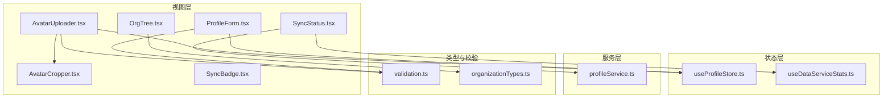
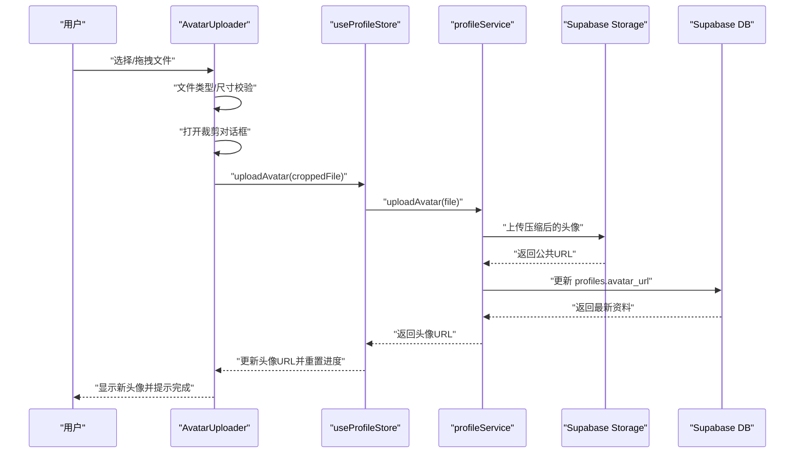
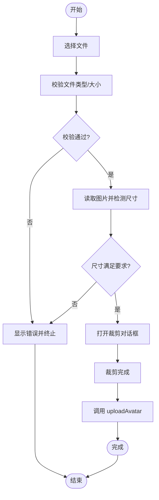
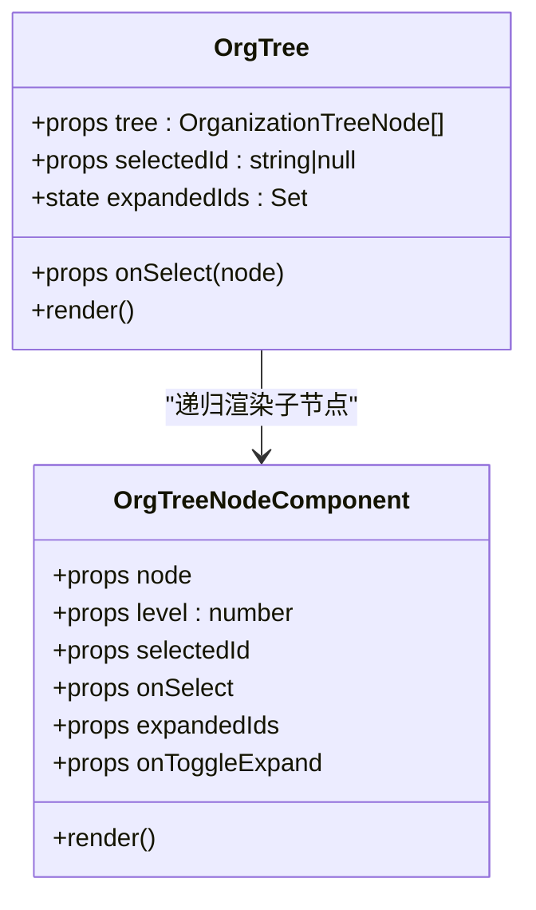
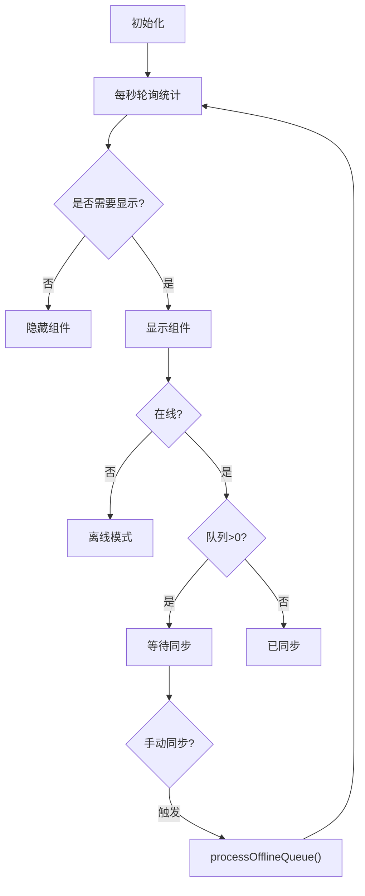
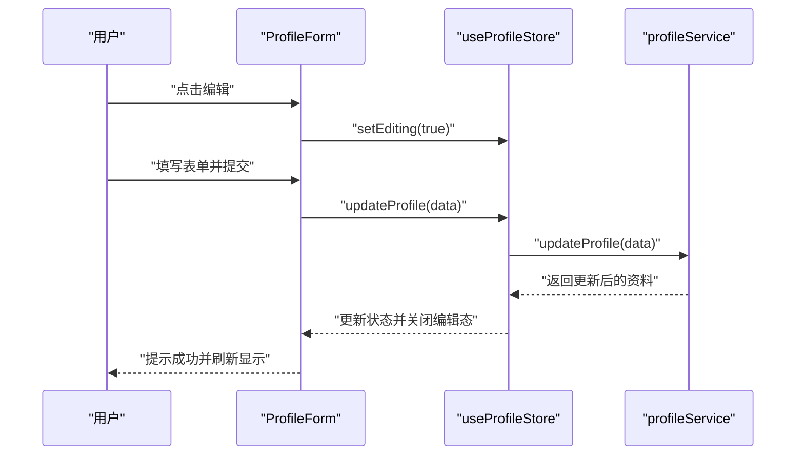
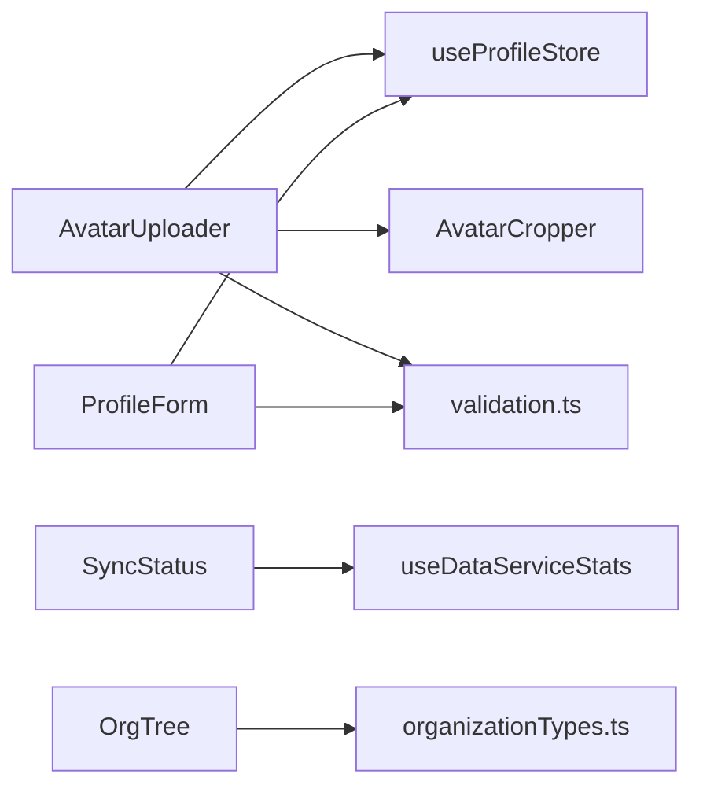

# 业务组件

<cite>
**本文引用的文件列表**
- [AvatarUploader.tsx](file://app/src/components/business/AvatarUploader.tsx)
- [AvatarCropper.tsx](file://app/src/components/business/AvatarCropper.tsx)
- [OrgTree.tsx](file://app/src/components/organization/OrgTree.tsx)
- [SyncStatus.tsx](file://app/src/components/business/SyncStatus.tsx)
- [SyncBadge.tsx](file://app/src/components/business/SyncBadge.tsx)
- [ProfileForm.tsx](file://app/src/components/business/ProfileForm.tsx)
- [useProfileStore.ts](file://app/src/stores/useProfileStore.ts)
- [useDataServiceStats.ts](file://app/src/hooks/useDataServiceStats.ts)
- [profileService.ts](file://app/src/services/api/profileService.ts)
- [validation.ts](file://app/src/types/validation.ts)
- [organizationTypes.ts](file://app/src/lib/supabase/organizationTypes.ts)
</cite>

## 目录
1. [引言](#引言)
2. [项目结构](#项目结构)
3. [核心组件](#核心组件)
4. [架构总览](#架构总览)
5. [组件详细分析](#组件详细分析)
6. [依赖关系分析](#依赖关系分析)
7. [性能考量](#性能考量)
8. [故障排查指南](#故障排查指南)
9. [结论](#结论)
10. [附录](#附录)

## 引言
本文件面向业务组件的使用者与维护者，系统性梳理并深入解析以下业务组件：
- 头像上传组件：AvatarUploader
- 组织树组件：OrgTree
- 同步状态组件：SyncStatus
- 个人资料表单：ProfileForm
- 同步徽章组件：SyncBadge

文档覆盖每个组件的功能特性、数据绑定、事件处理、状态管理、与业务逻辑的集成方式（数据获取、表单验证、错误处理）、使用示例与集成指南，并给出性能优化与用户体验建议。

## 项目结构
业务组件主要位于 app/src/components/business 与 app/src/components/organization 下，配合 stores、hooks、services、types 等模块协同工作，形成清晰的分层职责：
- 视图层：各业务组件负责 UI 展示与交互
- 状态层：Zustand stores 管理组件内部状态与跨组件共享状态
- 服务层：API 服务封装数据访问与业务操作
- 类型与校验：Zod Schema 与工具函数保障表单与文件校验
- Hooks：对数据服务进行统计与轮询

图表来源
- [AvatarUploader.tsx:1-258](file://app/src/components/business/AvatarUploader.tsx#L1-L258)
- [AvatarCropper.tsx:1-172](file://app/src/components/business/AvatarCropper.tsx#L1-L172)
- [OrgTree.tsx:1-164](file://app/src/components/organization/OrgTree.tsx#L1-L164)
- [SyncStatus.tsx:1-171](file://app/src/components/business/SyncStatus.tsx#L1-L171)
- [SyncBadge.tsx:1-88](file://app/src/components/business/SyncBadge.tsx#L1-L88)
- [ProfileForm.tsx:1-249](file://app/src/components/business/ProfileForm.tsx#L1-L249)
- [useProfileStore.ts:1-205](file://app/src/stores/useProfileStore.ts#L1-L205)
- [useDataServiceStats.ts:1-27](file://app/src/hooks/useDataServiceStats.ts#L1-L27)
- [profileService.ts:1-345](file://app/src/services/api/profileService.ts#L1-L345)
- [validation.ts:1-86](file://app/src/types/validation.ts#L1-L86)
- [organizationTypes.ts:1-91](file://app/src/lib/supabase/organizationTypes.ts#L1-L91)

章节来源
- [AvatarUploader.tsx:1-258](file://app/src/components/business/AvatarUploader.tsx#L1-L258)
- [OrgTree.tsx:1-164](file://app/src/components/organization/OrgTree.tsx#L1-L164)
- [SyncStatus.tsx:1-171](file://app/src/components/business/SyncStatus.tsx#L1-L171)
- [ProfileForm.tsx:1-249](file://app/src/components/business/ProfileForm.tsx#L1-L249)
- [SyncBadge.tsx:1-88](file://app/src/components/business/SyncBadge.tsx#L1-L88)

## 核心组件
本节概览五个业务组件的核心职责与典型用法：
- AvatarUploader：支持点击与拖拽上传头像，内置文件类型/尺寸校验，调用裁剪对话框，最终通过服务层上传至存储并更新用户资料。
- OrgTree：递归渲染组织树，支持节点展开/折叠与选中交互，适合在组织管理、权限分配等场景使用。
- SyncStatus：全局浮动的同步状态指示器，显示在线/离线、同步中/待同步/错误、最后同步时间等，并提供手动同步入口。
- ProfileForm：基于 react-hook-form + Zod 的个人资料表单，支持只读字段、编辑态切换、实时校验与乐观更新。
- SyncBadge：以图标+文字展示云同步状态（已同步/同步中/待同步/失败/离线/仅本地），适用于卡片、列表等轻量展示。

章节来源
- [AvatarUploader.tsx:1-258](file://app/src/components/business/AvatarUploader.tsx#L1-L258)
- [OrgTree.tsx:1-164](file://app/src/components/organization/OrgTree.tsx#L1-L164)
- [SyncStatus.tsx:1-171](file://app/src/components/business/SyncStatus.tsx#L1-L171)
- [ProfileForm.tsx:1-249](file://app/src/components/business/ProfileForm.tsx#L1-L249)
- [SyncBadge.tsx:1-88](file://app/src/components/business/SyncBadge.tsx#L1-L88)

## 架构总览
下面的序列图展示了“头像上传”从用户交互到云端存储的关键流程，体现组件、状态、服务与外部系统的协作。

图表来源
- [AvatarUploader.tsx:1-258](file://app/src/components/business/AvatarUploader.tsx#L1-L258)
- [useProfileStore.ts:1-205](file://app/src/stores/useProfileStore.ts#L1-L205)
- [profileService.ts:1-345](file://app/src/services/api/profileService.ts#L1-L345)

## 组件详细分析

### 头像上传组件（AvatarUploader）
- 功能特性
  - 支持点击与拖拽两种上传方式
  - 文件类型与大小限制、图片最小尺寸校验
  - 内置裁剪对话框，生成方形圆形头像
  - 上传进度条与加载状态提示
  - 删除头像功能与确认提示
- 数据绑定与状态管理
  - 通过 useProfileStore 管理头像 URL、上传状态、进度
  - 本地状态：拖拽高亮、裁剪弹窗、选中文件与预览图
- 事件处理
  - 拖拽事件：enter/leave/over/drop
  - 点击事件：触发隐藏文件输入
  - 裁剪完成/取消回调
  - 删除头像确认与异常处理
- 与业务逻辑集成
  - 文件校验与尺寸校验由 validation.ts 提供
  - 上传与删除由 profileService.ts 实现
  - 乐观更新与回滚策略在 useProfileStore.ts 中实现
- 使用示例
  - 在个人设置页引入组件，传入可选 className 即可
  - 组件内部会自动读取当前用户资料并展示头像
- 性能与体验
  - 上传进度模拟与真实进度结合，避免长时间无反馈
  - 裁剪采用 Canvas 输出 JPEG，兼顾质量与体积
  - 悬停遮罩与加载遮罩提升交互感知

图表来源
- [AvatarUploader.tsx:1-258](file://app/src/components/business/AvatarUploader.tsx#L1-L258)
- [validation.ts:1-86](file://app/src/types/validation.ts#L1-L86)
- [useProfileStore.ts:1-205](file://app/src/stores/useProfileStore.ts#L1-L205)
- [profileService.ts:1-345](file://app/src/services/api/profileService.ts#L1-L345)

章节来源
- [AvatarUploader.tsx:1-258](file://app/src/components/business/AvatarUploader.tsx#L1-L258)
- [AvatarCropper.tsx:1-172](file://app/src/components/business/AvatarCropper.tsx#L1-L172)
- [validation.ts:1-86](file://app/src/types/validation.ts#L1-L86)
- [useProfileStore.ts:1-205](file://app/src/stores/useProfileStore.ts#L1-L205)
- [profileService.ts:1-345](file://app/src/services/api/profileService.ts#L1-L345)

### 组织树组件（OrgTree）
- 功能特性
  - 递归渲染组织层级树，支持根节点默认展开
  - 节点展开/折叠与选中高亮
  - 成员数量展示（当提供 member_count）
  - 自定义层级缩进与图标
- 数据绑定与状态管理
  - 接收 tree、selectedId、onSelect 三个关键属性
  - 内部维护 expandedIds 集合，控制节点展开状态
- 事件处理
  - 节点点击：触发 onSelect 回调
  - 折叠按钮点击：切换展开状态（阻止冒泡）
- 使用示例
  - 在组织管理页面传入组织树数据与选中回调
  - 选中节点后可联动展示成员列表或权限配置
- 性能与体验
  - 仅渲染当前展开层级，避免一次性渲染大量节点
  - 通过 style 控制缩进，保证视觉层级清晰

图表来源
- [OrgTree.tsx:1-164](file://app/src/components/organization/OrgTree.tsx#L1-L164)
- [organizationTypes.ts:1-91](file://app/src/lib/supabase/organizationTypes.ts#L1-L91)

章节来源
- [OrgTree.tsx:1-164](file://app/src/components/organization/OrgTree.tsx#L1-L164)
- [organizationTypes.ts:1-91](file://app/src/lib/supabase/organizationTypes.ts#L1-L91)

### 同步状态组件（SyncStatus）
- 功能特性
  - 全局浮动提示，根据同步状态动态显示
  - 在线/离线、同步中/待同步/错误、最后同步时间
  - 手动同步按钮（仅在线且队列非空时可用）
  - 开发模式下显示统计信息（成功/失败/冲突）
- 数据绑定与状态管理
  - 通过 useDataServiceStats 每秒轮询获取同步统计
  - isVisible 基于状态条件动态显示/隐藏
- 事件处理
  - 手动同步：调用 dataService.processOfflineQueue
  - MSW 模式下不渲染（环境变量控制）
- 使用示例
  - 在应用根组件引入，即可在后台显示同步状态
- 性能与体验
  - 仅在有活动或错误时显示，避免干扰
  - 动画过渡提升出现/消失的流畅度

图表来源
- [SyncStatus.tsx:1-171](file://app/src/components/business/SyncStatus.tsx#L1-L171)
- [useDataServiceStats.ts:1-27](file://app/src/hooks/useDataServiceStats.ts#L1-L27)

章节来源
- [SyncStatus.tsx:1-171](file://app/src/components/business/SyncStatus.tsx#L1-L171)
- [useDataServiceStats.ts:1-27](file://app/src/hooks/useDataServiceStats.ts#L1-L27)

### 个人资料表单（ProfileForm）
- 功能特性
  - 基于 react-hook-form + Zod 的强类型表单
  - 邮箱与注册时间只读，其余字段可编辑
  - 编辑/保存/取消按钮，支持保存中状态与禁用条件
  - 实时字段级错误提示
- 数据绑定与状态管理
  - 通过 useProfileStore 管理 profile、编辑态、加载状态
  - 表单默认值来自 profile，加载完成后 reset 到最新值
- 事件处理
  - 提交：调用 updateProfile，成功后关闭编辑态并提示
  - 取消：重置表单并关闭编辑态
  - 进入编辑：开启编辑态
- 使用示例
  - 在个人资料页引入，传入可选 className
  - 与 AvatarUploader 组件配合使用，统一在设置页展示
- 性能与体验
  - 乐观更新提升响应速度，失败回滚保持一致性
  - 只读字段禁用态与背景色区分，减少误操作

图表来源
- [ProfileForm.tsx:1-249](file://app/src/components/business/ProfileForm.tsx#L1-L249)
- [useProfileStore.ts:1-205](file://app/src/stores/useProfileStore.ts#L1-L205)
- [profileService.ts:1-345](file://app/src/services/api/profileService.ts#L1-L345)

章节来源
- [ProfileForm.tsx:1-249](file://app/src/components/business/ProfileForm.tsx#L1-L249)
- [useProfileStore.ts:1-205](file://app/src/stores/useProfileStore.ts#L1-L205)
- [profileService.ts:1-345](file://app/src/services/api/profileService.ts#L1-L345)
- [validation.ts:1-86](file://app/src/types/validation.ts#L1-L86)

### 同步徽章（SyncBadge）
- 功能特性
  - 以图标+文字展示同步状态（已同步/同步中/待同步/失败/离线/仅本地）
  - 支持 sm/md 两种尺寸
  - 基于状态映射不同颜色与动画
- 数据绑定与状态管理
  - 通过 props.status 传入状态，默认为 synced
  - 通过 size 控制图标与文字显示
- 使用示例
  - 在卡片、列表、表格等场景展示单项数据的同步状态
- 性能与体验
  - 简洁的样式映射，开销极低
  - 动画仅在同步中状态启用，避免不必要的视觉干扰

章节来源
- [SyncBadge.tsx:1-88](file://app/src/components/business/SyncBadge.tsx#L1-L88)

## 依赖关系分析
- 组件间耦合
  - AvatarUploader 依赖 useProfileStore 与 AvatarCropper；ProfileForm 依赖 useProfileStore；SyncStatus 依赖 useDataServiceStats
  - OrgTree 依赖 organizationTypes 的树节点类型
- 外部依赖
  - react-hook-form + Zod：ProfileForm 的表单验证
  - react-easy-crop：AvatarCropper 的裁剪能力
  - lucide-react：图标库
  - Zustand：状态管理
- 潜在循环依赖
  - 未发现直接循环依赖；组件通过服务层与状态层间接通信
- 接口契约
  - 组件通过 props 传递数据与回调，遵循单向数据流

图表来源
- [AvatarUploader.tsx:1-258](file://app/src/components/business/AvatarUploader.tsx#L1-L258)
- [AvatarCropper.tsx:1-172](file://app/src/components/business/AvatarCropper.tsx#L1-L172)
- [ProfileForm.tsx:1-249](file://app/src/components/business/ProfileForm.tsx#L1-L249)
- [SyncStatus.tsx:1-171](file://app/src/components/business/SyncStatus.tsx#L1-L171)
- [OrgTree.tsx:1-164](file://app/src/components/organization/OrgTree.tsx#L1-L164)
- [useProfileStore.ts:1-205](file://app/src/stores/useProfileStore.ts#L1-L205)
- [useDataServiceStats.ts:1-27](file://app/src/hooks/useDataServiceStats.ts#L1-L27)
- [validation.ts:1-86](file://app/src/types/validation.ts#L1-L86)
- [organizationTypes.ts:1-91](file://app/src/lib/supabase/organizationTypes.ts#L1-L91)

章节来源
- [AvatarUploader.tsx:1-258](file://app/src/components/business/AvatarUploader.tsx#L1-L258)
- [ProfileForm.tsx:1-249](file://app/src/components/business/ProfileForm.tsx#L1-L249)
- [SyncStatus.tsx:1-171](file://app/src/components/business/SyncStatus.tsx#L1-L171)
- [OrgTree.tsx:1-164](file://app/src/components/organization/OrgTree.tsx#L1-L164)
- [useProfileStore.ts:1-205](file://app/src/stores/useProfileStore.ts#L1-L205)
- [useDataServiceStats.ts:1-27](file://app/src/hooks/useDataServiceStats.ts#L1-L27)
- [validation.ts:1-86](file://app/src/types/validation.ts#L1-L86)
- [organizationTypes.ts:1-91](file://app/src/lib/supabase/organizationTypes.ts#L1-L91)

## 性能考量
- 上传与渲染
  - AvatarUploader 上传前对图片进行压缩与裁剪，降低带宽与存储成本
  - 上传进度模拟与真实进度结合，避免长时间无反馈
- 表单与状态
  - ProfileForm 使用 react-hook-form 的惰性校验与字段级错误，减少不必要的重渲染
  - useProfileStore 的乐观更新与回滚，提升交互响应速度
- 同步状态
  - SyncStatus 仅在有活动或错误时显示，useDataServiceStats 每秒轮询，避免过度刷新
- 组织树
  - OrgTree 仅渲染当前展开层级，通过 style 控制缩进，避免一次性渲染大量节点

## 故障排查指南
- 头像上传失败
  - 检查文件类型与大小限制，确保符合验证规则
  - 确认裁剪区域有效，Canvas 转 Blob 成功
  - 查看服务层日志与错误提示，确认存储与数据库更新结果
- 个人资料更新失败
  - 检查表单字段是否满足 Zod 校验
  - 确认 useProfileStore 的乐观更新是否被正确回滚
- 同步状态异常
  - 检查 useDataServiceStats 是否正常轮询
  - 确认网络状态与队列长度，必要时手动触发同步
- 组织树无数据
  - 检查传入的 tree 是否为空或结构不匹配
  - 确认节点是否包含 children 与 member_count 字段

章节来源
- [AvatarUploader.tsx:1-258](file://app/src/components/business/AvatarUploader.tsx#L1-L258)
- [ProfileForm.tsx:1-249](file://app/src/components/business/ProfileForm.tsx#L1-L249)
- [SyncStatus.tsx:1-171](file://app/src/components/business/SyncStatus.tsx#L1-L171)
- [OrgTree.tsx:1-164](file://app/src/components/organization/OrgTree.tsx#L1-L164)
- [useProfileStore.ts:1-205](file://app/src/stores/useProfileStore.ts#L1-L205)
- [profileService.ts:1-345](file://app/src/services/api/profileService.ts#L1-L345)

## 结论
上述业务组件围绕用户资料、组织架构与数据同步三大主题构建，具备良好的可复用性与扩展性。通过清晰的分层设计与严格的类型校验，组件在保证易用性的同时兼顾了性能与可靠性。建议在实际业务中：
- 将头像上传与个人资料表单组合使用，统一在设置页呈现
- 在组织管理场景中结合 OrgTree 与成员列表，提供直观的层级导航
- 在需要全局同步状态感知的页面引入 SyncStatus，提升用户信任度
- 使用 SyncBadge 在轻量场景快速传达同步状态

## 附录
- 使用示例（路径参考）
  - 头像上传：在设置页引入 AvatarUploader 并绑定 useProfileStore
  - 个人资料：在资料页引入 ProfileForm，并在编辑/保存时处理 toast 提示
  - 组织树：在组织管理页引入 OrgTree，并传入 onSelect 回调
  - 同步状态：在应用根组件引入 SyncStatus
  - 同步徽章：在卡片/列表中按需引入 SyncBadge 并传入状态