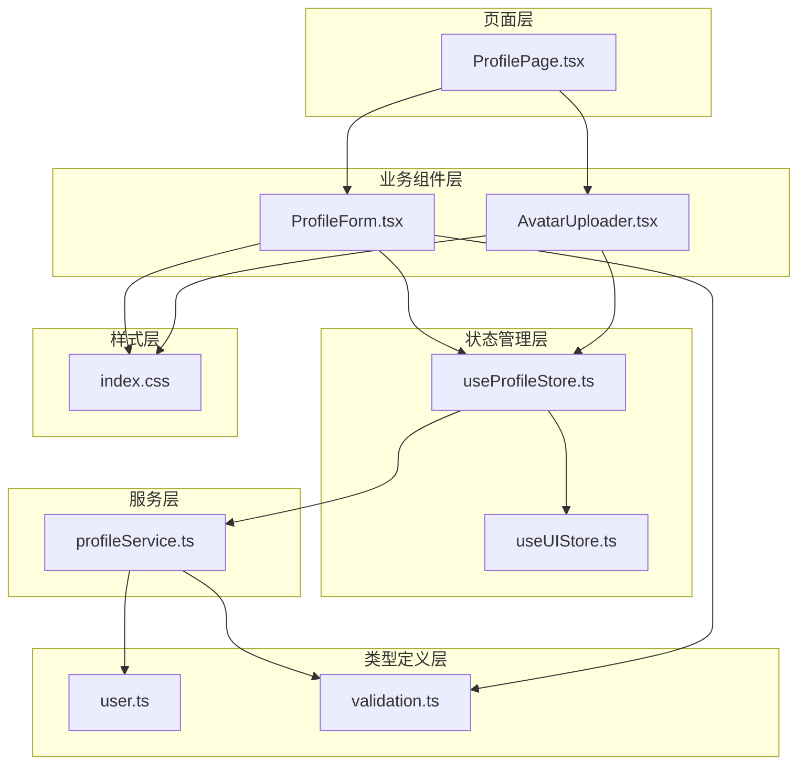
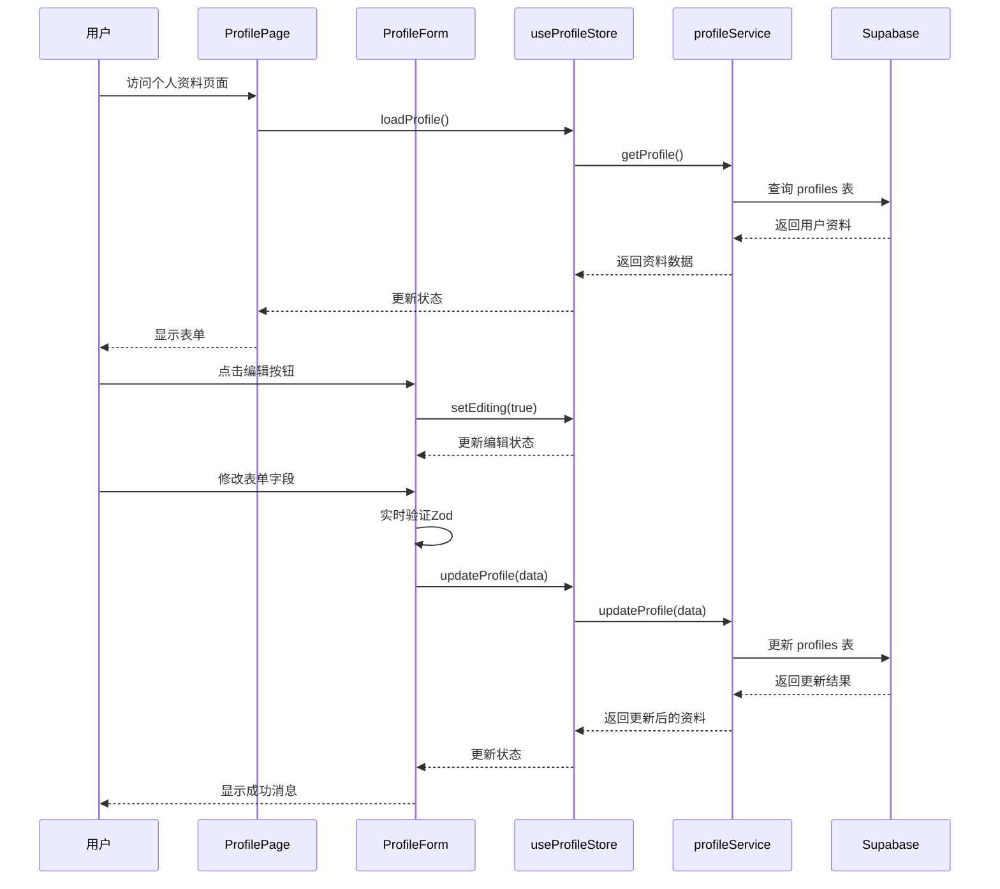
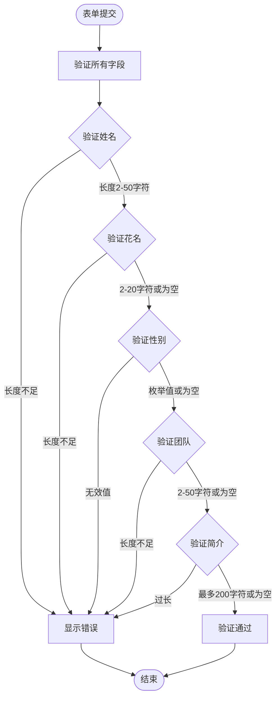
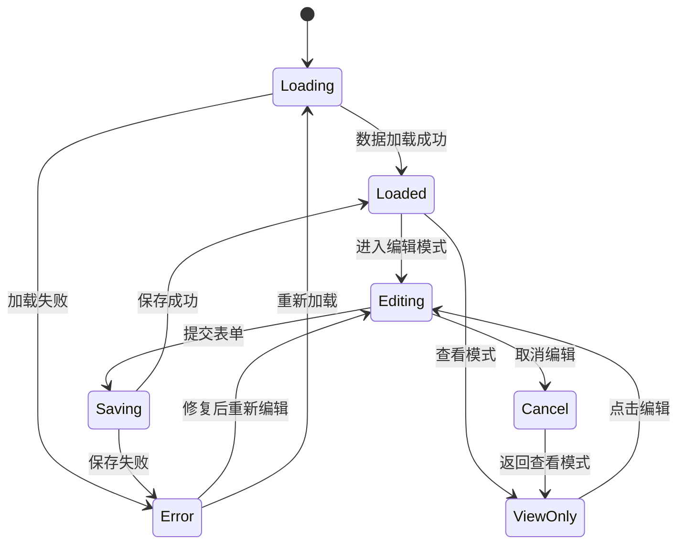
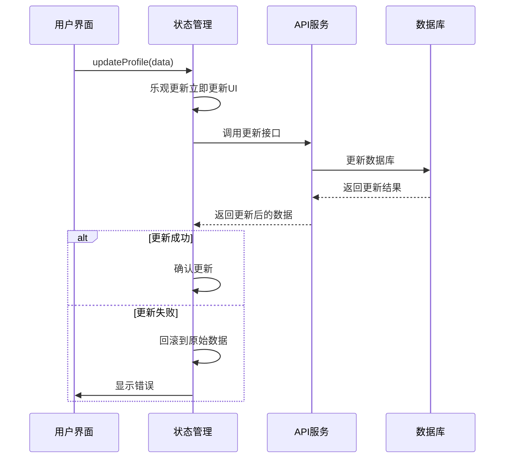
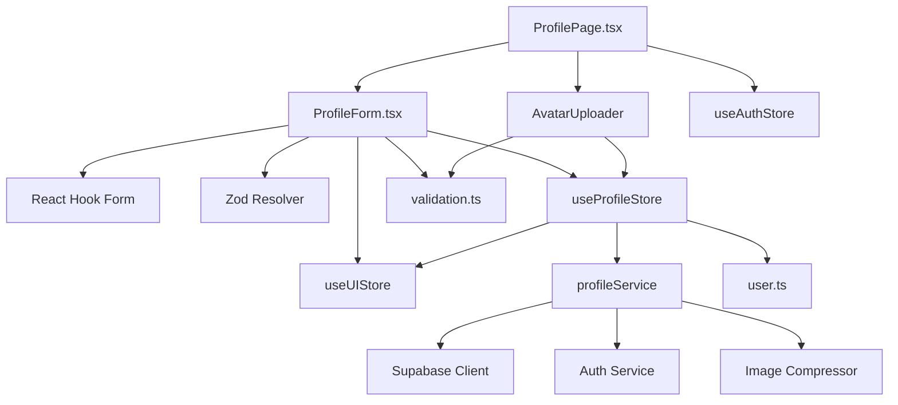

# 个人资料表单

<cite>
**本文档引用的文件**
- [ProfileForm.tsx](file://app/src/components/business/ProfileForm.tsx)
- [useProfileStore.ts](file://app/src/stores/useProfileStore.ts)
- [profileService.ts](file://app/src/services/api/profileService.ts)
- [ProfilePage.tsx](file://app/src/pages/ProfilePage.tsx)
- [user.ts](file://app/src/types/user.ts)
- [validation.ts](file://app/src/types/validation.ts)
- [useUIStore.ts](file://app/src/stores/useUIStore.ts)
- [AvatarUploader.tsx](file://app/src/components/business/AvatarUploader.tsx)
- [index.css](file://app/src/index.css)
</cite>

## 目录
1. [简介](#简介)
2. [项目结构](#项目结构)
3. [核心组件](#核心组件)
4. [架构概览](#架构概览)
5. [详细组件分析](#详细组件分析)
6. [依赖关系分析](#依赖关系分析)
7. [性能考虑](#性能考虑)
8. [故障排除指南](#故障排除指南)
9. [结论](#结论)
10. [附录](#附录)

## 简介

个人资料表单组件是一个功能完整的用户信息编辑界面，基于 React Hook Form 和 Zod 验证库构建。该组件提供了用户基本信息的编辑、实时验证、状态管理和数据持久化功能。组件支持姓名、邮箱、电话号码等字段的编辑，并集成了头像上传功能。

该组件采用现代化的前端架构，使用 Zustand 状态管理、Supabase 数据库集成和 Tailwind CSS 样式系统，为用户提供流畅的编辑体验。

## 项目结构

个人资料表单组件位于应用的业务组件层，与页面层、服务层和状态管理层形成清晰的分层架构：



**图表来源**
- [ProfileForm.tsx:1-249](file://app/src/components/business/ProfileForm.tsx#L1-L249)
- [ProfilePage.tsx:1-182](file://app/src/pages/ProfilePage.tsx#L1-L182)
- [useProfileStore.ts:1-205](file://app/src/stores/useProfileStore.ts#L1-L205)

**章节来源**
- [ProfileForm.tsx:1-249](file://app/src/components/business/ProfileForm.tsx#L1-L249)
- [ProfilePage.tsx:1-182](file://app/src/pages/ProfilePage.tsx#L1-L182)

## 核心组件

### ProfileForm 组件

ProfileForm 是个人资料编辑的核心组件，提供了完整的表单编辑功能：

**主要功能特性：**
- 实时表单验证（Zod + React Hook Form）
- 编辑模式切换（只读/可编辑）
- 加载状态管理
- 错误状态处理
- 提交状态控制

**表单字段设计：**
- 邮箱：只读显示（来自认证系统）
- 注册时间：只读显示（格式化日期）
- 真实姓名：必填字段（2-50字符）
- 花名：可选字段（2-20字符）
- 性别：单选按钮（男/女/其他）
- 所在团队：可选字段（2-50字符）
- 个人简介：可选文本域（最多200字符）

**状态管理：**
- `isEditing`: 控制编辑模式
- `isLoading`: 显示加载状态
- `errors`: 存储验证错误
- `isDirty`: 检测表单是否被修改

**章节来源**
- [ProfileForm.tsx:18-249](file://app/src/components/business/ProfileForm.tsx#L18-L249)
- [validation.ts:11-27](file://app/src/types/validation.ts#L11-L27)

### useProfileStore 状态管理

使用 Zustand 构建的状态管理容器，负责管理用户资料的完整生命周期：

**状态属性：**
- `profile`: 当前用户资料对象
- `isLoading`: 加载状态标志
- `isEditing`: 编辑模式标志
- `error`: 错误信息
- `uploadProgress`: 上传进度

**核心方法：**
- `loadProfile()`: 加载用户资料
- `updateProfile()`: 更新用户资料（乐观更新）
- `uploadAvatar()`: 上传头像
- `deleteAvatar()`: 删除头像
- `setEditing()`: 切换编辑模式

**章节来源**
- [useProfileStore.ts:10-26](file://app/src/stores/useProfileStore.ts#L10-L26)
- [useProfileStore.ts:36-204](file://app/src/stores/useProfileStore.ts#L36-L204)

## 架构概览

个人资料表单采用分层架构设计，确保关注点分离和代码可维护性：



**图表来源**
- [ProfilePage.tsx:17-50](file://app/src/pages/ProfilePage.tsx#L17-L50)
- [ProfileForm.tsx:58-66](file://app/src/components/business/ProfileForm.tsx#L58-L66)
- [useProfileStore.ts:58-92](file://app/src/stores/useProfileStore.ts#L58-L92)

## 详细组件分析

### 表单验证系统

表单验证采用 Zod 库实现类型安全的验证规则：



**图表来源**
- [validation.ts:11-27](file://app/src/types/validation.ts#L11-L27)

**验证规则详情：**
- **姓名**: 必填，2-50字符
- **花名**: 可选，2-20字符
- **性别**: 可选，枚举值（male/female/other）
- **团队**: 可选，2-50字符
- **简介**: 可选，最多200字符

**章节来源**
- [validation.ts:11-27](file://app/src/types/validation.ts#L11-L27)

### 数据流处理

组件的数据流遵循单向数据绑定原则：



**图表来源**
- [ProfileForm.tsx:22-81](file://app/src/components/business/ProfileForm.tsx#L22-L81)
- [useProfileStore.ts:58-92](file://app/src/stores/useProfileStore.ts#L58-L92)

### 乐观更新机制

使用乐观更新提升用户体验，立即更新本地状态并在后台同步到服务器：



**图表来源**
- [useProfileStore.ts:65-91](file://app/src/stores/useProfileStore.ts#L65-L91)

**章节来源**
- [useProfileStore.ts:58-92](file://app/src/stores/useProfileStore.ts#L58-L92)

### 错误处理策略

组件实现了多层次的错误处理机制：

1. **表单验证错误**: 使用 Zod 提供即时反馈
2. **网络请求错误**: 捕获 API 调用异常
3. **乐观更新回滚**: 自动恢复到之前的状态
4. **用户友好的错误消息**: 统一的错误提示格式

**章节来源**
- [ProfileForm.tsx:63-65](file://app/src/components/business/ProfileForm.tsx#L63-L65)
- [useProfileStore.ts:82-90](file://app/src/stores/useProfileStore.ts#L82-L90)

## 依赖关系分析

### 组件依赖图



**图表来源**
- [ProfileForm.tsx:6-16](file://app/src/components/business/ProfileForm.tsx#L6-L16)
- [useProfileStore.ts:6-8](file://app/src/stores/useProfileStore.ts#L6-L8)
- [profileService.ts:6-9](file://app/src/services/api/profileService.ts#L6-L9)

### 外部依赖

**核心依赖包：**
- `react-hook-form`: 表单状态管理和验证
- `@hookform/resolvers`: Zod 验证器集成
- `zod`: 类型安全的验证库
- `lucide-react`: 图标库
- `date-fns`: 日期格式化工具

**状态管理：**
- `zustand`: 轻量级状态管理库

**样式系统：**
- `tailwindcss`: CSS 框架
- `clsx` + `tailwind-merge`: 类名合并工具

**章节来源**
- [ProfileForm.tsx:7-16](file://app/src/components/business/ProfileForm.tsx#L7-L16)
- [useProfileStore.ts:6](file://app/src/stores/useProfileStore.ts#L6)

## 性能考虑

### 优化策略

1. **懒加载**: 头像上传组件按需加载
2. **条件渲染**: 只在需要时渲染编辑控件
3. **防抖处理**: 表单验证的防抖处理
4. **缓存策略**: 用户资料的本地缓存
5. **图片压缩**: 自动压缩上传的头像图片

### 内存管理

- 使用 `useEffect` 清理副作用
- 合理的组件卸载处理
- 避免不必要的重渲染

### 网络优化

- 乐观更新减少等待时间
- 批量 API 调用
- 错误重试机制

## 故障排除指南

### 常见问题及解决方案

**问题1: 表单无法提交**
- 检查 `isDirty` 状态是否为 true
- 确认所有必填字段都已正确填写
- 查看控制台是否有验证错误

**问题2: 资料更新失败**
- 检查网络连接状态
- 查看 `error` 状态信息
- 确认用户已登录

**问题3: 编辑模式不生效**
- 确认 `isEditing` 状态正确设置
- 检查按钮事件绑定
- 验证权限设置

**问题4: 验证规则不生效**
- 检查 Zod schema 定义
- 确认字段名称匹配
- 验证数据类型转换

**章节来源**
- [ProfileForm.tsx:26-40](file://app/src/components/business/ProfileForm.tsx#L26-L40)
- [useProfileStore.ts:42-52](file://app/src/stores/useProfileStore.ts#L42-L52)

### 调试技巧

1. **启用开发工具**: 使用 React DevTools 检查组件状态
2. **日志输出**: 在关键位置添加 console.log
3. **状态检查**: 使用浏览器开发者工具检查 Zustand 状态
4. **网络监控**: 使用浏览器网络面板监控 API 调用

## 结论

个人资料表单组件是一个功能完整、架构清晰的用户界面组件。它成功地结合了现代前端技术栈，提供了优秀的用户体验和可靠的错误处理机制。

**主要优势：**
- 类型安全的验证系统
- 流畅的用户交互体验
- 完善的状态管理
- 可扩展的架构设计
- 优秀的错误处理机制

**技术亮点：**
- React Hook Form + Zod 的组合验证
- Zustand 状态管理的轻量化实现
- 乐观更新提升性能
- Tailwind CSS 的现代化样式

该组件为后续的功能扩展奠定了良好的基础，可以轻松地添加更多字段或集成新的功能模块。

## 附录

### 使用示例

在设置页面中集成个人资料编辑功能的完整示例：

```typescript
// 在 ProfilePage 中使用
import { ProfileForm } from '@/components/business/ProfileForm'

function SettingsPage() {
  return (
    <div className="max-w-4xl mx-auto">
      <h1 className="text-2xl font-bold mb-6">设置</h1>
      <div className="grid grid-cols-1 lg:grid-cols-3 gap-8">
        <div className="lg:col-span-2">
          <ProfileForm />
        </div>
      </div>
    </div>
  )
}
```

### 配置选项

**组件属性：**
- `className`: 自定义样式类名

**验证配置：**
- 字符长度限制
- 数据类型验证
- 必填字段检查

**样式定制：**
- Tailwind CSS 类名覆盖
- 主题变量支持
- 响应式布局适配

### 最佳实践

1. **表单设计**: 保持简洁直观的用户界面
2. **错误处理**: 提供清晰的错误信息和恢复选项
3. **性能优化**: 合理使用懒加载和条件渲染
4. **可访问性**: 确保组件对残障用户友好
5. **测试覆盖**: 为关键功能编写单元测试