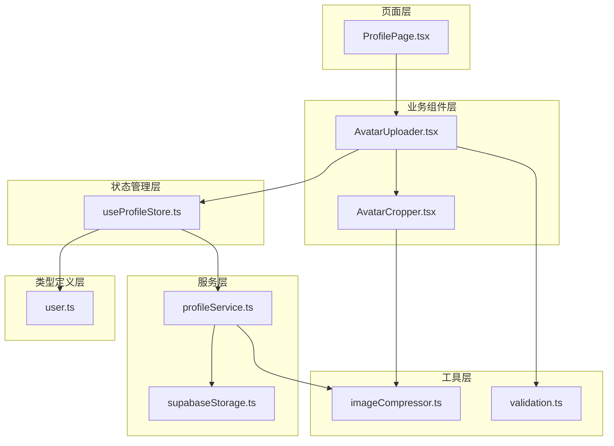
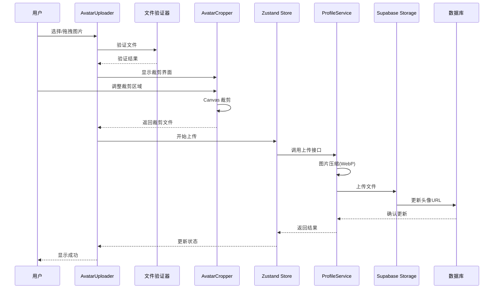
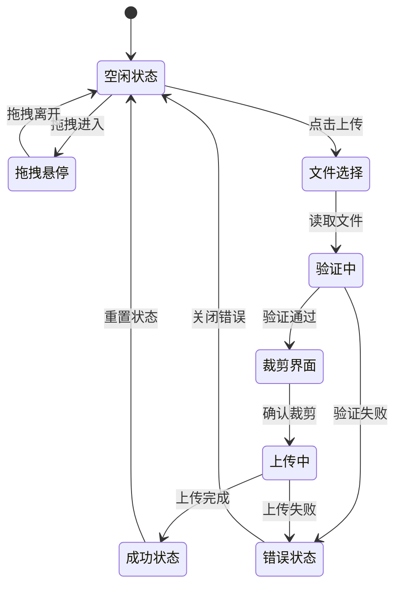
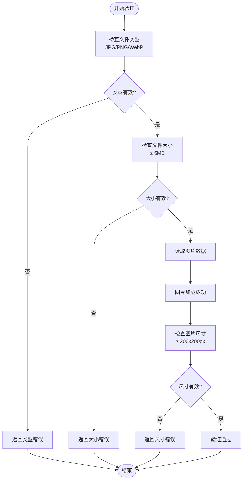
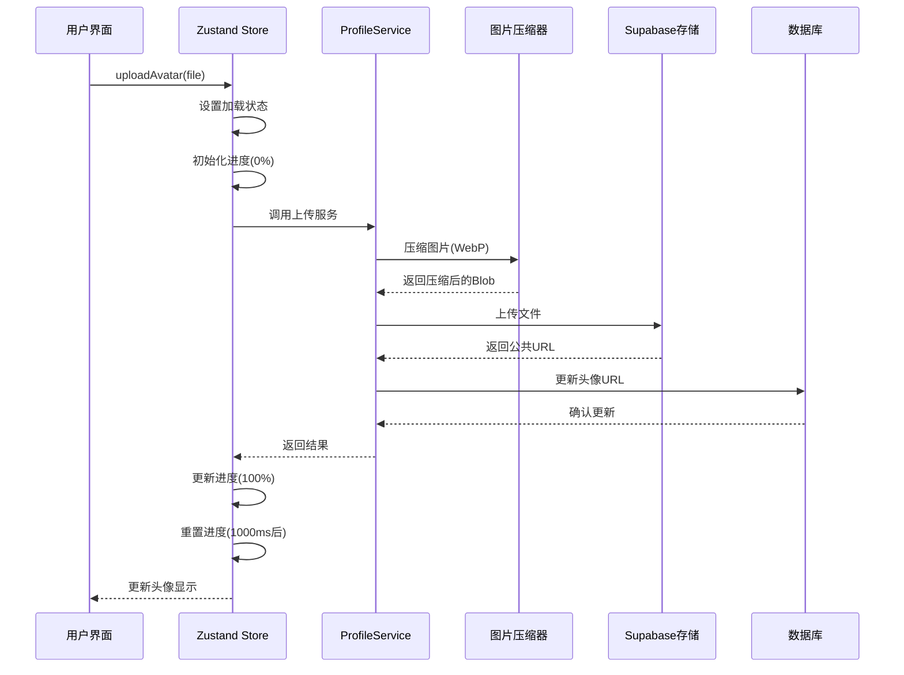
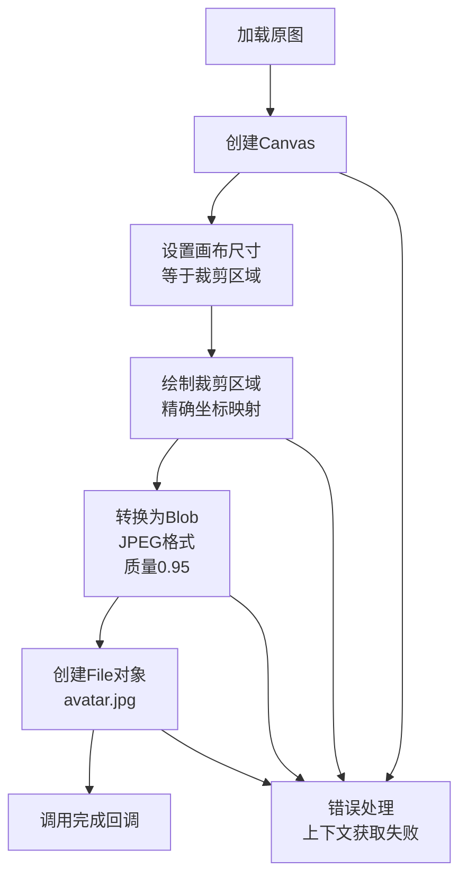
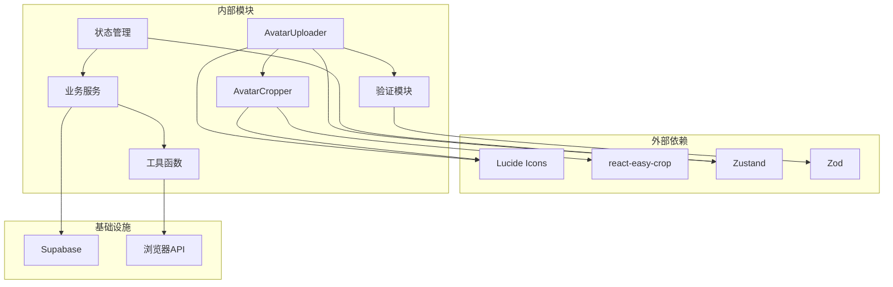
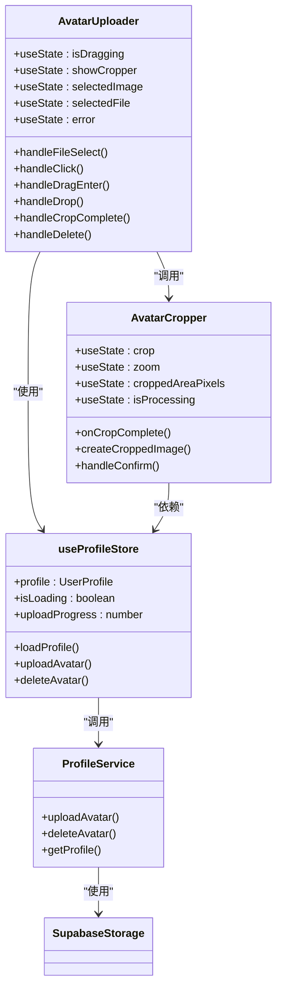

# 头像上传组件

<cite>
**本文档引用的文件**
- [AvatarUploader.tsx](file://app/src/components/business/AvatarUploader.tsx)
- [AvatarCropper.tsx](file://app/src/components/business/AvatarCropper.tsx)
- [ProfilePage.tsx](file://app/src/pages/ProfilePage.tsx)
- [validation.ts](file://app/src/types/validation.ts)
- [useProfileStore.ts](file://app/src/stores/useProfileStore.ts)
- [profileService.ts](file://app/src/services/api/profileService.ts)
- [supabaseStorage.ts](file://app/src/services/storage/supabaseStorage.ts)
- [imageCompressor.ts](file://app/src/utils/imageCompressor.ts)
- [user.ts](file://app/src/types/user.ts)
</cite>

## 目录
1. [简介](#简介)
2. [项目结构](#项目结构)
3. [核心组件](#核心组件)
4. [架构概览](#架构概览)
5. [详细组件分析](#详细组件分析)
6. [依赖关系分析](#依赖关系分析)
7. [性能考虑](#性能考虑)
8. [故障排除指南](#故障排除指南)
9. [结论](#结论)

## 简介

头像上传组件是 OPC-Starter 项目中的核心功能模块，为用户提供完整的头像管理体验。该组件支持多种上传方式（点击上传、拖拽上传）、智能文件验证、图片裁剪功能，并集成了现代化的用户体验设计。

本组件采用 React Hooks 和 Zustand 状态管理，结合 Supabase 存储服务，实现了从文件选择到云端存储的完整工作流。组件具备完善的错误处理机制、加载状态管理和进度反馈，确保用户获得流畅的操作体验。

## 项目结构

头像上传功能涉及多个层次的文件组织，形成了清晰的分层架构：

**图表来源**
- [ProfilePage.tsx:1-182](file://app/src/pages/ProfilePage.tsx#L1-L182)
- [AvatarUploader.tsx:1-258](file://app/src/components/business/AvatarUploader.tsx#L1-L258)
- [AvatarCropper.tsx:1-172](file://app/src/components/business/AvatarCropper.tsx#L1-L172)

**章节来源**
- [ProfilePage.tsx:137-155](file://app/src/pages/ProfilePage.tsx#L137-L155)
- [AvatarUploader.tsx:18-258](file://app/src/components/business/AvatarUploader.tsx#L18-L258)

## 核心组件

### AvatarUploader 组件

AvatarUploader 是整个头像上传功能的核心组件，提供了完整的用户交互界面和业务逻辑处理。

#### 主要功能特性

1. **多上传方式支持**
   - 点击上传：通过隐藏的文件输入框实现
   - 拖拽上传：支持拖拽文件到头像区域
   - 响应式设计：适配移动端和桌面端

2. **智能文件验证**
   - 文件类型检查：支持 JPG、PNG、WebP 格式
   - 文件大小限制：最大 5MB
   - 图片尺寸验证：最小 200x200px
   - 实时验证反馈

3. **图片裁剪功能**
   - 基于 react-easy-crop 的圆形裁剪
   - 支持缩放和平移操作
   - 实时预览裁剪效果

4. **状态管理**
   - 加载状态：上传过程中的视觉反馈
   - 进度显示：百分比进度条
   - 错误处理：友好的错误提示
   - 删除功能：一键删除现有头像

**章节来源**
- [AvatarUploader.tsx:18-258](file://app/src/components/business/AvatarUploader.tsx#L18-L258)
- [validation.ts:34-85](file://app/src/types/validation.ts#L34-L85)

### AvatarCropper 组件

AvatarCropper 专门负责图片裁剪功能，基于 react-easy-crop 库实现专业的图片编辑体验。

#### 核心功能

1. **专业裁剪工具**
   - 圆形裁剪区域（aspect=1）
   - 滑块控制缩放级别（1-3倍）
   - 实时裁剪预览

2. **高质量输出**
   - Canvas 绘制裁剪区域
   - JPEG 格式输出（质量 0.95）
   - 自动文件转换

3. **用户友好界面**
   - 全屏对话框设计
   - 清晰的操作按钮
   - 处理状态指示

**章节来源**
- [AvatarCropper.tsx:32-172](file://app/src/components/business/AvatarCropper.tsx#L32-L172)

## 架构概览

头像上传系统采用了分层架构设计，确保了代码的可维护性和扩展性：

**图表来源**
- [AvatarUploader.tsx:30-130](file://app/src/components/business/AvatarUploader.tsx#L30-L130)
- [useProfileStore.ts:97-145](file://app/src/stores/useProfileStore.ts#L97-L145)
- [profileService.ts:140-199](file://app/src/services/api/profileService.ts#L140-L199)

## 详细组件分析

### AvatarUploader 组件深度解析

#### 状态管理架构

组件使用 React Hooks 和 Zustand 进行状态管理，实现了复杂的状态流转：

**图表来源**
- [AvatarUploader.tsx:20-25](file://app/src/components/business/AvatarUploader.tsx#L20-L25)
- [useProfileStore.ts:97-145](file://app/src/stores/useProfileStore.ts#L97-L145)

#### 文件验证机制

组件实现了多层次的文件验证体系：

**图表来源**
- [validation.ts:44-85](file://app/src/types/validation.ts#L44-L85)
- [AvatarUploader.tsx:30-59](file://app/src/components/business/AvatarUploader.tsx#L30-L59)

#### 上传流程详解

头像上传流程包含了完整的错误处理和状态管理：

**图表来源**
- [useProfileStore.ts:97-145](file://app/src/stores/useProfileStore.ts#L97-L145)
- [profileService.ts:140-199](file://app/src/services/api/profileService.ts#L140-L199)

**章节来源**
- [AvatarUploader.tsx:121-152](file://app/src/components/business/AvatarUploader.tsx#L121-L152)
- [useProfileStore.ts:97-145](file://app/src/stores/useProfileStore.ts#L97-L145)

### AvatarCropper 组件详细分析

#### 裁剪算法实现

组件使用 Canvas API 实现高质量的图片裁剪：

**图表来源**
- [AvatarCropper.tsx:48-120](file://app/src/components/business/AvatarCropper.tsx#L48-L120)

#### 用户交互设计

组件提供了直观的用户交互体验：

1. **视觉反馈**
   - 圆形裁剪区域指示
   - 实时缩放滑块
   - 处理状态指示器

2. **操作便利性**
   - 支持鼠标拖拽调整
   - 键盘快捷键支持
   - 响应式布局适配

**章节来源**
- [AvatarCropper.tsx:122-172](file://app/src/components/business/AvatarCropper.tsx#L122-L172)

## 依赖关系分析

头像上传组件的依赖关系体现了清晰的分层架构：

**图表来源**
- [AvatarUploader.tsx:6-12](file://app/src/components/business/AvatarUploader.tsx#L6-L12)
- [AvatarCropper.tsx:6-17](file://app/src/components/business/AvatarCropper.tsx#L6-L17)
- [useProfileStore.ts:6-8](file://app/src/stores/useProfileStore.ts#L6-L8)

### 组件间协作关系

组件之间的协作关系展现了良好的解耦设计：

**图表来源**
- [AvatarUploader.tsx:18-258](file://app/src/components/business/AvatarUploader.tsx#L18-L258)
- [AvatarCropper.tsx:32-172](file://app/src/components/business/AvatarCropper.tsx#L32-L172)
- [useProfileStore.ts:36-205](file://app/src/stores/useProfileStore.ts#L36-L205)

**章节来源**
- [ProfilePage.tsx:11-12](file://app/src/pages/ProfilePage.tsx#L11-L12)
- [AvatarUploader.tsx:8-12](file://app/src/components/business/AvatarUploader.tsx#L8-L12)

## 性能考虑

头像上传组件在设计时充分考虑了性能优化：

### 图片处理优化

1. **客户端压缩**
   - 使用 Canvas API 进行本地压缩
   - WebP 格式提供更好的压缩率
   - 支持质量参数调节（0.85）

2. **内存管理**
   - 及时清理 FileReader 引用
   - 合理的 Blob 生命周期管理
   - 避免内存泄漏

### 网络传输优化

1. **渐进式上传**
   - 模拟进度条提升用户体验
   - 实际进度与模拟进度分离
   - 支持中断和重试机制

2. **缓存策略**
   - Supabase Storage 缓存控制
   - 浏览器图片缓存
   - CDN 加速

### 用户体验优化

1. **响应式设计**
   - 移动端触摸优化
   - 触摸目标尺寸适配
   - 屏幕旋转支持

2. **无障碍访问**
   - ARIA 标签支持
   - 键盘导航支持
   - 屏幕阅读器兼容

## 故障排除指南

### 常见问题及解决方案

#### 文件验证失败

**问题症状**
- 上传按钮不可用
- 显示错误提示信息

**可能原因**
- 文件类型不支持
- 文件大小超出限制
- 图片尺寸过小

**解决步骤**
1. 检查文件扩展名是否为 JPG/PNG/WebP
2. 确认文件大小不超过 5MB
3. 验证图片分辨率至少 200x200px

#### 上传失败

**问题症状**
- 上传进度卡住
- 显示网络错误

**可能原因**
- 网络连接不稳定
- Supabase 服务异常
- 用户认证失效

**解决步骤**
1. 检查网络连接状态
2. 重新登录系统
3. 清除浏览器缓存

#### 裁剪功能异常

**问题症状**
- 裁剪界面无法打开
- Canvas 绘制失败

**可能原因**
- 浏览器不支持 Canvas
- 图片加载超时
- 权限不足

**解决步骤**
1. 更新浏览器版本
2. 检查图片格式兼容性
3. 确认存储权限

**章节来源**
- [validation.ts:44-85](file://app/src/types/validation.ts#L44-L85)
- [AvatarUploader.tsx:30-59](file://app/src/components/business/AvatarUploader.tsx#L30-L59)
- [AvatarCropper.tsx:48-120](file://app/src/components/business/AvatarCropper.tsx#L48-L120)

## 结论

头像上传组件是 OPC-Starter 项目中设计精良的功能模块，体现了现代前端开发的最佳实践。组件通过清晰的分层架构、完善的错误处理机制和优秀的用户体验设计，为用户提供了可靠的头像管理功能。

### 主要优势

1. **功能完整性**：涵盖了从文件选择到云端存储的完整工作流
2. **用户体验优秀**：直观的界面设计和流畅的交互体验
3. **技术实现先进**：采用最新的 React Hooks 和 Zustand 状态管理
4. **性能优化到位**：客户端压缩和渐进式加载提升性能
5. **可维护性强**：清晰的代码结构和完善的测试覆盖

### 技术亮点

- 多种上传方式支持，适应不同用户习惯
- 智能文件验证，确保数据质量
- 专业级图片裁剪，满足各种需求
- 完善的错误处理和状态管理
- 与 Supabase 的无缝集成

该组件为后续的功能扩展奠定了坚实的基础，可以轻松地添加更多高级功能，如批量上传、预设模板、AI 辅助编辑等。