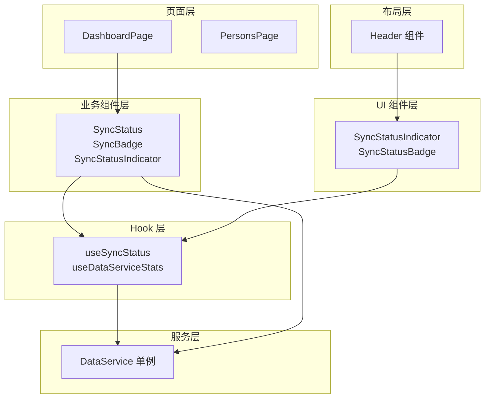
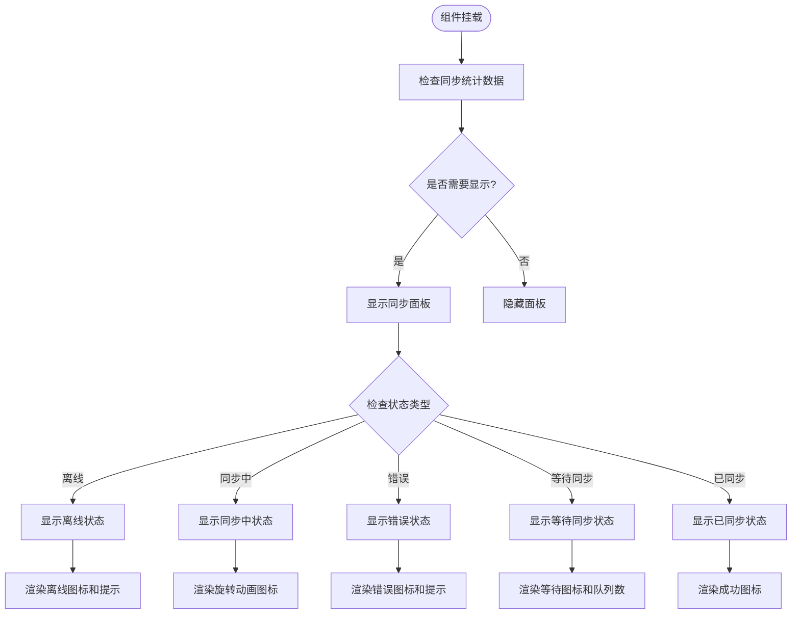
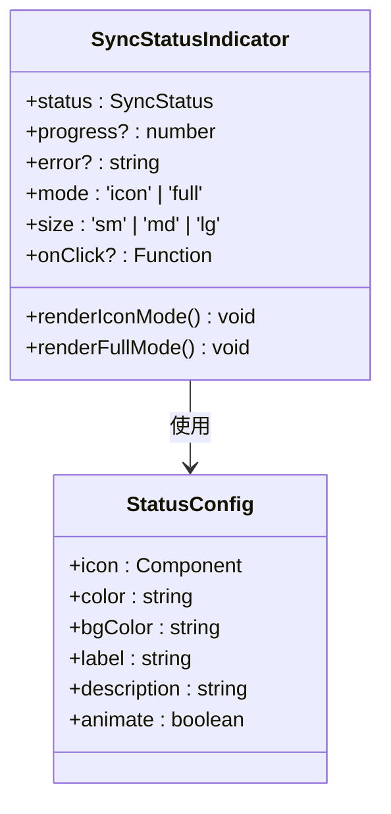
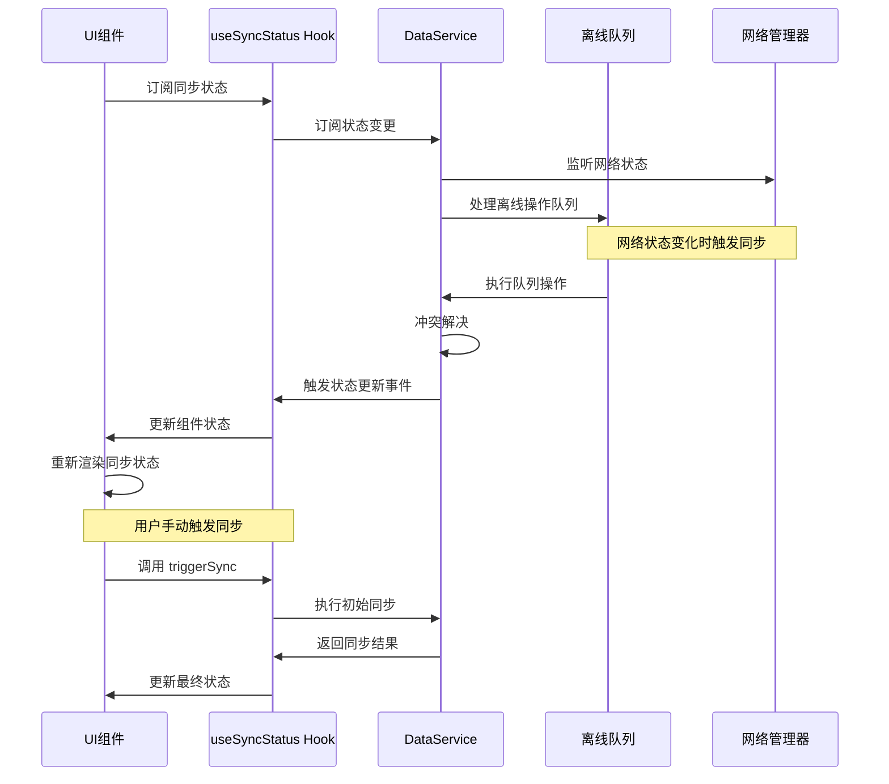
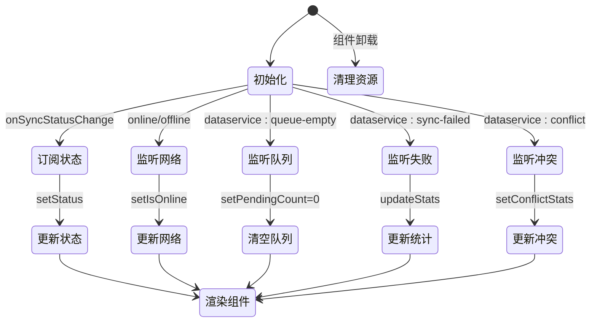
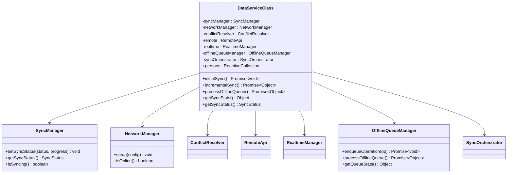
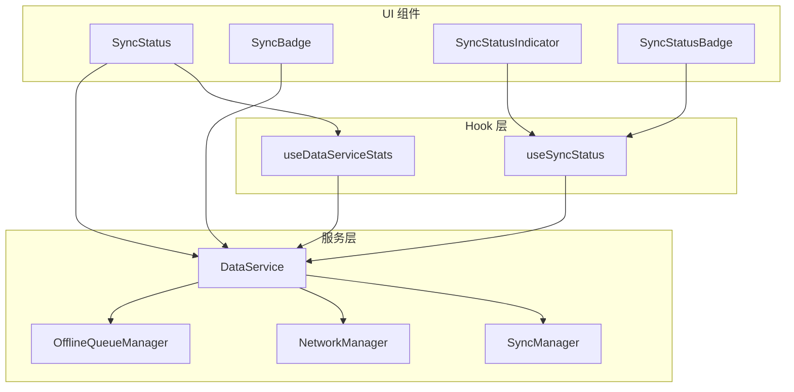

# 数据同步组件

<cite>
**本文档引用的文件**
- [SyncStatus.tsx](file://app/src/components/business/SyncStatus.tsx)
- [SyncBadge.tsx](file://app/src/components/business/SyncBadge.tsx)
- [SyncStatusIndicator.tsx](file://app/src/components/business/SyncStatusIndicator.tsx)
- [useSyncStatus.ts](file://app/src/hooks/useSyncStatus.ts)
- [useDataServiceStats.ts](file://app/src/hooks/useDataServiceStats.ts)
- [sync-status-indicator.tsx](file://app/src/components/ui/sync-status-indicator.tsx)
- [DataService.ts](file://app/src/services/data/DataService.ts)
- [Header/index.tsx](file://app/src/components/layout/Header/index.tsx)
- [DashboardPage.tsx](file://app/src/pages/DashboardPage.tsx)
</cite>

## 目录
1. [简介](#简介)
2. [项目结构](#项目结构)
3. [核心组件](#核心组件)
4. [架构概览](#架构概览)
5. [详细组件分析](#详细组件分析)
6. [依赖关系分析](#依赖关系分析)
7. [性能考虑](#性能考虑)
8. [故障排除指南](#故障排除指南)
9. [结论](#结论)

## 简介
本文件详细介绍 OPC-Starter 项目中的数据同步组件体系，包括 SyncStatus（同步状态组件）、SyncBadge（同步徽章）、SyncStatusIndicator（同步状态指示器）等核心组件。文档深入解析这些组件如何显示数据同步状态（连接状态、同步进度、错误状态等），阐述与 useSyncStatus Hook 的集成方式和状态管理机制，介绍组件的视觉设计和交互反馈，并提供完整的使用示例和最佳实践。

## 项目结构
数据同步相关组件分布在以下目录中：
- 业务组件层：位于 `app/src/components/business/`，包含 SyncStatus、SyncBadge、SyncStatusIndicator 等
- UI 组件层：位于 `app/src/components/ui/`，包含 SyncStatusIndicator 和 SyncStatusBadge
- Hook 层：位于 `app/src/hooks/`，包含 useSyncStatus、useDataServiceStats
- 服务层：位于 `app/src/services/data/`，包含 DataService 单例和相关管理器
- 页面层：位于 `app/src/pages/`，包含 DashboardPage 等页面集成示例
- 布局层：位于 `app/src/components/layout/Header/`，包含 Header 组件集成

**图表来源**
- [Header/index.tsx:68-71](file://app/src/components/layout/Header/index.tsx#L68-L71)
- [DashboardPage.tsx:36](file://app/src/pages/DashboardPage.tsx#L36)

**章节来源**
- [Header/index.tsx:1-123](file://app/src/components/layout/Header/index.tsx#L1-L123)
- [DashboardPage.tsx:1-219](file://app/src/pages/DashboardPage.tsx#L1-L219)

## 核心组件
本节详细介绍三个核心同步组件的功能和实现：

### SyncStatus 组件
SyncStatus 是一个全局浮动的同步状态面板，提供完整的同步状态可视化和手动操作功能。

**主要功能特性：**
- 实时显示同步状态（在线/离线/同步中/错误/已同步/等待同步）
- 手动触发同步操作
- 显示详细的同步统计信息
- 响应式动画和过渡效果
- 开发模式下的调试信息

**状态显示逻辑：**

**图表来源**
- [SyncStatus.tsx:22-54](file://app/src/components/business/SyncStatus.tsx#L22-L54)
- [SyncStatus.tsx:69-79](file://app/src/components/business/SyncStatus.tsx#L69-L79)

**章节来源**
- [SyncStatus.tsx:1-171](file://app/src/components/business/SyncStatus.tsx#L1-L171)

### SyncBadge 组件
SyncBadge 是一个简洁的同步状态徽章组件，适合在表单、列表等场景中使用。

**状态类型定义：**
- `synced`: 已同步（绿色）
- `syncing`: 同步中（蓝色旋转动画）
- `pending`: 待同步（黄色）
- `error`: 同步错误（红色）
- `offline`: 离线（灰色）
- `local-only`: 仅本地（灰色）

**尺寸支持：**
- `sm`: 小尺寸（适合内联使用）
- `md`: 中等尺寸（默认，适合大多数场景）

**章节来源**
- [SyncBadge.tsx:1-88](file://app/src/components/business/SyncBadge.tsx#L1-L88)

### SyncStatusIndicator 组件
SyncStatusIndicator 提供更丰富的同步状态显示，支持图标模式和完整模式两种显示方式。

**显示模式：**
- **图标模式（icon）**：仅显示状态图标，适合顶部导航等空间有限的场景
- **完整模式（full）**：显示完整的状态信息，包括进度条、错误信息等

**状态配置：**

**图表来源**
- [SyncStatusIndicator.tsx:107-179](file://app/src/components/business/SyncStatusIndicator.tsx#L107-L179)

**章节来源**
- [SyncStatusIndicator.tsx:1-267](file://app/src/components/business/SyncStatusIndicator.tsx#L1-L267)

## 架构概览
数据同步组件采用分层架构设计，确保状态管理、UI 展示和业务逻辑的有效分离。

**图表来源**
- [useSyncStatus.ts:76-157](file://app/src/hooks/useSyncStatus.ts#L76-L157)
- [DataService.ts:147-149](file://app/src/services/data/DataService.ts#L147-L149)

**章节来源**
- [useSyncStatus.ts:1-188](file://app/src/hooks/useSyncStatus.ts#L1-L188)
- [DataService.ts:1-419](file://app/src/services/data/DataService.ts#L1-L419)

## 详细组件分析

### useSyncStatus Hook 分析
useSyncStatus 是整个同步状态管理的核心 Hook，负责订阅 DataService 的状态变化并提供统一的状态接口。

**状态管理机制：**

**图表来源**
- [useSyncStatus.ts:76-157](file://app/src/hooks/useSyncStatus.ts#L76-L157)

**Hook 接口定义：**
- `status`: 当前同步状态（idle/syncing/synced/error）
- `isSyncing`: 是否正在同步
- `hasInitialSynced`: 是否已完成首次同步
- `isOnline`: 是否在线
- `pendingCount`: 待同步操作数量
- `failedCount`: 同步失败数量
- `conflictStats`: 冲突统计信息
- `progress`: 同步进度（仅在同步中有效）
- `triggerSync()`: 手动触发初始同步
- `triggerQueueProcessing()`: 手动触发队列处理
- `retryFailedSync()`: 重试失败的同步

**章节来源**
- [useSyncStatus.ts:20-43](file://app/src/hooks/useSyncStatus.ts#L20-L43)
- [useSyncStatus.ts:63-185](file://app/src/hooks/useSyncStatus.ts#L63-L185)

### useDataServiceStats Hook 分析
useDataServiceStats 是一个专门用于获取 DataService 统计信息的 Hook，提供每秒轮询更新的能力。

**实现特点：**
- 每 1000ms 轮询一次 DataService.getSyncStats()
- 自动清理定时器，防止内存泄漏
- 提供完整的同步统计数据，包括队列大小、同步状态、冲突统计等

**统计数据字段：**
- `queueSize`: 离线队列大小
- `syncing`: 是否正在同步
- `successCount`: 成功同步次数
- `failureCount`: 失败同步次数
- `conflictCount`: 冲突次数
- `lastSyncAt`: 最后同步时间
- `status`: 当前同步状态
- `isOnline`: 网络状态
- `hasInitialSynced`: 首次同步完成状态
- `conflictStats`: 冲突统计详情

**章节来源**
- [useDataServiceStats.ts:1-27](file://app/src/hooks/useDataServiceStats.ts#L1-L27)

### DataService 服务分析
DataService 是数据同步的核心服务类，实现了完整的离线优先、在线同步的数据管理策略。

**核心功能模块：**

**图表来源**
- [DataService.ts:71-117](file://app/src/services/data/DataService.ts#L71-L117)

**数据流策略：**
- **读操作优先**：从 IndexedDB 读取，保证快速响应
- **写操作权威**：先写 Supabase，成功后再更新 IndexedDB
- **实时更新**：通过 Supabase Realtime 订阅实现数据实时同步
- **离线支持**：所有写操作都会进入离线队列，网络恢复后自动同步

**章节来源**
- [DataService.ts:71-419](file://app/src/services/data/DataService.ts#L71-L419)

## 依赖关系分析

**图表来源**
- [SyncStatus.tsx:13-18](file://app/src/components/business/SyncStatus.tsx#L13-L18)
- [useSyncStatus.ts:8-64](file://app/src/hooks/useSyncStatus.ts#L8-L64)

**依赖关系特点：**
- UI 组件通过 Hook 访问 DataService，实现状态解耦
- Hook 层提供统一的状态接口，简化 UI 组件复杂度
- 服务层封装具体的数据同步逻辑，便于测试和维护
- 组件间通过 props 和事件进行通信，避免直接依赖

**章节来源**
- [sync-status-indicator.tsx:14-37](file://app/src/components/ui/sync-status-indicator.tsx#L14-L37)
- [useDataServiceStats.ts:5-14](file://app/src/hooks/useDataServiceStats.ts#L5-L14)

## 性能考虑
数据同步组件在设计时充分考虑了性能优化：

**渲染优化：**
- 使用 `useMemo` 和 `useCallback` 避免不必要的重渲染
- 条件渲染：仅在需要时显示同步状态面板
- 动画优化：使用 CSS transition 和 transform 实现硬件加速

**网络优化：**
- 智能重试机制：网络恢复后自动处理离线队列
- 节流处理：状态轮询间隔合理设置，避免过度频繁的更新
- 错误隔离：单个操作失败不影响整体同步流程

**内存管理：**
- 自动清理事件监听器和定时器
- 组件卸载时释放所有资源
- 避免内存泄漏的监听器注册

## 故障排除指南

**常见问题及解决方案：**

1. **同步状态不更新**
   - 检查 DataService 是否正确初始化
   - 验证 Hook 是否正确订阅状态变更
   - 确认网络状态监听器是否正常工作

2. **手动同步无效**
   - 检查网络连接状态
   - 验证离线队列是否为空
   - 查看控制台错误日志

3. **组件渲染异常**
   - 确认 props 类型定义正确
   - 检查条件渲染逻辑
   - 验证样式类名拼接

**调试技巧：**
- 开发模式下启用详细日志输出
- 使用浏览器开发者工具监控网络请求
- 检查事件监听器的注册和清理

**章节来源**
- [SyncStatus.tsx:38-43](file://app/src/components/business/SyncStatus.tsx#L38-L43)
- [useSyncStatus.ts:147-157](file://app/src/hooks/useSyncStatus.ts#L147-L157)

## 结论
OPC-Starter 的数据同步组件体系通过清晰的分层架构和完善的 Hook 设计，为应用提供了强大而灵活的同步状态管理能力。组件具有以下优势：

**技术优势：**
- 完整的离线支持和智能重试机制
- 灵活的状态管理和多种显示模式
- 良好的性能优化和内存管理
- 丰富的错误处理和用户体验优化

**使用建议：**
- 在需要全局同步状态显示的场景使用 SyncStatus
- 在表单和列表中使用 SyncBadge 提供简洁的状态指示
- 在复杂场景中使用 SyncStatusIndicator 获取更丰富的状态信息
- 通过 useSyncStatus Hook 简化状态管理逻辑

该组件体系为构建可靠的离线优先应用提供了坚实的基础，能够满足现代 Web 应用对数据同步的各种需求。