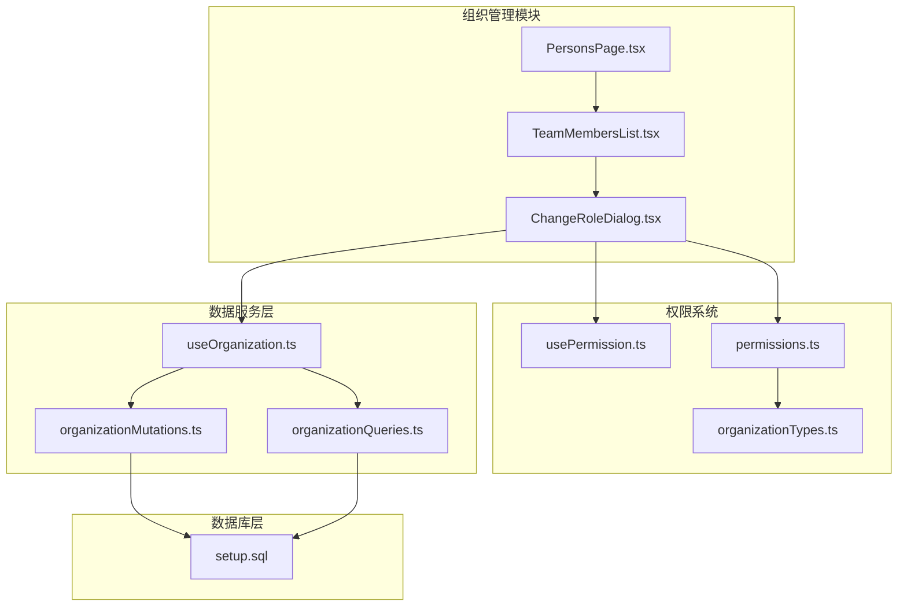
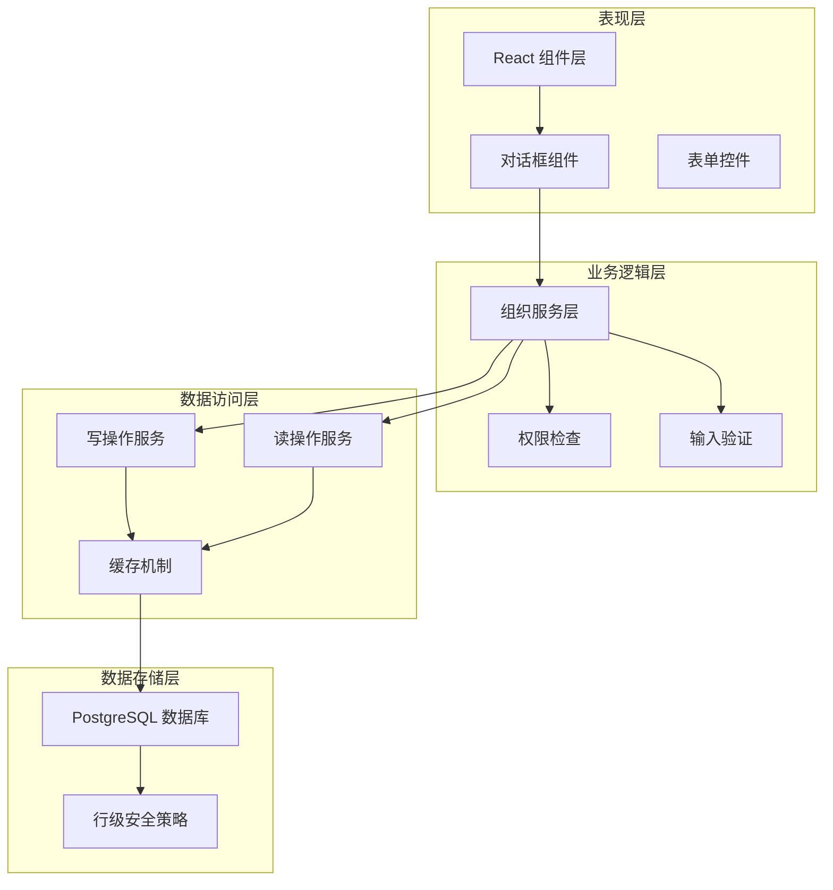
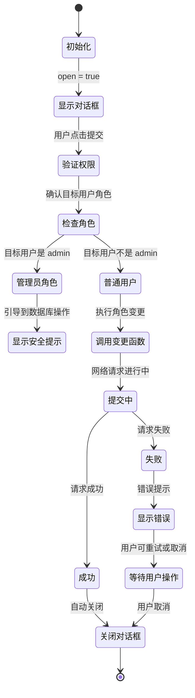
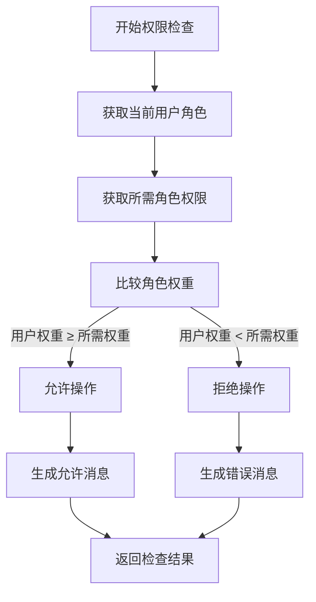
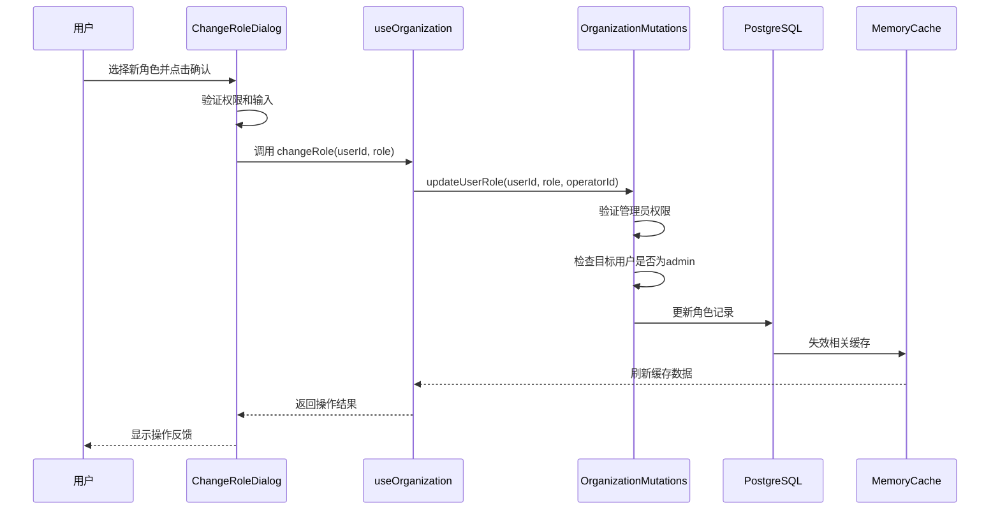
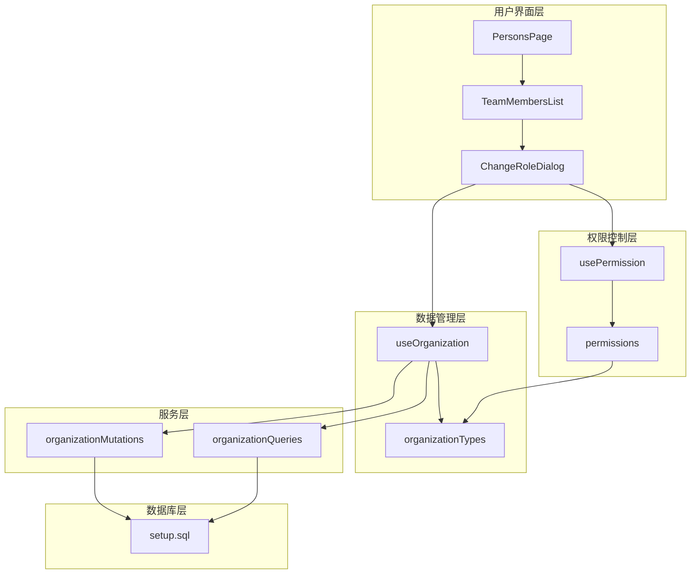
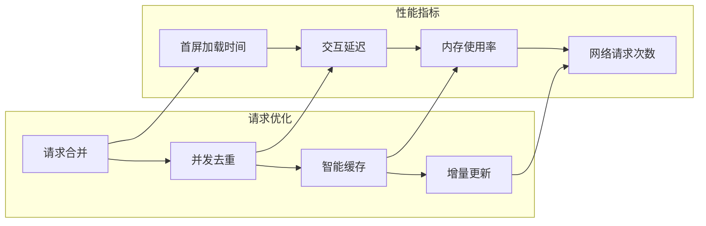
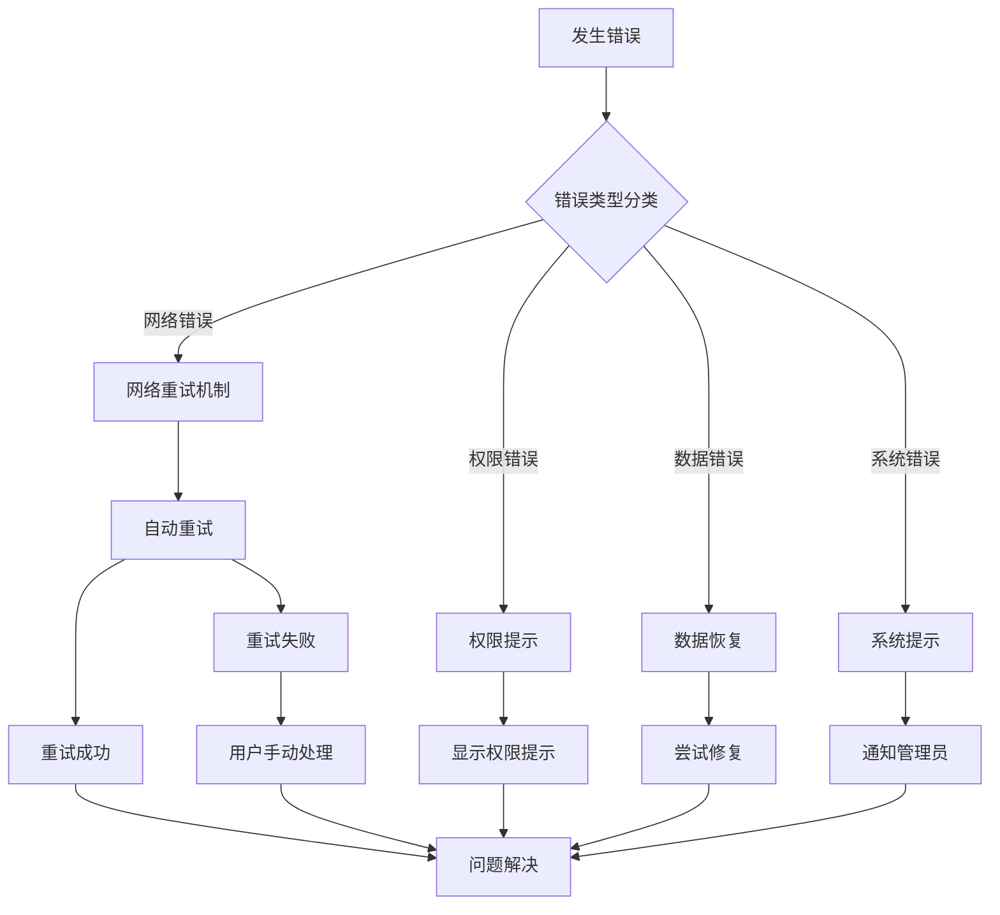

# 修改角色对话框 (ChangeRoleDialog)

<cite>
**本文档引用的文件**
- [ChangeRoleDialog.tsx](file://app/src/components/organization/ChangeRoleDialog.tsx)
- [organizationTypes.ts](file://app/src/lib/supabase/organizationTypes.ts)
- [usePermission.ts](file://app/src/hooks/usePermission.ts)
- [permissions.ts](file://app/src/lib/permissions.ts)
- [PersonsPage.tsx](file://app/src/pages/PersonsPage.tsx)
- [TeamMembersList.tsx](file://app/src/components/organization/TeamMembersList.tsx)
- [useOrganization.ts](file://app/src/hooks/useOrganization.ts)
- [organizationMutations.ts](file://app/src/services/organization/organizationMutations.ts)
- [organizationQueries.ts](file://app/src/services/organization/organizationQueries.ts)
- [setup.sql](file://app/supabase/setup.sql)
</cite>

## 目录
1. [简介](#简介)
2. [项目结构](#项目结构)
3. [核心组件](#核心组件)
4. [架构概览](#架构概览)
5. [详细组件分析](#详细组件分析)
6. [依赖关系分析](#依赖关系分析)
7. [性能考虑](#性能考虑)
8. [故障排除指南](#故障排除指南)
9. [结论](#结论)
10. [附录](#附录)

## 简介

修改角色对话框 (ChangeRoleDialog) 是组织管理系统中的关键组件，用于变更组织成员的角色权限。该组件实现了完整的角色变更功能，包括角色选择、权限验证、批量操作支持和安全控制机制。

该组件支持三种角色层级：管理员(admin)、经理(manager)和成员(member)，每个角色具有不同的权限范围和操作能力。系统通过严格的权限控制确保只有具备相应权限的用户才能执行角色变更操作。

## 项目结构

ChangeRoleDialog 组件位于组织管理模块中，与相关的类型定义、权限检查和数据服务共同构成完整的角色管理功能体系。



**图表来源**
- [ChangeRoleDialog.tsx:1-167](file://app/src/components/organization/ChangeRoleDialog.tsx#L1-L167)
- [usePermission.ts:1-58](file://app/src/hooks/usePermission.ts#L1-L58)
- [useOrganization.ts:1-364](file://app/src/hooks/useOrganization.ts#L1-L364)

**章节来源**
- [ChangeRoleDialog.tsx:1-167](file://app/src/components/organization/ChangeRoleDialog.tsx#L1-L167)
- [organizationTypes.ts:1-91](file://app/src/lib/supabase/organizationTypes.ts#L1-L91)

## 核心组件

### 角色层级与权限模型

系统采用三层角色层级结构，每层角色具有明确的权限边界：

```mermaid
flowchart TD
ADMIN[管理员<br/>最高权限] --> MANAGER[经理<br/>团队管理权限]
MANAGER --> MEMBER[成员<br/>基础权限]
ADMIN --> |"可管理所有组织"<br/>"可变更任何成员角色"| ALLMEMBERS[所有成员]
MANAGER --> |"可管理本团队及子团队"<br/>"可变更团队内成员角色"| TEAMMEMBERS[团队成员]
MEMBER --> |"只能管理自己的资源"| SELF[个人资源]
SECURITY[安全限制] --> |"admin角色变更需直接在数据库操作"| DBOP[数据库操作]
```

**图表来源**
- [permissions.ts:11-21](file://app/src/lib/permissions.ts#L11-L21)
- [organizationMutations.ts:139-163](file://app/src/services/organization/organizationMutations.ts#L139-L163)

### 组件接口设计

ChangeRoleDialog 采用简洁的接口设计，支持外部状态管理和异步操作：

| 属性 | 类型 | 必需 | 描述 |
|------|------|------|------|
| open | boolean | 是 | 控制对话框显示/隐藏 |
| onOpenChange | (open: boolean) => void | 是 | 对话框状态变更回调 |
| member | Profile \| null | 是 | 目标成员信息 |
| onChangeRole | (userId: string, newRole: 'manager' \| 'member') => Promise<void> | 是 | 角色变更回调函数 |

**章节来源**
- [ChangeRoleDialog.tsx:25-30](file://app/src/components/organization/ChangeRoleDialog.tsx#L25-L30)
- [organizationTypes.ts:20-29](file://app/src/lib/supabase/organizationTypes.ts#L20-L29)

## 架构概览

ChangeRoleDialog 采用分层架构设计，各层职责清晰分离，确保系统的可维护性和可扩展性。



**图表来源**
- [useOrganization.ts:16-39](file://app/src/hooks/useOrganization.ts#L16-L39)
- [organizationMutations.ts:16-207](file://app/src/services/organization/organizationMutations.ts#L16-L207)
- [organizationQueries.ts:17-333](file://app/src/services/organization/organizationQueries.ts#L17-L333)

## 详细组件分析

### ChangeRoleDialog 组件实现

#### 组件状态管理

组件使用 React Hooks 进行状态管理，包括当前选择的角色、提交状态和成员信息：



**图表来源**
- [ChangeRoleDialog.tsx:43-68](file://app/src/components/organization/ChangeRoleDialog.tsx#L43-L68)
- [ChangeRoleDialog.tsx:74-166](file://app/src/components/organization/ChangeRoleDialog.tsx#L74-L166)

#### 权限验证机制

组件内置多重权限验证，确保操作的安全性：

1. **角色权限检查**：验证当前用户是否具备管理员权限
2. **目标用户保护**：防止对管理员角色进行在线变更
3. **操作状态控制**：根据提交状态禁用相关按钮

#### 用户界面设计

对话框采用 Material Design 风格，提供直观的操作体验：

| 组件元素 | 功能描述 | 安全考虑 |
|----------|----------|----------|
| 用户头像 | 显示目标用户的头像信息 | 保护用户隐私 |
| 角色标签 | 显示当前和目标角色 | 清晰的视觉反馈 |
| 下拉菜单 | 选择新的角色类型 | 限制可选角色范围 |
| 提示信息 | 安全警告和操作指导 | 提升用户体验 |
| 按钮组 | 确认和取消操作 | 防止误操作 |

**章节来源**
- [ChangeRoleDialog.tsx:43-166](file://app/src/components/organization/ChangeRoleDialog.tsx#L43-L166)

### 权限控制系统

#### 角色层级定义

系统采用数值化的角色层级模型，确保权限判断的一致性：

| 角色 | 数值权重 | 权限范围 | 操作能力 |
|------|----------|----------|----------|
| admin | 3 | 最高权限 | 管理所有组织和成员 |
| manager | 2 | 团队管理 | 管理本团队及子团队 |
| member | 1 | 基础权限 | 个人资源管理 |

#### 权限检查流程



**图表来源**
- [permissions.ts:17-52](file://app/src/lib/permissions.ts#L17-L52)
- [usePermission.ts:33-57](file://app/src/hooks/usePermission.ts#L33-L57)

**章节来源**
- [permissions.ts:1-86](file://app/src/lib/permissions.ts#L1-L86)
- [usePermission.ts:1-58](file://app/src/hooks/usePermission.ts#L1-L58)

### 数据流处理

#### 角色变更数据流



**图表来源**
- [useOrganization.ts:267-285](file://app/src/hooks/useOrganization.ts#L267-L285)
- [organizationMutations.ts:139-163](file://app/src/services/organization/organizationMutations.ts#L139-L163)

#### 缓存管理策略

系统采用智能缓存策略，平衡数据一致性和性能：

| 缓存类型 | TTL 时间 | 失效触发条件 | 作用范围 |
|----------|----------|--------------|----------|
| 组织树缓存 | 5分钟 | 树结构变更 | 完整组织树 |
| 成员列表缓存 | 2分钟 | 成员状态变更 | 单个组织成员 |
| 用户信息缓存 | 3分钟 | 用户资料更新 | 个人用户信息 |
| 上传权限缓存 | 5分钟 | 用户权限变更 | 上传权限范围 |

**章节来源**
- [useOrganization.ts:41-64](file://app/src/hooks/useOrganization.ts#L41-L64)
- [organizationQueries.ts:52-117](file://app/src/services/organization/organizationQueries.ts#L52-L117)

## 依赖关系分析

### 组件间依赖关系



**图表来源**
- [TeamMembersList.tsx:59-68](file://app/src/components/organization/TeamMembersList.tsx#L59-L68)
- [PersonsPage.tsx:17-38](file://app/src/pages/PersonsPage.tsx#L17-L38)

### 外部依赖分析

系统对外部依赖主要集中在 Supabase 平台，包括认证、数据库和存储服务。

| 依赖组件 | 版本要求 | 主要功能 | 安全特性 |
|----------|----------|----------|----------|
| Supabase Auth | v2.x | 用户认证和授权 | JWT Token 验证 |
| PostgreSQL | v14+ | 数据持久化 | Row Level Security |
| Supabase Storage | v2.x | 文件存储 | 基于桶的访问控制 |
| Edge Functions | v1.x | 服务器端逻辑 | 服务角色密钥 |

**章节来源**
- [setup.sql:10-24](file://app/supabase/setup.sql#L10-L24)
- [SUPABASE_COOKBOOK.md:62-82](file://app/supabase/SUPABASE_COOKBOOK.md#L62-L82)

## 性能考虑

### 缓存优化策略

系统采用多层次缓存策略，显著提升响应性能：

1. **本地存储缓存**：使用 localStorage 存储组织树数据，减少网络请求
2. **内存缓存**：使用内存缓存存储频繁访问的数据，支持快速读取
3. **并发去重**：避免重复的网络请求，提升并发性能

### 网络请求优化



**图表来源**
- [useOrganization.ts:45-64](file://app/src/hooks/useOrganization.ts#L45-L64)
- [organizationQueries.ts:18-22](file://app/src/services/organization/organizationQueries.ts#L18-L22)

### 内存管理

系统采用智能的内存管理策略，避免内存泄漏和过度占用：

| 管理策略 | 实现方式 | 效果 |
|----------|----------|------|
| 缓存 TTL | 定时清理过期数据 | 控制内存使用 |
| 引用计数 | 管理对象生命周期 | 防止内存泄漏 |
| 垃圾回收 | 定期清理无用数据 | 保持系统稳定 |

## 故障排除指南

### 常见问题诊断

#### 角色变更失败

**问题现象**：用户无法变更角色，出现错误提示

**可能原因**：
1. 当前用户权限不足
2. 目标用户为管理员角色
3. 网络连接异常
4. 数据库操作失败

**解决方案**：
1. 验证当前用户是否为管理员
2. 检查目标用户角色状态
3. 确认网络连接稳定性
4. 查看数据库日志信息

#### 权限验证错误

**问题现象**：权限检查总是返回拒绝

**可能原因**：
1. 用户角色信息缓存过期
2. 权限配置不正确
3. 用户会话状态异常

**解决方案**：
1. 刷新用户角色信息
2. 检查权限配置文件
3. 重新登录系统

#### 数据同步问题

**问题现象**：角色变更后界面未更新

**可能原因**：
1. 缓存未正确失效
2. WebSocket 连接异常
3. 前端状态管理错误

**解决方案**：
1. 手动刷新页面
2. 检查缓存失效逻辑
3. 重启应用进程

**章节来源**
- [organizationMutations.ts:139-176](file://app/src/services/organization/organizationMutations.ts#L139-L176)
- [useOrganization.ts:267-285](file://app/src/hooks/useOrganization.ts#L267-L285)

### 错误处理机制

系统采用多层次的错误处理机制，确保用户体验和系统稳定性：



**图表来源**
- [ChangeRoleDialog.tsx:54-68](file://app/src/components/organization/ChangeRoleDialog.tsx#L54-L68)
- [PersonsPage.tsx:81-91](file://app/src/pages/PersonsPage.tsx#L81-L91)

## 结论

ChangeRoleDialog 组件通过精心设计的架构和完善的权限控制机制，为组织管理系统提供了安全可靠的角色变更功能。组件实现了以下关键特性：

1. **安全性**：通过多重权限验证和安全限制，确保只有具备相应权限的用户才能执行角色变更操作
2. **易用性**：直观的用户界面和清晰的操作反馈，提升用户体验
3. **可靠性**：完善的错误处理和缓存机制，保证系统的稳定运行
4. **可扩展性**：模块化的架构设计，便于功能扩展和维护

该组件的成功实现体现了现代前端开发的最佳实践，为类似的企业级应用提供了优秀的参考模板。

## 附录

### 使用示例

#### 在用户管理界面中集成 ChangeRoleDialog

```typescript
// 在用户管理页面中使用 ChangeRoleDialog
const handleRoleChange = (member: Profile) => {
  setSelectedMember(member)
  setChangeRoleDialogOpen(true)
}

const handleChangeRoleSubmit = async (userId: string, newRole: 'manager' | 'member') => {
  try {
    await changeRole(userId, newRole)
    toast.success('角色变更成功')
  } catch (error) {
    toast.error(error instanceof Error ? error.message : '角色变更失败')
  }
}
```

#### 权限检查最佳实践

```typescript
// 使用 usePermission hook 进行权限检查
const { canManageMembers, userRole } = usePermission()

if (!canManageMembers) {
  toast.warning('您没有权限管理成员')
  return
}

// 根据角色级别显示不同功能
const renderMemberActions = (member: Profile) => {
  if (userRole === 'admin' || (userRole === 'manager' && member.role !== 'admin')) {
    return (
      <Button 
        onClick={() => handleRoleChange(member)}
        disabled={member.role === 'admin'}
      >
        变更角色
      </Button>
    )
  }
  return null
}
```

### 安全考虑

#### 数据库安全策略

系统采用严格的数据库安全策略，包括：

1. **Row Level Security (RLS)**：基于用户角色的行级访问控制
2. **Security Definer Functions**：管理员操作通过特权函数执行
3. **权限验证**：所有操作前进行权限验证

#### 前端安全措施

1. **输入验证**：客户端和服务器端双重验证
2. **权限检查**：实时权限状态检查
3. **错误处理**：友好的错误提示和降级处理