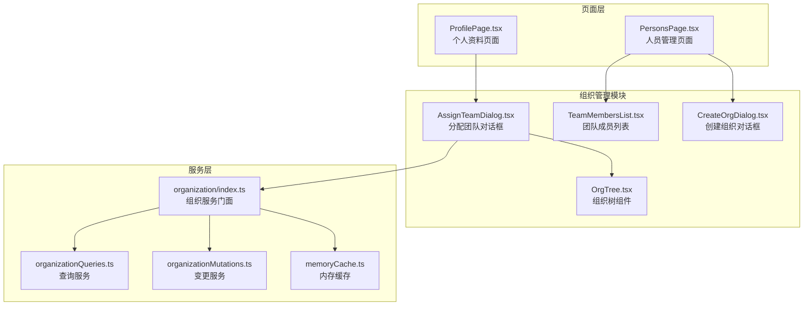
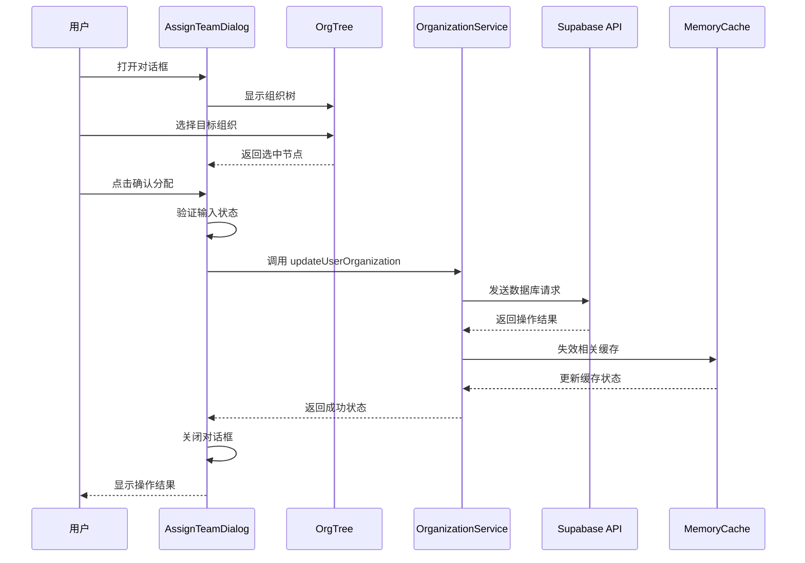
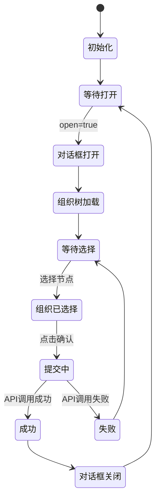
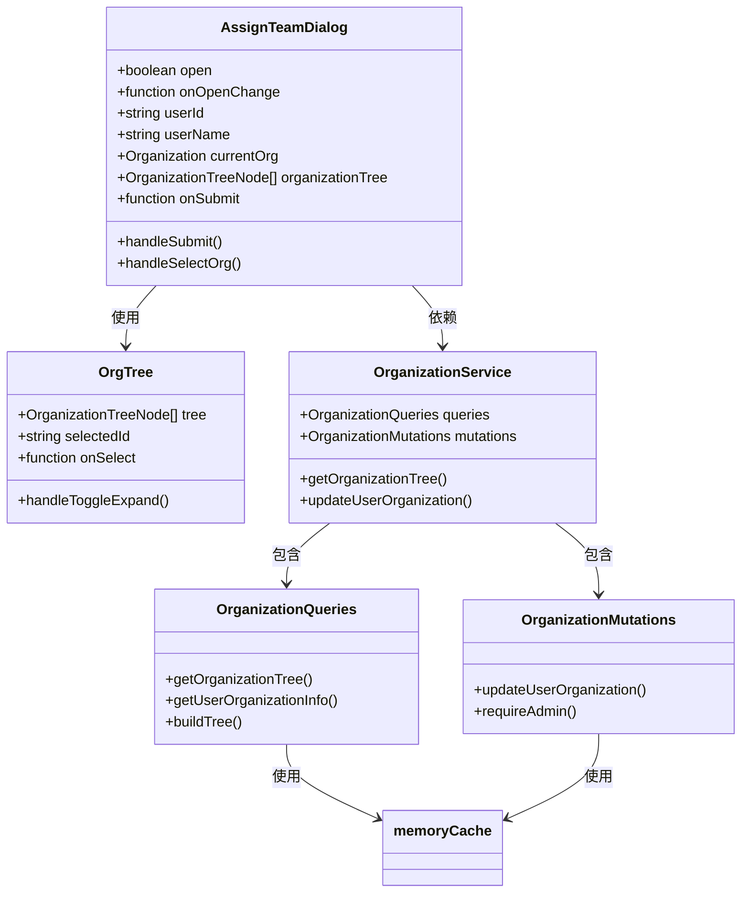

# 分配团队对话框 (AssignTeamDialog)

<cite>
**本文档引用的文件**
- [AssignTeamDialog.tsx](file://app/src/components/organization/AssignTeamDialog.tsx)
- [OrgTree.tsx](file://app/src/components/organization/OrgTree.tsx)
- [organizationTypes.ts](file://app/src/lib/supabase/organizationTypes.ts)
- [organization/index.ts](file://app/src/services/organization/index.ts)
- [organizationMutations.ts](file://app/src/services/organization/organizationMutations.ts)
- [organizationQueries.ts](file://app/src/services/organization/organizationQueries.ts)
- [useOrganization.ts](file://app/src/hooks/useOrganization.ts)
- [memoryCache.ts](file://app/src/services/cache/memoryCache.ts)
- [ProfilePage.tsx](file://app/src/pages/ProfilePage.tsx)
- [PersonsPage.tsx](file://app/src/pages/PersonsPage.tsx)
</cite>

## 目录
1. [简介](#简介)
2. [项目结构](#项目结构)
3. [核心组件](#核心组件)
4. [架构概览](#架构概览)
5. [详细组件分析](#详细组件分析)
6. [依赖关系分析](#依赖关系分析)
7. [性能考虑](#性能考虑)
8. [故障排除指南](#故障排除指南)
9. [结论](#结论)
10. [附录](#附录)

## 简介

分配团队对话框 (AssignTeamDialog) 是一个专门用于管理用户组织团队分配的 React 组件。该组件允许管理员将成员从一个组织/团队重新分配到另一个团队，支持完整的组织树导航和选择功能。

该组件的核心功能包括：
- 组织树选择界面，支持层级展开/折叠
- 实时的团队分配操作
- 权限验证和安全控制
- 错误处理和状态管理
- 与 Supabase 数据库的实时同步

## 项目结构

分配团队对话框位于组织管理模块中，与相关的组件和服务共同构成完整的团队管理系统：



**图表来源**
- [AssignTeamDialog.tsx:1-112](file://app/src/components/organization/AssignTeamDialog.tsx#L1-L112)
- [OrgTree.tsx:1-164](file://app/src/components/organization/OrgTree.tsx#L1-L164)
- [organization/index.ts:1-97](file://app/src/services/organization/index.ts#L1-L97)

**章节来源**
- [AssignTeamDialog.tsx:1-112](file://app/src/components/organization/AssignTeamDialog.tsx#L1-L112)
- [organization/index.ts:1-97](file://app/src/services/organization/index.ts#L1-L97)

## 核心组件

### AssignTeamDialog 组件

AssignTeamDialog 是一个受控的对话框组件，负责处理用户团队分配的完整流程。组件采用函数式组件设计，使用 React Hooks 进行状态管理。

**主要特性：**
- 受控组件模式，通过 props 接收外部状态
- 内置表单验证和错误处理
- 支持异步提交操作
- 实时的用户反馈机制

**关键属性接口：**
- `open`: 控制对话框显示/隐藏的布尔值
- `onOpenChange`: 对话框状态变更回调函数
- `userId`: 目标用户的唯一标识符
- `userName`: 目标用户的显示名称
- `currentOrg`: 用户当前所属的组织信息
- `organizationTree`: 完整的组织架构树数据
- `onSubmit`: 团队分配提交回调函数

**章节来源**
- [AssignTeamDialog.tsx:19-27](file://app/src/components/organization/AssignTeamDialog.tsx#L19-L27)
- [AssignTeamDialog.tsx:29-111](file://app/src/components/organization/AssignTeamDialog.tsx#L29-L111)

## 架构概览

分配团队对话框采用分层架构设计，确保关注点分离和代码可维护性：



**图表来源**
- [AssignTeamDialog.tsx:47-59](file://app/src/components/organization/AssignTeamDialog.tsx#L47-L59)
- [organizationMutations.ts:85-100](file://app/src/services/organization/organizationMutations.ts#L85-L100)
- [memoryCache.ts:157-167](file://app/src/services/cache/memoryCache.ts#L157-L167)

**章节来源**
- [AssignTeamDialog.tsx:47-59](file://app/src/components/organization/AssignTeamDialog.tsx#L47-L59)
- [organizationMutations.ts:85-100](file://app/src/services/organization/organizationMutations.ts#L85-L100)

## 详细组件分析

### 组件状态管理

组件使用 React 的 useState 和 useEffect Hooks 进行状态管理：



**图表来源**
- [AssignTeamDialog.tsx:38-45](file://app/src/components/organization/AssignTeamDialog.tsx#L38-L45)
- [AssignTeamDialog.tsx:47-59](file://app/src/components/organization/AssignTeamDialog.tsx#L47-L59)

### 表单设计与验证

组件采用简洁直观的表单设计，包含以下元素：

**表单结构：**
- 标题：显示为 "分配团队"
- 描述：动态显示用户名称
- 组织选择区域：嵌套在带边框的容器中
- 确认按钮：禁用状态根据选择状态动态调整

**验证逻辑：**
- 必填验证：必须选择一个组织节点
- 状态验证：提交过程中禁用按钮
- 异步验证：通过 API 调用验证权限

**章节来源**
- [AssignTeamDialog.tsx:65-111](file://app/src/components/organization/AssignTeamDialog.tsx#L65-L111)

### 下拉选择组件实现

组织树组件 (OrgTree) 提供了完整的层级选择功能：

**核心功能：**
- 递归渲染组织层级结构
- 支持节点展开/折叠操作
- 实时的选中状态反馈
- 成员数量显示功能

**交互特性：**
- 点击节点触发选择事件
- 展开/折叠图标根据状态动态变化
- 选中节点具有高亮显示效果
- 支持键盘导航和鼠标操作

**章节来源**
- [OrgTree.tsx:26-114](file://app/src/components/organization/OrgTree.tsx#L26-L114)
- [OrgTree.tsx:116-164](file://app/src/components/organization/OrgTree.tsx#L116-L164)

### 多选功能与数据验证

虽然当前版本的 AssignTeamDialog 专注于单个用户的团队分配，但其架构设计为未来的多选功能预留了扩展空间：

**数据结构支持：**
- OrganizationTreeNode 类型定义支持嵌套结构
- Profile 类型定义支持用户信息管理
- UserOrganizationInfo 类型定义支持用户组织关系

**验证机制：**
- 类型安全的 TypeScript 接口
- 运行时的参数验证
- API 层的权限检查

**章节来源**
- [organizationTypes.ts:81-84](file://app/src/lib/supabase/organizationTypes.ts#L81-L84)
- [organizationTypes.ts:20-29](file://app/src/lib/supabase/organizationTypes.ts#L20-L29)

### API 调用与实时更新

组件通过组织服务层与后端 API 进行通信：

**调用流程：**
1. 用户触发分配操作
2. 组件调用 onSubmit 回调函数
3. 服务层执行权限验证
4. 数据库更新操作
5. 缓存失效和更新
6. 状态同步和通知

**实时更新机制：**
- 内存缓存的自动失效
- Supabase Realtime 事件监听
- 组件状态的自动刷新

**章节来源**
- [AssignTeamDialog.tsx:50-58](file://app/src/components/organization/AssignTeamDialog.tsx#L50-L58)
- [organizationMutations.ts:98-100](file://app/src/services/organization/organizationMutations.ts#L98-L100)
- [memoryCache.ts:180-191](file://app/src/services/cache/memoryCache.ts#L180-L191)

## 依赖关系分析

### 组件间依赖



**图表来源**
- [AssignTeamDialog.tsx:29-37](file://app/src/components/organization/AssignTeamDialog.tsx#L29-L37)
- [OrgTree.tsx:10-15](file://app/src/components/organization/OrgTree.tsx#L10-L15)
- [organization/index.ts:19-96](file://app/src/services/organization/index.ts#L19-L96)

### 外部依赖

组件依赖于以下外部库和框架：

**UI 组件库：**
- Button 组件：提供基础的按钮功能
- Dialog 组件：提供模态对话框功能
- Label 组件：提供标签显示功能

**类型定义：**
- Organization 接口：定义组织结构
- OrganizationTreeNode 接口：定义组织树节点
- Profile 接口：定义用户信息

**章节来源**
- [AssignTeamDialog.tsx:5-17](file://app/src/components/organization/AssignTeamDialog.tsx#L5-L17)
- [organizationTypes.ts:8-18](file://app/src/lib/supabase/organizationTypes.ts#L8-L18)

## 性能考虑

### 缓存策略

系统实现了多层次的缓存机制以优化性能：

**内存缓存 (MemoryCache)：**
- 组织树数据缓存 (TTL: 10分钟)
- 用户资料缓存 (TTL: 5分钟)
- 并发请求去重 (Promise 复用)
- 自动失效机制 (基于事件)

**本地存储缓存：**
- 组织树数据持久化缓存
- 5分钟TTL的本地存储
- 支持离线场景下的快速加载

**章节来源**
- [memoryCache.ts:24-31](file://app/src/services/cache/memoryCache.ts#L24-L31)
- [useOrganization.ts:41-64](file://app/src/hooks/useOrganization.ts#L41-L64)

### 数据加载优化

**懒加载策略：**
- 组织树按需加载
- 成员列表延迟加载
- 分页加载支持

**并发优化：**
- 查询请求去重
- 并发请求合并
- 错误重试机制

**章节来源**
- [organizationQueries.ts:52-117](file://app/src/services/organization/organizationQueries.ts#L52-L117)
- [organizationQueries.ts:17-22](file://app/src/services/organization/organizationQueries.ts#L17-L22)

## 故障排除指南

### 常见问题与解决方案

**问题1：组织树无法加载**
- 检查网络连接状态
- 验证 Supabase 数据库连接
- 查看浏览器控制台错误信息
- 确认用户权限设置

**问题2：分配操作失败**
- 检查用户是否具有管理员权限
- 验证目标组织是否存在
- 确认数据库连接状态
- 查看服务器响应错误

**问题3：缓存数据过期**
- 手动刷新页面
- 清除浏览器缓存
- 检查缓存失效机制
- 验证实时事件监听

**章节来源**
- [AssignTeamDialog.tsx:54-56](file://app/src/components/organization/AssignTeamDialog.tsx#L54-L56)
- [organizationMutations.ts:90-100](file://app/src/services/organization/organizationMutations.ts#L90-L100)

### 错误处理策略

组件实现了多层次的错误处理机制：

**本地错误处理：**
- 表单验证错误
- 网络请求错误
- 数据格式错误

**全局错误处理：**
- 错误边界组件
- 全局错误通知
- 日志记录机制

**恢复策略：**
- 自动重试机制
- 用户友好的错误提示
- 数据回滚功能

## 结论

分配团队对话框 (AssignTeamDialog) 是一个功能完整、架构清晰的团队管理组件。它通过以下特点确保了良好的用户体验和系统性能：

**技术优势：**
- 清晰的分层架构设计
- 完善的类型安全保障
- 高效的缓存机制
- 实时的更新同步

**用户体验：**
- 直观的操作界面
- 即时的反馈机制
- 完善的错误处理
- 响应式的交互设计

**扩展性：**
- 模块化的组件设计
- 灵活的服务层架构
- 可配置的权限系统
- 支持未来功能扩展

该组件为组织管理提供了坚实的技术基础，能够满足大多数团队分配场景的需求。

## 附录

### 使用示例

#### 在个人资料页面中集成

```typescript
// 在 ProfilePage 中使用 AssignTeamDialog
{isCurrentUserAdmin && userId && (
  <AssignTeamDialog
    open={assignDialogOpen}
    onOpenChange={setAssignDialogOpen}
    userId={userId}
    userName={profile?.fullName || '当前用户'}
    currentOrg={userOrgInfo?.organization || null}
    organizationTree={tree}
    onSubmit={handleAssignTeam}
  />
)}
```

#### 在人员管理页面中集成

```typescript
// 在 PersonsPage 中使用
<AssignTeamDialog
  open={assignTeamDialogOpen}
  onOpenChange={setAssignTeamDialogOpen}
  userId={selectedUser?.id || ''}
  userName={selectedUser?.full_name || ''}
  currentOrg={selectedUserOrg}
  organizationTree={organizationTree}
  onSubmit={(userId, orgId) => {
    return organizationService.updateUserOrganization(userId, orgId, currentUserId)
  }}
/>
```

**章节来源**
- [ProfilePage.tsx:166-176](file://app/src/pages/ProfilePage.tsx#L166-L176)
- [PersonsPage.tsx:191-200](file://app/src/pages/PersonsPage.tsx#L191-L200)

### API 接口参考

**AssignTeamDialog Props 接口：**
- `open: boolean` - 控制对话框显示状态
- `onOpenChange: (open: boolean) => void` - 对话框状态变更回调
- `userId: string` - 目标用户ID
- `userName: string` - 用户显示名称
- `currentOrg: Organization | null` - 当前组织信息
- `organizationTree: OrganizationTreeNode[]` - 组织树数据
- `onSubmit: (userId: string, organizationId: string | null) => Promise<void>` - 提交回调函数

**章节来源**
- [AssignTeamDialog.tsx:19-27](file://app/src/components/organization/AssignTeamDialog.tsx#L19-L27)