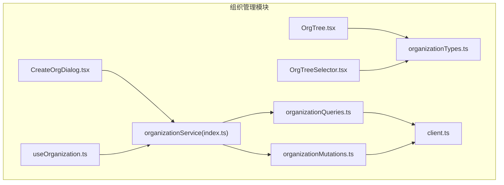
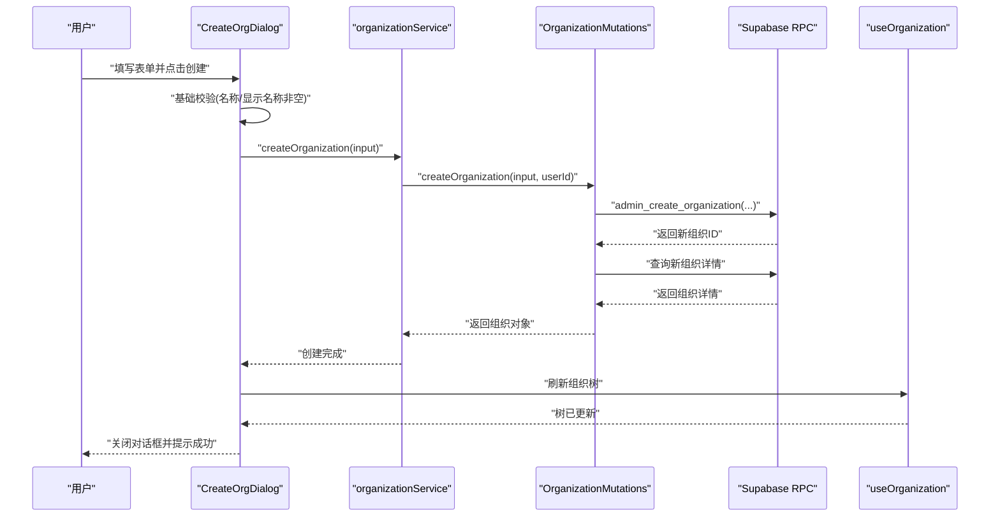
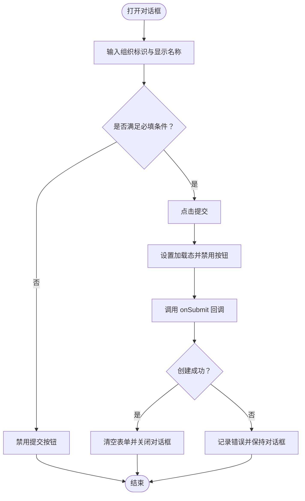
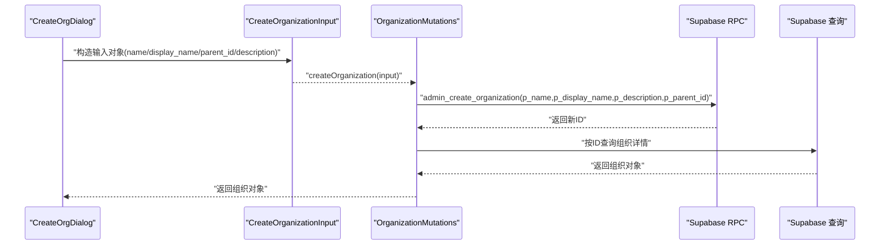
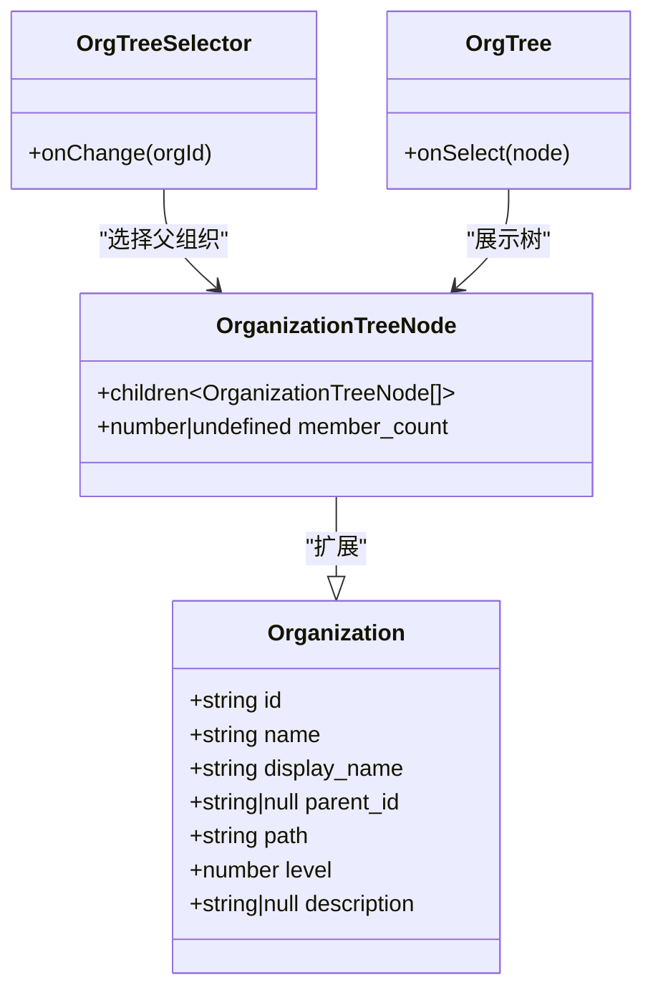
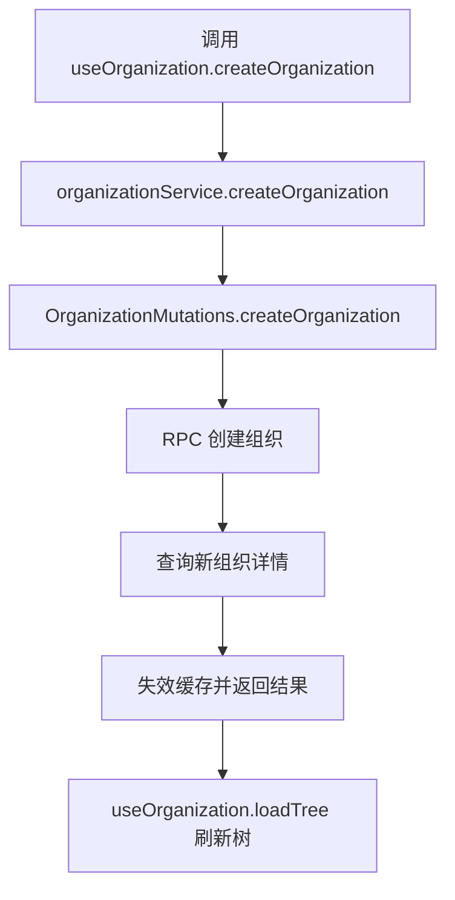
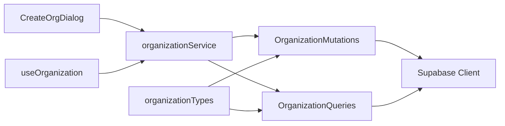

# 创建组织对话框 (CreateOrgDialog)

<cite>
**本文档引用的文件**
- [CreateOrgDialog.tsx](file://app/src/components/organization/CreateOrgDialog.tsx)
- [organizationMutations.ts](file://app/src/services/organization/organizationMutations.ts)
- [organizationQueries.ts](file://app/src/services/organization/organizationQueries.ts)
- [organizationTypes.ts](file://app/src/lib/supabase/organizationTypes.ts)
- [index.ts](file://app/src/services/organization/index.ts)
- [useOrganization.ts](file://app/src/hooks/useOrganization.ts)
- [OrgTree.tsx](file://app/src/components/organization/OrgTree.tsx)
- [OrgTreeSelector.tsx](file://app/src/components/organization/OrgTreeSelector.tsx)
- [client.ts](file://app/src/lib/supabase/client.ts)
</cite>

## 目录
1. [简介](#简介)
2. [项目结构](#项目结构)
3. [核心组件](#核心组件)
4. [架构总览](#架构总览)
5. [详细组件分析](#详细组件分析)
6. [依赖关系分析](#依赖关系分析)
7. [性能考虑](#性能考虑)
8. [故障排除指南](#故障排除指南)
9. [结论](#结论)
10. [附录](#附录)

## 简介
本文件面向系统管理员与前端开发者，全面解析 CreateOrgDialog 组件的实现与使用方法。该对话框用于在系统中创建组织或子团队，支持表单设计、基础数据校验、提交流程与错误处理，并与组织树、权限控制、缓存策略协同工作。文档将从表单字段与验证规则入手，逐步深入到组织层级结构处理、父组织选择与组织名称唯一性验证，最后提供完整的使用示例与最佳实践。

## 项目结构
CreateOrgDialog 位于组织管理模块中，与服务层、类型定义、Hook 和 UI 组件共同构成完整的组织管理能力。

**图表来源**
- [CreateOrgDialog.tsx:1-122](file://app/src/components/organization/CreateOrgDialog.tsx#L1-L122)
- [organizationMutations.ts:1-207](file://app/src/services/organization/organizationMutations.ts#L1-L207)
- [organizationQueries.ts:1-333](file://app/src/services/organization/organizationQueries.ts#L1-L333)
- [organizationTypes.ts:1-91](file://app/src/lib/supabase/organizationTypes.ts#L1-L91)
- [index.ts:1-97](file://app/src/services/organization/index.ts#L1-L97)
- [useOrganization.ts:1-364](file://app/src/hooks/useOrganization.ts#L1-L364)
- [OrgTree.tsx:1-164](file://app/src/components/organization/OrgTree.tsx#L1-L164)
- [OrgTreeSelector.tsx:1-123](file://app/src/components/organization/OrgTreeSelector.tsx#L1-L123)
- [client.ts:1-34](file://app/src/lib/supabase/client.ts#L1-L34)

**章节来源**
- [CreateOrgDialog.tsx:1-122](file://app/src/components/organization/CreateOrgDialog.tsx#L1-L122)
- [organizationMutations.ts:1-207](file://app/src/services/organization/organizationMutations.ts#L1-L207)
- [organizationQueries.ts:1-333](file://app/src/services/organization/organizationQueries.ts#L1-L333)
- [organizationTypes.ts:1-91](file://app/src/lib/supabase/organizationTypes.ts#L1-L91)
- [index.ts:1-97](file://app/src/services/organization/index.ts#L1-L97)
- [useOrganization.ts:1-364](file://app/src/hooks/useOrganization.ts#L1-L364)
- [OrgTree.tsx:1-164](file://app/src/components/organization/OrgTree.tsx#L1-L164)
- [OrgTreeSelector.tsx:1-123](file://app/src/components/organization/OrgTreeSelector.tsx#L1-L123)
- [client.ts:1-34](file://app/src/lib/supabase/client.ts#L1-L34)

## 核心组件
- CreateOrgDialog：负责渲染创建组织的表单，收集用户输入并调用提交回调；在提交前进行基础校验（非空），并在提交过程中禁用按钮与显示加载态。
- organizationMutations：封装组织写操作，通过 RPC 接口创建组织，返回新组织并使缓存失效。
- organizationQueries：封装组织读操作，提供组织树构建、成员查询、祖先链查询等能力。
- organizationService：统一导出的组织服务门面，聚合查询与变更操作。
- useOrganization：React Hook，提供组织树加载、CRUD、成员管理与本地缓存逻辑。
- 类型定义：organizationTypes.ts 定义组织、用户档案、树节点与输入输出类型。
- UI 组件：OrgTree 与 OrgTreeSelector 用于展示与选择组织树节点，辅助父组织选择。

**章节来源**
- [CreateOrgDialog.tsx:20-54](file://app/src/components/organization/CreateOrgDialog.tsx#L20-L54)
- [organizationMutations.ts:16-38](file://app/src/services/organization/organizationMutations.ts#L16-L38)
- [organizationQueries.ts:17-117](file://app/src/services/organization/organizationQueries.ts#L17-L117)
- [index.ts:19-94](file://app/src/services/organization/index.ts#L19-L94)
- [useOrganization.ts:66-140](file://app/src/hooks/useOrganization.ts#L66-L140)
- [organizationTypes.ts:8-91](file://app/src/lib/supabase/organizationTypes.ts#L8-L91)

## 架构总览
CreateOrgDialog 通过 organizationService 调用 organizationMutations.createOrganization，后者通过 Supabase RPC 创建组织，随后 useOrganization.loadTree 刷新组织树缓存，最终在 UI 中呈现新的组织层级。

**图表来源**
- [CreateOrgDialog.tsx:33-54](file://app/src/components/organization/CreateOrgDialog.tsx#L33-L54)
- [organizationMutations.ts:17-38](file://app/src/services/organization/organizationMutations.ts#L17-L38)
- [index.ts:23-25](file://app/src/services/organization/index.ts#L23-L25)
- [useOrganization.ts:123-140](file://app/src/hooks/useOrganization.ts#L123-L140)

## 详细组件分析

### CreateOrgDialog 表单设计与交互
- 表单字段
  - 组织标识（name）：必填，用于路径与路由，支持小写字母、数字与短横线，前端通过 HTML pattern 校验。
  - 显示名称（display_name）：必填，用于界面展示。
  - 描述（description）：可选，支持多行文本。
  - 父组织（parentOrg）：通过外部传入，决定创建根组织还是子组织。
- 交互行为
  - 提交前校验：若名称或显示名称为空则阻止提交。
  - 提交过程：禁用取消与提交按钮，显示“创建中...”。
  - 成功后：清空表单、关闭对话框。
  - 错误处理：捕获异常并记录日志，保持 UI 状态稳定。

**图表来源**
- [CreateOrgDialog.tsx:27-54](file://app/src/components/organization/CreateOrgDialog.tsx#L27-L54)

**章节来源**
- [CreateOrgDialog.tsx:27-122](file://app/src/components/organization/CreateOrgDialog.tsx#L27-L122)

### 数据验证与提交流程
- 前端校验
  - 必填字段：组织标识与显示名称。
  - 字符集限制：组织标识仅允许小写字母、数字与短横线。
- 后端校验与持久化
  - 通过 RPC 存储过程 admin_create_organization 创建组织。
  - 返回新组织 ID 后查询组织详情，保证返回数据完整性。
  - 失效内存缓存，确保后续查询获取最新数据。

**图表来源**
- [organizationMutations.ts:17-38](file://app/src/services/organization/organizationMutations.ts#L17-L38)
- [organizationTypes.ts:68-73](file://app/src/lib/supabase/organizationTypes.ts#L68-L73)

**章节来源**
- [organizationMutations.ts:16-38](file://app/src/services/organization/organizationMutations.ts#L16-L38)
- [organizationTypes.ts:68-73](file://app/src/lib/supabase/organizationTypes.ts#L68-L73)

### 组织层级结构与父组织选择
- 层级结构
  - 组织具备 parent_id、path、level 等字段，支持树形结构与祖先链查询。
  - 组织树通过 organizationQueries.getOrganizationTree 构建，支持按根节点过滤。
- 父组织选择
  - CreateOrgDialog 通过 parentOrg 参数接收父组织上下文，对话框描述会根据是否存在父组织动态提示“在某组织下创建子组织”或“创建根组织”。
  - 在需要选择父组织的场景，可结合 OrgTreeSelector 或 OrgTree 组件进行可视化选择。

**图表来源**
- [organizationTypes.ts:8-18](file://app/src/lib/supabase/organizationTypes.ts#L8-L18)
- [organizationTypes.ts:81-84](file://app/src/lib/supabase/organizationTypes.ts#L81-L84)
- [OrgTreeSelector.tsx:16-88](file://app/src/components/organization/OrgTreeSelector.tsx#L16-L88)
- [OrgTree.tsx:10-47](file://app/src/components/organization/OrgTree.tsx#L10-L47)

**章节来源**
- [organizationQueries.ts:52-117](file://app/src/services/organization/organizationQueries.ts#L52-L117)
- [organizationTypes.ts:8-18](file://app/src/lib/supabase/organizationTypes.ts#L8-L18)
- [CreateOrgDialog.tsx:62-64](file://app/src/components/organization/CreateOrgDialog.tsx#L62-L64)
- [OrgTreeSelector.tsx:63-88](file://app/src/components/organization/OrgTreeSelector.tsx#L63-L88)
- [OrgTree.tsx:116-163](file://app/src/components/organization/OrgTree.tsx#L116-L163)

### 权限控制与数据处理
- 权限控制
  - 更新组织与成员管理等变更操作要求操作者具备管理员权限，内部通过查询操作者角色并校验。
- 数据处理
  - useOrganization 提供 createOrganization 方法，内部调用 organizationService 并刷新组织树缓存。
  - 组织树缓存采用内存缓存与本地存储双重策略，提升加载性能与离线可用性。

**图表来源**
- [useOrganization.ts:123-140](file://app/src/hooks/useOrganization.ts#L123-L140)
- [index.ts:23-25](file://app/src/services/organization/index.ts#L23-L25)
- [organizationMutations.ts:17-38](file://app/src/services/organization/organizationMutations.ts#L17-L38)

**章节来源**
- [organizationMutations.ts:40-75](file://app/src/services/organization/organizationMutations.ts#L40-L75)
- [useOrganization.ts:66-102](file://app/src/hooks/useOrganization.ts#L66-L102)

### 用户引导与最佳实践
- 表单引导
  - 为必填字段提供占位符与简要说明，如组织标识仅支持小写字母、数字与短横线。
  - 在提交按钮上显示加载态，避免重复提交。
- 集成建议
  - 在系统管理页面中，通过按钮触发 CreateOrgDialog，并将 parentOrg 设置为当前选中的组织节点。
  - 结合 OrgTreeSelector 或 OrgTree 实现父组织选择，提升用户体验。
- 错误处理
  - 对于创建失败的情况，应在对话框外层提供 Toast 或全局错误提示，避免静默失败。
  - 对于权限不足或非法输入，应明确提示用户并引导其修正。

**章节来源**
- [CreateOrgDialog.tsx:70-79](file://app/src/components/organization/CreateOrgDialog.tsx#L70-L79)
- [CreateOrgDialog.tsx:104-116](file://app/src/components/organization/CreateOrgDialog.tsx#L104-L116)
- [OrgTreeSelector.tsx:63-88](file://app/src/components/organization/OrgTreeSelector.tsx#L63-L88)

## 依赖关系分析
- 组件耦合
  - CreateOrgDialog 仅依赖外部传入的 onSubmit 回调与 parentOrg 上下文，耦合度低，便于复用。
  - 通过 organizationService 抽象底层实现细节，降低对具体 RPC 与查询的依赖。
- 外部依赖
  - Supabase 客户端通过 client.ts 初始化，支持 MSW 模式下的请求拦截与代理。
  - 组织树构建依赖数据库中的 path、level 等字段，确保层级关系正确。

**图表来源**
- [CreateOrgDialog.tsx:27-25](file://app/src/components/organization/CreateOrgDialog.tsx#L27-L25)
- [index.ts:19-94](file://app/src/services/organization/index.ts#L19-L94)
- [organizationMutations.ts:8](file://app/src/services/organization/organizationMutations.ts#L8)
- [organizationQueries.ts:8](file://app/src/services/organization/organizationQueries.ts#L8)
- [client.ts:26-33](file://app/src/lib/supabase/client.ts#L26-L33)
- [useOrganization.ts:6](file://app/src/hooks/useOrganization.ts#L6)
- [organizationTypes.ts:10-17](file://app/src/lib/supabase/organizationTypes.ts#L10-L17)

**章节来源**
- [index.ts:19-94](file://app/src/services/organization/index.ts#L19-L94)
- [client.ts:1-34](file://app/src/lib/supabase/client.ts#L1-34)

## 性能考虑
- 缓存策略
  - 组织树与用户组织信息采用内存缓存与本地存储缓存，减少重复请求。
  - 组织详情与成员列表也具备独立缓存键与 TTL，避免频繁查询。
- 并发去重
  - 对同一 ID 的查询与用户信息查询采用 Promise Map 去重，防止重复并发请求。
- 路径更新优化
  - 当组织名称变更时，通过 RPC 与批量更新路径，减少多次往返。

**章节来源**
- [organizationQueries.ts:17-50](file://app/src/services/organization/organizationQueries.ts#L17-L50)
- [organizationQueries.ts:178-205](file://app/src/services/organization/organizationMutations.ts#L178-L205)

## 故障排除指南
- 常见问题
  - 组织标识不符合规范：检查前端 pattern 与后端 RPC 校验，确保仅包含小写字母、数字与短横线。
  - 提交按钮不可用：确认名称与显示名称均已填写，且未处于加载状态。
  - 创建失败：查看浏览器控制台错误日志，确认 RPC 调用与查询是否返回异常。
- 排查步骤
  - 确认 Supabase 环境变量配置正确，MSW 模式下使用代理路径。
  - 检查 useOrganization 的错误状态与错误消息，定位具体失败环节。
  - 若涉及权限问题，确认当前用户角色为管理员。

**章节来源**
- [CreateOrgDialog.tsx:33-54](file://app/src/components/organization/CreateOrgDialog.tsx#L33-L54)
- [organizationMutations.ts:26-34](file://app/src/services/organization/organizationMutations.ts#L26-L34)
- [client.ts:18-24](file://app/src/lib/supabase/client.ts#L18-L24)
- [useOrganization.ts:95-101](file://app/src/hooks/useOrganization.ts#L95-L101)

## 结论
CreateOrgDialog 通过简洁的表单与严格的前后端校验，提供了可靠的组织创建体验。配合 organizationService、useOrganization 与组织树组件，能够高效地完成组织层级的构建与维护。建议在系统管理界面中结合父组织选择组件与权限控制，确保创建流程的安全与易用。

## 附录
- 使用示例（集成思路）
  - 在管理页面中放置“创建组织”按钮，点击后打开 CreateOrgDialog，并将 parentOrg 设为当前选中节点。
  - onSubmit 回调中调用 useOrganization.createOrganization，传入 name、display_name、parent_id 与 description。
  - 创建成功后，对话框自动关闭并刷新组织树；可在页面顶部显示 Toast 提示“创建成功”。