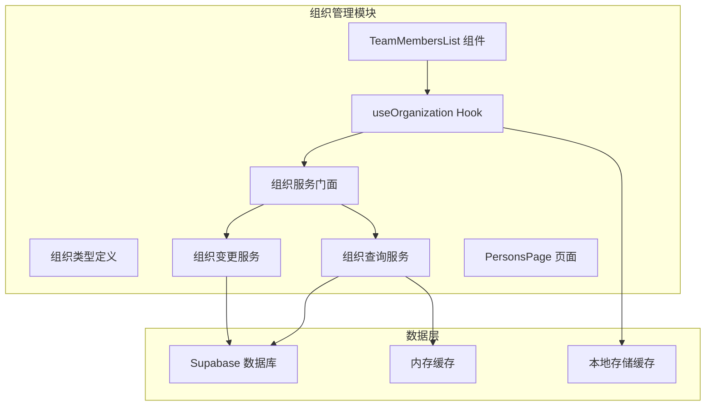
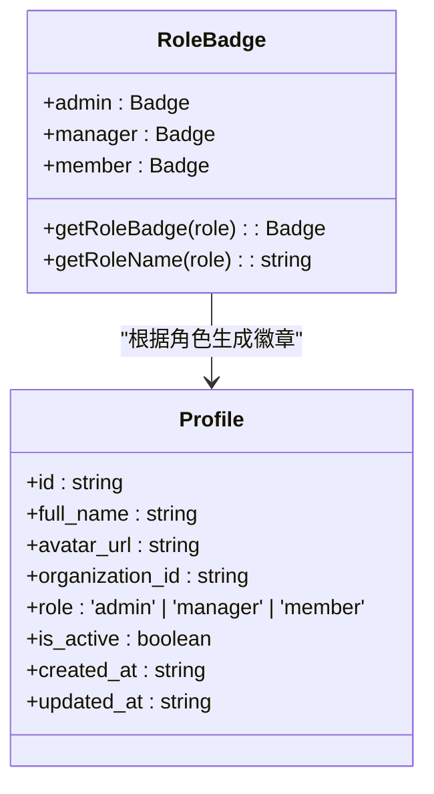
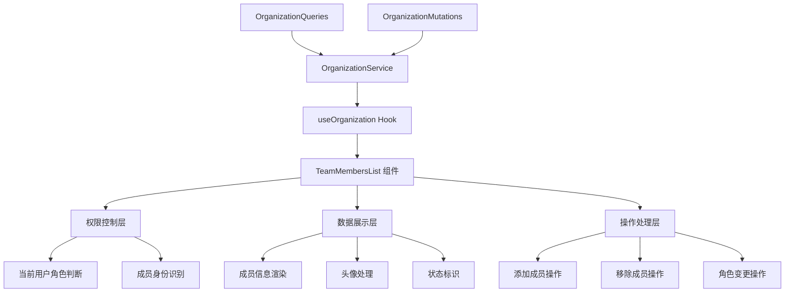
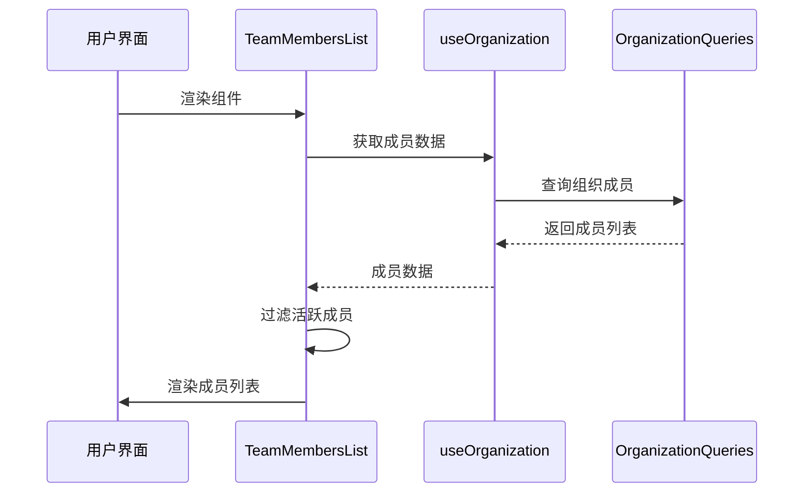
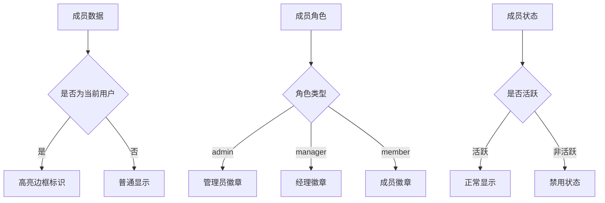
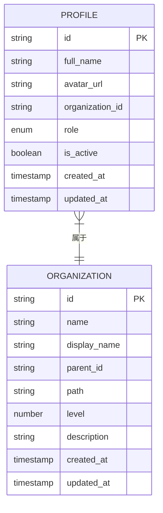
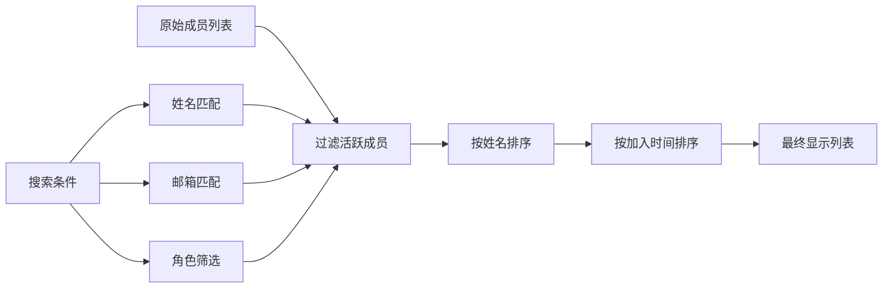
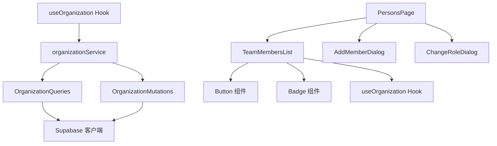
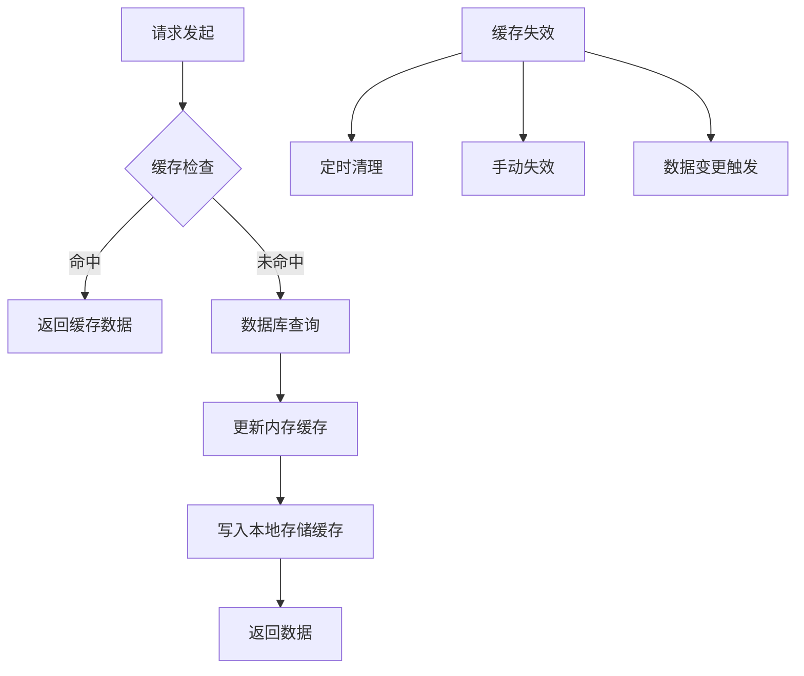

# 团队成员列表 (TeamMembersList)

<cite>
**本文档引用的文件**
- [TeamMembersList.tsx](file://app/src/components/organization/TeamMembersList.tsx)
- [organizationTypes.ts](file://app/src/lib/supabase/organizationTypes.ts)
- [organizationQueries.ts](file://app/src/services/organization/organizationQueries.ts)
- [organizationMutations.ts](file://app/src/services/organization/organizationMutations.ts)
- [index.ts](file://app/src/services/organization/index.ts)
- [useOrganization.ts](file://app/src/hooks/useOrganization.ts)
- [PersonsPage.tsx](file://app/src/pages/PersonsPage.tsx)
</cite>

## 目录
1. [简介](#简介)
2. [项目结构](#项目结构)
3. [核心组件](#核心组件)
4. [架构概览](#架构概览)
5. [详细组件分析](#详细组件分析)
6. [依赖分析](#依赖分析)
7. [性能考虑](#性能考虑)
8. [故障排除指南](#故障排除指南)
9. [结论](#结论)
10. [附录](#附录)

## 简介

TeamMembersList 是一个专门用于展示和管理团队成员的 React 组件。该组件提供了完整的团队成员管理功能，包括成员信息展示、头像处理、状态标识、成员操作等核心功能。

该组件采用现代化的设计理念，支持响应式布局、权限控制和丰富的交互体验。通过清晰的角色标识系统和直观的操作界面，为用户提供高效的团队管理能力。

## 项目结构

TeamMembersList 组件位于组织管理模块中，与相关的类型定义、服务层和页面组件形成完整的架构体系：



**图表来源**
- [TeamMembersList.tsx:1-158](file://app/src/components/organization/TeamMembersList.tsx#L1-L158)
- [organizationTypes.ts:1-91](file://app/src/lib/supabase/organizationTypes.ts#L1-L91)
- [organizationQueries.ts:1-333](file://app/src/services/organization/organizationQueries.ts#L1-L333)

**章节来源**
- [TeamMembersList.tsx:1-158](file://app/src/components/organization/TeamMembersList.tsx#L1-L158)
- [organizationTypes.ts:1-91](file://app/src/lib/supabase/organizationTypes.ts#L1-L91)

## 核心组件

### 组件接口定义

TeamMembersList 接受以下属性参数：

| 属性名 | 类型 | 必需 | 描述 |
|--------|------|------|------|
| members | Profile[] | 是 | 团队成员数组 |
| organizationName | string | 是 | 组织名称 |
| currentUserId | string | 是 | 当前用户ID |
| currentUserRole | 'admin' \| 'manager' \| 'member' | 是 | 当前用户角色 |
| onAddMember | () => void | 否 | 添加成员回调函数 |
| onRemoveMember | (member: Profile) => void | 否 | 移除成员回调函数 |
| onChangeRole | (member: Profile) => void | 否 | 更改角色回调函数 |
| className | string | 否 | 自定义CSS类名 |

### 角色管理系统

组件内置完善的角色标识系统，支持三种角色类型：



**图表来源**
- [TeamMembersList.tsx:22-57](file://app/src/components/organization/TeamMembersList.tsx#L22-L57)
- [organizationTypes.ts:20-29](file://app/src/lib/supabase/organizationTypes.ts#L20-L29)

**章节来源**
- [TeamMembersList.tsx:11-20](file://app/src/components/organization/TeamMembersList.tsx#L11-L20)
- [TeamMembersList.tsx:22-57](file://app/src/components/organization/TeamMembersList.tsx#L22-L57)

## 架构概览

TeamMembersList 采用分层架构设计，确保组件职责清晰、可维护性强：



**图表来源**
- [TeamMembersList.tsx:69-157](file://app/src/components/organization/TeamMembersList.tsx#L69-L157)
- [useOrganization.ts:66-363](file://app/src/hooks/useOrganization.ts#L66-L363)

## 详细组件分析

### 成员信息展示功能

组件提供完整的成员信息展示能力，包括基本信息、身份标识和操作按钮：



**图表来源**
- [TeamMembersList.tsx:70-151](file://app/src/components/organization/TeamMembersList.tsx#L70-L151)
- [useOrganization.ts:108-121](file://app/src/hooks/useOrganization.ts#L108-L121)

### 头像处理机制

组件实现了智能的头像处理系统，支持多种头像显示模式：

| 头像类型 | 显示规则 | 特殊处理 |
|----------|----------|----------|
| 文本头像 | 使用成员姓名首字母 | 自动大写处理 |
| 占位符头像 | 姓名为空时显示问号 | 字体加粗显示 |
| 自定义头像 | 支持外部头像URL | 图片加载失败回退 |

### 状态标识系统

组件提供多层次的状态标识，帮助用户快速识别成员状态：



**图表来源**
- [TeamMembersList.tsx:94-151](file://app/src/components/organization/TeamMembersList.tsx#L94-L151)

### 数据结构分析

组件基于标准化的 Profile 类型进行数据处理：



**图表来源**
- [organizationTypes.ts:20-29](file://app/src/lib/supabase/organizationTypes.ts#L20-L29)
- [organizationTypes.ts:8-18](file://app/src/lib/supabase/organizationTypes.ts#L8-L18)

**章节来源**
- [TeamMembersList.tsx:94-151](file://app/src/components/organization/TeamMembersList.tsx#L94-L151)
- [organizationTypes.ts:20-29](file://app/src/lib/supabase/organizationTypes.ts#L20-L29)

### 排序功能实现

组件采用数据库层面的排序策略，确保数据的一致性和性能：

| 排序字段 | 排序方式 | 排序依据 |
|----------|----------|----------|
| full_name | 升序 | 成员姓名拼音顺序 |
| created_at | 降序 | 最近加入时间 |

### 筛选机制

组件提供多维度的成员筛选能力：



**图表来源**
- [TeamMembersList.tsx:70](file://app/src/components/organization/TeamMembersList.tsx#L70)
- [organizationQueries.ts:256-267](file://app/src/services/organization/organizationQueries.ts#L256-L267)

### 成员操作功能

组件支持完整的成员管理操作，所有操作均经过权限验证：

#### 添加成员操作
- 触发条件：当前用户为管理员
- 操作流程：打开添加成员对话框 → 选择用户 → 设置角色 → 确认添加
- 权限验证：必须具备管理员权限

#### 移除成员操作
- 触发条件：当前用户为管理员且非目标成员
- 操作流程：确认提示 → 执行移除 → 更新成员列表
- 安全措施：防止移除自身账户

#### 角色变更操作
- 触发条件：当前用户为管理员且非目标成员
- 操作流程：打开角色变更对话框 → 选择新角色 → 确认变更
- 限制条件：不能将管理员角色通过API变更

**章节来源**
- [TeamMembersList.tsx:124-147](file://app/src/components/organization/TeamMembersList.tsx#L124-L147)
- [organizationMutations.ts:123-163](file://app/src/services/organization/organizationMutations.ts#L123-L163)

## 依赖分析

### 组件间依赖关系



**图表来源**
- [TeamMembersList.tsx:5-8](file://app/src/components/organization/TeamMembersList.tsx#L5-L8)
- [useOrganization.ts:66-363](file://app/src/hooks/useOrganization.ts#L66-L363)
- [index.ts:19-96](file://app/src/services/organization/index.ts#L19-L96)

### 外部依赖

组件依赖以下关键外部库和工具：

| 依赖项 | 版本 | 用途 | 重要性 |
|--------|------|------|--------|
| lucide-react | 最新版 | 图标库 | 高 |
| tailwindcss | 最新版 | 样式框架 | 高 |
| supabase-js | 最新版 | 数据库客户端 | 高 |
| react | 最新版 | 核心框架 | 高 |

**章节来源**
- [TeamMembersList.tsx:5](file://app/src/components/organization/TeamMembersList.tsx#L5)
- [useOrganization.ts:6](file://app/src/hooks/useOrganization.ts#L6)

## 性能考虑

### 缓存策略

组件采用多层缓存机制优化性能：



**图表来源**
- [organizationQueries.ts:24-50](file://app/src/services/organization/organizationQueries.ts#L24-L50)
- [useOrganization.ts:45-64](file://app/src/hooks/useOrganization.ts#L45-L64)

### 并发处理

组件实现智能的并发请求去重：

| 缓存类型 | 存储位置 | TTL设置 | 功能描述 |
|----------|----------|---------|----------|
| 组织详情 | 内存缓存 | 5分钟 | 避免重复查询同一组织 |
| 组织树 | 内存缓存 | 5分钟 | 缓存完整组织树结构 |
| 用户信息 | 内存缓存 | 1分钟 | 缓存用户组织信息 |
| 成员列表 | 内存缓存 | 1分钟 | 缓存组织成员数据 |

### 响应式设计

组件支持完整的响应式布局：

| 断点 | 屏幕宽度 | 布局特性 |
|------|----------|----------|
| 移动端 | <768px | 单列布局，紧凑间距 |
| 平板端 | 768px-1024px | 双列布局，适中间距 |
| 桌面端 | >1024px | 三列布局，宽松间距 |

## 故障排除指南

### 常见问题及解决方案

#### 成员列表为空
**症状**：显示"该团队暂无成员"
**可能原因**：
- 组织下确实没有成员
- 数据加载失败
- 网络连接问题

**解决步骤**：
1. 检查网络连接状态
2. 刷新页面重新加载数据
3. 确认当前选择的组织正确

#### 权限不足
**症状**：无法看到添加成员按钮或操作按钮
**可能原因**：
- 当前用户不是管理员
- 用户角色权限不足

**解决步骤**：
1. 确认当前用户的组织角色
2. 联系组织管理员获取权限
3. 检查用户组织绑定状态

#### 头像显示异常
**症状**：头像显示为占位符或加载失败
**可能原因**：
- 用户头像URL无效
- 网络图片加载失败

**解决步骤**：
1. 检查用户头像URL格式
2. 确认图片资源可用性
3. 清除浏览器缓存后重试

**章节来源**
- [TeamMembersList.tsx:87-90](file://app/src/components/organization/TeamMembersList.tsx#L87-L90)
- [TeamMembersList.tsx:69](file://app/src/components/organization/TeamMembersList.tsx#L69)

## 结论

TeamMembersList 组件是一个功能完整、设计精良的团队成员管理组件。它通过清晰的架构设计、完善的权限控制和优秀的用户体验，为团队管理提供了强大的技术支持。

组件的主要优势包括：
- **完整的功能覆盖**：支持成员管理的所有核心功能
- **优秀的用户体验**：直观的界面设计和流畅的交互体验
- **强大的扩展性**：模块化设计便于功能扩展和定制
- **可靠的性能表现**：多层缓存和优化策略确保高效运行

通过合理使用该组件，开发者可以快速构建功能丰富的团队管理应用，提升开发效率和用户体验。

## 附录

### 使用示例

#### 基础使用方式
```typescript
// 在团队管理页面中使用
<TeamMembersList
  members={members}
  organizationName={selectedOrg.display_name}
  currentUserId={userId}
  currentUserRole={currentUserRole}
  onAddMember={handleAddMember}
  onRemoveMember={handleRemoveMember}
  onChangeRole={handleChangeRole}
/>
```

#### 高级配置选项
```typescript
// 自定义样式类名
<TeamMembersList
  className="custom-members-list"
  {...otherProps}
/>

// 条件渲染操作按钮
<TeamMembersList
  onAddMember={currentUserRole === 'admin' ? handleAddMember : undefined}
  onRemoveMember={currentUserRole === 'admin' ? handleRemoveMember : undefined}
  onChangeRole={currentUserRole === 'admin' ? handleChangeRole : undefined}
/>
```

### 最佳实践建议

1. **数据预加载**：在组件挂载前确保成员数据已加载完成
2. **错误处理**：为每个操作提供适当的错误处理和用户反馈
3. **权限验证**：始终验证用户权限再显示操作按钮
4. **性能优化**：合理使用缓存机制避免重复请求
5. **用户体验**：提供加载状态和空状态的良好视觉反馈