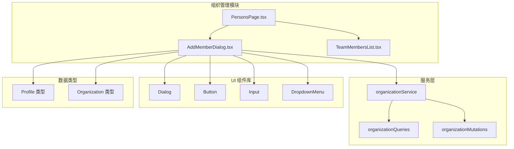
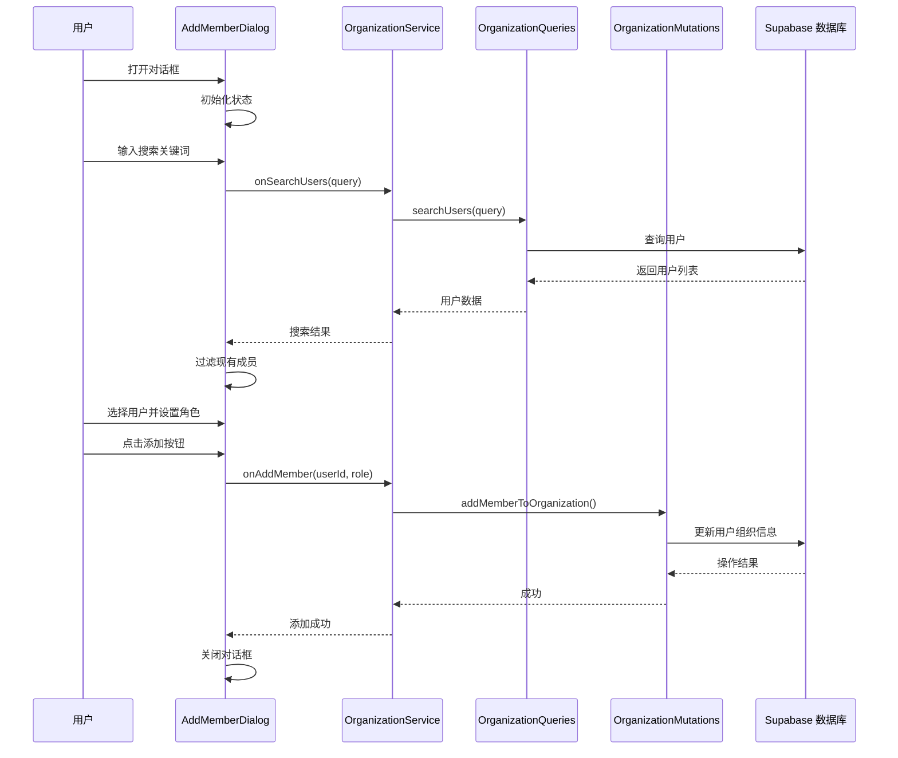
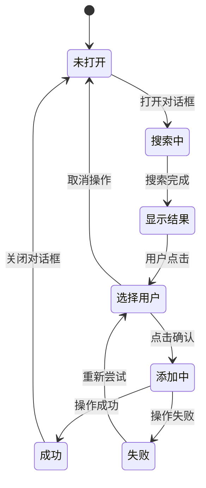
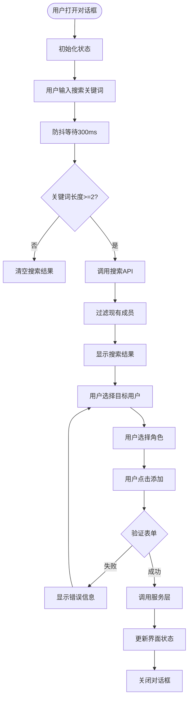
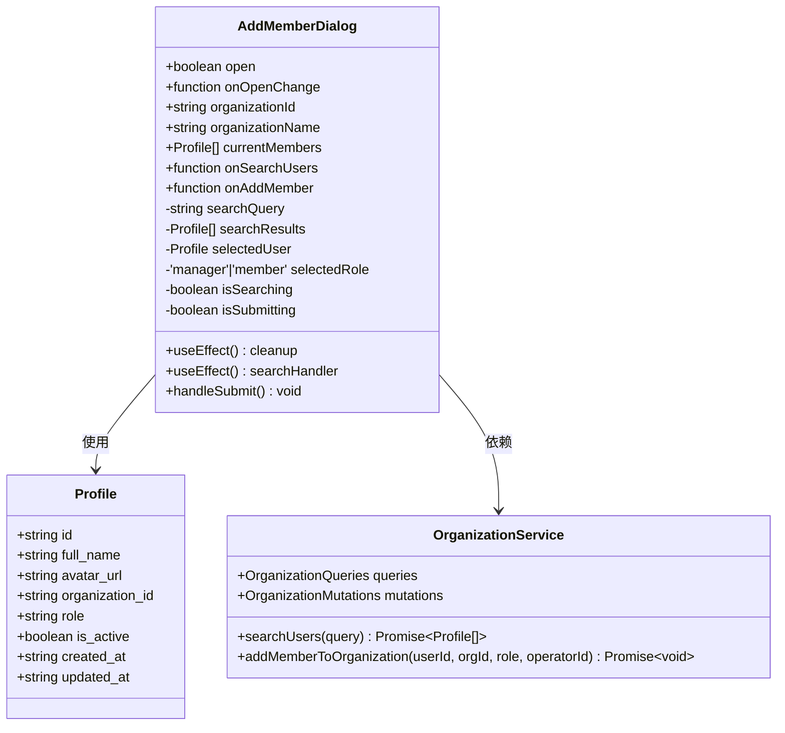
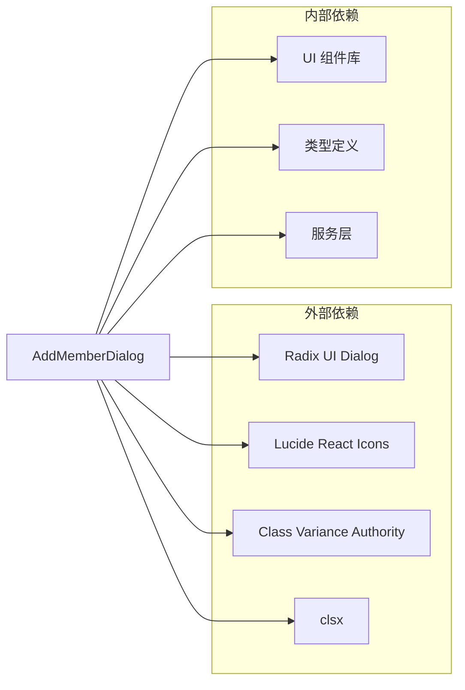
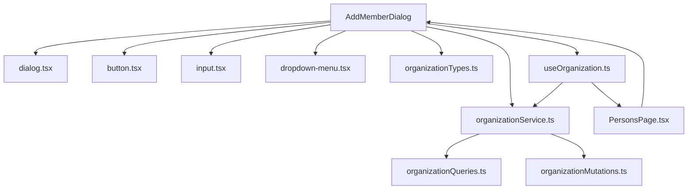

# 添加成员对话框 (AddMemberDialog)

<cite>
**本文档引用的文件**
- [AddMemberDialog.tsx](file://app/src/components/organization/AddMemberDialog.tsx)
- [organizationTypes.ts](file://app/src/lib/supabase/organizationTypes.ts)
- [index.ts](file://app/src/services/organization/index.ts)
- [organizationQueries.ts](file://app/src/services/organization/organizationQueries.ts)
- [organizationMutations.ts](file://app/src/services/organization/organizationMutations.ts)
- [useOrganization.ts](file://app/src/hooks/useOrganization.ts)
- [PersonsPage.tsx](file://app/src/pages/PersonsPage.tsx)
- [TeamMembersList.tsx](file://app/src/components/organization/TeamMembersList.tsx)
- [dialog.tsx](file://app/src/components/ui/dialog.tsx)
- [input.tsx](file://app/src/components/ui/input.tsx)
- [button.tsx](file://app/src/components/ui/button.tsx)
- [dropdown-menu.tsx](file://app/src/components/ui/dropdown-menu.tsx)
</cite>

## 目录
1. [简介](#简介)
2. [项目结构](#项目结构)
3. [核心组件](#核心组件)
4. [架构概览](#架构概览)
5. [详细组件分析](#详细组件分析)
6. [依赖关系分析](#依赖关系分析)
7. [性能考虑](#性能考虑)
8. [故障排除指南](#故障排除指南)
9. [结论](#结论)
10. [附录：使用示例](#附录使用示例)

## 简介

添加成员对话框 (AddMemberDialog) 是组织管理系统中的关键组件，用于在当前组织/团队中搜索并邀请用户加入。该对话框提供了直观的用户界面，支持实时搜索、角色选择和成员添加功能。

该组件采用现代化的 React 设计模式，集成了防抖搜索、状态管理和错误处理机制，确保了良好的用户体验和系统稳定性。

## 项目结构

AddMemberDialog 组件位于组织管理模块中，与相关的 UI 组件和服务层紧密协作：



**图表来源**
- [AddMemberDialog.tsx:1-235](file://app/src/components/organization/AddMemberDialog.tsx#L1-L235)
- [organizationTypes.ts:20-29](file://app/src/lib/supabase/organizationTypes.ts#L20-L29)

**章节来源**
- [AddMemberDialog.tsx:1-235](file://app/src/components/organization/AddMemberDialog.tsx#L1-L235)
- [organizationTypes.ts:1-91](file://app/src/lib/supabase/organizationTypes.ts#L1-L91)

## 核心组件

AddMemberDialog 是一个功能完整的 React 组件，具有以下核心特性：

### 主要功能特性
- **实时用户搜索**: 支持按用户名和邮箱进行搜索
- **角色管理**: 提供管理员和普通成员两种角色选择
- **防抖搜索**: 避免频繁的 API 调用
- **状态管理**: 完整的状态跟踪和错误处理
- **响应式设计**: 适配不同屏幕尺寸

### 组件 Props 接口

| 属性名 | 类型 | 必需 | 描述 |
|--------|------|------|------|
| open | boolean | 是 | 控制对话框显示/隐藏 |
| onOpenChange | (open: boolean) => void | 是 | 对话框状态变化回调 |
| organizationId | string | 是 | 组织 ID |
| organizationName | string | 是 | 组织名称 |
| currentMembers | Profile[] | 是 | 当前成员列表 |
| onSearchUsers | (query: string) => Promise<Profile[]> | 是 | 用户搜索函数 |
| onAddMember | (userId: string, role: 'manager' \| 'member') => Promise<void> | 是 | 添加成员函数 |

**章节来源**
- [AddMemberDialog.tsx:27-35](file://app/src/components/organization/AddMemberDialog.tsx#L27-L35)

## 架构概览

AddMemberDialog 采用分层架构设计，各层职责明确：



**图表来源**
- [AddMemberDialog.tsx:94-108](file://app/src/components/organization/AddMemberDialog.tsx#L94-L108)
- [organizationService.ts:64-71](file://app/src/services/organization/index.ts#L64-L71)
- [organizationMutations.ts:102-121](file://app/src/services/organization/organizationMutations.ts#L102-L121)

## 详细组件分析

### 组件状态管理

AddMemberDialog 使用 React Hooks 进行状态管理：



**图表来源**
- [AddMemberDialog.tsx:55-69](file://app/src/components/organization/AddMemberDialog.tsx#L55-L69)

### 表单验证机制

组件实现了多层次的验证机制：

1. **输入长度验证**: 搜索关键词至少需要2个字符
2. **用户存在性验证**: 自动过滤当前组织的现有成员
3. **角色有效性验证**: 确保选择了有效的角色
4. **权限验证**: 通过服务层进行权限检查

### 用户交互流程



**图表来源**
- [AddMemberDialog.tsx:71-92](file://app/src/components/organization/AddMemberDialog.tsx#L71-L92)
- [AddMemberDialog.tsx:94-108](file://app/src/components/organization/AddMemberDialog.tsx#L94-L108)

**章节来源**
- [AddMemberDialog.tsx:47-235](file://app/src/components/organization/AddMemberDialog.tsx#L47-L235)

### 组件类图



**图表来源**
- [AddMemberDialog.tsx:27-54](file://app/src/components/organization/AddMemberDialog.tsx#L27-L54)
- [organizationTypes.ts:20-29](file://app/src/lib/supabase/organizationTypes.ts#L20-L29)
- [organizationService.ts:19-97](file://app/src/services/organization/index.ts#L19-L97)

## 依赖关系分析

### 外部依赖

AddMemberDialog 依赖于多个 UI 组件库和工具函数：



**图表来源**
- [AddMemberDialog.tsx:5-25](file://app/src/components/organization/AddMemberDialog.tsx#L5-L25)

### 内部依赖关系



**图表来源**
- [AddMemberDialog.tsx:8-25](file://app/src/components/organization/AddMemberDialog.tsx#L8-L25)
- [organizationService.ts:8-17](file://app/src/services/organization/index.ts#L8-L17)

**章节来源**
- [AddMemberDialog.tsx:1-235](file://app/src/components/organization/AddMemberDialog.tsx#L1-L235)
- [organizationService.ts:1-97](file://app/src/services/organization/index.ts#L1-L97)

## 性能考虑

### 防抖搜索优化

组件实现了智能的防抖搜索机制：
- **延迟时间**: 300ms 防抖间隔
- **条件检查**: 仅在关键词长度≥2时执行搜索
- **内存清理**: 组件卸载时清除定时器

### 状态管理优化

- **局部状态**: 仅管理对话框相关的状态
- **避免不必要的重渲染**: 使用 React.memo 和 useCallback
- **缓存策略**: 利用服务层的缓存机制

### 错误处理策略

- **异步错误捕获**: 搜索和添加操作的错误处理
- **降级策略**: 搜索失败时清空结果而非崩溃
- **用户反馈**: 清晰的错误提示信息

## 故障排除指南

### 常见问题及解决方案

| 问题 | 可能原因 | 解决方案 |
|------|----------|----------|
| 搜索无结果 | 关键词过短 | 确保输入≥2个字符 |
| 用户已在组织 | 已是当前组织成员 | 系统会自动过滤 |
| 添加失败 | 权限不足或网络问题 | 检查用户权限和网络连接 |
| 角色选择无效 | 服务端验证失败 | 确保选择有效角色 |

### 调试技巧

1. **控制台日志**: 组件会在错误时输出详细日志
2. **状态检查**: 使用浏览器开发者工具检查组件状态
3. **网络监控**: 查看 API 请求和响应
4. **权限验证**: 确认当前用户具备管理员权限

**章节来源**
- [AddMemberDialog.tsx:80-107](file://app/src/components/organization/AddMemberDialog.tsx#L80-L107)

## 结论

AddMemberDialog 是一个设计精良的 React 组件，具有以下优势：

1. **用户体验优秀**: 实时搜索、清晰的视觉反馈和直观的操作流程
2. **技术实现稳健**: 完善的状态管理、错误处理和性能优化
3. **可维护性强**: 清晰的代码结构、类型安全和模块化设计
4. **扩展性良好**: 基于接口的设计便于功能扩展和定制

该组件为组织管理提供了可靠的成员添加功能，是企业级应用中不可或缺的重要组成部分。

## 附录：使用示例

### 在组织管理界面中使用

```typescript
// 在 PersonsPage 中集成 AddMemberDialog
const PersonsPage = () => {
  const { 
    members, 
    selectedOrg, 
    userOrgInfo, 
    searchUsers, 
    addMember 
  } = useOrganization(userId);

  const [addMemberDialogOpen, setAddMemberDialogOpen] = useState(false);

  const handleAddMemberSubmit = async (targetUserId: string, role: 'manager' | 'member') => {
    if (!selectedOrg) return;
    await addMember(targetUserId, selectedOrg.id, role);
  };

  return (
    <div>
      {/* 组织成员列表 */}
      <TeamMembersList
        members={members}
        organizationName={selectedOrg?.display_name || ''}
        currentUserId={userId}
        currentUserRole={userOrgInfo?.role || 'member'}
        onAddMember={() => setAddMemberDialogOpen(true)}
      />

      {/* 添加成员对话框 */}
      {selectedOrg && (
        <AddMemberDialog
          open={addMemberDialogOpen}
          onOpenChange={setAddMemberDialogOpen}
          organizationId={selectedOrg.id}
          organizationName={selectedOrg.display_name}
          currentMembers={members}
          onSearchUsers={searchUsers}
          onAddMember={handleAddMemberSubmit}
        />
      )}
    </div>
  );
};
```

### 最佳实践建议

1. **权限检查**: 确保调用方具备管理员权限
2. **错误处理**: 实现完善的错误捕获和用户提示
3. **状态同步**: 添加成功后及时更新本地状态
4. **用户体验**: 提供清晰的加载状态和反馈信息
5. **性能优化**: 合理使用防抖和缓存机制

### 事件回调模式

```typescript
// 推荐的事件处理模式
const handleAddMember = useCallback(async (userId: string, role: 'manager' | 'member') => {
  try {
    setIsLoading(true);
    setError(null);
    
    await organizationService.addMemberToOrganization(userId, orgId, role, operatorId);
    
    // 成功后的状态更新
    if (selectedOrg?.id === orgId) {
      await loadMembers(orgId);
    }
    
    // 关闭对话框
    setAddMemberDialogOpen(false);
    
  } catch (error) {
    setError(error instanceof Error ? error.message : '添加成员失败');
    throw error;
  } finally {
    setIsLoading(false);
  }
}, [orgId, selectedOrg, loadMembers]);
```

**章节来源**
- [PersonsPage.tsx:191-201](file://app/src/pages/PersonsPage.tsx#L191-L201)
- [useOrganization.ts:227-245](file://app/src/hooks/useOrganization.ts#L227-L245)