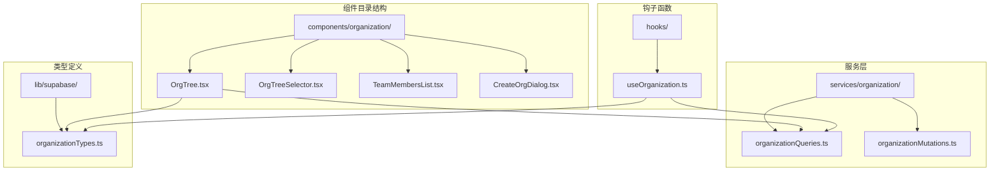
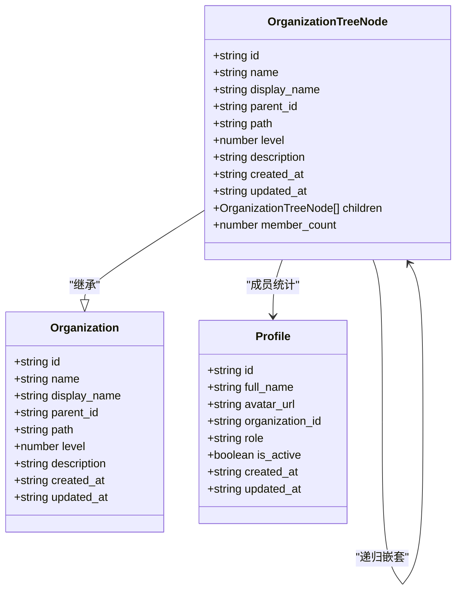
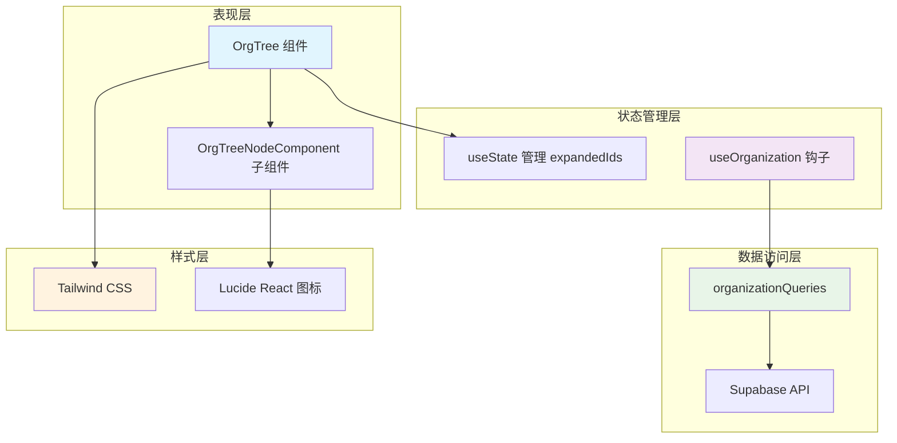
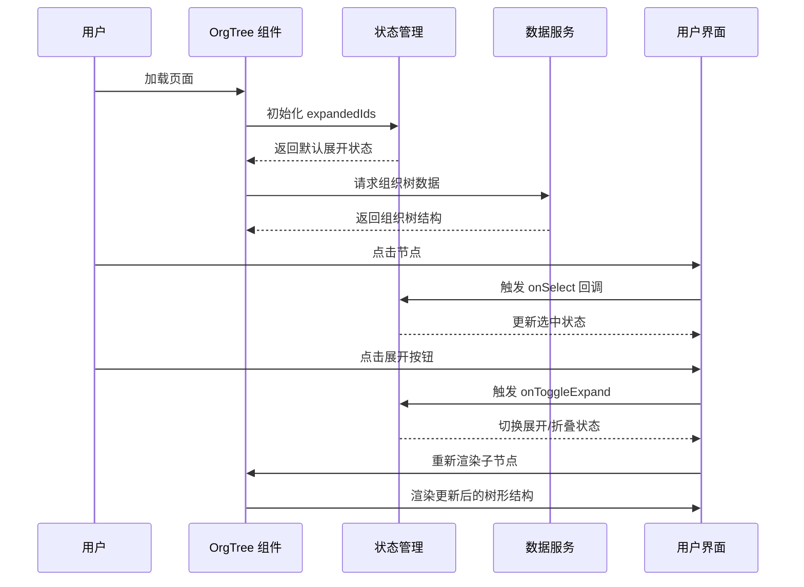
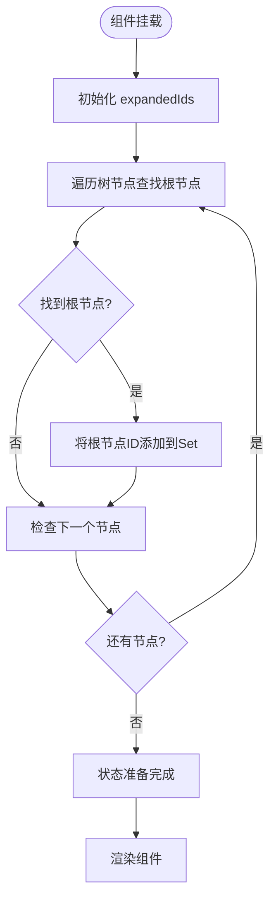
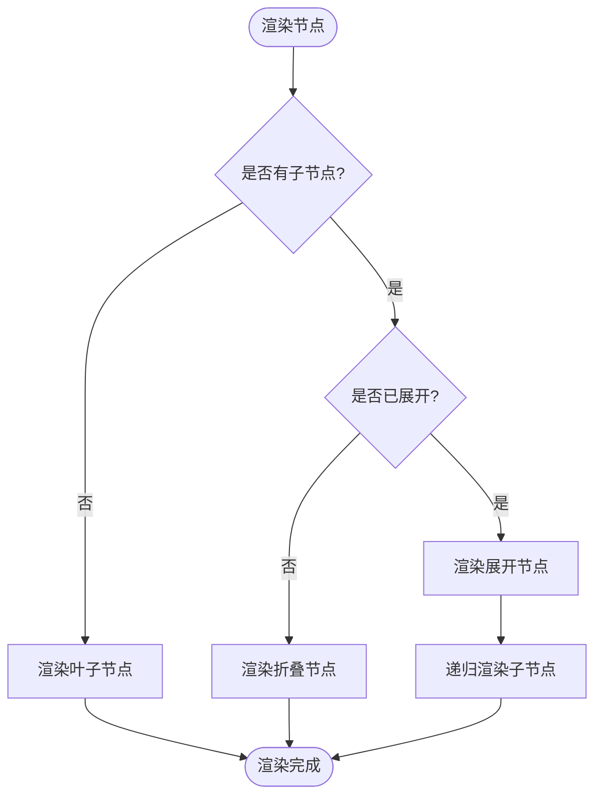
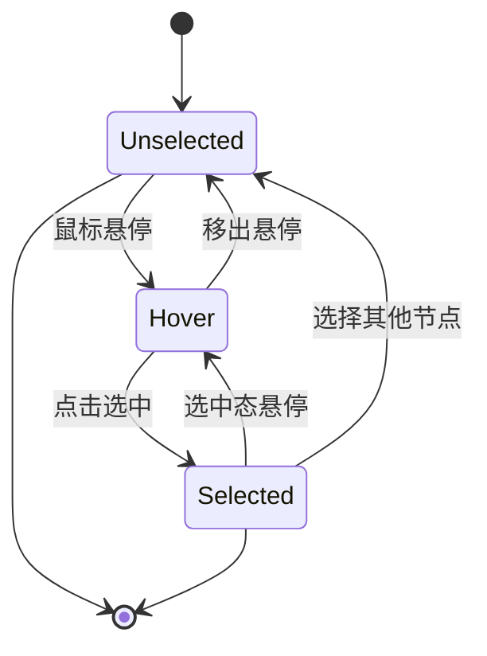
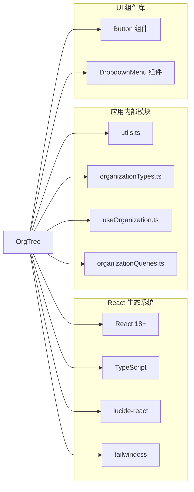
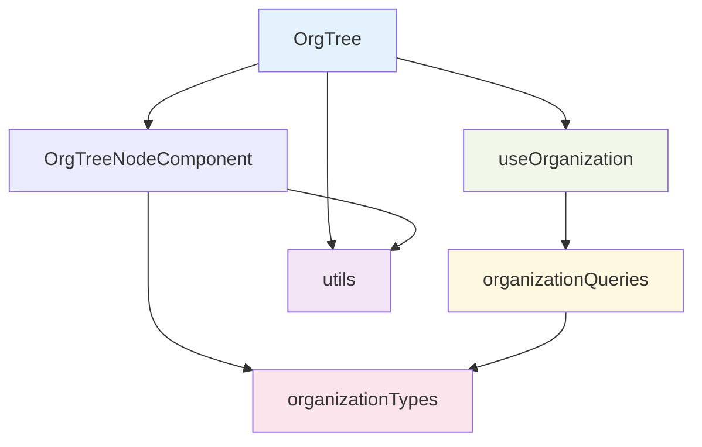
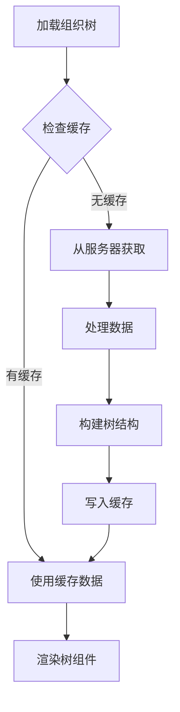

# 组织树组件 (OrgTree)

<cite>
**本文档引用的文件**
- [OrgTree.tsx](file://app/src/components/organization/OrgTree.tsx)
- [organizationTypes.ts](file://app/src/lib/supabase/organizationTypes.ts)
- [useOrganization.ts](file://app/src/hooks/useOrganization.ts)
- [organizationQueries.ts](file://app/src/services/organization/organizationQueries.ts)
- [OrgTreeSelector.tsx](file://app/src/components/organization/OrgTreeSelector.tsx)
- [PersonsPage.tsx](file://app/src/pages/PersonsPage.tsx)
- [utils.ts](file://app/src/lib/utils.ts)
- [button.tsx](file://app/src/components/ui/button.tsx)
- [tailwind.config.js](file://app/tailwind.config.js)
- [index.css](file://app/src/index.css)
</cite>

## 目录
1. [简介](#简介)
2. [项目结构](#项目结构)
3. [核心组件](#核心组件)
4. [架构概览](#架构概览)
5. [详细组件分析](#详细组件分析)
6. [依赖关系分析](#依赖关系分析)
7. [性能考虑](#性能考虑)
8. [故障排除指南](#故障排除指南)
9. [结论](#结论)
10. [附录](#附录)

## 简介

组织树组件 (OrgTree) 是一个专门用于展示组织架构层级结构的 React 组件。该组件实现了递归渲染组织层级树的核心功能，包括节点展开/折叠、选中交互、层级缩进显示和成员数量统计等特性。

该组件采用现代化的前端技术栈构建，集成了 Tailwind CSS 样式系统、Lucide React 图标库和 TypeScript 类型安全。组件设计遵循响应式布局原则，支持深色模式切换，并提供了丰富的视觉反馈效果。

## 项目结构

组织树组件位于应用程序的业务组件目录中，与相关的组织管理功能紧密集成：



**图表来源**
- [OrgTree.tsx:1-164](file://app/src/components/organization/OrgTree.tsx#L1-L164)
- [organizationTypes.ts:1-91](file://app/src/lib/supabase/organizationTypes.ts#L1-L91)

**章节来源**
- [OrgTree.tsx:1-164](file://app/src/components/organization/OrgTree.tsx#L1-L164)
- [organizationTypes.ts:1-91](file://app/src/lib/supabase/organizationTypes.ts#L1-L91)

## 核心组件

### 组件接口定义

组织树组件通过清晰的接口定义确保了良好的类型安全性和可维护性：

#### OrgTreeProps 接口
- `tree`: OrganizationTreeNode[] - 组织树节点数组
- `selectedId`: string | null - 当前选中节点的 ID
- `onSelect`: (node: OrganizationTreeNode) => void - 节点选择回调函数
- `className?`: string - 自定义样式类名

#### OrgTreeNodeProps 接口
- `node`: OrganizationTreeNode - 当前节点数据
- `level`: number - 节点层级深度
- `selectedId`: string | null - 当前选中节点 ID
- `onSelect`: (node: OrganizationTreeNode) => void - 节点选择回调
- `expandedIds`: Set<string> - 展开状态集合
- `onToggleExpand`: (id: string) => void - 展开/折叠切换回调

### 数据结构设计

组件基于 OrganizationTreeNode 类型构建，该类型扩展了基础的 Organization 接口并添加了递归嵌套能力：



**图表来源**
- [organizationTypes.ts:8-91](file://app/src/lib/supabase/organizationTypes.ts#L8-L91)

**章节来源**
- [OrgTree.tsx:10-24](file://app/src/components/organization/OrgTree.tsx#L10-L24)
- [organizationTypes.ts:81-84](file://app/src/lib/supabase/organizationTypes.ts#L81-L84)

## 架构概览

组织树组件采用分层架构设计，实现了清晰的关注点分离：



**图表来源**
- [OrgTree.tsx:116-163](file://app/src/components/organization/OrgTree.tsx#L116-L163)
- [useOrganization.ts:75-102](file://app/src/hooks/useOrganization.ts#L75-L102)

### 核心流程

组件的核心工作流程包括数据加载、状态管理和用户交互处理：



**图表来源**
- [OrgTree.tsx:116-163](file://app/src/components/organization/OrgTree.tsx#L116-L163)
- [OrgTree.tsx:26-114](file://app/src/components/organization/OrgTree.tsx#L26-L114)

**章节来源**
- [OrgTree.tsx:116-163](file://app/src/components/organization/OrgTree.tsx#L116-L163)
- [OrgTree.tsx:26-114](file://app/src/components/organization/OrgTree.tsx#L26-L114)

## 详细组件分析

### 组件状态管理

组织树组件采用 React 的 useState Hook 来管理展开状态，使用 Set 数据结构来高效存储展开的节点 ID：

#### 状态初始化逻辑
组件在挂载时自动展开所有根节点，确保用户能够立即看到完整的组织结构：



**图表来源**
- [OrgTree.tsx:118-126](file://app/src/components/organization/OrgTree.tsx#L118-L126)

#### 展开/折叠切换机制
组件实现了高效的展开/折叠切换逻辑，使用 Set 数据结构确保操作的时间复杂度为 O(1)：

**章节来源**
- [OrgTree.tsx:118-138](file://app/src/components/organization/OrgTree.tsx#L118-L138)

### 递归渲染算法

OrgTreeNodeComponent 实现了递归渲染算法，能够处理任意深度的组织层级结构：

#### 递归渲染流程


**图表来源**
- [OrgTree.tsx:26-114](file://app/src/components/organization/OrgTree.tsx#L26-L114)

#### 层级缩进计算
组件使用 CSS 样式属性实现动态层级缩进，每个层级增加 16px 的左内边距：

**章节来源**
- [OrgTree.tsx:26-114](file://app/src/components/organization/OrgTree.tsx#L26-L114)

### 选中交互机制

组件提供了完整的节点选中交互功能，包括视觉反馈和状态同步：

#### 选中状态管理


**图表来源**
- [OrgTree.tsx:34-47](file://app/src/components/organization/OrgTree.tsx#L34-L47)

**章节来源**
- [OrgTree.tsx:34-47](file://app/src/components/organization/OrgTree.tsx#L34-L47)

### 图标系统与视觉设计

组件集成了 Lucide React 图标库，提供了丰富的视觉元素来增强用户体验：

#### 图标使用策略
- **展开/折叠图标**: ChevronRight/ChevronDown - 显示节点的展开状态
- **组织图标**: FolderClosed/FolderOpen - 表示有子节点的组织单元
- **部门图标**: Building2 - 表示叶子节点（无子节点的部门）
- **成员统计图标**: Users - 显示部门成员数量

#### 样式类名体系
组件使用 Tailwind CSS 类名实现一致的视觉设计：

**章节来源**
- [OrgTree.tsx:52-95](file://app/src/components/organization/OrgTree.tsx#L52-L95)

## 依赖关系分析

### 外部依赖

组织树组件依赖于多个外部库和框架：



**图表来源**
- [OrgTree.tsx:5-8](file://app/src/components/organization/OrgTree.tsx#L5-L8)

### 内部依赖关系

组件之间的依赖关系体现了清晰的分层架构：



**图表来源**
- [OrgTree.tsx:116-163](file://app/src/components/organization/OrgTree.tsx#L116-L163)
- [useOrganization.ts:75-102](file://app/src/hooks/useOrganization.ts#L75-L102)

**章节来源**
- [OrgTree.tsx:116-163](file://app/src/components/organization/OrgTree.tsx#L116-L163)
- [useOrganization.ts:75-102](file://app/src/hooks/useOrganization.ts#L75-L102)

## 性能考虑

### 渲染优化

组织树组件采用了多项性能优化策略：

#### 1. 虚拟化渲染
对于大型组织结构，建议实现虚拟化渲染以减少 DOM 节点数量。

#### 2. 状态更新优化
使用 Set 数据结构存储展开状态，确保 O(1) 的查找和更新性能。

#### 3. 条件渲染
只有在节点展开时才渲染子节点，避免不必要的 DOM 结构创建。

### 缓存策略

组件与 useOrganization 钩子配合实现了智能缓存机制：



**图表来源**
- [useOrganization.ts:75-102](file://app/src/hooks/useOrganization.ts#L75-L102)

**章节来源**
- [useOrganization.ts:75-102](file://app/src/hooks/useOrganization.ts#L75-L102)

## 故障排除指南

### 常见问题诊断

#### 1. 组件不显示数据
**症状**: 组织树显示为空白或提示"暂无组织架构数据"

**可能原因**:
- 数据加载失败
- 组织树数据格式不正确
- 网络连接问题

**解决方案**:
- 检查网络请求状态
- 验证数据格式符合 OrganizationTreeNode 接口
- 查看控制台错误日志

#### 2. 展开/折叠功能失效
**症状**: 点击展开按钮没有反应

**可能原因**:
- 事件冒泡被阻止
- 状态更新逻辑错误
- 子节点数据缺失

**解决方案**:
- 检查 handleToggleExpand 函数实现
- 验证 hasChildren 条件判断
- 确认 expandedIds 状态正确更新

#### 3. 选中状态异常
**症状**: 节点选中状态显示不正确

**可能原因**:
- selectedId 参数传递错误
- 选中回调函数未正确处理
- 状态同步问题

**解决方案**:
- 验证 onSelect 回调函数实现
- 检查 selectedId 的值和类型
- 确认状态更新的时机

### 调试技巧

#### 1. 开启开发模式
在开发环境中启用 React DevTools 来监控组件状态变化。

#### 2. 日志记录
在关键函数中添加适当的日志输出来跟踪执行流程。

#### 3. 数据验证
定期验证传入的数据格式，确保符合预期的类型定义。

**章节来源**
- [OrgTree.tsx:140-146](file://app/src/components/organization/OrgTree.tsx#L140-L146)
- [OrgTree.tsx:38-47](file://app/src/components/organization/OrgTree.tsx#L38-L47)

## 结论

组织树组件 (OrgTree) 是一个功能完整、设计精良的 React 组件，成功实现了组织架构层级树的递归渲染。组件具有以下优势：

### 技术优势
- **类型安全**: 完整的 TypeScript 支持，确保编译时类型检查
- **性能优化**: 高效的状态管理和条件渲染策略
- **可扩展性**: 清晰的架构设计支持功能扩展
- **用户体验**: 丰富的视觉反馈和交互效果

### 设计亮点
- **递归渲染**: 优雅地处理任意深度的组织层级
- **状态管理**: 使用 Set 数据结构实现高效的展开状态管理
- **视觉设计**: 与 Tailwind CSS 和 Lucide React 的完美集成
- **响应式布局**: 支持不同屏幕尺寸和深色模式

### 应用场景
该组件适用于各种组织管理场景，包括：
- 企业组织架构管理
- 团队成员组织结构展示
- 部门权限管理系统
- 人员信息查询和管理

## 附录

### 使用示例

#### 基础使用
```typescript
// 在页面中使用 OrgTree 组件
function OrganizationManagementPage() {
  const { tree, selectedOrg, loadTree, selectOrganization } = useOrganization(userId)
  
  return (
    <div>
      <h2>组织架构</h2>
      {isLoading ? (
        <p>加载中...</p>
      ) : (
        <OrgTree 
          tree={tree}
          selectedId={selectedOrg?.id || null}
          onSelect={handleSelectOrg}
        />
      )}
    </div>
  )
}
```

#### 高级配置
```typescript
// 自定义样式和行为
function AdvancedOrgTree() {
  return (
    <OrgTree 
      tree={tree}
      selectedId={selectedId}
      onSelect={handleSelect}
      className="custom-tree-style"
    />
  )
}
```

### 最佳实践

#### 1. 数据准备
确保传入的组织树数据符合 OrganizationTreeNode 接口要求，包含必要的字段如 id、display_name、level 等。

#### 2. 性能优化
对于大型组织结构，考虑实现虚拟化渲染和懒加载策略，避免一次性渲染大量节点。

#### 3. 错误处理
实现适当的错误边界和加载状态处理，提升用户体验。

#### 4. 样式定制
利用 Tailwind CSS 的类名系统进行样式定制，保持设计的一致性。

**章节来源**
- [PersonsPage.tsx:153-161](file://app/src/pages/PersonsPage.tsx#L153-L161)