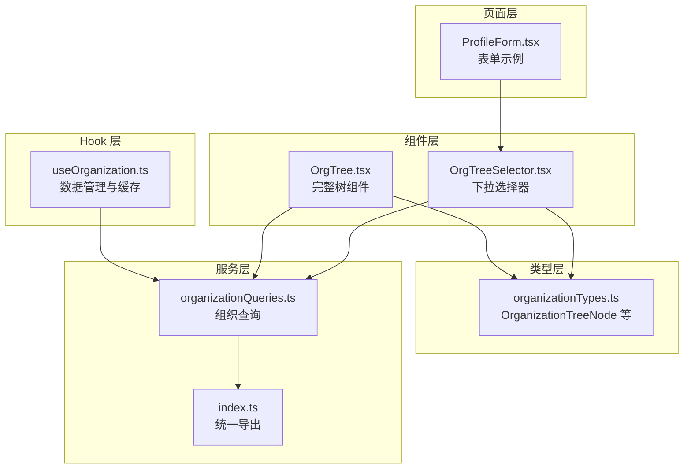
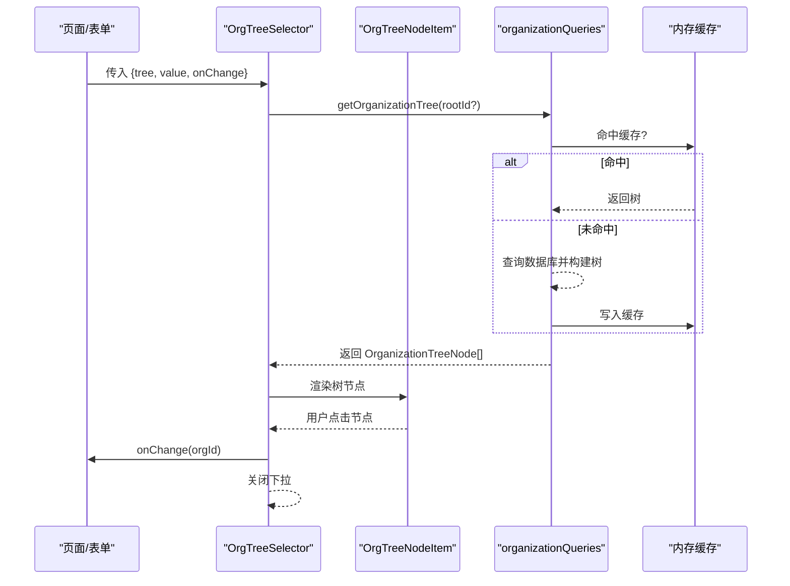
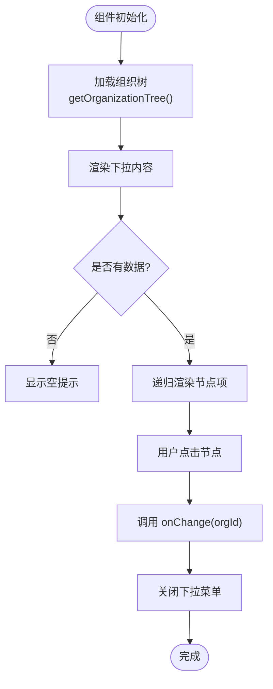
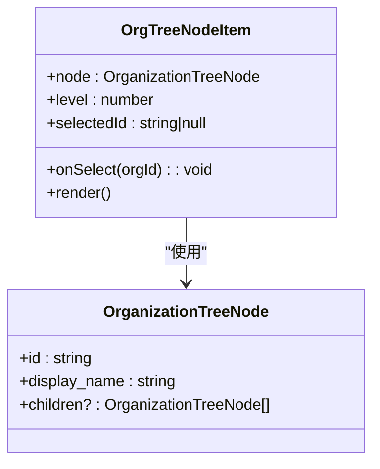
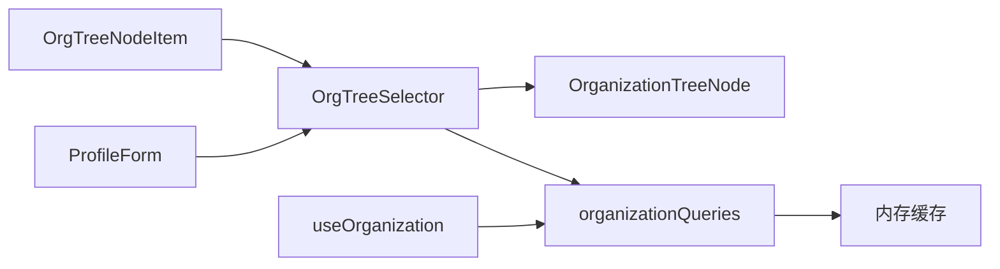

# 组织树选择器 (OrgTreeSelector)

<cite>
**本文档引用的文件**
- [OrgTreeSelector.tsx](file://app/src/components/organization/OrgTreeSelector.tsx)
- [OrgTree.tsx](file://app/src/components/organization/OrgTree.tsx)
- [organizationTypes.ts](file://app/src/lib/supabase/organizationTypes.ts)
- [index.ts](file://app/src/services/organization/index.ts)
- [organizationQueries.ts](file://app/src/services/organization/organizationQueries.ts)
- [useOrganization.ts](file://app/src/hooks/useOrganization.ts)
- [ProfileForm.tsx](file://app/src/components/business/ProfileForm.tsx)
</cite>

## 目录
1. [简介](#简介)
2. [项目结构](#项目结构)
3. [核心组件](#核心组件)
4. [架构总览](#架构总览)
5. [详细组件分析](#详细组件分析)
6. [依赖分析](#依赖分析)
7. [性能考虑](#性能考虑)
8. [故障排除指南](#故障排除指南)
9. [结论](#结论)
10. [附录](#附录)

## 简介
本文件系统性介绍组织树选择器 (OrgTreeSelector) 的设计与实现，涵盖以下关键能力：
- 下拉式组织树展示与层级导航
- 单选选择逻辑与结果返回
- 数据源处理：从数据库到内存缓存的组织树构建
- 搜索与过滤：基于本地查找的快速定位
- 样式与交互：图标、占位符、禁用态与自定义类名
- 实际使用场景：在表单与配置界面中的集成方式

注意：当前实现为单选下拉选择器，不包含多选支持；搜索功能采用本地节点遍历匹配，未接入远程实时搜索。

## 项目结构
组织树相关代码主要分布在以下位置：
- 组件层：组织树选择器与组织树组件
- 类型层：组织树节点与用户组织信息的数据模型
- 服务层：组织查询与变更服务
- Hook 层：组织数据管理与缓存策略
- 页面层：业务表单中对选择器的使用示例

图表来源
- [OrgTreeSelector.tsx:1-123](file://app/src/components/organization/OrgTreeSelector.tsx#L1-L123)
- [OrgTree.tsx:1-164](file://app/src/components/organization/OrgTree.tsx#L1-L164)
- [organizationTypes.ts:81-84](file://app/src/lib/supabase/organizationTypes.ts#L81-L84)
- [organizationQueries.ts:52-117](file://app/src/services/organization/organizationQueries.ts#L52-L117)
- [index.ts:19-97](file://app/src/services/organization/index.ts#L19-L97)
- [useOrganization.ts:66-102](file://app/src/hooks/useOrganization.ts#L66-L102)
- [ProfileForm.tsx:192-202](file://app/src/components/business/ProfileForm.tsx#L192-L202)

章节来源
- [OrgTreeSelector.tsx:1-123](file://app/src/components/organization/OrgTreeSelector.tsx#L1-L123)
- [organizationTypes.ts:81-84](file://app/src/lib/supabase/organizationTypes.ts#L81-L84)
- [organizationQueries.ts:52-117](file://app/src/services/organization/organizationQueries.ts#L52-L117)
- [useOrganization.ts:66-102](file://app/src/hooks/useOrganization.ts#L66-L102)
- [ProfileForm.tsx:192-202](file://app/src/components/business/ProfileForm.tsx#L192-L202)

## 核心组件
- 组织树选择器 (OrgTreeSelector)
  - 功能：以按钮触发的下拉菜单展示组织树，支持层级缩进与选中高亮
  - 输入：value（当前选中组织 ID）、onChange（回调函数）、tree（组织树数组）、className、placeholder
  - 输出：通过 onChange 回调返回所选组织 ID，并自动关闭下拉
  - 交互：点击按钮打开下拉，点击节点触发选择并关闭菜单
- 组织树节点项 (OrgTreeNodeItem)
  - 功能：递归渲染单个节点及其子节点，支持层级缩进与选中态样式
  - 特性：根据 level 计算左侧内边距；选中时显示勾选图标；显示组织名称

章节来源
- [OrgTreeSelector.tsx:16-29](file://app/src/components/organization/OrgTreeSelector.tsx#L16-L29)
- [OrgTreeSelector.tsx:31-61](file://app/src/components/organization/OrgTreeSelector.tsx#L31-L61)
- [OrgTreeSelector.tsx:63-122](file://app/src/components/organization/OrgTreeSelector.tsx#L63-L122)

## 架构总览
下图展示了从页面到数据层的整体调用链路：

图表来源
- [OrgTreeSelector.tsx:63-122](file://app/src/components/organization/OrgTreeSelector.tsx#L63-L122)
- [organizationQueries.ts:52-117](file://app/src/services/organization/organizationQueries.ts#L52-L117)
- [useOrganization.ts:75-102](file://app/src/hooks/useOrganization.ts#L75-L102)

## 详细组件分析

### 组件 A：组织树选择器 (OrgTreeSelector)
- 设计要点
  - 使用下拉菜单承载树形结构，宽度与最大高度固定，支持滚动
  - 选中态通过节点 ID 匹配实现，选中节点显示勾选图标
  - 展示名称优先取当前选中节点，否则显示占位符
  - 支持自定义类名，便于在不同布局中适配
- 选择逻辑
  - onChange 回调接收 orgId，随后关闭下拉菜单
  - 通过本地遍历在树中查找当前选中节点，用于显示名称
- 数据流
  - tree 来源于服务层查询，经内存缓存优化
  - value 作为受控属性，确保外部状态与组件一致
- 错误与边界
  - 当 tree 为空时显示“暂无组织数据”提示
  - 未选中时显示 placeholder 文案

图表来源
- [OrgTreeSelector.tsx:63-122](file://app/src/components/organization/OrgTreeSelector.tsx#L63-L122)
- [organizationQueries.ts:52-117](file://app/src/services/organization/organizationQueries.ts#L52-L117)

章节来源
- [OrgTreeSelector.tsx:63-122](file://app/src/components/organization/OrgTreeSelector.tsx#L63-L122)
- [organizationQueries.ts:52-117](file://app/src/services/organization/organizationQueries.ts#L52-L117)

### 组件 B：组织树节点项 (OrgTreeNodeItem)
- 设计要点
  - 递归渲染：若存在子节点则继续渲染
  - 层级缩进：通过 style 的 paddingLeft 实现，每深入一层增加固定像素
  - 选中高亮：选中节点加粗并应用强调色
  - 图标语义：组织图标、勾选图标
- 性能特性
  - 仅在 selectedId 或节点本身变化时重新计算样式
  - 子节点渲染按需进行，避免整树重绘

图表来源
- [OrgTreeSelector.tsx:24-29](file://app/src/components/organization/OrgTreeSelector.tsx#L24-L29)
- [OrgTreeSelector.tsx:31-61](file://app/src/components/organization/OrgTreeSelector.tsx#L31-L61)
- [organizationTypes.ts:81-84](file://app/src/lib/supabase/organizationTypes.ts#L81-L84)

章节来源
- [OrgTreeSelector.tsx:24-61](file://app/src/components/organization/OrgTreeSelector.tsx#L24-L61)
- [organizationTypes.ts:81-84](file://app/src/lib/supabase/organizationTypes.ts#L81-L84)

### 组件 C：组织树 (OrgTree)
- 设计要点
  - 支持节点展开/折叠与选中交互
  - 默认展开所有根节点，便于初次浏览
  - 显示成员数量（当存在 member_count 时）
- 与选择器的关系
  - OrgTree 用于完整树展示与交互，而 OrgTreeSelector 用于下拉选择
  - 两者共享相同的 OrganizationTreeNode 类型与渲染逻辑

章节来源
- [OrgTree.tsx:116-163](file://app/src/components/organization/OrgTree.tsx#L116-L163)
- [organizationTypes.ts:81-84](file://app/src/lib/supabase/organizationTypes.ts#L81-L84)

### 数据模型：组织树节点
- OrganizationTreeNode
  - 扩展自 Organization，新增 children 与 member_count 字段
  - 用于前端渲染树形结构与统计成员数量
- 相关类型
  - Organization：组织基础字段（含路径、层级）
  - UserOrganizationInfo：用户所属组织与其祖先组织

章节来源
- [organizationTypes.ts:81-84](file://app/src/lib/supabase/organizationTypes.ts#L81-L84)
- [organizationTypes.ts:8-18](file://app/src/lib/supabase/organizationTypes.ts#L8-L18)
- [organizationTypes.ts:86-90](file://app/src/lib/supabase/organizationTypes.ts#L86-L90)

### 服务与 Hook：组织查询与缓存
- 组织查询服务
  - getOrganizationTree：从数据库查询并构建树，同时统计成员数量
  - buildTree：将扁平组织列表转换为树结构
  - 内存缓存：针对完整树与分根树分别缓存，提升重复访问性能
- useOrganization Hook
  - 封装组织树加载、成员加载、用户组织信息查询等
  - 本地缓存：使用 localStorage 在 TTL 内缓存组织树与可上传组织列表
  - 并发去重：对同一请求进行去重，避免重复网络请求

章节来源
- [organizationQueries.ts:52-117](file://app/src/services/organization/organizationQueries.ts#L52-L117)
- [organizationQueries.ts:303-331](file://app/src/services/organization/organizationQueries.ts#L303-L331)
- [useOrganization.ts:75-102](file://app/src/hooks/useOrganization.ts#L75-L102)
- [useOrganization.ts:41-64](file://app/src/hooks/useOrganization.ts#L41-L64)

## 依赖分析
- 组件依赖
  - OrgTreeSelector 依赖 OrganizationTreeNode 类型与下拉菜单 UI 组件
  - OrgTreeNodeItem 依赖 OrgTreeSelector 的回调接口
- 服务依赖
  - 组织查询服务依赖 Supabase 客户端与内存缓存
  - useOrganization Hook 依赖组织查询服务与本地缓存
- 外部依赖
  - UI 组件库：Button、DropdownMenu 等
  - 图标库：lucide-react

图表来源
- [OrgTreeSelector.tsx:14](file://app/src/components/organization/OrgTreeSelector.tsx#L14)
- [organizationQueries.ts:8-15](file://app/src/services/organization/organizationQueries.ts#L8-L15)
- [useOrganization.ts:6](file://app/src/hooks/useOrganization.ts#L6)
- [ProfileForm.tsx:192-202](file://app/src/components/business/ProfileForm.tsx#L192-L202)

章节来源
- [OrgTreeSelector.tsx:14](file://app/src/components/organization/OrgTreeSelector.tsx#L14)
- [organizationQueries.ts:8-15](file://app/src/services/organization/organizationQueries.ts#L8-L15)
- [useOrganization.ts:6](file://app/src/hooks/useOrganization.ts#L6)
- [ProfileForm.tsx:192-202](file://app/src/components/business/ProfileForm.tsx#L192-L202)

## 性能考虑
- 内存缓存
  - 组织树与用户组织信息均采用内存缓存，减少重复查询
  - useOrganization 中对完整树与可上传组织列表使用本地缓存（TTL）
- 并发去重
  - 组织查询服务对相同请求进行去重，避免重复网络请求
- 渲染优化
  - 仅在必要时重新渲染节点项，减少不必要的重排
  - 下拉菜单限制宽度与高度，配合滚动条控制渲染范围

章节来源
- [organizationQueries.ts:17-50](file://app/src/services/organization/organizationQueries.ts#L17-L50)
- [useOrganization.ts:41-64](file://app/src/hooks/useOrganization.ts#L41-L64)
- [OrgTreeSelector.tsx:103-119](file://app/src/components/organization/OrgTreeSelector.tsx#L103-L119)

## 故障排除指南
- 问题：下拉菜单无数据
  - 检查 tree 是否为空或未正确加载
  - 确认服务层 getOrganizationTree 是否返回数据
- 问题：选中态不生效
  - 确认 value 与节点 ID 一致
  - 检查 findNodeById 是否能正确匹配
- 问题：性能问题
  - 检查是否频繁重新渲染树
  - 确认缓存是否命中
- 问题：样式异常
  - 检查 className 是否覆盖了必要的样式
  - 确认占位符与选中态样式是否正确

章节来源
- [OrgTreeSelector.tsx:72-83](file://app/src/components/organization/OrgTreeSelector.tsx#L72-L83)
- [organizationQueries.ts:52-117](file://app/src/services/organization/organizationQueries.ts#L52-L117)
- [useOrganization.ts:75-102](file://app/src/hooks/useOrganization.ts#L75-L102)

## 结论
OrgTreeSelector 以简洁的下拉菜单承载组织树，具备清晰的层级展示与选中反馈，结合服务层的内存缓存与 Hook 的本地缓存，实现了良好的性能与可用性。当前版本专注于单选与本地匹配，未来可扩展为多选与远程搜索，以满足更复杂的业务场景。

## 附录

### 使用示例：在表单中集成
- 场景：在个人信息表单中设置“所在团队”字段
- 步骤
  - 通过 useOrganization 加载组织树
  - 将 OrgTreeSelector 的 value 绑定到表单字段
  - onChange 中更新表单状态
  - 可通过 className 自定义样式，placeholder 设置为“请选择团队”
- 注意事项
  - 若需要禁用选择器，可在外部控制其显示状态
  - 选中后建议立即关闭下拉菜单，避免影响后续操作

章节来源
- [ProfileForm.tsx:192-202](file://app/src/components/business/ProfileForm.tsx#L192-L202)
- [OrgTreeSelector.tsx:63-122](file://app/src/components/organization/OrgTreeSelector.tsx#L63-L122)
- [useOrganization.ts:75-102](file://app/src/hooks/useOrganization.ts#L75-L102)