# 组织管理组件

<cite>
**本文档引用的文件**
- [app/src/components/organization/OrgTree.tsx](file://app/src/components/organization/OrgTree.tsx)
- [app/src/components/organization/AddMemberDialog.tsx](file://app/src/components/organization/AddMemberDialog.tsx)
- [app/src/components/organization/AssignTeamDialog.tsx](file://app/src/components/organization/AssignTeamDialog.tsx)
- [app/src/components/organization/ChangeRoleDialog.tsx](file://app/src/components/organization/ChangeRoleDialog.tsx)
- [app/src/components/organization/CreateOrgDialog.tsx](file://app/src/components/organization/CreateOrgDialog.tsx)
- [app/src/components/organization/OrgTreeSelector.tsx](file://app/src/components/organization/OrgTreeSelector.tsx)
- [app/src/components/organization/OrganizationBreadcrumb.tsx](file://app/src/components/organization/OrganizationBreadcrumb.tsx)
- [app/src/components/organization/TeamMembersList.tsx](file://app/src/components/organization/TeamMembersList.tsx)
- [app/src/services/organization/index.ts](file://app/src/services/organization/index.ts)
- [app/src/services/organization/organizationMutations.ts](file://app/src/services/organization/organizationMutations.ts)
- [app/src/services/organization/organizationQueries.ts](file://app/src/services/organization/organizationQueries.ts)
- [app/src/lib/supabase/organizationTypes.ts](file://app/src/lib/supabase/organizationTypes.ts)
- [app/src/pages/PersonsPage.tsx](file://app/src/pages/PersonsPage.tsx)
</cite>

## 目录
1. [引言](#引言)
2. [项目结构](#项目结构)
3. [核心组件](#核心组件)
4. [架构总览](#架构总览)
5. [详细组件分析](#详细组件分析)
6. [依赖分析](#依赖分析)
7. [性能考量](#性能考量)
8. [故障排查指南](#故障排查指南)
9. [结论](#结论)
10. [附录](#附录)

## 引言
本文件系统性梳理组织管理相关组件，覆盖组织树、成员管理、角色变更、团队分配、组织创建与选择器、面包屑导航等模块。重点阐述各组件的功能特性、数据绑定、事件处理与状态管理，以及组件间协作关系与数据流；并提供在组织管理页面中的使用示例与集成指南，涵盖权限控制、实时更新与用户体验要点。

## 项目结构
组织管理组件位于应用前端的组织域，围绕组织树与成员列表两大核心视图构建，并通过统一的服务层对接 Supabase 数据库与缓存层。页面层通过自定义 Hook 聚合服务层能力，驱动组件渲染与交互。

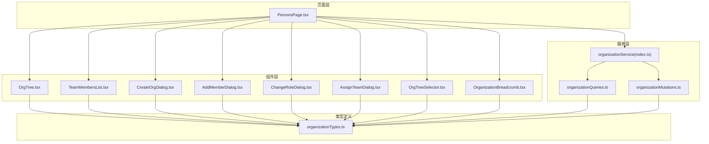

图表来源
- [app/src/pages/PersonsPage.tsx:17-214](file://app/src/pages/PersonsPage.tsx#L17-L214)
- [app/src/components/organization/OrgTree.tsx:10-164](file://app/src/components/organization/OrgTree.tsx#L10-L164)
- [app/src/components/organization/TeamMembersList.tsx:11-158](file://app/src/components/organization/TeamMembersList.tsx#L11-L158)
- [app/src/components/organization/CreateOrgDialog.tsx:20-122](file://app/src/components/organization/CreateOrgDialog.tsx#L20-L122)
- [app/src/components/organization/AddMemberDialog.tsx:27-235](file://app/src/components/organization/AddMemberDialog.tsx#L27-L235)
- [app/src/components/organization/ChangeRoleDialog.tsx:25-167](file://app/src/components/organization/ChangeRoleDialog.tsx#L25-L167)
- [app/src/components/organization/AssignTeamDialog.tsx:19-112](file://app/src/components/organization/AssignTeamDialog.tsx#L19-L112)
- [app/src/components/organization/OrgTreeSelector.tsx:16-123](file://app/src/components/organization/OrgTreeSelector.tsx#L16-L123)
- [app/src/components/organization/OrganizationBreadcrumb.tsx:9-78](file://app/src/components/organization/OrganizationBreadcrumb.tsx#L9-L78)
- [app/src/services/organization/index.ts:19-97](file://app/src/services/organization/index.ts#L19-L97)
- [app/src/services/organization/organizationQueries.ts:17-333](file://app/src/services/organization/organizationQueries.ts#L17-L333)
- [app/src/services/organization/organizationMutations.ts:16-207](file://app/src/services/organization/organizationMutations.ts#L16-L207)
- [app/src/lib/supabase/organizationTypes.ts:8-91](file://app/src/lib/supabase/organizationTypes.ts#L8-L91)

章节来源
- [app/src/pages/PersonsPage.tsx:17-214](file://app/src/pages/PersonsPage.tsx#L17-L214)

## 核心组件
- 组织树组件：递归渲染组织层级树，支持节点展开/折叠与选中交互，展示成员数量。
- 成员列表组件：展示团队成员与角色，支持添加成员、移除成员、修改角色等操作入口。
- 添加成员对话框：搜索用户并邀请加入当前组织，支持角色选择与去重过滤。
- 修改角色对话框：变更成员角色（管理员除外的变更），对管理员角色提供安全提示。
- 分配团队对话框：将成员从一个组织/团队分配到另一个团队，基于组织树选择。
- 创建组织对话框：创建新组织或子团队，支持名称与显示名称校验。
- 组织树选择器：下拉菜单式组织树选择器，用于快速选择目标组织。
- 组织面包屑：展示当前组织的层级路径与用户角色徽章。

章节来源
- [app/src/components/organization/OrgTree.tsx:10-164](file://app/src/components/organization/OrgTree.tsx#L10-L164)
- [app/src/components/organization/TeamMembersList.tsx:11-158](file://app/src/components/organization/TeamMembersList.tsx#L11-L158)
- [app/src/components/organization/AddMemberDialog.tsx:27-235](file://app/src/components/organization/AddMemberDialog.tsx#L27-L235)
- [app/src/components/organization/ChangeRoleDialog.tsx:25-167](file://app/src/components/organization/ChangeRoleDialog.tsx#L25-L167)
- [app/src/components/organization/AssignTeamDialog.tsx:19-112](file://app/src/components/organization/AssignTeamDialog.tsx#L19-L112)
- [app/src/components/organization/CreateOrgDialog.tsx:20-122](file://app/src/components/organization/CreateOrgDialog.tsx#L20-L122)
- [app/src/components/organization/OrgTreeSelector.tsx:16-123](file://app/src/components/organization/OrgTreeSelector.tsx#L16-L123)
- [app/src/components/organization/OrganizationBreadcrumb.tsx:9-78](file://app/src/components/organization/OrganizationBreadcrumb.tsx#L9-L78)

## 架构总览
组织管理采用“页面层-组件层-服务层-类型定义”的分层设计。页面层通过自定义 Hook 获取组织树、成员列表与用户组织信息；组件层负责 UI 渲染与交互；服务层封装查询与变更操作，统一暴露 API；类型定义确保前后端数据契约一致。

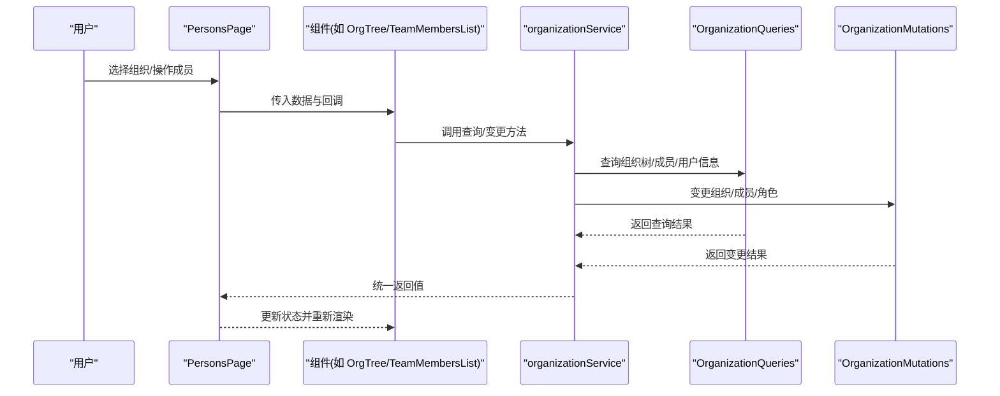

图表来源
- [app/src/pages/PersonsPage.tsx:22-38](file://app/src/pages/PersonsPage.tsx#L22-L38)
- [app/src/services/organization/index.ts:19-97](file://app/src/services/organization/index.ts#L19-L97)
- [app/src/services/organization/organizationQueries.ts:52-117](file://app/src/services/organization/organizationQueries.ts#L52-L117)
- [app/src/services/organization/organizationMutations.ts:102-137](file://app/src/services/organization/organizationMutations.ts#L102-L137)

## 详细组件分析

### 组件：组织树组件 OrgTree
- 功能特性
  - 递归渲染组织层级树，支持根节点默认展开。
  - 节点可展开/折叠，选中高亮，显示成员数量。
  - 支持空态提示。
- 数据绑定
  - 输入属性：组织树数组、当前选中节点 ID、选中回调。
  - 内部状态：展开集合（Set）。
- 事件处理
  - 节点点击触发选中；图标点击控制展开/收起。
- 状态管理
  - 使用本地状态维护展开状态，避免父组件重复渲染。
- 性能与复杂度
  - 展开状态以 Set 存储，查找/更新均为 O(1)。
  - 递归渲染，时间复杂度 O(N)，N 为节点数。

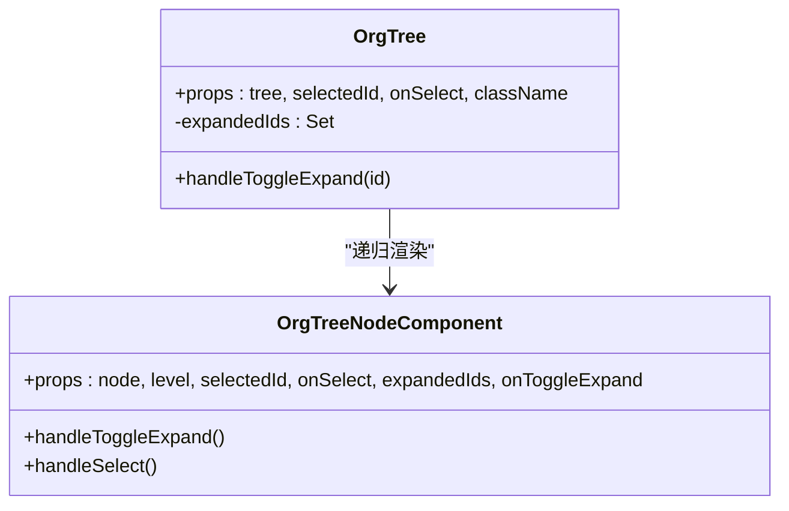

图表来源
- [app/src/components/organization/OrgTree.tsx:116-164](file://app/src/components/organization/OrgTree.tsx#L116-L164)
- [app/src/components/organization/OrgTree.tsx:26-114](file://app/src/components/organization/OrgTree.tsx#L26-L114)

章节来源
- [app/src/components/organization/OrgTree.tsx:10-164](file://app/src/components/organization/OrgTree.tsx#L10-L164)

### 组件：成员列表 TeamMembersList
- 功能特性
  - 展示团队成员与角色徽章，区分当前用户。
  - 条目内提供移除成员、修改角色按钮（管理员可见且非自身）。
  - 显示成员总数与空态提示。
- 数据绑定
  - 输入属性：成员数组、组织名、当前用户 ID、当前用户角色、回调函数。
- 事件处理
  - 按钮点击触发移除/改角色回调。
- 权限控制
  - 仅管理员可见并可操作他人。
- 用户体验
  - 当前用户条目高亮边框，便于识别。

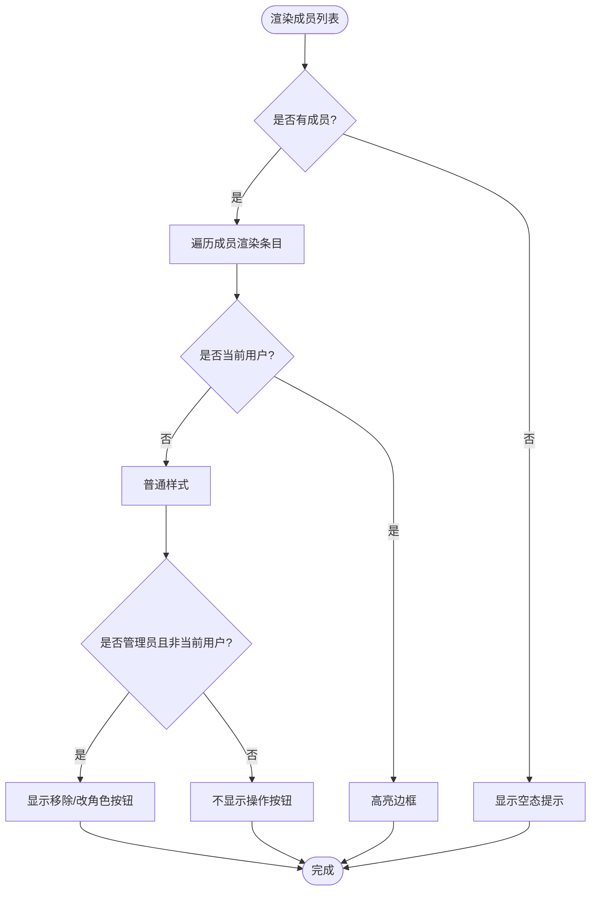

图表来源
- [app/src/components/organization/TeamMembersList.tsx:59-158](file://app/src/components/organization/TeamMembersList.tsx#L59-L158)

章节来源
- [app/src/components/organization/TeamMembersList.tsx:11-158](file://app/src/components/organization/TeamMembersList.tsx#L11-L158)

### 组件：添加成员对话框 AddMemberDialog
- 功能特性
  - 搜索用户（防抖，最小长度阈值），过滤当前组织成员。
  - 选择用户后弹出角色选择（成员/经理），提交时调用添加成员接口。
- 数据绑定
  - 输入属性：对话框开关、组织 ID/名称、当前成员列表、搜索与添加回调。
- 事件处理
  - 搜索输入防抖；用户选择；角色切换；表单提交。
- 错误处理
  - 捕获搜索与添加异常，提示用户。
- 用户体验
  - 搜索中状态、空结果提示、已选用户预览、角色说明与安全提示。

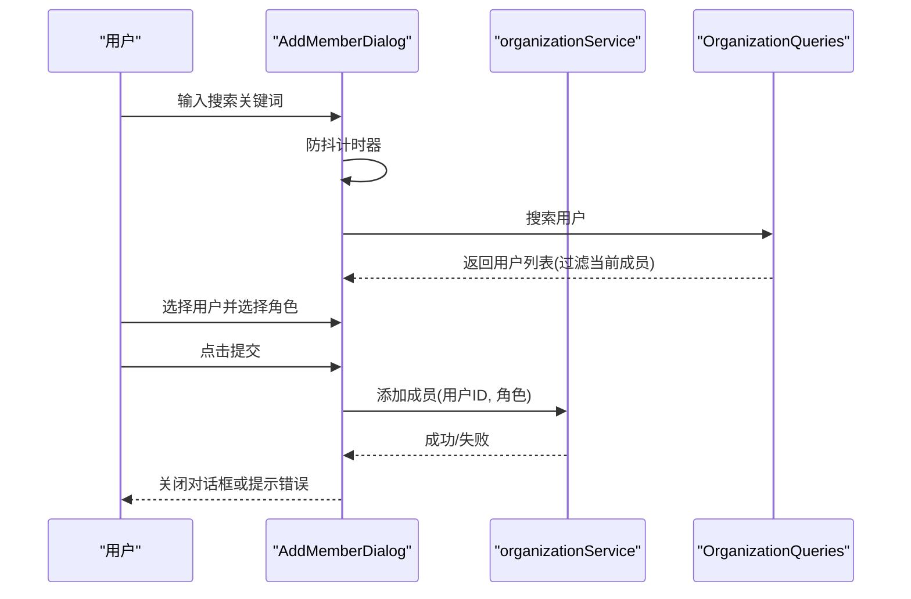

图表来源
- [app/src/components/organization/AddMemberDialog.tsx:47-235](file://app/src/components/organization/AddMemberDialog.tsx#L47-L235)
- [app/src/services/organization/index.ts:82-87](file://app/src/services/organization/index.ts#L82-L87)
- [app/src/services/organization/organizationQueries.ts:256-267](file://app/src/services/organization/organizationQueries.ts#L256-L267)

章节来源
- [app/src/components/organization/AddMemberDialog.tsx:27-235](file://app/src/components/organization/AddMemberDialog.tsx#L27-L235)
- [app/src/services/organization/index.ts:82-87](file://app/src/services/organization/index.ts#L82-L87)
- [app/src/services/organization/organizationQueries.ts:256-267](file://app/src/services/organization/organizationQueries.ts#L256-L267)

### 组件：修改角色对话框 ChangeRoleDialog
- 功能特性
  - 为成员设置新角色（成员/经理），管理员角色变更需通过数据库直接修改。
- 数据绑定
  - 输入属性：对话框开关、成员信息、变更回调。
- 事件处理
  - 角色选择；提交变更。
- 权限控制
  - 管理员角色变更禁止通过 API，给出安全提示与 SQL 建议。
- 用户体验
  - 当前角色展示、角色说明、禁用无效变更按钮。

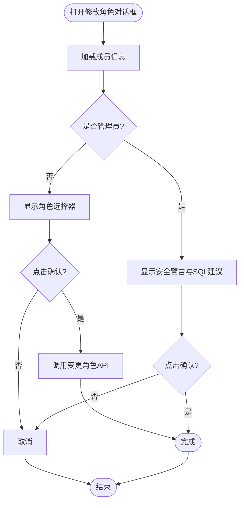

图表来源
- [app/src/components/organization/ChangeRoleDialog.tsx:43-167](file://app/src/components/organization/ChangeRoleDialog.tsx#L43-L167)
- [app/src/services/organization/organizationMutations.ts:139-163](file://app/src/services/organization/organizationMutations.ts#L139-L163)

章节来源
- [app/src/components/organization/ChangeRoleDialog.tsx:25-167](file://app/src/components/organization/ChangeRoleDialog.tsx#L25-L167)
- [app/src/services/organization/organizationMutations.ts:139-163](file://app/src/services/organization/organizationMutations.ts#L139-L163)

### 组件：分配团队对话框 AssignTeamDialog
- 功能特性
  - 将成员从一个组织/团队分配到另一个团队，基于组织树选择。
- 数据绑定
  - 输入属性：对话框开关、用户 ID/姓名、当前组织、组织树、提交回调。
- 事件处理
  - 选择组织节点；提交分配。
- 用户体验
  - 选择后即时反馈“已选择”组织名称。

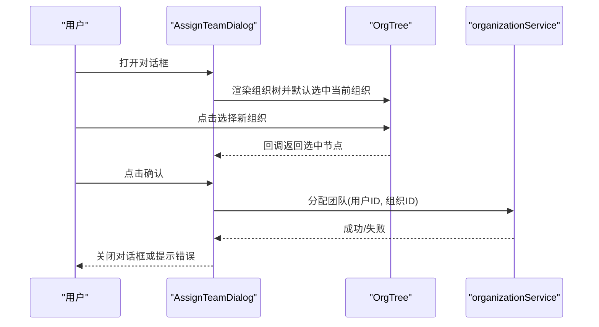

图表来源
- [app/src/components/organization/AssignTeamDialog.tsx:29-112](file://app/src/components/organization/AssignTeamDialog.tsx#L29-L112)
- [app/src/components/organization/OrgTree.tsx:116-164](file://app/src/components/organization/OrgTree.tsx#L116-L164)
- [app/src/services/organization/index.ts:57-63](file://app/src/services/organization/index.ts#L57-L63)

章节来源
- [app/src/components/organization/AssignTeamDialog.tsx:19-112](file://app/src/components/organization/AssignTeamDialog.tsx#L19-L112)
- [app/src/services/organization/index.ts:57-63](file://app/src/services/organization/index.ts#L57-L63)

### 组件：创建组织对话框 CreateOrgDialog
- 功能特性
  - 创建新组织或子组织，支持名称与显示名称校验与描述填写。
- 数据绑定
  - 输入属性：对话框开关、父组织、提交回调。
- 事件处理
  - 表单提交；清空表单并关闭。
- 用户体验
  - 必填项校验、禁用无效提交、加载状态提示。

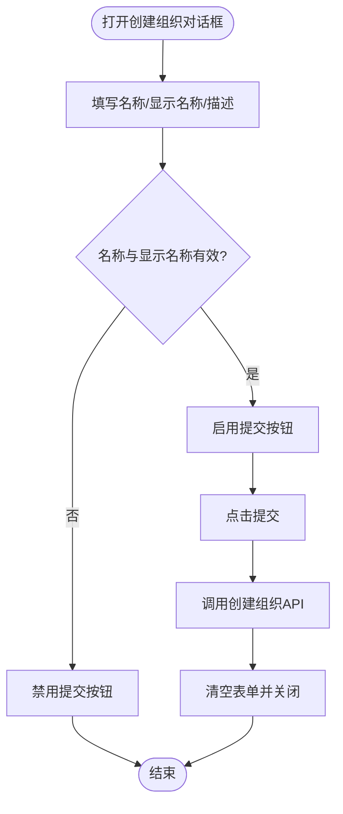

图表来源
- [app/src/components/organization/CreateOrgDialog.tsx:27-122](file://app/src/components/organization/CreateOrgDialog.tsx#L27-L122)
- [app/src/services/organization/index.ts:23-25](file://app/src/services/organization/index.ts#L23-L25)
- [app/src/services/organization/organizationMutations.ts:17-38](file://app/src/services/organization/organizationMutations.ts#L17-L38)

章节来源
- [app/src/components/organization/CreateOrgDialog.tsx:20-122](file://app/src/components/organization/CreateOrgDialog.tsx#L20-L122)
- [app/src/services/organization/organizationMutations.ts:17-38](file://app/src/services/organization/organizationMutations.ts#L17-L38)

### 组件：组织树选择器 OrgTreeSelector
- 功能特性
  - 下拉菜单式组织树选择器，支持层级缩进与选中标记。
- 数据绑定
  - 输入属性：当前值、变更回调、组织树、占位符。
- 事件处理
  - 选择节点后触发变更并关闭下拉。
- 用户体验
  - 无数据时显示提示；选中项高亮。

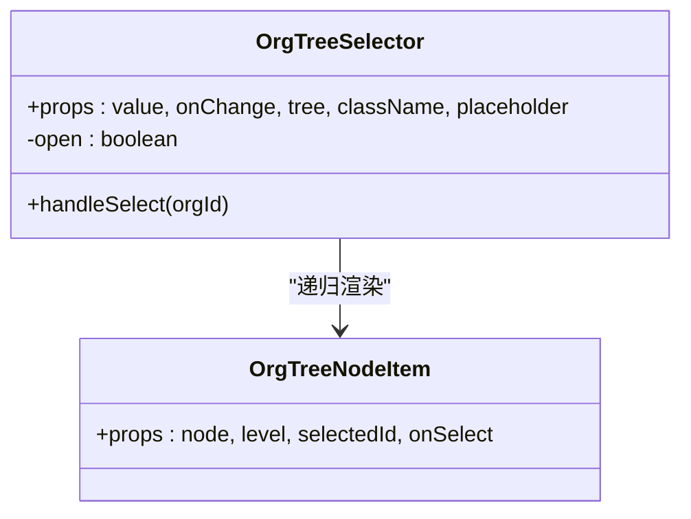

图表来源
- [app/src/components/organization/OrgTreeSelector.tsx:63-123](file://app/src/components/organization/OrgTreeSelector.tsx#L63-L123)
- [app/src/components/organization/OrgTreeSelector.tsx:31-61](file://app/src/components/organization/OrgTreeSelector.tsx#L31-L61)

章节来源
- [app/src/components/organization/OrgTreeSelector.tsx:16-123](file://app/src/components/organization/OrgTreeSelector.tsx#L16-L123)

### 组件：组织面包屑 OrganizationBreadcrumb
- 功能特性
  - 展示当前组织的层级路径，右侧显示用户角色徽章。
- 数据绑定
  - 输入属性：祖先组织数组、当前组织、用户角色、类名。
- 用户体验
  - 最末级加粗突出显示，角色徽章按级别着色。

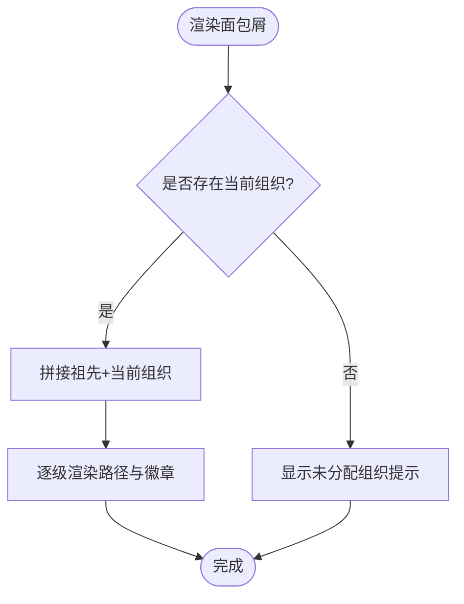

图表来源
- [app/src/components/organization/OrganizationBreadcrumb.tsx:38-78](file://app/src/components/organization/OrganizationBreadcrumb.tsx#L38-L78)

章节来源
- [app/src/components/organization/OrganizationBreadcrumb.tsx:9-78](file://app/src/components/organization/OrganizationBreadcrumb.tsx#L9-L78)

## 依赖分析
- 页面层依赖自定义 Hook 获取组织树、成员列表与用户组织信息。
- 组件层依赖类型定义与 UI 基础组件库。
- 服务层提供统一 API，内部拆分查询与变更两类职责，均具备缓存与并发去重机制。
- 组织树构建依赖查询层的树形组装逻辑。

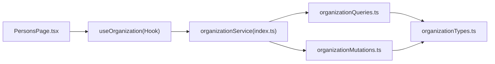

图表来源
- [app/src/pages/PersonsPage.tsx:22-38](file://app/src/pages/PersonsPage.tsx#L22-L38)
- [app/src/services/organization/index.ts:19-97](file://app/src/services/organization/index.ts#L19-L97)
- [app/src/services/organization/organizationQueries.ts:52-117](file://app/src/services/organization/organizationQueries.ts#L52-L117)
- [app/src/services/organization/organizationMutations.ts:16-207](file://app/src/services/organization/organizationMutations.ts#L16-L207)
- [app/src/lib/supabase/organizationTypes.ts:8-91](file://app/src/lib/supabase/organizationTypes.ts#L8-L91)

章节来源
- [app/src/pages/PersonsPage.tsx:17-214](file://app/src/pages/PersonsPage.tsx#L17-L214)
- [app/src/services/organization/index.ts:19-97](file://app/src/services/organization/index.ts#L19-L97)
- [app/src/services/organization/organizationQueries.ts:52-117](file://app/src/services/organization/organizationQueries.ts#L52-L117)
- [app/src/services/organization/organizationMutations.ts:16-207](file://app/src/services/organization/organizationMutations.ts#L16-L207)
- [app/src/lib/supabase/organizationTypes.ts:8-91](file://app/src/lib/supabase/organizationTypes.ts#L8-L91)

## 性能考量
- 查询缓存与去重
  - 查询层对组织详情、成员列表、用户组织信息、组织树等建立内存缓存与并发去重，降低重复请求与数据库压力。
- 组织树构建
  - 查询层一次性获取全量组织并构建树，避免多次往返；渲染层使用 Set 维护展开状态，减少重绘。
- 搜索防抖
  - 添加成员对话框对搜索输入进行防抖，降低网络请求频率。
- 并发更新
  - 变更操作后统一失效相关缓存键，保证后续读取一致性。

章节来源
- [app/src/services/organization/organizationQueries.ts:17-50](file://app/src/services/organization/organizationQueries.ts#L17-L50)
- [app/src/services/organization/organizationQueries.ts:52-117](file://app/src/services/organization/organizationQueries.ts#L52-L117)
- [app/src/services/organization/organizationMutations.ts:36-74](file://app/src/services/organization/organizationMutations.ts#L36-L74)
- [app/src/components/organization/AddMemberDialog.tsx:71-92](file://app/src/components/organization/AddMemberDialog.tsx#L71-L92)

## 故障排查指南
- 搜索无结果
  - 检查最小输入长度阈值与防抖时间；确认用户状态与网络连接。
- 添加成员失败
  - 确认目标用户未在当前组织；检查服务层异常日志与权限。
- 修改角色失败
  - 若目标为管理员，需通过数据库直接修改；检查服务层对管理员角色变更的拦截逻辑。
- 分配团队失败
  - 确认所选组织存在且服务层调用成功；检查缓存失效是否生效。
- 组织树空白
  - 检查查询层树构建逻辑与缓存状态；确认用户组织权限。

章节来源
- [app/src/components/organization/AddMemberDialog.tsx:71-92](file://app/src/components/organization/AddMemberDialog.tsx#L71-L92)
- [app/src/components/organization/ChangeRoleDialog.tsx:98-113](file://app/src/components/organization/ChangeRoleDialog.tsx#L98-L113)
- [app/src/services/organization/organizationMutations.ts:139-163](file://app/src/services/organization/organizationMutations.ts#L139-L163)
- [app/src/services/organization/organizationQueries.ts:303-331](file://app/src/services/organization/organizationQueries.ts#L303-L331)

## 结论
组织管理组件围绕“树形结构 + 成员列表”的核心视图，配合统一的服务层与严格的权限控制，实现了高效、可扩展的组织管理能力。通过缓存与去重机制优化性能，通过清晰的对话框与选择器提升用户体验。建议在实际集成中遵循权限约束与错误处理流程，确保数据一致性与安全性。

## 附录

### 在组织管理页面中的使用示例与集成指南
- 页面入口
  - 使用组织管理页面作为主入口，初始化组织树与用户组织信息。
- 组织树与成员列表
  - 左侧组织树选中后，右侧成员列表自动刷新；根据用户角色显示操作按钮。
- 对话框集成
  - 创建组织：打开创建对话框并提交输入。
  - 添加成员：打开添加成员对话框，选择用户与角色后提交。
  - 修改角色：打开修改角色对话框，管理员角色变更需走数据库流程。
  - 分配团队：打开分配团队对话框，基于组织树选择目标组织。
- 权限控制
  - 仅管理员可执行组织与成员变更；成员列表仅管理员可见并可操作他人。
- 实时更新
  - 变更操作后统一失效缓存，下次查询自动获取最新数据。

章节来源
- [app/src/pages/PersonsPage.tsx:17-214](file://app/src/pages/PersonsPage.tsx#L17-L214)
- [app/src/components/organization/CreateOrgDialog.tsx:27-54](file://app/src/components/organization/CreateOrgDialog.tsx#L27-L54)
- [app/src/components/organization/AddMemberDialog.tsx:94-108](file://app/src/components/organization/AddMemberDialog.tsx#L94-L108)
- [app/src/components/organization/ChangeRoleDialog.tsx:54-68](file://app/src/components/organization/ChangeRoleDialog.tsx#L54-L68)
- [app/src/components/organization/AssignTeamDialog.tsx:47-59](file://app/src/components/organization/AssignTeamDialog.tsx#L47-L59)