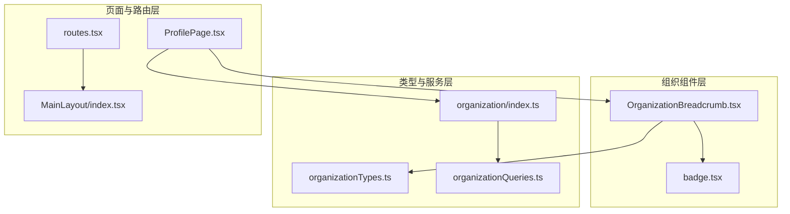
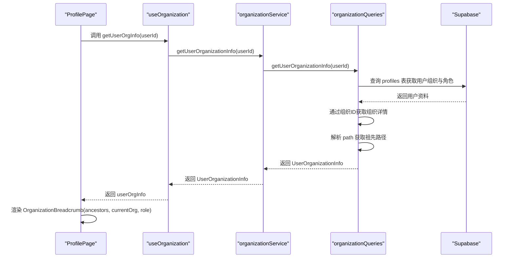
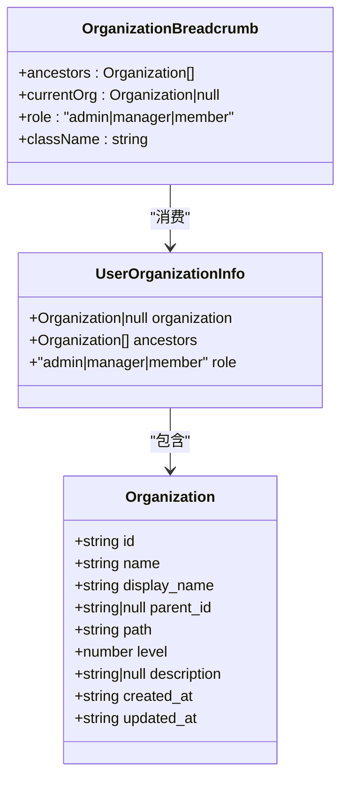
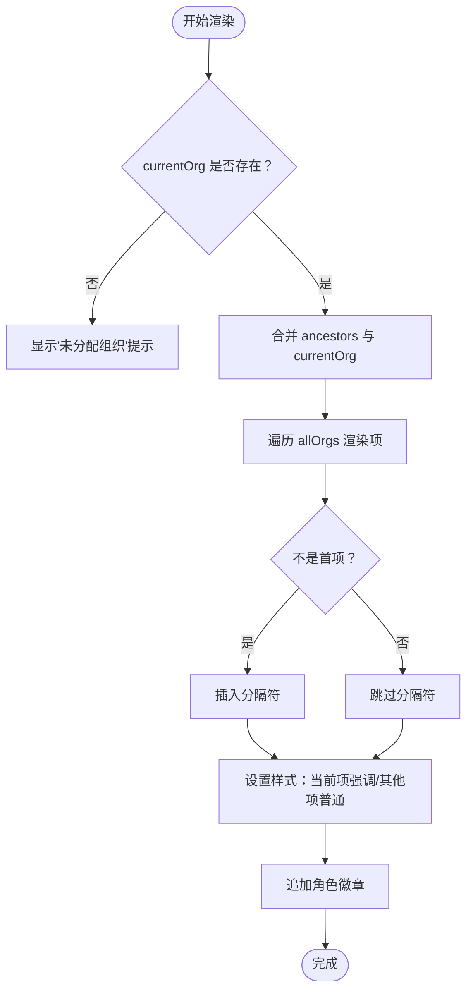
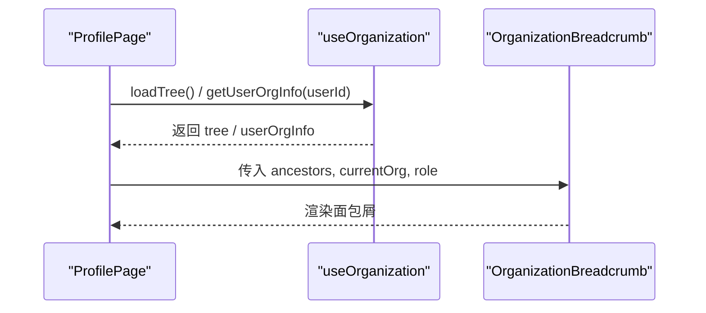
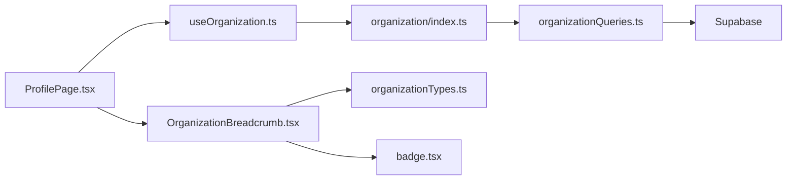

# 组织面包屑导航 (OrganizationBreadcrumb)

<cite>
**本文档引用的文件**
- [OrganizationBreadcrumb.tsx](file://app/src/components/organization/OrganizationBreadcrumb.tsx)
- [organizationTypes.ts](file://app/src/lib/supabase/organizationTypes.ts)
- [ProfilePage.tsx](file://app/src/pages/ProfilePage.tsx)
- [useOrganization.ts](file://app/src/hooks/useOrganization.ts)
- [organizationQueries.ts](file://app/src/services/organization/organizationQueries.ts)
- [organization/index.ts](file://app/src/services/organization/index.ts)
- [badge.tsx](file://app/src/components/ui/badge.tsx)
- [routes.tsx](file://app/src/config/routes.tsx)
- [MainLayout/index.tsx](file://app/src/components/layout/MainLayout/index.tsx)
- [ProfilePage.test.tsx](file://app/src/pages/__tests__/ProfilePage.test.tsx)
</cite>

## 目录
1. [简介](#简介)
2. [项目结构](#项目结构)
3. [核心组件](#核心组件)
4. [架构总览](#架构总览)
5. [详细组件分析](#详细组件分析)
6. [依赖关系分析](#依赖关系分析)
7. [性能考量](#性能考量)
8. [故障排查指南](#故障排查指南)
9. [结论](#结论)
10. [附录](#附录)

## 简介
OrganizationBreadcrumb 是一个用于展示当前用户所在组织层级路径的导航组件。它基于用户所属组织与其祖先节点构建层级路径，并在末尾显示用户的角色徽章。组件设计简洁，职责明确，主要负责：
- 展示组织层级路径（从根到当前组织）
- 标识当前位置（最末级组织使用强调样式）
- 显示用户角色徽章（根据角色映射不同样式）

该组件不包含路由跳转逻辑，仅作为只读展示组件使用。

## 项目结构
OrganizationBreadcrumb 位于组织业务组件目录下，配合组织类型定义、查询服务与页面使用示例共同构成完整的层级导航体系。

**图表来源**
- [OrganizationBreadcrumb.tsx:1-78](file://app/src/components/organization/OrganizationBreadcrumb.tsx#L1-L78)
- [organizationTypes.ts:1-91](file://app/src/lib/supabase/organizationTypes.ts#L1-L91)
- [organizationQueries.ts:1-333](file://app/src/services/organization/organizationQueries.ts#L1-L333)
- [organization/index.ts:1-97](file://app/src/services/organization/index.ts#L1-L97)
- [ProfilePage.tsx:1-182](file://app/src/pages/ProfilePage.tsx#L1-L182)
- [routes.tsx:1-78](file://app/src/config/routes.tsx#L1-L78)
- [MainLayout/index.tsx:1-141](file://app/src/components/layout/MainLayout/index.tsx#L1-L141)

**章节来源**
- [OrganizationBreadcrumb.tsx:1-78](file://app/src/components/organization/OrganizationBreadcrumb.tsx#L1-L78)
- [organizationTypes.ts:1-91](file://app/src/lib/supabase/organizationTypes.ts#L1-L91)
- [ProfilePage.tsx:1-182](file://app/src/pages/ProfilePage.tsx#L1-L182)

## 核心组件
- 组件名称：OrganizationBreadcrumb
- 输入属性：
  - ancestors：祖先组织数组（从根到父级）
  - currentOrg：当前组织对象或空
  - role：用户角色（admin | manager | member）
  - className：可选自定义样式类名
- 输出行为：
  - 当 currentOrg 为空时，显示“未分配组织”的提示文本
  - 否则按祖先 → 当前组织顺序渲染路径，末级组织使用强调样式
  - 在路径末尾附加角色徽章，颜色随角色变化

**章节来源**
- [OrganizationBreadcrumb.tsx:8-43](file://app/src/components/organization/OrganizationBreadcrumb.tsx#L8-L43)
- [OrganizationBreadcrumb.tsx:44-77](file://app/src/components/organization/OrganizationBreadcrumb.tsx#L44-L77)

## 架构总览
OrganizationBreadcrumb 的数据流来源于页面层的 useOrganization 钩子，后者通过 organizationService 调用 organizationQueries 获取用户组织信息与祖先节点。最终在 ProfilePage 中消费这些数据并传入 OrganizationBreadcrumb。

**图表来源**
- [ProfilePage.tsx:24-31](file://app/src/pages/ProfilePage.tsx#L24-L31)
- [useOrganization.ts:212-225](file://app/src/hooks/useOrganization.ts#L212-L225)
- [organization/index.ts:48-50](file://app/src/services/organization/index.ts#L48-L50)
- [organizationQueries.ts:157-204](file://app/src/services/organization/organizationQueries.ts#L157-L204)

## 详细组件分析

### 数据模型与类型
- 组织接口 Organization：包含 id、name、display_name、parent_id、path、level 等字段，用于表示树形结构与层级路径
- 用户组织信息 UserOrganizationInfo：包含当前组织、祖先数组与用户角色
- 角色枚举：admin、manager、member，分别映射到不同的徽章样式

**图表来源**
- [organizationTypes.ts:8-18](file://app/src/lib/supabase/organizationTypes.ts#L8-L18)
- [organizationTypes.ts:86-90](file://app/src/lib/supabase/organizationTypes.ts#L86-L90)
- [OrganizationBreadcrumb.tsx:9-14](file://app/src/components/organization/OrganizationBreadcrumb.tsx#L9-L14)

**章节来源**
- [organizationTypes.ts:8-18](file://app/src/lib/supabase/organizationTypes.ts#L8-L18)
- [organizationTypes.ts:86-90](file://app/src/lib/supabase/organizationTypes.ts#L86-L90)

### 路径解析与渲染逻辑
- 路径拼接：将 ancestors 与 currentOrg 合并为 allOrgs
- 分隔符：除首个元素外，每个元素前添加向右箭头分隔符
- 当前位置标识：最末级组织使用强调样式，其余使用普通文本样式
- 角色徽章：根据角色映射不同徽章样式，并显示对应中文标签

**图表来源**
- [OrganizationBreadcrumb.tsx:52-74](file://app/src/components/organization/OrganizationBreadcrumb.tsx#L52-L74)

**章节来源**
- [OrganizationBreadcrumb.tsx:52-74](file://app/src/components/organization/OrganizationBreadcrumb.tsx#L52-L74)

### 页面集成与使用示例
- ProfilePage 中通过 useOrganization 获取 userOrgInfo，并将其 ancestors、organization、role 传递给 OrganizationBreadcrumb
- 当组织树或用户信息加载中时，显示加载状态；加载失败时显示错误状态与重试按钮
- 管理员可以看到“修改团队”按钮，非管理员不可见

**图表来源**
- [ProfilePage.tsx:127-133](file://app/src/pages/ProfilePage.tsx#L127-L133)
- [useOrganization.ts:66-363](file://app/src/hooks/useOrganization.ts#L66-L363)

**章节来源**
- [ProfilePage.tsx:127-133](file://app/src/pages/ProfilePage.tsx#L127-L133)
- [ProfilePage.tsx:177-192](file://app/src/pages/ProfilePage.tsx#L177-L192)

### 路由与布局集成
- 应用路由配置中，ProfilePage 作为受保护路由的一部分，通过 MainLayout 包裹
- MainLayout 负责侧边栏、头部与内容区域的布局，确保 OrganizationBreadcrumb 在页面主体区域内正确渲染

**章节来源**
- [routes.tsx:24-65](file://app/src/config/routes.tsx#L24-L65)
- [MainLayout/index.tsx:108-140](file://app/src/components/layout/MainLayout/index.tsx#L108-L140)

### 测试验证
- 单元测试中对 OrganizationBreadcrumb 的渲染进行了断言，验证在不同用户角色与组织状态下的显示效果
- 测试覆盖了加载中、加载失败、管理员可见按钮等场景

**章节来源**
- [ProfilePage.test.tsx:134-145](file://app/src/pages/__tests__/ProfilePage.test.tsx#L134-L145)
- [ProfilePage.test.tsx:155-169](file://app/src/pages/__tests__/ProfilePage.test.tsx#L155-L169)

## 依赖关系分析
- 组件依赖：
  - 组织类型定义：确保输入数据结构一致
  - 徽章组件：用于展示角色状态
- 页面依赖：
  - useOrganization 钩子：提供组织树与用户组织信息
  - organizationService：统一的服务门面
  - organizationQueries：具体查询实现（含缓存与并发去重）
- 数据流向：
  - 页面 → 钩子 → 服务 → 查询 → 数据库
  - 查询结果 → 页面 → 组件

**图表来源**
- [ProfilePage.tsx:24-31](file://app/src/pages/ProfilePage.tsx#L24-L31)
- [useOrganization.ts:66-363](file://app/src/hooks/useOrganization.ts#L66-L363)
- [organization/index.ts:19-96](file://app/src/services/organization/index.ts#L19-L96)
- [organizationQueries.ts:17-332](file://app/src/services/organization/organizationQueries.ts#L17-L332)
- [OrganizationBreadcrumb.tsx:5-7](file://app/src/components/organization/OrganizationBreadcrumb.tsx#L5-L7)

**章节来源**
- [organizationQueries.ts:157-204](file://app/src/services/organization/organizationQueries.ts#L157-L204)

## 性能考量
- 缓存策略：
  - 组织树与用户组织信息均采用内存缓存，减少重复请求
  - 组织树缓存键区分完整树与指定根节点树，避免缓存污染
- 并发控制：
  - 使用 Promise Map 避免同一 ID 的重复请求
- 渲染优化：
  - 组件内部仅进行简单数组拼接与循环渲染，复杂度为 O(n)，n 为祖先数量
  - 通过 className 与内联样式控制视觉差异，避免额外计算

**章节来源**
- [organizationQueries.ts:52-117](file://app/src/services/organization/organizationQueries.ts#L52-L117)
- [organizationQueries.ts:17-22](file://app/src/services/organization/organizationQueries.ts#L17-L22)
- [OrganizationBreadcrumb.tsx:52-74](file://app/src/components/organization/OrganizationBreadcrumb.tsx#L52-L74)

## 故障排查指南
- 问题：未显示任何组织信息
  - 检查 useOrganization 中 getUserOrgInfo 是否成功返回 userOrgInfo
  - 确认 currentOrg 是否为 null 或空对象
- 问题：角色徽章样式异常
  - 检查 role 参数是否为 admin、manager 或 member
  - 确认徽章组件的 variant 映射是否正确
- 问题：路径渲染错乱
  - 检查 ancestors 数组是否按层级顺序排列
  - 确认所有组织对象包含 display_name 字段
- 问题：加载状态未正确显示
  - 检查页面中的 orgLoading 状态与条件渲染逻辑

**章节来源**
- [ProfilePage.tsx:122-133](file://app/src/pages/ProfilePage.tsx#L122-L133)
- [organizationQueries.ts:157-204](file://app/src/services/organization/organizationQueries.ts#L157-L204)

## 结论
OrganizationBreadcrumb 通过清晰的数据模型与简洁的渲染逻辑，实现了组织层级路径的可视化展示。其与 useOrganization、organizationService、organizationQueries 的协作体现了“页面消费数据、钩子管理状态、服务封装调用、查询处理数据”的分层架构优势。组件本身不包含路由跳转逻辑，适合在多种页面中复用，便于扩展与维护。

## 附录

### 使用示例清单
- 在页面中引入 OrganizationBreadcrumb
- 通过 useOrganization 获取 userOrgInfo
- 将 ancestors、organization、role 传入组件
- 在加载中与错误状态下提供相应 UI

**章节来源**
- [ProfilePage.tsx:127-133](file://app/src/pages/ProfilePage.tsx#L127-L133)

### 样式定制建议
- 通过 className 自定义容器样式
- 通过 Badge 组件的 variant 控制角色徽章样式
- 使用 Tailwind 类名微调间距与字体大小

**章节来源**
- [OrganizationBreadcrumb.tsx:42-43](file://app/src/components/organization/OrganizationBreadcrumb.tsx#L42-L43)
- [badge.tsx:9-26](file://app/src/components/ui/badge.tsx#L9-L26)