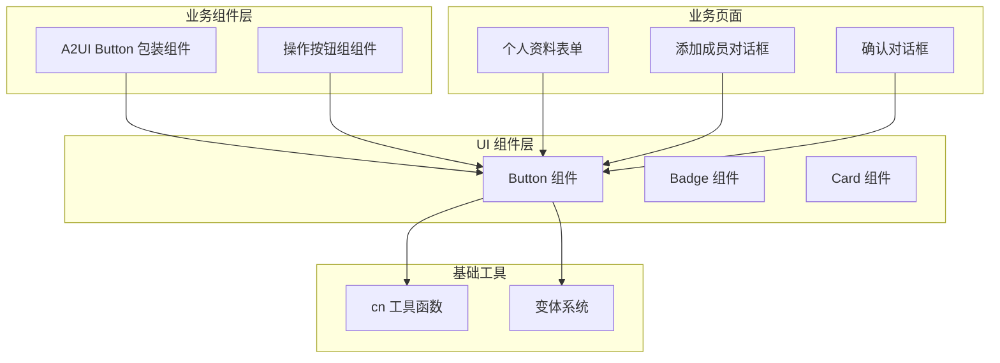
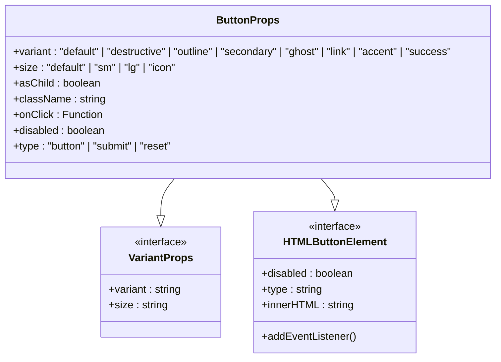
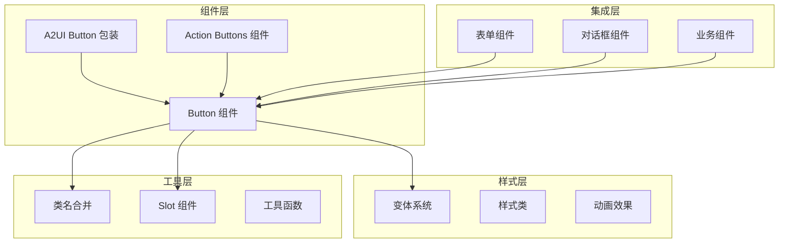
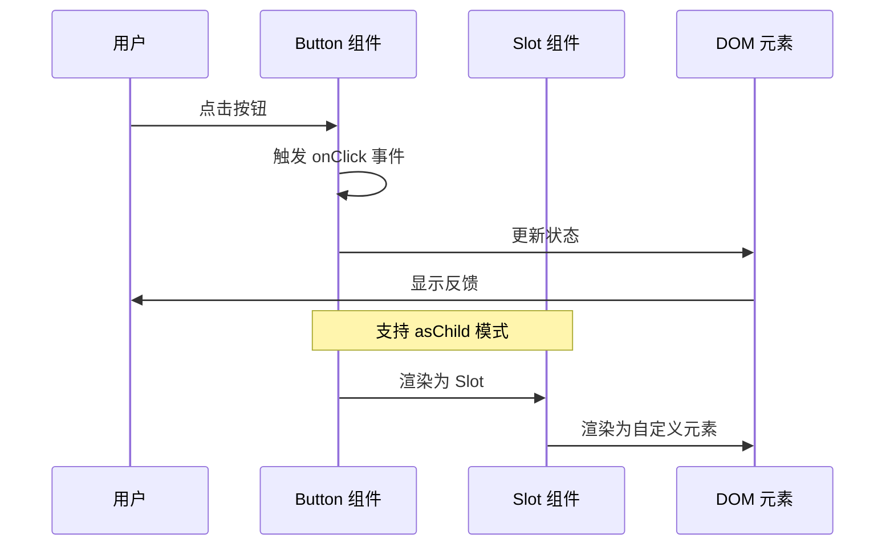
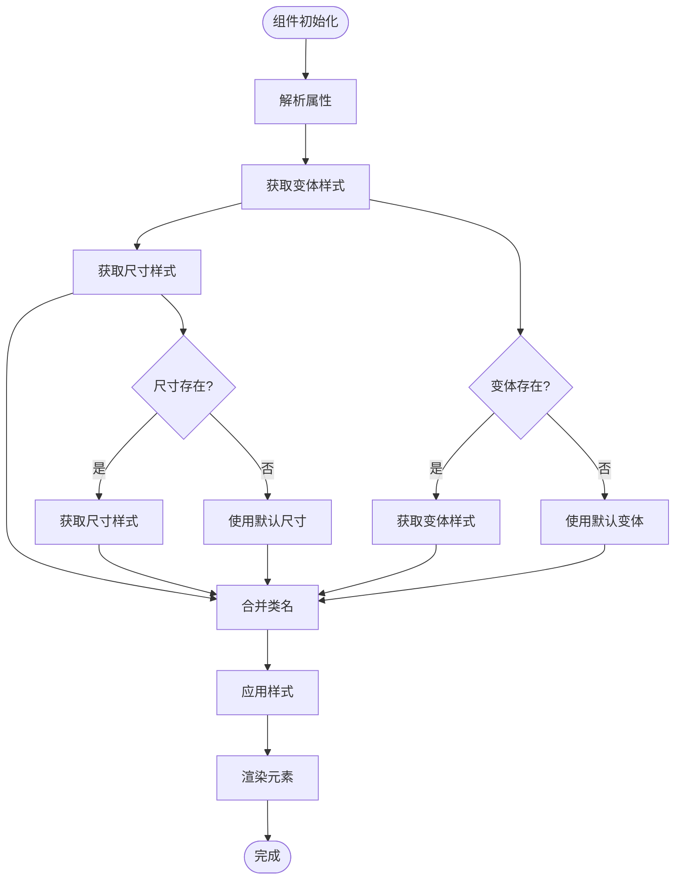
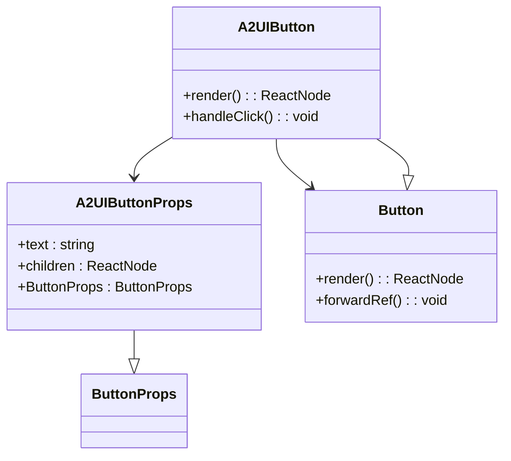
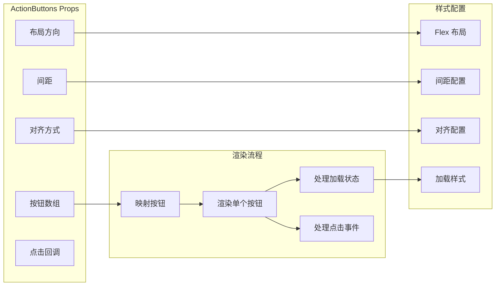
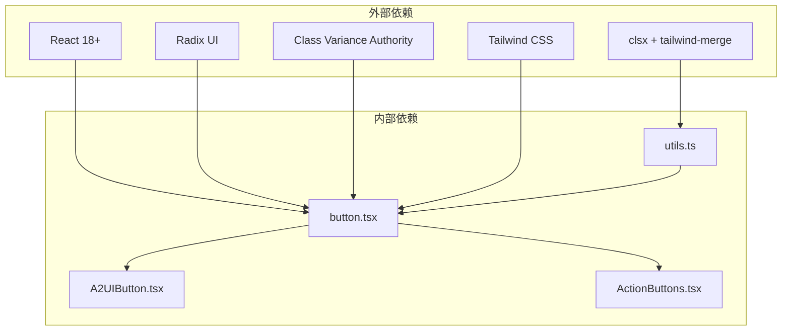

# Button 按钮组件

<cite>
**本文档引用的文件**
- [button.tsx](file://app/src/components/ui/button.tsx)
- [utils.ts](file://app/src/lib/utils.ts)
- [A2UIButton.tsx](file://app/src/components/agent/a2ui/components/A2UIButton.tsx)
- [ActionButtons.tsx](file://app/src/components/agent/a2ui/components/ActionButtons.tsx)
- [ProfileForm.tsx](file://app/src/components/business/ProfileForm.tsx)
- [AddMemberDialog.tsx](file://app/src/components/organization/AddMemberDialog.tsx)
- [confirm-dialog.tsx](file://app/src/components/ui/confirm-dialog.tsx)
- [tailwind.config.js](file://app/tailwind.config.js)
</cite>

## 目录
1. [简介](#简介)
2. [项目结构](#项目结构)
3. [核心组件](#核心组件)
4. [架构概览](#架构概览)
5. [详细组件分析](#详细组件分析)
6. [依赖关系分析](#依赖关系分析)
7. [性能考虑](#性能考虑)
8. [故障排除指南](#故障排除指南)
9. [结论](#结论)
10. [附录](#附录)

## 简介

Button 按钮组件是本项目 UI 组件库中的核心交互元素，基于 Radix UI 和 Tailwind CSS 构建，提供了丰富的变体和尺寸配置。该组件支持多种视觉风格（default、destructive、outline、secondary、ghost、link、accent、success）和四种尺寸规格（default、sm、lg、icon），能够满足从主要操作到次要功能的各种场景需求。

组件采用现代化的设计理念，集成了无障碍访问支持、键盘导航、屏幕阅读器兼容性，并提供了灵活的样式定制选项。通过 class-variance-authority 库实现变体系统的类型安全，确保开发体验和运行时性能的平衡。

## 项目结构

Button 组件在项目中的组织结构如下：

**图表来源**
- [button.tsx:1-63](file://app/src/components/ui/button.tsx#L1-L63)
- [A2UIButton.tsx:1-26](file://app/src/components/agent/a2ui/components/A2UIButton.tsx#L1-L26)
- [ActionButtons.tsx:1-105](file://app/src/components/agent/a2ui/components/ActionButtons.tsx#L1-L105)

**章节来源**
- [button.tsx:1-63](file://app/src/components/ui/button.tsx#L1-L63)
- [utils.ts:1-10](file://app/src/lib/utils.ts#L1-L10)

## 核心组件

### ButtonProps 接口定义

Button 组件的核心接口继承自原生 HTMLButtonElement 属性，扩展了变体和尺寸系统：

**图表来源**
- [button.tsx:48-51](file://app/src/components/ui/button.tsx#L48-L51)

### 变体系统详解

组件支持八种不同的视觉变体，每种变体都有其特定的语义和使用场景：

| 变体名称 | 颜色方案 | 使用场景 | 默认样式 |
|---------|----------|----------|----------|
| default | 主色调（深森林绿） | 主要操作按钮 | `bg-primary text-primary-foreground hover:bg-primary/90 shadow-sm` |
| destructive | 危险/错误状态 | 删除、取消等危险操作 | `bg-destructive text-destructive-foreground hover:bg-destructive/90 shadow-sm` |
| outline | 边框样式 | 次要操作，需要区分层级 | `border border-input bg-background hover:bg-secondary hover:text-secondary-foreground` |
| secondary | 次要强调 | 辅助功能按钮 | `bg-secondary text-secondary-foreground hover:bg-secondary/80` |
| ghost | 透明背景 | 工具栏、内联操作 | `hover:bg-secondary hover:text-secondary-foreground` |
| link | 链接样式 | 导航链接、操作提示 | `text-primary underline-offset-4 hover:underline` |
| accent | 强调色彩（琥珀橙） | 特殊强调操作 | `bg-accent text-accent-foreground hover:bg-accent/90 shadow-sm` |
| success | 成功状态 | 确认、完成操作 | `bg-[hsl(var(--success))] text-[hsl(var(--success-foreground))] hover:bg-[hsl(var(--success))]/90` |

### 尺寸系统配置

组件提供四种尺寸规格，适应不同布局需求：

| 尺寸名称 | 高度 | 内边距 | 字体大小 | 图标尺寸 |
|---------|------|--------|----------|----------|
| default | 40px | 4px 8px | 14px | 16px |
| sm | 36px | 3px 6px | 14px | 16px |
| lg | 44px | 8px 16px | 14px | 16px |
| icon | 40px | 无 | 14px | 16px |

**章节来源**
- [button.tsx:10-46](file://app/src/components/ui/button.tsx#L10-L46)
- [button.tsx:48-51](file://app/src/components/ui/button.tsx#L48-L51)

## 架构概览

Button 组件采用分层架构设计，确保代码的可维护性和扩展性：

**图表来源**
- [button.tsx:53-61](file://app/src/components/ui/button.tsx#L53-L61)
- [A2UIButton.tsx:8-23](file://app/src/components/agent/a2ui/components/A2UIButton.tsx#L8-L23)
- [ActionButtons.tsx:48-105](file://app/src/components/agent/a2ui/components/ActionButtons.tsx#L48-L105)

## 详细组件分析

### Button 组件实现

Button 组件的核心实现采用了现代 React 最佳实践：

**图表来源**
- [button.tsx:53-61](file://app/src/components/ui/button.tsx#L53-L61)

### 样式系统架构

组件的样式系统基于 Tailwind CSS 和 class-variance-authority：

**图表来源**
- [button.tsx:10-46](file://app/src/components/ui/button.tsx#L10-L46)
- [utils.ts:7-9](file://app/src/lib/utils.ts#L7-L9)

### A2UI Button 包装组件

A2UIButton 作为 Button 的包装组件，提供了额外的功能：

**图表来源**
- [A2UIButton.tsx:10-23](file://app/src/components/agent/a2ui/components/A2UIButton.tsx#L10-L23)

**章节来源**
- [button.tsx:53-61](file://app/src/components/ui/button.tsx#L53-L61)
- [A2UIButton.tsx:10-23](file://app/src/components/agent/a2ui/components/A2UIButton.tsx#L10-L23)

### Action Buttons 组件

ActionButtons 组件展示了按钮组合使用的最佳实践：

**图表来源**
- [ActionButtons.tsx:20-105](file://app/src/components/agent/a2ui/components/ActionButtons.tsx#L20-L105)

**章节来源**
- [ActionButtons.tsx:20-105](file://app/src/components/agent/a2ui/components/ActionButtons.tsx#L20-L105)

## 依赖关系分析

### 外部依赖关系

Button 组件的依赖关系清晰明确：

**图表来源**
- [button.tsx:5-8](file://app/src/components/ui/button.tsx#L5-L8)
- [utils.ts:4-9](file://app/src/lib/utils.ts#L4-L9)

### 内部组件依赖

组件间的依赖关系形成了清晰的层次结构：

| 组件 | 依赖组件 | 用途 |
|------|----------|------|
| Button | utils.ts, Radix UI Slot | 核心按钮组件 |
| A2UIButton | Button | AI 功能按钮包装 |
| ActionButtons | Button | 按钮组管理 |
| ProfileForm | Button | 表单操作按钮 |
| AddMemberDialog | Button | 对话框操作按钮 |
| ConfirmDialog | Button | 确认对话框按钮 |

**章节来源**
- [button.tsx:5-8](file://app/src/components/ui/button.tsx#L5-L8)
- [utils.ts:4-9](file://app/src/lib/utils.ts#L4-L9)

## 性能考虑

### 样式优化策略

Button 组件在性能方面采用了多项优化措施：

1. **类名合并优化**: 使用 `clsx` 和 `tailwind-merge` 避免重复类名
2. **变体缓存**: class-variance-authority 自动缓存变体样式
3. **条件渲染**: `asChild` 属性支持 Slot 组件，减少不必要的 DOM 元素
4. **懒加载**: 样式按需加载，避免全局样式污染

### 渲染性能

组件的渲染性能特点：

- **最小重渲染**: 仅在属性变化时重新计算样式
- **内存效率**: 使用 forwardRef 减少中间组件开销
- **事件处理**: 事件处理器在组件外部定义，避免闭包创建

## 故障排除指南

### 常见问题及解决方案

| 问题类型 | 症状 | 解决方案 |
|----------|------|----------|
| 样式不生效 | 按钮样式异常 | 检查 Tailwind 配置和类名拼写 |
| 变体冲突 | 多个变体同时应用 | 确保只设置一个 variant 属性 |
| 尺寸异常 | 按钮尺寸不符合预期 | 验证 size 属性值和容器约束 |
| 无障碍问题 | 屏幕阅读器无法识别 | 添加适当的 aria-* 属性 |

### 调试技巧

1. **开发者工具**: 使用浏览器开发者工具检查最终应用的样式
2. **控制台日志**: 在 onClick 回调中添加日志输出
3. **样式检查**: 确认 Tailwind CSS 已正确编译
4. **组件检查**: 验证组件属性传递是否正确

**章节来源**
- [button.tsx:10-46](file://app/src/components/ui/button.tsx#L10-L46)

## 结论

Button 按钮组件是一个设计精良、功能完备的 UI 组件，具有以下优势：

1. **高度可定制**: 支持八种变体和四种尺寸，满足各种设计需求
2. **类型安全**: 基于 TypeScript 和 class-variance-authority 提供完整类型支持
3. **无障碍友好**: 内置键盘导航和屏幕阅读器支持
4. **性能优秀**: 优化的渲染策略和样式系统
5. **易于使用**: 简洁的 API 设计和丰富的使用示例

该组件为整个项目的用户界面提供了统一、一致的交互体验，是构建现代化 Web 应用的理想选择。

## 附录

### 使用示例索引

以下文件展示了 Button 组件在实际项目中的使用模式：

- **表单操作**: [ProfileForm.tsx:218-244](file://app/src/components/business/ProfileForm.tsx#L218-L244)
- **对话框按钮**: [AddMemberDialog.tsx:211-229](file://app/src/components/organization/AddMemberDialog.tsx#L211-L229)
- **确认对话框**: [confirm-dialog.tsx:56-67](file://app/src/components/ui/confirm-dialog.tsx#L56-L67)
- **按钮组**: [ActionButtons.tsx:67-102](file://app/src/components/agent/a2ui/components/ActionButtons.tsx#L67-L102)

### 最佳实践建议

1. **语义化使用**: 根据操作的重要性和危险性选择合适的变体
2. **一致性**: 在同一页面中保持按钮样式的统一性
3. **无障碍**: 为所有按钮提供适当的标题和描述信息
4. **响应式**: 确保按钮在不同设备上的可访问性
5. **性能**: 避免在同一页面中过度使用复杂的按钮变体