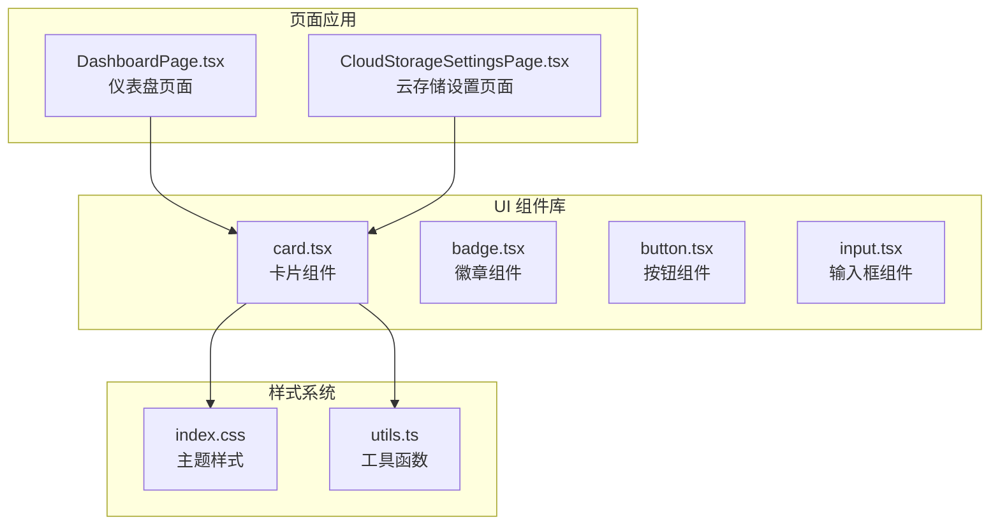
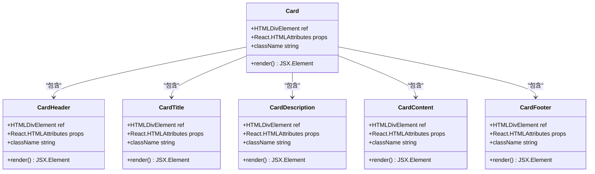
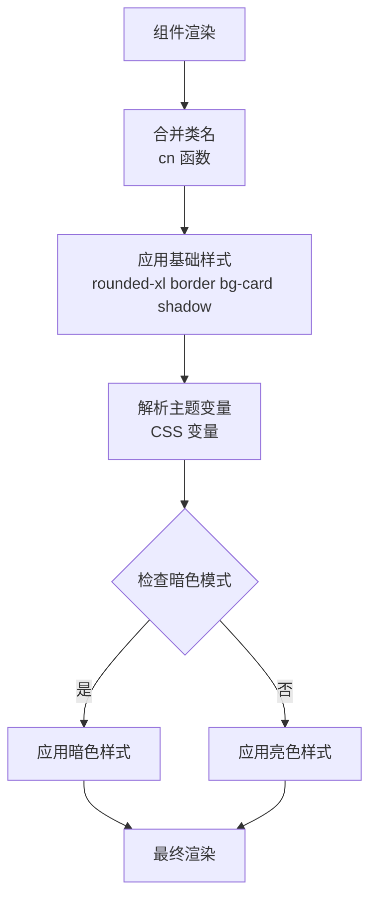
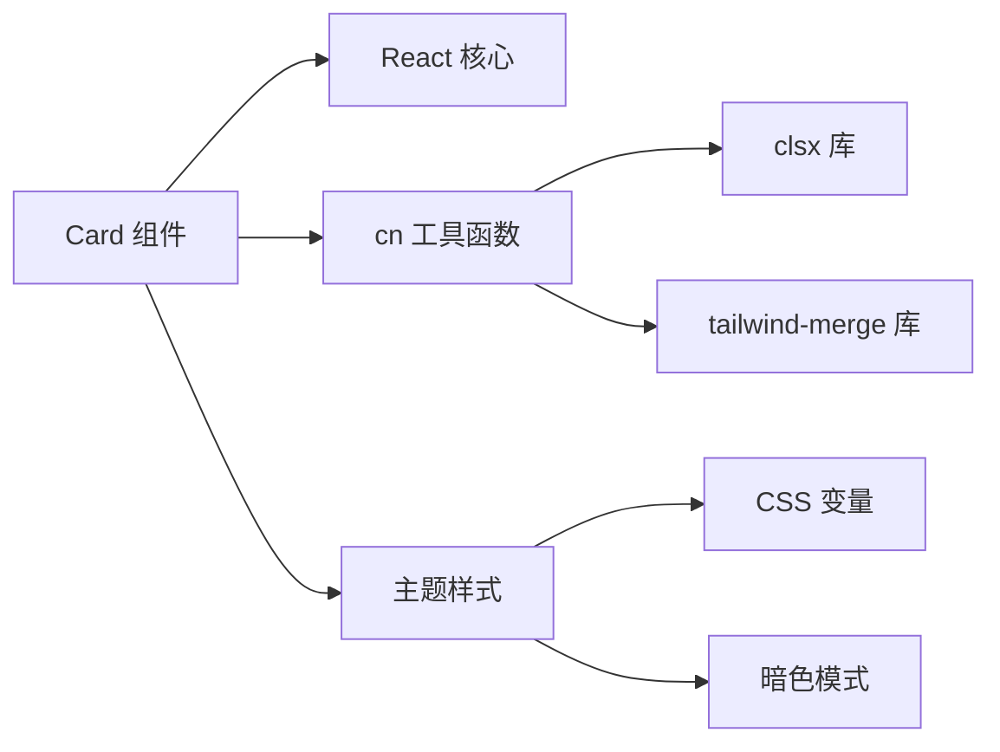

# Card 卡片组件

<cite>
**本文档引用的文件**
- [card.tsx](file://app/src/components/ui/card.tsx)
- [index.css](file://app/src/index.css)
- [utils.ts](file://app/src/lib/utils.ts)
- [DashboardPage.tsx](file://app/src/pages/DashboardPage.tsx)
- [CloudStorageSettingsPage.tsx](file://app/src/pages/CloudStorageSettingsPage.tsx)
</cite>

## 目录
1. [简介](#简介)
2. [项目结构](#项目结构)
3. [核心组件](#核心组件)
4. [架构概览](#架构概览)
5. [详细组件分析](#详细组件分析)
6. [依赖关系分析](#依赖关系分析)
7. [性能考虑](#性能考虑)
8. [故障排除指南](#故障排除指南)
9. [结论](#结论)
10. [附录](#附录)

## 简介

Card 卡片组件是 OPC-Starter 项目中的核心 UI 组件之一，采用现代化的设计系统构建。该组件提供了完整的卡片容器解决方案，包含标题、描述、内容区域和页脚等子组件，支持灵活的布局组合和丰富的样式变体。

Card 组件基于 Tailwind CSS v4 构建，充分利用了 CSS 变量系统实现主题化设计，支持明暗模式切换，并提供了完整的响应式设计支持。组件采用函数式编程模式，通过 React.forwardRef 实现对 DOM 元素的直接访问。

## 项目结构

Card 组件位于前端项目的 UI 组件库中，遵循模块化的文件组织结构：



**图表来源**
- [card.tsx:1-59](file://app/src/components/ui/card.tsx#L1-L59)
- [index.css:1-218](file://app/src/index.css#L1-L218)
- [utils.ts:1-10](file://app/src/lib/utils.ts#L1-L10)

**章节来源**
- [card.tsx:1-59](file://app/src/components/ui/card.tsx#L1-L59)
- [index.css:1-218](file://app/src/index.css#L1-L218)

## 核心组件

Card 组件系统由一个主容器组件和五个子组件构成，每个组件都经过精心设计以确保一致的用户体验和开发体验。

### 主容器组件 - Card

Card 是整个卡片系统的核心容器，负责提供基础的视觉外观和布局框架。其设计特点包括：

- **圆角设计**: 使用 `rounded-xl` 实现 12px 的圆角半径
- **边框系统**: 采用 `border` 属性实现 1px 的边框
- **阴影效果**: 应用 `shadow` 类实现 16px 的投影效果
- **背景系统**: 使用 `bg-card` 和 `text-card-foreground` 实现主题化背景和文字颜色

### 子组件体系

组件系统包含以下五个专门的子组件，每个都有特定的功能和用途：

1. **CardHeader**: 卡片头部区域，用于放置标题和描述
2. **CardTitle**: 卡片标题文本，具有特定的字体权重和间距
3. **CardDescription**: 卡片描述文本，使用较小的字体和柔和的颜色
4. **CardContent**: 卡片主要内容区域，提供内边距和布局控制
5. **CardFooter**: 卡片底部区域，常用于放置操作按钮

**章节来源**
- [card.tsx:8-58](file://app/src/components/ui/card.tsx#L8-L58)

## 架构概览

Card 组件的架构设计体现了现代前端开发的最佳实践，采用分层结构和清晰的职责分离：



**图表来源**
- [card.tsx:8-58](file://app/src/components/ui/card.tsx#L8-L58)

### 样式架构

Card 组件的样式系统基于 Tailwind CSS v4 的原子化设计原则，通过 CSS 变量实现主题化：



**图表来源**
- [card.tsx:6](file://app/src/components/ui/card.tsx#L6)
- [index.css:21-58](file://app/src/index.css#L21-L58)

**章节来源**
- [card.tsx:6-16](file://app/src/components/ui/card.tsx#L6-L16)
- [index.css:64-174](file://app/src/index.css#L64-L174)

## 详细组件分析

### CardHeader 组件

CardHeader 专门用于卡片的头部区域，提供垂直布局和适当的间距控制：

- **布局特性**: 使用 `flex flex-col` 实现垂直堆叠布局
- **间距控制**: `space-y-1.5` 提供 6px 的子元素间距
- **内边距**: `p-6` 设置 24px 的整体内边距
- **语义化**: 作为卡片标题和描述的主要容器

### CardTitle 组件

CardTitle 专注于卡片标题的展示，具有独特的视觉特征：

- **字体权重**: `font-semibold` 实现 600 的字体粗细
- **行高控制**: `leading-none` 移除默认行高，实现紧凑布局
- **字距调整**: `tracking-tight` 微调字符间距
- **可访问性**: 适合作为页面标题或重要信息的标识

### CardDescription 组件

CardDescription 提供卡片描述文本的样式支持：

- **字体大小**: `text-sm` 使用 14px 的字体大小
- **颜色系统**: `text-muted-foreground` 使用柔和的前景色
- **布局兼容**: 与其他文本元素保持一致的视觉层次

### CardContent 组件

CardContent 是卡片的主要内容区域，提供最大的灵活性：

- **内边距控制**: `p-6 pt-0` 设置 24px 的左右内边距，顶部无额外间距
- **布局适应**: 支持各种内容类型的灵活布局
- **间距优化**: 与 CardHeader 和 CardFooter 形成良好的视觉平衡

### CardFooter 组件

CardFooter 专门用于卡片底部的操作区域：

- **水平对齐**: `flex items-center` 实现垂直居中对齐
- **间距控制**: `p-6 pt-0` 与内容区域保持一致的间距策略
- **操作友好**: 适合放置按钮、链接等交互元素

**章节来源**
- [card.tsx:19-56](file://app/src/components/ui/card.tsx#L19-L56)

### 组件组合模式

Card 组件支持多种组合模式，以适应不同的使用场景：

```mermaid
sequenceDiagram
participant App as 应用程序
participant Card as Card 容器
participant Header as CardHeader
participant Title as CardTitle
participant Desc as CardDescription
participant Content as CardContent
participant Footer as CardFooter
App->>Card : 创建卡片容器
Card->>Header : 添加头部区域
Header->>Title : 放置标题
Header->>Desc : 添加描述
Card->>Content : 添加主要内容
Card->>Footer : 添加底部操作
Footer->>App : 渲染完整卡片
```

**图表来源**
- [card.tsx:8-58](file://app/src/components/ui/card.tsx#L8-L58)

## 依赖关系分析

Card 组件的依赖关系简洁而高效，体现了最小依赖原则：



**图表来源**
- [card.tsx:4-6](file://app/src/components/ui/card.tsx#L4-L6)
- [utils.ts:4-9](file://app/src/lib/utils.ts#L4-L9)
- [index.css:64-174](file://app/src/index.css#L64-L174)

### 样式依赖链

Card 组件的样式系统依赖于完整的 Tailwind CSS v4 生态系统：

- **基础样式**: 通过 `bg-card`、`text-card-foreground` 等类名实现主题化
- **响应式设计**: 利用 Tailwind 的响应式前缀实现多设备适配
- **变体系统**: 支持 hover、focus、active 等交互状态
- **自定义属性**: 通过 CSS 变量实现动态主题切换

**章节来源**
- [card.tsx:6](file://app/src/components/ui/card.tsx#L6)
- [utils.ts:7-9](file://app/src/lib/utils.ts#L7-L9)

## 性能考虑

Card 组件在设计时充分考虑了性能优化，采用了多项最佳实践：

### 渲染性能

- **轻量级实现**: 每个组件都是简单的函数组件，避免不必要的状态管理
- **最小化重渲染**: 使用 React.forwardRef 避免额外的包装组件
- **类名合并优化**: 通过 cn 函数高效合并多个类名

### 样式性能

- **原子化设计**: Tailwind 原子类减少 CSS 规则数量
- **CSS 变量缓存**: 浏览器原生支持 CSS 变量的高性能计算
- **无运行时样式**: 样式在构建时确定，运行时无需计算

### 内存效率

- **无状态组件**: 组件不维护内部状态，减少内存占用
- **函数式编程**: 避免类组件的实例化开销
- **简洁的依赖树**: 最小的外部依赖减少包体积

## 故障排除指南

### 常见问题及解决方案

#### 样式不生效

**问题**: Card 组件样式显示异常或不正确

**原因分析**:
1. Tailwind CSS 配置问题
2. CSS 变量未正确加载
3. 类名拼写错误

**解决步骤**:
1. 检查 `index.css` 中的主题变量定义
2. 确认 Tailwind 配置文件正确引入
3. 验证类名拼写和语法

#### 主题切换异常

**问题**: 明暗模式切换时样式不正确

**排查方法**:
1. 检查 `.dark` 类是否正确应用
2. 验证 CSS 变量值是否正确
3. 确认 `@variant dark` 规则正常工作

#### 响应式布局问题

**问题**: 在不同屏幕尺寸下布局异常

**解决方案**:
1. 检查响应式断点设置
2. 验证容器宽度类名使用
3. 确认内容区域的自适应处理

**章节来源**
- [index.css:64-174](file://app/src/index.css#L64-L174)

## 结论

Card 卡片组件是 OPC-Starter 项目中设计精良的 UI 组件，体现了现代前端开发的最佳实践。组件系统具有以下优势：

### 设计优势

- **一致性**: 统一的视觉语言和交互模式
- **可扩展性**: 灵活的组合模式支持各种使用场景
- **可访问性**: 良好的对比度和语义化结构
- **性能**: 高效的渲染和最小的资源消耗

### 技术优势

- **类型安全**: 完整的 TypeScript 支持
- **主题化**: 基于 CSS 变量的动态主题系统
- **响应式**: 全面的移动端适配
- **可测试性**: 简洁的接口便于单元测试

Card 组件为开发者提供了一个强大而灵活的基础，可以在此基础上构建复杂的用户界面，同时保持代码的可维护性和性能的最优表现。

## 附录

### 使用示例

Card 组件在项目中有多种实际应用场景：

#### 仪表盘卡片

在 DashboardPage 中，Card 组件用于展示快速入口和系统状态信息，体现了信息卡片的典型用法。

#### 设置页面卡片

CloudStorageSettingsPage 展示了操作卡片的使用模式，包含状态显示和用户交互功能。

#### 样式变体

组件支持通过 className 属性添加自定义样式，如背景色变化、边框样式等，以适应不同的设计需求。