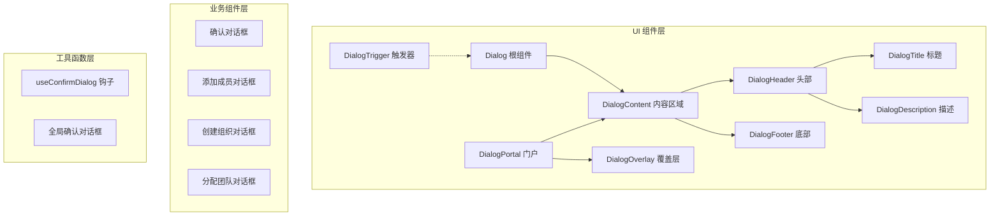
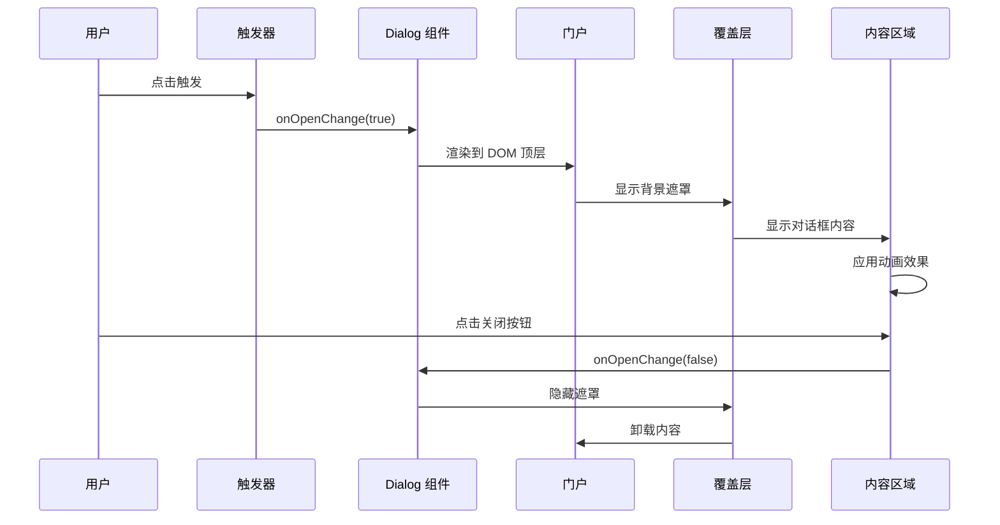
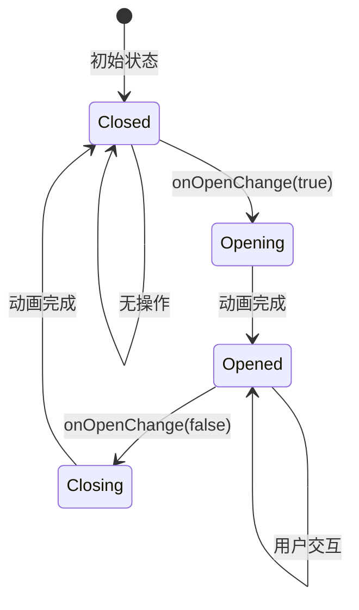
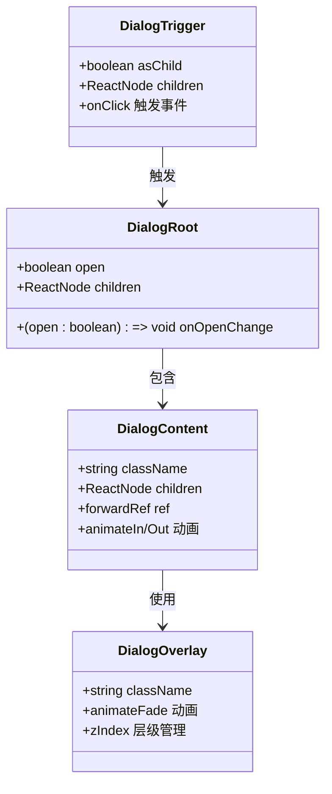
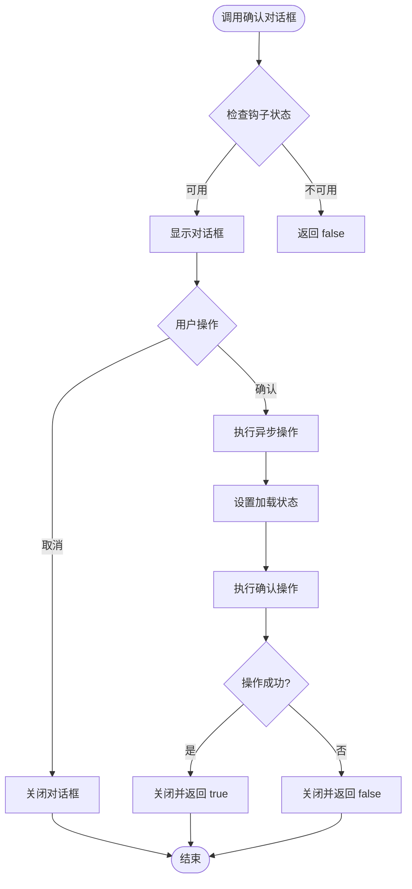
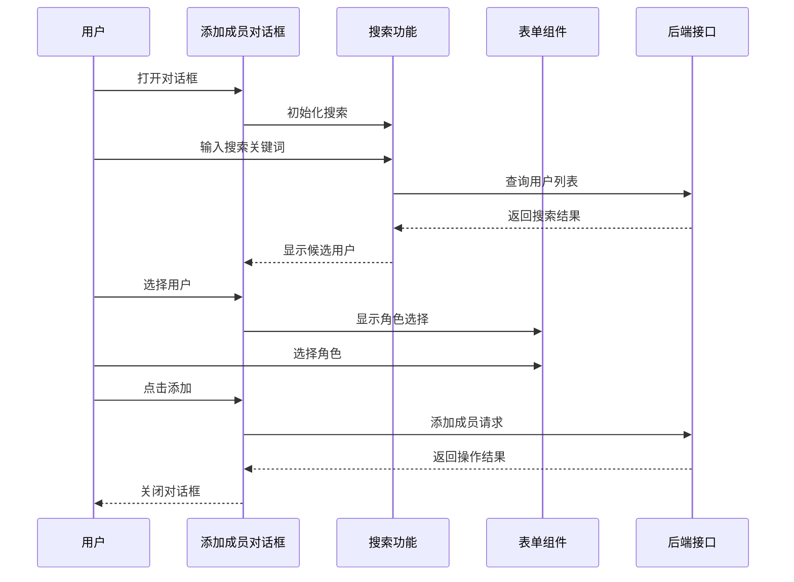
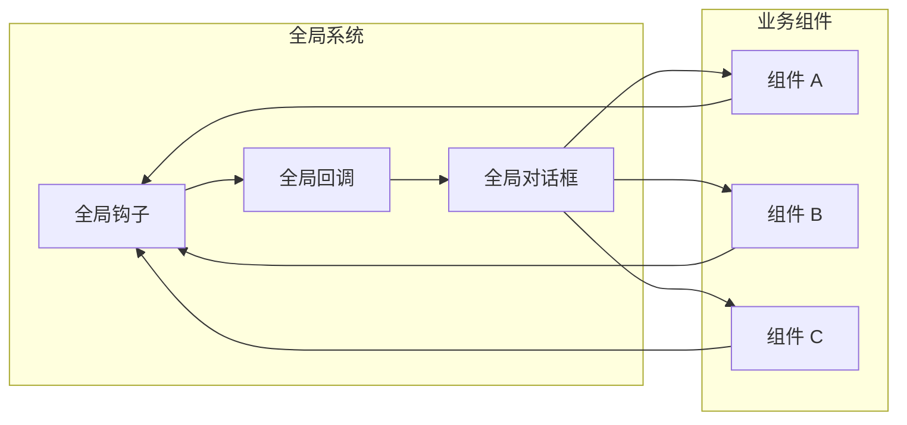

# Dialog 对话框组件

<cite>
**本文档引用的文件**
- [dialog.tsx](file://app/src/components/ui/dialog.tsx)
- [confirm-dialog.tsx](file://app/src/components/ui/confirm-dialog.tsx)
- [AddMemberDialog.tsx](file://app/src/components/organization/AddMemberDialog.tsx)
- [CreateOrgDialog.tsx](file://app/src/components/organization/CreateOrgDialog.tsx)
- [AssignTeamDialog.tsx](file://app/src/components/organization/AssignTeamDialog.tsx)
- [GlobalConfirmDialog.tsx](file://app/src/main.tsx)
</cite>

## 目录
1. [简介](#简介)
2. [项目结构](#项目结构)
3. [核心组件](#核心组件)
4. [架构概览](#架构概览)
5. [详细组件分析](#详细组件分析)
6. [依赖关系分析](#依赖关系分析)
7. [性能考虑](#性能考虑)
8. [故障排除指南](#故障排除指南)
9. [结论](#结论)
10. [附录](#附录)

## 简介

Dialog 对话框组件是基于 Radix UI 构建的现代化模态对话框解决方案。该组件提供了完整的无障碍支持、流畅的动画效果和灵活的内容布局能力，适用于各种用户界面场景。

组件采用组合式设计模式，通过多个专用子组件实现功能模块化：根容器、触发器、门户、覆盖层、内容区域、标题、描述和页脚等。这种设计确保了组件的高度可定制性和良好的开发体验。

## 项目结构

Dialog 组件位于 UI 组件库中，与业务组件分离，便于在不同场景中复用。项目采用分层架构，UI 组件专注于视觉呈现和交互逻辑，业务组件负责具体的功能实现。



**图表来源**
- [dialog.tsx:1-105](file://app/src/components/ui/dialog.tsx#L1-L105)
- [confirm-dialog.tsx:1-162](file://app/src/components/ui/confirm-dialog.tsx#L1-L162)

**章节来源**
- [dialog.tsx:1-105](file://app/src/components/ui/dialog.tsx#L1-L105)
- [confirm-dialog.tsx:1-162](file://app/src/components/ui/confirm-dialog.tsx#L1-L162)

## 核心组件

### 基础组件架构

Dialog 组件系统由多个相互协作的组件构成，每个组件都有明确的职责分工：

#### 根组件和触发器
- **Dialog Root**: 提供上下文和状态管理
- **DialogTrigger**: 定义触发对话框显示的元素
- **DialogPortal**: 将内容渲染到 DOM 顶层

#### 布局组件
- **DialogOverlay**: 背景遮罩层，支持动画过渡
- **DialogContent**: 对话框主体，包含关闭按钮
- **DialogHeader/DialogFooter**: 内容区域的头部和底部布局

#### 文本组件
- **DialogTitle**: 对话框标题
- **DialogDescription**: 对话框描述文本

### 组件属性配置

| 组件 | 关键属性 | 类型 | 默认值 | 说明 |
|------|----------|------|--------|------|
| Dialog | open, onOpenChange | boolean, (open: boolean) => void | - | 状态管理和事件处理 |
| DialogContent | className, children | string, ReactNode | - | 样式定制和内容渲染 |
| DialogTrigger | asChild, children | boolean, ReactNode | false | 触发元素包装 |
| DialogOverlay | className, ...props | string, HTMLAttributes | - | 背景遮罩样式 |

**章节来源**
- [dialog.tsx:9-54](file://app/src/components/ui/dialog.tsx#L9-L54)
- [dialog.tsx:56-91](file://app/src/components/ui/dialog.tsx#L56-L91)

## 架构概览

Dialog 组件采用现代前端架构设计，结合了 React Hooks、Context API 和第三方库集成的优势。



**图表来源**
- [dialog.tsx:17-54](file://app/src/components/ui/dialog.tsx#L17-L54)
- [confirm-dialog.tsx:27-71](file://app/src/components/ui/confirm-dialog.tsx#L27-L71)

### 状态管理模式

组件采用受控组件模式，通过 props 控制对话框状态，确保状态的一致性和可预测性。



**图表来源**
- [dialog.tsx:27-54](file://app/src/components/ui/dialog.tsx#L27-L54)

## 详细组件分析

### Dialog 基础组件

Dialog 基础组件提供了完整的模态对话框功能，包括状态管理、动画效果和无障碍支持。

#### 组件实现特点

1. **动画系统**: 使用 CSS 动画类实现平滑的打开/关闭效果
2. **响应式设计**: 支持不同屏幕尺寸的自适应布局
3. **无障碍支持**: 完整的键盘导航和屏幕阅读器支持
4. **样式系统**: 基于 Tailwind CSS 的可定制样式架构

#### 核心功能实现



**图表来源**
- [dialog.tsx:9-54](file://app/src/components/ui/dialog.tsx#L9-L54)

**章节来源**
- [dialog.tsx:17-54](file://app/src/components/ui/dialog.tsx#L17-L54)

### 确认对话框组件

确认对话框是一个专门用于用户确认操作的高级组件，提供了完整的异步处理能力和状态管理。

#### 组件特性

1. **异步处理**: 支持异步确认操作，自动处理加载状态
2. **状态管理**: 内置 loading 状态和错误处理
3. **变体支持**: 支持默认和破坏性操作样式
4. **钩子集成**: 提供 useConfirmDialog 钩子简化使用

#### 使用模式



**图表来源**
- [confirm-dialog.tsx:27-71](file://app/src/components/ui/confirm-dialog.tsx#L27-L71)

**章节来源**
- [confirm-dialog.tsx:27-71](file://app/src/components/ui/confirm-dialog.tsx#L27-L71)

### 业务场景对话框

项目中实现了多个具体的业务场景对话框，展示了 Dialog 组件的灵活性和可扩展性。

#### 添加成员对话框

添加成员对话框是一个复杂的表单对话框，包含了搜索、选择和确认等多个步骤。



**图表来源**
- [AddMemberDialog.tsx:47-108](file://app/src/components/organization/AddMemberDialog.tsx#L47-L108)

#### 创建组织对话框

创建组织对话框展示了简单的表单验证和提交流程。

**章节来源**
- [AddMemberDialog.tsx:47-108](file://app/src/components/organization/AddMemberDialog.tsx#L47-L108)
- [CreateOrgDialog.tsx:27-54](file://app/src/components/organization/CreateOrgDialog.tsx#L27-L54)

### 全局对话框系统

项目实现了全局确认对话框系统，支持跨组件的确认操作调用。

#### 系统架构



**图表来源**
- [confirm-dialog.tsx:79-102](file://app/src/components/ui/confirm-dialog.tsx#L79-L102)
- [confirm-dialog.tsx:133-161](file://app/src/components/ui/confirm-dialog.tsx#L133-L161)

**章节来源**
- [confirm-dialog.tsx:79-102](file://app/src/components/ui/confirm-dialog.tsx#L79-L102)
- [confirm-dialog.tsx:133-161](file://app/src/components/ui/confirm-dialog.tsx#L133-L161)

## 依赖关系分析

Dialog 组件系统具有清晰的依赖层次结构，各组件之间的耦合度低，便于维护和扩展。

```mermaid
graph TB
subgraph "外部依赖"
RadixUI[@radix-ui/react-dialog]
Icons[@radix-ui/react-icons]
Tailwind[tailwindcss]
end
subgraph "内部组件"
Dialog[dialog.tsx]
ConfirmDialog[confirm-dialog.tsx]
BusinessDialogs[业务对话框们]
end
subgraph "工具函数"
Utils[utils.ts]
Hooks[hooks.ts]
end
RadixUI --> Dialog
Icons --> Dialog
Tailwind --> Dialog
Dialog --> ConfirmDialog
Dialog --> BusinessDialogs
Utils --> Dialog
Hooks --> ConfirmDialog
Hooks --> BusinessDialogs
```

**图表来源**
- [dialog.tsx:4-7](file://app/src/components/ui/dialog.tsx#L4-L7)
- [confirm-dialog.tsx:5-14](file://app/src/components/ui/confirm-dialog.tsx#L5-L14)

### 组件间通信

组件间的通信主要通过 props 传递和事件回调实现，确保了数据流向的清晰性。

**章节来源**
- [dialog.tsx:4-7](file://app/src/components/ui/dialog.tsx#L4-L7)
- [confirm-dialog.tsx:5-14](file://app/src/components/ui/confirm-dialog.tsx#L5-L14)

## 性能考虑

Dialog 组件在设计时充分考虑了性能优化，采用了多种策略来提升用户体验。

### 渲染优化

1. **条件渲染**: 内容仅在对话框打开时渲染，减少不必要的 DOM 节点
2. **懒加载**: 通过 Portal 实现内容的延迟渲染
3. **动画优化**: 使用 CSS 动画而非 JavaScript 动画，提升性能

### 内存管理

1. **自动卸载**: 对话框关闭时自动清理相关资源
2. **事件监听**: 合理管理事件监听器的注册和注销
3. **状态清理**: 确保组件卸载时清除所有状态

## 故障排除指南

### 常见问题及解决方案

#### 对话框无法关闭

**症状**: 点击关闭按钮后对话框仍然显示

**可能原因**:
1. 缺少 onOpenChange 事件处理器
2. 父组件状态管理冲突
3. 事件冒泡被阻止

**解决方案**:
```typescript
// 确保正确处理状态变化
const [isOpen, setIsOpen] = useState(false);

return (
  <Dialog open={isOpen} onOpenChange={setIsOpen}>
    <DialogContent>
      {/* 内容 */}
    </DialogContent>
  </Dialog>
);
```

#### 背景滚动问题

**症状**: 对话框打开时背景仍然可以滚动

**解决方案**: 在对话框打开时阻止背景滚动

#### 键盘导航问题

**症状**: 无法通过键盘访问对话框内容

**解决方案**: 确保正确设置 aria 属性和键盘事件处理

**章节来源**
- [dialog.tsx:47-50](file://app/src/components/ui/dialog.tsx#L47-L50)

### 调试技巧

1. **开发者工具**: 使用浏览器开发者工具检查 DOM 结构
2. **状态监控**: 通过 React DevTools 监控组件状态变化
3. **日志输出**: 在关键事件中添加日志输出进行调试

## 结论

Dialog 对话框组件提供了一个完整、灵活且易于使用的模态对话框解决方案。通过合理的架构设计和丰富的功能特性，该组件能够满足各种复杂的应用场景需求。

组件的主要优势包括：
- 完整的无障碍支持
- 流畅的动画效果
- 灵活的布局系统
- 强大的扩展能力
- 良好的性能表现

建议在项目中优先使用该组件系统，以确保一致的用户体验和代码质量。

## 附录

### 使用示例索引

#### 基础对话框
- [dialog.tsx](file://app/src/components/ui/dialog.tsx) - 基础组件实现

#### 确认对话框
- [confirm-dialog.tsx](file://app/src/components/ui/confirm-dialog.tsx) - 确认对话框实现
- [GlobalConfirmDialog.tsx](file://app/src/main.tsx) - 全局确认对话框

#### 业务场景对话框
- [AddMemberDialog.tsx](file://app/src/components/organization/AddMemberDialog.tsx) - 添加成员对话框
- [CreateOrgDialog.tsx](file://app/src/components/organization/CreateOrgDialog.tsx) - 创建组织对话框
- [AssignTeamDialog.tsx](file://app/src/components/organization/AssignTeamDialog.tsx) - 分配团队对话框

### 最佳实践

1. **状态管理**: 始终使用受控组件模式
2. **无障碍**: 确保完整的 ARIA 属性支持
3. **性能**: 避免不必要的重新渲染
4. **样式**: 使用主题变量保持一致性
5. **测试**: 为关键交互编写单元测试