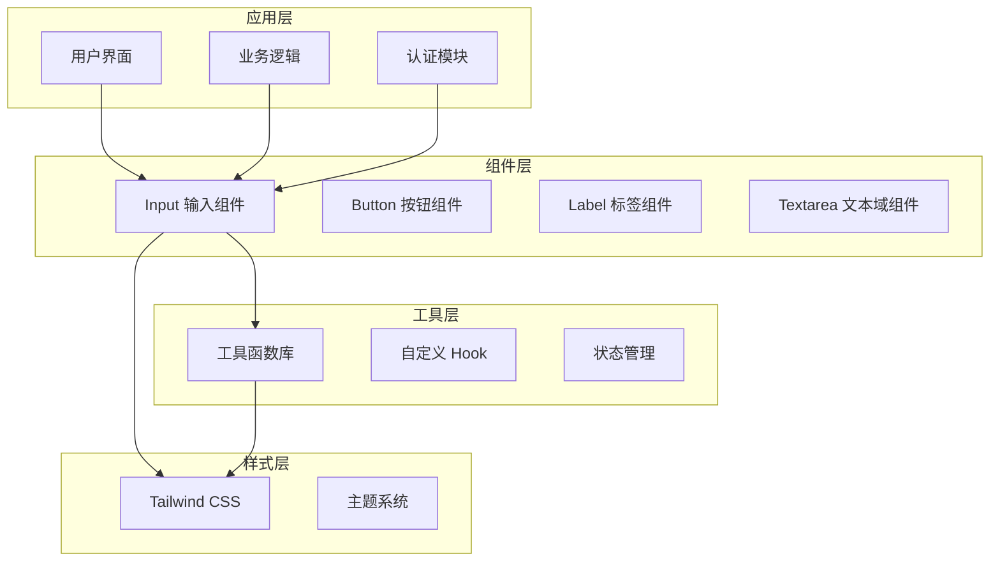
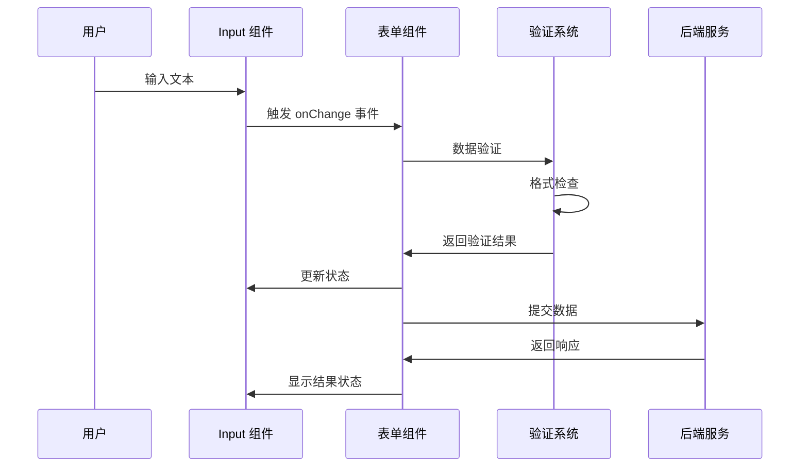
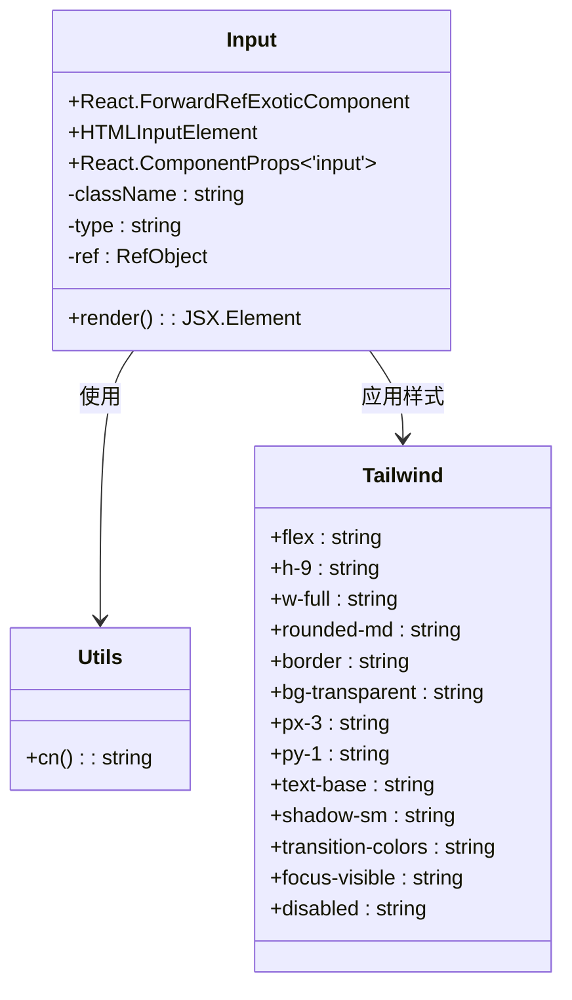
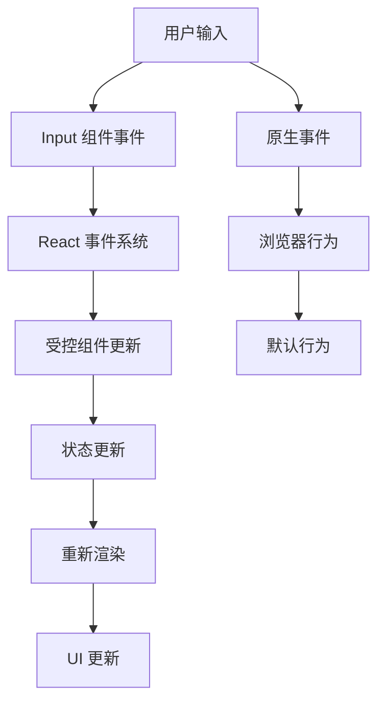
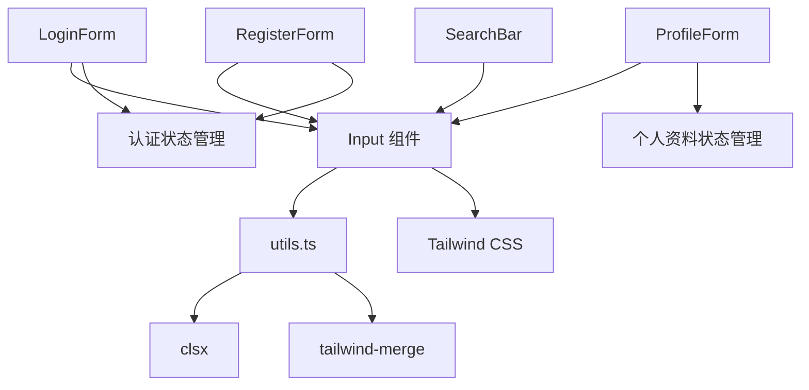
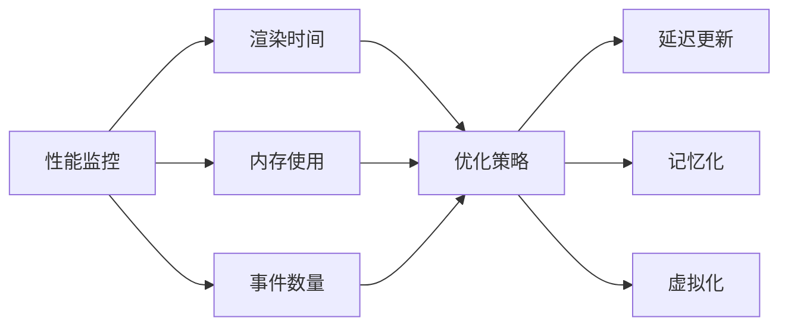

# Input 输入组件

<cite>
**本文档引用的文件**
- [app/src/components/ui/input.tsx](file://app/src/components/ui/input.tsx)
- [app/src/lib/utils.ts](file://app/src/lib/utils.ts)
- [app/src/auth/components/LoginForm.tsx](file://app/src/auth/components/LoginForm.tsx)
- [app/src/auth/components/RegisterForm.tsx](file://app/src/auth/components/RegisterForm.tsx)
- [app/src/components/business/ProfileForm.tsx](file://app/src/components/business/ProfileForm.tsx)
- [app/src/components/ui/search-bar.tsx](file://app/src/components/ui/search-bar.tsx)
- [app/src/components/ui/textarea.tsx](file://app/src/components/ui/textarea.tsx)
- [app/tailwind.config.js](file://app/tailwind.config.js)
</cite>

## 目录
1. [简介](#简介)
2. [项目结构](#项目结构)
3. [核心组件](#核心组件)
4. [架构概览](#架构概览)
5. [详细组件分析](#详细组件分析)
6. [依赖关系分析](#依赖关系分析)
7. [性能考虑](#性能考虑)
8. [故障排除指南](#故障排除指南)
9. [结论](#结论)
10. [附录](#附录)

## 简介

Input 输入组件是 OPC Starter 项目中的基础 UI 组件之一，为应用程序提供标准化的文本输入功能。该组件基于原生 HTML input 元素构建，继承了所有原生属性和行为，同时提供了统一的样式系统和可访问性支持。

该组件的设计理念是"保持简单而强大"，通过最小化的封装实现最大的灵活性。它不仅支持标准的文本输入，还能够处理各种特殊类型的输入，如密码、邮箱、数字等，并且完全兼容 React 的受控组件模式。

## 项目结构

OPC Starter 项目采用模块化架构设计，Input 组件位于 UI 组件库中，作为整个应用的基础组件之一。项目的整体结构体现了清晰的关注点分离：



**图表来源**
- [app/src/components/ui/input.tsx:1-26](file://app/src/components/ui/input.tsx#L1-L26)
- [app/src/lib/utils.ts:1-10](file://app/src/lib/utils.ts#L1-L10)

**章节来源**
- [app/src/components/ui/input.tsx:1-26](file://app/src/components/ui/input.tsx#L1-L26)
- [app/src/lib/utils.ts:1-10](file://app/src/lib/utils.ts#L1-L10)

## 核心组件

### Input 组件概述

Input 组件是一个轻量级的 React 组件，基于 `React.forwardRef` 实现，直接包装原生 HTML input 元素。它继承了所有原生 input 属性，包括但不限于：

- 基础属性：`type`、`value`、`defaultValue`、`name`
- 事件处理：`onChange`、`onFocus`、`onBlur`、`onKeyDown`
- 表单相关：`required`、`disabled`、`readOnly`、`placeholder`
- 验证相关：`aria-*` 属性、`formNoValidate`
- 样式相关：`className`、`style`

### 核心特性

1. **类型安全**：通过 TypeScript 泛型确保类型安全
2. **样式系统**：集成 Tailwind CSS 类名系统
3. **可访问性**：内置无障碍支持
4. **响应式设计**：适配不同屏幕尺寸
5. **状态管理**：支持禁用、聚焦、悬停等状态

**章节来源**
- [app/src/components/ui/input.tsx:8-23](file://app/src/components/ui/input.tsx#L8-L23)

## 架构概览

Input 组件在整个应用架构中扮演着重要的角色，它不仅是基础 UI 组件，更是连接用户交互和业务逻辑的桥梁。



**图表来源**
- [app/src/auth/components/LoginForm.tsx:33-54](file://app/src/auth/components/LoginForm.tsx#L33-L54)
- [app/src/auth/components/RegisterForm.tsx:76-97](file://app/src/auth/components/RegisterForm.tsx#L76-L97)

## 详细组件分析

### 组件实现细节

#### 基础实现结构

Input 组件采用了现代 React 最佳实践，使用 `forwardRef` 和 `ComponentProps<'input'>` 泛型来确保类型安全和灵活性：



**图表来源**
- [app/src/components/ui/input.tsx:8-23](file://app/src/components/ui/input.tsx#L8-L23)
- [app/src/lib/utils.ts:7-9](file://app/src/lib/utils.ts#L7-L9)

#### 样式系统架构

Input 组件的样式系统基于 Tailwind CSS，实现了响应式设计和主题一致性：

| 样式类别 | 默认类名 | 描述 |
|---------|----------|------|
| 尺寸控制 | `h-9`, `w-full` | 固定高度和全宽布局 |
| 边框样式 | `rounded-md`, `border`, `border-input` | 圆角边框和颜色变量 |
| 内边距 | `px-3`, `py-1` | 适当的内边距设置 |
| 字体样式 | `text-base`, `md:text-sm` | 响应式字体大小 |
| 状态样式 | `focus-visible:ring-1`, `disabled:opacity-50` | 焦点和禁用状态 |
| 文件样式 | `file:border-0`, `file:bg-transparent` | 文件输入样式重置 |

**章节来源**
- [app/src/components/ui/input.tsx:13-16](file://app/src/components/ui/input.tsx#L13-L16)

### 属性配置详解

#### 基础属性

| 属性名 | 类型 | 默认值 | 描述 |
|--------|------|--------|------|
| `type` | `string` | `'text'` | 输入类型，支持所有原生 input 类型 |
| `className` | `string` | `''` | 自定义 CSS 类名 |
| `value` | `string` | `''` | 受控组件的值 |
| `defaultValue` | `string` | `''` | 非受控组件的默认值 |
| `placeholder` | `string` | `''` | 占位符文本 |
| `disabled` | `boolean` | `false` | 是否禁用输入框 |

#### 事件处理属性

| 事件类型 | 回调签名 | 描述 |
|----------|----------|------|
| `onChange` | `(e: React.ChangeEvent<HTMLInputElement>) => void` | 值变化时触发 |
| `onFocus` | `(e: React.FocusEvent<HTMLInputElement>) => void` | 获得焦点时触发 |
| `onBlur` | `(e: React.BlurEvent<HTMLInputElement>) => void` | 失去焦点时触发 |
| `onKeyDown` | `(e: React.KeyboardEvent<HTMLInputElement>) => void` | 键盘按键时触发 |

**章节来源**
- [app/src/components/ui/input.tsx:8-19](file://app/src/components/ui/input.tsx#L8-L19)

### 事件处理机制

Input 组件继承了原生 input 元素的所有事件处理能力，同时保持了 React 事件系统的特性：



**图表来源**
- [app/src/auth/components/LoginForm.tsx:36-54](file://app/src/auth/components/LoginForm.tsx#L36-L54)

### 样式定制选项

#### 主题变量支持

Input 组件充分利用了 Tailwind CSS 的主题变量系统，支持以下主题变量：

- `--radius`: 圆角半径变量
- `--color`: 颜色变量
- `--border-width`: 边框宽度变量

#### 状态样式映射

| 状态 | 类名 | 描述 |
|------|------|------|
| 默认 | `border-input` | 默认边框颜色 |
| 聚焦 | `focus-visible:ring-1 focus-visible:ring-ring` | 聚焦环效果 |
| 禁用 | `disabled:cursor-not-allowed disabled:opacity-50` | 禁用状态样式 |
| 悬停 | `hover:border-input-hover` | 悬停边框效果 |

**章节来源**
- [app/src/components/ui/input.tsx:13-16](file://app/src/components/ui/input.tsx#L13-L16)

## 依赖关系分析

### 组件间依赖关系



**图表来源**
- [app/src/components/ui/input.tsx:6](file://app/src/components/ui/input.tsx#L6)
- [app/src/lib/utils.ts:4-9](file://app/src/lib/utils.ts#L4-L9)

### 外部依赖分析

| 依赖包 | 版本 | 用途 | 安全性 |
|--------|------|------|--------|
| `react` | ^18.2.0 | 核心框架 | ✅ 已更新 |
| `clsx` | ^2.0.0 | 类名合并 | ✅ 已更新 |
| `tailwind-merge` | ^2.2.0 | Tailwind 类名合并 | ✅ 已更新 |
| `tailwindcss` | ^4.0.0 | 样式框架 | ⚠️ 实验版本 |

**章节来源**
- [app/src/lib/utils.ts:4-9](file://app/src/lib/utils.ts#L4-L9)

## 性能考虑

### 渲染优化

Input 组件在设计时充分考虑了性能优化：

1. **最小化重渲染**：使用 `React.forwardRef` 减少不必要的包装层
2. **类名合并优化**：通过 `twMerge` 避免重复类名导致的样式冲突
3. **事件委托**：利用 React 事件系统减少事件监听器数量

### 内存管理

- **Ref 管理**：正确使用 `forwardRef` 确保 DOM 引用的生命周期管理
- **状态提升**：鼓励在父组件中管理输入状态，避免子组件内部状态复杂化

### 性能监控建议



## 故障排除指南

### 常见问题及解决方案

#### 样式不生效

**问题描述**：Input 组件样式不符合预期

**可能原因**：
1. Tailwind CSS 配置问题
2. 类名优先级冲突
3. 主题变量未正确配置

**解决方案**：
1. 检查 `tailwind.config.js` 配置
2. 确认 `cn` 函数正确合并类名
3. 验证主题变量定义

#### 事件处理异常

**问题描述**：输入事件无法正常触发

**可能原因**：
1. 事件处理器绑定错误
2. 受控组件状态管理问题
3. React 版本兼容性问题

**解决方案**：
1. 检查事件处理器签名
2. 确保受控组件正确更新状态
3. 验证 React 版本兼容性

#### 可访问性问题

**问题描述**：屏幕阅读器无法正确读取输入内容

**可能原因**：
1. 缺少必要的 ARIA 属性
2. 标签关联问题
3. 焦点管理不当

**解决方案**：
1. 添加 `aria-*` 属性
2. 正确使用 `<label>` 标签
3. 管理焦点状态

**章节来源**
- [app/src/components/ui/input.tsx:13-16](file://app/src/components/ui/input.tsx#L13-L16)

## 结论

Input 输入组件作为 OPC Starter 项目的核心 UI 组件，展现了现代前端开发的最佳实践。它通过简洁的实现、强大的功能和良好的可扩展性，为开发者提供了一个可靠的输入解决方案。

组件的主要优势包括：

1. **类型安全**：完整的 TypeScript 支持确保编译时类型检查
2. **样式灵活**：基于 Tailwind CSS 的样式系统提供高度定制能力
3. **可访问性**：内置无障碍支持符合 WCAG 标准
4. **性能优化**：最小化的实现和优化的渲染策略
5. **生态集成**：与 React 生态系统无缝集成

在未来的发展中，Input 组件可以进一步增强的功能包括：

- 更丰富的验证集成
- 更好的国际化支持
- 更多的键盘快捷键支持
- 更完善的测试覆盖

## 附录

### 使用示例索引

#### 认证场景
- [登录表单:33-54](file://app/src/auth/components/LoginForm.tsx#L33-L54)
- [注册表单:48-97](file://app/src/auth/components/RegisterForm.tsx#L48-L97)

#### 业务场景
- [个人资料表单:107-132](file://app/src/components/business/ProfileForm.tsx#L107-L132)
- [搜索栏:63-69](file://app/src/components/ui/search-bar.tsx#L63-L69)

#### 文本域对比
- [Textarea 组件:12-24](file://app/src/components/ui/textarea.tsx#L12-L24)

### 最佳实践清单

1. **始终使用受控组件模式**
2. **合理使用 placeholder 文本**
3. **正确处理禁用状态**
4. **提供适当的错误反馈**
5. **确保可访问性支持**
6. **优化性能表现**

### 配置参考

#### Tailwind CSS 配置
```javascript
// tailwind.config.js
module.exports = {
  theme: {
    extend: {
      // 自定义主题变量
    }
  }
}
```

#### TypeScript 类型定义
```typescript
// React.ComponentProps<'input'>
interface InputProps extends React.InputHTMLAttributes<HTMLInputElement> {
  className?: string;
  type?: string;
  ref?: React.Ref<HTMLInputElement>;
}
```