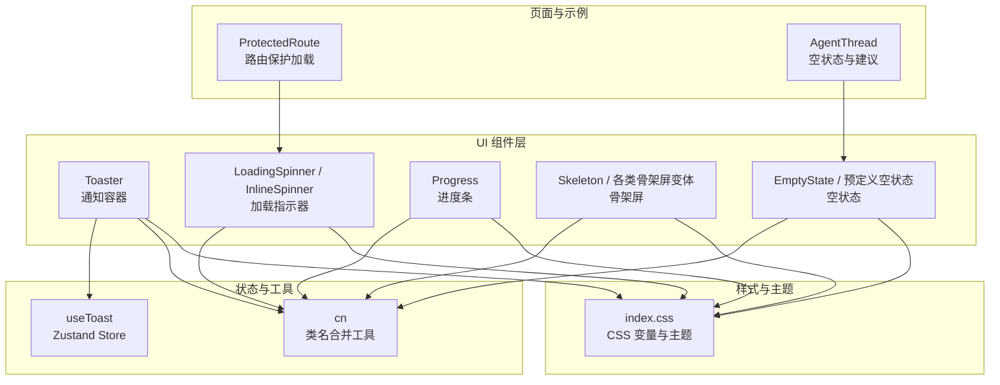
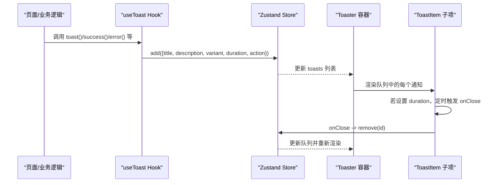
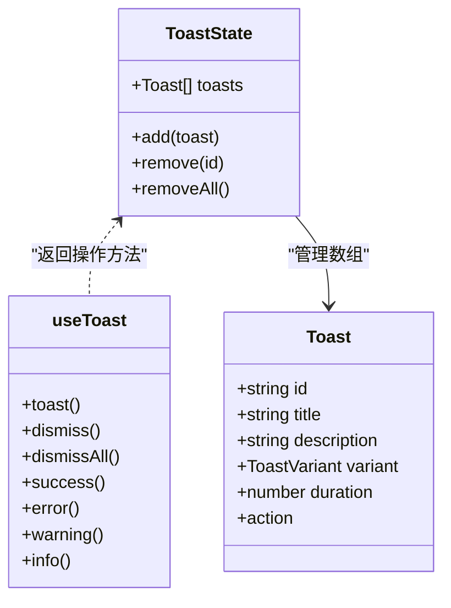
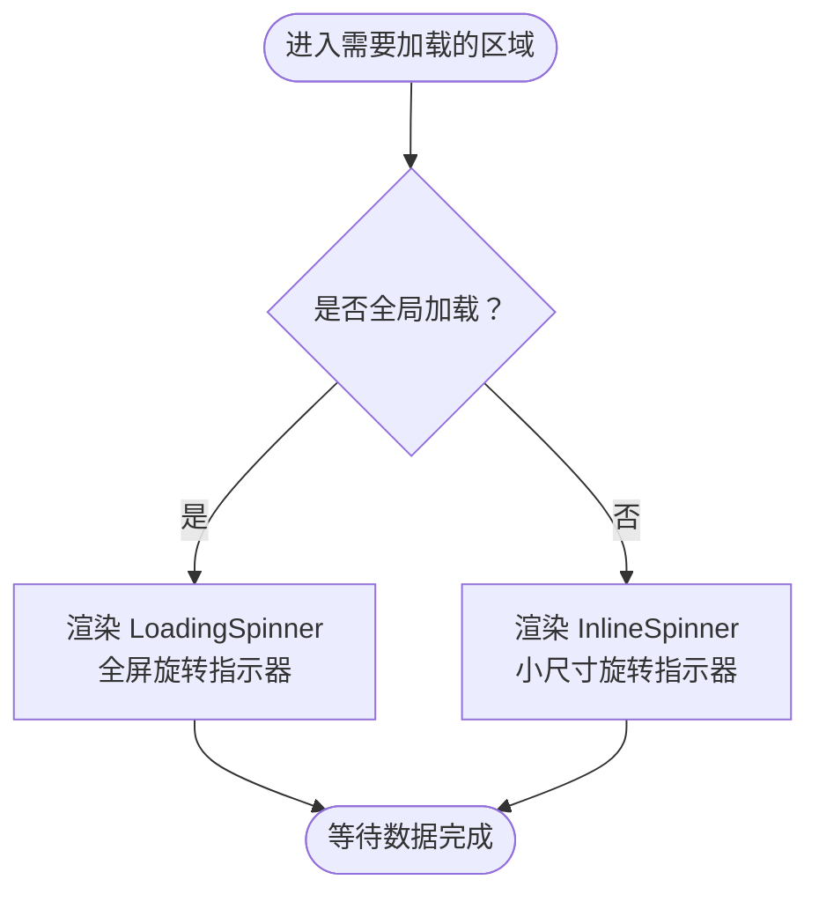
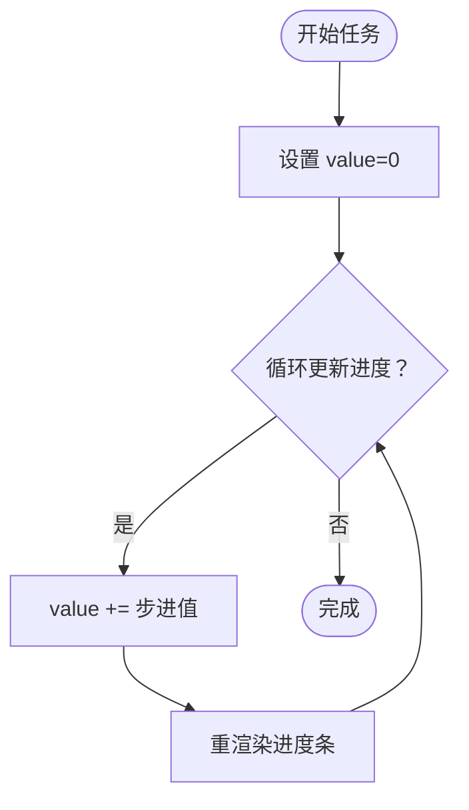
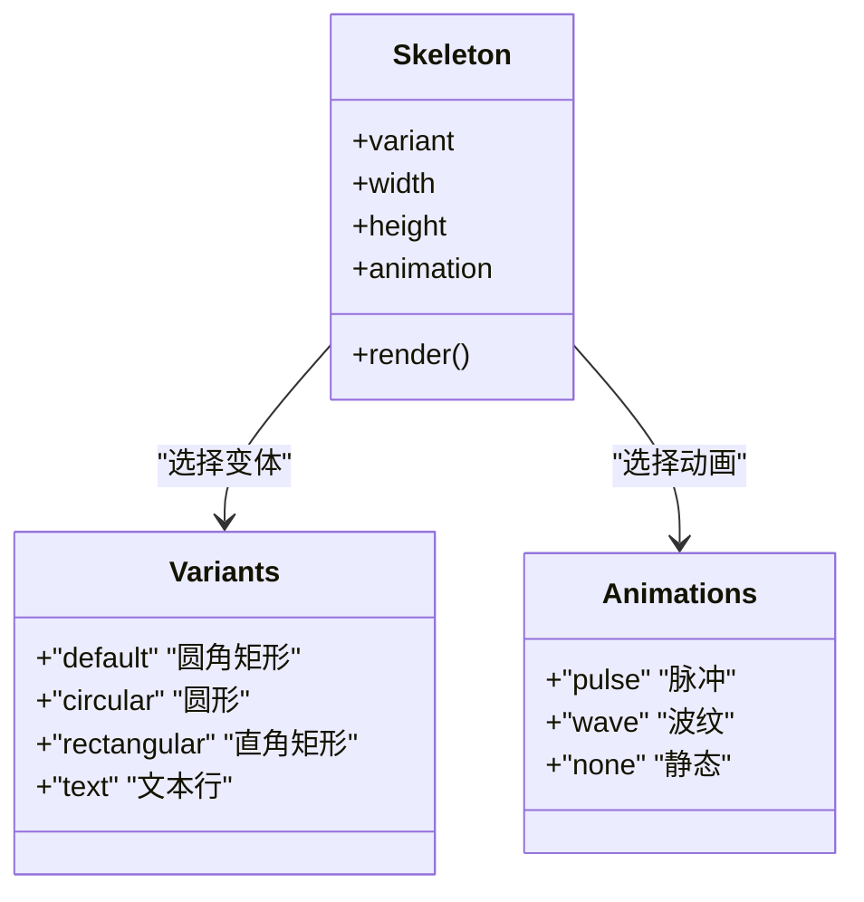
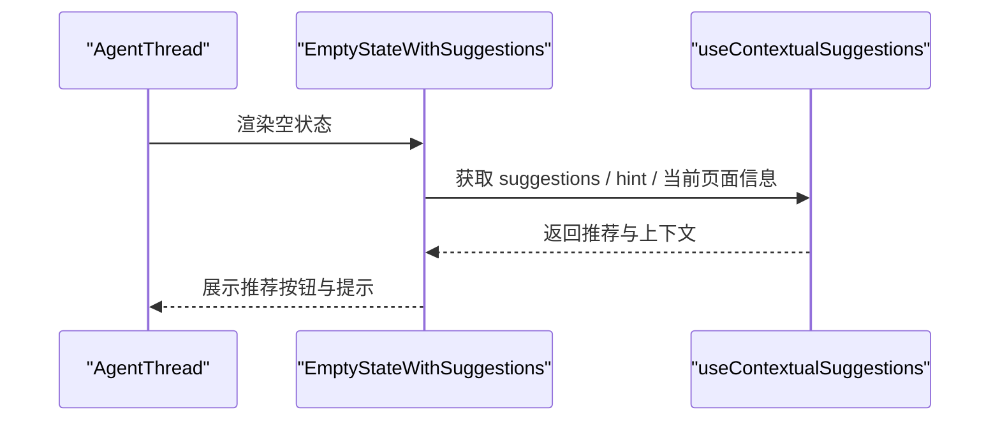
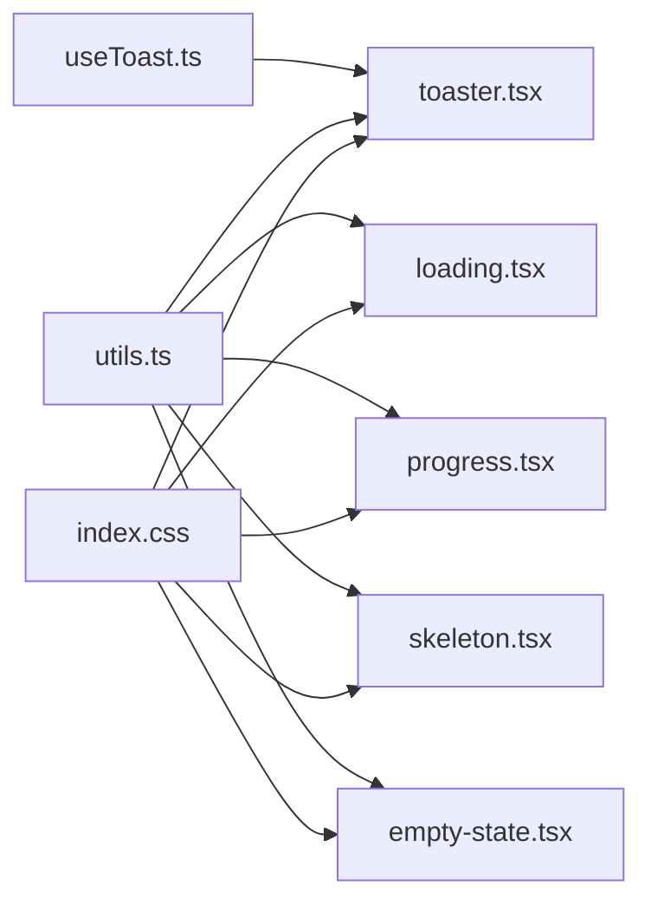

# 反馈组件

<cite>
**本文引用的文件**
- [toaster.tsx](file://app/src/components/ui/toaster.tsx)
- [loading.tsx](file://app/src/components/ui/loading.tsx)
- [progress.tsx](file://app/src/components/ui/progress.tsx)
- [skeleton.tsx](file://app/src/components/ui/skeleton.tsx)
- [empty-state.tsx](file://app/src/components/ui/empty-state.tsx)
- [useToast.ts](file://app/src/hooks/useToast.ts)
- [utils.ts](file://app/src/lib/utils.ts)
- [ProtectedRoute.tsx](file://app/src/auth/components/ProtectedRoute.tsx)
- [AgentThread.tsx](file://app/src/components/agent/AgentThread.tsx)
- [index.css](file://app/src/index.css)
</cite>

## 目录
1. [简介](#简介)
2. [项目结构](#项目结构)
3. [核心组件](#核心组件)
4. [架构总览](#架构总览)
5. [详细组件分析](#详细组件分析)
6. [依赖关系分析](#依赖关系分析)
7. [性能考量](#性能考量)
8. [故障排查指南](#故障排查指南)
9. [结论](#结论)
10. [附录](#附录)

## 简介
本文件系统化梳理并说明应用中的反馈类组件：通知（Toaster）、加载指示器（Loading）、进度条（Progress）、骨架屏（Skeleton）、空状态（EmptyState）。内容涵盖各组件的状态管理、动画效果、用户交互机制；提供典型使用场景与组合策略；阐述可访问性、动画性能与用户体验优化建议。

## 项目结构
反馈组件主要位于应用前端的 UI 组件层，配合状态管理 Hook 和通用工具函数共同工作。主题与样式通过 CSS 变量与 Tailwind v4 实现，确保一致的视觉语言与深浅色主题适配。

**图表来源**
- [toaster.tsx:1-102](file://app/src/components/ui/toaster.tsx#L1-L102)
- [loading.tsx:1-39](file://app/src/components/ui/loading.tsx#L1-L39)
- [progress.tsx:1-27](file://app/src/components/ui/progress.tsx#L1-L27)
- [skeleton.tsx:1-171](file://app/src/components/ui/skeleton.tsx#L1-L171)
- [empty-state.tsx:1-136](file://app/src/components/ui/empty-state.tsx#L1-L136)
- [useToast.ts:1-77](file://app/src/hooks/useToast.ts#L1-L77)
- [utils.ts:1-10](file://app/src/lib/utils.ts#L1-L10)
- [ProtectedRoute.tsx:1-32](file://app/src/auth/components/ProtectedRoute.tsx#L1-L32)
- [AgentThread.tsx:1-183](file://app/src/components/agent/AgentThread.tsx#L1-L183)
- [index.css:1-218](file://app/src/index.css#L1-L218)

**章节来源**
- [toaster.tsx:1-102](file://app/src/components/ui/toaster.tsx#L1-L102)
- [loading.tsx:1-39](file://app/src/components/ui/loading.tsx#L1-L39)
- [progress.tsx:1-27](file://app/src/components/ui/progress.tsx#L1-L27)
- [skeleton.tsx:1-171](file://app/src/components/ui/skeleton.tsx#L1-L171)
- [empty-state.tsx:1-136](file://app/src/components/ui/empty-state.tsx#L1-L136)
- [useToast.ts:1-77](file://app/src/hooks/useToast.ts#L1-L77)
- [utils.ts:1-10](file://app/src/lib/utils.ts#L1-L10)
- [ProtectedRoute.tsx:1-32](file://app/src/auth/components/ProtectedRoute.tsx#L1-L32)
- [AgentThread.tsx:1-183](file://app/src/components/agent/AgentThread.tsx#L1-L183)
- [index.css:1-218](file://app/src/index.css#L1-L218)

## 核心组件
- 通知（Toaster）
  - 全局浮动通知容器，基于 Zustand 管理队列，支持多种变体（默认、成功、错误、警告、信息），带自动消失与可选操作按钮。
  - 关键状态：通知队列、单个通知的持续时间、关闭回调。
  - 动画：进入时从顶部滑入，使用过渡类实现。
  - 交互：关闭按钮、可点击的操作按钮。
- 加载指示器（Loading）
  - 全局加载：全屏旋转指示器与“加载中”文案。
  - 内联加载：小尺寸旋转指示器，支持 sm/md/lg 尺寸。
- 进度条（Progress）
  - 基于 Radix UI 的原生进度条，通过样式变换实现进度指示器的平滑过渡。
  - 关键状态：value 数值（0-100）。
- 骨架屏（Skeleton）
  - 通用骨架屏与多种预置布局（照片卡片、相册封面、时间轴、人物标签/列表、照片详情、通用列表、网格等）。
  - 支持变体（圆角、圆形、矩形、文本）、动画（脉冲、波纹、无）与尺寸控制。
- 空状态（EmptyState）
  - 通用空状态容器，支持图标、标题、描述与可选操作按钮。
  - 提供预定义场景（无照片、无相册、无搜索结果、无人物、时间线为空、加载错误）。

**章节来源**
- [toaster.tsx:1-102](file://app/src/components/ui/toaster.tsx#L1-L102)
- [loading.tsx:1-39](file://app/src/components/ui/loading.tsx#L1-L39)
- [progress.tsx:1-27](file://app/src/components/ui/progress.tsx#L1-L27)
- [skeleton.tsx:1-171](file://app/src/components/ui/skeleton.tsx#L1-L171)
- [empty-state.tsx:1-136](file://app/src/components/ui/empty-state.tsx#L1-L136)

## 架构总览
反馈组件围绕“状态-视图-交互”的闭环协作：
- 状态管理：useToast 基于 Zustand 维护全局通知队列，提供添加、移除、批量移除与便捷方法（success/error/warning/info）。
- 视图渲染：各组件负责自身 UI 结构与动画；Toaster 负责全局布局与入队通知的渲染。
- 工具与样式：cn 用于安全合并类名；index.css 提供主题变量与基础样式，保障跨组件一致性。
- 业务集成：ProtectedRoute 在初始化阶段使用 LoadingSpinner 展示加载态；AgentThread 在无消息时展示 EmptyStateWithSuggestions。

**图表来源**
- [useToast.ts:28-59](file://app/src/hooks/useToast.ts#L28-L59)
- [toaster.tsx:89-101](file://app/src/components/ui/toaster.tsx#L89-L101)
- [toaster.tsx:44-87](file://app/src/components/ui/toaster.tsx#L44-L87)

## 详细组件分析

### 通知（Toaster）
- 状态管理
  - 使用 Zustand 维护 toasts 数组，add 返回自动生成的 id；支持自动过期移除与手动移除。
  - 提供便捷方法：success、error、warning、info，统一入口。
- 动画与交互
  - 子项进入时采用从顶部滑入的动画；支持可选操作按钮与关闭按钮。
  - 不同变体对应不同图标与边框/背景色，语义明确。
- 可访问性
  - 建议：为通知容器提供 aria-live 区域以提升读屏体验；为操作按钮提供明确的键盘可达性。
- 性能
  - 单次渲染仅处理当前队列；自动过期使用 setTimeout，注意在组件卸载时清理定时器（已通过 effect 返回清理函数）。

**图表来源**
- [useToast.ts:9-26](file://app/src/hooks/useToast.ts#L9-L26)
- [useToast.ts:28-59](file://app/src/hooks/useToast.ts#L28-L59)
- [useToast.ts:62-76](file://app/src/hooks/useToast.ts#L62-L76)

**章节来源**
- [toaster.tsx:1-102](file://app/src/components/ui/toaster.tsx#L1-L102)
- [useToast.ts:1-77](file://app/src/hooks/useToast.ts#L1-L77)

### 加载指示器（Loading）
- 全局加载
  - 适用于页面初始化、路由守卫等场景，提供全屏居中加载态。
- 内联加载
  - 适合按钮、列表项内等局部加载，支持多尺寸。
- 交互与可访问性
  - 建议在关键加载区域提供 aria-label 或 aria-describedby，告知读屏用户加载状态。
- 性能
  - 旋转动画使用纯 CSS，开销低；避免在长列表中重复渲染多个实例。

**图表来源**
- [loading.tsx:5-39](file://app/src/components/ui/loading.tsx#L5-L39)

**章节来源**
- [loading.tsx:1-39](file://app/src/components/ui/loading.tsx#L1-L39)
- [ProtectedRoute.tsx:14-31](file://app/src/auth/components/ProtectedRoute.tsx#L14-L31)

### 进度条（Progress）
- 状态与行为
  - 通过 value 控制进度百分比，指示器使用 transform 实现平滑过渡。
- 适用场景
  - 文件上传、批量任务、分步流程等需要可视化进度的场景。
- 可访问性
  - 建议提供 aria-valuemin/aria-valuemax/aria-valuetext 以增强读屏体验。
- 性能
  - 使用 CSS transform，GPU 加速友好；避免频繁重排。

**图表来源**
- [progress.tsx:9-24](file://app/src/components/ui/progress.tsx#L9-L24)

**章节来源**
- [progress.tsx:1-27](file://app/src/components/ui/progress.tsx#L1-L27)

### 骨架屏（Skeleton）
- 通用能力
  - 支持多种变体与动画，可直接用于占位渲染，显著改善首屏与切换体验。
- 预置布局
  - 提供照片卡片、相册封面、时间轴、人物标签/列表、照片详情、通用列表、网格等常用布局骨架。
- 可访问性
  - 骨架屏不替代真实内容，应与真实内容同时存在并在数据到达后平滑替换。
- 性能
  - 使用简单 div + 背景动画，渲染成本低；建议在大数据列表中优先使用骨架屏而非真实内容。

**图表来源**
- [skeleton.tsx:6-44](file://app/src/components/ui/skeleton.tsx#L6-L44)

**章节来源**
- [skeleton.tsx:1-171](file://app/src/components/ui/skeleton.tsx#L1-L171)

### 空状态（EmptyState）
- 通用空状态
  - 支持图标、标题、描述与可选操作按钮，便于引导用户采取下一步行动。
- 预定义场景
  - 无照片、无相册、无搜索结果、无人物、时间线为空、加载错误等，减少重复开发。
- 与业务结合
  - AgentThread 在无消息时展示上下文感知的空状态与智能建议，提升引导效率。

**图表来源**
- [AgentThread.tsx:57-115](file://app/src/components/agent/AgentThread.tsx#L57-L115)
- [empty-state.tsx:21-45](file://app/src/components/ui/empty-state.tsx#L21-L45)

**章节来源**
- [empty-state.tsx:1-136](file://app/src/components/ui/empty-state.tsx#L1-L136)
- [AgentThread.tsx:1-183](file://app/src/components/agent/AgentThread.tsx#L1-L183)

## 依赖关系分析
- 组件间耦合
  - Toaster 依赖 useToast 的状态与方法；其余组件相对独立，通过 props 接口进行组合。
- 外部依赖
  - Progress 依赖 Radix UI；Toaster 使用 lucide-react 图标；cn 依赖 clsx 与 tailwind-merge。
- 主题与样式
  - index.css 提供统一的颜色变量与基础样式，保证各组件风格一致。

**图表来源**
- [useToast.ts:1-77](file://app/src/hooks/useToast.ts#L1-L77)
- [toaster.tsx:1-102](file://app/src/components/ui/toaster.tsx#L1-L102)
- [loading.tsx:1-39](file://app/src/components/ui/loading.tsx#L1-L39)
- [progress.tsx:1-27](file://app/src/components/ui/progress.tsx#L1-L27)
- [skeleton.tsx:1-171](file://app/src/components/ui/skeleton.tsx#L1-L171)
- [empty-state.tsx:1-136](file://app/src/components/ui/empty-state.tsx#L1-L136)
- [utils.ts:1-10](file://app/src/lib/utils.ts#L1-L10)
- [index.css:1-218](file://app/src/index.css#L1-L218)

**章节来源**
- [useToast.ts:1-77](file://app/src/hooks/useToast.ts#L1-L77)
- [utils.ts:1-10](file://app/src/lib/utils.ts#L1-L10)
- [index.css:1-218](file://app/src/index.css#L1-L218)

## 性能考量
- 动画与渲染
  - Toaster 使用 CSS 动画与 transform，入场动画轻量；Progress 使用 transform 控制指示器位置，避免重排。
  - Skeleton 采用背景动画，渲染成本低，适合大量占位。
- 状态更新
  - useToast 通过 Zustand 管理全局状态，避免跨层级传递；Toaster 仅渲染当前队列，减少不必要的重渲染。
- 主题与样式
  - CSS 变量驱动的主题切换在运行时开销小；cn 合并类名避免冗余样式。
- 建议
  - 在高频更新场景（如滚动加载）优先使用 Skeleton 替代真实内容；
  - 控制通知数量与自动消失时长，避免遮挡重要交互区域。

[本节为通用指导，无需特定文件引用]

## 故障排查指南
- 通知未出现或立即消失
  - 检查 useToast 的 add 是否被正确调用；确认 duration 设置与自动移除逻辑。
  - 确认 Toaster 容器已在根节点渲染且未被其他元素遮挡。
- 加载指示器未显示
  - 确认在初始化阶段或关键请求期间正确渲染了 LoadingSpinner 或 InlineSpinner。
  - 检查路由守卫逻辑，确保在 isLoading 期间显示加载态。
- 进度条不更新
  - 确认 value 在有效范围内（0-100）；检查父组件是否正确传递并更新该值。
- 骨架屏样式异常
  - 检查 variant 与 animation 参数是否正确；确认 CSS 变量与主题已生效。
- 空状态未显示或按钮无效
  - 确认 EmptyState 的 props（title/description/action）是否传入；检查 action.onClick 是否绑定。

**章节来源**
- [useToast.ts:28-59](file://app/src/hooks/useToast.ts#L28-L59)
- [toaster.tsx:89-101](file://app/src/components/ui/toaster.tsx#L89-L101)
- [ProtectedRoute.tsx:22-24](file://app/src/auth/components/ProtectedRoute.tsx#L22-L24)
- [progress.tsx:12-23](file://app/src/components/ui/progress.tsx#L12-L23)
- [skeleton.tsx:13-44](file://app/src/components/ui/skeleton.tsx#L13-L44)
- [empty-state.tsx:21-45](file://app/src/components/ui/empty-state.tsx#L21-L45)

## 结论
反馈组件体系以清晰的职责划分与统一的样式主题为基础，结合轻量动画与合理的状态管理，有效提升了用户在加载、进度、通知、占位与空状态等关键交互时刻的体验。通过本文档提供的使用范式与最佳实践，可在保证性能与可访问性的前提下，构建一致、流畅且富有表现力的反馈体系。

[本节为总结性内容，无需特定文件引用]

## 附录

### 使用场景与最佳实践
- 加载状态
  - 页面初始化、路由守卫、关键请求：使用 LoadingSpinner；局部微操作：使用 InlineSpinner。
  - 建议：在关键加载路径上提供 aria-label，确保读屏可用。
- 进度跟踪
  - 文件上传、批量任务：使用 Progress；合理设置 value 更新频率，避免过度重渲染。
- 成功/错误/警告/信息通知
  - 使用 useToast 的便捷方法；为重要操作提供可点击的“撤销/重试”动作。
  - 建议：控制通知数量与停留时长，避免遮挡关键交互。
- 空数据展示
  - 使用 EmptyState 或预定义场景组件；提供明确的下一步操作按钮。
  - 与上下文结合（如 AgentThread 的 EmptyStateWithSuggestions）提升引导效率。
- 骨架屏
  - 在数据到达前渲染骨架屏，提升感知速度；根据布局选择合适的预置骨架。
  - 建议：在大数据列表中优先使用骨架屏，减少真实 DOM 的压力。

[本节为概念性内容，无需特定文件引用]