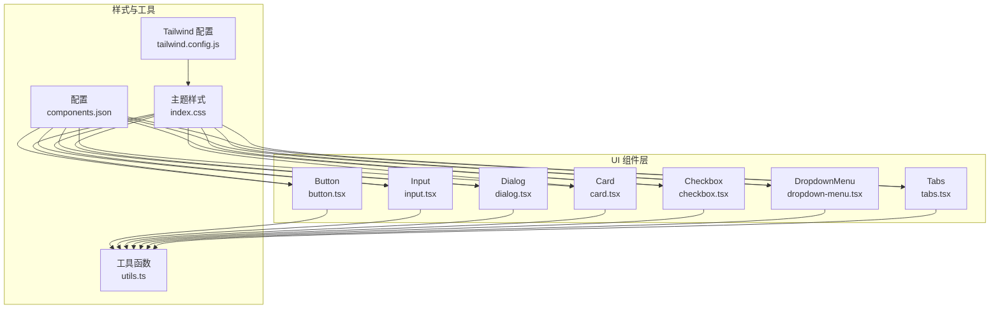
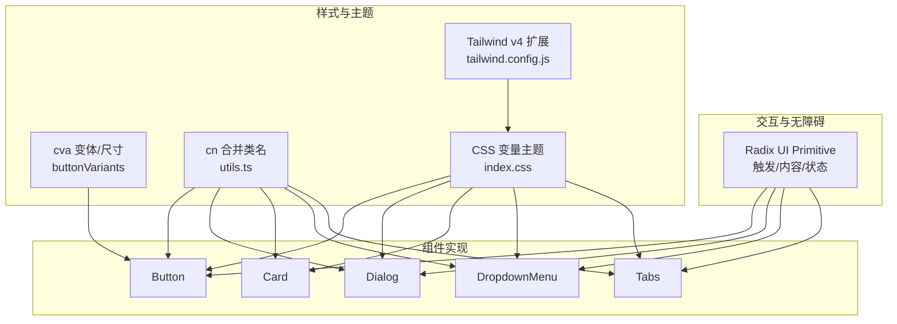
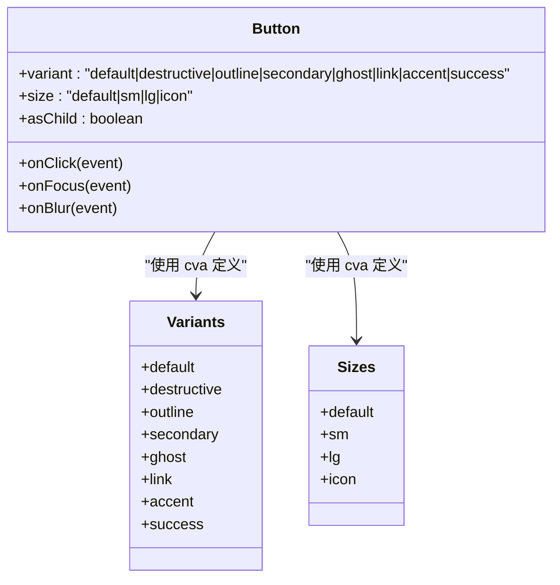
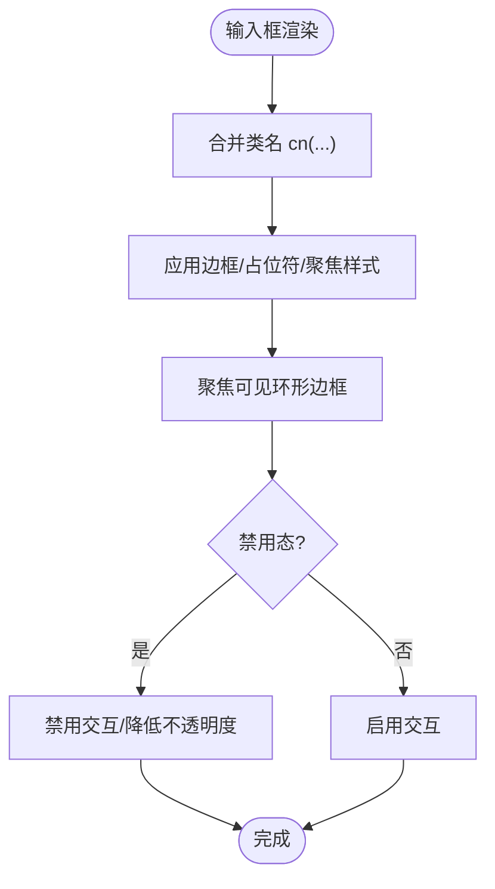
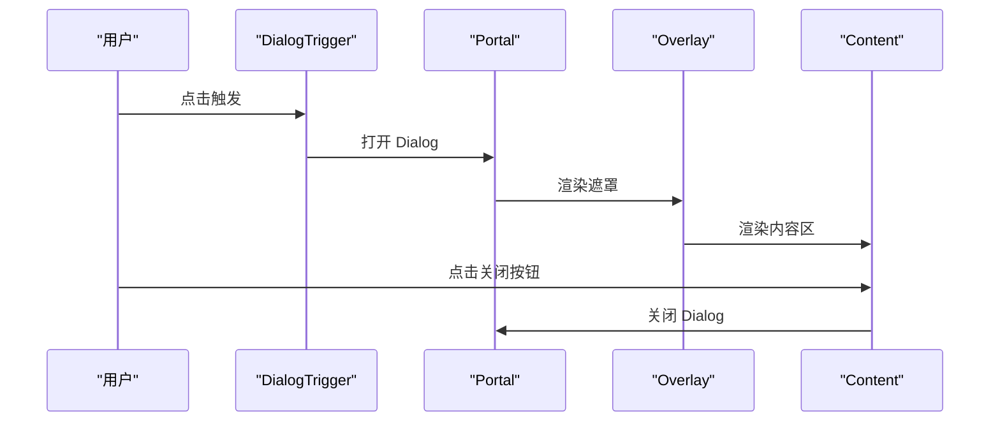
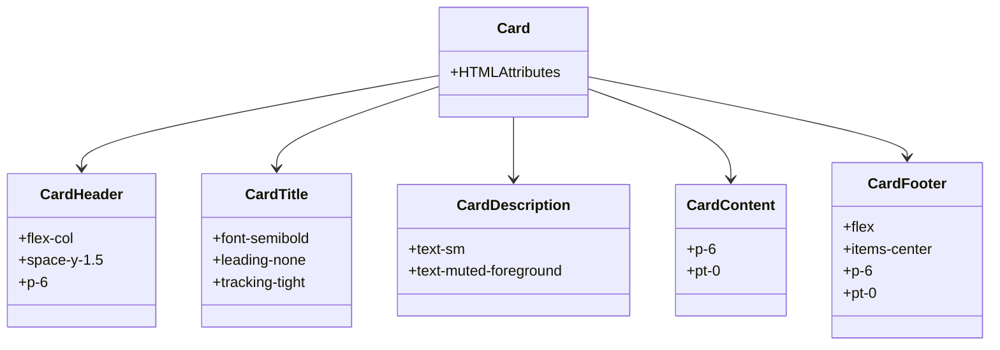
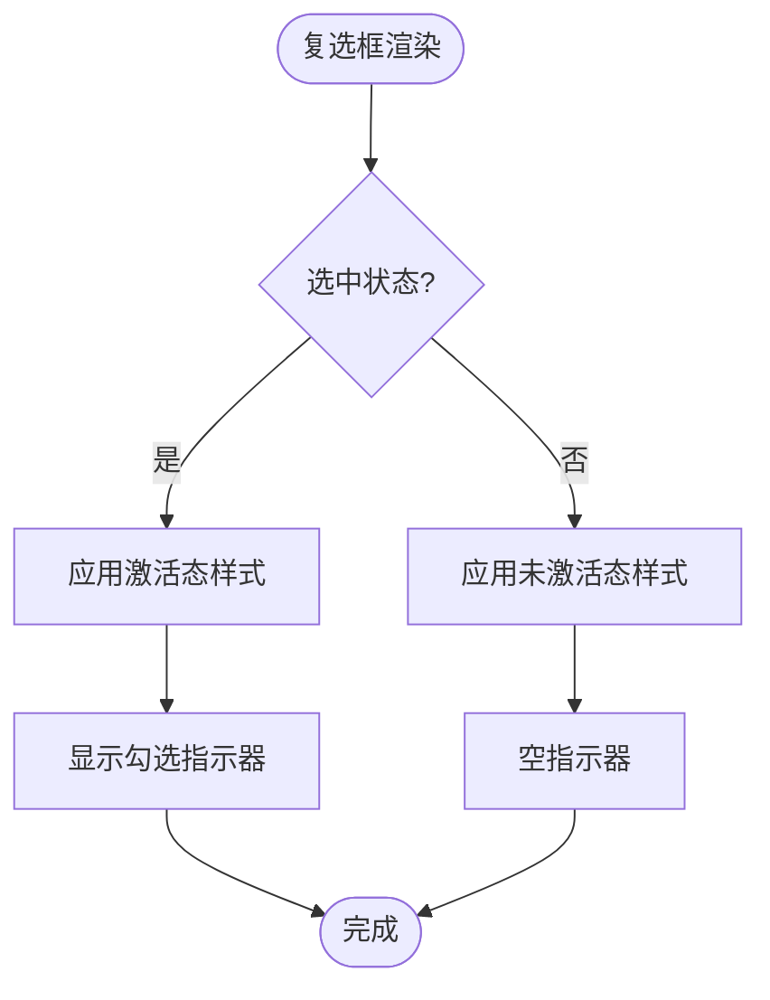
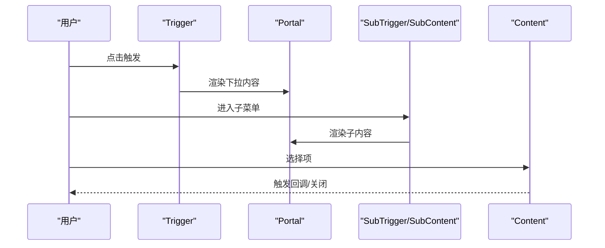
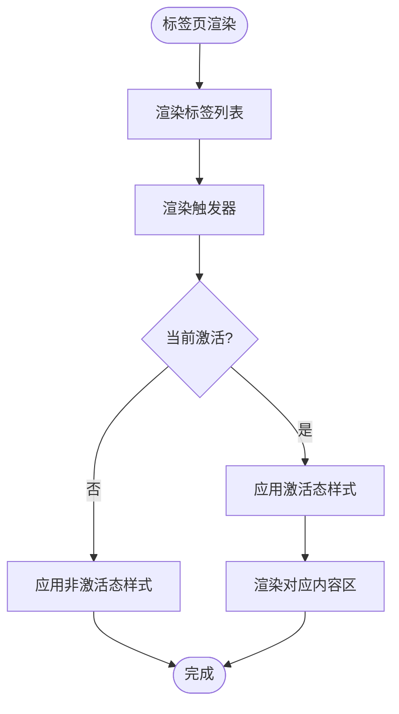
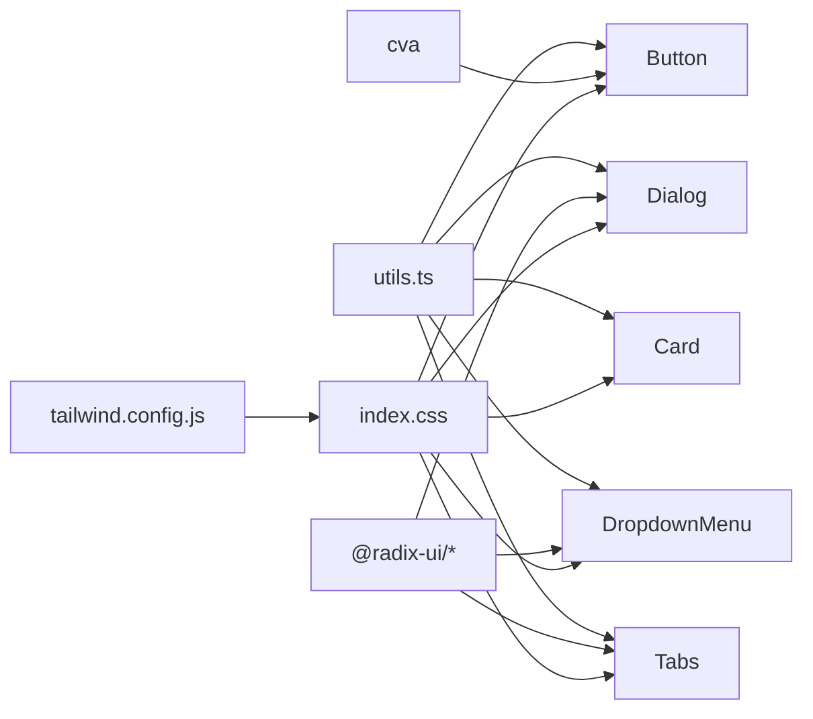

# 基础 UI 组件库

<cite>
**本文引用的文件**
- [button.tsx](file://app/src/components/ui/button.tsx)
- [input.tsx](file://app/src/components/ui/input.tsx)
- [dialog.tsx](file://app/src/components/ui/dialog.tsx)
- [card.tsx](file://app/src/components/ui/card.tsx)
- [checkbox.tsx](file://app/src/components/ui/checkbox.tsx)
- [dropdown-menu.tsx](file://app/src/components/ui/dropdown-menu.tsx)
- [tabs.tsx](file://app/src/components/ui/tabs.tsx)
- [utils.ts](file://app/src/lib/utils.ts)
- [components.json](file://app/components.json)
- [tailwind.config.js](file://app/tailwind.config.js)
- [index.css](file://app/src/index.css)
- [ActionButtons.tsx](file://app/src/components/agent/a2ui/components/ActionButtons.tsx)
- [A2UIButton.tsx](file://app/src/components/agent/a2ui/components/A2UIButton.tsx)
- [registry.ts](file://app/src/components/agent/a2ui/registry.ts)
- [A2UIRenderer.test.tsx](file://app/src/components/agent/a2ui/__tests__/A2UIRenderer.test.tsx)
- [confirm-dialog.tsx](file://app/src/components/ui/confirm-dialog.tsx)
</cite>

## 目录
1. [简介](#简介)
2. [项目结构](#项目结构)
3. [核心组件](#核心组件)
4. [架构总览](#架构总览)
5. [详细组件分析](#详细组件分析)
6. [依赖关系分析](#依赖关系分析)
7. [性能考量](#性能考量)
8. [故障排查指南](#故障排查指南)
9. [结论](#结论)
10. [附录](#附录)

## 简介
本文件系统化梳理基于 shadcn/ui 的基础 UI 组件库，覆盖 Button（多种变体与尺寸）、Input、Dialog（模态框）、Card（卡片容器）、Checkbox（复选框）、DropdownMenu（下拉菜单）、Tabs（标签页）等核心组件。文档从架构、数据流、处理逻辑、可访问性与键盘导航、样式定制、组合使用模式与最佳实践等维度进行深入解析，并提供可视化图示与参考路径，帮助开发者快速理解与高效使用。

## 项目结构
UI 组件集中于 app/src/components/ui 目录，采用“按功能分层 + 组合式子组件”的组织方式；主题与样式由 Tailwind v4 + CSS 变量驱动，通过 components.json 进行统一配置与别名管理。

图表来源
- [button.tsx:1-64](file://app/src/components/ui/button.tsx#L1-L64)
- [input.tsx:1-26](file://app/src/components/ui/input.tsx#L1-L26)
- [dialog.tsx:1-105](file://app/src/components/ui/dialog.tsx#L1-L105)
- [card.tsx:1-59](file://app/src/components/ui/card.tsx#L1-L59)
- [checkbox.tsx:1-30](file://app/src/components/ui/checkbox.tsx#L1-L30)
- [dropdown-menu.tsx:1-210](file://app/src/components/ui/dropdown-menu.tsx#L1-L210)
- [tabs.tsx:1-57](file://app/src/components/ui/tabs.tsx#L1-L57)
- [utils.ts:1-10](file://app/src/lib/utils.ts#L1-L10)
- [components.json:1-21](file://app/components.json#L1-L21)
- [tailwind.config.js:1-39](file://app/tailwind.config.js#L1-L39)
- [index.css:1-218](file://app/src/index.css#L1-L218)

章节来源
- [components.json:1-21](file://app/components.json#L1-L21)
- [tailwind.config.js:1-39](file://app/tailwind.config.js#L1-L39)
- [index.css:1-218](file://app/src/index.css#L1-L218)

## 核心组件
本节概览各组件的职责、对外接口与关键行为，便于快速检索与集成。

- Button（按钮）
  - 支持变体：default、destructive、outline、secondary、ghost、link、accent、success
  - 支持尺寸：default、sm、lg、icon
  - 关键特性：通过 Slot 实现 asChild；使用 cva 定义变体与尺寸；继承原生 button 属性
  - 参考路径：[button.tsx:10-64](file://app/src/components/ui/button.tsx#L10-L64)

- Input（输入框）
  - 支持 type 与原生 input 属性透传
  - 关键特性：聚焦可见环形边框、禁用态、占位符与文件输入样式
  - 参考路径：[input.tsx:8-25](file://app/src/components/ui/input.tsx#L8-L25)

- Dialog（模态框）
  - 根组件、触发器、入口、关闭器、覆盖层、内容区、头部、尾部、标题、描述
  - 关键特性：Portal 渲染、动画入场/出场、焦点管理、关闭按钮带 sr-only 文本
  - 参考路径：[dialog.tsx:9-105](file://app/src/components/ui/dialog.tsx#L9-L105)

- Card（卡片）
  - 卡片容器与子组件：CardHeader、CardTitle、CardDescription、CardContent、CardFooter
  - 关键特性：统一圆角、边框、阴影与前景色；子组件按语义组织
  - 参考路径：[card.tsx:8-58](file://app/src/components/ui/card.tsx#L8-L58)

- Checkbox（复选框）
  - 基于 Radix UI Primitive；支持受控/非受控状态
  - 关键特性：指示器内含勾选图标；聚焦可见环形边框
  - 参考路径：[checkbox.tsx:10-29](file://app/src/components/ui/checkbox.tsx#L10-L29)

- DropdownMenu（下拉菜单）
  - 根组件、触发器、子菜单组、子内容、子触发器、内容项、复选/单选项、标签、分隔符、快捷键
  - 关键特性：Portal 渲染、动画、暗色模式显式颜色覆盖、支持 inset 缩进
  - 参考路径：[dropdown-menu.tsx:10-210](file://app/src/components/ui/dropdown-menu.tsx#L10-L210)

- Tabs（标签页）
  - 根组件、列表、触发器、内容区
  - 关键特性：激活态背景与阴影；聚焦可见环形边框
  - 参考路径：[tabs.tsx:9-57](file://app/src/components/ui/tabs.tsx#L9-L57)

章节来源
- [button.tsx:10-64](file://app/src/components/ui/button.tsx#L10-L64)
- [input.tsx:8-25](file://app/src/components/ui/input.tsx#L8-L25)
- [dialog.tsx:9-105](file://app/src/components/ui/dialog.tsx#L9-L105)
- [card.tsx:8-58](file://app/src/components/ui/card.tsx#L8-L58)
- [checkbox.tsx:10-29](file://app/src/components/ui/checkbox.tsx#L10-L29)
- [dropdown-menu.tsx:10-210](file://app/src/components/ui/dropdown-menu.tsx#L10-L210)
- [tabs.tsx:9-57](file://app/src/components/ui/tabs.tsx#L9-L57)

## 架构总览
组件库以 Radix UI 为交互与无障碍基础，结合 Tailwind v4 的 CSS 变量主题系统，通过 class-variance-authority（cva）实现变体与尺寸的声明式组合。工具函数 cn 负责合并与去重类名，确保样式一致性与性能。

图表来源
- [button.tsx:10-64](file://app/src/components/ui/button.tsx#L10-L64)
- [dialog.tsx:17-54](file://app/src/components/ui/dialog.tsx#L17-L54)
- [card.tsx:8-58](file://app/src/components/ui/card.tsx#L8-L58)
- [dropdown-menu.tsx:66-88](file://app/src/components/ui/dropdown-menu.tsx#L66-L88)
- [tabs.tsx:11-54](file://app/src/components/ui/tabs.tsx#L11-L54)
- [utils.ts:7-9](file://app/src/lib/utils.ts#L7-L9)
- [index.css:7-62](file://app/src/index.css#L7-L62)
- [tailwind.config.js:14-35](file://app/tailwind.config.js#L14-L35)

## 详细组件分析

### Button（按钮）
- 接口与属性
  - 继承原生 button HTML 属性
  - 变体 variant：default、destructive、outline、secondary、ghost、link、accent、success
  - 尺寸 size：default、sm、lg、icon
  - asChild：是否以子元素作为渲染节点
  - 参考路径：[button.tsx:48-61](file://app/src/components/ui/button.tsx#L48-L61)
- 样式与定制
  - 使用 cva 定义变体与尺寸组合；默认变体 default、size default
  - 通过 cn 合并外部 className，支持覆盖
  - 参考路径：[button.tsx:10-46](file://app/src/components/ui/button.tsx#L10-L46)
- 事件与交互
  - 透传 onClick、onFocus、onBlur 等原生事件
  - 支持 asChild 以嵌入链接或图标等子节点
  - 参考路径：[button.tsx:53-60](file://app/src/components/ui/button.tsx#L53-L60)
- 可访问性
  - 自动聚焦可见环形边框；禁用态禁用交互
  - 参考路径：[button.tsx:11-11](file://app/src/components/ui/button.tsx#L11-L11)
- 使用示例与效果
  - 不同变体与尺寸的视觉差异由 CSS 变量与主题决定
  - 参考路径：[button.tsx:14-39](file://app/src/components/ui/button.tsx#L14-L39)

图表来源
- [button.tsx:10-46](file://app/src/components/ui/button.tsx#L10-L46)

章节来源
- [button.tsx:10-64](file://app/src/components/ui/button.tsx#L10-L64)

### Input（输入框）
- 接口与属性
  - 支持 type 与原生 input 属性透传
  - 参考路径：[input.tsx:8-25](file://app/src/components/ui/input.tsx#L8-L25)
- 样式与定制
  - 统一圆角、边框、占位符颜色；聚焦可见环形边框；禁用态透明度
  - 参考路径：[input.tsx:13-16](file://app/src/components/ui/input.tsx#L13-L16)
- 可访问性
  - 自动聚焦可见环形边框；禁用态禁用交互
  - 参考路径：[input.tsx:13-16](file://app/src/components/ui/input.tsx#L13-L16)

图表来源
- [input.tsx:13-16](file://app/src/components/ui/input.tsx#L13-L16)
- [utils.ts:7-9](file://app/src/lib/utils.ts#L7-L9)

章节来源
- [input.tsx:8-25](file://app/src/components/ui/input.tsx#L8-L25)

### Dialog（模态框）
- 组件族
  - Root、Trigger、Portal、Close、Overlay、Content、Header、Footer、Title、Description
  - 参考路径：[dialog.tsx:9-105](file://app/src/components/ui/dialog.tsx#L9-L105)
- 行为与动画
  - Portal 渲染至根节点；Overlay 背景遮罩；Content 居中并带缩放/滑入/淡入动画
  - 参考路径：[dialog.tsx:32-54](file://app/src/components/ui/dialog.tsx#L32-L54)
- 可访问性
  - 关闭按钮包含 sr-only 文本；自动聚焦到内容区；支持键盘 ESC 关闭
  - 参考路径：[dialog.tsx:47-50](file://app/src/components/ui/dialog.tsx#L47-L50)

图表来源
- [dialog.tsx:9-54](file://app/src/components/ui/dialog.tsx#L9-L54)

章节来源
- [dialog.tsx:9-105](file://app/src/components/ui/dialog.tsx#L9-L105)

### Card（卡片）
- 组件族
  - Card、CardHeader、CardTitle、CardDescription、CardContent、CardFooter
  - 参考路径：[card.tsx:8-58](file://app/src/components/ui/card.tsx#L8-L58)
- 样式与布局
  - 统一圆角、边框、阴影；子组件按语义组织内容与页脚
  - 参考路径：[card.tsx:10-14](file://app/src/components/ui/card.tsx#L10-L14)

图表来源
- [card.tsx:8-58](file://app/src/components/ui/card.tsx#L8-L58)

章节来源
- [card.tsx:8-58](file://app/src/components/ui/card.tsx#L8-L58)

### Checkbox（复选框）
- 接口与属性
  - 继承 Radix UI Primitive 根节点属性
  - 参考路径：[checkbox.tsx:10-26](file://app/src/components/ui/checkbox.tsx#L10-L26)
- 样式与定制
  - 激活态背景与前景色；指示器内含勾选图标；聚焦可见环形边框
  - 参考路径：[checkbox.tsx:16-25](file://app/src/components/ui/checkbox.tsx#L16-L25)
- 可访问性
  - 数据属性 data-[state=checked] 控制激活态；支持键盘切换
  - 参考路径：[checkbox.tsx:16-18](file://app/src/components/ui/checkbox.tsx#L16-L18)

图表来源
- [checkbox.tsx:16-25](file://app/src/components/ui/checkbox.tsx#L16-L25)

章节来源
- [checkbox.tsx:10-29](file://app/src/components/ui/checkbox.tsx#L10-L29)

### DropdownMenu（下拉菜单）
- 组件族
  - Root、Trigger、Group、Portal、Sub、RadioGroup、SubTrigger、SubContent、Content、Item、CheckboxItem、RadioItem、Label、Separator、Shortcut
  - 参考路径：[dropdown-menu.tsx:10-210](file://app/src/components/ui/dropdown-menu.tsx#L10-L210)
- 样式与定制
  - Portal 内容区使用显式颜色，避免移动端 CSS 变量渲染问题；支持 inset 缩进
  - 参考路径：[dropdown-menu.tsx:48-87](file://app/src/components/ui/dropdown-menu.tsx#L48-L87)
- 可访问性
  - 支持键盘导航、子菜单展开/收起、焦点管理
  - 参考路径：[dropdown-menu.tsx:22-42](file://app/src/components/ui/dropdown-menu.tsx#L22-L42)

图表来源
- [dropdown-menu.tsx:10-87](file://app/src/components/ui/dropdown-menu.tsx#L10-L87)

章节来源
- [dropdown-menu.tsx:10-210](file://app/src/components/ui/dropdown-menu.tsx#L10-L210)

### Tabs（标签页）
- 组件族
  - Root、List、Trigger、Content
  - 参考路径：[tabs.tsx:9-57](file://app/src/components/ui/tabs.tsx#L9-L57)
- 样式与定制
  - 激活态背景、文字色与阴影；聚焦可见环形边框
  - 参考路径：[tabs.tsx:15-54](file://app/src/components/ui/tabs.tsx#L15-L54)
- 可访问性
  - 支持键盘左右导航；激活态 data-[state=active] 控制样式
  - 参考路径：[tabs.tsx:30-37](file://app/src/components/ui/tabs.tsx#L30-L37)

图表来源
- [tabs.tsx:15-54](file://app/src/components/ui/tabs.tsx#L15-L54)

章节来源
- [tabs.tsx:9-57](file://app/src/components/ui/tabs.tsx#L9-L57)

## 依赖关系分析
- 组件间耦合
  - Button、Input、Card、Checkbox、DropdownMenu、Tabs 均依赖 utils.cn 合并类名
  - Dialog、DropdownMenu、Tabs 依赖 Radix UI Primitive 提供状态与交互
  - 主题与样式由 index.css 的 CSS 变量与 tailwind.config.js 的扩展共同驱动
- 外部依赖
  - class-variance-authority（cva）用于变体与尺寸
  - @radix-ui/react-* 用于无障碍与状态管理
  - lucide-react、@radix-ui/react-icons 用于图标
- 组件别名与路径
  - components.json 定义 aliases，统一组件导入路径
  - 参考路径：[components.json:13-19](file://app/components.json#L13-L19)

图表来源
- [utils.ts:7-9](file://app/src/lib/utils.ts#L7-L9)
- [button.tsx:10-11](file://app/src/components/ui/button.tsx#L10-L11)
- [dialog.tsx:5-7](file://app/src/components/ui/dialog.tsx#L5-L7)
- [dropdown-menu.tsx:4-6](file://app/src/components/ui/dropdown-menu.tsx#L4-L6)
- [tabs.tsx:4-5](file://app/src/components/ui/tabs.tsx#L4-L5)
- [index.css:7-62](file://app/src/index.css#L7-L62)
- [tailwind.config.js:14-35](file://app/tailwind.config.js#L14-L35)

章节来源
- [components.json:13-19](file://app/components.json#L13-L19)

## 性能考量
- 类名合并与去重
  - 使用 twMerge 在 cn 中合并类名，避免重复与冲突，减少样式层叠复杂度
  - 参考路径：[utils.ts:7-9](file://app/src/lib/utils.ts#L7-L9)
- 动画与渲染
  - Dialog、DropdownMenu、Tabs 使用 data-[state=...] 控制动画，避免不必要的重排
  - 参考路径：[dialog.tsx:21-28](file://app/src/components/ui/dialog.tsx#L21-L28)
  - 参考路径：[dropdown-menu.tsx:69-86](file://app/src/components/ui/dropdown-menu.tsx#L69-L86)
  - 参考路径：[tabs.tsx:30-37](file://app/src/components/ui/tabs.tsx#L30-L37)
- 主题变量与暗色模式
  - index.css 使用 CSS 变量与 @variant dark，减少运行时计算与样式回流
  - 参考路径：[index.css:64-65](file://app/src/index.css#L64-L65)
  - 参考路径：[index.css:132-173](file://app/src/index.css#L132-L173)

## 故障排查指南
- 焦点与键盘导航
  - 若发现焦点环缺失或键盘不可用，检查主题是否正确引入 :focus-visible 样式
  - 参考路径：[index.css:207-210](file://app/src/index.css#L207-L210)
- 动画异常
  - 若动画不生效，检查 tailwind.config.js 是否正确配置 animation/keyframes
  - 参考路径：[tailwind.config.js:16-34](file://app/tailwind.config.js#L16-L34)
- 暗色模式颜色不一致
  - DropdownMenu、Dialog 等覆盖层组件使用显式颜色，避免 CSS 变量在移动端渲染问题
  - 参考路径：[dialog.tsx:41-41](file://app/src/components/ui/dialog.tsx#L41-L41)
  - 参考路径：[dropdown-menu.tsx:51-58](file://app/src/components/ui/dropdown-menu.tsx#L51-L58)
- 组件组合使用
  - 使用 ConfirmDialog 时，确保 Dialog 根组件已包裹在应用根部（如应用布局），否则 Portal 无法渲染
  - 参考路径：[confirm-dialog.tsx:1-161](file://app/src/components/ui/confirm-dialog.tsx#L1-L161)

章节来源
- [index.css:207-210](file://app/src/index.css#L207-L210)
- [tailwind.config.js:16-34](file://app/tailwind.config.js#L16-L34)
- [dialog.tsx:41-41](file://app/src/components/ui/dialog.tsx#L41-L41)
- [dropdown-menu.tsx:51-58](file://app/src/components/ui/dropdown-menu.tsx#L51-L58)
- [confirm-dialog.tsx:1-161](file://app/src/components/ui/confirm-dialog.tsx#L1-L161)

## 结论
本组件库以 shadcn/ui 为基础，结合 Radix UI 的无障碍能力与 Tailwind v4 的主题系统，提供了高可定制、强可访问性的基础 UI 组件集。通过 cva 与 cn 的配合，组件在变体与尺寸上具备清晰的声明式扩展能力；通过 CSS 变量与暗色模式适配，满足多场景下的视觉一致性需求。建议在实际项目中遵循组件的属性与事件约定，优先使用 asChild 与 Portal 等能力提升可组合性与可访问性。

## 附录

### 组件组合使用模式与最佳实践
- 按钮组与对齐
  - 使用 ActionButtons 组合多个 Button，支持方向、对齐、间距与加载态
  - 参考路径：[ActionButtons.tsx:48-105](file://app/src/components/agent/a2ui/components/ActionButtons.tsx#L48-L105)
- A2UI 渲染器与按钮包装
  - A2UIButton 包装 Button，支持 text 与 children 兼容
  - registry.ts 注册基础组件与 A2UI 组件映射
  - 参考路径：[A2UIButton.tsx:21-23](file://app/src/components/agent/a2ui/components/A2UIButton.tsx#L21-L23)
  - 参考路径：[registry.ts:75-87](file://app/src/components/agent/a2ui/registry.ts#L75-L87)
- 单元测试验证
  - A2UIRenderer 测试覆盖基础渲染、事件传递与数据绑定
  - 参考路径：[A2UIRenderer.test.tsx:36-48](file://app/src/components/agent/a2ui/__tests__/A2UIRenderer.test.tsx#L36-L48)
  - 参考路径：[A2UIRenderer.test.tsx:224-244](file://app/src/components/agent/a2ui/__tests__/A2UIRenderer.test.tsx#L224-L244)

章节来源
- [ActionButtons.tsx:48-105](file://app/src/components/agent/a2ui/components/ActionButtons.tsx#L48-L105)
- [A2UIButton.tsx:21-23](file://app/src/components/agent/a2ui/components/A2UIButton.tsx#L21-L23)
- [registry.ts:75-87](file://app/src/components/agent/a2ui/registry.ts#L75-L87)
- [A2UIRenderer.test.tsx:36-48](file://app/src/components/agent/a2ui/__tests__/A2UIRenderer.test.tsx#L36-L48)
- [A2UIRenderer.test.tsx:224-244](file://app/src/components/agent/a2ui/__tests__/A2UIRenderer.test.tsx#L224-L244)