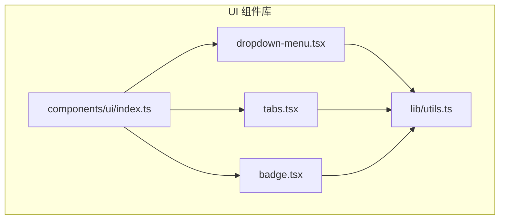
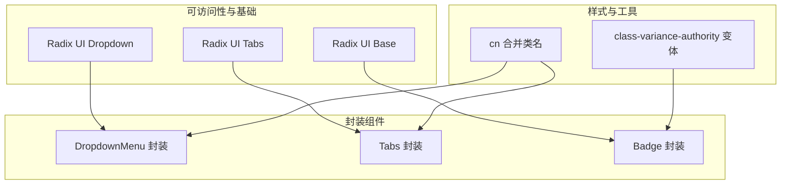
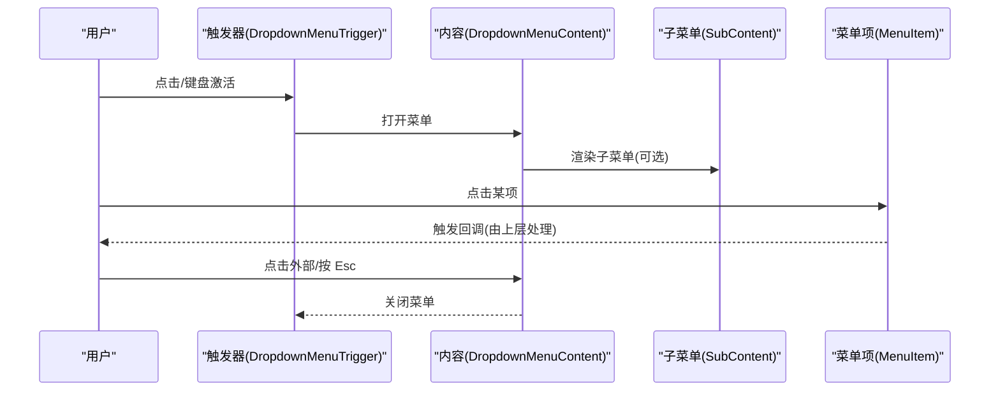
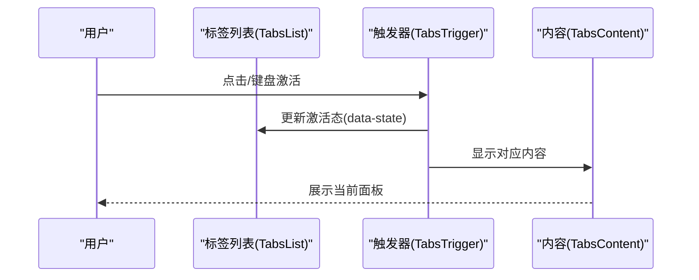
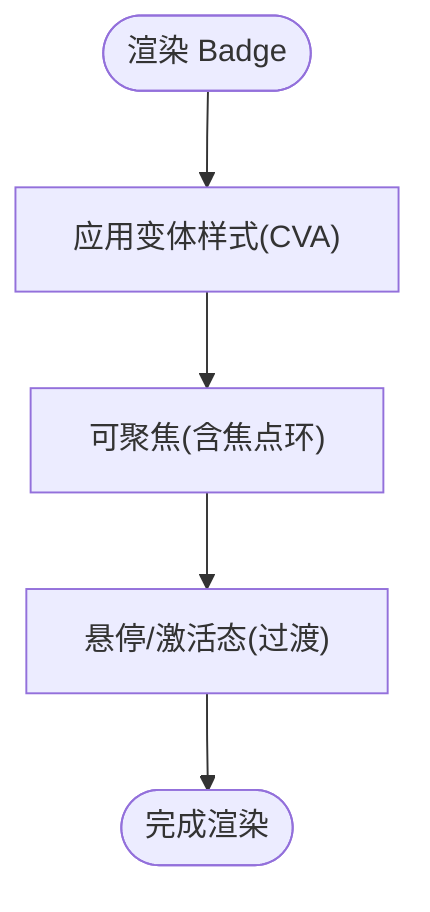
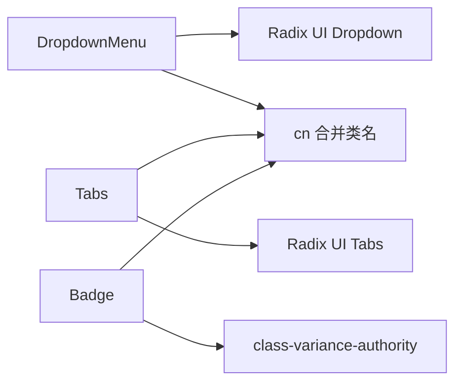

# 导航组件

<cite>
**本文引用的文件**
- [dropdown-menu.tsx](file://app/src/components/ui/dropdown-menu.tsx)
- [tabs.tsx](file://app/src/components/ui/tabs.tsx)
- [badge.tsx](file://app/src/components/ui/badge.tsx)
- [utils.ts](file://app/src/lib/utils.ts)
- [index.ts](file://app/src/components/ui/index.ts)
</cite>

## 目录
1. [简介](#简介)
2. [项目结构](#项目结构)
3. [核心组件](#核心组件)
4. [架构总览](#架构总览)
5. [详细组件分析](#详细组件分析)
6. [依赖关系分析](#依赖关系分析)
7. [性能考量](#性能考量)
8. [故障排查指南](#故障排查指南)
9. [结论](#结论)
10. [附录](#附录)

## 简介
本文件系统化梳理并说明导航相关组件的实现与使用，重点覆盖以下组件：
- 下拉菜单（DropdownMenu）
- 标签页（Tabs）
- 徽章（Badge）

文档从架构、数据流、交互模式、状态管理、事件处理、可访问性与键盘导航、组合使用与最佳实践等维度展开，并提供完整导航场景示例路径，帮助开发者快速理解与正确使用这些组件。

## 项目结构
导航组件位于应用前端的 UI 组件库中，采用 Radix UI 原子组件进行封装，结合 Tailwind CSS 类名与 class-variance-authority 实现变体样式，通过统一的导出入口集中暴露给业务页面使用。

图表来源
- [dropdown-menu.tsx:1-210](file://app/src/components/ui/dropdown-menu.tsx#L1-L210)
- [tabs.tsx:1-57](file://app/src/components/ui/tabs.tsx#L1-L57)
- [badge.tsx:1-36](file://app/src/components/ui/badge.tsx#L1-L36)
- [utils.ts](file://app/src/lib/utils.ts)
- [index.ts](file://app/src/components/ui/index.ts)

章节来源
- [dropdown-menu.tsx:1-210](file://app/src/components/ui/dropdown-menu.tsx#L1-L210)
- [tabs.tsx:1-57](file://app/src/components/ui/tabs.tsx#L1-L57)
- [badge.tsx:1-36](file://app/src/components/ui/badge.tsx#L1-L36)
- [utils.ts](file://app/src/lib/utils.ts)
- [index.ts](file://app/src/components/ui/index.ts)

## 核心组件
本节概览三个导航相关组件的职责与能力边界：
- 下拉菜单（DropdownMenu）：提供触发器、内容区、子菜单、复选/单选项、分隔符、快捷键提示等，支持嵌套与多级菜单。
- 标签页（Tabs）：提供选项卡列表、触发器与内容区，支持受控/非受控模式与键盘导航。
- 徽章（Badge）：用于状态或分类的轻量标识，支持多种视觉变体与可聚焦行为。

章节来源
- [dropdown-menu.tsx:1-210](file://app/src/components/ui/dropdown-menu.tsx#L1-L210)
- [tabs.tsx:1-57](file://app/src/components/ui/tabs.tsx#L1-L57)
- [badge.tsx:1-36](file://app/src/components/ui/badge.tsx#L1-L36)

## 架构总览
组件均基于 Radix UI 的语义化原生组件进行二次封装，确保可访问性与跨平台一致性；通过工具函数统一处理类名合并与样式变体，保证主题与暗色模式兼容。

图表来源
- [dropdown-menu.tsx:1-210](file://app/src/components/ui/dropdown-menu.tsx#L1-L210)
- [tabs.tsx:1-57](file://app/src/components/ui/tabs.tsx#L1-L57)
- [badge.tsx:1-36](file://app/src/components/ui/badge.tsx#L1-L36)
- [utils.ts](file://app/src/lib/utils.ts)

## 详细组件分析

### 下拉菜单（DropdownMenu）
- 设计要点
  - 使用 Portal 渲染内容，避免被父容器裁剪。
  - 支持子菜单（SubTrigger/SubContent）实现多级菜单。
  - 提供 CheckboxItem、RadioItem、Label、Separator、Shortcut 等丰富子元素。
  - 内置动画与过渡，适配明暗主题。
- 状态与事件
  - 通过 Radix UI 的内部状态控制开合与激活态，组件不直接暴露受控值，适合非受控场景。
  - 子项点击事件由上层业务监听并处理。
- 可访问性与键盘
  - 自动管理焦点与键盘方向导航，支持 Esc 关闭、Enter/Space 触发、左右进入/退出子菜单。
- 复杂度与性能
  - 渲染为轻量 DOM 结构，动画通过 CSS 过渡实现，性能开销低。
- 使用建议
  - 大型菜单建议拆分为多个子菜单，避免一次性渲染过多节点。
  - 长列表配合滚动容器或虚拟化策略。

图表来源
- [dropdown-menu.tsx:10-210](file://app/src/components/ui/dropdown-menu.tsx#L10-L210)

章节来源
- [dropdown-menu.tsx:1-210](file://app/src/components/ui/dropdown-menu.tsx#L1-L210)

### 标签页（Tabs）
- 设计要点
  - Root 管理当前激活的面板；List/Trigger 提供选项卡集合；Content 容纳对应内容。
  - 支持 data-[state=active] 样式，便于高亮当前标签。
- 状态与事件
  - 默认非受控，通过 defaultValue 或 value 控制激活项（非受控时由内部状态维护）。
  - onChange 回调可用于埋点或副作用。
- 可访问性与键盘
  - 键盘支持左右方向键在标签间切换，Tab 切入内容区。
- 复杂度与性能
  - 激活态切换为 O(1)，内容惰性渲染，避免不必要的计算。
- 使用建议
  - 大量标签时考虑横向滚动或分组折叠。
  - 内容较多时启用懒加载或分页。

图表来源
- [tabs.tsx:9-57](file://app/src/components/ui/tabs.tsx#L9-L57)

章节来源
- [tabs.tsx:1-57](file://app/src/components/ui/tabs.tsx#L1-L57)

### 徽章（Badge）
- 设计要点
  - 使用 class-variance-authority 定义多种变体（默认、次要、破坏性、描边），支持边框与背景色随主题变化。
  - 提供可聚焦环与键盘可达性。
- 状态与事件
  - 仅展示用，通常不持有内部状态；如需交互，建议在父级容器中处理点击/键盘事件。
- 可访问性与键盘
  - 保持原生可聚焦性，支持 Enter/Space 触发。
- 复杂度与性能
  - 纯展示组件，渲染成本极低。
- 使用建议
  - 作为状态指示器时，搭配 Tooltip 提供额外说明。
  - 颜色选择遵循品牌与对比度规范。

图表来源
- [badge.tsx:9-36](file://app/src/components/ui/badge.tsx#L9-L36)

章节来源
- [badge.tsx:1-36](file://app/src/components/ui/badge.tsx#L1-L36)

## 依赖关系分析
- 组件依赖
  - DropdownMenu/Tabs 均依赖 Radix UI 原子组件，保证可访问性与跨浏览器一致性。
  - Badge 依赖 class-variance-authority 与 cn 工具。
- 工具函数
  - cn 负责安全合并类名，避免冲突与空值。
  - CVA 定义 Badge 的视觉变体，减少重复样式逻辑。
- 导出入口
  - 通过统一的 index.ts 暴露组件，便于按需引入与 Tree Shaking。

图表来源
- [dropdown-menu.tsx:1-210](file://app/src/components/ui/dropdown-menu.tsx#L1-L210)
- [tabs.tsx:1-57](file://app/src/components/ui/tabs.tsx#L1-L57)
- [badge.tsx:1-36](file://app/src/components/ui/badge.tsx#L1-L36)
- [utils.ts](file://app/src/lib/utils.ts)
- [index.ts](file://app/src/components/ui/index.ts)

章节来源
- [utils.ts](file://app/src/lib/utils.ts)
- [index.ts](file://app/src/components/ui/index.ts)

## 性能考量
- 动画与渲染
  - 下拉菜单与标签页的内容区使用 Portal 渲染，避免布局抖动；动画通过 CSS 过渡实现，帧率稳定。
- 样式合并
  - cn 仅在运行时合并类名，避免构建期复杂计算；Badge 的变体通过 CVA 编译期优化。
- 大数据场景
  - 下拉菜单建议限制一次性渲染项数，必要时采用虚拟滚动或分页。
  - 标签页过多时，优先显示关键标签，其他折叠至“更多”。

## 故障排查指南
- 下拉菜单无法打开
  - 检查触发器是否包裹在 Root 内部，确认未被父级容器裁剪。
  - 确认未禁用触发器或内容区。
- 子菜单不显示
  - 确保 SubTrigger 与 SubContent 成对出现且处于同一 Group。
- 标签页切换无效
  - 若使用受控模式，确保传入的 value 与 onChange 正确联动。
  - 检查 data-[state=active] 是否被覆盖。
- 徽章样式异常
  - 确认变体名称拼写正确，未被外层样式覆盖。
  - 检查主题切换后是否正确应用暗色模式类名。

## 结论
本导航组件库以 Radix UI 为基础，结合 Tailwind 与 CVA，提供了高可访问性、主题友好、易于扩展的导航组件。通过合理的状态管理与事件处理，可在菜单导航、标签切换、状态标识、分页浏览等场景中高效落地。

## 附录
- 分页（Pagination）组件
  - 当前仓库未提供独立的分页 UI 组件文件。若需分页功能，可参考第三方库或基于现有 Tabs/DropdownMenu 组合实现。
  - 如需使用，请在业务页面中引入相应分页逻辑或自定义组件文件。