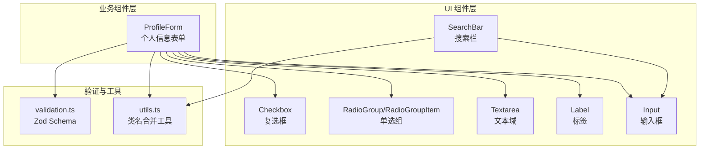
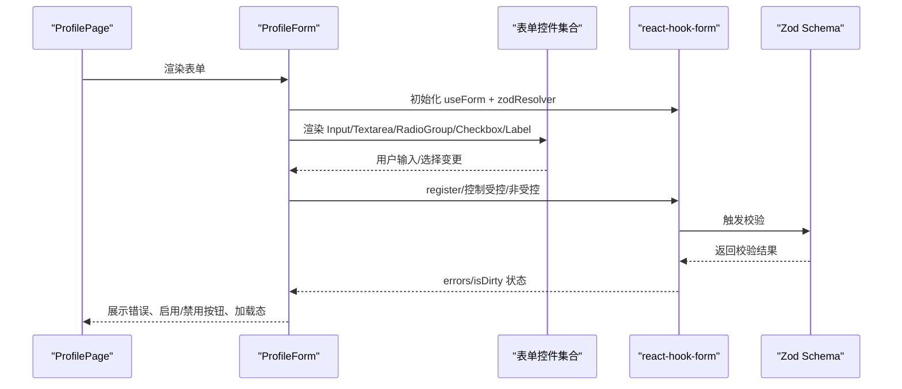
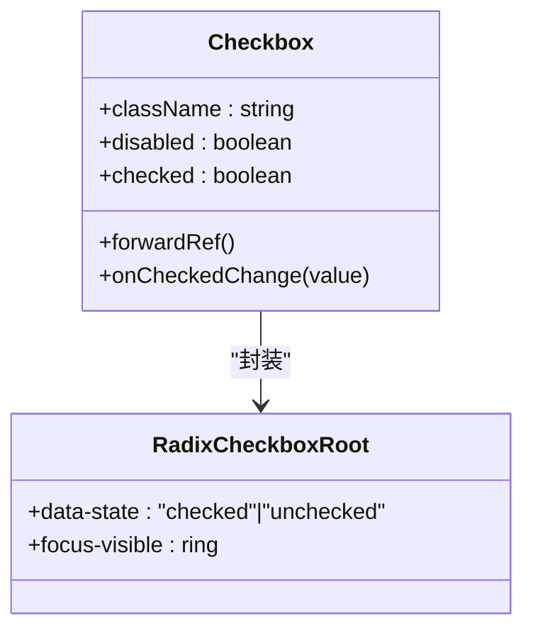
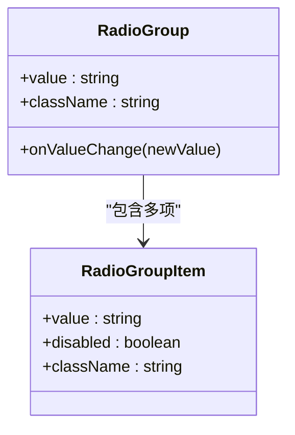
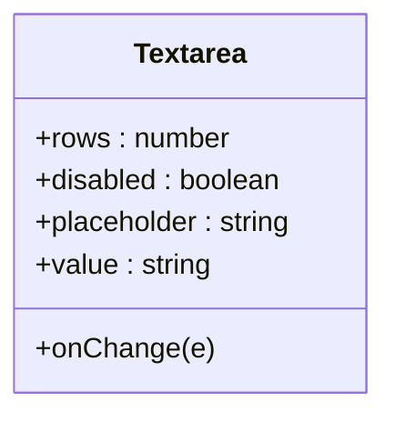
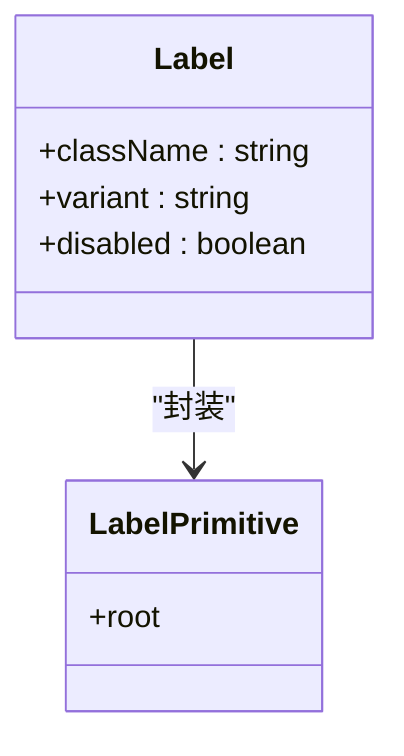
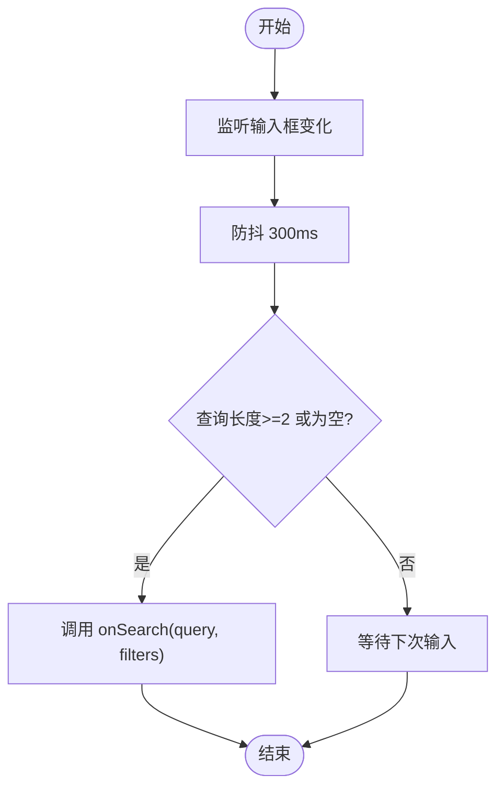
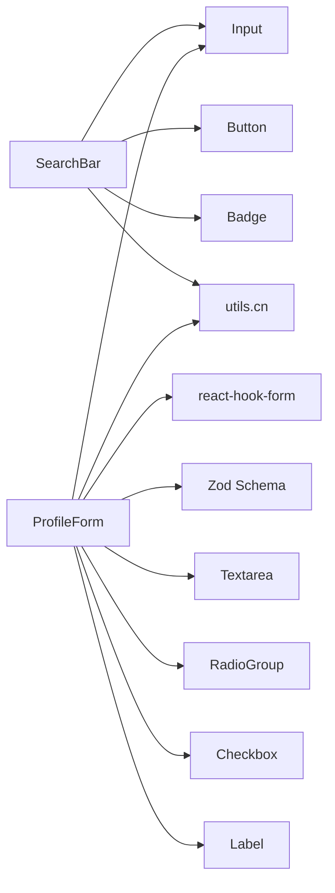

# 表单控件组件

<cite>
**本文引用的文件**
- [checkbox.tsx](file://app/src/components/ui/checkbox.tsx)
- [radio-group.tsx](file://app/src/components/ui/radio-group.tsx)
- [textarea.tsx](file://app/src/components/ui/textarea.tsx)
- [label.tsx](file://app/src/components/ui/label.tsx)
- [search-bar.tsx](file://app/src/components/ui/search-bar.tsx)
- [input.tsx](file://app/src/components/ui/input.tsx)
- [ProfileForm.tsx](file://app/src/components/business/ProfileForm.tsx)
- [validation.ts](file://app/src/types/validation.ts)
- [ProfilePage.tsx](file://app/src/pages/ProfilePage.tsx)
- [utils.ts](file://app/src/lib/utils.ts)
</cite>

## 目录
1. [引言](#引言)
2. [项目结构](#项目结构)
3. [核心组件](#核心组件)
4. [架构总览](#架构总览)
5. [详细组件分析](#详细组件分析)
6. [依赖关系分析](#依赖关系分析)
7. [性能考虑](#性能考虑)
8. [故障排查指南](#故障排查指南)
9. [结论](#结论)
10. [附录](#附录)

## 引言
本文件聚焦于表单控件组件的设计与实现，覆盖复选框（Checkbox）、单选组（RadioGroup）、文本域（Textarea）、标签（Label）、搜索栏（SearchBar）等常用表单元素，并结合实际业务场景（如 ProfileForm 个人信息表单）展示如何进行表单验证、数据绑定、错误提示、可访问性支持与键盘导航、屏幕阅读器兼容性，以及表单组合使用模式与最佳实践。

## 项目结构
这些表单组件主要位于应用前端的 UI 组件层与业务组件层：
- UI 层基础组件：checkbox、radio-group、textarea、label、search-bar、input
- 业务表单示例：ProfileForm（基于 react-hook-form + Zod）
- 验证规则：validation.ts（Zod Schema）
- 页面集成：ProfilePage.tsx（页面容器）

图表来源
- [checkbox.tsx:1-30](file://app/src/components/ui/checkbox.tsx#L1-L30)
- [radio-group.tsx:1-40](file://app/src/components/ui/radio-group.tsx#L1-L40)
- [textarea.tsx:1-29](file://app/src/components/ui/textarea.tsx#L1-L29)
- [label.tsx:1-23](file://app/src/components/ui/label.tsx#L1-L23)
- [search-bar.tsx:1-155](file://app/src/components/ui/search-bar.tsx#L1-L155)
- [input.tsx:1-26](file://app/src/components/ui/input.tsx#L1-L26)
- [ProfileForm.tsx:1-249](file://app/src/components/business/ProfileForm.tsx#L1-L249)
- [validation.ts:1-86](file://app/src/types/validation.ts#L1-L86)
- [utils.ts:1-10](file://app/src/lib/utils.ts#L1-L10)

章节来源
- [checkbox.tsx:1-30](file://app/src/components/ui/checkbox.tsx#L1-L30)
- [radio-group.tsx:1-40](file://app/src/components/ui/radio-group.tsx#L1-L40)
- [textarea.tsx:1-29](file://app/src/components/ui/textarea.tsx#L1-L29)
- [label.tsx:1-23](file://app/src/components/ui/label.tsx#L1-L23)
- [search-bar.tsx:1-155](file://app/src/components/ui/search-bar.tsx#L1-L155)
- [input.tsx:1-26](file://app/src/components/ui/input.tsx#L1-L26)
- [ProfileForm.tsx:1-249](file://app/src/components/business/ProfileForm.tsx#L1-L249)
- [validation.ts:1-86](file://app/src/types/validation.ts#L1-L86)
- [utils.ts:1-10](file://app/src/lib/utils.ts#L1-L10)

## 核心组件
- 复选框（Checkbox）：基于 Radix UI 的原生语义化封装，支持禁用、焦点态、选中态样式，便于无障碍访问。
- 单选组（RadioGroup/RadioGroupItem）：Radix UI 单选组根容器与单项，提供互斥选择能力与视觉指示器。
- 文本域（Textarea）：继承原生 textarea，统一边框、内边距、禁用态与焦点态样式。
- 标签（Label）：Radix UI 标签，配合 peer 状态类实现“控件激活时标签样式联动”。
- 搜索栏（SearchBar）：内置防抖、过滤器面板、清空、高亮显示等能力，支持扩展筛选项。
- 输入框（Input）：通用输入组件，统一尺寸、边框、禁用态与焦点态样式。

章节来源
- [checkbox.tsx:1-30](file://app/src/components/ui/checkbox.tsx#L1-L30)
- [radio-group.tsx:1-40](file://app/src/components/ui/radio-group.tsx#L1-L40)
- [textarea.tsx:1-29](file://app/src/components/ui/textarea.tsx#L1-L29)
- [label.tsx:1-23](file://app/src/components/ui/label.tsx#L1-L23)
- [search-bar.tsx:1-155](file://app/src/components/ui/search-bar.tsx#L1-L155)
- [input.tsx:1-26](file://app/src/components/ui/input.tsx#L1-L26)

## 架构总览
下图展示了表单控件在业务中的典型调用链：页面容器加载数据 → 业务表单组件渲染控件 → 控件触发状态变化 → 表单校验器收集错误 → UI 展示错误与交互反馈。

图表来源
- [ProfileForm.tsx:1-249](file://app/src/components/business/ProfileForm.tsx#L1-L249)
- [validation.ts:1-86](file://app/src/types/validation.ts#L1-L86)

## 详细组件分析

### 复选框（Checkbox）
- 设计要点
  - 基于 Radix UI Root，通过 data-[state=checked] 与 peer 伪类联动实现选中态样式。
  - 支持禁用态、焦点态（ring），保证键盘可达与屏幕阅读器识别。
- 接口与行为
  - 属性：继承 Radix UI Root 的所有 HTML 属性；支持 className 扩展样式。
  - 状态：checked/disabled/focus-visible。
  - 事件：由父组件通过受控或非受控方式管理 checked 状态。
- 可访问性
  - 使用原生语义与键盘导航；与 Label 搭配时，点击标签可切换复选框。
- 典型用法
  - 与 react-hook-form 结合时，通过 register 获取 name、onChange、onBlur、value、checked 等属性。

图表来源
- [checkbox.tsx:1-30](file://app/src/components/ui/checkbox.tsx#L1-L30)

章节来源
- [checkbox.tsx:1-30](file://app/src/components/ui/checkbox.tsx#L1-L30)

### 单选组（RadioGroup）
- 设计要点
  - RadioGroup 作为根容器，RadioGroupItem 为单项；Indicator 显示选中圆点。
  - 支持禁用、焦点态与互斥选择。
- 接口与行为
  - RadioGroup：className、value、onValueChange。
  - RadioGroupItem：className、value、disabled。
- 可访问性
  - 键盘方向键可在组内循环选择；与 Label 搭配提升可读性。
- 典型用法
  - ProfileForm 中用于性别选择（male/female/other）。

图表来源
- [radio-group.tsx:1-40](file://app/src/components/ui/radio-group.tsx#L1-L40)

章节来源
- [radio-group.tsx:1-40](file://app/src/components/ui/radio-group.tsx#L1-L40)

### 文本域（Textarea）
- 设计要点
  - 统一样式：边框、背景、内边距、禁用态、焦点态 ring。
  - 继承原生 textarea 的可扩展性与无障碍特性。
- 接口与行为
  - 属性：继承 textarea 原生属性；支持 className。
  - 状态：disabled、focus-visible。
- 典型用法
  - ProfileForm 中用于“个人简介”，支持多行输入与字数限制。

图表来源
- [textarea.tsx:1-29](file://app/src/components/ui/textarea.tsx#L1-L29)

章节来源
- [textarea.tsx:1-29](file://app/src/components/ui/textarea.tsx#L1-L29)

### 标签（Label）
- 设计要点
  - 基于 Radix UI Label，使用 cva 定义变体，结合 peer 状态类实现“控件激活时标签样式联动”。
  - 支持禁用态与字体权重控制。
- 接口与行为
  - 属性：className、variant（通过 cva）、以及 LabelPrimitive 的原生属性。
  - 状态：peer-disabled。
- 典型用法
  - 与 Input/Textarea/Checkbox/RadioGroup 搭配，点击标签可聚焦对应控件。

图表来源
- [label.tsx:1-23](file://app/src/components/ui/label.tsx#L1-L23)

章节来源
- [label.tsx:1-23](file://app/src/components/ui/label.tsx#L1-L23)

### 搜索栏（SearchBar）
- 功能特性
  - 防抖搜索：输入变化后延迟触发 onSearch，避免频繁请求。
  - 清空功能：一键清除查询词与筛选条件。
  - 可选筛选面板：支持类型筛选（全部/照片/相册/人物/标签）与重置。
  - 高亮显示：highlightText 将匹配关键字以 mark 标注。
- 接口与行为
  - 属性：onSearch(query, filters?)、placeholder、showFilters、className。
  - 内部状态：query、filters、showFilterPanel。
  - 事件：用户输入、点击筛选、点击清空、点击类型 Badge。
- 可访问性
  - 输入框具备占位符与清除按钮；筛选面板建议提供键盘导航与 ARIA 标签（可按需增强）。
- 典型用法
  - 适用于媒体资源检索场景（照片、相册、人物、标签）。

图表来源
- [search-bar.tsx:38-47](file://app/src/components/ui/search-bar.tsx#L38-L47)

章节来源
- [search-bar.tsx:1-155](file://app/src/components/ui/search-bar.tsx#L1-L155)

### 输入框（Input）
- 设计要点
  - 统一样式：边框、内边距、禁用态、焦点态 ring。
  - 支持多种 type（text/password/email 等）。
- 接口与行为
  - 属性：type、className、disabled、placeholder 等。
- 典型用法
  - ProfileForm 中用于邮箱、注册时间、真实姓名、花名、团队等字段。

章节来源
- [input.tsx:1-26](file://app/src/components/ui/input.tsx#L1-L26)

## 依赖关系分析
- 组件间依赖
  - SearchBar 依赖 Input/Button/Badge，内部使用 cn 合并类名。
  - ProfileForm 依赖 react-hook-form、Zod Schema、UI 组件（Input/Textarea/RadioGroup/Checkbox/Label）。
- 工具与样式
  - utils.ts 提供 cn（clsx + tailwind-merge）合并类名，贯穿多个组件。
- 验证规则
  - validation.ts 定义 profileSchema，ProfileForm 通过 zodResolver 应用到 useForm。

图表来源
- [search-bar.tsx:1-155](file://app/src/components/ui/search-bar.tsx#L1-L155)
- [input.tsx:1-26](file://app/src/components/ui/input.tsx#L1-L26)
- [ProfileForm.tsx:1-249](file://app/src/components/business/ProfileForm.tsx#L1-L249)
- [validation.ts:1-86](file://app/src/types/validation.ts#L1-L86)
- [utils.ts:1-10](file://app/src/lib/utils.ts#L1-L10)

章节来源
- [search-bar.tsx:1-155](file://app/src/components/ui/search-bar.tsx#L1-L155)
- [input.tsx:1-26](file://app/src/components/ui/input.tsx#L1-L26)
- [ProfileForm.tsx:1-249](file://app/src/components/business/ProfileForm.tsx#L1-L249)
- [validation.ts:1-86](file://app/src/types/validation.ts#L1-L86)
- [utils.ts:1-10](file://app/src/lib/utils.ts#L1-L10)

## 性能考虑
- 防抖策略：SearchBar 对 onSearch 使用 300ms 防抖，减少无效请求与重绘。
- 受控与非受控：ProfileForm 使用 react-hook-form 管理受控状态，避免全量重渲染。
- 样式合并：统一使用 cn 合并类名，减少不必要的样式冲突与回流。
- 字段级校验：Zod Schema 仅在必要时触发，配合 isDirty 控制提交按钮可用状态。

## 故障排查指南
- 表单未触发校验
  - 检查是否正确传入 zodResolver 与 schema。
  - 确认 register 返回的属性已绑定到具体控件。
- 错误信息不显示
  - 确认 errors 对应字段存在且 message 正确。
  - 检查控件是否被禁用（disabled 会跳过校验）。
- 搜索无响应
  - 确认 onSearch 回调是否接收 query 与 filters。
  - 检查防抖逻辑：查询长度需满足 ≥2 或允许空查询。
- 可访问性问题
  - 确保每个输入框都有关联 Label，或使用 aria-labelledby。
  - 单选组使用 RadioGroup 并设置 value/onValueChange。
  - 复选框与单选框提供明确的键盘操作路径。

章节来源
- [ProfileForm.tsx:1-249](file://app/src/components/business/ProfileForm.tsx#L1-L249)
- [validation.ts:1-86](file://app/src/types/validation.ts#L1-L86)
- [search-bar.tsx:1-155](file://app/src/components/ui/search-bar.tsx#L1-L155)

## 结论
本文档系统梳理了复选框、单选组、文本域、标签、搜索栏等表单控件的实现与使用方法，并结合 ProfileForm 的真实业务场景，展示了表单验证、数据绑定、错误提示、可访问性与键盘导航的最佳实践。通过合理运用 react-hook-form + Zod、Radix UI 语义化控件与统一的样式工具，可以构建出一致、可靠、易维护的表单体验。

## 附录

### 表单场景使用示例（概要）
- 个人信息表单（ProfileForm）
  - 字段：邮箱（只读）、注册时间（只读）、真实姓名（必填）、花名（可选）、性别（可选）、团队（可选）、个人简介（可选）。
  - 验证：Zod Schema 控制最小/最大长度与可选性。
  - 交互：编辑/保存/取消；加载态与 Toast 提示。
- 搜索与筛选（SearchBar）
  - 防抖搜索、清空、类型筛选、重置、高亮显示。

章节来源
- [ProfileForm.tsx:1-249](file://app/src/components/business/ProfileForm.tsx#L1-L249)
- [ProfilePage.tsx:1-182](file://app/src/pages/ProfilePage.tsx#L1-L182)
- [search-bar.tsx:1-155](file://app/src/components/ui/search-bar.tsx#L1-L155)
- [validation.ts:1-86](file://app/src/types/validation.ts#L1-L86)