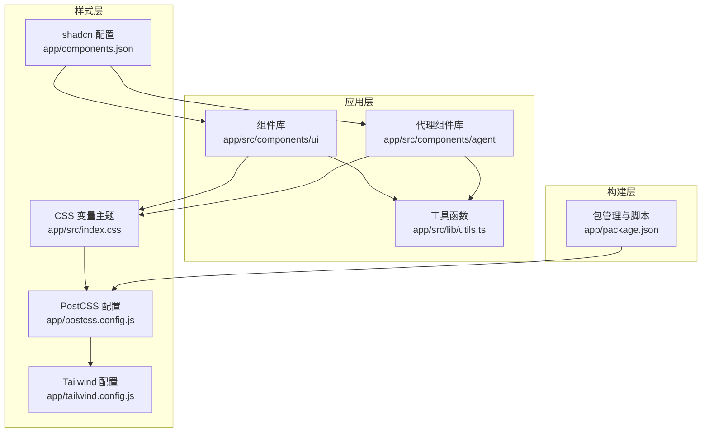
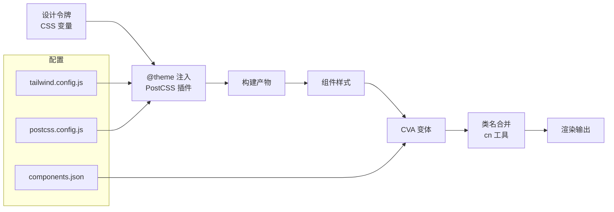
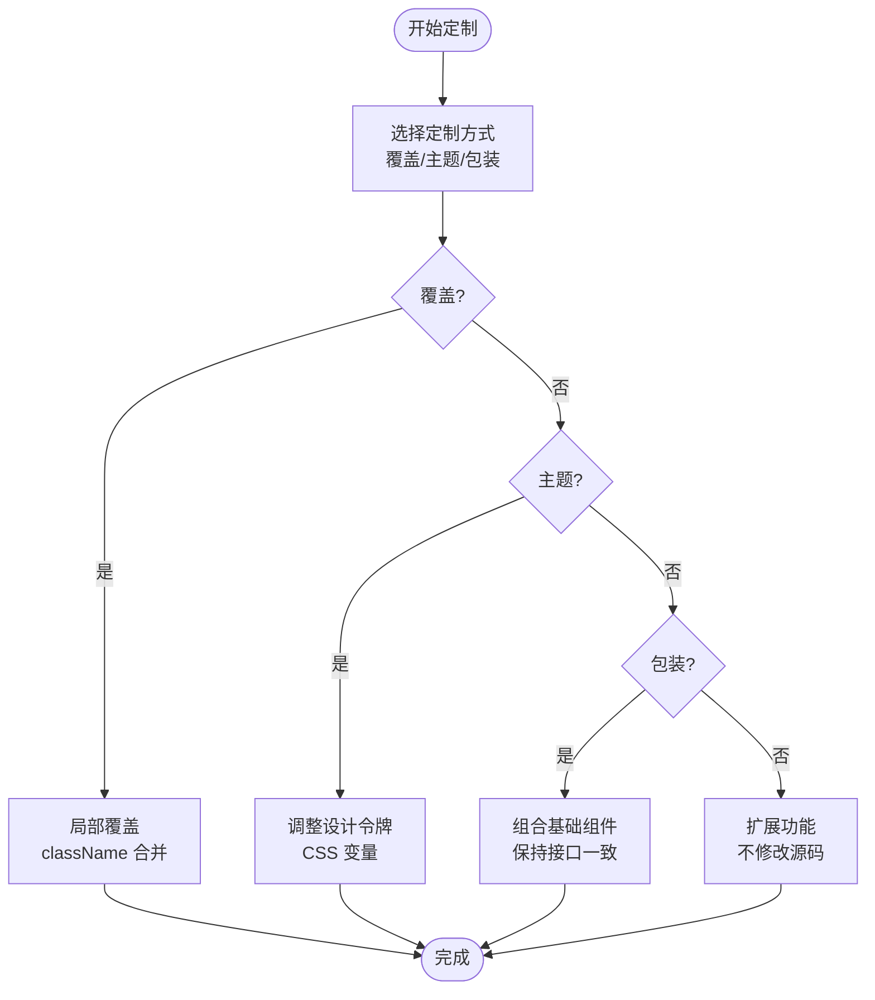
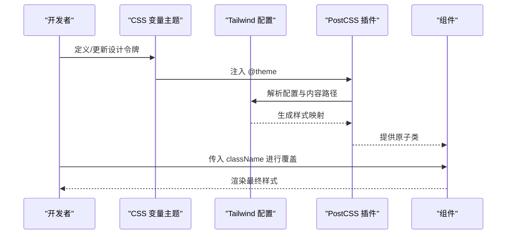
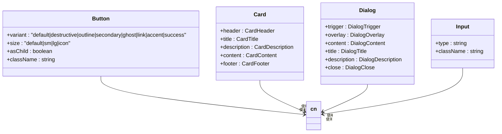
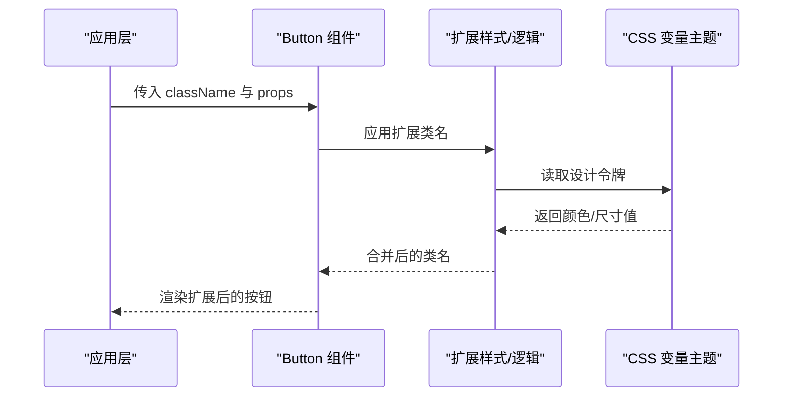
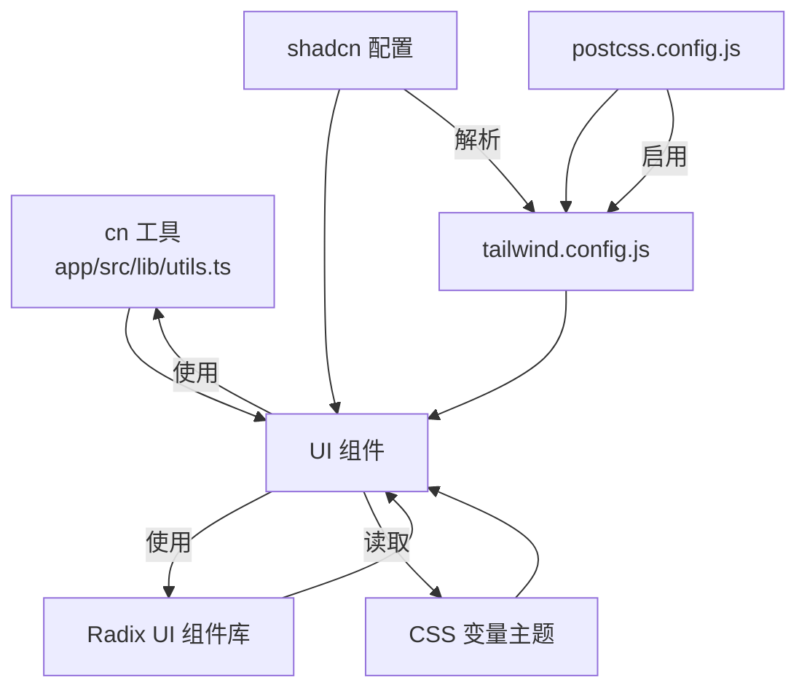

# 组件定制与扩展

<cite>
**本文档引用的文件**
- [app/tailwind.config.js](file://app/tailwind.config.js)
- [app/components.json](file://app/components.json)
- [app/postcss.config.js](file://app/postcss.config.js)
- [app/package.json](file://app/package.json)
- [app/src/index.css](file://app/src/index.css)
- [app/src/lib/utils.ts](file://app/src/lib/utils.ts)
- [app/src/components/ui/button.tsx](file://app/src/components/ui/button.tsx)
- [app/src/components/ui/card.tsx](file://app/src/components/ui/card.tsx)
- [app/src/components/ui/dialog.tsx](file://app/src/components/ui/dialog.tsx)
- [app/src/components/ui/input.tsx](file://app/src/components/ui/input.tsx)
- [app/src/components/agent/index.ts](file://app/src/components/agent/index.ts)
</cite>

## 目录
1. [简介](#简介)
2. [项目结构](#项目结构)
3. [核心组件](#核心组件)
4. [架构总览](#架构总览)
5. [详细组件分析](#详细组件分析)
6. [依赖关系分析](#依赖关系分析)
7. [性能考量](#性能考量)
8. [故障排查指南](#故障排查指南)
9. [结论](#结论)
10. [附录](#附录)

## 简介
本文件面向需要在现有组件基础上进行定制与扩展的开发者，系统讲解以下主题：
- 基于现有组件的样式覆盖与主题定制方法
- Tailwind CSS v4 的定制配置（新增颜色、新增样式、覆盖组件样式）
- 自定义组件的设计原则、属性接口与样式系统集成
- 在不修改源码的前提下扩展组件功能的实际案例
- 组件库的版本管理、升级策略与向后兼容性注意事项
- 如何将新组件贡献到设计系统中

## 项目结构
前端采用 React + TypeScript + Vite 构建，Tailwind CSS v4 作为原子化样式框架，配合 shadcn/ui 的组件风格与约定。核心样式与主题通过 CSS 变量集中管理，并在构建时由 PostCSS 插件注入。

**图表来源**
- [app/src/index.css:1-218](file://app/src/index.css#L1-L218)
- [app/tailwind.config.js:1-39](file://app/tailwind.config.js#L1-L39)
- [app/postcss.config.js:1-6](file://app/postcss.config.js#L1-L6)
- [app/components.json:1-21](file://app/components.json#L1-L21)
- [app/package.json:1-141](file://app/package.json#L1-L141)

**章节来源**
- [app/src/index.css:1-218](file://app/src/index.css#L1-L218)
- [app/tailwind.config.js:1-39](file://app/tailwind.config.js#L1-L39)
- [app/postcss.config.js:1-6](file://app/postcss.config.js#L1-L6)
- [app/components.json:1-21](file://app/components.json#L1-L21)
- [app/package.json:1-141](file://app/package.json#L1-L141)

## 核心组件
本项目的核心 UI 组件遵循“变体 + 尺寸”的设计系统，使用 class-variance-authority (CVA) 定义变体，结合 cn 工具合并类名，确保一致的外观与行为。

- 按钮组件（Button）：支持多种变体（默认、危险、边框、次要、幽灵、链接、强调、成功）与尺寸（默认、小、大、图标），通过 CSS 变量从主题中读取颜色。
- 卡片组件（Card）：包含卡片容器及其子组件（头部、标题、描述、内容、底部），统一使用主题色与阴影。
- 对话框组件（Dialog）：基于 Radix UI 实现，内置动画与可访问性特性，使用卡片背景与边框。
- 输入框组件（Input）：基础输入控件，继承主题边框与焦点环样式。

这些组件均以最小耦合的方式导出，便于二次封装与扩展。

**章节来源**
- [app/src/components/ui/button.tsx:1-64](file://app/src/components/ui/button.tsx#L1-L64)
- [app/src/components/ui/card.tsx:1-59](file://app/src/components/ui/card.tsx#L1-L59)
- [app/src/components/ui/dialog.tsx:1-105](file://app/src/components/ui/dialog.tsx#L1-L105)
- [app/src/components/ui/input.tsx:1-26](file://app/src/components/ui/input.tsx#L1-L26)

## 架构总览
Tailwind v4 通过 CSS 变量集中管理设计令牌，再由 PostCSS 插件在构建阶段注入实际值；组件层通过 CVA 与 cn 工具组合类名，形成可定制的视觉系统。

**图表来源**
- [app/src/index.css:7-62](file://app/src/index.css#L7-L62)
- [app/tailwind.config.js:8-38](file://app/tailwind.config.js#L8-L38)
- [app/components.json:6-12](file://app/components.json#L6-L12)
- [app/postcss.config.js:1-6](file://app/postcss.config.js#L1-L6)
- [app/src/lib/utils.ts:7-9](file://app/src/lib/utils.ts#L7-L9)

## 详细组件分析

### 组件定制与扩展方法
- 样式覆盖
  - 通过为组件传入额外的 className，利用 cn 工具进行类名合并，实现局部覆盖。
  - 对于需要全局覆盖的场景，可在应用入口的 CSS 中使用更具体的类选择器或伪类覆盖默认样式。
- 主题定制
  - 在 CSS 变量层调整设计令牌（如主色、次色、强调色、边框、输入框等），即可影响所有使用该变量的组件。
  - 支持浅色/深色模式切换，通过根选择器与暗色变体规则实现。
- 组件包装
  - 使用 asChild 模式或组合子组件（如 CardHeader/CardContent）进行语义化包装。
  - 通过组合多个基础组件形成复合组件，保持接口一致与样式统一。

**图表来源**
- [app/src/lib/utils.ts:7-9](file://app/src/lib/utils.ts#L7-L9)
- [app/src/index.css:64-173](file://app/src/index.css#L64-L173)
- [app/src/components/ui/card.tsx:8-58](file://app/src/components/ui/card.tsx#L8-L58)

**章节来源**
- [app/src/lib/utils.ts:1-10](file://app/src/lib/utils.ts#L1-L10)
- [app/src/index.css:64-173](file://app/src/index.css#L64-L173)
- [app/src/components/ui/card.tsx:1-59](file://app/src/components/ui/card.tsx#L1-L59)

### Tailwind CSS 定制配置详解
- 新增颜色
  - 在 CSS 变量中新增设计令牌（如 --color-*），并在 :root 与 .dark 中分别定义浅色/深色值。
  - 在 tailwind.config.js 的 theme.extend 中补充必要的非 CSS 变量能力（如动画、keyframes）。
- 新样式定义
  - 在组件层通过 CVA 定义新变体，或在应用层新增工具类（utility classes）。
  - 使用 @apply 或直接在组件上使用类名实现复用。
- 组件样式覆盖
  - 通过 className 层叠与 cn 合并，优先级控制在组件外部传入的类名。
  - 对于复杂覆盖，建议在应用层新增专用样式文件，避免污染组件内部逻辑。

**图表来源**
- [app/src/index.css:7-62](file://app/src/index.css#L7-L62)
- [app/tailwind.config.js:9-38](file://app/tailwind.config.js#L9-L38)
- [app/postcss.config.js:1-6](file://app/postcss.config.js#L1-L6)
- [app/src/lib/utils.ts:7-9](file://app/src/lib/utils.ts#L7-L9)

**章节来源**
- [app/src/index.css:7-62](file://app/src/index.css#L7-L62)
- [app/tailwind.config.js:13-38](file://app/tailwind.config.js#L13-L38)
- [app/postcss.config.js:1-6](file://app/postcss.config.js#L1-L6)
- [app/src/lib/utils.ts:7-9](file://app/src/lib/utils.ts#L7-L9)

### 创建自定义组件
- 设计原则
  - 保持与现有组件一致的视觉语言与交互模式。
  - 明确属性接口（props），区分必需与可选参数，提供合理的默认值。
  - 使用 CVA 定义变体，使用 cn 合并类名，确保可扩展性。
- 属性接口定义
  - 参考现有组件的 Props 接口，结合 Radix UI 的原生属性进行扩展。
  - 对于复合组件，明确子组件的职责与组合关系。
- 样式系统集成
  - 优先使用 CSS 变量与主题色，保证浅/深色模式一致性。
  - 在组件层避免硬编码颜色与尺寸，必要时通过 props 支持覆盖。

**图表来源**
- [app/src/components/ui/button.tsx:48-51](file://app/src/components/ui/button.tsx#L48-L51)
- [app/src/components/ui/card.tsx:8-58](file://app/src/components/ui/card.tsx#L8-L58)
- [app/src/components/ui/dialog.tsx:9-104](file://app/src/components/ui/dialog.tsx#L9-L104)
- [app/src/components/ui/input.tsx:8-25](file://app/src/components/ui/input.tsx#L8-L25)
- [app/src/lib/utils.ts:7-9](file://app/src/lib/utils.ts#L7-L9)

**章节来源**
- [app/src/components/ui/button.tsx:1-64](file://app/src/components/ui/button.tsx#L1-L64)
- [app/src/components/ui/card.tsx:1-59](file://app/src/components/ui/card.tsx#L1-L59)
- [app/src/components/ui/dialog.tsx:1-105](file://app/src/components/ui/dialog.tsx#L1-L105)
- [app/src/components/ui/input.tsx:1-26](file://app/src/components/ui/input.tsx#L1-L26)
- [app/src/lib/utils.ts:1-10](file://app/src/lib/utils.ts#L1-L10)

### 扩展案例：在不修改源码的情况下扩展功能
- 案例一：为按钮组件增加新变体
  - 在应用层通过 className 覆盖默认样式，或在组件外部定义新变体类名。
  - 若需全局扩展，可在 CSS 变量中新增设计令牌，并在 tailwind.config.js 中补充动画/过渡等非 CSS 变量能力。
- 案例二：为对话框组件增加新布局
  - 通过组合 DialogHeader/DialogFooter 与自定义内容区域，保持与现有接口一致。
  - 使用 asChild 模式或 Portal 结构，确保可访问性与动画效果。
- 案例三：为输入组件增加状态反馈
  - 在组件外层包裹状态指示器（如错误提示、成功图标），通过 className 控制显示与样式。

**图表来源**
- [app/src/components/ui/button.tsx:53-61](file://app/src/components/ui/button.tsx#L53-L61)
- [app/src/index.css:17-62](file://app/src/index.css#L17-L62)
- [app/src/lib/utils.ts:7-9](file://app/src/lib/utils.ts#L7-L9)

**章节来源**
- [app/src/components/ui/button.tsx:1-64](file://app/src/components/ui/button.tsx#L1-L64)
- [app/src/index.css:17-62](file://app/src/index.css#L17-L62)
- [app/src/lib/utils.ts:1-10](file://app/src/lib/utils.ts#L1-L10)

### 版本管理、升级指南与向后兼容
- 版本管理
  - 使用语义化版本（SemVer），在 package.json 中维护主版本号，变更类型参考依赖更新范围。
- 升级策略
  - 先升级 Tailwind CSS 与 PostCSS 插件，验证构建是否通过。
  - 逐步升级 Radix UI、shadcn/ui 相关依赖，检查组件 API 是否有破坏性变更。
  - 使用 components.json 中的 aliases 与 tailwind.config.js 的 content 路径，确保扫描到新增组件。
- 向后兼容
  - 保持组件属性接口稳定，新增属性时提供默认值。
  - 对于破坏性变更，提供迁移指南与兼容层（如别名导出）。

**章节来源**
- [app/package.json:1-141](file://app/package.json#L1-L141)
- [app/components.json:1-21](file://app/components.json#L1-L21)
- [app/tailwind.config.js:9-12](file://app/tailwind.config.js#L9-L12)

### 贡献新组件到设计系统
- 设计规范
  - 遵循现有组件的视觉与交互模式，使用相同的变体与尺寸体系。
  - 在组件内使用 CVA 与 cn，确保可扩展性与一致性。
- 导出与命名
  - 在对应目录的 index.ts 中统一导出，保持模块化与可发现性。
  - 参考代理组件库的导出方式，提供清晰的命名空间。
- 验证与测试
  - 在本地预览组件，确保浅/深色模式与响应式表现正常。
  - 更新组件文档与示例，便于团队复用。

**章节来源**
- [app/src/components/agent/index.ts:1-20](file://app/src/components/agent/index.ts#L1-L20)

## 依赖关系分析
- 组件依赖
  - 组件普遍依赖 cn 工具进行类名合并，Radix UI 提供无障碍与可访问性基础。
  - 主题依赖 CSS 变量，通过 @theme 注入到构建产物中。
- 配置依赖
  - components.json 决定组件别名与 tailwind 配置路径。
  - tailwind.config.js 仅保留动画等无法在 CSS 中定义的能力。
  - postcss.config.js 仅启用 Tailwind CSS 插件。

**图表来源**
- [app/src/lib/utils.ts:7-9](file://app/src/lib/utils.ts#L7-L9)
- [app/src/components/ui/button.tsx:6-8](file://app/src/components/ui/button.tsx#L6-L8)
- [app/src/index.css:7-62](file://app/src/index.css#L7-L62)
- [app/components.json:6-19](file://app/components.json#L6-L19)
- [app/tailwind.config.js:8-38](file://app/tailwind.config.js#L8-L38)
- [app/postcss.config.js:1-6](file://app/postcss.config.js#L1-L6)

**章节来源**
- [app/src/lib/utils.ts:1-10](file://app/src/lib/utils.ts#L1-L10)
- [app/src/components/ui/button.tsx:1-64](file://app/src/components/ui/button.tsx#L1-L64)
- [app/src/index.css:1-218](file://app/src/index.css#L1-L218)
- [app/components.json:1-21](file://app/components.json#L1-L21)
- [app/tailwind.config.js:1-39](file://app/tailwind.config.js#L1-L39)
- [app/postcss.config.js:1-6](file://app/postcss.config.js#L1-L6)

## 性能考量
- 构建性能
  - 合理设置 tailwind.config.js 的 content 路径，避免扫描过多文件。
  - 使用 CSS 变量减少重复样式，降低产物体积。
- 运行时性能
  - 避免在渲染路径中进行昂贵的类名计算，尽量在组件外部准备好 className。
  - 复用组件与变体，减少不必要的 DOM 结构与样式分支。

## 故障排查指南
- 样式未生效
  - 检查 CSS 变量是否正确注入，确认 @theme 与 @variant 的使用位置。
  - 确认 tailwind.config.js 的 content 路径包含目标文件。
- 动画或过渡异常
  - 确认 tailwind.config.js 中的 animation/keyframes 配置正确。
  - 检查 PostCSS 插件是否启用且版本匹配。
- 组件可访问性问题
  - 确保使用了正确的 Radix UI 触发器与关闭机制。
  - 为交互元素提供可访问的标签与键盘支持。

**章节来源**
- [app/src/index.css:64-65](file://app/src/index.css#L64-L65)
- [app/tailwind.config.js:9-38](file://app/tailwind.config.js#L9-L38)
- [app/postcss.config.js:1-6](file://app/postcss.config.js#L1-L6)
- [app/src/components/ui/dialog.tsx:9-53](file://app/src/components/ui/dialog.tsx#L9-L53)

## 结论
通过 CSS 变量主题、CVA 变体与 cn 工具的组合，本项目实现了高度可定制的组件系统。开发者可以在不修改源码的前提下，通过样式覆盖、主题定制与组件包装等方式扩展功能；同时，借助完善的配置与构建流程，能够平滑地进行版本升级与向后兼容处理。建议在贡献新组件时遵循统一的接口与样式规范，确保设计系统的一致性与可维护性。

## 附录
- 快速参考
  - 新增颜色：在 CSS 变量中定义新令牌，并在 :root 与 .dark 中赋值。
  - 新增样式：在组件层使用 CVA 或在应用层新增工具类。
  - 覆盖组件样式：通过 className 与 cn 合并，控制优先级。
  - 扩展组件：组合子组件、提供新变体、保持接口一致。