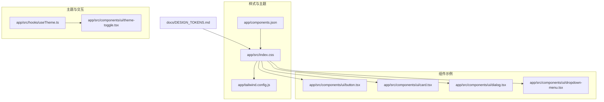
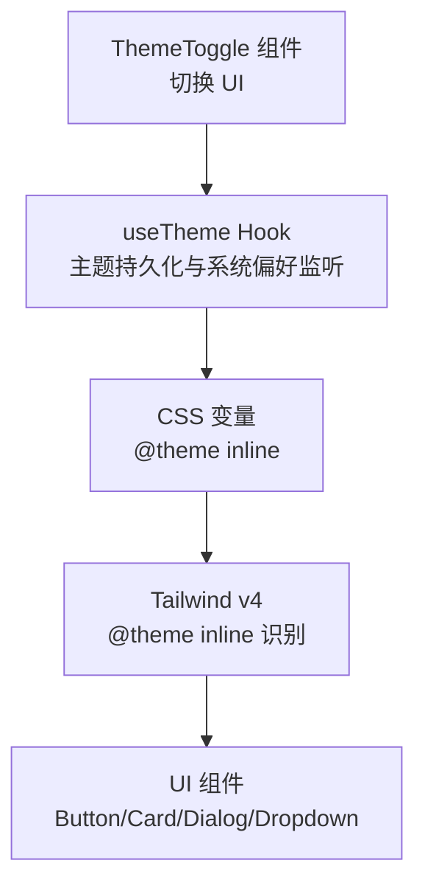
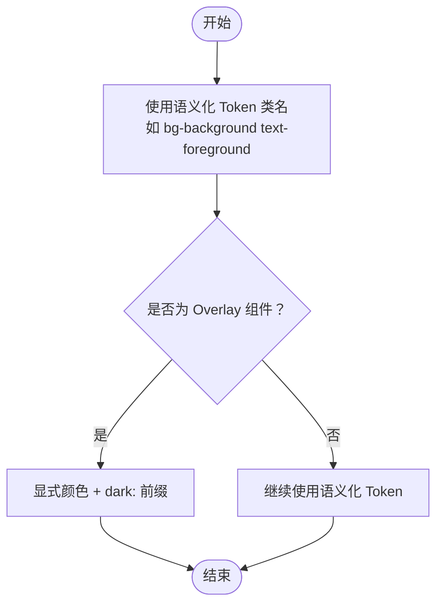
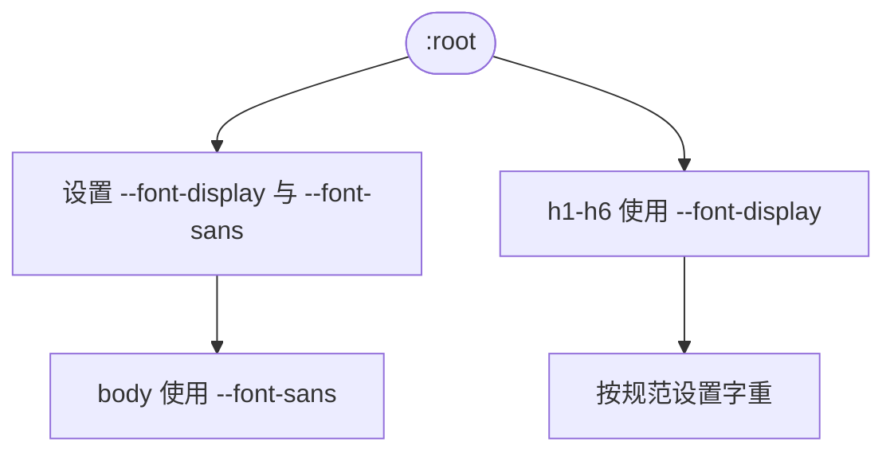
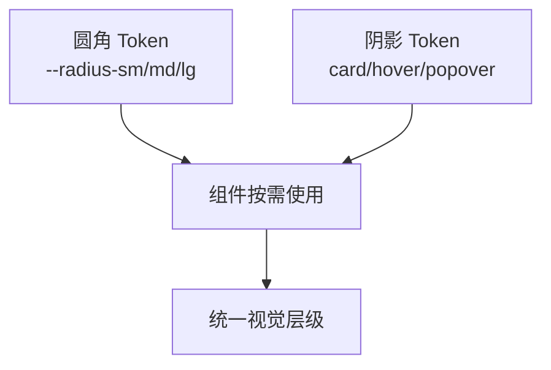
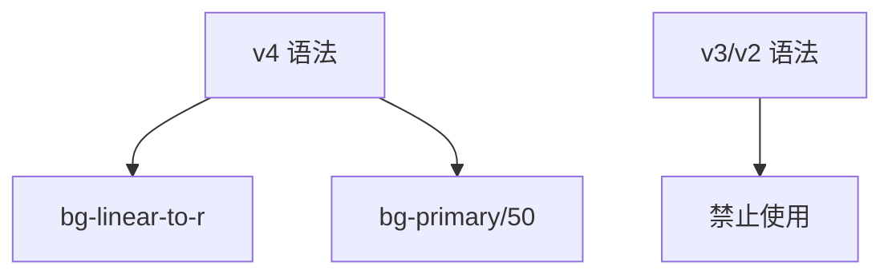
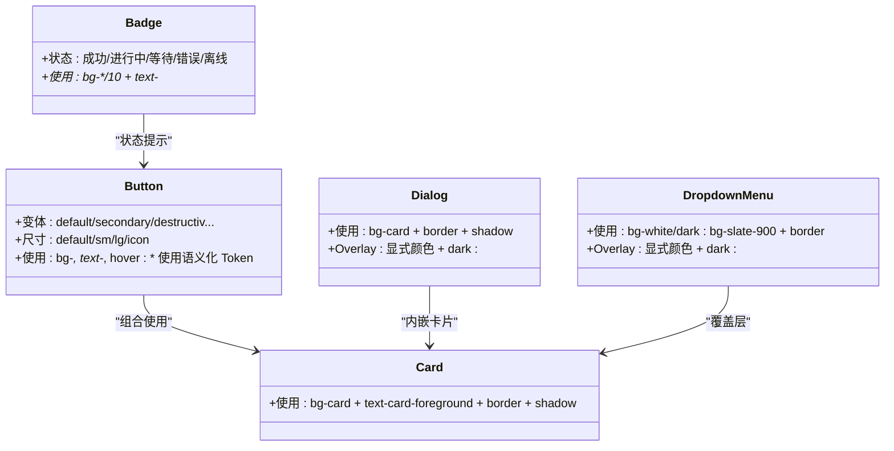
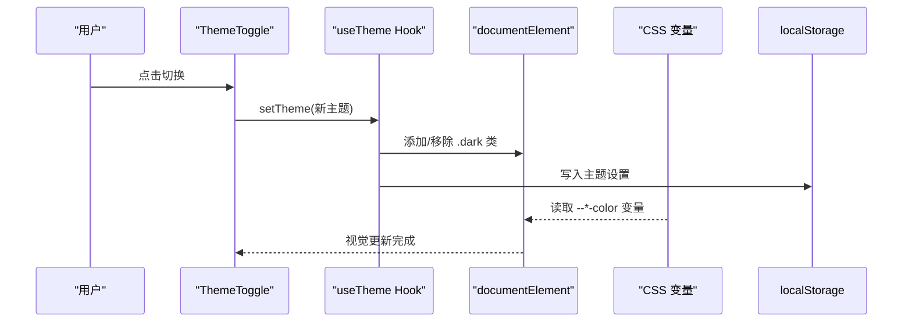
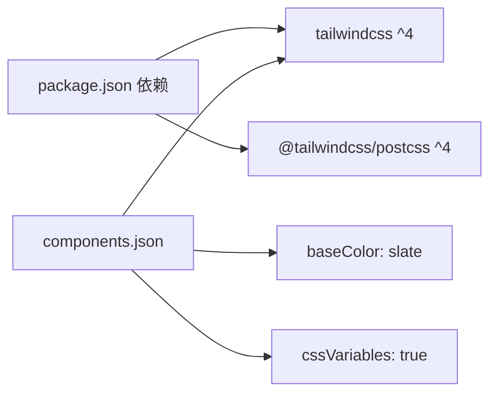

# 设计系统与设计令牌

<cite>
**本文引用的文件**
- [docs/DESIGN_TOKENS.md](file://docs/DESIGN_TOKENS.md)
- [app/src/index.css](file://app/src/index.css)
- [app/tailwind.config.js](file://app/tailwind.config.js)
- [app/components.json](file://app/components.json)
- [app/package.json](file://app/package.json)
- [app/src/hooks/useTheme.ts](file://app/src/hooks/useTheme.ts)
- [app/src/components/ui/theme-toggle.tsx](file://app/src/components/ui/theme-toggle.tsx)
- [app/src/components/ui/button.tsx](file://app/src/components/ui/button.tsx)
- [app/src/components/ui/card.tsx](file://app/src/components/ui/card.tsx)
- [app/src/components/ui/dialog.tsx](file://app/src/components/ui/dialog.tsx)
- [app/src/components/ui/dropdown-menu.tsx](file://app/src/components/ui/dropdown-menu.tsx)
</cite>

## 目录
1. [引言](#引言)
2. [项目结构](#项目结构)
3. [核心组件](#核心组件)
4. [架构总览](#架构总览)
5. [详细组件分析](#详细组件分析)
6. [依赖关系分析](#依赖关系分析)
7. [性能考量](#性能考量)
8. [故障排查指南](#故障排查指南)
9. [结论](#结论)
10. [附录](#附录)

## 引言
本文件系统化梳理基于 Tailwind CSS 4.1 的设计系统与设计令牌，覆盖颜色系统（primary、secondary、destructive、accent、success 等）、字体系统、圆角与阴影、透明度与渐变语法规范，并给出组件设计规范、主题切换与暗色模式适配、以及无障碍访问的实现方式。目标是帮助开发者在一致的设计语言下高效构建组件与页面，确保一致性、可访问性与响应式体验。

## 项目结构
设计系统相关资产主要分布在以下位置：
- 设计令牌文档：docs/DESIGN_TOKENS.md
- 样式入口与主题变量：app/src/index.css
- Tailwind v4 配置：app/tailwind.config.js
- 组件库配置：app/components.json
- 依赖与版本：app/package.json
- 主题切换逻辑与 UI：app/src/hooks/useTheme.ts、app/src/components/ui/theme-toggle.tsx
- 组件示例：app/src/components/ui/button.tsx、app/src/components/ui/card.tsx、app/src/components/ui/dialog.tsx、app/src/components/ui/dropdown-menu.tsx

图表来源
- [app/src/index.css:1-218](file://app/src/index.css#L1-L218)
- [app/tailwind.config.js:1-39](file://app/tailwind.config.js#L1-L39)
- [app/components.json:1-21](file://app/components.json#L1-L21)
- [docs/DESIGN_TOKENS.md:1-200](file://docs/DESIGN_TOKENS.md#L1-L200)

章节来源
- [docs/DESIGN_TOKENS.md:1-200](file://docs/DESIGN_TOKENS.md#L1-L200)
- [app/src/index.css:1-218](file://app/src/index.css#L1-L218)
- [app/tailwind.config.js:1-39](file://app/tailwind.config.js#L1-L39)
- [app/components.json:1-21](file://app/components.json#L1-L21)

## 核心组件
- 颜色系统：以语义化 Token 定义背景、前景、卡片、弹出层、主色、次色、强调色、危险/成功/警告等，并在亮色与暗色模式下分别提供对应值。
- 字体系统：显示字体（标题）与正文字体（正文），并通过 CSS 变量与 @theme inline 配置统一管理。
- 圆角与阴影：通过 CSS 变量与预设类名（如卡片、悬浮、弹出层阴影）统一视觉层级。
- Tailwind v4 规范：渐变语法与透明度语法的迁移与约束，确保与 v4 一致。
- 组件颜色规范：按钮、徽章等组件的变体与状态映射，遵循设计令牌。

章节来源
- [docs/DESIGN_TOKENS.md:13-182](file://docs/DESIGN_TOKENS.md#L13-L182)
- [app/src/index.css:7-62](file://app/src/index.css#L7-L62)
- [app/src/index.css:132-173](file://app/src/index.css#L132-L173)

## 架构总览
设计系统围绕“CSS 变量 + Tailwind v4 + 组件库”三层协作：
- CSS 变量层：在 @theme inline 中集中声明字体、圆角与颜色变量，并在 :root 与 .dark 中分别定义亮/暗两套值。
- Tailwind 层：通过 @theme inline 使 Tailwind v4 能识别 CSS 变量；tailwind.config.js 仅补充动画等无法在 CSS 中定义的配置。
- 组件层：UI 组件（如 Button、Card、Dialog、Dropdown）直接使用语义化 Token 类名，保证跨主题一致。

图表来源
- [app/src/index.css:7-62](file://app/src/index.css#L7-L62)
- [app/src/index.css:132-173](file://app/src/index.css#L132-L173)
- [app/tailwind.config.js:13-36](file://app/tailwind.config.js#L13-L36)
- [app/src/hooks/useTheme.ts:62-109](file://app/src/hooks/useTheme.ts#L62-L109)
- [app/src/components/ui/theme-toggle.tsx:36-108](file://app/src/components/ui/theme-toggle.tsx#L36-L108)

## 详细组件分析

### 颜色系统与语义化使用
- 语义化 Token：background、foreground、card、popover、primary、secondary、muted、muted-foreground、accent、destructive、success、warning、border、ring 等。
- 使用规范：优先使用语义化 Token 类名；Overlay 组件（下拉、模态、侧边栏）在移动端需显式颜色并配合 dark: 前缀。
- 状态映射：成功/警告/错误/信息/禁用的状态背景、文字、图标均与语义化 Token 对应，便于统一风格。

图表来源
- [docs/DESIGN_TOKENS.md:34-56](file://docs/DESIGN_TOKENS.md#L34-L56)
- [app/src/index.css:132-173](file://app/src/index.css#L132-L173)

章节来源
- [docs/DESIGN_TOKENS.md:15-56](file://docs/DESIGN_TOKENS.md#L15-L56)
- [app/src/index.css:17-51](file://app/src/index.css#L17-L51)

### 字体系统与排版
- 字体家族：显示字体（标题）与正文字体（正文），通过 CSS 变量统一注入。
- 字重规范：正文 Regular、强调 Medium、小标题 Semi-bold、标题 Bold、特大标题 Extra-bold。
- 标题与正文自动选择字体族，确保阅读层级清晰。

图表来源
- [app/src/index.css:8-10](file://app/src/index.css#L8-L10)
- [app/src/index.css:179-200](file://app/src/index.css#L179-L200)
- [docs/DESIGN_TOKENS.md:61-91](file://docs/DESIGN_TOKENS.md#L61-L91)

章节来源
- [app/src/index.css:8-10](file://app/src/index.css#L8-L10)
- [app/src/index.css:179-200](file://app/src/index.css#L179-L200)
- [docs/DESIGN_TOKENS.md:59-91](file://docs/DESIGN_TOKENS.md#L59-L91)

### 圆角与阴影系统
- 圆角：--radius-sm、--radius-md、--radius-lg 三档，分别用于小按钮/徽章、输入框/标准按钮、卡片/对话框。
- 阴影：提供卡片、悬浮、弹出层阴影类，统一视觉层级与深度感。

图表来源
- [app/src/index.css:12-15](file://app/src/index.css#L12-L15)
- [docs/DESIGN_TOKENS.md:94-121](file://docs/DESIGN_TOKENS.md#L94-L121)

章节来源
- [app/src/index.css:12-15](file://app/src/index.css#L12-L15)
- [docs/DESIGN_TOKENS.md:94-121](file://docs/DESIGN_TOKENS.md#L94-L121)

### Tailwind v4 规范
- 渐变语法：使用 bg-linear-to-r（v4 语法），禁止 v3 语法。
- 透明度语法：使用 bg-primary/50（v4 语法），禁止 bg-opacity-50（v2/v3 语法）。
- 作用：确保与 Tailwind v4 的语法一致，避免迁移期冲突。

图表来源
- [docs/DESIGN_TOKENS.md:127-145](file://docs/DESIGN_TOKENS.md#L127-L145)

章节来源
- [docs/DESIGN_TOKENS.md:125-145](file://docs/DESIGN_TOKENS.md#L125-L145)

### 组件设计规范
- 按钮：default/secondary/destructive/accent/success/outline/ghost/link 等变体，均基于语义化 Token，确保在亮/暗模式下一致呈现。
- 徽章：成功/进行中/等待/错误/离线等状态，使用 bg-状态/10 与 text-状态 的组合。
- 卡片：统一使用 bg-card 与 text-card-foreground，配合 border 与 shadow。
- 对话框与下拉菜单：使用语义化 Token 作为基础，Overlay 组件在移动端采用显式颜色并配合 dark: 前缀，避免 CSS 变量在特定设备上的渲染差异。

图表来源
- [app/src/components/ui/button.tsx:10-46](file://app/src/components/ui/button.tsx#L10-L46)
- [app/src/components/ui/badge.tsx:9-26](file://app/src/components/ui/badge.tsx#L9-L26)
- [app/src/components/ui/card.tsx:8-16](file://app/src/components/ui/card.tsx#L8-L16)
- [app/src/components/ui/dialog.tsx:32-54](file://app/src/components/ui/dialog.tsx#L32-L54)
- [app/src/components/ui/dropdown-menu.tsx:66-88](file://app/src/components/ui/dropdown-menu.tsx#L66-L88)

章节来源
- [docs/DESIGN_TOKENS.md:161-182](file://docs/DESIGN_TOKENS.md#L161-L182)
- [app/src/components/ui/button.tsx:10-46](file://app/src/components/ui/button.tsx#L10-L46)
- [app/src/components/ui/badge.tsx:9-26](file://app/src/components/ui/badge.tsx#L9-L26)
- [app/src/components/ui/card.tsx:8-16](file://app/src/components/ui/card.tsx#L8-L16)
- [app/src/components/ui/dialog.tsx:32-54](file://app/src/components/ui/dialog.tsx#L32-L54)
- [app/src/components/ui/dropdown-menu.tsx:66-88](file://app/src/components/ui/dropdown-menu.tsx#L66-L88)

### 主题切换与暗色模式适配
- useTheme Hook：支持 light/dark/system 三种模式，持久化到 localStorage，并根据系统偏好动态调整。
- ThemeToggle 组件：提供简单切换（light/dark）与下拉菜单（含 system）两种形态，图标与文案随当前主题变化。
- 暗色模式适配：.dark 伪类在根节点生效，所有颜色变量自动切换至暗色版本；Overlay 组件在移动端强制显式颜色 + dark: 前缀，避免渲染差异。

图表来源
- [app/src/hooks/useTheme.ts:62-109](file://app/src/hooks/useTheme.ts#L62-L109)
- [app/src/components/ui/theme-toggle.tsx:36-108](file://app/src/components/ui/theme-toggle.tsx#L36-L108)
- [app/src/index.css:132-173](file://app/src/index.css#L132-L173)

章节来源
- [app/src/hooks/useTheme.ts:1-118](file://app/src/hooks/useTheme.ts#L1-L118)
- [app/src/components/ui/theme-toggle.tsx:1-108](file://app/src/components/ui/theme-toggle.tsx#L1-L108)
- [app/src/index.css:132-173](file://app/src/index.css#L132-L173)

### 无障碍访问（a11y）要点
- 焦点可见性：:focus-visible 使用 ring 颜色与偏移，确保键盘可达性。
- 选中文本：::selection 使用低透明度主色，提升对比度。
- 对比度与可读性：字体变量与语义化颜色在亮/暗模式下均满足基本可读性要求。
- 覆盖层组件：下拉菜单与对话框的 Overlay 在移动端使用显式颜色 + dark: 前缀，减少因 CSS 变量解析差异导致的可读性问题。

章节来源
- [app/src/index.css:206-216](file://app/src/index.css#L206-L216)
- [app/src/components/ui/dropdown-menu.tsx:75-83](file://app/src/components/ui/dropdown-menu.tsx#L75-L83)
- [app/src/components/ui/dialog.tsx:40-44](file://app/src/components/ui/dialog.tsx#L40-L44)

## 依赖关系分析
- 组件库配置：components.json 指定 tailwind.css 与 baseColor 为 slate，并开启 cssVariables=true，确保 UI 组件与设计令牌一致。
- Tailwind 依赖：package.json 中 tailwindcss 与 @tailwindcss/postcss 指向 v4，保证语法与运行时行为符合文档规范。
- 动画配置：tailwind.config.js 仅扩展动画与关键帧，不涉及颜色与圆角等 CSS 变量配置。

图表来源
- [app/package.json:115-116](file://app/package.json#L115-L116)
- [app/package.json:64-84](file://app/package.json#L64-L84)
- [app/components.json:6-12](file://app/components.json#L6-L12)

章节来源
- [app/package.json:115-116](file://app/package.json#L115-L116)
- [app/package.json:64-84](file://app/package.json#L64-L84)
- [app/components.json:6-12](file://app/components.json#L6-L12)

## 性能考量
- CSS 变量驱动：通过 @theme inline 与 CSS 变量，减少重复样式与编译体积，提升主题切换性能。
- Tailwind v4：语法更简洁，减少运行时类名解析成本，结合动画配置避免在 CSS 中重复定义。
- 组件复用：语义化 Token 与 cva 变体组合，降低自定义样式开销，提高渲染一致性。

## 故障排查指南
- 主题切换无效
  - 检查 useTheme 是否在应用入口初始化（initializeTheme），确保 .dark 类在挂载时即被应用。
  - 确认 localStorage 中是否存在主题键值，若无则回退为 system。
- 暗色模式下对比度不足
  - 确认 .dark 分支中的颜色变量已正确覆盖，尤其是 primary/foreground 与 accent。
  - 检查 Overlay 组件是否使用显式颜色 + dark: 前缀。
- 动画未生效
  - 确认 tailwind.config.js 的 animation/keyframes 已正确配置，且未被其他插件覆盖。
- 透明度/渐变异常
  - 确保使用 v4 语法：bg-primary/50 与 bg-linear-to-r，避免 v3 语法。

章节来源
- [app/src/hooks/useTheme.ts:115-118](file://app/src/hooks/useTheme.ts#L115-L118)
- [app/src/index.css:132-173](file://app/src/index.css#L132-L173)
- [app/tailwind.config.js:13-36](file://app/tailwind.config.js#L13-L36)
- [docs/DESIGN_TOKENS.md:127-145](file://docs/DESIGN_TOKENS.md#L127-L145)

## 结论
该设计系统以 CSS 变量为核心，结合 Tailwind v4 的 @theme inline 机制与语义化 Token，实现了颜色、字体、圆角与阴影的一致管理，并通过 useTheme 与 ThemeToggle 提供了完善的主题切换与暗色模式适配。组件层面严格遵循设计令牌使用规范，Overlay 组件在移动端采用显式颜色策略，兼顾可访问性与跨平台稳定性。建议在后续迭代中持续完善状态映射与组件变体，确保设计系统在复杂场景下的可维护性与一致性。

## 附录
- 设计令牌文档：docs/DESIGN_TOKENS.md
- 样式入口：app/src/index.css
- Tailwind 配置：app/tailwind.config.js
- 组件库配置：app/components.json
- 依赖版本：app/package.json