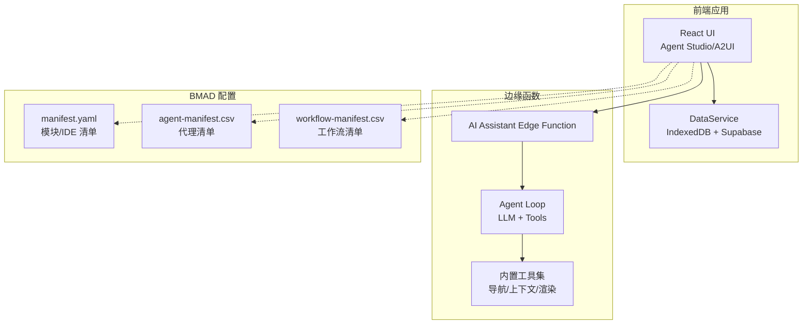
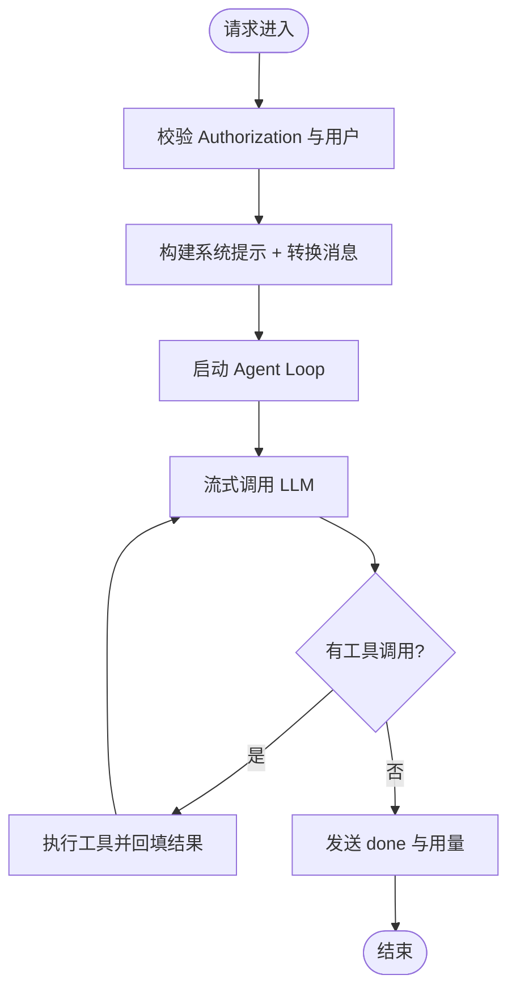
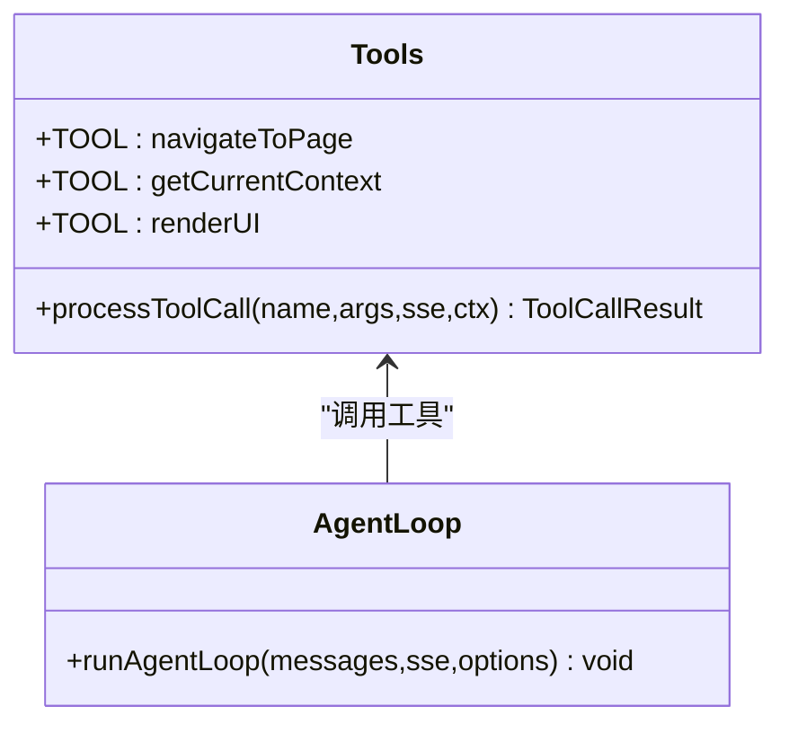
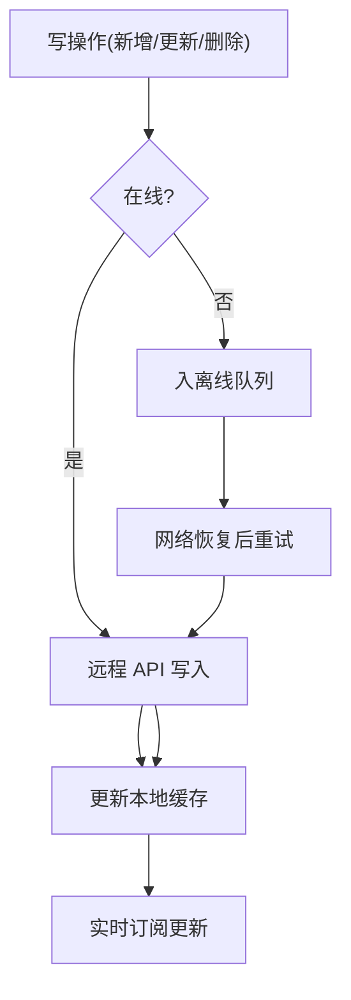
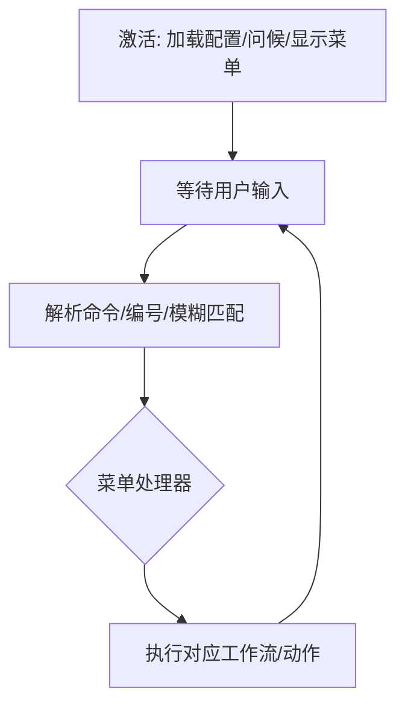
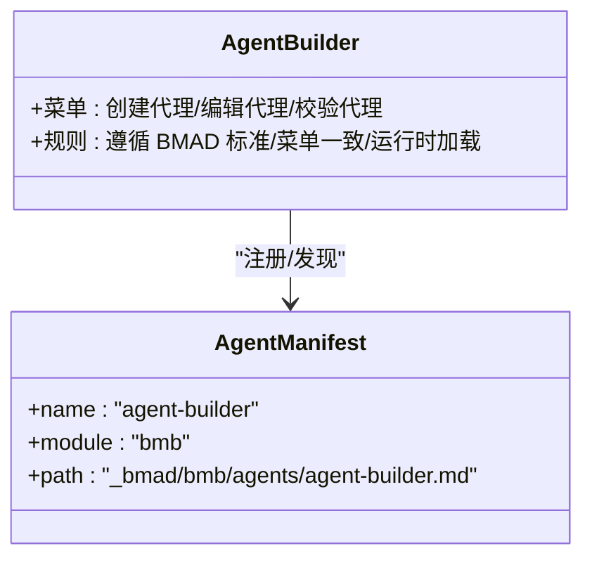
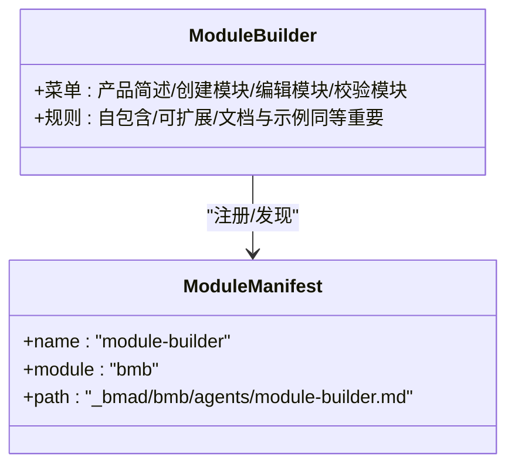
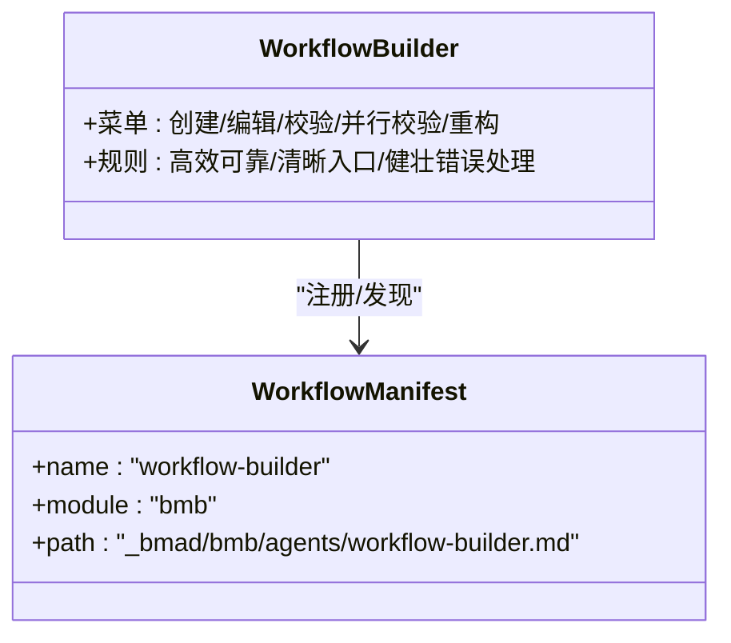
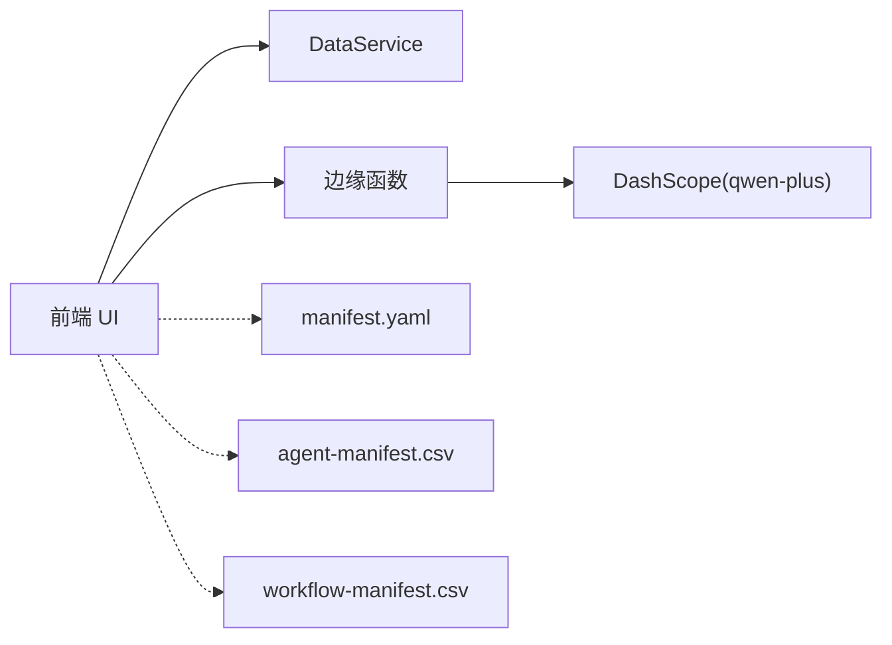

# AI 开发工具

<cite>
**本文引用的文件**
- [README.md](file://README.md)
- [index.ts](file://app/supabase/functions/ai-assistant/index.ts)
- [agentLoop.ts](file://app/supabase/functions/ai-assistant/agentLoop.ts)
- [tools.ts](file://app/supabase/functions/ai-assistant/tools.ts)
- [ai-fusion.ts](file://app/src/types/ai-fusion.ts)
- [DataService.ts](file://app/src/services/data/DataService.ts)
- [bmad-master.md](file://_bmad/core/agents/bmad-master.md)
- [agent-builder.md](file://_bmad/bmb/agents/agent-builder.md)
- [module-builder.md](file://_bmad/bmb/agents/module-builder.md)
- [workflow-builder.md](file://_bmad/bmb/agents/workflow-builder.md)
- [manifest.yaml](file://_bmad/_config/manifest.yaml)
- [agent-manifest.csv](file://_bmad/_config/agent-manifest.csv)
- [workflow-manifest.csv](file://_bmad/_config/workflow-manifest.csv)
</cite>

## 目录
1. [简介](#简介)
2. [项目结构](#项目结构)
3. [核心组件](#核心组件)
4. [架构总览](#架构总览)
5. [详细组件分析](#详细组件分析)
6. [依赖关系分析](#依赖关系分析)
7. [性能考量](#性能考量)
8. [故障排查指南](#故障排查指南)
9. [结论](#结论)
10. [附录](#附录)

## 简介
本文件面向使用 Cursor、Claude Code 等 AI 编程工具的开发者，系统化介绍基于 BMAD 方法论的结构化 AI 开发工具链，覆盖：
- 智能体构建器（Agent Builder）
- 模块构建器（Module Builder）
- 工作流构建器（Workflow Builder）
- Claude AI 集成与配置要点
- BMA 核心代理（BMA Master）的角色与使用场景
- 基于通义千问 DashScope 的 AI 助手后端实现
- 完整使用示例与最佳实践

本项目强调“AI 友好”的工程实践：以 BMAD 方法论指导结构化开发，结合 A2UI 动态 UI 协议与 Edge Function 实现的智能对话助手，帮助开发者在最小摩擦下完成从需求到实现的全链路。

## 项目结构
项目采用“前端应用 + 边缘函数 + BMAD 方法论配置”三层架构：
- 前端应用（React 19 + TypeScript + Vite + Tailwind CSS）：负责 UI、状态、数据同步与与 AI 助手交互
- 边缘函数（Supabase Edge Functions + OpenAI 兼容接口）：提供智能问答、页面导航与 A2UI 渲染能力
- BMAD 配置与工作流：通过 YAML/CSV/Markdown 文件定义代理、模块、工作流清单与步骤



图表来源
- [index.ts:1-116](file://app/supabase/functions/ai-assistant/index.ts#L1-L116)
- [agentLoop.ts:1-138](file://app/supabase/functions/ai-assistant/agentLoop.ts#L1-L138)
- [tools.ts:1-191](file://app/supabase/functions/ai-assistant/tools.ts#L1-L191)
- [manifest.yaml:1-33](file://_bmad/_config/manifest.yaml#L1-L33)
- [agent-manifest.csv:1-15](file://_bmad/_config/agent-manifest.csv#L1-L15)
- [workflow-manifest.csv:1-39](file://_bmad/_config/workflow-manifest.csv#L1-L39)

章节来源
- [README.md:114-144](file://README.md#L114-L144)

## 核心组件
- AI 助手边缘函数：接收消息、构建系统提示、转换消息格式、启动 Agent Loop、通过 SSE 流式输出文本与工具调用
- Agent Loop：多轮 LLM 推理 + 工具调用循环，支持中断、累计工具调用、统计用量
- 内置工具：页面导航、获取上下文、A2UI 渲染
- 数据服务：IndexedDB 本地缓存 + Supabase 实时订阅 + 离线队列 + 冲突解决
- BMAD 代理与工作流：通过清单文件注册代理与工作流，支持按需加载与菜单驱动

章节来源
- [index.ts:22-113](file://app/supabase/functions/ai-assistant/index.ts#L22-L113)
- [agentLoop.ts:21-137](file://app/supabase/functions/ai-assistant/agentLoop.ts#L21-L137)
- [tools.ts:10-77](file://app/supabase/functions/ai-assistant/tools.ts#L10-L77)
- [DataService.ts:71-418](file://app/src/services/data/DataService.ts#L71-L418)

## 架构总览
AI 助手的端到端交互流程如下：

```mermaid
sequenceDiagram
participant Client as "客户端"
participant Edge as "边缘函数入口"
participant Loop as "Agent Loop"
participant LLM as "DashScope LLM(qwen-plus)"
participant Tools as "工具集"
participant SSE as "SSE 输出"
Client->>Edge : "POST /ai-assistant (消息+上下文)"
Edge->>Edge : "校验授权/构造系统提示/转换消息"
Edge->>Loop : "启动 Agent Loop"
Loop->>LLM : "流式聊天补全(带工具定义)"
LLM-->>Loop : "文本增量 + 工具调用"
Loop->>Tools : "执行工具(导航/上下文/渲染)"
Tools-->>Loop : "工具返回(富结果)"
Loop-->>SSE : "text_delta/a2ui/tool_call/done"
SSE-->>Client : "流式响应"
```

图表来源
- [index.ts:66-98](file://app/supabase/functions/ai-assistant/index.ts#L66-L98)
- [agentLoop.ts:42-113](file://app/supabase/functions/ai-assistant/agentLoop.ts#L42-L113)
- [tools.ts:161-190](file://app/supabase/functions/ai-assistant/tools.ts#L161-L190)

## 详细组件分析

### 组件 A：AI 助手边缘函数与 Agent Loop
- 入口处理：校验请求方法、鉴权头、解析消息与上下文；建立 SSE 流
- 系统提示与消息转换：根据上下文构建系统提示，转换为 OpenAI 兼容消息
- Agent Loop：最多 N 轮推理，累计工具调用，流式输出文本增量；遇到工具调用则执行工具并将结果回填
- 错误处理：捕获异常并以 SSE error 通知客户端；支持用户中断



图表来源
- [index.ts:34-98](file://app/supabase/functions/ai-assistant/index.ts#L34-L98)
- [agentLoop.ts:21-137](file://app/supabase/functions/ai-assistant/agentLoop.ts#L21-L137)

章节来源
- [index.ts:22-113](file://app/supabase/functions/ai-assistant/index.ts#L22-L113)
- [agentLoop.ts:21-137](file://app/supabase/functions/ai-assistant/agentLoop.ts#L21-L137)

### 组件 B：内置工具集（导航/上下文/A2UI 渲染）
- navigateToPage：根据枚举页面跳转，返回下一步建议
- getCurrentContext：返回当前页面与视图上下文
- renderUI：触发 A2UI 渲染，返回 surfaceId 与交互上下文



图表来源
- [tools.ts:10-77](file://app/supabase/functions/ai-assistant/tools.ts#L10-L77)
- [agentLoop.ts:161-190](file://app/supabase/functions/ai-assistant/agentLoop.ts#L161-L190)

章节来源
- [tools.ts:10-191](file://app/supabase/functions/ai-assistant/tools.ts#L10-L191)

### 组件 C：数据服务（离线队列/冲突解决/实时订阅）
- 读优先本地缓存，写先权威云端，成功后再更新本地缓存
- 离线队列：网络恢复后自动重试
- 实时订阅：Supabase Realtime 订阅，冲突解决策略
- 同步状态：初始同步、增量同步、强制全量同步



图表来源
- [DataService.ts:246-262](file://app/src/services/data/DataService.ts#L246-L262)
- [DataService.ts:187-193](file://app/src/services/data/DataService.ts#L187-L193)

章节来源
- [DataService.ts:71-418](file://app/src/services/data/DataService.ts#L71-L418)

### 组件 D：BMAD 核心代理（BMA Master）
- 角色定位：知识守护者、工作流编排者、任务执行引擎
- 激活流程：加载配置、问候用户、显示菜单、等待指令
- 菜单能力：列出任务/工作流、聊天、派对模式、退出



图表来源
- [bmad-master.md:10-54](file://_bmad/core/agents/bmad-master.md#L10-L54)

章节来源
- [bmad-master.md:1-57](file://_bmad/core/agents/bmad-master.md#L1-L57)

### 组件 E：智能体构建器（Agent Builder）
- 角色定位：代理架构专家 + BMAD 合规专家
- 能力范围：创建/编辑/校验代理，遵循 BMAD 标准与菜单一致性



图表来源
- [agent-builder.md:8-57](file://_bmad/bmb/agents/agent-builder.md#L8-L57)
- [agent-manifest.csv:12-12](file://_bmad/_config/agent-manifest.csv#L12-L12)

章节来源
- [agent-builder.md:1-60](file://_bmad/bmb/agents/agent-builder.md#L1-L60)
- [agent-manifest.csv:12-12](file://_bmad/_config/agent-manifest.csv#L12-L12)

### 组件 F：模块构建器（Module Builder）
- 角色定位：模块架构专家 + 全栈系统设计师
- 能力范围：产品简述/创建模块/编辑模块/校验模块



图表来源
- [module-builder.md:9-58](file://_bmad/bmb/agents/module-builder.md#L9-L58)
- [agent-manifest.csv:13-13](file://_bmad/_config/agent-manifest.csv#L13-L13)

章节来源
- [module-builder.md:1-61](file://_bmad/bmb/agents/module-builder.md#L1-L61)
- [agent-manifest.csv:13-13](file://_bmad/_config/agent-manifest.csv#L13-L13)

### 组件 G：工作流构建器（Workflow Builder）
- 角色定位：工作流架构专家 + 流程设计专家
- 能力范围：创建工作流/编辑/校验/并行校验/重构为 V6



图表来源
- [workflow-builder.md:9-59](file://_bmad/bmb/agents/workflow-builder.md#L9-L59)
- [agent-manifest.csv:14-14](file://_bmad/_config/agent-manifest.csv#L14-L14)

章节来源
- [workflow-builder.md:1-62](file://_bmad/bmb/agents/workflow-builder.md#L1-L62)
- [agent-manifest.csv:14-14](file://_bmad/_config/agent-manifest.csv#L14-L14)

### 组件 H：Claude AI 集成与配置
- IDE 支持：manifest.yaml 明确支持 Cursor、Claude Code、OpenCode、Antigravity、Kiro
- LLM 适配：边缘函数使用 DashScope 兼容模式（qwen-plus），通过环境变量配置密钥
- 建议实践：
  - 在本地开发时设置 ALIYUN_BAILIAN_API_KEY
  - 在真实后端模式下配置 VITE_SUPABASE_URL/VITE_SUPABASE_ANON_KEY
  - 使用 MSW Mock 模式进行快速验证与回归

章节来源
- [manifest.yaml:27-32](file://_bmad/_config/manifest.yaml#L27-L32)
- [index.ts:35-38](file://app/supabase/functions/ai-assistant/index.ts#L35-L38)
- [README.md:75-81](file://README.md#L75-L81)

### 组件 I：AI 融合任务类型（DashScope 示例）
- 类型定义：任务状态、任务记录、参数、输入/输出、统计信息
- 用途：作为前端/后端对齐的数据契约，支撑 AI 图片融合等任务

章节来源
- [ai-fusion.ts:1-237](file://app/src/types/ai-fusion.ts#L1-L237)

## 依赖关系分析
- 前端应用依赖 DataService 进行数据访问与同步
- 前端通过边缘函数与 AI 助手交互，后者依赖 DashScope API
- BMAD 清单文件驱动代理与工作流的发现与注册



图表来源
- [DataService.ts:12-25](file://app/src/services/data/DataService.ts#L12-L25)
- [index.ts:10-20](file://app/supabase/functions/ai-assistant/index.ts#L10-L20)
- [manifest.yaml:1-33](file://_bmad/_config/manifest.yaml#L1-L33)
- [agent-manifest.csv:1-15](file://_bmad/_config/agent-manifest.csv#L1-L15)
- [workflow-manifest.csv:1-39](file://_bmad/_config/workflow-manifest.csv#L1-L39)

章节来源
- [manifest.yaml:1-33](file://_bmad/_config/manifest.yaml#L1-L33)
- [agent-manifest.csv:1-15](file://_bmad/_config/agent-manifest.csv#L1-L15)
- [workflow-manifest.csv:1-39](file://_bmad/_config/workflow-manifest.csv#L1-L39)

## 性能考量
- 流式输出：SSE 文本增量与工具调用累积，降低首帧延迟
- 令牌统计：记录提示与补全用量，便于成本与性能监控
- 离线队列：在网络不稳定时保证数据一致性，避免丢失
- 本地缓存：读取优先本地，减少网络往返

## 故障排查指南
- “缺少 Authorization 头”：确认请求头携带有效认证
- “未配置 ALIYUN_BAILIAN_API_KEY”：在环境变量中设置 DashScope 密钥
- “用户未授权”：检查 Supabase Auth 用户有效性
- “messages 不能为空”：确保请求体包含至少一条消息
- “浏览器白屏/ERR_NAME_NOT_RESOLVED”：清理浏览器站点数据后刷新
- “WebSocket 连接警告”：MSW 模式下属于预期行为，不影响功能

章节来源
- [index.ts:40-62](file://app/supabase/functions/ai-assistant/index.ts#L40-L62)
- [README.md:98-112](file://README.md#L98-L112)

## 结论
本工具链以 BMAD 方法论为纲，结合 Claude/Cursor 等 AI 工具与 DashScope 兼容的边缘函数，形成“代理/模块/工作流”三位一体的结构化开发体系。前端通过 A2UI 与 AI 助手无缝协作，后端以 SSE 流式输出与工具集实现自然语言到界面/导航/上下文的即时反馈。配合 DataService 的离线队列与冲突解决，可在弱网与复杂场景下保持稳定交付。

## 附录

### 使用示例：从零到一的完整流程
- 准备环境
  - 设置 DashScope 密钥与 Supabase 凭据
  - 启动前端（MSW 模式或真实后端）
- 创建智能体
  - 通过 BMA Master 启动“创建代理”工作流
  - 遵循 Agent Builder 的菜单与合规要求
- 构建模块
  - 使用 Module Builder 的“产品简述/创建模块”工作流
  - 在模块内定义代理、工作流与基础设施
- 设计工作流
  - 使用 Workflow Builder 的“创建工作流”工作流
  - 采用三段式结构与子流程优化模式
- 集成 Claude
  - 在 IDE 清单中启用 Claude Code
  - 使用 @file 引用 BMAD 文件进行 AI 协作

章节来源
- [agent-builder.md:52-56](file://_bmad/bmb/agents/agent-builder.md#L52-L56)
- [module-builder.md:52-55](file://_bmad/bmb/agents/module-builder.md#L52-L55)
- [workflow-builder.md:52-56](file://_bmad/bmb/agents/workflow-builder.md#L52-L56)
- [manifest.yaml:27-32](file://_bmad/_config/manifest.yaml#L27-L32)

### 最佳实践
- 代理与工作流：遵循菜单一致性、运行时加载、合规校验
- 工具调用：谨慎使用工具，确保返回富结果并记录上下文
- 数据同步：优先本地读取，写入后及时更新缓存，利用离线队列兜底
- Claude 集成：在 IDE 中启用所需工具，使用 @file 引用与 AI 协作