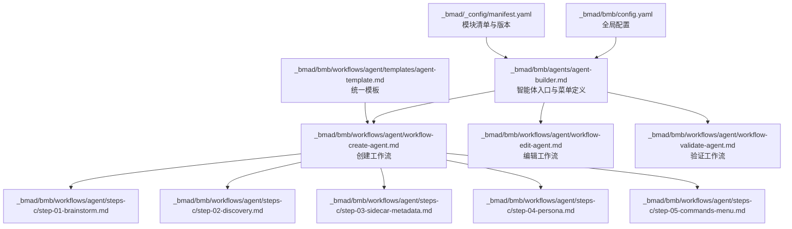
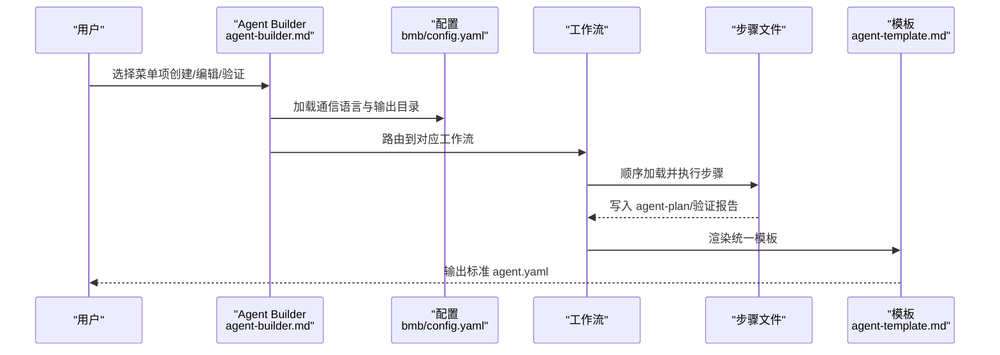
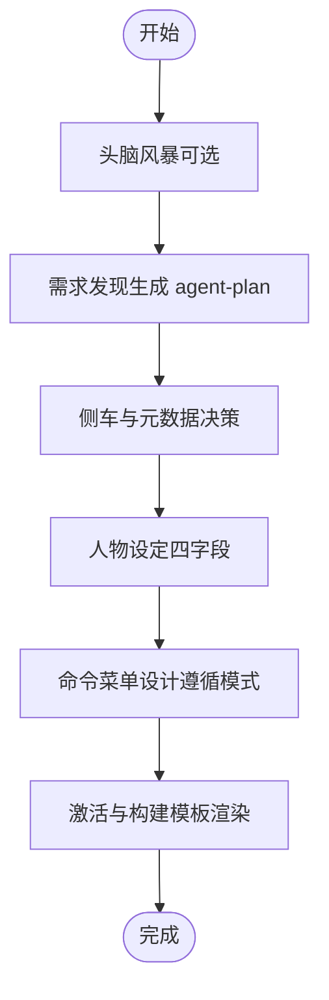
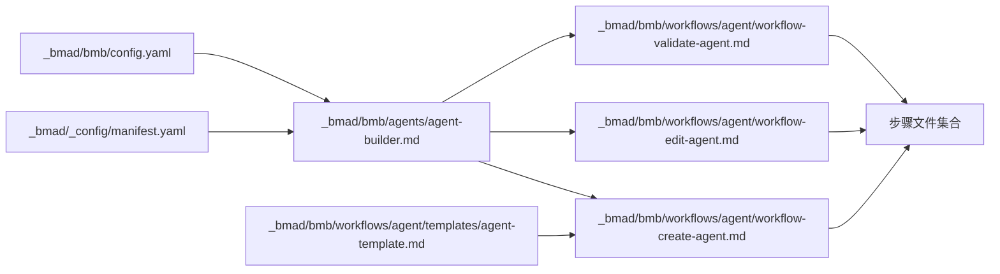

# Agent Builder 智能体构建器

<cite>
**本文引用的文件**
- [agent-builder.md](file://_bmad/bmb/agents/agent-builder.md)
- [workflow-create-agent.md](file://_bmad/bmb/workflows/agent/workflow-create-agent.md)
- [workflow-edit-agent.md](file://_bmad/bmb/workflows/agent/workflow-edit-agent.md)
- [workflow-validate-agent.md](file://_bmad/bmb/workflows/agent/workflow-validate-agent.md)
- [config.yaml](file://_bmad/bmb/config.yaml)
- [agent-template.md](file://_bmad/bmb/workflows/agent/templates/agent-template.md)
- [step-01-brainstorm.md](file://_bmad/bmb/workflows/agent/steps-c/step-01-brainstorm.md)
- [step-02-discovery.md](file://_bmad/bmb/workflows/agent/steps-c/step-02-discovery.md)
- [step-03-sidecar-metadata.md](file://_bmad/bmb/workflows/agent/steps-c/step-03-sidecar-metadata.md)
- [step-04-persona.md](file://_bmad/bmb/workflows/agent/steps-c/step-04-persona.md)
- [step-05-commands-menu.md](file://_bmad/bmb/workflows/agent/steps-c/step-05-commands-menu.md)
- [manifest.yaml](file://_bmad/_config/manifest.yaml)
</cite>

## 目录
1. [简介](#简介)
2. [项目结构](#项目结构)
3. [核心组件](#核心组件)
4. [架构总览](#架构总览)
5. [详细组件分析](#详细组件分析)
6. [依赖关系分析](#依赖关系分析)
7. [性能考量](#性能考量)
8. [故障排查指南](#故障排查指南)
9. [结论](#结论)
10. [附录](#附录)

## 简介
本文件系统性阐述 Agent Builder 智能体构建器的设计与使用方法，覆盖从零创建新智能体、编辑现有智能体、验证智能体合规性的完整工作流。文档聚焦以下关键阶段：头脑风暴、需求发现、侧车元数据、人物设定（Persona）、命令菜单、激活与构建，并配套模板系统、验证机制与最佳实践。读者可据此遵循 BMAD 标准，逐步产出高质量、可维护、可复用的智能体。

## 项目结构
Agent Builder 位于 _bmad/bmb 子模块中，采用“工作流 + 步骤文件”的微文件架构：每个步骤为独立 Markdown 文件，仅在需要时按序加载，确保执行过程可控、状态可追踪、输出可沉淀。顶层配置由 bmb/config.yaml 提供，工作流入口通过 agent 元信息定义菜单与激活规则，最终以统一模板生成标准 agent.yaml。

图表来源
- [_bmad/bmb/agents/agent-builder.md:1-60](file://_bmad/bmb/agents/agent-builder.md#L1-L60)
- [_bmad/bmb/workflows/agent/workflow-create-agent.md:1-73](file://_bmad/bmb/workflows/agent/workflow-create-agent.md#L1-L73)
- [_bmad/bmb/workflows/agent/workflow-edit-agent.md:1-76](file://_bmad/bmb/workflows/agent/workflow-edit-agent.md#L1-L76)
- [_bmad/bmb/workflows/agent/workflow-validate-agent.md:1-74](file://_bmad/bmb/workflows/agent/workflow-validate-agent.md#L1-L74)
- [_bmad/bmb/config.yaml:1-13](file://_bmad/bmb/config.yaml#L1-L13)
- [_bmad/bmb/workflows/agent/templates/agent-template.md:1-90](file://_bmad/bmb/workflows/agent/templates/agent-template.md#L1-L90)
- [_bmad/bmb/workflows/agent/steps-c/step-01-brainstorm.md:1-129](file://_bmad/bmb/workflows/agent/steps-c/step-01-brainstorm.md#L1-L129)
- [_bmad/bmb/workflows/agent/steps-c/step-02-discovery.md:1-171](file://_bmad/bmb/workflows/agent/steps-c/step-02-discovery.md#L1-L171)
- [_bmad/bmb/workflows/agent/steps-c/step-03-sidecar-metadata.md:1-309](file://_bmad/bmb/workflows/agent/steps-c/step-03-sidecar-metadata.md#L1-L309)
- [_bmad/bmb/workflows/agent/steps-c/step-04-persona.md:1-213](file://_bmad/bmb/workflows/agent/steps-c/step-04-persona.md#L1-L213)
- [_bmad/bmb/workflows/agent/steps-c/step-05-commands-menu.md:1-179](file://_bmad/bmb/workflows/agent/steps-c/step-05-commands-menu.md#L1-L179)
- [_bmad/_config/manifest.yaml:1-33](file://_bmad/_config/manifest.yaml#L1-L33)

章节来源
- [_bmad/bmb/agents/agent-builder.md:1-60](file://_bmad/bmb/agents/agent-builder.md#L1-L60)
- [_bmad/bmb/workflows/agent/workflow-create-agent.md:1-73](file://_bmad/bmb/workflows/agent/workflow-create-agent.md#L1-L73)
- [_bmad/bmb/workflows/agent/workflow-edit-agent.md:1-76](file://_bmad/bmb/workflows/agent/workflow-edit-agent.md#L1-L76)
- [_bmad/bmb/workflows/agent/workflow-validate-agent.md:1-74](file://_bmad/bmb/workflows/agent/workflow-validate-agent.md#L1-L74)
- [_bmad/bmb/config.yaml:1-13](file://_bmad/bmb/config.yaml#L1-L13)
- [_bmad/bmb/workflows/agent/templates/agent-template.md:1-90](file://_bmad/bmb/workflows/agent/templates/agent-template.md#L1-L90)
- [_bmad/bmb/workflows/agent/steps-c/step-01-brainstorm.md:1-129](file://_bmad/bmb/workflows/agent/steps-c/step-01-brainstorm.md#L1-L129)
- [_bmad/bmb/workflows/agent/steps-c/step-02-discovery.md:1-171](file://_bmad/bmb/workflows/agent/steps-c/step-02-discovery.md#L1-L171)
- [_bmad/bmb/workflows/agent/steps-c/step-03-sidecar-metadata.md:1-309](file://_bmad/bmb/workflows/agent/steps-c/step-03-sidecar-metadata.md#L1-L309)
- [_bmad/bmb/workflows/agent/steps-c/step-04-persona.md:1-213](file://_bmad/bmb/workflows/agent/steps-c/step-04-persona.md#L1-L213)
- [_bmad/bmb/workflows/agent/steps-c/step-05-commands-menu.md:1-179](file://_bmad/bmb/workflows/agent/steps-c/step-05-commands-menu.md#L1-L179)
- [_bmad/_config/manifest.yaml:1-33](file://_bmad/_config/manifest.yaml#L1-L33)

## 核心组件
- 智能体入口与菜单
  - agent-builder.md 定义了智能体身份、沟通风格、原则与菜单项，支持模糊匹配与交互式选择；菜单项直接路由到对应工作流或工具。
- 工作流编排
  - 创建、编辑、验证三种模式的工作流，均采用“步骤文件”微架构，严格顺序执行、状态持久化与可恢复。
- 配置系统
  - bmb/config.yaml 提供用户名称、语言、输出目录等关键参数，贯穿所有工作流。
- 模板引擎
  - agent-template.md 作为统一模板，将各步骤沉淀的数据渲染为标准 agent.yaml。
- 参考材料与示例
  - 各步骤包含参考文档与示例路径，便于对照学习与一致性校验。

章节来源
- [_bmad/bmb/agents/agent-builder.md:1-60](file://_bmad/bmb/agents/agent-builder.md#L1-L60)
- [_bmad/bmb/workflows/agent/workflow-create-agent.md:1-73](file://_bmad/bmb/workflows/agent/workflow-create-agent.md#L1-L73)
- [_bmad/bmb/workflows/agent/workflow-edit-agent.md:1-76](file://_bmad/bmb/workflows/agent/workflow-edit-agent.md#L1-L76)
- [_bmad/bmb/workflows/agent/workflow-validate-agent.md:1-74](file://_bmad/bmb/workflows/agent/workflow-validate-agent.md#L1-L74)
- [_bmad/bmb/config.yaml:1-13](file://_bmad/bmb/config.yaml#L1-L13)
- [_bmad/bmb/workflows/agent/templates/agent-template.md:1-90](file://_bmad/bmb/workflows/agent/templates/agent-template.md#L1-L90)

## 架构总览
Agent Builder 的整体执行路径如下：智能体入口加载配置与菜单，用户选择模式后进入相应工作流；工作流按步骤顺序推进，每步完成即写入 agent-plan 或验证报告，最终通过模板生成 agent.yaml 并输出到指定目录。

图表来源
- [_bmad/bmb/agents/agent-builder.md:1-60](file://_bmad/bmb/agents/agent-builder.md#L1-L60)
- [_bmad/bmb/config.yaml:1-13](file://_bmad/bmb/config.yaml#L1-L13)
- [_bmad/bmb/workflows/agent/workflow-create-agent.md:1-73](file://_bmad/bmb/workflows/agent/workflow-create-agent.md#L1-L73)
- [_bmad/bmb/workflows/agent/workflow-edit-agent.md:1-76](file://_bmad/bmb/workflows/agent/workflow-edit-agent.md#L1-L76)
- [_bmad/bmb/workflows/agent/workflow-validate-agent.md:1-74](file://_bmad/bmb/workflows/agent/workflow-validate-agent.md#L1-L74)
- [_bmad/bmb/workflows/agent/templates/agent-template.md:1-90](file://_bmad/bmb/workflows/agent/templates/agent-template.md#L1-L90)

## 详细组件分析

### 组件一：智能体入口与菜单
- 角色定位：代理架构专家 + BMAD 合规专家，强调结构、合规与可维护性。
- 激活流程：加载当前 agent 文件中的角色信息；读取 bmb/config.yaml 至会话变量；按配置语言问候并显示菜单。
- 菜单项：
  - 创建新智能体：引导从头脑风暴到构建的全流程。
  - 编辑现有智能体：保持合规前提下的增量修改。
  - 验证智能体：系统化审查与改进建议。
  - Party Mode：创意探索与灵感激发。
  - 退出：结束会话。

章节来源
- [_bmad/bmb/agents/agent-builder.md:1-60](file://_bmad/bmb/agents/agent-builder.md#L1-L60)

### 组件二：创建智能体工作流（Create）
- 目标：协作创建符合 BMAD Core 标准的智能体，遵循最佳实践与合规要求。
- 核心原则：微文件设计、按需加载、顺序执行、状态追踪、模式感知路由。
- 关键步骤：
  1) 头脑风暴（可选）：激发创意，保留结果用于后续步骤。
  2) 需求发现：生成 agent-plan，涵盖目的、目标、能力、上下文、用户。
  3) 侧车元数据：决定是否需要记忆（sidecar），定义 id/name/title/icon/module/hasSidecar 等。
  4) 人物设定：四字段（Role/Identity/Communication/Principles）塑造。
  5) 命令菜单：基于能力映射命令，遵循菜单模式与 YAML 格式。
  6) 激活与构建：整合数据，渲染模板生成 agent.yaml。
  7) 庆祝与安装指导：完成提示与后续指引。

图表来源
- [_bmad/bmb/workflows/agent/workflow-create-agent.md:1-73](file://_bmad/bmb/workflows/agent/workflow-create-agent.md#L1-L73)
- [_bmad/bmb/workflows/agent/steps-c/step-01-brainstorm.md:1-129](file://_bmad/bmb/workflows/agent/steps-c/step-01-brainstorm.md#L1-L129)
- [_bmad/bmb/workflows/agent/steps-c/step-02-discovery.md:1-171](file://_bmad/bmb/workflows/agent/steps-c/step-02-discovery.md#L1-L171)
- [_bmad/bmb/workflows/agent/steps-c/step-03-sidecar-metadata.md:1-309](file://_bmad/bmb/workflows/agent/steps-c/step-03-sidecar-metadata.md#L1-L309)
- [_bmad/bmb/workflows/agent/steps-c/step-04-persona.md:1-213](file://_bmad/bmb/workflows/agent/steps-c/step-04-persona.md#L1-L213)
- [_bmad/bmb/workflows/agent/steps-c/step-05-commands-menu.md:1-179](file://_bmad/bmb/workflows/agent/steps-c/step-05-commands-menu.md#L1-L179)
- [_bmad/bmb/workflows/agent/templates/agent-template.md:1-90](file://_bmad/bmb/workflows/agent/templates/agent-template.md#L1-L90)

章节来源
- [_bmad/bmb/workflows/agent/workflow-create-agent.md:1-73](file://_bmad/bmb/workflows/agent/workflow-create-agent.md#L1-L73)
- [_bmad/bmb/workflows/agent/steps-c/step-01-brainstorm.md:1-129](file://_bmad/bmb/workflows/agent/steps-c/step-01-brainstorm.md#L1-L129)
- [_bmad/bmb/workflows/agent/steps-c/step-02-discovery.md:1-171](file://_bmad/bmb/workflows/agent/steps-c/step-02-discovery.md#L1-L171)
- [_bmad/bmb/workflows/agent/steps-c/step-03-sidecar-metadata.md:1-309](file://_bmad/bmb/workflows/agent/steps-c/step-03-sidecar-metadata.md#L1-L309)
- [_bmad/bmb/workflows/agent/steps-c/step-04-persona.md:1-213](file://_bmad/bmb/workflows/agent/steps-c/step-04-persona.md#L1-L213)
- [_bmad/bmb/workflows/agent/steps-c/step-05-commands-menu.md:1-179](file://_bmad/bmb/workflows/agent/steps-c/step-05-commands-menu.md#L1-L179)
- [_bmad/bmb/workflows/agent/templates/agent-template.md:1-90](file://_bmad/bmb/workflows/agent/templates/agent-template.md#L1-L90)

### 组件三：编辑智能体工作流（Edit）
- 目标：在不破坏合规性的前提下，对现有智能体进行结构化修改。
- 流程要点：
  - 加载目标 agent 文件，运行前置验证。
  - 发现用户意图与变更范围，形成编辑计划。
  - 应用变更并再次验证，完成后庆祝与总结。

章节来源
- [_bmad/bmb/workflows/agent/workflow-edit-agent.md:1-76](file://_bmad/bmb/workflows/agent/workflow-edit-agent.md#L1-L76)

### 组件四：验证智能体工作流（Validate）
- 目标：系统化审查现有智能体，生成综合报告并提供改进选项。
- 流程要点：
  - 加载目标 agent 文件。
  - 执行元数据、人物设定、菜单、结构、侧车等维度的验证。
  - 生成验证报告，允许用户选择是否应用修复建议。

章节来源
- [_bmad/bmb/workflows/agent/workflow-validate-agent.md:1-74](file://_bmad/bmb/workflows/agent/workflow-validate-agent.md#L1-L74)

### 组件五：模板系统与数据沉淀
- agent-template.md 作为统一模板，接收来自各步骤的结构化数据（如元数据、人物设定、菜单、安装配置等），输出标准 agent.yaml。
- agent-plan 作为“单一事实源”，贯穿创建流程，确保后续步骤无需重复询问。

章节来源
- [_bmad/bmb/workflows/agent/templates/agent-template.md:1-90](file://_bmad/bmb/workflows/agent/templates/agent-template.md#L1-L90)
- [_bmad/bmb/workflows/agent/steps-c/step-02-discovery.md:1-171](file://_bmad/bmb/workflows/agent/steps-c/step-02-discovery.md#L1-L171)
- [_bmad/bmb/workflows/agent/steps-c/step-03-sidecar-metadata.md:1-309](file://_bmad/bmb/workflows/agent/steps-c/step-03-sidecar-metadata.md#L1-L309)
- [_bmad/bmb/workflows/agent/steps-c/step-04-persona.md:1-213](file://_bmad/bmb/workflows/agent/steps-c/step-04-persona.md#L1-L213)
- [_bmad/bmb/workflows/agent/steps-c/step-05-commands-menu.md:1-179](file://_bmad/bmb/workflows/agent/steps-c/step-05-commands-menu.md#L1-L179)

### 组件六：步骤详解与最佳实践

#### 步骤一：头脑风暴（可选）
- 目的：在正式发现前进行创意探索，尊重用户选择，不强制参与。
- 关键点：提供明确收益说明；若选择参与，则调用核心模块的头脑风暴工作流；保留输出以供后续步骤参考。

章节来源
- [_bmad/bmb/workflows/agent/steps-c/step-01-brainstorm.md:1-129](file://_bmad/bmb/workflows/agent/steps-c/step-01-brainstorm.md#L1-L129)

#### 步骤二：需求发现（Discovery）
- 目的：生成 agent-plan，作为后续步骤的唯一依据。
- 结构：Purpose/Goals/Capabilities/Context/Users，必须完整、清晰、可操作。
- 可选增强：Advanced Elicitation 与 Party Mode 用于深度探索与创意激发。

章节来源
- [_bmad/bmb/workflows/agent/steps-c/step-02-discovery.md:1-171](file://_bmad/bmb/workflows/agent/steps-c/step-02-discovery.md#L1-L171)

#### 步骤三：侧车与元数据（Sidecar & Metadata）
- 决策：是否需要跨会话记忆（hasSidecar）。通过对比示例帮助用户判断。
- 元数据：id/name/title/icon/module/hasSidecar 必须完整定义，格式与命名遵循规范。
- 文档：以 YAML 形式写入 agent-plan，包含决策理由与信心度等。

章节来源
- [_bmad/bmb/workflows/agent/steps-c/step-03-sidecar-metadata.md:1-309](file://_bmad/bmb/workflows/agent/steps-c/step-03-sidecar-metadata.md#L1-L309)

#### 步骤四：人物设定（Persona）
- 四字段体系：Role（所做之事）、Identity（其为人格）、Communication（表达方式）、Principles（行为准则）。
- 质量控制：字段纯度、不重叠、第一原则激活专家能力；输出结构化 YAML，准备进入菜单设计。

章节来源
- [_bmad/bmb/workflows/agent/steps-c/step-04-persona.md:1-213](file://_bmad/bmb/workflows/agent/steps-c/step-04-persona.md#L1-L213)

#### 步骤五：命令菜单（Commands & Menu）
- 目标：将能力转化为用户友好的命令触发词、描述与处理器。
- 规范：遵循菜单模式文件；每条命令包含 trigger/description/handler；避免手动添加 help/exit；最终以 YAML 记录到 agent-plan。

章节来源
- [_bmad/bmb/workflows/agent/steps-c/step-05-commands-menu.md:1-179](file://_bmad/bmb/workflows/agent/steps-c/step-05-commands-menu.md#L1-L179)

## 依赖关系分析
- 模块版本与安装
  - manifest.yaml 显示 bmb 模块版本与安装信息，确保工作流与模板可用。
- 配置依赖
  - 所有工作流均依赖 bmb/config.yaml 中的语言与输出目录设置。
- 步骤耦合
  - 步骤间通过 agent-plan 与验证报告进行状态传递，避免重复输入。
- 外部工具集成
  - 可选调用高级需求挖掘与 Party Mode 工作流，增强创意与洞察。

图表来源
- [_bmad/_config/manifest.yaml:1-33](file://_bmad/_config/manifest.yaml#L1-L33)
- [_bmad/bmb/agents/agent-builder.md:1-60](file://_bmad/bmb/agents/agent-builder.md#L1-L60)
- [_bmad/bmb/config.yaml:1-13](file://_bmad/bmb/config.yaml#L1-L13)
- [_bmad/bmb/workflows/agent/workflow-create-agent.md:1-73](file://_bmad/bmb/workflows/agent/workflow-create-agent.md#L1-L73)
- [_bmad/bmb/workflows/agent/workflow-edit-agent.md:1-76](file://_bmad/bmb/workflows/agent/workflow-edit-agent.md#L1-L76)
- [_bmad/bmb/workflows/agent/workflow-validate-agent.md:1-74](file://_bmad/bmb/workflows/agent/workflow-validate-agent.md#L1-L74)
- [_bmad/bmb/workflows/agent/templates/agent-template.md:1-90](file://_bmad/bmb/workflows/agent/templates/agent-template.md#L1-L90)

章节来源
- [_bmad/_config/manifest.yaml:1-33](file://_bmad/_config/manifest.yaml#L1-L33)
- [_bmad/bmb/agents/agent-builder.md:1-60](file://_bmad/bmb/agents/agent-builder.md#L1-L60)
- [_bmad/bmb/config.yaml:1-13](file://_bmad/bmb/config.yaml#L1-L13)
- [_bmad/bmb/workflows/agent/workflow-create-agent.md:1-73](file://_bmad/bmb/workflows/agent/workflow-create-agent.md#L1-L73)
- [_bmad/bmb/workflows/agent/workflow-edit-agent.md:1-76](file://_bmad/bmb/workflows/agent/workflow-edit-agent.md#L1-L76)
- [_bmad/bmb/workflows/agent/workflow-validate-agent.md:1-74](file://_bmad/bmb/workflows/agent/workflow-validate-agent.md#L1-L74)
- [_bmad/bmb/workflows/agent/templates/agent-template.md:1-90](file://_bmad/bmb/workflows/agent/templates/agent-template.md#L1-L90)

## 性能考量
- 微文件执行模型：仅加载当前步骤文件，降低内存占用与启动延迟。
- 状态持久化：agent-plan/验证报告等中间产物写盘，便于断点续跑与审计。
- 模板渲染：统一模板减少重复逻辑，提升一致性与可维护性。
- 语言与输出：配置化语言与输出目录，避免硬编码带来的切换成本。

## 故障排查指南
- 激活失败
  - 症状：无法加载配置或未按顺序执行步骤。
  - 排查：确认 bmb/config.yaml 存在且字段完整；检查步骤文件路径与 frontmatter。
- 步骤中断
  - 症状：菜单未等待用户输入或提前跳过。
  - 排查：核对步骤文件中的“等待输入”与“继续条件”；确保 agent-plan 更新后再加载下一步。
- 模板渲染错误
  - 症状：生成的 agent.yaml 结构异常。
  - 排查：检查 agent-plan 中对应段落是否完整；核对模板字段与步骤输出格式。
- 合规性问题
  - 症状：验证报告指出字段缺失或不符合规范。
  - 排查：对照 persona-properties、principles-crafting、agent-menu-patterns 等参考文件逐项修正。

章节来源
- [_bmad/bmb/workflows/agent/steps-c/step-01-brainstorm.md:1-129](file://_bmad/bmb/workflows/agent/steps-c/step-01-brainstorm.md#L1-L129)
- [_bmad/bmb/workflows/agent/steps-c/step-02-discovery.md:1-171](file://_bmad/bmb/workflows/agent/steps-c/step-02-discovery.md#L1-L171)
- [_bmad/bmb/workflows/agent/steps-c/step-03-sidecar-metadata.md:1-309](file://_bmad/bmb/workflows/agent/steps-c/step-03-sidecar-metadata.md#L1-L309)
- [_bmad/bmb/workflows/agent/steps-c/step-04-persona.md:1-213](file://_bmad/bmb/workflows/agent/steps-c/step-04-persona.md#L1-L213)
- [_bmad/bmb/workflows/agent/steps-c/step-05-commands-menu.md:1-179](file://_bmad/bmb/workflows/agent/steps-c/step-05-commands-menu.md#L1-L179)
- [_bmad/bmb/workflows/agent/workflow-validate-agent.md:1-74](file://_bmad/bmb/workflows/agent/workflow-validate-agent.md#L1-L74)

## 结论
Agent Builder 通过“入口 + 工作流 + 步骤 + 模板”的分层设计，将复杂的智能体构建过程拆解为可管理、可验证、可复用的环节。遵循该流程可显著提升智能体质量与一致性，满足 BMAD 标准与长期演进需求。建议在实践中坚持：先发现再实现、先结构再细节、先合规再创新。

## 附录

### 使用示例：从零创建一个符合 BMAD 标准的智能体
- 步骤概览
  1) 选择“创建新智能体”，进入创建工作流。
  2) 可选头脑风暴，记录创意点子。
  3) 进行需求发现，生成 agent-plan。
  4) 决定是否需要侧车与定义元数据。
  5) 设计人物设定（四字段）。
  6) 将能力映射为命令菜单，遵循模式与格式。
  7) 模板渲染生成 agent.yaml，输出至配置目录。
- 最佳实践
  - 在 discovery 阶段充分沉淀价值主张与能力边界。
  - sidecar 决策应基于真实记忆需求而非假设。
  - 人物设定避免混杂角色与沟通风格，确保第一原则激活专家能力。
  - 菜单命令简洁、直观、与能力一一对应，优先高频命令。

章节来源
- [_bmad/bmb/workflows/agent/workflow-create-agent.md:1-73](file://_bmad/bmb/workflows/agent/workflow-create-agent.md#L1-L73)
- [_bmad/bmb/workflows/agent/steps-c/step-01-brainstorm.md:1-129](file://_bmad/bmb/workflows/agent/steps-c/step-01-brainstorm.md#L1-L129)
- [_bmad/bmb/workflows/agent/steps-c/step-02-discovery.md:1-171](file://_bmad/bmb/workflows/agent/steps-c/step-02-discovery.md#L1-L171)
- [_bmad/bmb/workflows/agent/steps-c/step-03-sidecar-metadata.md:1-309](file://_bmad/bmb/workflows/agent/steps-c/step-03-sidecar-metadata.md#L1-L309)
- [_bmad/bmb/workflows/agent/steps-c/step-04-persona.md:1-213](file://_bmad/bmb/workflows/agent/steps-c/step-04-persona.md#L1-L213)
- [_bmad/bmb/workflows/agent/steps-c/step-05-commands-menu.md:1-179](file://_bmad/bmb/workflows/agent/steps-c/step-05-commands-menu.md#L1-L179)
- [_bmad/bmb/workflows/agent/templates/agent-template.md:1-90](file://_bmad/bmb/workflows/agent/templates/agent-template.md#L1-L90)

### 编辑与优化现有智能体
- 步骤概览
  1) 选择“编辑现有智能体”，输入目标 agent 文件路径。
  2) 运行前置验证，形成现状报告。
  3) 发现变更意图，制定编辑计划。
  4) 应用变更并重新验证，输出更新后的 agent.yaml。
- 注意事项
  - 保持合规性优先，避免破坏已有结构。
  - 对人物设定与菜单的修改需与 agent-plan 保持一致。

章节来源
- [_bmad/bmb/workflows/agent/workflow-edit-agent.md:1-76](file://_bmad/bmb/workflows/agent/workflow-edit-agent.md#L1-L76)
- [_bmad/bmb/workflows/agent/workflow-validate-agent.md:1-74](file://_bmad/bmb/workflows/agent/workflow-validate-agent.md#L1-L74)

### 验证机制与合规性检查清单
- 元数据完整性：id/name/title/icon/module/hasSidecar 是否齐全。
- 人物设定：四字段是否清晰、不重叠、第一原则激活专家能力。
- 菜单结构：是否遵循模式、命令是否与能力一一对应、是否遗漏必填字段。
- 结构与侧车：是否符合 sidecar 决策框架与实现约束。
- 报告与修复：验证报告是否生成，是否提供可操作的修复建议。

章节来源
- [_bmad/bmb/workflows/agent/workflow-validate-agent.md:1-74](file://_bmad/bmb/workflows/agent/workflow-validate-agent.md#L1-L74)
- [_bmad/bmb/workflows/agent/steps-c/step-03-sidecar-metadata.md:1-309](file://_bmad/bmb/workflows/agent/steps-c/step-03-sidecar-metadata.md#L1-L309)
- [_bmad/bmb/workflows/agent/steps-c/step-04-persona.md:1-213](file://_bmad/bmb/workflows/agent/steps-c/step-04-persona.md#L1-L213)
- [_bmad/bmb/workflows/agent/steps-c/step-05-commands-menu.md:1-179](file://_bmad/bmb/workflows/agent/steps-c/step-05-commands-menu.md#L1-L179)