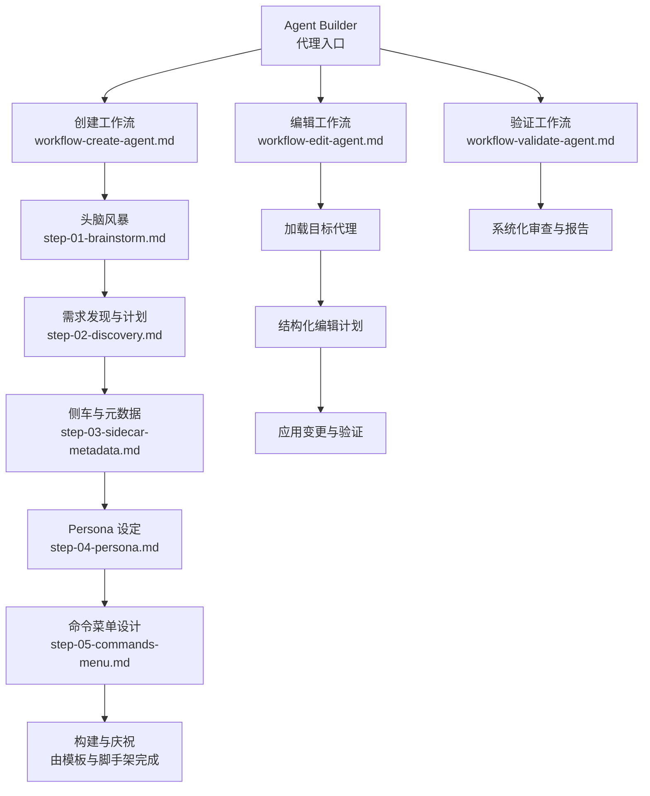
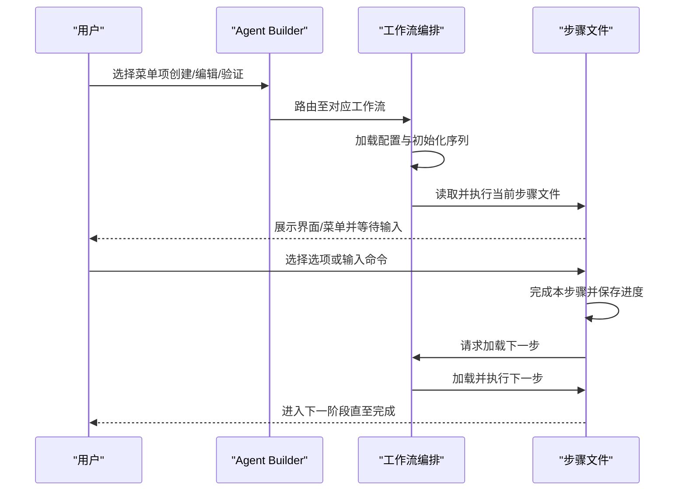
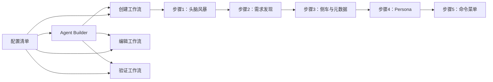

# 创建智能体工作流

<cite>
**本文引用的文件**
- [workflow-create-agent.md](file://_bmad/bmb/workflows/agent/workflow-create-agent.md)
- [workflow-edit-agent.md](file://_bmad/bmb/workflows/agent/workflow-edit-agent.md)
- [workflow-validate-agent.md](file://_bmad/bmb/workflows/agent/workflow-validate-agent.md)
- [agent-builder.md](file://_bmad/bmb/agents/agent-builder.md)
- [step-01-brainstorm.md](file://_bmad/bmb/workflows/agent/steps-c/step-01-brainstorm.md)
- [step-02-discovery.md](file://_bmad/bmb/workflows/agent/steps-c/step-02-discovery.md)
- [step-03-sidecar-metadata.md](file://_bmad/bmb/workflows/agent/steps-c/step-03-sidecar-metadata.md)
- [step-04-persona.md](file://_bmad/bmb/workflows/agent/steps-c/step-04-persona.md)
- [step-05-commands-menu.md](file://_bmad/bmb/workflows/agent/steps-c/step-05-commands-menu.md)
- [manifest.yaml](file://_bmad/_config/manifest.yaml)
</cite>

## 目录
1. [简介](#简介)
2. [项目结构](#项目结构)
3. [核心组件](#核心组件)
4. [架构总览](#架构总览)
5. [详细组件分析](#详细组件分析)
6. [依赖关系分析](#依赖关系分析)
7. [性能考量](#性能考量)
8. [故障排查指南](#故障排查指南)
9. [结论](#结论)
10. [附录](#附录)

## 简介
本文件系统化梳理了从零开始创建 BMAD 智能体的完整工作流，覆盖需求发现、侧车元数据与类型决策、Persona 设定、命令菜单设计、激活机制构建等关键步骤。文档同时阐述智能体模板系统的使用方法（标准模板与定制化模板），并提供可复用的创建示例与合规性检查清单，帮助不同场景下的用户快速、高质量地完成智能体设计与落地。

## 项目结构
BMAD 智能体创建工作流位于 _bmad/bmb/workflows/agent 下，采用“步骤文件（step-file）架构”：每一步为独立的指令文件，仅在当前步骤加载到内存中执行；通过明确的顺序、状态记录与模式路由，确保流程可控、可审计、可复现。

图表来源
- [agent-builder.md:1-60](file://_bmad/bmb/agents/agent-builder.md#L1-L60)
- [workflow-create-agent.md:1-73](file://_bmad/bmb/workflows/agent/workflow-create-agent.md#L1-L73)
- [workflow-edit-agent.md:1-76](file://_bmad/bmb/workflows/agent/workflow-edit-agent.md#L1-L76)
- [workflow-validate-agent.md:1-74](file://_bmad/bmb/workflows/agent/workflow-validate-agent.md#L1-L74)
- [step-01-brainstorm.md:1-129](file://_bmad/bmb/workflows/agent/steps-c/step-01-brainstorm.md#L1-L129)
- [step-02-discovery.md:1-171](file://_bmad/bmb/workflows/agent/steps-c/step-02-discovery.md#L1-L171)
- [step-03-sidecar-metadata.md:1-309](file://_bmad/bmb/workflows/agent/steps-c/step-03-sidecar-metadata.md#L1-L309)
- [step-04-persona.md:1-213](file://_bmad/bmb/workflows/agent/steps-c/step-04-persona.md#L1-L213)
- [step-05-commands-menu.md:1-179](file://_bmad/bmb/workflows/agent/steps-c/step-05-commands-menu.md#L1-L179)

章节来源
- [workflow-create-agent.md:1-73](file://_bmad/bmb/workflows/agent/workflow-create-agent.md#L1-L73)
- [workflow-edit-agent.md:1-76](file://_bmad/bmb/workflows/agent/workflow-edit-agent.md#L1-L76)
- [workflow-validate-agent.md:1-74](file://_bmad/bmb/workflows/agent/workflow-validate-agent.md#L1-L74)
- [agent-builder.md:1-60](file://_bmad/bmb/agents/agent-builder.md#L1-L60)

## 核心组件
- 代理入口与菜单
  - Agent Builder 提供统一入口，内置菜单项涵盖“创建新代理”“编辑现有代理”“验证代理”“派对模式”等，支持模糊匹配与命令触发。
- 工作流编排
  - 创建/编辑/验证三种模式各自定义初始化序列、步骤处理规则与关键约束，确保严格顺序与状态追踪。
- 步骤文件体系
  - 每个步骤文件自包含目标、规则、协议、上下文边界与完成度指标，形成“微文件设计 + 即时加载 + 顺序强制”的执行模型。

章节来源
- [agent-builder.md:1-60](file://_bmad/bmb/agents/agent-builder.md#L1-L60)
- [workflow-create-agent.md:1-73](file://_bmad/bmb/workflows/agent/workflow-create-agent.md#L1-L73)
- [workflow-edit-agent.md:1-76](file://_bmad/bmb/workflows/agent/workflow-edit-agent.md#L1-L76)
- [workflow-validate-agent.md:1-74](file://_bmad/bmb/workflows/agent/workflow-validate-agent.md#L1-L74)

## 架构总览
下图展示了从代理入口到各模式工作流的整体交互关系，以及创建模式的步骤链路。

图表来源
- [agent-builder.md:26-58](file://_bmad/bmb/agents/agent-builder.md#L26-L58)
- [workflow-create-agent.md:49-73](file://_bmad/bmb/workflows/agent/workflow-create-agent.md#L49-L73)
- [workflow-edit-agent.md:49-76](file://_bmad/bmb/workflows/agent/workflow-edit-agent.md#L49-L76)
- [workflow-validate-agent.md:49-74](file://_bmad/bmb/workflows/agent/workflow-validate-agent.md#L49-L74)

## 详细组件分析

### 头脑风暴阶段（需求探索前奏）
- 目标：在正式进入需求发现前，提供可选的创意激发环节，帮助用户拓展思路、发现未被意识到的用例与能力组合。
- 关键点：
  - 可选参与，尊重用户已有想法；
  - 若选择参与，调用通用头脑风暴工作流并传递上下文引导；
  - 产出结果将作为后续发现阶段的参考输入。
- 最佳实践：
  - 鼓励用户在有时间与动机时参与，以获得更丰富的概念素材；
  - 若用户已有清晰方向，可直接跳过，节省时间。
- 注意事项：
  - 绝对不可将头脑风暴设为强制步骤；
  - 必须保留并整合头脑风暴输出，以便后续复用。

章节来源
- [step-01-brainstorm.md:1-129](file://_bmad/bmb/workflows/agent/steps-c/step-01-brainstorm.md#L1-L129)

### 需求发现与计划（Agent Plan）
- 目标：生成“单一事实源”的 Agent Plan，覆盖目的、目标、能力、上下文、用户五大维度，避免重复询问与信息遗漏。
- 关键点：
  - 一次性发现，不重问；
  - 结构化文档，便于下游步骤引用；
  - 可选调用高级需求挖掘与派对模式以深化洞察。
- 最佳实践：
  - 使用开放式问题引导深层思考；
  - 明确成功度量与边界条件；
  - 将头脑风暴结果自然融入对话。
- 注意事项：
  - 不在本步讨论技术实现细节；
  - 不定义角色、命令或命名；
  - 不设定验证标准。

章节来源
- [step-02-discovery.md:1-171](file://_bmad/bmb/workflows/agent/steps-c/step-02-discovery.md#L1-L171)

### 侧车与元数据（Sidecar 决策与元数据）
- 目标：决定是否需要跨会话记忆（Sidecar），并定义代理的六大元数据属性，形成可被下游消费的结构化 YAML。
- 关键点：
  - 以“是否需要跨会话记忆”为核心判断；
  - 对比示例帮助澄清概念；
  - 六大元数据必须完整、格式正确。
- 最佳实践：
  - 偏关系型/长期协作型代理多需 Sidecar；
  - 偏任务型/即时型代理通常无需 Sidecar；
  - 模块路径遵循“项目:类型:名称”的规范。
- 注意事项：
  - 严禁遗漏任一元数据字段；
  - 模块路径格式错误属于严重失败；
  - 用户对记忆需求的表述不清时，应提供具体示例辅助决策。

章节来源
- [step-03-sidecar-metadata.md:1-309](file://_bmad/bmb/workflows/agent/steps-c/step-03-sidecar-metadata.md#L1-L309)

### Persona 设定（四象限人格）
- 目标：基于四象限系统（角色、身份、沟通风格、原则）塑造稳定、一致且可执行的人格框架。
- 关键点：
  - 字段纯度：四象限职责单一、互斥、不可重叠；
  - 输出结构化 YAML，首条原则必须是“专家激活器”；
  - 严格遵循参考材料与质量检查清单。
- 最佳实践：
  - 先定义“能做什么”（角色），再定义“是谁”（身份）；
  - 沟通风格应与角色/身份相匹配；
  - 原则数量建议 5–7 条，形成清晰的决策框架。
- 注意事项：
  - 严禁将“如何做”（技能/工具）写入角色；
  - 严禁将“说什么”（表达方式）写入身份；
  - 严禁缺失首条专家激活器。

章节来源
- [step-04-persona.md:1-213](file://_bmad/bmb/workflows/agent/steps-c/step-04-persona.md#L1-L213)

### 命令菜单设计（能力到命令的映射）
- 目标：将已识别的能力转化为用户友好的命令结构，遵循 BMAD 菜单模式，形成最终菜单 YAML。
- 关键点：
  - 必须加载并遵循菜单模式文件；
  - 每个命令必须包含触发词、描述与处理器；
  - 菜单 YAML 控制在 100 行以内；
  - 自动注入帮助/退出命令，不得手动添加。
- 最佳实践：
  - 将高频能力优先置于菜单前部；
  - 触发词简洁、直观、符合用户心智；
  - 描述突出价值与收益，避免技术术语。
- 注意事项：
  - 不得包含帮助/退出命令（自动注入）；
  - 菜单结构必须与模式文件一致；
  - 所有命令必须具备触发词、描述与处理器。

章节来源
- [step-05-commands-menu.md:1-179](file://_bmad/bmb/workflows/agent/steps-c/step-05-commands-menu.md#L1-L179)

### 激活机制构建（待补充）
- 当前仓库未提供激活机制的专用步骤文件，但工作流定义与代理入口已明确激活流程的关键节点与规则。建议在实际构建阶段结合以下要点：
  - 在代理文件中定义激活节，按序执行配置加载、问候、菜单展示与输入等待；
  - 严格遵守“只在执行时加载文件”的原则，避免预加载；
  - 保持与通信语言与风格一致，确保用户体验连贯。
- 参考路径
  - [agent-builder.md:10-42](file://_bmad/bmb/agents/agent-builder.md#L10-L42)
  - [workflow-create-agent.md:49-73](file://_bmad/bmb/workflows/agent/workflow-create-agent.md#L49-L73)

章节来源
- [agent-builder.md:10-42](file://_bmad/bmb/agents/agent-builder.md#L10-L42)
- [workflow-create-agent.md:49-73](file://_bmad/bmb/workflows/agent/workflow-create-agent.md#L49-L73)

### 智能体模板系统使用指南
- 标准模板
  - 创建模式提供“Agent 计划模板”与“Agent 模板”，用于沉淀与生成代理文件；
  - 编辑/验证模式提供对应的“编辑”“验证”模板，支撑迭代与改进。
- 定制化模板
  - 可在模块定制目录中扩展或替换模板，以适配特定团队或产品线的规范；
  - 建议保持与标准模板一致的字段与结构，确保兼容性。
- 使用建议
  - 新建代理优先使用标准模板，保证一致性；
  - 团队内推广时引入定制化模板，统一风格与约束；
  - 模板版本与安装信息可通过配置清单进行管理与追踪。

章节来源
- [manifest.yaml:1-33](file://_bmad/_config/manifest.yaml#L1-L33)

### 创建示例（按场景设计）
- 场景一：即时任务型代理（无需侧车）
  - 侧车决策：无跨会话记忆需求；
  - 元数据：模块路径遵循“项目:类型:名称”，ID 与名称符合规范；
  - Persona：角色聚焦任务完成，身份偏向高效务实；
  - 菜单：命令围绕任务执行与结果交付，触发词简洁直观。
- 场景二：长期陪伴型代理（需要侧车）
  - 侧车决策：需记住用户偏好、进度与历史交互；
  - 元数据：模块路径规范，hasSidecar 为真；
  - Persona：角色承载情感与陪伴属性，身份更具温度；
  - 菜单：命令围绕回顾、规划与互动，强调连续性体验。
- 场景三：专家咨询型代理（复杂能力）
  - 侧车决策：视是否需要持续跟踪咨询进展而定；
  - 元数据：模块路径体现专业领域；
  - Persona：角色强调权威与深度，身份体现亲和与可信；
  - 菜单：命令围绕诊断、建议与总结，描述突出价值。

（以上为设计思路与落地方案示例，具体实现请依据各步骤文件的结构化要求与质量检查清单执行。）

## 依赖关系分析
- 组件耦合
  - Agent Builder 作为入口，依赖三大工作流；三大工作流又依赖各自的步骤文件；
  - 各步骤文件之间存在显式“下一步”引用，形成强顺序依赖；
  - 配置加载贯穿所有模式，确保语言与输出风格一致。
- 外部依赖
  - 模块清单记录了核心模块与外部包信息，保障环境一致性与可追溯性。

图表来源
- [agent-builder.md:1-60](file://_bmad/bmb/agents/agent-builder.md#L1-L60)
- [workflow-create-agent.md:1-73](file://_bmad/bmb/workflows/agent/workflow-create-agent.md#L1-L73)
- [workflow-edit-agent.md:1-76](file://_bmad/bmb/workflows/agent/workflow-edit-agent.md#L1-L76)
- [workflow-validate-agent.md:1-74](file://_bmad/bmb/workflows/agent/workflow-validate-agent.md#L1-L74)
- [manifest.yaml:1-33](file://_bmad/_config/manifest.yaml#L1-L33)

章节来源
- [manifest.yaml:1-33](file://_bmad/_config/manifest.yaml#L1-L33)

## 性能考量
- 步骤文件即刻加载策略可显著降低内存占用与启动延迟；
- 严格的顺序与状态追踪避免重复计算与无效往返；
- 建议在模板与示例中尽量精简 YAML，控制菜单长度，提升渲染与交互效率。

## 故障排查指南
- 常见失败症状与定位
  - 未加载配置即开始执行：检查激活步骤中的配置加载与变量存储；
  - 跳过步骤或顺序错乱：核对步骤文件的“必须遵循顺序”规则；
  - 菜单结构不符合模式：对照菜单模式文件逐项校验；
  - 缺失元数据字段：逐一核对六大元数据属性；
  - 未保存进度：确认每步完成后更新计划文件并提交。
- 快速恢复
  - 使用“高级需求挖掘”“派对模式”等可选工作流重新探索；
  - 返回上一步修正后再继续；
  - 参考示例代理文件对比差异。

章节来源
- [step-01-brainstorm.md:109-129](file://_bmad/bmb/workflows/agent/steps-c/step-01-brainstorm.md#L109-L129)
- [step-02-discovery.md:153-171](file://_bmad/bmb/workflows/agent/steps-c/step-02-discovery.md#L153-L171)
- [step-03-sidecar-metadata.md:281-309](file://_bmad/bmb/workflows/agent/steps-c/step-03-sidecar-metadata.md#L281-L309)
- [step-04-persona.md:197-213](file://_bmad/bmb/workflows/agent/steps-c/step-04-persona.md#L197-L213)
- [step-05-commands-menu.md:162-179](file://_bmad/bmb/workflows/agent/steps-c/step-05-commands-menu.md#L162-L179)

## 结论
通过“头脑风暴—需求发现—侧车与元数据—Persona—命令菜单—激活构建”的闭环流程，BMAD 智能体创建工作流实现了从概念到可执行代理的系统化落地。配合标准与定制化模板、严格的步骤规则与质量检查，能够在不同场景下快速产出高质量、可维护、合规的智能体。

## 附录

### 合规性检查清单（创建阶段）
- 头脑风暴
  - 是否可选参与？是否尊重用户选择？
  - 是否保留并整合头脑风暴输出？
- 需求发现
  - 是否生成完整的 Agent Plan（目的/目标/能力/上下文/用户）？
  - 是否避免重复询问与遗漏关键信息？
- 侧车与元数据
  - 是否明确“是否需要跨会话记忆”？
  - 六大元数据是否完整、格式正确？
- Persona
  - 四象限是否职责单一、互斥？
  - 首条原则是否为“专家激活器”？
- 命令菜单
  - 是否遵循菜单模式文件？
  - 每个命令是否具备触发词、描述与处理器？
  - 是否自动注入帮助/退出命令？

章节来源
- [step-01-brainstorm.md:109-129](file://_bmad/bmb/workflows/agent/steps-c/step-01-brainstorm.md#L109-L129)
- [step-02-discovery.md:153-171](file://_bmad/bmb/workflows/agent/steps-c/step-02-discovery.md#L153-L171)
- [step-03-sidecar-metadata.md:281-309](file://_bmad/bmb/workflows/agent/steps-c/step-03-sidecar-metadata.md#L281-L309)
- [step-04-persona.md:197-213](file://_bmad/bmb/workflows/agent/steps-c/step-04-persona.md#L197-L213)
- [step-05-commands-menu.md:162-179](file://_bmad/bmb/workflows/agent/steps-c/step-05-commands-menu.md#L162-L179)