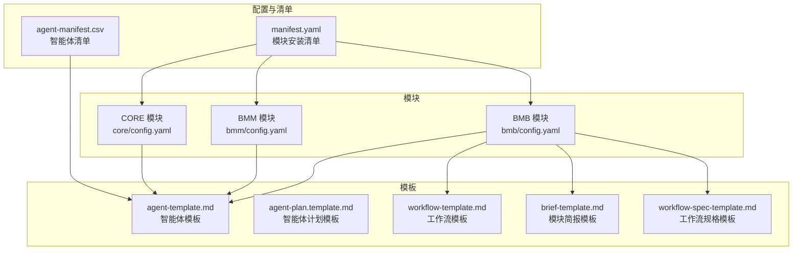
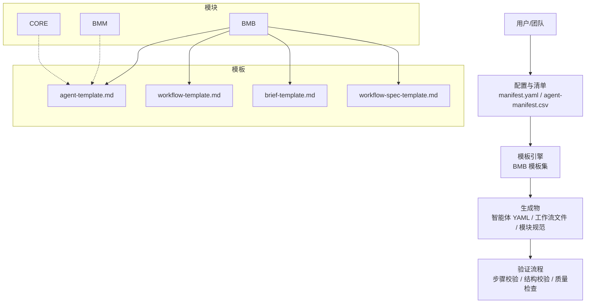
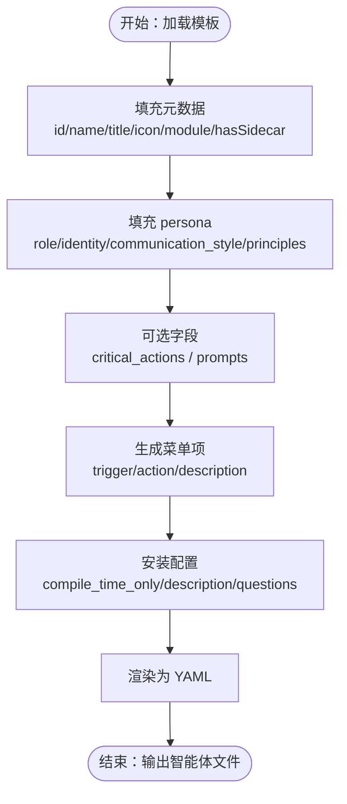
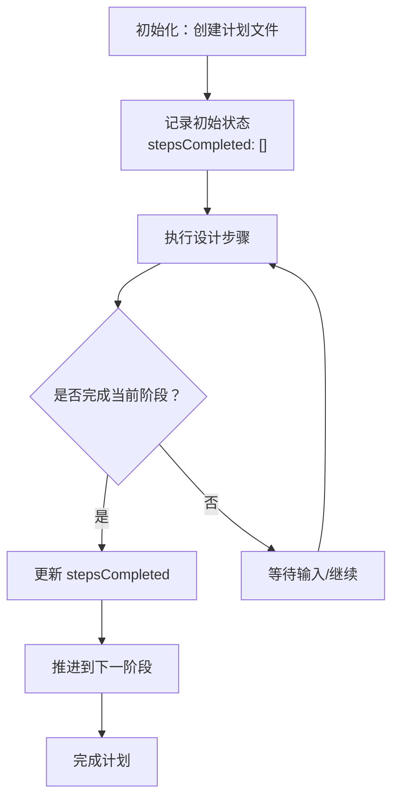
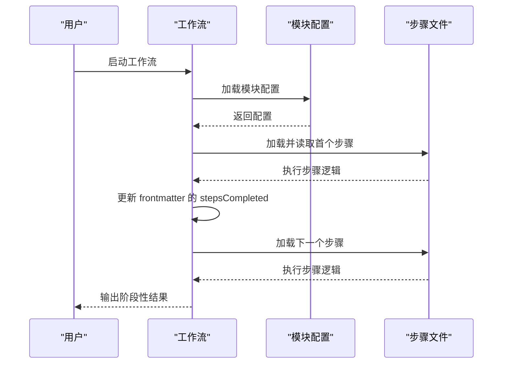
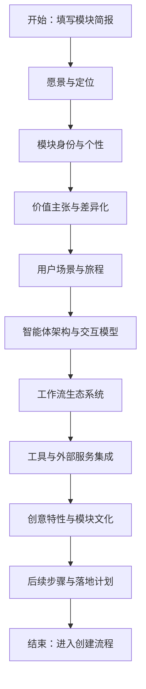
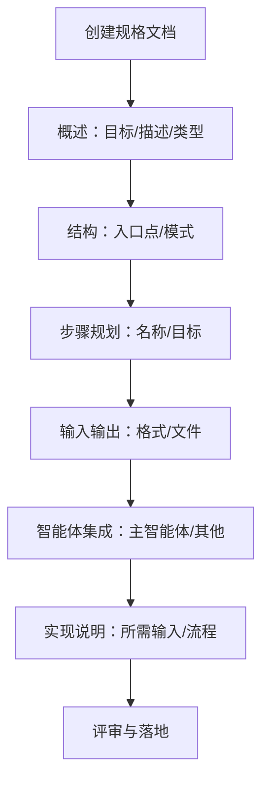
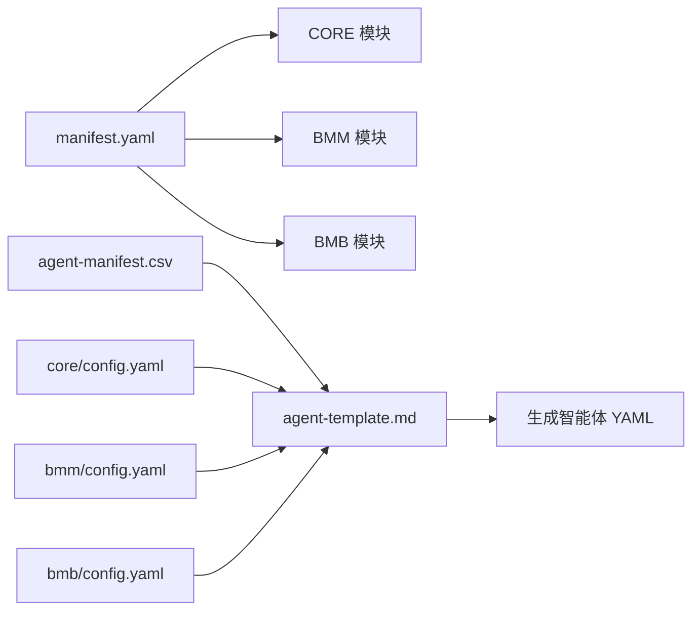

# 智能体模板系统

<cite>
**本文档引用的文件**
- [manifest.yaml](file://_bmad/_config/manifest.yaml)
- [config.yaml（BMB模块）](file://_bmad/bmb/config.yaml)
- [config.yaml（BMM模块）](file://_bmad/bmm/config.yaml)
- [config.yaml（CORE模块）](file://_bmad/core/config.yaml)
- [agent-manifest.csv](file://_bmad/_config/agent-manifest.csv)
- [agent-template.md](file://_bmad/bmb/workflows/agent/templates/agent-template.md)
- [agent-plan.template.md](file://_bmad/bmb/workflows/agent/templates/agent-plan.template.md)
- [workflow-template.md](file://_bmad/bmb/workflows/workflow/templates/workflow-template.md)
- [brief-template.md](file://_bmad/bmb/workflows/module/templates/brief-template.md)
- [workflow-spec-template.md](file://_bmad/bmb/workflows/module/templates/workflow-spec-template.md)
</cite>

## 目录
1. [简介](#简介)
2. [项目结构](#项目结构)
3. [核心组件](#核心组件)
4. [架构总览](#架构总览)
5. [详细组件分析](#详细组件分析)
6. [依赖关系分析](#依赖关系分析)
7. [性能考虑](#性能考虑)
8. [故障排除指南](#故障排除指南)
9. [结论](#结论)
10. [附录](#附录)

## 简介
本文件系统性梳理 BMAD 智能体模板体系，涵盖标准智能体模板、计划模板、架构模式与编译规则等核心要素。文档面向不同技术背景读者，既提供高层概览，也给出可操作的实践建议，帮助用户快速理解并高效使用智能体模板系统，完成从“基础智能体”到“复合功能智能体”的设计与实现。

## 项目结构
BMAD 模板系统由三大模块构成：CORE（核心）、BMM（业务与管理）、BMB（构建器）。各模块通过统一的清单与配置文件进行版本与安装管理；模板文件位于各模块的 workflows 目录下，用于指导智能体、工作流与模块的创建与验证。

图表来源
- [manifest.yaml:1-33](file://_bmad/_config/manifest.yaml#L1-L33)
- [config.yaml（CORE模块）:1-10](file://_bmad/core/config.yaml#L1-L10)
- [config.yaml（BMM模块）:1-17](file://_bmad/bmm/config.yaml#L1-L17)
- [config.yaml（BMB模块）:1-13](file://_bmad/bmb/config.yaml#L1-L13)
- [agent-template.md:1-90](file://_bmad/bmb/workflows/agent/templates/agent-template.md#L1-L90)
- [agent-plan.template.md:1-6](file://_bmad/bmb/workflows/agent/templates/agent-plan.template.md#L1-L6)
- [workflow-template.md:1-103](file://_bmad/bmb/workflows/workflow/templates/workflow-template.md#L1-L103)
- [brief-template.md:1-155](file://_bmad/bmb/workflows/module/templates/brief-template.md#L1-L155)
- [workflow-spec-template.md:1-97](file://_bmad/bmb/workflows/module/templates/workflow-spec-template.md#L1-L97)

章节来源
- [manifest.yaml:1-33](file://_bmad/_config/manifest.yaml#L1-L33)
- [config.yaml（BMB模块）:1-13](file://_bmad/bmb/config.yaml#L1-L13)
- [config.yaml（BMM模块）:1-17](file://_bmad/bmm/config.yaml#L1-L17)
- [config.yaml（CORE模块）:1-10](file://_bmad/core/config.yaml#L1-L10)

## 核心组件
- 模块与安装清单：通过 manifest.yaml 统一记录模块版本、安装时间与来源，确保系统可追溯与可升级。
- 模块配置：各模块的 config.yaml 提供项目名、语言、输出目录等关键参数，决定模板渲染与生成路径。
- 智能体清单：agent-manifest.csv 定义内置智能体的元数据与职责边界，为模板选择与组合提供依据。
- 模板集合：BMB 模块提供智能体、工作流、模块相关模板，支撑从“蓝图”到“产物”的全链路生成。

章节来源
- [manifest.yaml:1-33](file://_bmad/_config/manifest.yaml#L1-L33)
- [config.yaml（BMB模块）:1-13](file://_bmad/bmb/config.yaml#L1-L13)
- [config.yaml（BMM模块）:1-17](file://_bmad/bmm/config.yaml#L1-L17)
- [config.yaml（CORE模块）:1-10](file://_bmad/core/config.yaml#L1-L10)
- [agent-manifest.csv:1-15](file://_bmad/_config/agent-manifest.csv#L1-L15)

## 架构总览
BMAD 模板系统采用“模块化 + 模板驱动”的架构：模块负责能力域划分，模板负责结构与内容生成，清单负责版本与来源治理。智能体模板与工作流模板共同构成“设计—构建—验证”的闭环。

图表来源
- [manifest.yaml:1-33](file://_bmad/_config/manifest.yaml#L1-L33)
- [agent-manifest.csv:1-15](file://_bmad/_config/agent-manifest.csv#L1-L15)
- [agent-template.md:1-90](file://_bmad/bmb/workflows/agent/templates/agent-template.md#L1-L90)
- [workflow-template.md:1-103](file://_bmad/bmb/workflows/workflow/templates/workflow-template.md#L1-L103)
- [brief-template.md:1-155](file://_bmad/bmb/workflows/module/templates/brief-template.md#L1-L155)
- [workflow-spec-template.md:1-97](file://_bmad/bmb/workflows/module/templates/workflow-spec-template.md#L1-L97)

## 详细组件分析

### 标准智能体模板（agent-template）
- 设计目标：以统一的 YAML 结构描述智能体的元数据、角色、身份、沟通风格、原则、关键动作、提示词、菜单与安装配置。
- 关键字段族：
  - 元数据：id、name、title、icon、module、hasSidecar、sidecar-folder/sidecar-path
  - persona：role、identity、communication_style、principles
  - 可选：critical_actions、prompts
  - 菜单：trigger、action（支持 prompt 引用或内联动作）、description
  - 安装配置：compile_time_only、description、questions（含 var、prompt、type、options、default）
- 渲染方式：通过 Handlebars 模板在“构建智能体”步骤中生成最终 YAML，确保一致性与可维护性。

图表来源
- [agent-template.md:1-90](file://_bmad/bmb/workflows/agent/templates/agent-template.md#L1-L90)

章节来源
- [agent-template.md:1-90](file://_bmad/bmb/workflows/agent/templates/agent-template.md#L1-L90)

### 计划模板（agent-plan.template）
- 设计目标：为智能体设计与构建过程提供阶段性计划框架，便于跟踪与复盘。
- 内容要点：frontmatter 中记录已完成步骤数组，配合工作流执行进度进行状态更新。

图表来源
- [agent-plan.template.md:1-6](file://_bmad/bmb/workflows/agent/templates/agent-plan.template.md#L1-L6)

章节来源
- [agent-plan.template.md:1-6](file://_bmad/bmb/workflows/agent/templates/agent-plan.template.md#L1-L6)

### 工作流模板（workflow-template）
- 设计目标：提供标准化工作流骨架，确保所有工作流遵循一致的“微文件设计、即时加载、顺序执行、状态追踪”原则。
- 核心原则与规则：
  - 微文件设计：每步为独立指令文件
  - 即时加载：仅加载当前步骤，完成后才进入下一步
  - 顺序强制：严格按编号顺序执行
  - 状态追踪：在输出文件 frontmatter 中记录 stepsCompleted
  - 初始化序列：加载模块配置，再执行首个步骤
- 使用指南：复制模板，替换占位符，创建目录结构，配置初始化路径。

图表来源
- [workflow-template.md:1-103](file://_bmad/bmb/workflows/workflow/templates/workflow-template.md#L1-L103)

章节来源
- [workflow-template.md:1-103](file://_bmad/bmb/workflows/workflow/templates/workflow-template.md#L1-L103)

### 模块简报模板（brief-template）
- 设计目标：在模块创建前提供结构化简报，明确愿景、身份、价值主张、用户场景、智能体编组、工作流生态、工具集成与创意特性。
- 关键板块：执行摘要、模块身份、模块类型、独特价值主张、用户场景、智能体架构、工作流生态、工具与集成、创意特性、后续步骤。
- 用途：作为模块开发的“路线图”，指导后续的“创建模块”“创建智能体”“创建工作流”流程。

图表来源
- [brief-template.md:1-155](file://_bmad/bmb/workflows/module/templates/brief-template.md#L1-L155)

章节来源
- [brief-template.md:1-155](file://_bmad/bmb/workflows/module/templates/brief-template.md#L1-L155)

### 工作流规格模板（workflow-spec-template）
- 设计目标：规范化工作流的结构、目标、步骤、输入输出与智能体集成，便于评审与实施。
- 关键要素：概述（目标、描述、类型）、结构（入口点、模式）、步骤规划、输入输出、智能体集成、实现说明。
- 用途：作为工作流创建的“规格说明书”，确保设计与实现的一致性。

图表来源
- [workflow-spec-template.md:1-97](file://_bmad/bmb/workflows/module/templates/workflow-spec-template.md#L1-L97)

章节来源
- [workflow-spec-template.md:1-97](file://_bmad/bmb/workflows/module/templates/workflow-spec-template.md#L1-L97)

### 智能体类型与适用场景
- 基础智能体：适用于通用任务执行与知识管理，强调稳定性与可复用性。
- 专业领域智能体：针对特定角色（如分析师、架构师、开发者、产品经理、QA、UX设计师、技术作家、敏捷教练），具备明确职责与沟通风格。
- 复合功能智能体：结合多个角色能力，支持跨职能协作与端到端交付。
- 选择建议：
  - 明确目标：优先选择职责最贴近目标的智能体
  - 角色互补：需要多角色协同时，优先考虑复合型智能体
  - 语言与风格：根据沟通需求选择合适风格与原则
  - 验证与迭代：通过验证流程持续优化智能体行为与菜单

章节来源
- [agent-manifest.csv:1-15](file://_bmad/_config/agent-manifest.csv#L1-L15)

### 继承机制与定制化选项
- 继承与扩展：
  - 模块间继承：智能体模板可被 CORE/BMM/BMB 模块共享与扩展，通过模块配置与清单控制来源与版本
  - 模板继承：工作流模板提供统一骨架，具体工作流在此基础上填充步骤与规则
- 定制化选项：
  - 智能体：角色、身份、沟通风格、原则、关键动作、提示词、菜单、安装配置均可定制
  - 工作流：步骤序列、输入输出、状态追踪、错误处理策略可定制
  - 模块：简报与规格模板用于模块级定制，确保从蓝图到产物的一致性

章节来源
- [manifest.yaml:1-33](file://_bmad/_config/manifest.yaml#L1-L33)
- [agent-template.md:1-90](file://_bmad/bmb/workflows/agent/templates/agent-template.md#L1-L90)
- [workflow-template.md:1-103](file://_bmad/bmb/workflows/workflow/templates/workflow-template.md#L1-L103)
- [brief-template.md:1-155](file://_bmad/bmb/workflows/module/templates/brief-template.md#L1-L155)
- [workflow-spec-template.md:1-97](file://_bmad/bmb/workflows/module/templates/workflow-spec-template.md#L1-L97)

### 模板开发指南与最佳实践
- 模板开发：
  - 以最小可用为起点，逐步完善字段与规则
  - 保持模板与工作流规则的一致性，避免语义歧义
  - 通过验证流程（结构、菜单、输出格式、协作体验）持续改进
- 自定义模板创建：
  - 使用对应模板（智能体/工作流/模块简报/规格）作为蓝本
  - 替换占位符，补充模块特定变量
  - 在模块配置中设置输出路径与语言偏好
  - 通过清单管理模板版本与来源
- 最佳实践：
  - 先蓝图后产物：先完成简报与规格，再创建智能体与工作流
  - 以工作流为中心：围绕工作流目标设计智能体与菜单
  - 注重可验证性：每个步骤都应有明确的输入、输出与验收标准
  - 持续演进：基于反馈迭代模板与规则

章节来源
- [config.yaml（BMB模块）:1-13](file://_bmad/bmb/config.yaml#L1-L13)
- [config.yaml（BMM模块）:1-17](file://_bmad/bmm/config.yaml#L1-L17)
- [config.yaml（CORE模块）:1-10](file://_bmad/core/config.yaml#L1-L10)
- [workflow-template.md:1-103](file://_bmad/bmb/workflows/workflow/templates/workflow-template.md#L1-L103)
- [brief-template.md:1-155](file://_bmad/bmb/workflows/module/templates/brief-template.md#L1-L155)
- [workflow-spec-template.md:1-97](file://_bmad/bmb/workflows/module/templates/workflow-spec-template.md#L1-L97)

## 依赖关系分析
- 模块依赖：manifest.yaml 记录模块来源与版本，确保安装与升级可追踪
- 模板依赖：智能体模板依赖模块配置与清单，工作流模板依赖模块配置与步骤文件
- 智能体清单依赖：agent-manifest.csv 为智能体选择与组合提供元数据

图表来源
- [manifest.yaml:1-33](file://_bmad/_config/manifest.yaml#L1-L33)
- [agent-manifest.csv:1-15](file://_bmad/_config/agent-manifest.csv#L1-L15)
- [agent-template.md:1-90](file://_bmad/bmb/workflows/agent/templates/agent-template.md#L1-L90)
- [config.yaml（CORE模块）:1-10](file://_bmad/core/config.yaml#L1-L10)
- [config.yaml（BMM模块）:1-17](file://_bmad/bmm/config.yaml#L1-L17)
- [config.yaml（BMB模块）:1-13](file://_bmad/bmb/config.yaml#L1-L13)

章节来源
- [manifest.yaml:1-33](file://_bmad/_config/manifest.yaml#L1-L33)
- [agent-manifest.csv:1-15](file://_bmad/_config/agent-manifest.csv#L1-L15)

## 性能考虑
- 模板渲染性能：尽量减少复杂嵌套与重复计算，优先使用简洁字段映射
- 工作流执行性能：严格遵守“即时加载、顺序执行、状态追踪”，避免一次性加载过多步骤
- 输出体积控制：通过“追加式构建”与“微文件设计”降低内存占用与IO压力
- 缓存与复用：对常用配置与模板进行缓存与版本化管理，提升迭代效率

## 故障排除指南
- 模板未生效：
  - 检查模板路径与模块配置中的输出目录是否一致
  - 确认清单中模块来源与版本是否正确
- 智能体行为异常：
  - 校验 persona/communication_style/principles 是否与目标一致
  - 检查菜单与关键动作是否覆盖预期场景
- 工作流执行中断：
  - 确认步骤文件命名与顺序是否符合约定
  - 检查 frontmatter 中 stepsCompleted 是否正确更新
- 模块创建问题：
  - 使用简报与规格模板核对模块目标与实现路径
  - 通过验证流程逐项检查结构与质量

章节来源
- [workflow-template.md:1-103](file://_bmad/bmb/workflows/workflow/templates/workflow-template.md#L1-L103)
- [agent-template.md:1-90](file://_bmad/bmb/workflows/agent/templates/agent-template.md#L1-L90)
- [brief-template.md:1-155](file://_bmad/bmb/workflows/module/templates/brief-template.md#L1-L155)
- [workflow-spec-template.md:1-97](file://_bmad/bmb/workflows/module/templates/workflow-spec-template.md#L1-L97)

## 结论
BMAD 智能体模板系统通过“模块化 + 模板驱动 + 清单治理”的方式，实现了从蓝图到产物的标准化与可复用。掌握标准智能体模板、计划模板、工作流模板与模块模板的使用方法，结合清单与配置管理，即可高效构建从基础到复合的各类智能体与工作流，支撑复杂项目的端到端交付。

## 附录
- 快速参考
  - 智能体模板字段：元数据、persona、可选字段、菜单、安装配置
  - 工作流模板原则：微文件设计、即时加载、顺序执行、状态追踪
  - 模块模板：简报模板与规格模板用于模块级规划与落地
- 进一步阅读
  - 通过 agent-manifest.csv 了解内置智能体的角色与职责
  - 通过 manifest.yaml 了解模块来源与版本信息