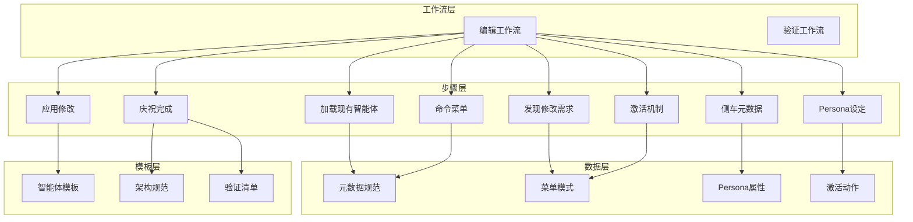
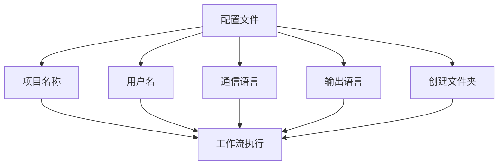
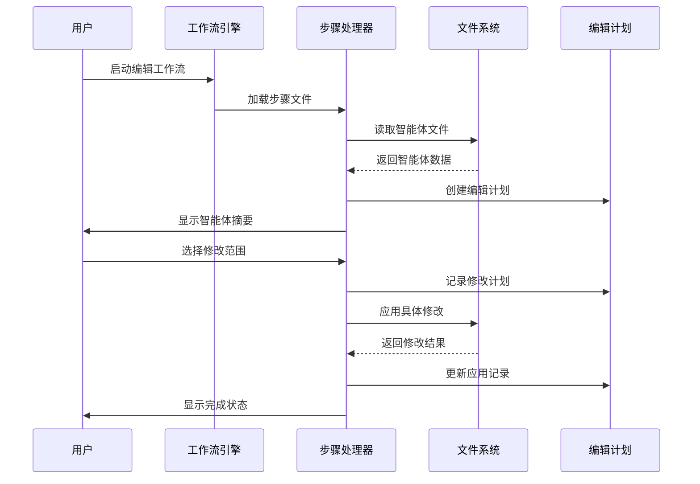
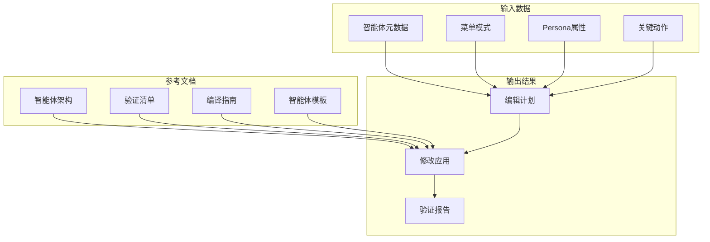

# 编辑智能体工作流

<cite>
**本文档引用的文件**
- [workflow-edit-agent.md](file://_bmad/bmb/workflows/agent/workflow-edit-agent.md)
- [workflow-validate-agent.md](file://_bmad/bmb/workflows/agent/workflow-validate-agent.md)
- [e-01-load-existing.md](file://_bmad/bmb/workflows/agent/steps-e/e-01-load-existing.md)
- [e-02-discover-edits.md](file://_bmad/bmb/workflows/agent/steps-e/e-02-discover-edits.md)
- [e-03-placeholder.md](file://_bmad/bmb/workflows/agent/steps-e/e-03-placeholder.md)
- [e-04-sidecar-metadata.md](file://_bmad/bmb/workflows/agent/steps-e/e-04-sidecar-metadata.md)
- [e-05-persona.md](file://_bmad/bmb/workflows/agent/steps-e/e-05-persona.md)
- [e-06-commands-menu.md](file://_bmad/bmb/workflows/agent/steps-e/e-06-commands-menu.md)
- [e-07-activation.md](file://_bmad/bmb/workflows/agent/steps-e/e-07-activation.md)
- [e-08-edit-agent.md](file://_bmad/bmb/workflows/agent/steps-e/e-08-edit-agent.md)
- [agent-metadata.md](file://_bmad/bmb/workflows/agent/data/agent-metadata.md)
- [agent-menu-patterns.md](file://_bmad/bmb/workflows/agent/data/agent-menu-patterns.md)
- [persona-properties.md](file://_bmad/bmb/workflows/agent/data/persona-properties.md)
- [principles-crafting.md](file://_bmad/bmb/workflows/agent/data/principles-crafting.md)
- [communication-presets.csv](file://_bmad/bmb/workflows/agent/data/communication-presets.csv)
- [critical-actions.md](file://_bmad/bmb/workflows/agent/data/critical-actions.md)
- [understanding-agent-types.md](file://_bmad/bmb/workflows/agent/data/understanding-agent-types.md)
- [agent-architecture.md](file://_bmad/bmb/workflows/agent/data/agent-architecture.md)
- [agent-validation.md](file://_bmad/bmb/workflows/agent/data/agent-validation.md)
- [agent-compilation.md](file://_bmad/bmb/workflows/agent/data/agent-compilation.md)
- [agent-template.md](file://_bmad/bmb/workflows/agent/templates/agent-template.md)
- [bmb-config.yaml](file://_bmad/bmb/config.yaml)
- [bmad-master.md](file://_bmad/core/agents/bmad-master.md)
- [advanced-elicitation/workflow.xml](file://_bmad/core/workflows/advanced-elicitation/workflow.xml)
- [party-mode/workflow.md](file://_bmad/core/workflows/party-mode/workflow.md)
</cite>

## 目录
1. [简介](#简介)
2. [项目结构](#项目结构)
3. [核心组件](#核心组件)
4. [架构概览](#架构概览)
5. [详细组件分析](#详细组件分析)
6. [依赖关系分析](#依赖关系分析)
7. [性能考虑](#性能考虑)
8. [故障排除指南](#故障排除指南)
9. [结论](#结论)
10. [附录](#附录)

## 简介

BMAD智能体编辑工作流是一个系统化的智能体修改和优化框架，专为维护BMAD核心合规性的前提下对现有智能体进行精确修改而设计。该工作流采用微文件架构（micro-file architecture），通过严格的步骤化执行确保智能体修改的准确性和可追溯性。

该工作流的核心价值在于：
- **合规性保证**：所有修改均在BMAD核心框架内进行，确保智能体符合标准规范
- **渐进式改进**：通过九个精心设计的步骤实现分阶段、可验证的修改过程
- **版本控制集成**：内置备份机制和编辑计划跟踪，支持完整的版本管理
- **最佳实践指导**：提供针对不同类型智能体的优化策略和实施建议

## 项目结构

BMAD智能体编辑工作流采用模块化组织方式，主要分为以下几个层次：

**图表来源**
- [workflow-edit-agent.md:1-76](file://_bmad/bmb/workflows/agent/workflow-edit-agent.md#L1-L76)
- [e-01-load-existing.md:1-222](file://_bmad/bmb/workflows/agent/steps-e/e-01-load-existing.md#L1-L222)

**章节来源**
- [workflow-edit-agent.md:1-76](file://_bmad/bmb/workflows/agent/workflow-edit-agent.md#L1-L76)
- [workflow-validate-agent.md:1-74](file://_bmad/bmb/workflows/agent/workflow-validate-agent.md#L1-L74)

## 核心组件

### 工作流架构

编辑工作流基于微文件架构设计，每个步骤都是独立的指令文件，采用即时加载（Just-In-Time Loading）机制，仅在当前步骤执行时才加载到内存中。

**关键特性：**
- **微文件设计**：每个步骤文件包含完整的执行指令和验证逻辑
- **顺序执行**：严格按步骤编号顺序执行，不可跳过或重排
- **状态跟踪**：通过编辑计划文件跟踪进度和变更历史
- **模式感知路由**：根据智能体类型和用户选择动态路由到相应处理步骤

### 配置管理系统

工作流通过集中配置文件管理所有运行参数和环境设置：

**图表来源**
- [bmb-config.yaml](file://_bmad/bmb/config.yaml)

**章节来源**
- [workflow-edit-agent.md:51-64](file://_bmad/bmb/workflows/agent/workflow-edit-agent.md#L51-L64)
- [bmb-config.yaml](file://_bmad/bmb/config.yaml)

## 架构概览

### 整体工作流架构

**图表来源**
- [e-01-load-existing.md:66-131](file://_bmad/bmb/workflows/agent/steps-e/e-01-load-existing.md#L66-L131)
- [e-08-edit-agent.md:50-59](file://_bmad/bmb/workflows/agent/steps-e/e-08-edit-agent.md#L50-L59)

### 步骤间依赖关系

**图表来源**
- [workflow-edit-agent.md:16-46](file://_bmad/bmb/workflows/agent/workflow-edit-agent.md#L16-L46)
- [workflow-validate-agent.md:16-46](file://_bmad/bmb/workflows/agent/workflow-validate-agent.md#L16-L46)

## 详细组件分析

### 步骤1：加载现有智能体

这是整个编辑流程的起点，负责完整加载和分析现有智能体的结构。

#### 核心功能分析

**文件加载与解析：**
- 完整读取智能体YAML文件，包括主文件和可能的侧车文件
- 解析智能体的基本元数据、Persona设定、命令菜单和关键动作
- 验证YAML格式的有效性和完整性

**智能体分类系统：**
- **简单智能体**：stand-alone模块，无侧车功能
- **专家智能体**：具有侧车功能的智能体
- **模块智能体**：属于特定模块（如bmm、bmb等）的智能体
- **模块专家智能体**：既是模块智能体又具备侧车功能

**编辑计划创建：**
自动创建包含以下信息的编辑计划文件：
- 原始智能体快照
- 当前结构分析
- 可编辑组件列表
- 修改历史跟踪

**章节来源**
- [e-01-load-existing.md:66-131](file://_bmad/bmb/workflows/agent/steps-e/e-01-load-existing.md#L66-L131)
- [e-01-load-existing.md:132-178](file://_bmad/bmb/workflows/agent/steps-e/e-01-load-existing.md#L132-L178)

### 步骤2：发现修改需求

此步骤专注于与用户协作，明确具体的修改目标和范围。

#### 发现策略

**多维度编辑分类：**
- **Persona编辑**：角色定义、身份认同、沟通风格、行为原则
- **命令菜单编辑**：新增、删除或修改命令及其触发词
- **元数据编辑**：名称、描述、版本号、标签等
- **侧车转换**：添加或移除记忆功能
- **关键动作编辑**：激活行为和执行逻辑
- **其他配置**：能力配置、系统上下文等

**深度挖掘技术：**
通过一系列有针对性的问题帮助用户澄清修改意图：
- 角色定位的精确性评估
- 沟通风格的适用性分析
- 命令触发词的直观性检查
- 元数据准确性的验证

**章节来源**
- [e-02-discover-edits.md:66-153](file://_bmad/bmb/workflows/agent/steps-e/e-02-discover-edits.md#L66-L153)

### 步骤3：侧车和元数据规划

侧车功能是BMAD智能体的重要特性，涉及复杂的文件结构和激活机制。

#### 侧车转换决策

**转换场景分析：**
- **从无侧车到有侧车**：需要创建侧车目录结构，添加关键动作以加载侧车文件
- **从有侧车到无侧车**：清理侧车相关字段，保留非侧车激活行为

**元数据规范遵循：**
- ID字段必须使用kebab-case格式
- 名称字段遵循显示命名约定
- 标题字段采用功能描述格式
- 图标字段使用emoji或符号
- 模块字段遵循路径格式要求

**章节来源**
- [e-04-sidecar-metadata.md:53-85](file://_bmad/bmb/workflows/agent/steps-e/e-04-sidecar-metadata.md#L53-L85)

### 步骤4：Persona设定优化

Persona是智能体的核心身份标识，采用四字段系统确保一致性。

#### 四字段系统

**角色（Role）定义：**
- 职业功能的清晰定义
- 专业领域和能力边界
- 任务导向而非个人特质

**身份（Identity）构建：**
- 个性特征和态度
- 世界观和价值观
- 与职业描述的区别

**沟通风格（Communication Style）：**
- 说话方式和语调
- 正式程度和亲和力
- 语音特点和表达习惯

**行为原则（Principles）设计：**
- 首个原则必须能够激活专业知识
- 其他原则指导决策制定
- 遵循专门的原理设计指南

**章节来源**
- [e-05-persona.md:56-95](file://_bmad/bmb/workflows/agent/steps-e/e-05-persona.md#L56-L95)

### 步骤5：命令菜单设计

命令菜单是用户与智能体交互的主要界面，需要遵循严格的设计模式。

#### A/P/C模式规范

**A类命令（Action）：**
- 直接执行的具体操作
- 触发词简洁明了
- 描述准确概括功能

**P类命令（Process）：**
- 处理复杂流程的任务
- 包含多个子步骤
- 需要逐步指导

**C类命令（Consultation）：**
- 提供咨询和建议
- 基于专业知识的判断
- 支持进一步讨论

**菜单结构优化：**
- 触发词遵循直观性原则
- 描述保持简洁性
- 动作处理器正确引用能力

**章节来源**
- [e-06-commands-menu.md:53-83](file://_bmad/bmb/workflows/agent/steps-e/e-06-commands-menu.md#L53-L83)

### 步骤6：激活机制规划

激活机制决定了智能体何时以及如何响应用户请求。

#### 关键动作设计

**激活模式识别：**
- 基于hasSidecar值确定编辑路径
- 单文件智能体vs侧车智能体的不同处理
- 自动路由到相应的编辑步骤

**关键动作规范：**
- 清晰的动作名称定义
- 准确的功能描述
- 正确的调用机制

**路径验证：**
- 确保所有侧车引用使用正确的项目根路径格式
- 验证激活行为的逻辑正确性

**章节来源**
- [e-07-activation.md:50-81](file://_bmad/bmb/workflows/agent/steps-e/e-07-activation.md#L50-L81)

### 步骤7：应用修改实现

这是整个工作流的核心执行阶段，负责将所有计划的修改实际应用到智能体文件中。

#### 修改应用策略

**备份优先原则：**
- 在任何修改前创建完整备份
- 备份文件包含时间戳信息
- 支持快速回滚操作

**修改执行顺序：**
1. 侧车转换（如有需要）
2. 元数据更新
3. Persona设定替换
4. 命令菜单调整
5. 关键动作更新

**验证机制：**
- 每次修改后立即验证YAML语法
- 对侧车智能体额外验证路径格式
- 确保所有引用指向正确的项目结构

**章节来源**
- [e-08-edit-agent.md:90-152](file://_bmad/bmb/workflows/agent/steps-e/e-08-edit-agent.md#L90-L152)

## 依赖关系分析

### 数据依赖图

**图表来源**
- [e-08-edit-agent.md:64-72](file://_bmad/bmb/workflows/agent/steps-e/e-08-edit-agent.md#L64-L72)

### 外部依赖

工作流依赖于以下外部资源：
- **BMAD核心框架**：提供基础架构和规范
- **高级提取工作流**：用于深入挖掘用户需求
- **派对模式工作流**：提供创意激发和头脑风暴
- **项目配置文件**：管理运行参数和环境设置

**章节来源**
- [advanced-elicitation/workflow.xml](file://_bmad/core/workflows/advanced-elicitation/workflow.xml)
- [party-mode/workflow.md](file://_bmad/core/workflows/party-mode/workflow.md)

## 性能考虑

### 执行效率优化

**即时加载机制：**
- 仅在当前步骤执行时加载相关文件
- 避免内存占用过大
- 支持大型智能体文件的处理

**并行处理能力：**
- 步骤间天然串行，避免冲突
- 可同时处理多个智能体的独立编辑任务
- 支持批量修改场景

**资源管理：**
- 文件操作最小化，减少磁盘I/O
- 内存使用受控，适合长时间运行
- 错误恢复机制确保任务连续性

### 存储优化

**编辑计划管理：**
- 结构化存储修改历史
- 支持增量更新和查询
- 提供完整的审计追踪

**备份策略：**
- 自动创建版本化备份
- 支持快速恢复和比较
- 最小化存储空间占用

## 故障排除指南

### 常见问题及解决方案

**智能体文件加载失败：**
- 检查文件路径是否正确
- 验证YAML格式的语法正确性
- 确认文件权限设置

**编辑计划创建失败：**
- 检查输出目录的写入权限
- 验证磁盘空间充足
- 确认文件名不包含非法字符

**修改应用错误：**
- 检查备份文件是否成功创建
- 验证修改内容符合规范
- 确认所有引用路径正确

**验证失败：**
- 按照验证清单逐项检查
- 查看详细的错误日志
- 使用简化测试用例复现问题

### 错误恢复机制

**自动回滚：**
- 失败时自动恢复到备份状态
- 保持原始智能体文件不变
- 提供完整的修改历史记录

**手动干预：**
- 支持部分修改的撤销
- 提供详细的修改差异报告
- 允许用户进行手动修正

**章节来源**
- [e-08-edit-agent.md:187-193](file://_bmad/bmb/workflows/agent/steps-e/e-08-edit-agent.md#L187-L193)

## 结论

BMAD智能体编辑工作流提供了一个完整、规范且可扩展的智能体修改框架。通过九个精心设计的步骤，该工作流确保了修改过程的准确性、可追溯性和合规性。

### 主要优势

**系统化方法：** 从需求发现到最终验证的完整生命周期管理
**合规性保障：** 在BMAD核心框架内进行所有修改，确保标准一致性
**风险控制：** 内置备份和验证机制，降低修改风险
**可扩展性：** 模块化设计支持新功能的添加和现有功能的增强

### 最佳实践建议

**渐进式改进策略：**
- 小步快跑，每次只修改一个方面
- 在每个步骤完成后进行验证
- 建立定期的回归测试流程

**版本控制和回滚：**
- 始终创建备份，特别是重大修改前
- 使用编辑计划跟踪所有变更
- 建立标准化的发布流程

**团队协作：**
- 建立修改审批流程
- 定期进行代码审查
- 维护修改文档和知识库

## 附录

### 编辑示例和最佳实践

#### 针对不同类型智能体的优化策略

**简单智能体优化：**
- 简化命令菜单，提高易用性
- 优化Persona设定，明确角色边界
- 添加必要的元数据标签

**专家智能体优化：**
- 丰富侧车内容，增强记忆能力
- 优化关键动作，提升响应质量
- 完善激活机制，改善用户体验

**模块智能体优化：**
- 保持模块一致性，遵循模块规范
- 优化与其他模块的集成
- 提升模块间的协作效率

#### 编辑前后对比分析

**性能指标：**
- 响应时间改善程度
- 准确性提升幅度
- 用户满意度变化

**质量评估：**
- 合规性检查通过率
- 功能完整性验证
- 兼容性测试结果

**章节来源**
- [understanding-agent-types.md](file://_bmad/bmb/workflows/agent/data/understanding-agent-types.md)
- [agent-architecture.md](file://_bmad/bmb/workflows/agent/data/agent-architecture.md)