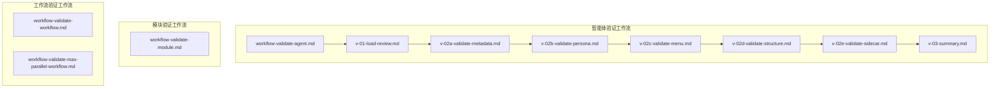
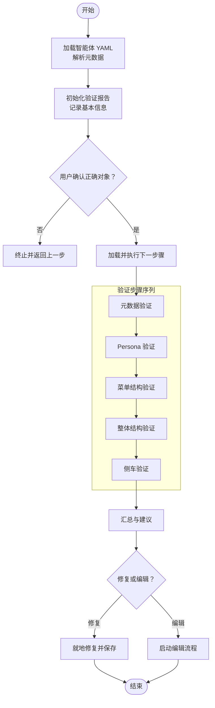
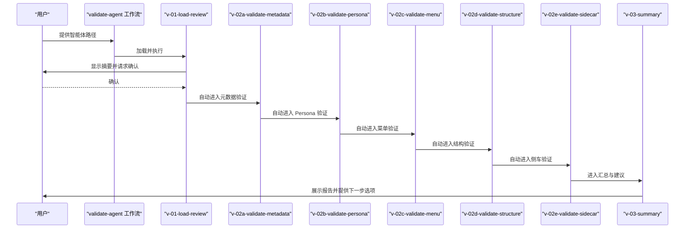
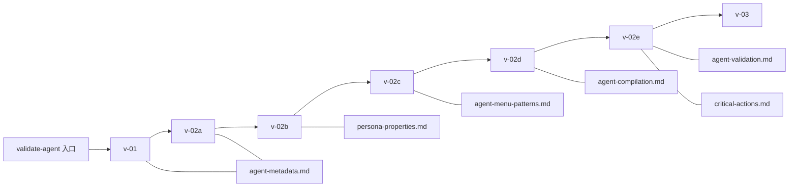

# 验证智能体工作流

<cite>
**本文引用的文件**
- [workflow-validate-agent.md](file://_bmad/bmb/workflows/agent/workflow-validate-agent.md)
- [v-01-load-review.md](file://_bmad/bmb/workflows/agent/steps-v/v-01-load-review.md)
- [v-02a-validate-metadata.md](file://_bmad/bmb/workflows/agent/steps-v/v-02a-validate-metadata.md)
- [v-02b-validate-persona.md](file://_bmad/bmb/workflows/agent/steps-v/v-02b-validate-persona.md)
- [v-02c-validate-menu.md](file://_bmad/bmb/workflows/agent/steps-v/v-02c-validate-menu.md)
- [v-02d-validate-structure.md](file://_bmad/bmb/workflows/agent/steps-v/v-02d-validate-structure.md)
- [v-02e-validate-sidecar.md](file://_bmad/bmb/workflows/agent/steps-v/v-02e-validate-sidecar.md)
- [v-03-summary.md](file://_bmad/bmb/workflows/agent/steps-v/v-03-summary.md)
- [workflow-validate-module.md](file://_bmad/bmb/workflows/module/workflow-validate-module.md)
- [workflow-validate-workflow.md](file://_bmad/bmb/workflows/workflow/workflow-validate-workflow.md)
- [workflow-validate-max-parallel-workflow.md](file://_bmad/bmb/workflows/workflow/workflow-validate-max-parallel-workflow.md)
</cite>

## 目录
1. [简介](#简介)
2. [项目结构](#项目结构)
3. [核心组件](#核心组件)
4. [架构总览](#架构总览)
5. [详细组件分析](#详细组件分析)
6. [依赖关系分析](#依赖关系分析)
7. [性能考量](#性能考量)
8. [故障排查指南](#故障排查指南)
9. [结论](#结论)
10. [附录](#附录)

## 简介
本文件系统化阐述 BMAD 智能体验证工作流的设计与执行方法，覆盖从加载待验证智能体到生成综合报告的全流程。该工作流以“步骤文件（step-file）架构”为核心，严格遵循顺序执行、就地加载、状态跟踪与模式感知路由等原则，确保每次验证过程可重复、可审计、可改进。工作流面向三类对象：智能体（Agent）、模块（Module）与工作流（Workflow），分别提供独立的验证入口与步骤序列。

验证范围包括但不限于：
- 元数据合规性检查（标识、名称、标题、图标、模块归属、侧车配置一致性）
- Persona 合规性检查（角色、身份、沟通风格、行为原则）
- 菜单结构审查（触发词格式、描述规范、动作处理器、与侧车配置的匹配）
- 整体架构评估（YAML 结构、字段类型、段落层次、路径引用）
- 侧车文件验证（侧车目录存在性、文件清单、路径格式、关键动作完整性）

同时，工作流提供评分体系与改进建议输出，支持用户在“就地修复”或“进入编辑流程”的两种路径中完成闭环优化。

## 项目结构
验证工作流位于 _bmad/bmb/workflows 下，按对象类型分为 agent、module、workflow 三大子目录，每个子目录包含：
- 工作流入口文件（workflow-*.md）：定义目标、角色、步骤架构、初始化序列与路由规则
- 步骤文件（steps-v/ 或 steps-e/）：具体验证步骤，采用“自包含指令文件 + 前言（frontmatter）声明”的组织方式

**图示来源**
- [workflow-validate-agent.md:1-74](file://_bmad/bmb/workflows/agent/workflow-validate-agent.md#L1-L74)
- [v-01-load-review.md:1-138](file://_bmad/bmb/workflows/agent/steps-v/v-01-load-review.md#L1-L138)
- [v-02a-validate-metadata.md:1-117](file://_bmad/bmb/workflows/agent/steps-v/v-02a-validate-metadata.md#L1-L117)
- [v-02b-validate-persona.md:1-125](file://_bmad/bmb/workflows/agent/steps-v/v-02b-validate-persona.md#L1-L125)
- [v-02c-validate-menu.md:1-128](file://_bmad/bmb/workflows/agent/steps-v/v-02c-validate-menu.md#L1-L128)
- [v-02d-validate-structure.md:1-135](file://_bmad/bmb/workflows/agent/steps-v/v-02d-validate-structure.md#L1-L135)
- [v-02e-validate-sidecar.md:1-135](file://_bmad/bmb/workflows/agent/steps-v/v-02e-validate-sidecar.md#L1-L135)
- [v-03-summary.md:1-105](file://_bmad/bmb/workflows/agent/steps-v/v-03-summary.md#L1-L105)
- [workflow-validate-module.md:1-67](file://_bmad/bmb/workflows/module/workflow-validate-module.md#L1-L67)
- [workflow-validate-workflow.md:1-66](file://_bmad/bmb/workflows/workflow/workflow-validate-workflow.md#L1-L66)
- [workflow-validate-max-parallel-workflow.md:1-67](file://_bmad/bmb/workflows/workflow/workflow-validate-max-parallel-workflow.md#L1-L67)

**章节来源**
- [workflow-validate-agent.md:1-74](file://_bmad/bmb/workflows/agent/workflow-validate-agent.md#L1-L74)
- [workflow-validate-module.md:1-67](file://_bmad/bmb/workflows/module/workflow-validate-module.md#L1-L67)
- [workflow-validate-workflow.md:1-66](file://_bmad/bmb/workflows/workflow/workflow-validate-workflow.md#L1-L66)
- [workflow-validate-max-parallel-workflow.md:1-67](file://_bmad/bmb/workflows/workflow/workflow-validate-max-parallel-workflow.md#L1-L67)

## 核心组件
- 工作流入口（Workflow Entry）
  - 智能体验证：通过 validate-agent 工作流入口加载目标智能体，初始化验证报告，随后按顺序执行各验证步骤
  - 模块验证：通过 validate-module 工作流入口加载模块简报或模块目录，执行模块级合规检查
  - 工作流验证：通过 validate-workflow 或 validate-max-parallel-workflow 加载目标工作流，执行结构与规范验证；后者支持并行优化

- 步骤文件（Step Files）
  - v-01-load-review：加载智能体 YAML，解析元数据，初始化验证报告，等待用户确认后进入后续步骤
  - v-02a-validate-metadata：基于参考文档校验元数据字段的存在性、格式与内容质量
  - v-02b-validate-persona：校验角色、身份、沟通风格与行为原则的一致性与质量
  - v-02c-validate-menu：校验菜单结构、触发词格式、描述规范与动作处理器的有效性
  - v-02d-validate-structure：校验 YAML 语法、字段类型、段落层次与路径引用的完整性
  - v-02e-validate-sidecar：当智能体启用侧车时，校验侧车目录、文件清单、路径格式与关键动作
  - v-03-summary：汇总所有验证结果，提供修复建议与下一步操作选项

- 状态与报告（State & Reporting）
  - 使用验证报告文档记录每一步的检查项、状态（通过/警告/失败/N/A）与详细发现
  - 报告前言包含被验证对象信息、验证日期与已完成步骤列表，便于审计与回溯

**章节来源**
- [workflow-validate-agent.md:1-74](file://_bmad/bmb/workflows/agent/workflow-validate-agent.md#L1-L74)
- [v-01-load-review.md:1-138](file://_bmad/bmb/workflows/agent/steps-v/v-01-load-review.md#L1-L138)
- [v-02a-validate-metadata.md:1-117](file://_bmad/bmb/workflows/agent/steps-v/v-02a-validate-metadata.md#L1-L117)
- [v-02b-validate-persona.md:1-125](file://_bmad/bmb/workflows/agent/steps-v/v-02b-validate-persona.md#L1-L125)
- [v-02c-validate-menu.md:1-128](file://_bmad/bmb/workflows/agent/steps-v/v-02c-validate-menu.md#L1-L128)
- [v-02d-validate-structure.md:1-135](file://_bmad/bmb/workflows/agent/steps-v/v-02d-validate-structure.md#L1-L135)
- [v-02e-validate-sidecar.md:1-135](file://_bmad/bmb/workflows/agent/steps-v/v-02e-validate-sidecar.md#L1-L135)
- [v-03-summary.md:1-105](file://_bmad/bmb/workflows/agent/steps-v/v-03-summary.md#L1-L105)

## 架构总览
验证工作流采用“微文件设计 + 就地加载 + 顺序强制 + 状态跟踪 + 模式感知路由”的架构，确保执行过程可控、可观测且可扩展。

**图示来源**
- [workflow-validate-agent.md:49-74](file://_bmad/bmb/workflows/agent/workflow-validate-agent.md#L49-L74)
- [v-01-load-review.md:30-120](file://_bmad/bmb/workflows/agent/steps-v/v-01-load-review.md#L30-L120)
- [v-02a-validate-metadata.md:31-112](file://_bmad/bmb/workflows/agent/steps-v/v-02a-validate-metadata.md#L31-L112)
- [v-02b-validate-persona.md:32-119](file://_bmad/bmb/workflows/agent/steps-v/v-02b-validate-persona.md#L32-L119)
- [v-02c-validate-menu.md:31-123](file://_bmad/bmb/workflows/agent/steps-v/v-02c-validate-menu.md#L31-L123)
- [v-02d-validate-structure.md:32-130](file://_bmad/bmb/workflows/agent/steps-v/v-02d-validate-structure.md#L32-L130)
- [v-02e-validate-sidecar.md:33-130](file://_bmad/bmb/workflows/agent/steps-v/v-02e-validate-sidecar.md#L33-L130)
- [v-03-summary.md:29-87](file://_bmad/bmb/workflows/agent/steps-v/v-03-summary.md#L29-L87)

## 详细组件分析

### 智能体验证工作流（validate-agent）
- 目标与角色
  - 目标：对现有 BMAD 核心合规智能体进行系统性审查，生成综合报告
  - 角色：验证专家与质量保证专家，提供可操作的改进建议
- 步骤架构
  - 微文件设计：每个步骤为自包含的指令文件
  - 就地加载：仅当前步骤在内存中
  - 顺序强制：步骤按序完成，不可跳过或优化
  - 状态跟踪：进度写入验证报告前言
  - 模式感知路由：验证专用步骤流
- 执行规则
  - 必须完整阅读步骤文件再执行
  - 在菜单处暂停等待用户选择
  - 保存状态后再加载下一步
  - 严格遵循步骤指令，不得预读未来步骤
- 初始化序列
  - 加载配置（项目名、用户名、通信语言、输出语言、输出目录）
  - 提示用户提供智能体文件路径（.agent.yaml）
  - 加载并执行验证步骤 v-01-load-review

**图示来源**
- [workflow-validate-agent.md:49-74](file://_bmad/bmb/workflows/agent/workflow-validate-agent.md#L49-L74)
- [v-01-load-review.md:30-120](file://_bmad/bmb/workflows/agent/steps-v/v-01-load-review.md#L30-L120)
- [v-02a-validate-metadata.md:31-112](file://_bmad/bmb/workflows/agent/steps-v/v-02a-validate-metadata.md#L31-L112)
- [v-02b-validate-persona.md:32-119](file://_bmad/bmb/workflows/agent/steps-v/v-02b-validate-persona.md#L32-L119)
- [v-02c-validate-menu.md:31-123](file://_bmad/bmb/workflows/agent/steps-v/v-02c-validate-menu.md#L31-L123)
- [v-02d-validate-structure.md:32-130](file://_bmad/bmb/workflows/agent/steps-v/v-02d-validate-structure.md#L32-L130)
- [v-02e-validate-sidecar.md:33-130](file://_bmad/bmb/workflows/agent/steps-v/v-02e-validate-sidecar.md#L33-L130)
- [v-03-summary.md:29-87](file://_bmad/bmb/workflows/agent/steps-v/v-03-summary.md#L29-L87)

**章节来源**
- [workflow-validate-agent.md:1-74](file://_bmad/bmb/workflows/agent/workflow-validate-agent.md#L1-L74)
- [v-01-load-review.md:1-138](file://_bmad/bmb/workflows/agent/steps-v/v-01-load-review.md#L1-L138)
- [v-02a-validate-metadata.md:1-117](file://_bmad/bmb/workflows/agent/steps-v/v-02a-validate-metadata.md#L1-L117)
- [v-02b-validate-persona.md:1-125](file://_bmad/bmb/workflows/agent/steps-v/v-02b-validate-persona.md#L1-L125)
- [v-02c-validate-menu.md:1-128](file://_bmad/bmb/workflows/agent/steps-v/v-02c-validate-menu.md#L1-L128)
- [v-02d-validate-structure.md:1-135](file://_bmad/bmb/workflows/agent/steps-v/v-02d-validate-structure.md#L1-L135)
- [v-02e-validate-sidecar.md:1-135](file://_bmad/bmb/workflows/agent/steps-v/v-02e-validate-sidecar.md#L1-L135)
- [v-03-summary.md:1-105](file://_bmad/bmb/workflows/agent/steps-v/v-03-summary.md#L1-L105)

### 模块验证工作流（validate-module）
- 目标与角色
  - 目标：对 BMAD 模块进行合规性与完整性检查
  - 角色：模块质量保证专家，提供可操作建议
- 步骤架构与规则
  - 微文件设计、就地加载、顺序强制、状态跟踪（输出文件前言）、追加构建
  - 关键规则：禁止同时加载多个步骤文件、必须完整阅读步骤文件、不得跳过或优化序列、必须更新输出文件前言
- 初始化序列
  - 加载配置并解析通信语言
  - 提示用户提供模块简报或模块目录路径
  - 加载并执行验证步骤

**章节来源**
- [workflow-validate-module.md:1-67](file://_bmad/bmb/workflows/module/workflow-validate-module.md#L1-L67)

### 工作流验证工作流（validate-workflow 与 validate-max-parallel-workflow）
- 目标与角色
  - validate-workflow：对 BMAD 工作流进行标准合规检查
  - validate-max-parallel-workflow：在支持并行子进程的工具下，使用最大并行度进行全面审查
- 步骤架构与规则
  - 微文件设计、就地加载、顺序强制、状态跟踪（输出文件前言）、追加构建、并行优化（后者）
- 初始化序列
  - 加载配置并解析通信语言
  - 提示用户提供 workflow.md 文件路径
  - 加载并执行验证步骤（普通模式或并行模式）

**章节来源**
- [workflow-validate-workflow.md:1-66](file://_bmad/bmb/workflows/workflow/workflow-validate-workflow.md#L1-L66)
- [workflow-validate-max-parallel-workflow.md:1-67](file://_bmad/bmb/workflows/workflow/workflow-validate-max-parallel-workflow.md#L1-L67)

### 验证标准与评分体系
- 评分维度
  - 元数据：标识唯一性、名称清晰度、标题准确性、图标恰当性、模块归属正确性、侧车配置一致性
  - Persona：角色具体性、身份明确性、沟通风格一致性、行为原则可操作性与数量适中性
  - 菜单：触发词格式、描述规范、动作处理器有效性、与侧车配置匹配性
  - 结构：YAML 语法正确性、字段类型与必填项、段落层次、路径引用合法性
  - 侧车：目录存在性、文件清单完整性、路径格式规范、关键动作完整性
- 状态标记
  - 通过（✅ PASS）：符合要求
  - 警告（⚠️ WARNING）：非阻塞性问题，建议关注
  - 失败（❌ FAIL）：阻塞性问题，必须修复
  - 不适用（N/A）：针对特定配置不适用的情况
- 报告结构
  - 概述：对象信息、验证日期、已完成步骤
  - 各验证项：状态、检查清单、详细发现（通过/警告/失败）
  - 总结：整体状态概览与改进建议

**章节来源**
- [v-02a-validate-metadata.md:47-108](file://_bmad/bmb/workflows/agent/steps-v/v-02a-validate-metadata.md#L47-L108)
- [v-02b-validate-persona.md:48-116](file://_bmad/bmb/workflows/agent/steps-v/v-02b-validate-persona.md#L48-L116)
- [v-02c-validate-menu.md:47-119](file://_bmad/bmb/workflows/agent/steps-v/v-02c-validate-menu.md#L47-L119)
- [v-02d-validate-structure.md:48-126](file://_bmad/bmb/workflows/agent/steps-v/v-02d-validate-structure.md#L48-L126)
- [v-02e-validate-sidecar.md:49-125](file://_bmad/bmb/workflows/agent/steps-v/v-02e-validate-sidecar.md#L49-L125)
- [v-03-summary.md:43-55](file://_bmad/bmb/workflows/agent/steps-v/v-03-summary.md#L43-L55)

### 验证示例与常见缺陷修复
- 示例一：元数据缺失
  - 现象：缺少 id、name、title、icon、module 等字段
  - 修复：补充字段并确保格式（如 kebab-case 标识、emoji 图标、有效模块代码）
- 示例二：Persona 泛化
  - 现象：角色过于通用（如“助手”）、沟通风格未聚焦、行为原则空洞
  - 修复：明确角色边界、细化身份描述、提供可操作的行为原则
- 示例三：菜单描述无编码前缀
  - 现象：描述未以 [XX] 开头或与触发词编码不一致
  - 修复：统一添加编码前缀并保持与触发词一致
- 示例四：动作处理器无效
  - 现象：引用不存在的提示 ID 或内联指令不完整
  - 修复：修正引用或完善内联指令
- 示例五：侧车路径错误
  - 现象：路径格式不正确或侧车文件缺失
  - 修复：修正路径格式为项目根路径约定格式，并补齐缺失文件

**章节来源**
- [v-02a-validate-metadata.md:49-79](file://_bmad/bmb/workflows/agent/steps-v/v-02a-validate-metadata.md#L49-L79)
- [v-02b-validate-persona.md:50-89](file://_bmad/bmb/workflows/agent/steps-v/v-02b-validate-persona.md#L50-L89)
- [v-02c-validate-menu.md:49-90](file://_bmad/bmb/workflows/agent/steps-v/v-02c-validate-menu.md#L49-L90)
- [v-02d-validate-structure.md:77-95](file://_bmad/bmb/workflows/agent/steps-v/v-02d-validate-structure.md#L77-L95)
- [v-02e-validate-sidecar.md:66-87](file://_bmad/bmb/workflows/agent/steps-v/v-02e-validate-sidecar.md#L66-L87)

### 验证报告生成与改进建议
- 报告生成
  - 在 v-01 中初始化验证报告，记录对象信息与初始步骤
  - 在各验证步骤中追加检查结果与详细发现
  - 在 v-03 汇总所有发现，形成整体状态概览
- 改进建议
  - 对于警告项：建议优先处理以提升用户体验
  - 对于失败项：必须修复后方可视为合规
  - 提供“就地修复”与“进入编辑流程”的两种路径，满足不同场景需求

**章节来源**
- [v-01-load-review.md:67-98](file://_bmad/bmb/workflows/agent/steps-v/v-01-load-review.md#L67-L98)
- [v-03-summary.md:43-87](file://_bmad/bmb/workflows/agent/steps-v/v-03-summary.md#L43-L87)

## 依赖关系分析
- 组件耦合
  - 工作流入口与步骤文件之间通过前言（frontmatter）声明的 nextStepFile 强耦合，确保顺序执行
  - 步骤文件之间通过 validationReport 前言共享状态，实现跨步骤的状态传递
- 外部依赖
  - 参考文档（agent-metadata、persona-properties、agent-menu-patterns、agent-compilation、agent-validation、critical-actions 等）作为验证依据
  - 核心工作流（高级启发任务、派对模式）作为辅助工具，在验证过程中可选调用
- 潜在循环依赖
  - 当前架构通过前言声明与顺序执行避免了循环依赖风险
- 接口契约
  - 步骤文件必须遵循“读取完整 → 严格顺序 → 不呈现菜单除非允许 → 保存状态 → 加载下一步”的契约

**图示来源**
- [workflow-validate-agent.md:1-74](file://_bmad/bmb/workflows/agent/workflow-validate-agent.md#L1-L74)
- [v-01-load-review.md:1-12](file://_bmad/bmb/workflows/agent/steps-v/v-01-load-review.md#L1-L12)
- [v-02a-validate-metadata.md:1-9](file://_bmad/bmb/workflows/agent/steps-v/v-02a-validate-metadata.md#L1-L9)
- [v-02b-validate-persona.md:1-9](file://_bmad/bmb/workflows/agent/steps-v/v-02b-validate-persona.md#L1-L9)
- [v-02c-validate-menu.md:1-8](file://_bmad/bmb/workflows/agent/steps-v/v-02c-validate-menu.md#L1-L8)
- [v-02d-validate-structure.md:1-9](file://_bmad/bmb/workflows/agent/steps-v/v-02d-validate-structure.md#L1-L9)
- [v-02e-validate-sidecar.md:1-10](file://_bmad/bmb/workflows/agent/steps-v/v-02e-validate-sidecar.md#L1-L10)

**章节来源**
- [workflow-validate-agent.md:1-74](file://_bmad/bmb/workflows/agent/workflow-validate-agent.md#L1-L74)
- [v-01-load-review.md:1-12](file://_bmad/bmb/workflows/agent/steps-v/v-01-load-review.md#L1-L12)
- [v-02a-validate-metadata.md:1-9](file://_bmad/bmb/workflows/agent/steps-v/v-02a-validate-metadata.md#L1-L9)
- [v-02b-validate-persona.md:1-9](file://_bmad/bmb/workflows/agent/steps-v/v-02b-validate-persona.md#L1-L9)
- [v-02c-validate-menu.md:1-8](file://_bmad/bmb/workflows/agent/steps-v/v-02c-validate-menu.md#L1-L8)
- [v-02d-validate-structure.md:1-9](file://_bmad/bmb/workflows/agent/steps-v/v-02d-validate-structure.md#L1-L9)
- [v-02e-validate-sidecar.md:1-10](file://_bmad/bmb/workflows/agent/steps-v/v-02e-validate-sidecar.md#L1-L10)

## 性能考量
- 执行效率
  - 就地加载策略减少内存占用，适合大规模验证场景
  - 并行模式（validate-max-parallel-workflow）在可用工具支持下可显著缩短验证时间
- 可扩展性
  - 微文件设计便于新增验证规则与步骤
  - 状态跟踪与报告机制便于审计与回溯
- 可靠性
  - 严格的顺序与菜单控制降低误操作风险
  - 明确的成功/失败指标便于监控与告警

## 故障排查指南
- 常见问题
  - 未按顺序执行：检查是否跳过了步骤或优化了序列
  - 未保存状态：确认在加载下一步之前已更新报告前言
  - 菜单未等待输入：确保在菜单处暂停并等待用户选择
  - 路径引用错误：核对项目根路径约定格式与实际文件存在性
- 处理建议
  - 重新执行当前步骤以恢复状态
  - 使用“重试”选项从头开始验证
  - 在“高级启发任务”或“派对模式”中进一步完善设计

**章节来源**
- [v-01-load-review.md:111-138](file://_bmad/bmb/workflows/agent/steps-v/v-01-load-review.md#L111-L138)
- [v-03-summary.md:80-105](file://_bmad/bmb/workflows/agent/steps-v/v-03-summary.md#L80-L105)

## 结论
BMAD 智能体验证工作流通过严谨的步骤文件架构与标准化的验证流程，实现了对智能体全生命周期合规性的系统性保障。其评分体系与改进建议为持续优化提供了明确方向，而“就地修复”与“编辑流程”双路径则兼顾了效率与深度。建议在团队内推广该工作流，将其纳入日常开发与评审流程，以提升智能体质量与一致性。

## 附录
- 最佳实践
  - 在设计阶段即遵循 BMAD 核心规范，减少后期修复成本
  - 定期运行验证工作流，建立基线与回归测试
  - 将验证报告纳入版本管理，便于追踪改进效果
- 参考文件
  - 元数据与结构参考：agent-metadata、agent-compilation、agent-validation
  - Persona 与菜单参考：persona-properties、agent-menu-patterns、critical-actions
  - 辅助工具：高级启发任务、派对模式