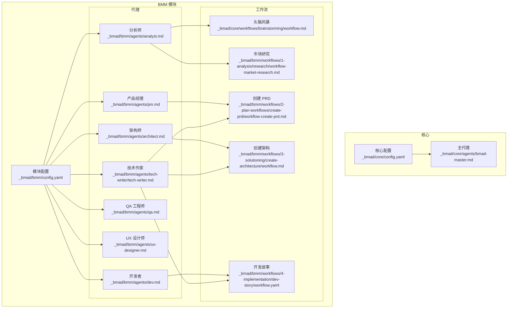
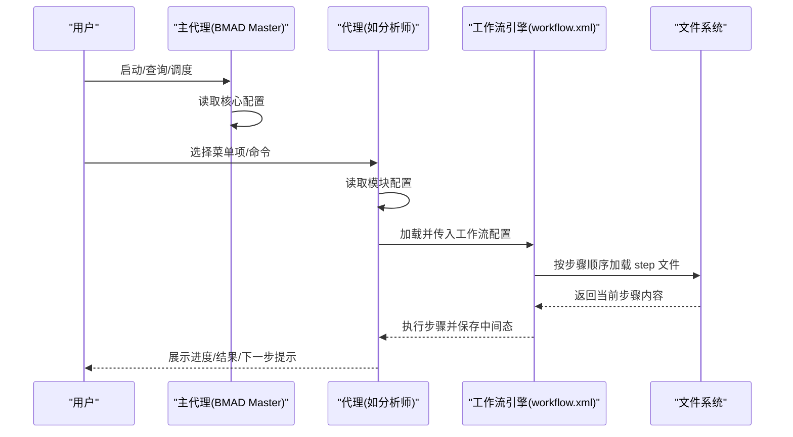
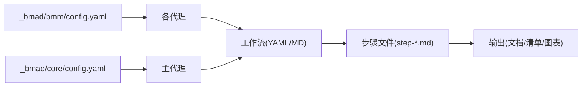

# BMA 专业代理

<cite>
**本文引用的文件**
- [_bmad/bmm/agents/analyst.md](file://_bmad/bmm/agents/analyst.md)
- [_bmad/bmm/agents/architect.md](file://_bmad/bmm/agents/architect.md)
- [_bmad/bmm/agents/dev.md](file://_bmad/bmm/agents/dev.md)
- [_bmad/bmm/agents/pm.md](file://_bmad/bmm/agents/pm.md)
- [_bmad/bmm/agents/qa.md](file://_bmad/bmm/agents/qa.md)
- [_bmad/bmm/agents/ux-designer.md](file://_bmad/bmm/agents/ux-designer.md)
- [_bmad/bmm/agents/tech-writer/tech-writer.md](file://_bmad/bmm/agents/tech-writer/tech-writer.md)
- [_bmad/core/agents/bmad-master.md](file://_bmad/core/agents/bmad-master.md)
- [_bmad/bmm/config.yaml](file://_bmad/bmm/config.yaml)
- [_bmad/core/config.yaml](file://_bmad/core/config.yaml)
- [_bmad/bmm/workflows/1-analysis/research/workflow-market-research.md](file://_bmad/bmm/workflows/1-analysis/research/workflow-market-research.md)
- [_bmad/bmm/workflows/2-plan-workflows/create-prd/workflow-create-prd.md](file://_bmad/bmm/workflows/2-plan-workflows/create-prd/workflow-create-prd.md)
- [_bmad/bmm/workflows/3-solutioning/create-architecture/workflow.md](file://_bmad/bmm/workflows/3-solutioning/create-architecture/workflow.md)
- [_bmad/bmm/workflows/4-implementation/dev-story/workflow.yaml](file://_bmad/bmm/workflows/4-implementation/dev-story/workflow.yaml)
- [_bmad/core/workflows/brainstorming/workflow.md](file://_bmad/core/workflows/brainstorming/workflow.md)
</cite>

## 目录
1. [简介](#简介)
2. [项目结构](#项目结构)
3. [核心组件](#核心组件)
4. [架构总览](#架构总览)
5. [详细组件分析](#详细组件分析)
6. [依赖关系分析](#依赖关系分析)
7. [性能与可扩展性](#性能与可扩展性)
8. [故障排查指南](#故障排查指南)
9. [结论](#结论)
10. [附录：使用示例与最佳实践](#附录使用示例与最佳实践)

## 简介
本文件系统化梳理 BMA（Business Model Agent）专业代理体系，聚焦分析师、架构师、开发者、产品经理、QA 工程师、技术作家与 UX 设计师七类代理角色。文档从角色定位、专业能力、适用场景、职责边界、协作机制与任务分配策略入手，结合激活指令、工作流程与输出规范，给出可操作的使用指南与实战建议。目标是帮助团队在不同项目阶段快速选择合适代理组合，实现高效协同与高质量交付。

## 项目结构
BMA 以“模块化代理 + 工作流”为核心组织形式，核心配置位于模块根目录，代理定义与菜单命令在各自 agent 文件中声明，工作流通过 YAML/Markdown 步骤文件驱动执行。整体采用“按需加载、顺序推进”的微文件架构，确保可解释、可审计、可复用。

图表来源
- [_bmad/core/config.yaml:1-10](file://_bmad/core/config.yaml#L1-L10)
- [_bmad/bmm/config.yaml:1-17](file://_bmad/bmm/config.yaml#L1-L17)
- [_bmad/core/agents/bmad-master.md:1-57](file://_bmad/core/agents/bmad-master.md#L1-L57)
- [_bmad/bmm/agents/analyst.md:1-79](file://_bmad/bmm/agents/analyst.md#L1-L79)
- [_bmad/bmm/agents/architect.md:1-59](file://_bmad/bmm/agents/architect.md#L1-L59)
- [_bmad/bmm/agents/dev.md:1-70](file://_bmad/bmm/agents/dev.md#L1-L70)
- [_bmad/bmm/agents/pm.md:1-73](file://_bmad/bmm/agents/pm.md#L1-L73)
- [_bmad/bmm/agents/qa.md:1-93](file://_bmad/bmm/agents/qa.md#L1-L93)
- [_bmad/bmm/agents/ux-designer.md:1-58](file://_bmad/bmm/agents/ux-designer.md#L1-L58)
- [_bmad/bmm/agents/tech-writer/tech-writer.md:1-71](file://_bmad/bmm/agents/tech-writer/tech-writer.md#L1-L71)
- [_bmad/core/workflows/brainstorming/workflow.md:1-59](file://_bmad/core/workflows/brainstorming/workflow.md#L1-L59)
- [_bmad/bmm/workflows/1-analysis/research/workflow-market-research.md:1-55](file://_bmad/bmm/workflows/1-analysis/research/workflow-market-research.md#L1-L55)
- [_bmad/bmm/workflows/2-plan-workflows/create-prd/workflow-create-prd.md:1-64](file://_bmad/bmm/workflows/2-plan-workflows/create-prd/workflow-create-prd.md#L1-L64)
- [_bmad/bmm/workflows/3-solutioning/create-architecture/workflow.md:1-50](file://_bmad/bmm/workflows/3-solutioning/create-architecture/workflow.md#L1-L50)
- [_bmad/bmm/workflows/4-implementation/dev-story/workflow.yaml:1-21](file://_bmad/bmm/workflows/4-implementation/dev-story/workflow.yaml#L1-L21)

章节来源
- [_bmad/bmm/config.yaml:1-17](file://_bmad/bmm/config.yaml#L1-L17)
- [_bmad/core/config.yaml:1-10](file://_bmad/core/config.yaml#L1-L10)

## 核心组件
- 主代理（BMA Master）
  - 角色：运行时资源管理、工作流编排、任务执行、知识守护者
  - 能力：统一列出可用任务与工作流清单；作为所有代理的“执行引擎”
  - 适用场景：启动全局流程、汇总资源、跨代理协调
- 七类专业代理
  - 分析师：市场/领域/技术研究、产品简报、项目文档扫描
  - 架构师：技术架构设计、实施就绪度检查
  - 开发者：按故事执行、测试驱动、代码审查
  - 产品经理：PRD 创建/校验/修订、史诗与用户故事拆分、课程纠偏
  - QA 工程师：端到端与 API 测试生成、快速覆盖
  - 技术作家：项目文档生成、Mermaid 图表、标准校验与概念阐释
  - UX 设计师：用户体验与界面设计规划、与架构/实现衔接

章节来源
- [_bmad/core/agents/bmad-master.md:1-57](file://_bmad/core/agents/bmad-master.md#L1-L57)
- [_bmad/bmm/agents/analyst.md:1-79](file://_bmad/bmm/agents/analyst.md#L1-L79)
- [_bmad/bmm/agents/architect.md:1-59](file://_bmad/bmm/agents/architect.md#L1-L59)
- [_bmad/bmm/agents/dev.md:1-70](file://_bmad/bmm/agents/dev.md#L1-L70)
- [_bmad/bmm/agents/pm.md:1-73](file://_bmad/bmm/agents/pm.md#L1-L73)
- [_bmad/bmm/agents/qa.md:1-93](file://_bmad/bmm/agents/qa.md#L1-L93)
- [_bmad/bmm/agents/tech-writer/tech-writer.md:1-71](file://_bmad/bmm/agents/tech-writer/tech-writer.md#L1-L71)
- [_bmad/bmm/agents/ux-designer.md:1-58](file://_bmad/bmm/agents/ux-designer.md#L1-L58)

## 架构总览
BMA 的执行由“代理 + 工作流”双轴驱动。代理负责角色扮演与菜单交互，工作流负责步骤化推进与状态持久化。代理在激活时读取模块配置，随后通过菜单项触发相应工作流或执行脚本，核心工作流引擎由“workflow.xml”提供统一编排能力。

图表来源
- [_bmad/core/agents/bmad-master.md:10-24](file://_bmad/core/agents/bmad-master.md#L10-L24)
- [_bmad/bmm/agents/analyst.md:10-24](file://_bmad/bmm/agents/analyst.md#L10-L24)
- [_bmad/bmm/workflows/2-plan-workflows/create-prd/workflow-create-prd.md:37-46](file://_bmad/bmm/workflows/2-plan-workflows/create-prd/workflow-create-prd.md#L37-L46)

## 详细组件分析

### 分析师代理（Analyst）
- 专业能力
  - 市场研究、竞争分析、需求挖掘、领域深度研究、技术可行性研究
  - 项目文档扫描与知识沉淀
- 适用场景
  - 初创期 Idea 阶段：头脑风暴、问题澄清、机会识别
  - 规划期：竞品/市场/技术/领域研究，形成产品简报
  - 迭代期：对既有项目进行扫描与归档
- 激活与菜单要点
  - 激活时加载模块配置，显示菜单并等待用户输入
  - 支持模糊匹配与编号选择；支持“/bmad-help”求助
- 关键工作流
  - 头脑风暴：多技法引导，产出报告
  - 市场/领域/技术研究：按主题深入，产出研究文档
  - 项目文档扫描：面向现有工程生成可读性强的文档
- 输出规范
  - 研究类：结构化报告、证据链、结论与建议
  - 文档类：可检索、可索引、面向人与 LLM 双向友好

章节来源
- [_bmad/bmm/agents/analyst.md:1-79](file://_bmad/bmm/agents/analyst.md#L1-L79)
- [_bmad/core/workflows/brainstorming/workflow.md:1-59](file://_bmad/core/workflows/brainstorming/workflow.md#L1-L59)
- [_bmad/bmm/workflows/1-analysis/research/workflow-market-research.md:1-55](file://_bmad/bmm/workflows/1-analysis/research/workflow-market-research.md#L1-L55)

### 架构师代理（Architect）
- 专业能力
  - 分布式系统、云原生、API 设计、可扩展模式
  - 技术选型与权衡、实施就绪度检查
- 适用场景
  - 解决方案设计：在 PRD 与 UX 基础上制定技术决策
  - 实施前校验：确保需求、设计与架构一致
- 激活与菜单要点
  - 激活后加载模块配置，展示菜单并等待输入
- 关键工作流
  - 创建架构：结构化记录架构决策，避免实现冲突
  - 实施就绪度检查：对齐 PRD、UX、架构与故事列表
- 输出规范
  - 架构决策记录（ADR）：清晰的动机、方案、约束与后果

章节来源
- [_bmad/bmm/agents/architect.md:1-59](file://_bmad/bmm/agents/architect.md#L1-L59)
- [_bmad/bmm/workflows/3-solutioning/create-architecture/workflow.md:1-50](file://_bmad/bmm/workflows/3-solutioning/create-architecture/workflow.md#L1-L50)

### 开发者代理（Dev）
- 专业能力
  - 故事执行、测试驱动开发、代码实现、持续集成
- 适用场景
  - 迭代开发：按故事清单推进，单元测试先行
  - 代码审查：质量门禁与回归保障
- 激活与菜单要点
  - 激活后加载模块配置，严格遵循故事文件的任务顺序
  - 每个任务完成后必须运行完整测试套件并通过
- 关键工作流
  - 开发故事：编写测试与代码，更新文件清单
  - 代码审查：多维度质量评估
- 输出规范
  - 故事文件：任务完成标记、变更文件清单、决策摘要
  - 测试：覆盖率与稳定性双达标

章节来源
- [_bmad/bmm/agents/dev.md:1-70](file://_bmad/bmm/agents/dev.md#L1-L70)
- [_bmad/bmm/workflows/4-implementation/dev-story/workflow.yaml:1-21](file://_bmad/bmm/workflows/4-implementation/dev-story/workflow.yaml#L1-L21)

### 产品经理代理（PM）
- 专业能力
  - PRD 创建/校验/修订、用户访谈、利益相关者对齐
  - 史诗与用户故事拆分、课程纠偏
- 适用场景
  - 从 0 到 1：PRD 专家引导，确保最小可行产品
  - 迭代中：发现重大变化时进行“课程纠偏”，重新对齐
- 激活与菜单要点
  - 激活后加载模块配置，展示菜单并等待输入
- 关键工作流
  - 创建 PRD：结构化工作流，逐步沉淀需求
  - 校验与修订：保证 PRD 的完整性与一致性
  - 实施就绪度检查：与 UX、架构、故事列表对齐
  - 课程纠偏：中途中止与再规划
- 输出规范
  - PRD：目标明确、需求可验证、优先级清晰
  - 史诗与故事：粒度合理、验收条件明确

章节来源
- [_bmad/bmm/agents/pm.md:1-73](file://_bmad/bmm/agents/pm.md#L1-L73)
- [_bmad/bmm/workflows/2-plan-workflows/create-prd/workflow-create-prd.md:1-64](file://_bmad/bmm/workflows/2-plan-workflows/create-prd/workflow-create-prd.md#L1-L64)

### QA 工程师代理（QA）
- 专业能力
  - 自动化测试、API 测试、端到端测试、覆盖率分析
- 适用场景
  - 快速覆盖：为已实现功能生成稳定测试
  - 标准化路径：使用标准框架，保持简单可维护
- 激活与菜单要点
  - 激活后加载模块配置，强调“先生成、后评审”的原则
- 关键工作流
  - 自动化测试：基于现有功能生成测试，确保首跑通过
- 输出规范
  - 测试：覆盖主路径与关键边界，命名与结构标准化

章节来源
- [_bmad/bmm/agents/qa.md:1-93](file://_bmad/bmm/agents/qa.md#L1-L93)

### 技术作家代理（Tech Writer）
- 专业能力
  - 技术文档撰写、Mermaid 图表、标准合规、概念阐释
- 适用场景
  - 项目文档生成：对既有工程进行扫描与归档
  - 文档质量校验：依据标准进行评审与修订
  - 概念讲解：将复杂技术转化为易懂材料
- 激活与菜单要点
  - 激活后加载模块配置，支持“子流程”搜索/研究/审阅
- 关键工作流
  - 项目文档：扫描、架构扫描、索引与概览
  - 写文档：按标准与受众定制内容
  - 标准更新：结合用户偏好调整文档约定
  - Mermaid 生成：严格遵循语法与格式
  - 文档校验：对照标准与用户关注点给出改进建议
- 输出规范
  - 文档：结构清晰、术语一致、图表合规、面向读者
  - 图表：语义准确、风格统一、可被 LLM 识别

章节来源
- [_bmad/bmm/agents/tech-writer/tech-writer.md:1-71](file://_bmad/bmm/agents/tech-writer/tech-writer.md#L1-L71)

### UX 设计师代理（UX Designer）
- 专业能力
  - 用户研究、交互设计、界面模式、体验策略
- 适用场景
  - 将 PRD 中的愿景转化为可落地的 UX 规划
  - 与架构/实现衔接，确保体验一致性
- 激活与菜单要点
  - 激活后加载模块配置，展示菜单并等待输入
- 关键工作流
  - 创建 UX：细化 PRD，指导后续架构与实现
- 输出规范
  - UX 设计：以用户为中心，平衡直觉与边界场景

章节来源
- [_bmad/bmm/agents/ux-designer.md:1-58](file://_bmad/bmm/agents/ux-designer.md#L1-L58)

## 依赖关系分析
- 配置依赖
  - 所有代理在激活时均会读取模块配置，确保语言、输出目录、技能等级等上下文一致
  - 核心配置与模块配置分别服务于“平台层”与“业务层”，代理通过相对路径引用
- 工作流依赖
  - 代理菜单项通过“workflow”或“exec”指向具体工作流或脚本
  - 工作流内部通过“步骤文件”顺序推进，严格遵循“就地加载、逐步执行、状态写回”的原则
- 协作依赖
  - PM 负责需求与范围；Arch 负责技术方向；Dev 负责实现；QA 负责质量；TW/UX 在全生命周期提供文档与体验支撑
  - 主代理作为编排中枢，统一列出任务与工作流，便于跨代理调度

图表来源
- [_bmad/bmm/config.yaml:1-17](file://_bmad/bmm/config.yaml#L1-L17)
- [_bmad/core/config.yaml:1-10](file://_bmad/core/config.yaml#L1-L10)
- [_bmad/bmm/agents/analyst.md:26-51](file://_bmad/bmm/agents/analyst.md#L26-L51)
- [_bmad/bmm/workflows/2-plan-workflows/create-prd/workflow-create-prd.md:28-46](file://_bmad/bmm/workflows/2-plan-workflows/create-prd/workflow-create-prd.md#L28-L46)

章节来源
- [_bmad/bmm/config.yaml:1-17](file://_bmad/bmm/config.yaml#L1-L17)
- [_bmad/core/config.yaml:1-10](file://_bmad/core/config.yaml#L1-L10)

## 性能与可扩展性
- 微文件架构的优势
  - 就地加载、按需执行，降低内存占用与启动延迟
  - 步骤文件自包含规则，便于独立演进与版本控制
- 并行与串行
  - 工作流内步骤严格串行，避免状态竞态
  - 代理间可通过主代理进行并行调度，但需注意共享资源的互斥
- 可扩展性
  - 新增代理：遵循相同激活/菜单/规则约定，即可无缝接入
  - 新增工作流：采用步骤文件与统一模板，降低心智负担
  - 标准化输出：统一的文档与图表规范，提升复用与集成效率

## 故障排查指南
- 代理无法加载配置
  - 症状：激活时报错或未显示菜单
  - 排查：确认模块配置路径存在且字段完整；检查代理激活步骤是否正确读取
- 工作流中断或重复
  - 症状：步骤未保存状态、重复执行同一步骤
  - 排查：确认工作流规则中“保存状态/等待输入/顺序执行”的实现是否被跳过
- 输出不符合预期
  - 症状：文档结构不规范、图表不合规
  - 排查：核对技术作家侧车标准与模板；检查工作流模板与数据路径
- 代理间协作不畅
  - 症状：职责不清、输出不衔接
  - 排查：明确各阶段负责人与交付物；通过主代理统一编排与对齐

章节来源
- [_bmad/bmm/agents/analyst.md:10-24](file://_bmad/bmm/agents/analyst.md#L10-L24)
- [_bmad/bmm/agents/dev.md:10-26](file://_bmad/bmm/agents/dev.md#L10-L26)
- [_bmad/bmm/agents/tech-writer/tech-writer.md:28-42](file://_bmad/bmm/agents/tech-writer/tech-writer.md#L28-L42)

## 结论
BMA 专业代理体系以“角色清晰、流程可控、标准统一”为核心，通过主代理编排与七类专业代理分工协作，覆盖从洞察、规划、设计、实现到文档与体验的全生命周期。建议在项目启动阶段即明确代理组合与职责边界，利用工作流模板固化最佳实践，持续迭代代理与工作流以提升交付质量与效率。

## 附录：使用示例与最佳实践

### 典型使用示例
- Idea 阶段
  - 使用“分析师”进行头脑风暴与多维研究，产出产品简报
  - 使用“产品经理”将简报转化为 PRD
- 规划阶段
  - “架构师”基于 PRD 与 UX 规划创建架构决策
  - “技术作家”同步生成项目扫描与索引文档
- 实现阶段
  - “开发者”按故事清单推进实现与测试
  - “QA 工程师”生成端到端与 API 测试
  - “UX 设计师”持续对齐体验细节
- 文档与回顾
  - “技术作家”主导文档校验与概念阐释
  - “产品经理”组织回顾与课程纠偏

### 任务分配策略
- 以阶段为单位划分代理职责，避免角色重叠
- 关键节点引入“实施就绪度检查”，确保需求、设计、架构与故事一致
- 对于复杂场景，启用“课程纠偏”工作流，重新对齐目标与路径

### 激活与工作流调用要点
- 代理激活时务必加载模块配置，确保语言与输出路径一致
- 菜单项支持模糊匹配与编号选择，便于新手快速上手
- 工作流执行严格遵循“就地加载、顺序推进、状态写回”的原则

章节来源
- [_bmad/bmm/agents/analyst.md:68-76](file://_bmad/bmm/agents/analyst.md#L68-L76)
- [_bmad/bmm/agents/architect.md:52-55](file://_bmad/bmm/agents/architect.md#L52-L55)
- [_bmad/bmm/agents/dev.md:63-66](file://_bmad/bmm/agents/dev.md#L63-L66)
- [_bmad/bmm/agents/pm.md:62-69](file://_bmad/bmm/agents/pm.md#L62-L69)
- [_bmad/bmm/agents/qa.md:87-89](file://_bmad/bmm/agents/qa.md#L87-L89)
- [_bmad/bmm/agents/tech-writer/tech-writer.md:60-67](file://_bmad/bmm/agents/tech-writer/tech-writer.md#L60-L67)
- [_bmad/bmm/agents/ux-designer.md:52-54](file://_bmad/bmm/agents/ux-designer.md#L52-L54)