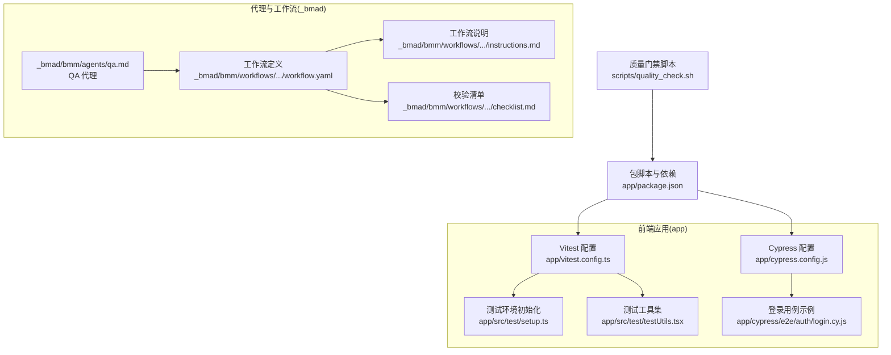
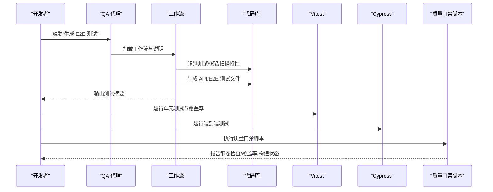
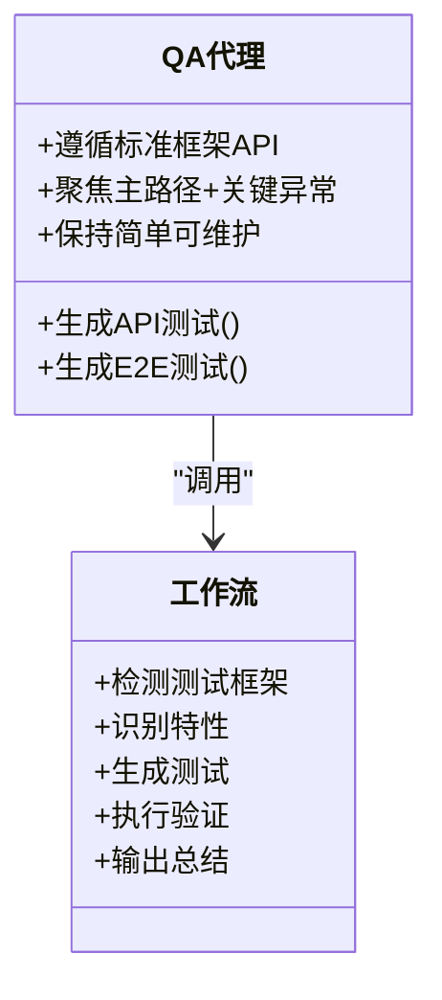
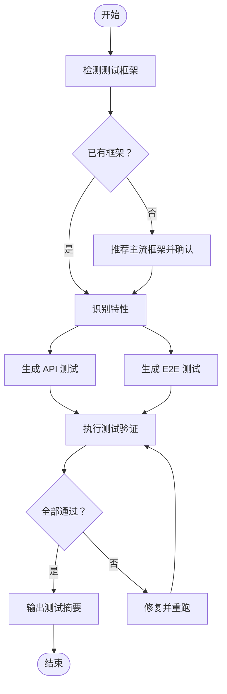
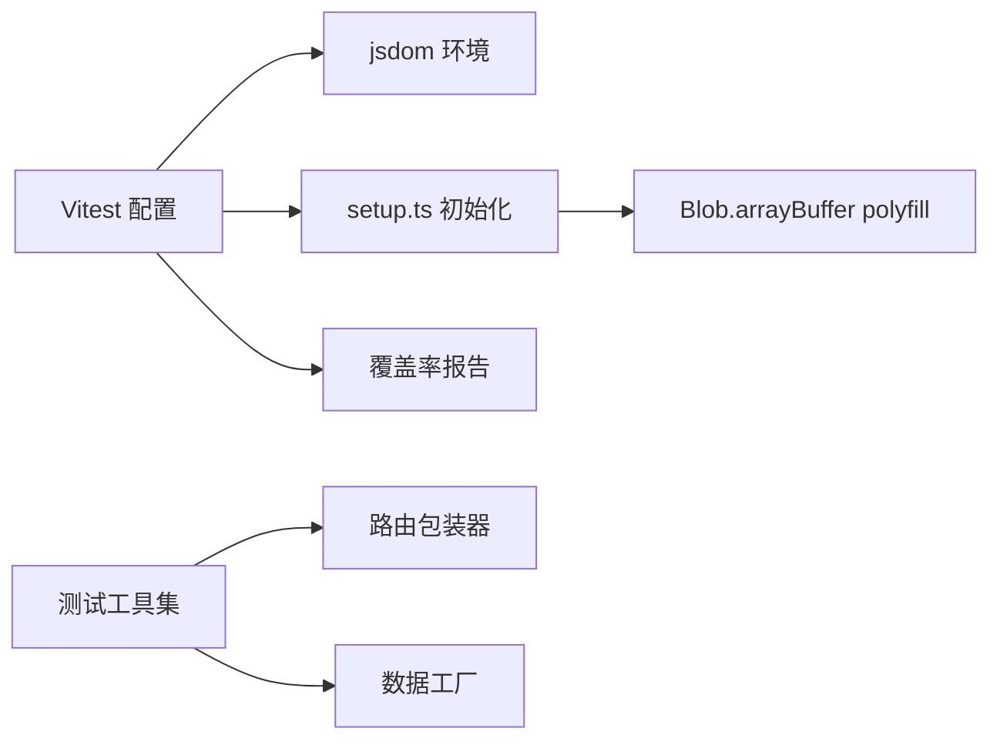
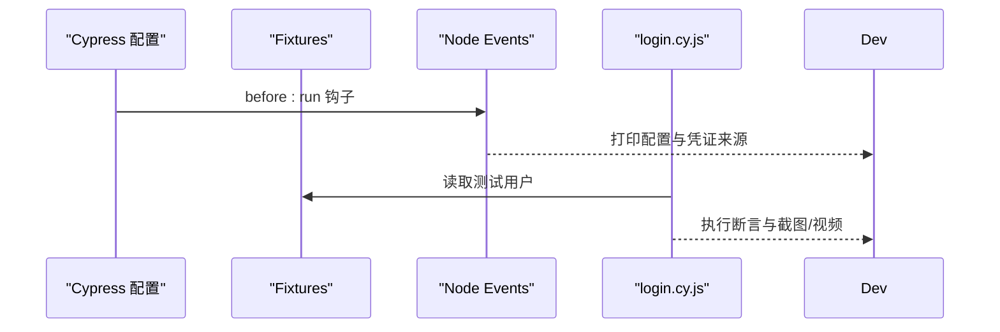
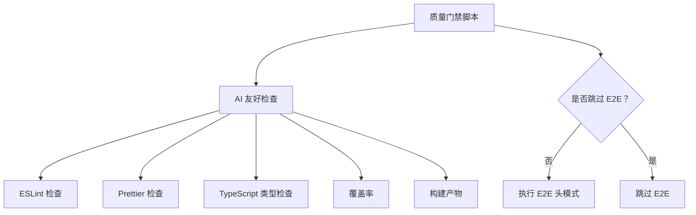
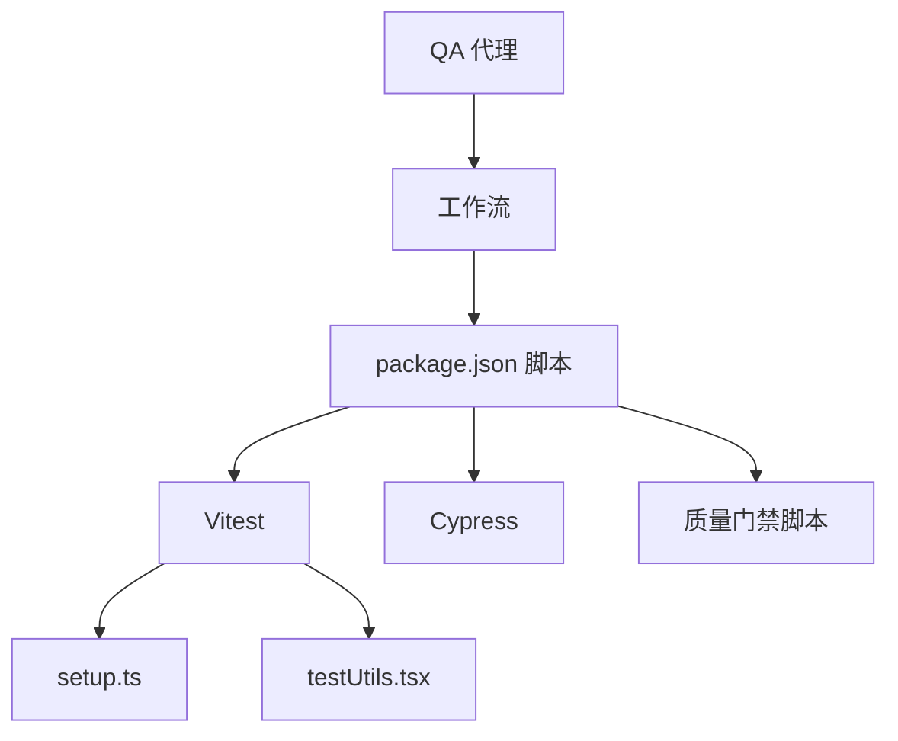

# QA 工程师代理

<cite>
**本文引用的文件**
- [app/src/test/setup.ts](file://app/src/test/setup.ts)
- [vitest.config.ts](file://app/vitest.config.ts)
- [_bmad/bmm/agents/qa.md](file://_bmad/bmm/agents/qa.md)
- [_bmad/bmm/workflows/qa-generate-e2e-tests/workflow.yaml](file://_bmad/bmm/workflows/qa-generate-e2e-tests/workflow.yaml)
- [_bmad/bmm/workflows/qa-generate-e2e-tests/instructions.md](file://_bmad/bmm/workflows/qa-generate-e2e-tests/instructions.md)
- [_bmad/bmm/workflows/qa-generate-e2e-tests/checklist.md](file://_bmad/bmm/workflows/qa-generate-e2e-tests/checklist.md)
- [app/cypress.config.js](file://app/cypress.config.js)
- [app/package.json](file://app/package.json)
- [scripts/quality_check.sh](file://scripts/quality_check.sh)
- [app/src/test/testUtils.tsx](file://app/src/test/testUtils.tsx)
- [app/cypress/e2e/auth/login.cy.js](file://app/cypress/e2e/auth/login.cy.js)
</cite>

## 目录
1. [简介](#简介)
2. [项目结构](#项目结构)
3. [核心组件](#核心组件)
4. [架构总览](#架构总览)
5. [详细组件分析](#详细组件分析)
6. [依赖关系分析](#依赖关系分析)
7. [性能考量](#性能考量)
8. [故障排查指南](#故障排查指南)
9. [结论](#结论)
10. [附录](#附录)

## 简介
本文件面向“QA 工程师代理”，系统化阐述其在本项目中的专业职责与能力边界：测试策略制定、自动化测试生成与执行、缺陷管理与回归保障。重点覆盖以下方面：
- 测试策略：基于项目现状选择合适框架，聚焦 API 与 E2E 测试，优先覆盖“主路径+关键异常”。
- 自动化测试：通过代理工作流快速生成测试文件，并在本地/CI 中验证通过。
- 缺陷管理：通过质量门禁脚本与测试清单，确保问题可追踪、可回归。
- 协作方式：与开发团队在 CI 中设置质量门禁，配合回归测试策略，保障交付质量。

## 项目结构
本项目采用前端单页应用与端到端测试并存的结构，测试相关资产主要分布在：
- 单元测试与覆盖率：Vitest 配置与测试工具集
- 端到端测试：Cypress 配置与示例用例
- 代理工作流：QA 代理与“生成 E2E 测试”的工作流定义、说明与校验清单
- 质量门禁：统一的质量检查脚本，支持跳过 E2E 的场景

图表来源
- [vitest.config.ts:1-40](file://app/vitest.config.ts#L1-L40)
- [app/src/test/setup.ts:1-16](file://app/src/test/setup.ts#L1-L16)
- [app/src/test/testUtils.tsx:1-117](file://app/src/test/testUtils.tsx#L1-L117)
- [app/cypress.config.js:1-73](file://app/cypress.config.js#L1-L73)
- [app/cypress/e2e/auth/login.cy.js](file://app/cypress/e2e/auth/login.cy.js)
- [scripts/quality_check.sh:1-30](file://scripts/quality_check.sh#L1-L30)
- [_bmad/bmm/agents/qa.md:1-93](file://_bmad/bmm/agents/qa.md#L1-L93)
- [_bmad/bmm/workflows/qa-generate-e2e-tests/workflow.yaml:1-43](file://_bmad/bmm/workflows/qa-generate-e2e-tests/workflow.yaml#L1-L43)
- [_bmad/bmm/workflows/qa-generate-e2e-tests/instructions.md:1-111](file://_bmad/bmm/workflows/qa-generate-e2e-tests/instructions.md#L1-L111)
- [_bmad/bmm/workflows/qa-generate-e2e-tests/checklist.md:1-34](file://_bmad/bmm/workflows/qa-generate-e2e-tests/checklist.md#L1-L34)

章节来源
- [vitest.config.ts:1-40](file://app/vitest.config.ts#L1-L40)
- [app/src/test/setup.ts:1-16](file://app/src/test/setup.ts#L1-L16)
- [app/src/test/testUtils.tsx:1-117](file://app/src/test/testUtils.tsx#L1-L117)
- [app/cypress.config.js:1-73](file://app/cypress.config.js#L1-L73)
- [app/cypress/e2e/auth/login.cy.js](file://app/cypress/e2e/auth/login.cy.js)
- [scripts/quality_check.sh:1-30](file://scripts/quality_check.sh#L1-L30)
- [_bmad/bmm/agents/qa.md:1-93](file://_bmad/bmm/agents/qa.md#L1-L93)
- [_bmad/bmm/workflows/qa-generate-e2e-tests/workflow.yaml:1-43](file://_bmad/bmm/workflows/qa-generate-e2e-tests/workflow.yaml#L1-L43)
- [_bmad/bmm/workflows/qa-generate-e2e-tests/instructions.md:1-111](file://_bmad/bmm/workflows/qa-generate-e2e-tests/instructions.md#L1-L111)
- [_bmad/bmm/workflows/qa-generate-e2e-tests/checklist.md:1-34](file://_bmad/bmm/workflows/qa-generate-e2e-tests/checklist.md#L1-L34)

## 核心组件
- QA 代理：以“实用、快速、可维护”为核心原则，专注于现有功能的 API 与 E2E 测试生成，强调“首跑即通”的质量基线。
- 生成 E2E 测试工作流：自动识别测试框架、发现特性、生成测试、执行验证、输出总结。
- 单元测试与覆盖率：Vitest 配置与测试工具，提供 DOM 兼容与数据工厂支持。
- 端到端测试：Cypress 配置与示例登录用例，支持重试、截图、视频与 MSW Mock。
- 质量门禁脚本：统一执行静态检查、格式化、类型检查、覆盖率与构建；可选择跳过 E2E。

章节来源
- [_bmad/bmm/agents/qa.md:50-93](file://_bmad/bmm/agents/qa.md#L50-L93)
- [_bmad/bmm/workflows/qa-generate-e2e-tests/workflow.yaml:1-43](file://_bmad/bmm/workflows/qa-generate-e2e-tests/workflow.yaml#L1-L43)
- [vitest.config.ts:12-38](file://app/vitest.config.ts#L12-L38)
- [app/src/test/testUtils.tsx:18-117](file://app/src/test/testUtils.tsx#L18-L117)
- [app/cypress.config.js:15-73](file://app/cypress.config.js#L15-L73)
- [scripts/quality_check.sh:20-30](file://scripts/quality_check.sh#L20-L30)

## 架构总览
下图展示了 QA 工程师代理在测试流程中的角色与交互：从“生成测试”到“执行验证”，再到“质量门禁”，形成闭环。

图表来源
- [_bmad/bmm/agents/qa.md:84-93](file://_bmad/bmm/agents/qa.md#L84-L93)
- [_bmad/bmm/workflows/qa-generate-e2e-tests/workflow.yaml:1-43](file://_bmad/bmm/workflows/qa-generate-e2e-tests/workflow.yaml#L1-L43)
- [_bmad/bmm/workflows/qa-generate-e2e-tests/instructions.md:9-111](file://_bmad/bmm/workflows/qa-generate-e2e-tests/instructions.md#L9-L111)
- [app/package.json:26-46](file://app/package.json#L26-L46)
- [scripts/quality_check.sh:20-30](file://scripts/quality_check.sh#L20-L30)

## 详细组件分析

### 组件一：QA 代理（角色与菜单）
- 角色定位：务实的测试自动化工程师，优先生成可维护的测试，关注“覆盖率优先、优化延后”。
- 能力范围：生成 API 与 E2E 测试；遵循标准测试框架 API；聚焦主路径与关键异常；强调“先跑通再优化”。
- 菜单入口：提供“生成测试”“聊天”“派对模式”等命令，便于快速进入测试生成流程。

图表来源
- [_bmad/bmm/agents/qa.md:50-93](file://_bmad/bmm/agents/qa.md#L50-L93)
- [_bmad/bmm/workflows/qa-generate-e2e-tests/instructions.md:9-111](file://_bmad/bmm/workflows/qa-generate-e2e-tests/instructions.md#L9-L111)

章节来源
- [_bmad/bmm/agents/qa.md:50-93](file://_bmad/bmm/agents/qa.md#L50-L93)

### 组件二：生成 E2E 测试工作流（流程与规范）
- 关键步骤：
  - 检测测试框架：优先沿用现有框架；若无则建议主流方案。
  - 识别特性：由用户指定或自动扫描源码。
  - 生成 API 测试：覆盖状态码、响应结构、主路径与关键错误。
  - 生成 E2E 测试：语义化定位器、用户交互、可见结果、线性可读。
  - 执行测试：验证生成的测试能通过；失败即时修复。
  - 输出总结：包含覆盖率与后续建议。
- 校验清单：确保测试使用标准 API、覆盖主路径与关键异常、可独立运行、输出完整总结。

图表来源
- [_bmad/bmm/workflows/qa-generate-e2e-tests/instructions.md:9-111](file://_bmad/bmm/workflows/qa-generate-e2e-tests/instructions.md#L9-L111)
- [_bmad/bmm/workflows/qa-generate-e2e-tests/checklist.md:1-34](file://_bmad/bmm/workflows/qa-generate-e2e-tests/checklist.md#L1-L34)

章节来源
- [_bmad/bmm/workflows/qa-generate-e2e-tests/workflow.yaml:1-43](file://_bmad/bmm/workflows/qa-generate-e2e-tests/workflow.yaml#L1-L43)
- [_bmad/bmm/workflows/qa-generate-e2e-tests/instructions.md:9-111](file://_bmad/bmm/workflows/qa-generate-e2e-tests/instructions.md#L9-L111)
- [_bmad/bmm/workflows/qa-generate-e2e-tests/checklist.md:1-34](file://_bmad/bmm/workflows/qa-generate-e2e-tests/checklist.md#L1-L34)

### 组件三：单元测试与覆盖率（Vitest）
- 配置要点：
  - 环境：jsdom，全局启用，设置入口文件加载 polyfill。
  - 覆盖率：v8 提供商，多格式输出，排除 node_modules、测试目录、mock、配置文件与 public。
  - 阈值：行/函数/分支/语句均设为中等门槛，鼓励逐步提升。
- 测试工具：
  - 路由包装器：支持 BrowserRouter 与 MemoryRouter。
  - 数据工厂：Photo、Person、Album 的 mock 工具，便于构造稳定测试数据。

图表来源
- [vitest.config.ts:12-38](file://app/vitest.config.ts#L12-L38)
- [app/src/test/setup.ts:1-16](file://app/src/test/setup.ts#L1-16)
- [app/src/test/testUtils.tsx:18-117](file://app/src/test/testUtils.tsx#L18-L117)

章节来源
- [vitest.config.ts:12-38](file://app/vitest.config.ts#L12-L38)
- [app/src/test/setup.ts:1-16](file://app/src/test/setup.ts#L1-L16)
- [app/src/test/testUtils.tsx:18-117](file://app/src/test/testUtils.tsx#L18-L117)

### 组件四：端到端测试（Cypress）
- 配置要点：
  - 基础 URL、视口、超时、重试策略、截图与视频。
  - 支持文件与 fixtures，示例使用 users.json。
  - 通过事件钩子打印配置信息，便于调试。
- 示例用例：
  - 登录流程的 E2E 用例，体现语义化定位与线性步骤。

图表来源
- [app/cypress.config.js:15-73](file://app/cypress.config.js#L15-L73)
- [app/cypress/e2e/auth/login.cy.js](file://app/cypress/e2e/auth/login.cy.js)

章节来源
- [app/cypress.config.js:15-73](file://app/cypress.config.js#L15-L73)
- [app/cypress/e2e/auth/login.cy.js](file://app/cypress/e2e/auth/login.cy.js)

### 组件五：质量门禁脚本（CI 质量门禁）
- 功能：
  - 默认执行 AI 友好检查（静态检查、格式化、类型检查、覆盖率、构建）。
  - 可选参数跳过 E2E，以适配不同流水线阶段。
- 适用场景：
  - PR 验收：先通过静态与单元测试，再按需执行 E2E。
  - 发布前：全量检查，确保质量门槛一致。

图表来源
- [scripts/quality_check.sh:20-30](file://scripts/quality_check.sh#L20-L30)
- [app/package.json:26-46](file://app/package.json#L26-L46)

章节来源
- [scripts/quality_check.sh:1-30](file://scripts/quality_check.sh#L1-L30)
- [app/package.json:26-46](file://app/package.json#L26-L46)

## 依赖关系分析
- 代理与工作流：QA 代理加载工作流与说明，工作流依赖仓库内现有测试框架与特性扫描能力。
- 测试框架与工具链：Vitest 与 Cypress 分别承担单元测试与端到端测试；测试工具集提供路由与数据工厂支持。
- 脚本与 CI：质量门禁脚本串联多个检查项，作为 CI 的统一入口。

图表来源
- [_bmad/bmm/agents/qa.md:84-93](file://_bmad/bmm/agents/qa.md#L84-L93)
- [_bmad/bmm/workflows/qa-generate-e2e-tests/workflow.yaml:1-43](file://_bmad/bmm/workflows/qa-generate-e2e-tests/workflow.yaml#L1-L43)
- [app/package.json:26-46](file://app/package.json#L26-L46)
- [app/src/test/setup.ts:1-16](file://app/src/test/setup.ts#L1-L16)
- [app/src/test/testUtils.tsx:18-117](file://app/src/test/testUtils.tsx#L18-L117)
- [scripts/quality_check.sh:20-30](file://scripts/quality_check.sh#L20-L30)

章节来源
- [_bmad/bmm/agents/qa.md:84-93](file://_bmad/bmm/agents/qa.md#L84-L93)
- [_bmad/bmm/workflows/qa-generate-e2e-tests/workflow.yaml:1-43](file://_bmad/bmm/workflows/qa-generate-e2e-tests/workflow.yaml#L1-L43)
- [app/package.json:26-46](file://app/package.json#L26-L46)

## 性能考量
- 单元测试性能：
  - 使用 jsdom 与最小化 setup，减少环境初始化开销。
  - 合理设置覆盖率阈值，避免过度追求高覆盖率而牺牲开发效率。
- 端到端测试性能：
  - 控制视口与超时，避免不必要的等待。
  - 利用重试机制降低偶发失败的影响。
- 质量门禁：
  - 在 PR 阶段跳过 E2E，缩短反馈周期；发布前补齐全量检查。

## 故障排查指南
- 测试无法运行或报错：
  - 检查测试环境初始化是否正确加载 polyfill。
  - 确认 Vitest 配置的环境与 setup 文件路径。
- 端到端测试失败：
  - 查看截图与视频，结合 Cypress 事件钩子日志定位问题。
  - 确认 fixtures 与凭证来源是否正确。
- 质量门禁失败：
  - 逐项检查 ESLint、格式化、类型检查、覆盖率与构建。
  - 若为偶发失败，适当调整重试次数或检查网络/资源可用性。

章节来源
- [app/src/test/setup.ts:1-16](file://app/src/test/setup.ts#L1-L16)
- [app/cypress.config.js:57-70](file://app/cypress.config.js#L57-L70)
- [scripts/quality_check.sh:20-30](file://scripts/quality_check.sh#L20-L30)

## 结论
QA 工程师代理以“快速生成、简单可维护”为准则，结合现有测试框架与工具链，形成从“生成测试—执行验证—质量门禁”的闭环。通过明确的流程规范与校验清单，代理能够帮助团队在不同测试阶段（单元、集成、系统、验收）快速建立稳定的质量基线，并在 CI 中落实质量门禁与回归策略，持续保障软件质量与稳定性。

## 附录
- 测试场景与实践建议（概念性说明）
  - 单元测试：围绕组件与服务函数，使用路由包装器与数据工厂构造稳定输入，断言渲染与副作用。
  - 集成测试：聚焦服务层与数据库/缓存交互，利用内存数据库或模拟存储，关注事务与一致性。
  - 系统测试：以端到端为主，覆盖用户关键路径，使用语义化定位器与可复现数据，记录截图与视频。
  - 验收测试：与产品需求对齐，关注业务价值与用户体验，必要时引入可访问性与跨浏览器验证。
- 性能测试、安全测试与兼容性测试（概念性指导）
  - 性能测试：在 CI 中引入基准测试与压力测试，关注关键页面加载时间与接口延迟。
  - 安全测试：静态扫描与依赖审计，结合端到端场景验证认证与授权逻辑。
  - 兼容性测试：在不同浏览器与设备上验证核心功能，关注布局与交互一致性。