# UX 设计师代理

<cite>
**本文引用的文件**
- [ux-designer.md](file://_bmad/bmm/agents/ux-designer.md)
- [workflow.md](file://_bmad/bmm/workflows/2-plan-workflows/create-ux-design/workflow.md)
- [step-01-init.md](file://_bmad/bmm/workflows/2-plan-workflows/create-ux-design/steps/step-01-init.md)
- [step-02-discovery.md](file://_bmad/bmm/workflows/2-plan-workflows/create-ux-design/steps/step-02-discovery.md)
- [step-03-core-experience.md](file://_bmad/bmm/workflows/2-plan-workflows/create-ux-design/steps/step-03-core-experience.md)
- [step-04-emotional-response.md](file://_bmad/bmm/workflows/2-plan-workflows/create-ux-design/steps/step-04-emotional-response.md)
- [step-05-inspiration.md](file://_bmad/bmm/workflows/2-plan-workflows/create-ux-design/steps/step-05-inspiration.md)
- [step-06-design-system.md](file://_bmad/bmm/workflows/2-plan-workflows/create-ux-design/steps/step-06-design-system.md)
- [step-07-defining-experience.md](file://_bmad/bmm/workflows/2-plan-workflows/create-ux-design/steps/step-07-defining-experience.md)
- [step-08-visual-foundation.md](file://_bmad/bmm/workflows/2-plan-workflows/create-ux-design/steps/step-08-visual-foundation.md)
</cite>

## 目录
1. [简介](#简介)
2. [项目结构](#项目结构)
3. [核心组件](#核心组件)
4. [架构总览](#架构总览)
5. [详细组件分析](#详细组件分析)
6. [依赖关系分析](#依赖关系分析)
7. [性能考量](#性能考量)
8. [故障排查指南](#故障排查指南)
9. [结论](#结论)
10. [附录](#附录)

## 简介
本文件面向“UX 设计师代理”，系统化阐述其在产品设计流程中的角色定位、专业能力边界与协作机制。该代理以“用户体验设计师 + UI 专家”的身份，围绕用户研究、界面设计与交互优化开展工作；通过结构化的微文件工作流，完成从项目理解、体验定义、情感目标、模式借鉴、设计系统选择到视觉基础建立的全链路设计规划。代理强调“以用户为中心”的协同发现，结合“高级提问法”和“派对模式”多视角探索，最终沉淀可执行的设计规范文档，支撑后续架构与实现阶段。

## 项目结构
UX 设计师代理位于统一的智能体框架中，采用“代理 + 工作流 + 步骤文件”的分层组织方式：
- 代理层：定义角色、身份、沟通风格与菜单项，负责引导用户进入工作流并执行菜单动作。
- 工作流层：定义“创建 UX 设计”的整体目标、架构与执行顺序，协调各步骤文件。
- 步骤层：每个步骤为自包含的 Markdown 文件，内置规则、协议与输出结构，确保可重复、可验证的协作过程。

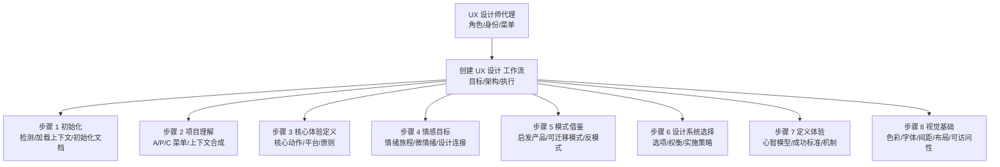

图表来源
- [ux-designer.md:49-55](file://_bmad/bmm/agents/ux-designer.md#L49-L55)
- [workflow.md:12-21](file://_bmad/bmm/workflows/2-plan-workflows/create-ux-design/workflow.md#L12-L21)
- [step-01-init.md:33-51](file://_bmad/bmm/workflows/2-plan-workflows/create-ux-design/steps/step-01-init.md#L33-L51)
- [step-02-discovery.md:49-66](file://_bmad/bmm/workflows/2-plan-workflows/create-ux-design/steps/step-02-discovery.md#L49-L66)
- [step-03-core-experience.md:49-64](file://_bmad/bmm/workflows/2-plan-workflows/create-ux-design/steps/step-03-core-experience.md#L49-L64)
- [step-04-emotional-response.md:49-64](file://_bmad/bmm/workflows/2-plan-workflows/create-ux-design/steps/step-04-emotional-response.md#L49-L64)
- [step-05-inspiration.md:49-64](file://_bmad/bmm/workflows/2-plan-workflows/create-ux-design/steps/step-05-inspiration.md#L49-L64)
- [step-06-design-system.md:49-64](file://_bmad/bmm/workflows/2-plan-workflows/create-ux-design/steps/step-06-design-system.md#L49-L64)
- [step-07-defining-experience.md:49-64](file://_bmad/bmm/workflows/2-plan-workflows/create-ux-design/steps/step-07-defining-experience.md#L49-L64)
- [step-08-visual-foundation.md:49-64](file://_bmad/bmm/workflows/2-plan-workflows/create-ux-design/steps/step-08-visual-foundation.md#L49-L64)

章节来源
- [ux-designer.md:1-58](file://_bmad/bmm/agents/ux-designer.md#L1-L58)
- [workflow.md:1-43](file://_bmad/bmm/workflows/2-plan-workflows/create-ux-design/workflow.md#L1-L43)

## 核心组件
- 代理配置与激活
  - 角色与身份：资深 UX 设计师，7 年以上经验，擅长用户研究、交互设计与 AI 辅助工具。
  - 沟通风格：用画面感的语言讲用户故事，富有同理心与创意叙事。
  - 原则：以真实用户需求为导向，先简后繁，平衡共情与边缘场景，借助 AI 工具加速以人为本的设计。
  - 菜单功能：聊天、创建 UX、派对模式、退出。
- 工作流目标与架构
  - 目标：通过协作式可视化探索与理性决策，产出全面的 UX 设计规范，超越 PRD 的设计深度。
  - 架构：微文件架构，每步自包含、顺序推进、前端记录状态、仅在用户触发时加载文件。
- 步骤执行协议
  - 必须完整阅读当前步骤文件再行动，禁止部分理解导致的决策偏差。
  - 使用 A/P/C 菜单：A=高级提问法、P=派对模式、C=继续保存并进入下一步。
  - 文档状态：每次保存更新 frontmatter 的 stepsCompleted 列表，确保可恢复与可审计。

章节来源
- [ux-designer.md:43-55](file://_bmad/bmm/agents/ux-designer.md#L43-L55)
- [workflow.md:8-21](file://_bmad/bmm/workflows/2-plan-workflows/create-ux-design/workflow.md#L8-L21)
- [step-01-init.md:3-13](file://_bmad/bmm/workflows/2-plan-workflows/create-ux-design/steps/step-01-init.md#L3-L13)

## 架构总览
下图展示了 UX 设计师代理在工作流中的控制流与数据流：代理读取配置、加载工作流、按步骤推进并生成设计规范文档；在关键节点引入“高级提问法”和“派对模式”以深化洞察。

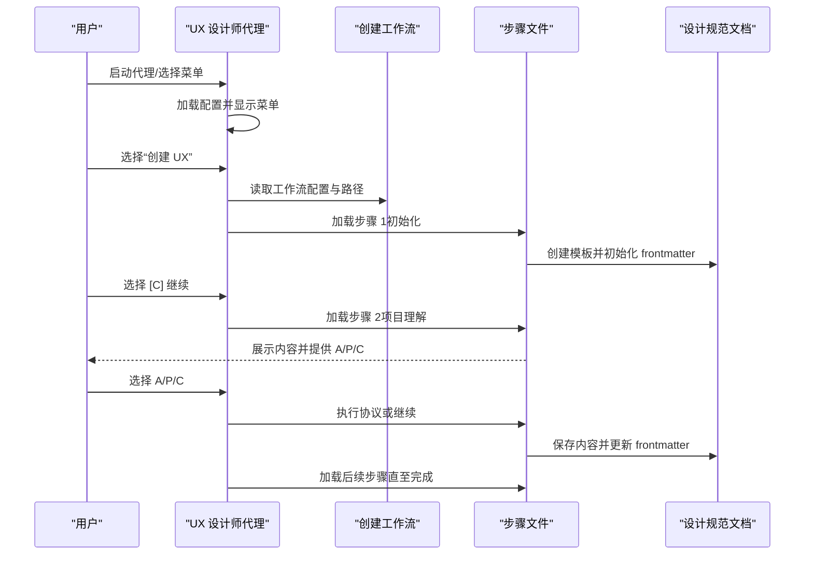

图表来源
- [ux-designer.md:10-25](file://_bmad/bmm/agents/ux-designer.md#L10-L25)
- [workflow.md:25-42](file://_bmad/bmm/workflows/2-plan-workflows/create-ux-design/workflow.md#L25-L42)
- [step-01-init.md:35-51](file://_bmad/bmm/workflows/2-plan-workflows/create-ux-design/steps/step-01-init.md#L35-L51)
- [step-02-discovery.md:152-158](file://_bmad/bmm/workflows/2-plan-workflows/create-ux-design/steps/step-02-discovery.md#L152-L158)

## 详细组件分析

### 组件 A：代理与菜单交互
- 角色与原则：强调“以用户为中心”的设计哲学，坚持“先共情、后方案”的方法论。
- 激活流程：加载配置、问候用户、展示菜单、等待输入；支持模糊命令匹配与帮助提示。
- 协作模式：严格遵循步骤文件的“必须完整阅读”规则，避免局部理解导致的偏差。

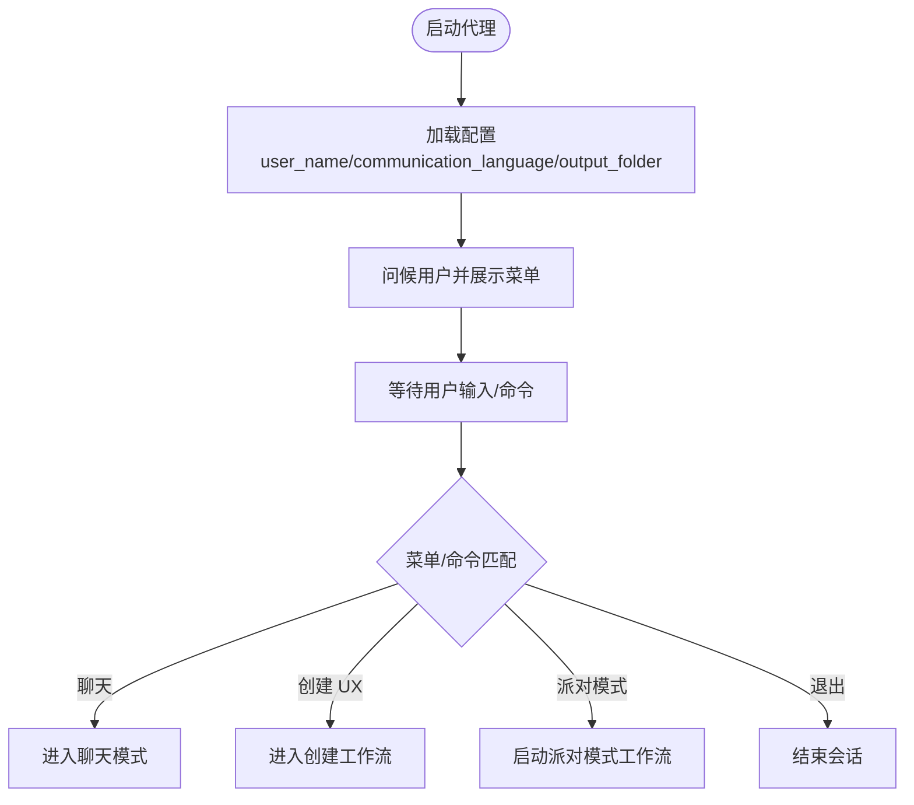

图表来源
- [ux-designer.md:10-25](file://_bmad/bmm/agents/ux-designer.md#L10-L25)

章节来源
- [ux-designer.md:6-25](file://_bmad/bmm/agents/ux-designer.md#L6-L25)

### 组件 B：创建工作流与步骤推进
- 微文件架构：每步为独立文件，嵌入规则与输出结构，前端记录状态，仅在用户确认后推进。
- 配置加载：从统一配置读取项目名、输出目录、语言等，确保输出一致性。
- 路径解析：安装路径、模板路径、默认输出文件均基于配置动态计算。

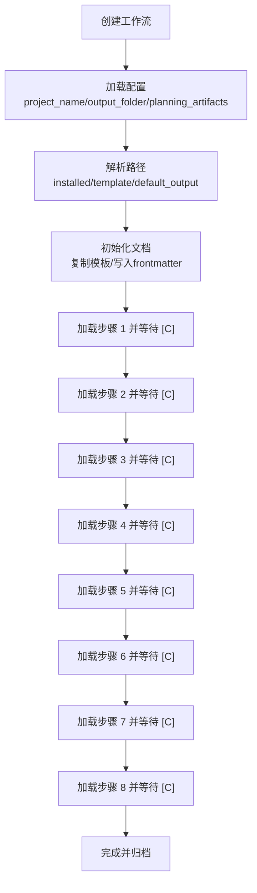

图表来源
- [workflow.md:25-42](file://_bmad/bmm/workflows/2-plan-workflows/create-ux-design/workflow.md#L25-L42)
- [step-01-init.md:35-51](file://_bmad/bmm/workflows/2-plan-workflows/create-ux-design/steps/step-01-init.md#L35-L51)

章节来源
- [workflow.md:25-42](file://_bmad/bmm/workflows/2-plan-workflows/create-ux-design/workflow.md#L25-L42)

### 组件 C：步骤 1 初始化（上下文发现与文档准备）
- 续传检测：若已有设计规范文档，优先交由续传步骤处理，避免重复初始化。
- 上下文发现：在多个知识域搜索并加载文档，支持“分片索引”优先策略，确保完整性。
- 模板初始化：复制模板至规划产物目录，写入 frontmatter，记录已加载文档列表。

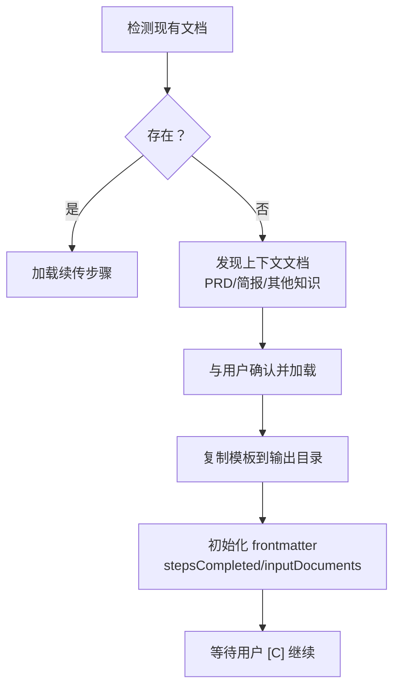

图表来源
- [step-01-init.md:35-51](file://_bmad/bmm/workflows/2-plan-workflows/create-ux-design/steps/step-01-init.md#L35-L51)
- [step-01-init.md:55-80](file://_bmad/bmm/workflows/2-plan-workflows/create-ux-design/steps/step-01-init.md#L55-L80)
- [step-01-init.md:81-94](file://_bmad/bmm/workflows/2-plan-workflows/create-ux-design/steps/step-01-init.md#L81-L94)

章节来源
- [step-01-init.md:35-116](file://_bmad/bmm/workflows/2-plan-workflows/create-ux-design/steps/step-01-init.md#L35-L116)

### 组件 D：步骤 2 项目理解（协作发现与挑战识别）
- 协作发现：基于已加载文档与用户对话，提炼项目愿景、目标用户、关键特性与目标。
- 挑战与机会：识别 UX 设计的关键挑战与可创造优势的机会点，形成可执行的洞察清单。
- A/P/C 菜单：支持“高级提问法”深入挖掘与“派对模式”多视角审视。

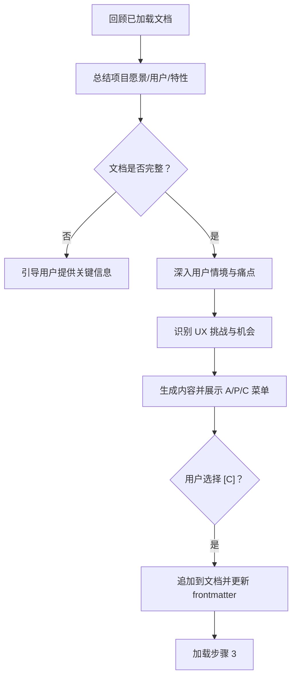

图表来源
- [step-02-discovery.md:49-66](file://_bmad/bmm/workflows/2-plan-workflows/create-ux-design/steps/step-02-discovery.md#L49-L66)
- [step-02-discovery.md:67-79](file://_bmad/bmm/workflows/2-plan-workflows/create-ux-design/steps/step-02-discovery.md#L67-L79)
- [step-02-discovery.md:94-111](file://_bmad/bmm/workflows/2-plan-workflows/create-ux-design/steps/step-02-discovery.md#L94-L111)
- [step-02-discovery.md:140-151](file://_bmad/bmm/workflows/2-plan-workflows/create-ux-design/steps/step-02-discovery.md#L140-L151)

章节来源
- [step-02-discovery.md:49-191](file://_bmad/bmm/workflows/2-plan-workflows/create-ux-design/steps/step-02-discovery.md#L49-L191)

### 组件 E：步骤 3 核心体验定义（平台策略与原则）
- 核心动作：明确用户最频繁、最关键的操作，作为体验设计的“一核心”。
- 平台策略：确定平台类型、交互方式、离线能力与设备特性，影响交互与反馈设计。
- 无缝交互：识别哪些操作应“零思考”，消除竞品常见摩擦点。
- 关键成功时刻：定义决定成败的时刻与首次成功体验，确保设计聚焦。
- 经验原则：提炼可执行的设计原则，指导后续所有决策。

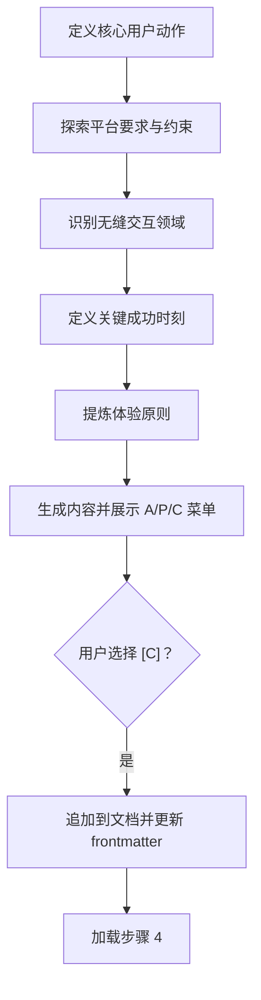

图表来源
- [step-03-core-experience.md:49-64](file://_bmad/bmm/workflows/2-plan-workflows/create-ux-design/steps/step-03-core-experience.md#L49-L64)
- [step-03-core-experience.md:65-77](file://_bmad/bmm/workflows/2-plan-workflows/create-ux-design/steps/step-03-core-experience.md#L65-L77)
- [step-03-core-experience.md:78-88](file://_bmad/bmm/workflows/2-plan-workflows/create-ux-design/steps/step-03-core-experience.md#L78-L88)
- [step-03-core-experience.md:89-99](file://_bmad/bmm/workflows/2-plan-workflows/create-ux-design/steps/step-03-core-experience.md#L89-L99)
- [step-03-core-experience.md:100-113](file://_bmad/bmm/workflows/2-plan-workflows/create-ux-design/steps/step-03-core-experience.md#L100-L113)
- [step-03-core-experience.md:146-159](file://_bmad/bmm/workflows/2-plan-workflows/create-ux-design/steps/step-03-core-experience.md#L146-L159)

章节来源
- [step-03-core-experience.md:49-217](file://_bmad/bmm/workflows/2-plan-workflows/create-ux-design/steps/step-03-core-experience.md#L49-L217)

### 组件 F：步骤 4 情感目标（情绪旅程与微情绪）
- 情绪目标：明确用户使用产品时应产生的主要情感与次级情感，以及需避免的负面情绪。
- 情绪旅程：覆盖初次发现、核心体验、任务完成、错误处理与复购回归等阶段的情感状态。
- 微情绪：关注细微但关键的情绪对比（如信心 vs. 迷茫），确保设计细节到位。
- 设计连接：将情感目标映射到具体交互与界面设计决策，形成可执行的“情感设计原则”。

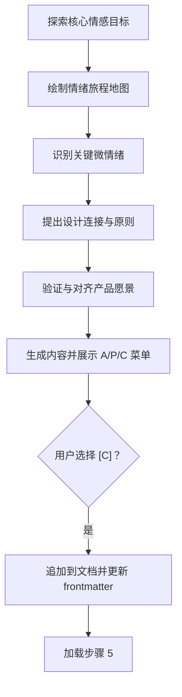

图表来源
- [step-04-emotional-response.md:49-64](file://_bmad/bmm/workflows/2-plan-workflows/create-ux-design/steps/step-04-emotional-response.md#L49-L64)
- [step-04-emotional-response.md:65-75](file://_bmad/bmm/workflows/2-plan-workflows/create-ux-design/steps/step-04-emotional-response.md#L65-L75)
- [step-04-emotional-response.md:76-89](file://_bmad/bmm/workflows/2-plan-workflows/create-ux-design/steps/step-04-emotional-response.md#L76-L89)
- [step-04-emotional-response.md:90-105](file://_bmad/bmm/workflows/2-plan-workflows/create-ux-design/steps/step-04-emotional-response.md#L90-L105)
- [step-04-emotional-response.md:106-116](file://_bmad/bmm/workflows/2-plan-workflows/create-ux-design/steps/step-04-emotional-response.md#L106-L116)
- [step-04-emotional-response.md:148-162](file://_bmad/bmm/workflows/2-plan-workflows/create-ux-design/steps/step-04-emotional-response.md#L148-L162)

章节来源
- [step-04-emotional-response.md:49-220](file://_bmad/bmm/workflows/2-plan-workflows/create-ux-design/steps/step-04-emotional-response.md#L49-L220)

### 组件 G：步骤 5 模式借鉴（启发产品与反模式）
- 启发产品：收集目标用户常用应用，分析其成功 UX 特质与持续吸引力。
- 模式提取：分类导航、交互与视觉模式，评估可迁移性与适应性。
- 反模式规避：总结常见陷阱与不一致之处，避免在设计中重蹈覆辙。
- 策略制定：明确“采纳/适配/规避”的策略，指导设计决策。

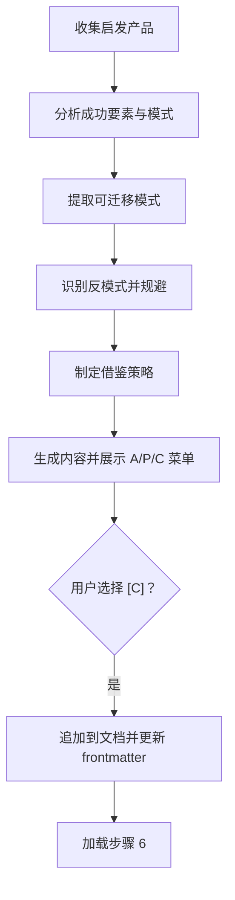

图表来源
- [step-05-inspiration.md:49-64](file://_bmad/bmm/workflows/2-plan-workflows/create-ux-design/steps/step-05-inspiration.md#L49-L64)
- [step-05-inspiration.md:65-78](file://_bmad/bmm/workflows/2-plan-workflows/create-ux-design/steps/step-05-inspiration.md#L65-L78)
- [step-05-inspiration.md:79-101](file://_bmad/bmm/workflows/2-plan-workflows/create-ux-design/steps/step-05-inspiration.md#L79-L101)
- [step-05-inspiration.md:102-113](file://_bmad/bmm/workflows/2-plan-workflows/create-ux-design/steps/step-05-inspiration.md#L102-L113)
- [step-05-inspiration.md:114-135](file://_bmad/bmm/workflows/2-plan-workflows/create-ux-design/steps/step-05-inspiration.md#L114-L135)
- [step-05-inspiration.md:164-177](file://_bmad/bmm/workflows/2-plan-workflows/create-ux-design/steps/step-05-inspiration.md#L164-L177)

章节来源
- [step-05-inspiration.md:49-235](file://_bmad/bmm/workflows/2-plan-workflows/create-ux-design/steps/step-05-inspiration.md#L49-L235)

### 组件 H：步骤 6 设计系统选择（权衡与实施）
- 方案呈现：定制系统、既有系统与主题化系统的优缺点与适用场景。
- 需求分析：结合平台、时间线、团队规模、品牌与技术约束进行权衡。
- 选项探索：针对平台类型给出推荐与考虑因素（组件库质量、文档社区、可定制性、可访问性、性能与学习曲线）。
- 决策框架：通过一系列问题帮助用户做出知情选择，并记录理由与后续步骤。

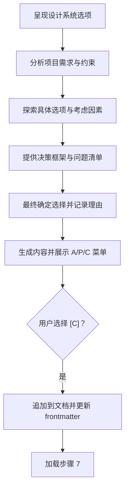

图表来源
- [step-06-design-system.md:49-64](file://_bmad/bmm/workflows/2-plan-workflows/create-ux-design/steps/step-06-design-system.md#L49-L64)
- [step-06-design-system.md:81-101](file://_bmad/bmm/workflows/2-plan-workflows/create-ux-design/steps/step-06-design-system.md#L81-L101)
- [step-06-design-system.md:102-121](file://_bmad/bmm/workflows/2-plan-workflows/create-ux-design/steps/step-06-design-system.md#L102-L121)
- [step-06-design-system.md:122-134](file://_bmad/bmm/workflows/2-plan-workflows/create-ux-design/steps/step-06-design-system.md#L122-L134)
- [step-06-design-system.md:135-153](file://_bmad/bmm/workflows/2-plan-workflows/create-ux-design/steps/step-06-design-system.md#L135-L153)
- [step-06-design-system.md:182-195](file://_bmad/bmm/workflows/2-plan-workflows/create-ux-design/steps/step-06-design-system.md#L182-L195)

章节来源
- [step-06-design-system.md:49-253](file://_bmad/bmm/workflows/2-plan-workflows/create-ux-design/steps/step-06-design-system.md#L49-L253)

### 组件 I：步骤 7 定义体验（心智模型与机制）
- 定义体验：参考经典产品，找到能被用户描述与传播的“一核心”交互。
- 用户心智模型：理解用户现有解决方案、期望与潜在困惑，确保设计符合直觉。
- 成功标准：明确“好用”的指标、反馈与速度感，确保可度量。
- 模式分析：区分新颖与既定模式，决定教育成本与创新程度。
- 体验机制：拆解“开始-交互-反馈-完成”的全流程，确保闭环与可预测。

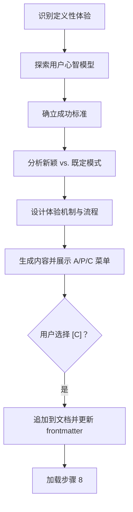

图表来源
- [step-07-defining-experience.md:49-67](file://_bmad/bmm/workflows/2-plan-workflows/create-ux-design/steps/step-07-defining-experience.md#L49-L67)
- [step-07-defining-experience.md:68-83](file://_bmad/bmm/workflows/2-plan-workflows/create-ux-design/steps/step-07-defining-experience.md#L68-L83)
- [step-07-defining-experience.md:84-99](file://_bmad/bmm/workflows/2-plan-workflows/create-ux-design/steps/step-07-defining-experience.md#L84-L99)
- [step-07-defining-experience.md:101-122](file://_bmad/bmm/workflows/2-plan-workflows/create-ux-design/steps/step-07-defining-experience.md#L101-L122)
- [step-07-defining-experience.md:123-151](file://_bmad/bmm/workflows/2-plan-workflows/create-ux-design/steps/step-07-defining-experience.md#L123-L151)
- [step-07-defining-experience.md:184-197](file://_bmad/bmm/workflows/2-plan-workflows/create-ux-design/steps/step-07-defining-experience.md#L184-L197)

章节来源
- [step-07-defining-experience.md:49-255](file://_bmad/bmm/workflows/2-plan-workflows/create-ux-design/steps/step-07-defining-experience.md#L49-L255)

### 组件 J：步骤 8 视觉基础（色彩/字体/间距/布局/可访问性）
- 品牌评估：优先评估现有品牌指南与色彩体系，确保一致性。
- 主题探索：若无品牌指南，提供色彩主题可视化与 UI 示例，辅助决策。
- 字体体系：根据内容密度与语调选择主次字体、字号比例与行高关系。
- 间距与布局：确定空间单位、留白策略与网格结构，满足平台与内容密度需求。
- 可访问性：在色彩对比、字体大小与交互可达性方面提出明确要求。

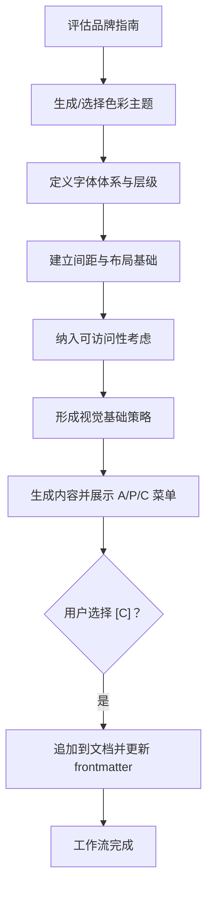

图表来源
- [step-08-visual-foundation.md:49-67](file://_bmad/bmm/workflows/2-plan-workflows/create-ux-design/steps/step-08-visual-foundation.md#L49-L67)
- [step-08-visual-foundation.md:68-84](file://_bmad/bmm/workflows/2-plan-workflows/create-ux-design/steps/step-08-visual-foundation.md#L68-L84)
- [step-08-visual-foundation.md:85-99](file://_bmad/bmm/workflows/2-plan-workflows/create-ux-design/steps/step-08-visual-foundation.md#L85-L99)
- [step-08-visual-foundation.md:101-125](file://_bmad/bmm/workflows/2-plan-workflows/create-ux-design/steps/step-08-visual-foundation.md#L101-L125)
- [step-08-visual-foundation.md:126-153](file://_bmad/bmm/workflows/2-plan-workflows/create-ux-design/steps/step-08-visual-foundation.md#L126-L153)
- [step-08-visual-foundation.md:154-167](file://_bmad/bmm/workflows/2-plan-workflows/create-ux-design/steps/step-08-visual-foundation.md#L154-L167)

章节来源
- [step-08-visual-foundation.md:49-225](file://_bmad/bmm/workflows/2-plan-workflows/create-ux-design/steps/step-08-visual-foundation.md#L49-L225)

## 依赖关系分析
- 代理与工作流：代理通过菜单触发工作流，工作流负责路径解析与步骤调度。
- 工作流与步骤：工作流在初始化阶段加载步骤文件，步骤文件之间存在严格的顺序依赖。
- 协作协议：步骤内集成“高级提问法”和“派对模式”，二者均为独立工作流，返回后回到当前步骤的 A/P/C 菜单。
- 文档状态：frontmatter 记录 stepsCompleted，确保可恢复与可审计。

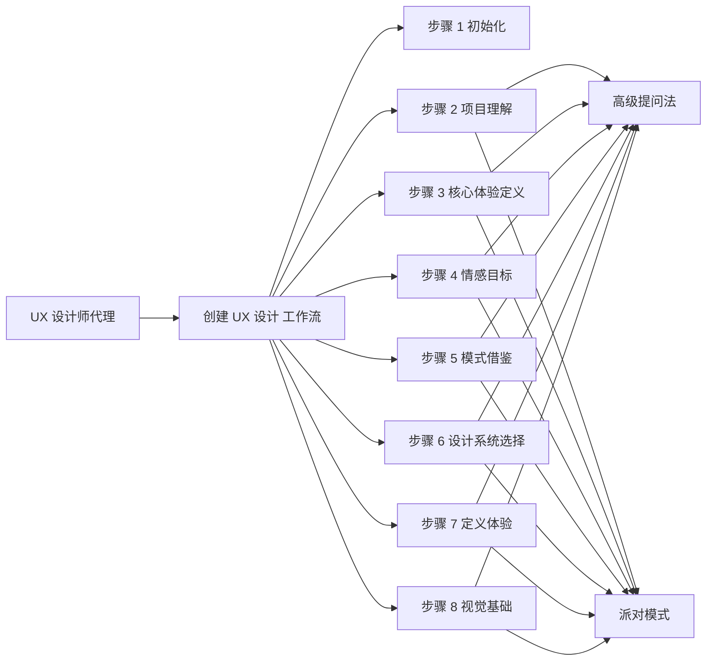

图表来源
- [ux-designer.md:52-54](file://_bmad/bmm/agents/ux-designer.md#L52-L54)
- [step-02-discovery.md:31-36](file://_bmad/bmm/workflows/2-plan-workflows/create-ux-design/steps/step-02-discovery.md#L31-L36)
- [step-03-core-experience.md:31-36](file://_bmad/bmm/workflows/2-plan-workflows/create-ux-design/steps/step-03-core-experience.md#L31-L36)
- [step-04-emotional-response.md:31-36](file://_bmad/bmm/workflows/2-plan-workflows/create-ux-design/steps/step-04-emotional-response.md#L31-L36)
- [step-05-inspiration.md:31-36](file://_bmad/bmm/workflows/2-plan-workflows/create-ux-design/steps/step-05-inspiration.md#L31-L36)
- [step-06-design-system.md:31-36](file://_bmad/bmm/workflows/2-plan-workflows/create-ux-design/steps/step-06-design-system.md#L31-L36)
- [step-07-defining-experience.md:31-36](file://_bmad/bmm/workflows/2-plan-workflows/create-ux-design/steps/step-07-defining-experience.md#L31-L36)
- [step-08-visual-foundation.md:31-36](file://_bmad/bmm/workflows/2-plan-workflows/create-ux-design/steps/step-08-visual-foundation.md#L31-L36)

章节来源
- [ux-designer.md:52-54](file://_bmad/bmm/agents/ux-designer.md#L52-L54)
- [step-02-discovery.md:31-36](file://_bmad/bmm/workflows/2-plan-workflows/create-ux-design/steps/step-02-discovery.md#L31-L36)
- [step-03-core-experience.md:31-36](file://_bmad/bmm/workflows/2-plan-workflows/create-ux-design/steps/step-03-core-experience.md#L31-L36)
- [step-04-emotional-response.md:31-36](file://_bmad/bmm/workflows/2-plan-workflows/create-ux-design/steps/step-04-emotional-response.md#L31-L36)
- [step-05-inspiration.md:31-36](file://_bmad/bmm/workflows/2-plan-workflows/create-ux-design/steps/step-05-inspiration.md#L31-L36)
- [step-06-design-system.md:31-36](file://_bmad/bmm/workflows/2-plan-workflows/create-ux-design/steps/step-06-design-system.md#L31-L36)
- [step-07-defining-experience.md:31-36](file://_bmad/bmm/workflows/2-plan-workflows/create-ux-design/steps/step-07-defining-experience.md#L31-L36)
- [step-08-visual-foundation.md:31-36](file://_bmad/bmm/workflows/2-plan-workflows/create-ux-design/steps/step-08-visual-foundation.md#L31-L36)

## 性能考量
- 文件加载策略：采用“先分片索引、后全文件”的发现逻辑，减少不必要的大文件扫描，提高上下文加载效率。
- 步骤执行节奏：每步必须完整阅读后再推进，避免重复回溯与无效迭代。
- 协作协议开销：高级提问法与派对模式为可选增强，仅在需要时触发，降低平均执行时间。
- 文档持久化：通过 frontmatter 记录步骤进度，便于中断恢复，减少重新计算成本。

## 故障排查指南
- 常见失败模式
  - 未完整阅读步骤文件即推进：可能导致决策偏差与前后矛盾。
  - 在未保存前直接加载下一步：破坏文档一致性与状态追踪。
  - 忽略 A/P/C 菜单：跳过必要的协作与确认环节。
  - 未正确记录已加载文档：影响后续上下文合成与溯源。
- 排查建议
  - 回到上一步，重新完整阅读当前步骤文件并严格遵循协议。
  - 在执行 A/P/C 前，确认已充分理解生成内容与后续影响。
  - 若文档状态异常，检查 frontmatter 的 stepsCompleted 是否与实际内容一致。
  - 如遇协议返回，先审阅返回内容，再决定是否接受改进。

章节来源
- [step-01-init.md:125-136](file://_bmad/bmm/workflows/2-plan-workflows/create-ux-design/steps/step-01-init.md#L125-L136)
- [step-02-discovery.md:174-187](file://_bmad/bmm/workflows/2-plan-workflows/create-ux-design/steps/step-02-discovery.md#L174-L187)
- [step-03-core-experience.md:198-211](file://_bmad/bmm/workflows/2-plan-workflows/create-ux-design/steps/step-03-core-experience.md#L198-L211)
- [step-04-emotional-response.md:201-214](file://_bmad/bmm/workflows/2-plan-workflows/create-ux-design/steps/step-04-emotional-response.md#L201-L214)
- [step-05-inspiration.md:216-235](file://_bmad/bmm/workflows/2-plan-workflows/create-ux-design/steps/step-05-inspiration.md#L216-L235)
- [step-06-design-system.md:234-247](file://_bmad/bmm/workflows/2-plan-workflows/create-ux-design/steps/step-06-design-system.md#L234-L247)
- [step-07-defining-experience.md:236-249](file://_bmad/bmm/workflows/2-plan-workflows/create-ux-design/steps/step-07-defining-experience.md#L236-L249)
- [step-08-visual-foundation.md:206-219](file://_bmad/bmm/workflows/2-plan-workflows/create-ux-design/steps/step-08-visual-foundation.md#L206-L219)

## 结论
UX 设计师代理通过严谨的微文件工作流，将复杂的产品设计过程分解为可协作、可验证、可审计的步骤。代理以“用户为中心”的方法论贯穿始终，结合“高级提问法”与“派对模式”实现多视角洞察，最终形成可落地的设计规范文档。该框架不仅提升了设计效率与质量，也为后续架构与实现阶段提供了清晰的输入与一致的约束。

## 附录
- 无障碍设计要点
  - 色彩对比与可读性：确保文本与背景满足可访问性对比度要求。
  - 字体与字号：保证在不同设备与缩放下仍具备良好可读性。
  - 键盘与触控：提供完整的键盘导航与触控反馈，避免仅依赖鼠标。
  - 屏幕阅读器：为关键元素提供语义化标签与描述。
- 响应式设计要点
  - 弹性布局：使用相对单位与弹性网格，适配不同屏幕尺寸。
  - 触控优先：移动端交互应简化手势与点击区域，减少误操作。
  - 性能优化：在小屏设备上优先加载轻量资源，避免阻塞主线程。
- 跨平台一致性
  - 设计系统：统一组件与交互模式，确保在 Web、移动端与桌面端的一致体验。
  - 交互范式：遵循各平台的交互惯例，同时保持品牌独特性。
  - 可访问性：在所有平台上贯彻可访问性原则，覆盖不同能力与环境。