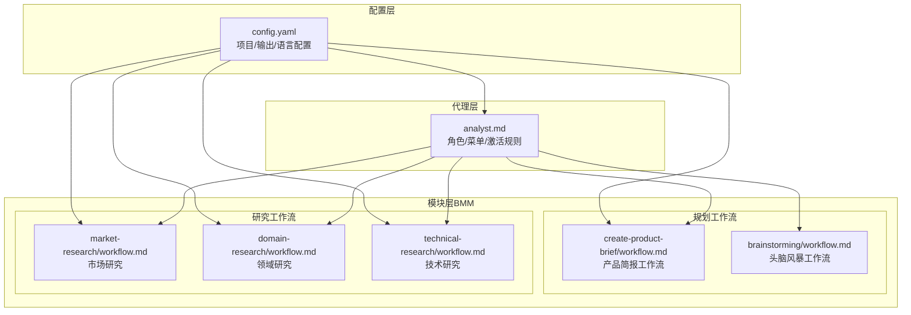
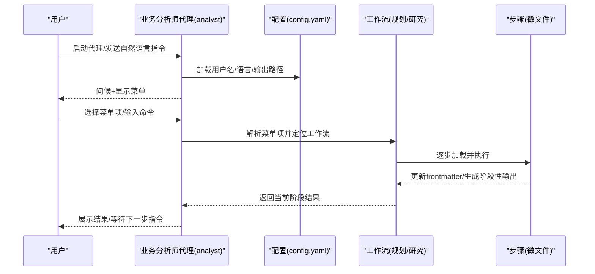
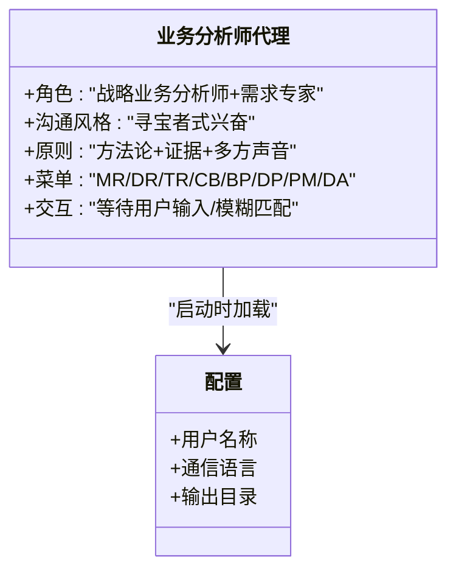
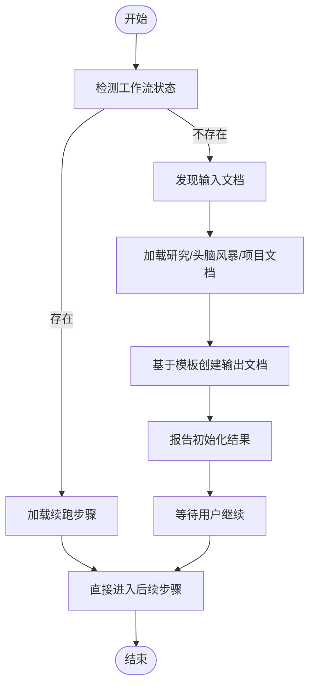
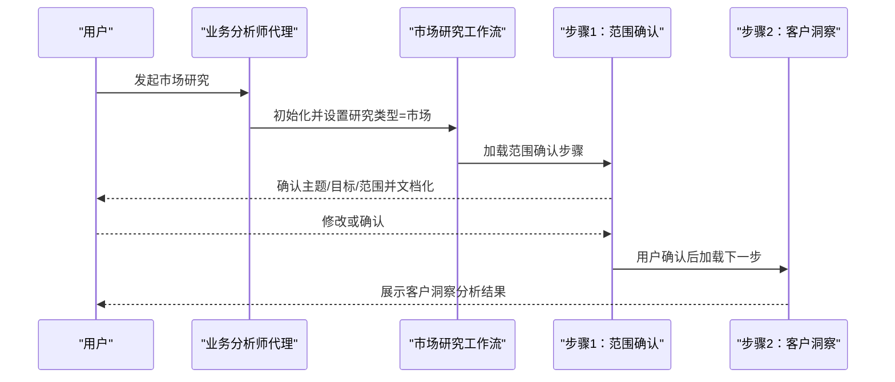
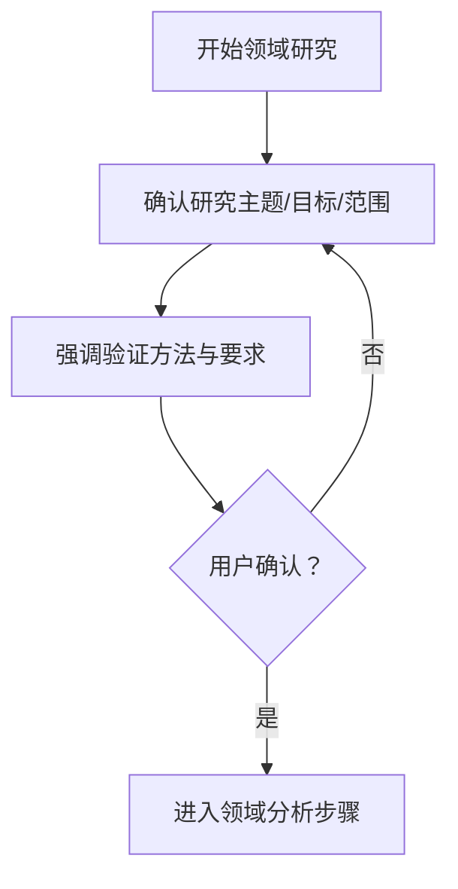
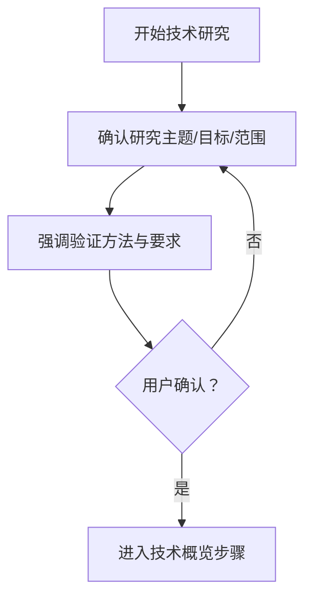
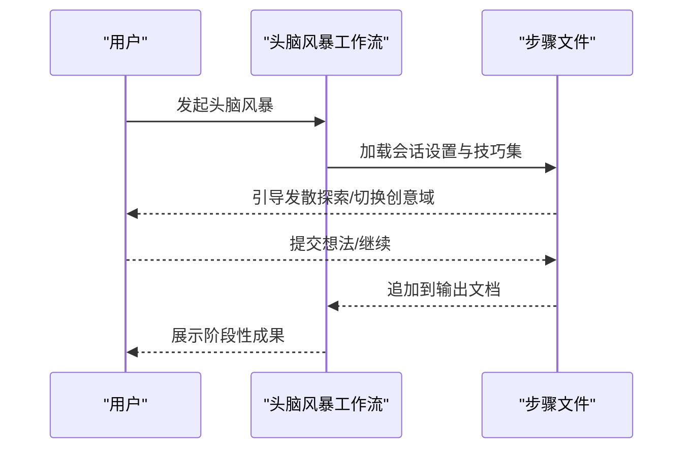
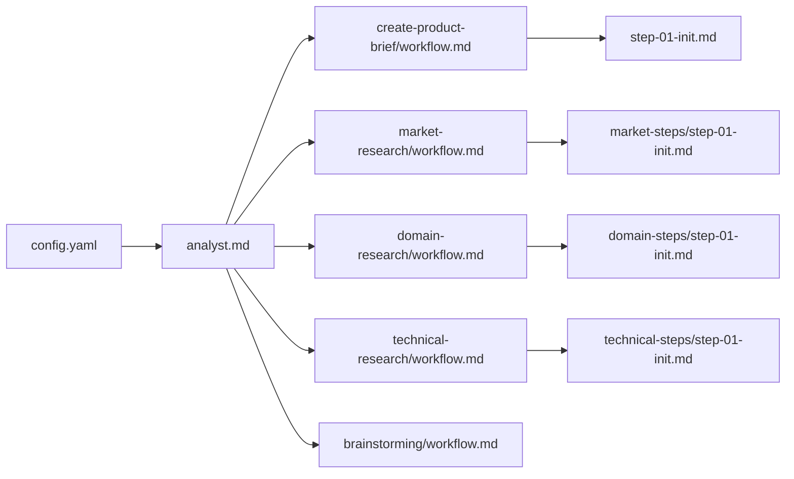

# 业务分析师代理

<cite>
**本文引用的文件**
- [analyst.md](file://_bmad/bmm/agents/analyst.md)
- [config.yaml](file://_bmad/bmm/config.yaml)
- [project-context-template.md](file://_bmad/bmm/data/project-context-template.md)
- [workflow.md](file://_bmad/bmm/workflows/1-analysis/create-product-brief/workflow.md)
- [step-01-init.md](file://_bmad/bmm/workflows/1-analysis/create-product-brief/steps/step-01-init.md)
- [workflow-market-research.md](file://_bmad/bmm/workflows/1-analysis/research/workflow-market-research.md)
- [workflow-domain-research.md](file://_bmad/bmm/workflows/1-analysis/research/workflow-domain-research.md)
- [workflow-technical-research.md](file://_bmad/bmm/workflows/1-analysis/research/workflow-technical-research.md)
- [step-01-init.md（市场研究）](file://_bmad/bmm/workflows/1-analysis/research/market-steps/step-01-init.md)
- [step-01-init.md（领域研究）](file://_bmad/bmm/workflows/1-analysis/research/domain-steps/step-01-init.md)
- [step-01-init.md（技术研究）](file://_bmad/bmm/workflows/1-analysis/research/technical-steps/step-01-init.md)
- [workflow.md（头脑风暴）](file://_bmad/core/workflows/brainstorming/workflow.md)
</cite>

## 目录
1. [简介](#简介)
2. [项目结构](#项目结构)
3. [核心组件](#核心组件)
4. [架构总览](#架构总览)
5. [详细组件分析](#详细组件分析)
6. [依赖关系分析](#依赖关系分析)
7. [性能考量](#性能考量)
8. [故障排查指南](#故障排查指南)
9. [结论](#结论)
10. [附录](#附录)

## 简介
本文件面向业务分析师代理（Business Analyst Agent），系统化阐述其核心能力与专业职责：市场研究、竞争分析、需求获取、领域专业知识。文档同时解析代理的人格特征、沟通风格与工作原则，并说明其如何运用波特五力模型、SWOT分析、根本原因分析等专业框架来发现商业机会与解决问题。文中提供菜单选项与交互方式、典型使用场景与工作流程，以及实际案例演示，帮助用户高效地进行产品概念验证、竞品分析与需求梳理。

## 项目结构
业务分析师代理位于模块化工作流体系中，采用“代理-模块-工作流-步骤”的分层组织方式：
- 代理层：定义角色、人格、菜单与激活规则
- 模块层：业务建模模块（BMM）提供分析与规划工作流
- 工作流层：按主题划分的研究与规划工作流
- 步骤层：微文件化的执行步骤，严格顺序与状态管理

图表来源
- [analyst.md:1-79](file://_bmad/bmm/agents/analyst.md#L1-L79)
- [config.yaml:1-17](file://_bmad/bmm/config.yaml#L1-L17)
- [workflow.md:1-58](file://_bmad/bmm/workflows/1-analysis/create-product-brief/workflow.md#L1-L58)
- [workflow-market-research.md:1-55](file://_bmad/bmm/workflows/1-analysis/research/workflow-market-research.md#L1-L55)
- [workflow-domain-research.md:1-55](file://_bmad/bmm/workflows/1-analysis/research/workflow-domain-research.md#L1-L55)
- [workflow-technical-research.md:1-55](file://_bmad/bmm/workflows/1-analysis/research/workflow-technical-research.md#L1-L55)
- [workflow.md（头脑风暴）:1-59](file://_bmad/core/workflows/brainstorming/workflow.md#L1-L59)

章节来源
- [analyst.md:1-79](file://_bmad/bmm/agents/analyst.md#L1-L79)
- [config.yaml:1-17](file://_bmad/bmm/config.yaml#L1-L17)

## 核心组件
- 代理定义与激活
  - 角色与身份：战略型业务分析师+需求专家，擅长将模糊需求转化为可执行规范
  - 沟通风格：如寻宝者般兴奋，从线索到模式，结构化洞察但让分析过程像发现之旅
  - 原则：运用波特五力、SWOT、根因分析、竞争情报等方法论，以证据为依据，确保需求精准表达，兼顾多方声音
  - 菜单与交互：支持数字编号、命令词模糊匹配、/bmad-help辅助提示；严格等待用户输入，不自动执行菜单项
- 配置与上下文
  - 从模块配置加载用户名称、通信语言、输出目录等，作为会话变量贯穿所有工作流
- 工作流编排
  - 采用“微文件”架构：每步一文件，仅在需要时按序加载，避免一次性加载多个步骤
  - 状态追踪：通过输出文件frontmatter记录已完成步骤，支持续跑与回溯
  - 输出持久化：每步完成后即时保存，避免批量合并导致的状态丢失

章节来源
- [analyst.md:53-76](file://_bmad/bmm/agents/analyst.md#L53-L76)
- [config.yaml:6-16](file://_bmad/bmm/config.yaml#L6-L16)
- [workflow.md:14-44](file://_bmad/bmm/workflows/1-analysis/create-product-brief/workflow.md#L14-L44)

## 架构总览
业务分析师代理通过统一的菜单入口进入不同主题的工作流，每个工作流由若干步骤组成，遵循严格的执行协议与状态管理。代理在激活时读取配置并展示菜单，随后根据用户选择或自然语言触发相应工作流。

图表来源
- [analyst.md:10-25](file://_bmad/bmm/agents/analyst.md#L10-L25)
- [config.yaml:12-16](file://_bmad/bmm/config.yaml#L12-L16)
- [workflow.md:47-57](file://_bmad/bmm/workflows/1-analysis/create-product-brief/workflow.md#L47-L57)

## 详细组件分析

### 组件A：业务分析师代理（角色与菜单）
- 代理角色与原则
  - 战略业务分析师+需求专家，强调将模糊需求转化为可执行规范
  - 方法论：波特五力、SWOT、根因分析、竞争情报
  - 沟通风格：结构化但富于探索感，使分析过程充满发现的乐趣
- 菜单与交互
  - 支持数字编号、命令词模糊匹配、/bmad-help辅助提示
  - 严格等待用户输入，不自动执行菜单项
  - 显示帮助与下一步建议，便于新手快速上手
- 激活与规则
  - 启动时强制加载配置并校验
  - 严格遵守“仅在执行时加载文件”的原则
  - 保持角色一致性直至退出

图表来源
- [analyst.md:59-76](file://_bmad/bmm/agents/analyst.md#L59-L76)
- [config.yaml:12-16](file://_bmad/bmm/config.yaml#L12-L16)

章节来源
- [analyst.md:59-76](file://_bmad/bmm/agents/analyst.md#L59-L76)
- [config.yaml:12-16](file://_bmad/bmm/config.yaml#L12-L16)

### 组件B：产品简报工作流（Create Product Brief）
- 目标：通过协作式发现，将产品想法沉淀为高层简报
- 执行协议
  - 微文件设计：每步一文件，仅在需要时加载
  - 初始化：检测现有工作流状态，若无则基于模板创建输出文档
  - 输入文档发现：智能搜索并加载相关研究/头脑风暴/项目文档，支持分片索引
  - 状态追踪：frontmatter记录已完成步骤与输入文档清单
- 关键步骤
  - 初始化：设置文档结构、记录输入文档、提示继续
  - 进入愿景发现：引导用户明确产品愿景、目标与成功度量

图表来源
- [step-01-init.md:60-154](file://_bmad/bmm/workflows/1-analysis/create-product-brief/steps/step-01-init.md#L60-L154)
- [workflow.md:47-57](file://_bmad/bmm/workflows/1-analysis/create-product-brief/workflow.md#L47-L57)

章节来源
- [workflow.md:14-57](file://_bmad/bmm/workflows/1-analysis/create-product-brief/workflow.md#L14-L57)
- [step-01-init.md:60-154](file://_bmad/bmm/workflows/1-analysis/create-product-brief/steps/step-01-init.md#L60-L154)

### 组件C：市场研究工作流（Market Research）
- 目标：基于当前网络数据与权威来源，完成市场分析、竞争格局、客户洞察与趋势研判
- 执行协议
  - 初始澄清：确认研究主题、目标与范围，不进行实际网络研究
  - 文档化：立即写入初始研究范围，供用户审阅与修改
  - 继续机制：必须用户选择“继续”，方可进入下一步
- 典型分析维度
  - 市场规模、增长动态与趋势
  - 客户洞察与行为分析
  - 竞争格局与定位
  - 战略建议与实施路径

图表来源
- [workflow-market-research.md:42-51](file://_bmad/bmm/workflows/1-analysis/research/workflow-market-research.md#L42-L51)
- [step-01-init.md（市场研究）:35-183](file://_bmad/bmm/workflows/1-analysis/research/market-steps/step-01-init.md#L35-L183)

章节来源
- [workflow-market-research.md:12-55](file://_bmad/bmm/workflows/1-analysis/research/workflow-market-research.md#L12-L55)
- [step-01-init.md（市场研究）:35-183](file://_bmad/bmm/workflows/1-analysis/research/market-steps/step-01-init.md#L35-L183)

### 组件D：领域研究工作流（Domain Research）
- 目标：对行业/领域进行深度研究，覆盖产业分析、监管环境、技术趋势、经济因素与供应链
- 执行协议
  - 范围确认：强调需以权威来源验证与补充知识
  - 方法论：多源验证、不确定性置信度评估、全面覆盖
  - 继续机制：用户确认后才进入下一步

图表来源
- [workflow-domain-research.md:42-51](file://_bmad/bmm/workflows/1-analysis/research/workflow-domain-research.md#L42-L51)
- [step-01-init.md（领域研究）:35-138](file://_bmad/bmm/workflows/1-analysis/research/domain-steps/step-01-init.md#L35-L138)

章节来源
- [workflow-domain-research.md:12-55](file://_bmad/bmm/workflows/1-analysis/research/workflow-domain-research.md#L12-L55)
- [step-01-init.md（领域研究）:35-138](file://_bmad/bmm/workflows/1-analysis/research/domain-steps/step-01-init.md#L35-L138)

### 组件E：技术研究工作流（Technical Research）
- 目标：对技术栈、架构方案与实现路径进行可行性研究
- 执行协议
  - 范围确认：明确架构分析、实现方法、技术栈、集成模式与性能考虑
  - 方法论：当前网络数据+严谨溯源验证、多源验证、不确定性置信度框架
  - 继续机制：用户确认后进入技术概览步骤

图表来源
- [workflow-technical-research.md:42-51](file://_bmad/bmm/workflows/1-analysis/research/workflow-technical-research.md#L42-L51)
- [step-01-init.md（技术研究）:35-138](file://_bmad/bmm/workflows/1-analysis/research/technical-steps/step-01-init.md#L35-L138)

章节来源
- [workflow-technical-research.md:12-55](file://_bmad/bmm/workflows/1-analysis/research/workflow-technical-research.md#L12-L55)
- [step-01-init.md（技术研究）:35-138](file://_bmad/bmm/workflows/1-analysis/research/technical-steps/step-01-init.md#L35-L138)

### 组件F：头脑风暴工作流（Brainstorming）
- 目标：通过多样化创意技巧与思维导引，推动发散性探索，鼓励突破显性思路
- 执行协议
  - 保持生成探索模式，避免过早收敛
  - 抗偏见协议：每约10个想法切换一次创意域，防止语义聚类
  - 数量目标：至少产出100+想法，前20个通常显而易见，真正的突破在50-100之间
  - 输出：会话式追加构建，模板化存储

图表来源
- [workflow.md（头脑风暴）:33-59](file://_bmad/core/workflows/brainstorming/workflow.md#L33-L59)

章节来源
- [workflow.md（头脑风暴）:13-17](file://_bmad/core/workflows/brainstorming/workflow.md#L13-L17)
- [workflow.md（头脑风暴）:33-59](file://_bmad/core/workflows/brainstorming/workflow.md#L33-L59)

### 组件G：项目背景模板（Project Context）
- 作用：为头脑风暴与产品简报提供聚焦点，涵盖用户痛点、功能设想、技术路径、用户体验、商业模式、市场差异化、技术风险与成功指标等关键探索领域
- 集成：在产品简报初始化阶段被发现并加载，作为后续工作的上下文基础

章节来源
- [project-context-template.md:1-27](file://_bmad/bmm/data/project-context-template.md#L1-L27)
- [step-01-init.md:85-110](file://_bmad/bmm/workflows/1-analysis/create-product-brief/steps/step-01-init.md#L85-L110)

## 依赖关系分析
- 代理对配置的依赖：启动即加载模块配置，确保通信语言、输出路径等全局一致
- 工作流对步骤的依赖：严格顺序加载，前置条件满足（如网络搜索可用）才进入研究步骤
- 步骤对文档的依赖：frontmatter记录状态，支持续跑与回溯；输出文件作为中间产物被后续步骤引用

图表来源
- [config.yaml:12-16](file://_bmad/bmm/config.yaml#L12-L16)
- [analyst.md:65-76](file://_bmad/bmm/agents/analyst.md#L65-L76)
- [workflow.md:47-57](file://_bmad/bmm/workflows/1-analysis/create-product-brief/workflow.md#L47-L57)
- [workflow-market-research.md:42-51](file://_bmad/bmm/workflows/1-analysis/research/workflow-market-research.md#L42-L51)
- [workflow-domain-research.md:42-51](file://_bmad/bmm/workflows/1-analysis/research/workflow-domain-research.md#L42-L51)
- [workflow-technical-research.md:42-51](file://_bmad/bmm/workflows/1-analysis/research/workflow-technical-research.md#L42-L51)
- [workflow.md（头脑风暴）:54-59](file://_bmad/core/workflows/brainstorming/workflow.md#L54-L59)

章节来源
- [analyst.md:65-76](file://_bmad/bmm/agents/analyst.md#L65-L76)
- [workflow.md:47-57](file://_bmad/bmm/workflows/1-analysis/create-product-brief/workflow.md#L47-L57)

## 性能考量
- 微文件加载策略：仅在需要时加载当前步骤，降低内存占用与IO压力
- 状态持久化：每步完成后即时保存，减少重算成本
- 并行与串行：步骤间严格串行，避免并发冲突；研究类工作流在网络搜索可用时再推进
- 输出路径：集中到规划产物目录，便于后续检索与复用

## 故障排查指南
- 启动失败
  - 现象：无法加载配置或未显示菜单
  - 排查：确认模块配置已生成且字段完整；检查代理激活步骤是否正确执行
- 研究工作流中断
  - 现象：提示需要网络搜索但不可用
  - 排查：确认网络搜索能力可用后再发起市场/领域/技术研究
- 步骤跳过或顺序错误
  - 现象：提示禁止跳步或未按顺序执行
  - 排查：严格遵循“仅加载当前步骤”与“按顺序执行”的规则；必要时重新初始化工作流
- 输出缺失或状态异常
  - 现象：frontmatter未更新或输出文件未生成
  - 排查：确认每步完成后已保存；检查输出路径权限与磁盘空间

章节来源
- [analyst.md:10-25](file://_bmad/bmm/agents/analyst.md#L10-L25)
- [workflow-market-research.md:12-14](file://_bmad/bmm/workflows/1-analysis/research/workflow-market-research.md#L12-L14)
- [workflow.md:37-44](file://_bmad/bmm/workflows/1-analysis/create-product-brief/workflow.md#L37-L44)

## 结论
业务分析师代理以严谨的方法论与结构化流程，将市场研究、竞争分析、需求获取与领域专业知识有机结合。通过微文件化的步骤设计、状态追踪与输出持久化，代理能够在复杂项目中持续提供高质量的分析与规划支持。配合头脑风暴与产品简报工作流，代理能够从概念验证到需求梳理形成闭环，助力团队做出更明智的商业决策。

## 附录

### 使用场景与工作流程
- 项目头脑风暴
  - 触发：自然语言或菜单项
  - 流程：会话设置→创意技巧→想法收集→输出归档
  - 适用：早期概念发散、跨部门协同
- 市场调研
  - 触发：自然语言或菜单项
  - 流程：主题确认→范围澄清→客户洞察→竞争分析→战略建议
  - 适用：产品定位、市场进入策略
- 领域研究
  - 触发：自然语言或菜单项
  - 流程：主题确认→范围澄清→产业/监管/技术/经济/供应链分析
  - 适用：合规与技术路线规划
- 技术研究
  - 触发：自然语言或菜单项
  - 流程：主题确认→范围澄清→架构/实现/技术栈/集成/性能分析
  - 适用：技术选型与架构设计
- 产品概念验证与需求梳理
  - 触发：自然语言或菜单项
  - 流程：产品简报初始化→输入文档发现→愿景与目标确认→需求细化→输出文档
  - 适用：PRD起草、需求评审

### 实际案例演示
- 案例A：产品概念验证
  - 场景：团队有初步产品想法，希望形成高层简报
  - 流程：头脑风暴→产品简报工作流→输入文档整合→输出高层简报
- 案例B：竞品分析
  - 场景：计划进入新市场，需要了解竞争格局与客户洞察
  - 流程：市场研究工作流→范围确认→客户洞察→竞争分析→输出报告
- 案例C：需求梳理
  - 场景：已有产品方向，需要细化需求与成功指标
  - 流程：产品简报工作流→输入文档发现→需求细化→输出PRD初稿