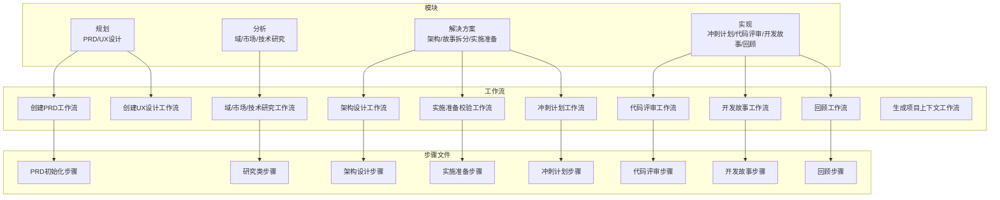
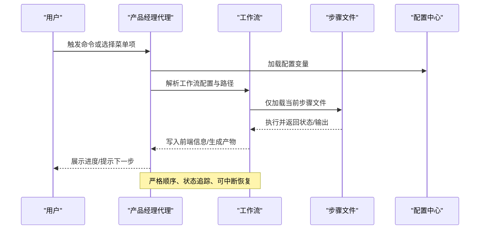
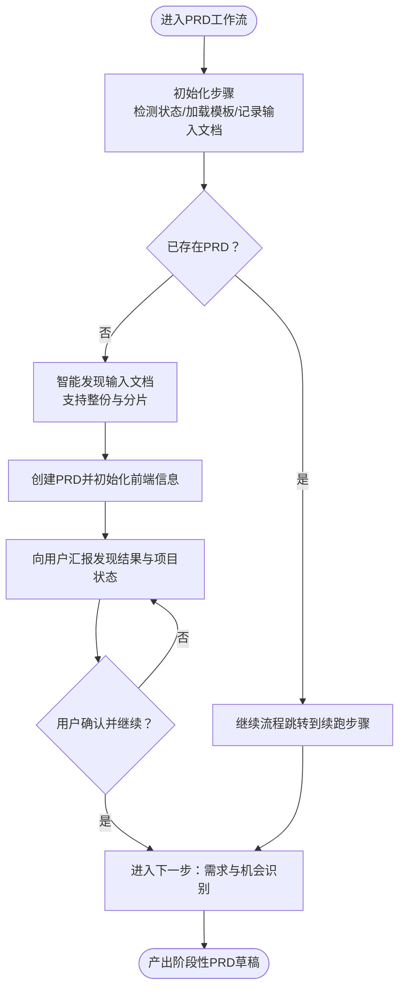
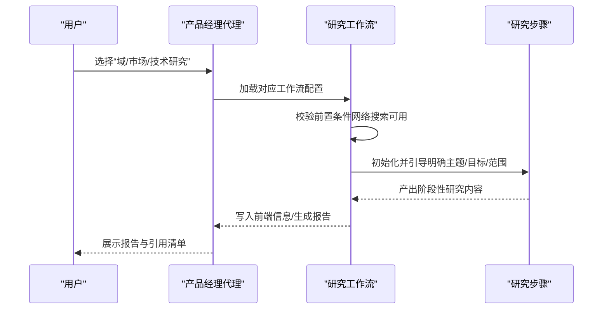
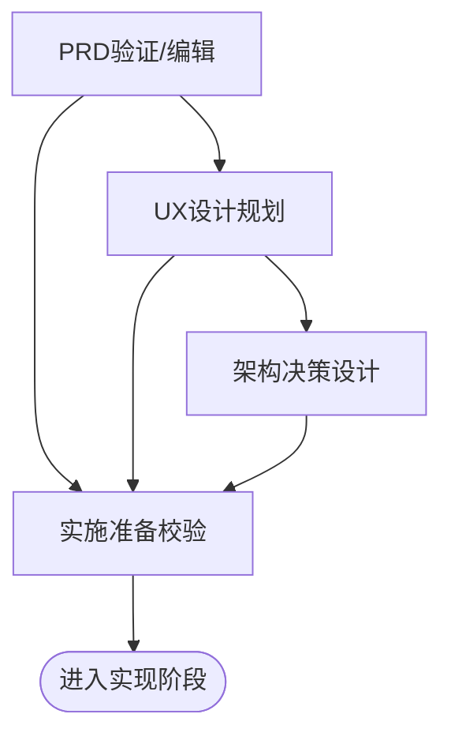
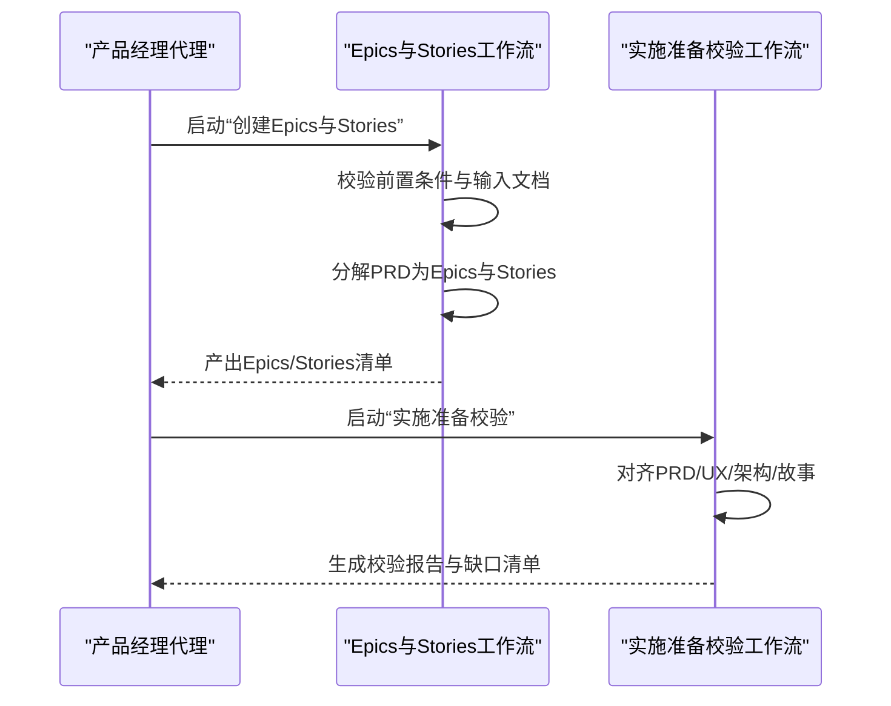
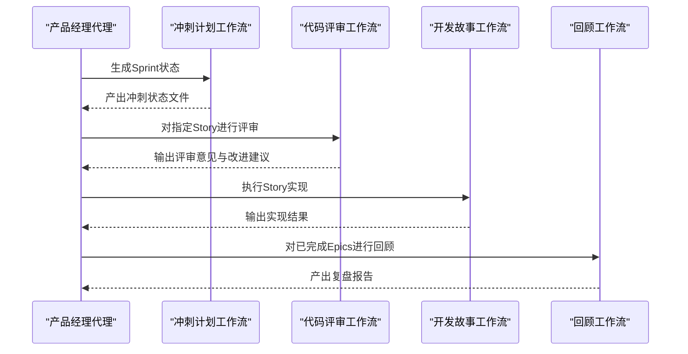
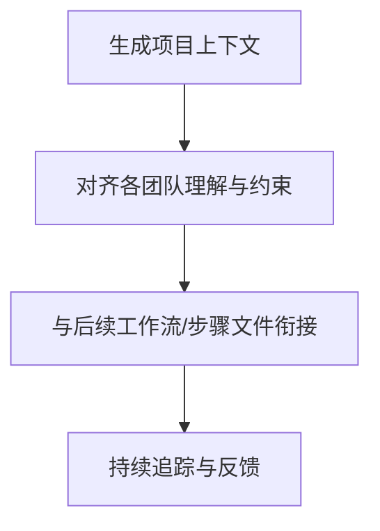

# 产品经理代理

<cite>
**本文引用的文件**
- [_bmad/bmm/agents/pm.md](file://_bmad/bmm/agents/pm.md)
- [_bmad/bmm/config.yaml](file://_bmad/bmm/config.yaml)
- [_bmad/bmm/workflows/2-plan-workflows/create-prd/workflow-create-prd.md](file://_bmad/bmm/workflows/2-plan-workflows/create-prd/workflow-create-prd.md)
- [_bmad/bmm/workflows/2-plan-workflows/create-prd/steps-c/step-01-init.md](file://_bmad/bmm/workflows/2-plan-workflows/create-prd/steps-c/step-01-init.md)
- [_bmad/bmm/workflows/2-plan-workflows/create-prd/templates/prd-template.md](file://_bmad/bmm/workflows/2-plan-workflows/create-prd/templates/prd-template.md)
- [_bmad/bmm/workflows/2-plan-workflows/create-ux-design/workflow.md](file://_bmad/bmm/workflows/2-plan-workflows/create-ux-design/workflow.md)
- [_bmad/bmm/workflows/1-analysis/research/workflow-domain-research.md](file://_bmad/bmm/workflows/1-analysis/research/workflow-domain-research.md)
- [_bmad/bmm/workflows/1-analysis/research/workflow-market-research.md](file://_bmad/bmm/workflows/1-analysis/research/workflow-market-research.md)
- [_bmad/bmm/workflows/1-analysis/research/workflow-technical-research.md](file://_bmad/bmm/workflows/1-analysis/research/workflow-technical-research.md)
- [_bmad/bmm/workflows/3-solutioning/create-architecture/workflow.md](file://_bmad/bmm/workflows/3-solutioning/create-architecture/workflow.md)
- [_bmad/bmm/workflows/3-solutioning/check-implementation-readiness/workflow.md](file://_bmad/bmm/workflows/3-solutioning/check-implementation-readiness/workflow.md)
- [_bmad/bmm/workflows/3-solutioning/create-epics-and-stories/workflow.md](file://_bmad/bmm/workflows/3-solutioning/create-epics-and-stories/workflow.md)
- [_bmad/bmm/workflows/4-implementation/sprint-planning/workflow.yaml](file://_bmad/bmm/workflows/4-implementation/sprint-planning/workflow.yaml)
- [_bmad/bmm/workflows/4-implementation/code-review/workflow.yaml](file://_bmad/bmm/workflows/4-implementation/code-review/workflow.yaml)
- [_bmad/bmm/workflows/4-implementation/dev-story/workflow.yaml](file://_bmad/bmm/workflows/4-implementation/dev-story/workflow.yaml)
- [_bmad/bmm/workflows/4-implementation/retrospective/workflow.yaml](file://_bmad/bmm/workflows/4-implementation/retrospective/workflow.yaml)
- [_bmad/bmm/workflows/generate-project-context/workflow.md](file://_bmad/bmm/workflows/generate-project-context/workflow.md)
</cite>

## 目录
1. [简介](#简介)
2. [项目结构](#项目结构)
3. [核心组件](#核心组件)
4. [架构总览](#架构总览)
5. [详细组件分析](#详细组件分析)
6. [依赖关系分析](#依赖关系分析)
7. [性能考量](#性能考量)
8. [故障排查指南](#故障排查指南)
9. [结论](#结论)
10. [附录](#附录)

## 简介
本文件系统化梳理“产品经理代理”的能力边界与工作流，覆盖产品管理全链路：从需求发现、用户研究、数据分析到产品策略与路线图制定；从PRD撰写、UX设计、架构决策到需求拆解、实施准备、迭代回顾。文档同时阐明代理在跨部门协作中的协调职责（与开发、设计、运营、市场团队），并通过可复用的工作流模板与步骤文件，帮助用户高效完成从概念到交付的关键环节。

## 项目结构
该仓库以“模块-工作流-步骤文件”三层组织方式构建产品管理自动化体系：
- 模块层：定义领域与职责边界（如分析、规划、解决方案、实现）
- 工作流层：封装端到端流程（如PRD创建、研究类工作流、架构设计、实施准备等）
- 步骤文件层：微步骤化、顺序执行、状态追踪，确保可重复与可审计

图表来源
- [_bmad/bmm/workflows/2-plan-workflows/create-prd/workflow-create-prd.md:1-64](file://_bmad/bmm/workflows/2-plan-workflows/create-prd/workflow-create-prd.md#L1-L64)
- [_bmad/bmm/workflows/2-plan-workflows/create-ux-design/workflow.md:1-43](file://_bmad/bmm/workflows/2-plan-workflows/create-ux-design/workflow.md#L1-L43)
- [_bmad/bmm/workflows/1-analysis/research/workflow-domain-research.md:1-55](file://_bmad/bmm/workflows/1-analysis/research/workflow-domain-research.md#L1-L55)
- [_bmad/bmm/workflows/1-analysis/research/workflow-market-research.md:1-55](file://_bmad/bmm/workflows/1-analysis/research/workflow-market-research.md#L1-L55)
- [_bmad/bmm/workflows/1-analysis/research/workflow-technical-research.md:1-55](file://_bmad/bmm/workflows/1-analysis/research/workflow-technical-research.md#L1-L55)
- [_bmad/bmm/workflows/3-solutioning/create-architecture/workflow.md:1-50](file://_bmad/bmm/workflows/3-solutioning/create-architecture/workflow.md#L1-L50)
- [_bmad/bmm/workflows/3-solutioning/check-implementation-readiness/workflow.md:1-55](file://_bmad/bmm/workflows/3-solutioning/check-implementation-readiness/workflow.md#L1-L55)
- [_bmad/bmm/workflows/4-implementation/sprint-planning/workflow.yaml:1-48](file://_bmad/bmm/workflows/4-implementation/sprint-planning/workflow.yaml#L1-L48)
- [_bmad/bmm/workflows/4-implementation/code-review/workflow.yaml:1-44](file://_bmad/bmm/workflows/4-implementation/code-review/workflow.yaml#L1-L44)
- [_bmad/bmm/workflows/4-implementation/dev-story/workflow.yaml:1-21](file://_bmad/bmm/workflows/4-implementation/dev-story/workflow.yaml#L1-L21)
- [_bmad/bmm/workflows/4-implementation/retrospective/workflow.yaml:1-53](file://_bmad/bmm/workflows/4-implementation/retrospective/workflow.yaml#L1-L53)
- [_bmad/bmm/workflows/generate-project-context/workflow.md:1-50](file://_bmad/bmm/workflows/generate-project-context/workflow.md#L1-L50)

章节来源
- [_bmad/bmm/config.yaml:1-17](file://_bmad/bmm/config.yaml#L1-L17)

## 核心组件
- 产品经理代理（PM Agent）：作为产品管理的“主持人”，负责引导用户完成从研究到交付的全流程，强调“以用户为中心、以价值为导向、以数据为依据”的原则。
- 配置中心（config.yaml）：集中管理项目名、输出目录、语言偏好、技能等级等，贯穿所有工作流。
- 工作流编排（workflow-*.yaml/md）：定义目标、规则、路径与输出，统一执行范式。
- 微步骤文件（steps-*.md）：严格顺序、状态追踪、只加载当前步骤，避免跳跃与优化。

章节来源
- [_bmad/bmm/agents/pm.md:1-73](file://_bmad/bmm/agents/pm.md#L1-L73)
- [_bmad/bmm/config.yaml:1-17](file://_bmad/bmm/config.yaml#L1-L17)

## 架构总览
产品经理代理通过“代理-工作流-步骤文件”三级结构实现产品管理闭环：
- 代理层：定义角色、身份、沟通风格与菜单项，负责激活与调度。
- 工作流层：按阶段划分（分析、规划、解决方案、实现），每个阶段有明确输入、处理与输出。
- 步骤层：最小可执行单元，遵循“只读当前、顺序推进、状态写回”的原则。

图表来源
- [_bmad/bmm/agents/pm.md:10-52](file://_bmad/bmm/agents/pm.md#L10-L52)
- [_bmad/bmm/workflows/2-plan-workflows/create-prd/workflow-create-prd.md:28-46](file://_bmad/bmm/workflows/2-plan-workflows/create-prd/workflow-create-prd.md#L28-L46)
- [_bmad/bmm/config.yaml:6-16](file://_bmad/bmm/config.yaml#L6-L16)

## 详细组件分析

### 组件A：需求与PRD管理
- 能力范围
  - 从零创建PRD：通过“初始化-发现-验证-编辑-完成”的闭环，确保PRD结构完整、内容聚焦、可追溯。
  - 输入文档智能发现：支持整份文档与“带索引的分片文档”两种形态，自动识别并加载。
  - 绿地/棕地项目区分：根据是否已有项目文档，调整后续流程重点。
- 关键流程
  - 初始化：检测现有PRD状态，决定是“继续”还是“全新开始”；加载模板并初始化前端信息。
  - 输入发现：扫描规划产物与知识库，自动发现并加载相关文档。
  - 输出追踪：每步完成后更新前端信息中的“已完成步骤列表”。

图表来源
- [_bmad/bmm/workflows/2-plan-workflows/create-prd/steps-c/step-01-init.md:62-165](file://_bmad/bmm/workflows/2-plan-workflows/create-prd/steps-c/step-01-init.md#L62-L165)
- [_bmad/bmm/workflows/2-plan-workflows/create-prd/workflow-create-prd.md:16-46](file://_bmad/bmm/workflows/2-plan-workflows/create-prd/workflow-create-prd.md#L16-L46)
- [_bmad/bmm/workflows/2-plan-workflows/create-prd/templates/prd-template.md:1-11](file://_bmad/bmm/workflows/2-plan-workflows/create-prd/templates/prd-template.md#L1-L11)

章节来源
- [_bmad/bmm/workflows/2-plan-workflows/create-prd/workflow-create-prd.md:1-64](file://_bmad/bmm/workflows/2-plan-workflows/create-prd/workflow-create-prd.md#L1-L64)
- [_bmad/bmm/workflows/2-plan-workflows/create-prd/steps-c/step-01-init.md:1-192](file://_bmad/bmm/workflows/2-plan-workflows/create-prd/steps-c/step-01-init.md#L1-L192)
- [_bmad/bmm/workflows/2-plan-workflows/create-prd/templates/prd-template.md:1-11](file://_bmad/bmm/workflows/2-plan-workflows/create-prd/templates/prd-template.md#L1-L11)

### 组件B：用户研究与洞察
- 能力范围
  - 域/行业研究：聚焦特定领域，形成可引用的研究报告。
  - 市场研究：面向竞争与客户，产出可落地的洞察与建议。
  - 技术研究：面向技术选型与架构方向，支撑方案设计。
- 执行要点
  - 必须具备网络搜索能力；否则中止并提示。
  - 明确主题、目标与范围，再进入具体步骤。
  - 产出研究报告，标注来源与引用。

图表来源
- [_bmad/bmm/workflows/1-analysis/research/workflow-domain-research.md:12-54](file://_bmad/bmm/workflows/1-analysis/research/workflow-domain-research.md#L12-L54)
- [_bmad/bmm/workflows/1-analysis/research/workflow-market-research.md:12-54](file://_bmad/bmm/workflows/1-analysis/research/workflow-market-research.md#L12-L54)
- [_bmad/bmm/workflows/1-analysis/research/workflow-technical-research.md:12-54](file://_bmad/bmm/workflows/1-analysis/research/workflow-technical-research.md#L12-L54)

章节来源
- [_bmad/bmm/workflows/1-analysis/research/workflow-domain-research.md:1-55](file://_bmad/bmm/workflows/1-analysis/research/workflow-domain-research.md#L1-L55)
- [_bmad/bmm/workflows/1-analysis/research/workflow-market-research.md:1-55](file://_bmad/bmm/workflows/1-analysis/research/workflow-market-research.md#L1-L55)
- [_bmad/bmm/workflows/1-analysis/research/workflow-technical-research.md:1-55](file://_bmad/bmm/workflows/1-analysis/research/workflow-technical-research.md#L1-L55)

### 组件C：产品策略与路线图
- 能力范围
  - PRD验证与编辑：确保PRD结构清晰、逻辑一致、可执行。
  - UX设计规划：协同视觉与交互，形成可执行的设计规范。
  - 架构决策：沉淀架构决策记录，保障一致性与可演进性。
- 关键流程
  - PRD验证：对PRD进行完整性与一致性检查，提出改进建议。
  - UX设计：以模板为起点，逐步完善设计说明与规范。
  - 架构设计：基于约束与目标，形成可追踪的架构决策文档。

图表来源
- [_bmad/bmm/workflows/2-plan-workflows/create-prd/workflow-create-prd.md:1-64](file://_bmad/bmm/workflows/2-plan-workflows/create-prd/workflow-create-prd.md#L1-L64)
- [_bmad/bmm/workflows/2-plan-workflows/create-ux-design/workflow.md:1-43](file://_bmad/bmm/workflows/2-plan-workflows/create-ux-design/workflow.md#L1-L43)
- [_bmad/bmm/workflows/3-solutioning/create-architecture/workflow.md:1-50](file://_bmad/bmm/workflows/3-solutioning/create-architecture/workflow.md#L1-L50)
- [_bmad/bmm/workflows/3-solutioning/check-implementation-readiness/workflow.md:1-55](file://_bmad/bmm/workflows/3-solutioning/check-implementation-readiness/workflow.md#L1-L55)

章节来源
- [_bmad/bmm/workflows/2-plan-workflows/create-prd/workflow-create-prd.md:1-64](file://_bmad/bmm/workflows/2-plan-workflows/create-prd/workflow-create-prd.md#L1-L64)
- [_bmad/bmm/workflows/2-plan-workflows/create-ux-design/workflow.md:1-43](file://_bmad/bmm/workflows/2-plan-workflows/create-ux-design/workflow.md#L1-L43)
- [_bmad/bmm/workflows/3-solutioning/create-architecture/workflow.md:1-50](file://_bmad/bmm/workflows/3-solutioning/create-architecture/workflow.md#L1-L50)
- [_bmad/bmm/workflows/3-solutioning/check-implementation-readiness/workflow.md:1-55](file://_bmad/bmm/workflows/3-solutioning/check-implementation-readiness/workflow.md#L1-L55)

### 组件D：需求拆解与实施准备
- 能力范围
  - 故事拆分：将PRD转化为以用户价值为导向的Epics与Stories，并给出验收标准。
  - 实施准备校验：确保PRD、UX、架构与Epics/Stories对齐，无遗漏。
- 关键流程
  - 故事拆分：按价值与依赖组织Stories，明确验收条件与风险点。
  - 实施准备：对齐各制品，识别缺口并形成修正计划。

图表来源
- [_bmad/bmm/workflows/3-solutioning/create-epics-and-stories/workflow.md:1-59](file://_bmad/bmm/workflows/3-solutioning/create-epics-and-stories/workflow.md#L1-L59)
- [_bmad/bmm/workflows/3-solutioning/check-implementation-readiness/workflow.md:1-55](file://_bmad/bmm/workflows/3-solutioning/check-implementation-readiness/workflow.md#L1-L55)

章节来源
- [_bmad/bmm/workflows/3-solutioning/create-epics-and-stories/workflow.md:1-59](file://_bmad/bmm/workflows/3-solutioning/create-epics-and-stories/workflow.md#L1-L59)
- [_bmad/bmm/workflows/3-solutioning/check-implementation-readiness/workflow.md:1-55](file://_bmad/bmm/workflows/3-solutioning/check-implementation-readiness/workflow.md#L1-L55)

### 组件E：冲刺计划与迭代回顾
- 能力范围
  - 冲刺计划：基于Epics与Stories生成可执行的冲刺状态文件，支持跟踪与回溯。
  - 代码评审：针对具体Story进行对抗式评审，定位问题并输出改进建议。
  - 开发故事：在上下文完备的情况下执行具体Story的实现。
  - 回顾：对已完成Epics进行复盘，沉淀经验与改进点。
- 关键流程
  - 冲刺计划：全量加载Epics，生成冲刺状态文件，支持后续跟踪。
  - 代码评审：按需加载架构、UX与目标Epics，聚焦具体Story。
  - 开发故事：在项目上下文与Sprint状态下执行Story。
  - 回顾：结合架构、PRD与历史回顾，提取可复用的经验。

图表来源
- [_bmad/bmm/workflows/4-implementation/sprint-planning/workflow.yaml:1-48](file://_bmad/bmm/workflows/4-implementation/sprint-planning/workflow.yaml#L1-L48)
- [_bmad/bmm/workflows/4-implementation/code-review/workflow.yaml:1-44](file://_bmad/bmm/workflows/4-implementation/code-review/workflow.yaml#L1-L44)
- [_bmad/bmm/workflows/4-implementation/dev-story/workflow.yaml:1-21](file://_bmad/bmm/workflows/4-implementation/dev-story/workflow.yaml#L1-L21)
- [_bmad/bmm/workflows/4-implementation/retrospective/workflow.yaml:1-53](file://_bmad/bmm/workflows/4-implementation/retrospective/workflow.yaml#L1-L53)

章节来源
- [_bmad/bmm/workflows/4-implementation/sprint-planning/workflow.yaml:1-48](file://_bmad/bmm/workflows/4-implementation/sprint-planning/workflow.yaml#L1-L48)
- [_bmad/bmm/workflows/4-implementation/code-review/workflow.yaml:1-44](file://_bmad/bmm/workflows/4-implementation/code-review/workflow.yaml#L1-L44)
- [_bmad/bmm/workflows/4-implementation/dev-story/workflow.yaml:1-21](file://_bmad/bmm/workflows/4-implementation/dev-story/workflow.yaml#L1-L21)
- [_bmad/bmm/workflows/4-implementation/retrospective/workflow.yaml:1-53](file://_bmad/bmm/workflows/4-implementation/retrospective/workflow.yaml#L1-L53)

### 组件F：跨部门协作与项目上下文
- 能力范围
  - 生成项目上下文：提炼AI实现所需的关键规则与细节，降低实现偏差。
  - 协调与沟通：在PRD、UX、架构、Epics/Stories与实现之间建立清晰的对接点。
- 关键流程
  - 项目上下文：发现与整合项目规则、模式与约束，形成可复用的上下文文件。
  - 协同机制：通过工作流与步骤文件，确保各团队在统一语言与节奏下协作。

图表来源
- [_bmad/bmm/workflows/generate-project-context/workflow.md:1-50](file://_bmad/bmm/workflows/generate-project-context/workflow.md#L1-L50)

章节来源
- [_bmad/bmm/workflows/generate-project-context/workflow.md:1-50](file://_bmad/bmm/workflows/generate-project-context/workflow.md#L1-L50)

## 依赖关系分析
- 代理依赖配置中心：所有工作流均从配置中心读取项目名、输出目录、语言与技能等级等关键参数。
- 工作流依赖步骤文件：严格遵循“当前步骤文件”加载与执行，避免并发与跳跃。
- 步骤文件间存在顺序依赖：前序步骤完成并写入前端信息后，方可进入下一步。
- 文档发现与分片机制：支持整份文档与“带索引的分片文档”，提升大文档可维护性。

图表来源
- [_bmad/bmm/config.yaml:6-16](file://_bmad/bmm/config.yaml#L6-L16)
- [_bmad/bmm/agents/pm.md:10-52](file://_bmad/bmm/agents/pm.md#L10-L52)

章节来源
- [_bmad/bmm/config.yaml:1-17](file://_bmad/bmm/config.yaml#L1-L17)
- [_bmad/bmm/agents/pm.md:1-73](file://_bmad/bmm/agents/pm.md#L1-L73)

## 性能考量
- 加载策略
  - 仅加载当前步骤文件，避免内存与IO压力。
  - 支持“全量加载”与“选择性加载”，按工作流需求权衡性能与准确性。
- 状态追踪
  - 每步完成后更新前端信息，便于断点续跑与审计。
- 文档发现
  - 优先分片索引，再扩展到子文件，减少无关内容读取。

## 故障排查指南
- 无法继续流程
  - 检查前端信息中的“已完成步骤列表”是否正确更新。
  - 确认当前步骤文件是否完整读取并遵循指令。
- 输入文档缺失
  - 使用“智能发现”功能重新扫描规划产物与知识库。
  - 确认分片文档的索引文件是否存在且有效。
- 语言与输出不一致
  - 核对配置中心的语言设置，确保输出遵循统一语言。
- 网络搜索不可用
  - 研究类工作流需要网络搜索能力，若不可用则会中止，请先启用网络搜索。

章节来源
- [_bmad/bmm/workflows/2-plan-workflows/create-prd/steps-c/step-01-init.md:169-192](file://_bmad/bmm/workflows/2-plan-workflows/create-prd/steps-c/step-01-init.md#L169-L192)
- [_bmad/bmm/workflows/1-analysis/research/workflow-domain-research.md:12-14](file://_bmad/bmm/workflows/1-analysis/research/workflow-domain-research.md#L12-L14)
- [_bmad/bmm/workflows/1-analysis/research/workflow-market-research.md:12-14](file://_bmad/bmm/workflows/1-analysis/research/workflow-market-research.md#L12-L14)
- [_bmad/bmm/workflows/1-analysis/research/workflow-technical-research.md:12-14](file://_bmad/bmm/workflows/1-analysis/research/workflow-technical-research.md#L12-L14)

## 结论
产品经理代理以“微步骤+工作流+配置中心”的架构，将产品管理从“想法”到“交付”的全过程标准化、可审计、可复用。通过严格的顺序执行、状态追踪与跨模块协同，代理能够有效平衡用户需求、商业目标与技术可行性，确保产品成功交付。建议在实际使用中：
- 明确语言与技能等级设置，保证输出质量与一致性。
- 充分利用研究类工作流与项目上下文，提升洞察深度与协作效率。
- 在实施阶段坚持“全量/选择性加载”策略，兼顾性能与完整性。

## 附录
- 术语
  - 绿地项目：无既有项目文档的新项目。
  - 棕地项目：已有项目文档的延续性项目。
  - 分片文档：以索引文件为入口的多文件组织形式。
- 最佳实践
  - 在PRD初始化阶段充分发现输入文档，避免后续反复补充。
  - 在实施准备阶段严格对齐PRD、UX、架构与Epics/Stories。
  - 使用冲刺计划与回顾形成持续改进闭环。