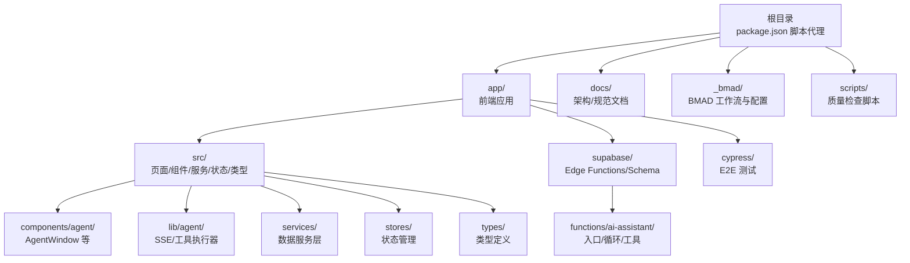
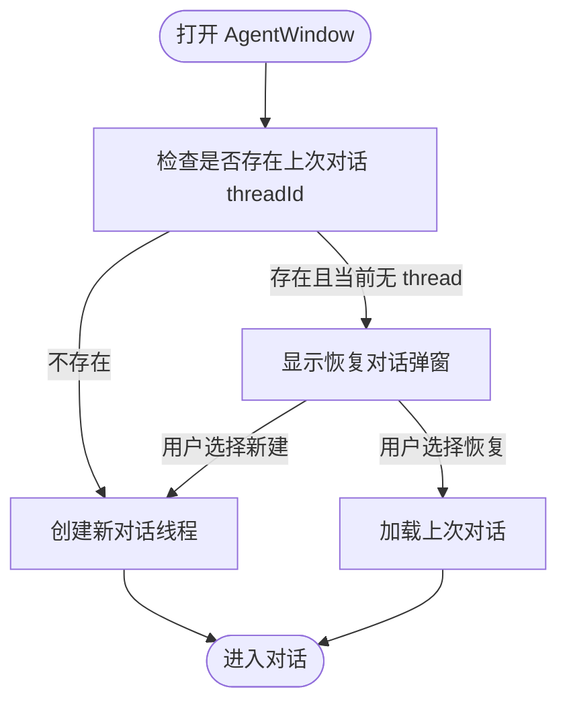
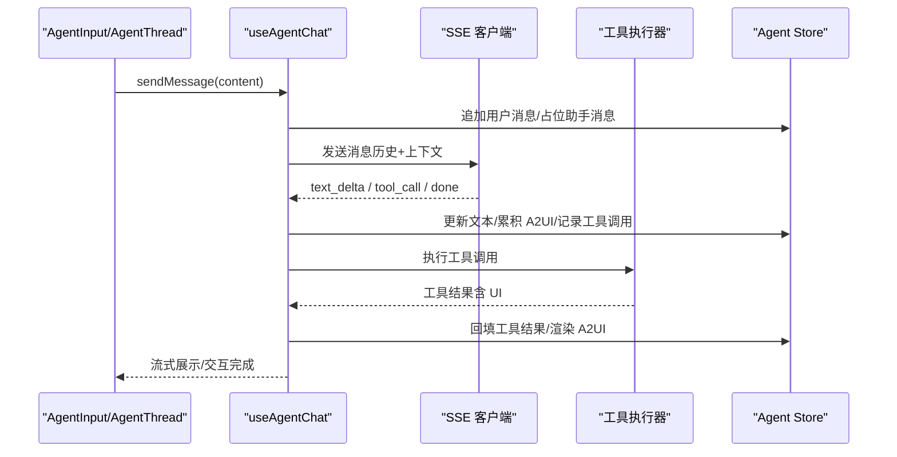
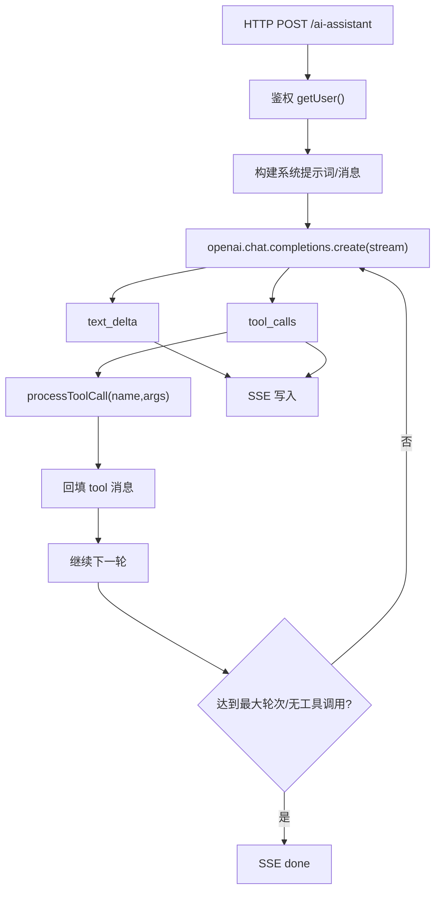
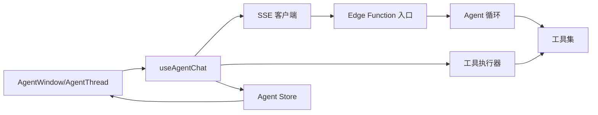

# 开发者代理

<cite>
**本文引用的文件**
- [README.md](file://README.md)
- [AGENTS.md](file://AGENTS.md)
- [app/README.md](file://app/README.md)
- [package.json](file://package.json)
- [docs/README.md](file://docs/README.md)
- [docs/Architecture.md](file://docs/Architecture.md)
- [docs/CONVENTIONS.md](file://docs/CONVENTIONS.md)
- [app/supabase/functions/ai-assistant/index.ts](file://app/supabase/functions/ai-assistant/index.ts)
- [app/supabase/functions/ai-assistant/agentLoop.ts](file://app/supabase/functions/ai-assistant/agentLoop.ts)
- [app/supabase/functions/ai-assistant/tools.ts](file://app/supabase/functions/ai-assistant/tools.ts)
- [app/src/components/agent/AgentWindow.tsx](file://app/src/components/agent/AgentWindow.tsx)
- [app/src/hooks/useAgentChat.ts](file://app/src/hooks/useAgentChat.ts)
- [app/src/lib/agent/toolExecutor.ts](file://app/src/lib/agent/toolExecutor.ts)
- [scripts/quality_check.sh](file://scripts/quality_check.sh)
</cite>

## 目录
1. [简介](#简介)
2. [项目结构](#项目结构)
3. [核心组件](#核心组件)
4. [架构总览](#架构总览)
5. [详细组件分析](#详细组件分析)
6. [依赖分析](#依赖分析)
7. [性能考虑](#性能考虑)
8. [故障排查指南](#故障排查指南)
9. [结论](#结论)
10. [附录](#附录)

## 简介
本文件面向希望在 OPC-Starter 项目中高效使用“开发者代理”的工程师与产品/测试同学。文档系统性阐述代理的编程能力与开发技能边界，覆盖多语言支持（通过 LLM 提供）、代码生成、调试与优化建议；并结合 BMAD 方法论，说明代理如何协助进行需求分析、技术方案设计与编码实现，展示其在敏捷开发流程中的价值。同时给出具体开发场景（新功能开发、Bug 修复、性能优化、代码重构）下的使用示例与最佳实践，明确代码生成规范、命名约定与质量门禁，以及与版本控制、CI/CD 与测试框架的集成方式。

## 项目结构
OPC-Starter 是一个面向 AI Coding 的 React 启动模板，采用“根目录代理脚本 + app 子工程”的组织方式，配合 Supabase 后端与 Edge Functions，形成“前端应用 + AI 助手网关 + 数据层”的整体架构。根目录通过 package.json 暴露常用命令，app 子目录承载前端应用与测试配置，docs 提供架构与规范文档，_bmad 与 .claude 目录沉淀 BMAD 工作流与技能清单。



图表来源
- [package.json:1-23](file://package.json#L1-L23)
- [docs/README.md:15-56](file://docs/README.md#L15-L56)
- [docs/Architecture.md:160-196](file://docs/Architecture.md#L160-L196)

章节来源
- [README.md:114-144](file://README.md#L114-L144)
- [docs/README.md:15-56](file://docs/README.md#L15-L56)
- [package.json:1-23](file://package.json#L1-L23)

## 核心组件
- AI 助手网关（Edge Functions）
  - 入口：接收前端 SSE 请求，鉴权并转发至 Agent 循环
  - Agent 循环：多轮 LLM 推理 + 工具调用 + SSE 流式输出
  - 工具集：导航、上下文查询、A2UI 渲染等
- 前端 Agent Studio
  - AgentWindow：悬浮对话框容器，支持拖拽、最小化、恢复对话
  - useAgentChat：整合 SSE、工具执行器与状态管理，提供发送消息、中断、错误处理等能力
  - toolExecutor：工具执行器，负责按名称执行工具并返回结果
- 数据与状态
  - Zustand Store：管理认证、用户资料、Agent 对话状态与 UI 状态
  - DataService：统一的数据访问入口，结合 IndexedDB 与 Supabase Realtime 实现实时缓存
- 质量与规范
  - AGENTS.md：AI Coding 规范与质量门禁
  - CONVENTIONS.md：目录约定、命名规则、分层依赖、错误处理、Tailwind v4、测试规范
  - quality_check.sh：核心校验 + 可选 E2E

章节来源
- [docs/Architecture.md:74-107](file://docs/Architecture.md#L74-L107)
- [app/src/components/agent/AgentWindow.tsx:1-243](file://app/src/components/agent/AgentWindow.tsx#L1-L243)
- [app/src/hooks/useAgentChat.ts:1-380](file://app/src/hooks/useAgentChat.ts#L1-L380)
- [app/src/lib/agent/toolExecutor.ts:1-67](file://app/src/lib/agent/toolExecutor.ts#L1-L67)
- [docs/CONVENTIONS.md:1-107](file://docs/CONVENTIONS.md#L1-L107)
- [AGENTS.md:1-89](file://AGENTS.md#L1-L89)
- [scripts/quality_check.sh:1-30](file://scripts/quality_check.sh#L1-L30)

## 架构总览
开发者代理贯穿“前端 UI → SSE 客户端 → Edge Functions → LLM → 工具执行 → A2UI 渲染”的闭环，结合上下文生成与多轮对话，实现“所想即所得”的自然语言开发体验。

```mermaid
sequenceDiagram
participant U as "用户"
participant W as "AgentWindow"
participant HC as "useAgentChat"
participant SSE as "SSE 客户端"
participant EF as "Edge Function 入口"
participant LOOP as "Agent 循环"
participant LLM as "Qwen-Plus 百炼"
participant TOOLS as "工具集"
participant A2UI as "A2UI 渲染"
U->>W : 打开悬浮窗/输入消息
W->>HC : sendMessage(content)
HC->>SSE : 连接并发送消息历史+上下文
SSE->>EF : POST /ai-assistant
EF->>LOOP : runAgentLoop(messages, context)
LOOP->>LLM : 流式聊天补全含工具定义
LLM-->>LOOP : 文本增量 + 工具调用
LOOP->>TOOLS : processToolCall(name,args)
TOOLS-->>LOOP : 工具执行结果含 A2UI
LOOP-->>SSE : text_delta / tool_call / done
SSE-->>HC : 事件回调文本/工具/A2UI
HC->>A2UI : 渲染/更新 UI
A2UI-->>W : 展示交互组件
```

图表来源
- [app/src/components/agent/AgentWindow.tsx:130-241](file://app/src/components/agent/AgentWindow.tsx#L130-L241)
- [app/src/hooks/useAgentChat.ts:299-377](file://app/src/hooks/useAgentChat.ts#L299-L377)
- [app/supabase/functions/ai-assistant/index.ts:22-113](file://app/supabase/functions/ai-assistant/index.ts#L22-L113)
- [app/supabase/functions/ai-assistant/agentLoop.ts:21-137](file://app/supabase/functions/ai-assistant/agentLoop.ts#L21-L137)
- [app/supabase/functions/ai-assistant/tools.ts:161-190](file://app/supabase/functions/ai-assistant/tools.ts#L161-L190)

章节来源
- [docs/Architecture.md:22-107](file://docs/Architecture.md#L22-L107)
- [docs/Architecture.md:231-240](file://docs/Architecture.md#L231-L240)

## 详细组件分析

### 组件 A：AgentWindow（悬浮对话框）
- 职责：提供可拖拽、可最小化的对话容器，支持恢复上次对话、清空对话、切换最小化状态
- 关键点：窗口尺寸配置、初始位置计算、拖拽边界限制、状态持久化（上一次 threadId）



图表来源
- [app/src/components/agent/AgentWindow.tsx:72-124](file://app/src/components/agent/AgentWindow.tsx#L72-L124)

章节来源
- [app/src/components/agent/AgentWindow.tsx:1-243](file://app/src/components/agent/AgentWindow.tsx#L1-L243)

### 组件 B：useAgentChat（对话集成层）
- 职责：整合 SSE、工具执行器与状态管理，提供发送消息、中断、错误处理、A2UI 累积与渲染
- 关键点：H2A 异步转向（AbortController + SSE 中断），累积文本与 A2UI 消息，批量执行工具调用并回填结果



图表来源
- [app/src/hooks/useAgentChat.ts:299-377](file://app/src/hooks/useAgentChat.ts#L299-L377)
- [app/src/lib/agent/toolExecutor.ts:39-64](file://app/src/lib/agent/toolExecutor.ts#L39-L64)

章节来源
- [app/src/hooks/useAgentChat.ts:1-380](file://app/src/hooks/useAgentChat.ts#L1-L380)
- [app/src/lib/agent/toolExecutor.ts:1-67](file://app/src/lib/agent/toolExecutor.ts#L1-L67)

### 组件 C：Edge Functions（AI 助手网关）
- 入口：鉴权、参数校验、构造系统提示词、建立 SSE 输出流
- Agent 循环：多轮流式推理，聚合工具调用，执行工具并回填结果，最终 done 事件
- 工具集：导航、上下文查询、A2UI 渲染等



图表来源
- [app/supabase/functions/ai-assistant/index.ts:22-113](file://app/supabase/functions/ai-assistant/index.ts#L22-L113)
- [app/supabase/functions/ai-assistant/agentLoop.ts:21-137](file://app/supabase/functions/ai-assistant/agentLoop.ts#L21-L137)
- [app/supabase/functions/ai-assistant/tools.ts:161-190](file://app/supabase/functions/ai-assistant/tools.ts#L161-L190)

章节来源
- [app/supabase/functions/ai-assistant/index.ts:1-116](file://app/supabase/functions/ai-assistant/index.ts#L1-L116)
- [app/supabase/functions/ai-assistant/agentLoop.ts:1-138](file://app/supabase/functions/ai-assistant/agentLoop.ts#L1-L138)
- [app/supabase/functions/ai-assistant/tools.ts:1-191](file://app/supabase/functions/ai-assistant/tools.ts#L1-L191)

### 组件 D：工具执行器（toolExecutor）
- 职责：按名称执行工具，支持单个与批量执行，返回标准化结果
- 关键点：工具注册与分类（编辑/AI/上下文/导航），导航回调注入

章节来源
- [app/src/lib/agent/toolExecutor.ts:1-67](file://app/src/lib/agent/toolExecutor.ts#L1-L67)

## 依赖分析
- 前端依赖后端 Edge Functions，通过 SSE 通信；工具执行逻辑在后端集中管理，前端仅负责渲染与交互
- 数据访问通过 DataService 统一入口，避免直接操作数据库或缓存
- 质量门禁由 AGENTS.md 与 scripts/quality_check.sh 统一约束



图表来源
- [docs/Architecture.md:74-107](file://docs/Architecture.md#L74-L107)
- [app/src/hooks/useAgentChat.ts:260-274](file://app/src/hooks/useAgentChat.ts#L260-L274)

章节来源
- [docs/Architecture.md:109-158](file://docs/Architecture.md#L109-L158)
- [docs/CONVENTIONS.md:49-59](file://docs/CONVENTIONS.md#L49-L59)

## 性能考虑
- SSE 流式输出：前端按增量渲染，降低首屏延迟
- 工具调用批处理：在 done 事件后统一执行，减少 UI 重绘
- 缓存与实时同步：IndexedDB 乐观写入 + Supabase Realtime，降低网络往返
- 中断机制：H2A 异步转向支持用户中断，避免无效计算

章节来源
- [app/src/hooks/useAgentChat.ts:276-294](file://app/src/hooks/useAgentChat.ts#L276-L294)
- [docs/Architecture.md:131-158](file://docs/Architecture.md#L131-L158)

## 故障排查指南
- 环境变量缺失
  - 现象：Edge Function 报错“未配置 ALIYUN_BAILIAN_API_KEY”或“缺少 Authorization 头”
  - 处理：在部署环境中正确配置密钥与 Supabase 凭据
- CORS/鉴权失败
  - 现象：401/405 错误
  - 处理：确认请求头携带有效 Authorization，检查 Supabase Auth 状态
- 流式中断
  - 现象：用户点击中断后助手消息末尾出现“任务已中断”
  - 处理：前端 AbortController 与 SSE 中断协同生效，属预期行为
- 质量门禁失败
  - 现象：ai:check 或 quality_check.sh 失败
  - 处理：根据 AGENTS.md 的质量门禁逐项修复（lint/format/type-check/coverage/build）

章节来源
- [app/supabase/functions/ai-assistant/index.ts:34-62](file://app/supabase/functions/ai-assistant/index.ts#L34-L62)
- [app/supabase/functions/ai-assistant/index.ts:101-112](file://app/supabase/functions/ai-assistant/index.ts#L101-L112)
- [app/src/hooks/useAgentChat.ts:280-294](file://app/src/hooks/useAgentChat.ts#L280-L294)
- [AGENTS.md:45-51](file://AGENTS.md#L45-L51)
- [scripts/quality_check.sh:20-29](file://scripts/quality_check.sh#L20-L29)

## 结论
开发者代理以“前端交互 + SSE + Edge Functions + LLM + 工具集”的架构，实现了自然语言驱动的开发体验。通过 BMAD 方法论与严格的编码规范，代理能够稳定地协助完成从需求分析到编码实现的全流程任务。结合质量门禁与 CI/CD 脚本，可确保生成代码的质量与可维护性。

## 附录

### 开发场景与使用示例
- 新功能开发
  - 步骤：Agent 生成 PRD/UX 设计 → 架构评审 → 创建故事 → 开发实现 → 代码审查
  - 参考：docs/Architecture.md 中的“3-解决方案”与“4-实现”工作流
- Bug 修复
  - 步骤：Agent 生成最小复现 → 定位上下文 → 修复方案 → 代码变更 → E2E 验证
  - 参考：AGENTS.md 的质量门禁与 scripts/quality_check.sh
- 性能优化
  - 步骤：Agent 识别热点路径 → 生成优化方案 → 前端缓存策略/后端索引 → 回归测试
  - 参考：CONVENTIONS.md 的分层依赖与错误处理规范
- 代码重构
  - 步骤：Agent 评估风险 → 生成重构计划 → 分步迁移 → 单测/E2E 保障
  - 参考：CONVENTIONS.md 的命名与目录约定

章节来源
- [docs/Architecture.md:198-282](file://docs/Architecture.md#L198-L282)
- [AGENTS.md:45-89](file://AGENTS.md#L45-L89)
- [scripts/quality_check.sh:1-30](file://scripts/quality_check.sh#L1-L30)
- [docs/CONVENTIONS.md:5-107](file://docs/CONVENTIONS.md#L5-L107)

### 代码生成规范与最佳实践
- 目录与命名
  - 页面组件：PascalCase + Page 后缀；React 组件：PascalCase；Hook：use 前缀 + camelCase；Store：use 前缀 + PascalCase + Store
  - 服务：camelCase；类型文件：kebab-case；工具函数：camelCase；测试文件：同名 + .test 后缀
- 分层依赖
  - pages → components → hooks → stores → services → lib → types/utils
  - 禁止逆向依赖；各层导入约束由架构测试验证
- 类型与注释
  - strict: true；禁止 any；使用 @/* 路径别名；JSDoc 文件头与接口注释
- 样式
  - Tailwind CSS v4 语法；禁止 v2/v3 旧写法
- 错误处理
  - Service 层统一包装错误，返回 Result<T, AppError> 模式；组件层使用 ErrorBoundary；Hook 层返回 { data, error, loading }
- 数据访问
  - 统一通过 DataService；禁止直接导入 Supabase client 或直接操作 IndexedDB
- 测试
  - Vitest + jsdom；Mock 外部依赖；测试文件与源文件同目录或 __tests__ 子目录

章节来源
- [docs/CONVENTIONS.md:5-107](file://docs/CONVENTIONS.md#L5-L107)

### 与版本控制、CI/CD 与测试框架的集成
- 版本控制
  - SQL 变更集中管理：app/supabase/setup.sql；操作文档更新：app/supabase/SUPABASE_COOKBOOK.md
- CI/CD
  - 根目录脚本：npm run ai:check；完整质量检查：./scripts/quality_check.sh（可跳过 E2E）
- 测试框架
  - 单元测试：npm run test；E2E：npm run test:e2e:headless；覆盖率：npm run coverage

章节来源
- [AGENTS.md:7-10](file://AGENTS.md#L7-L10)
- [AGENTS.md:45-51](file://AGENTS.md#L45-L51)
- [app/README.md:72-86](file://app/README.md#L72-L86)
- [scripts/quality_check.sh:1-30](file://scripts/quality_check.sh#L1-L30)