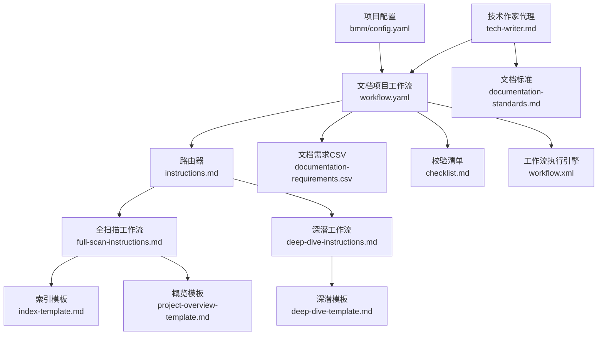
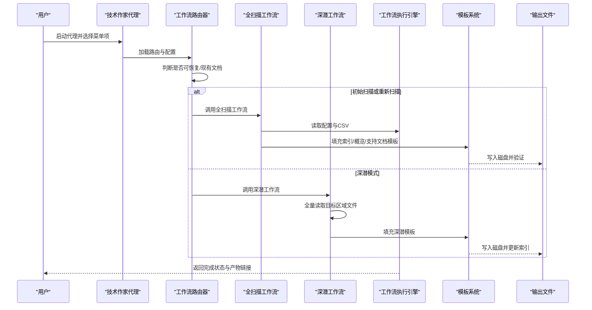
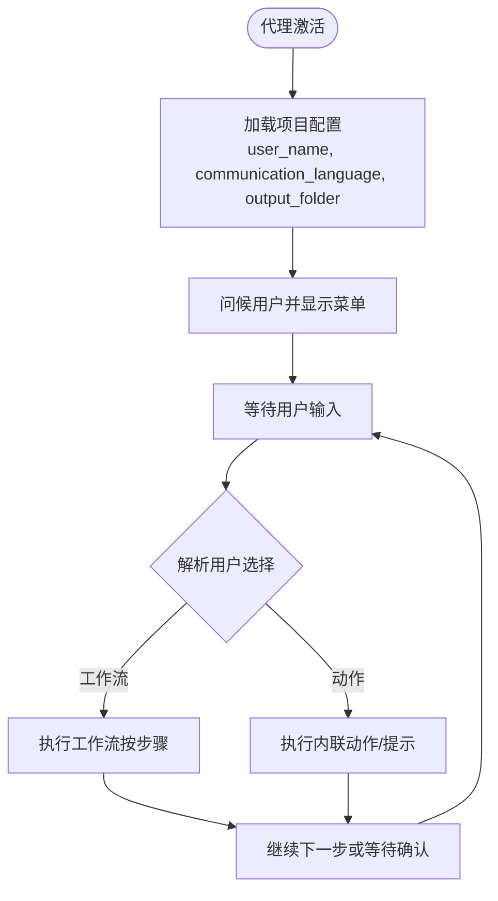
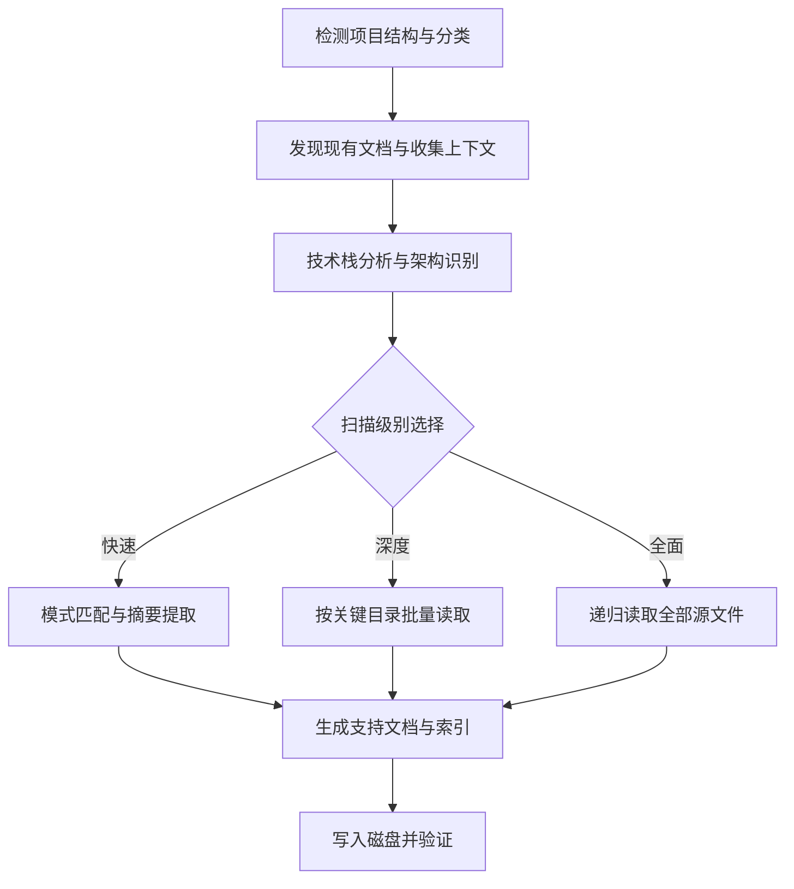
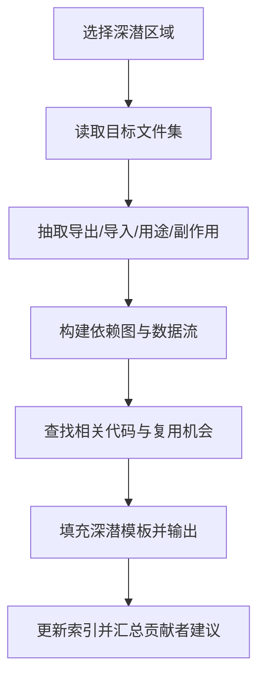
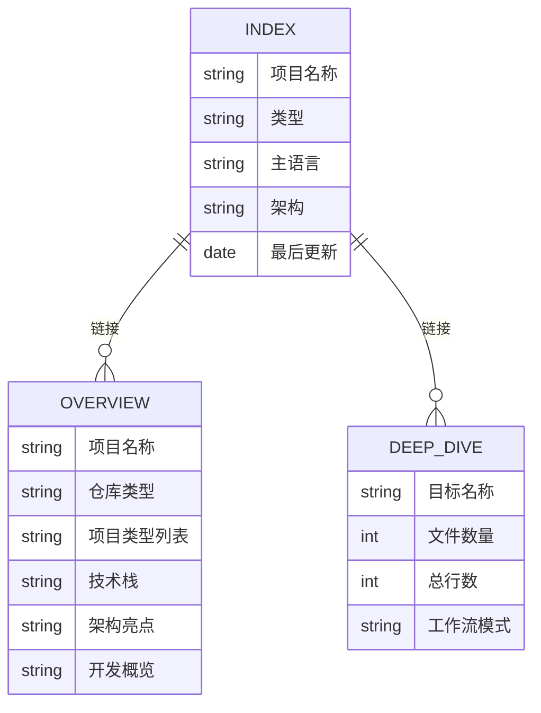
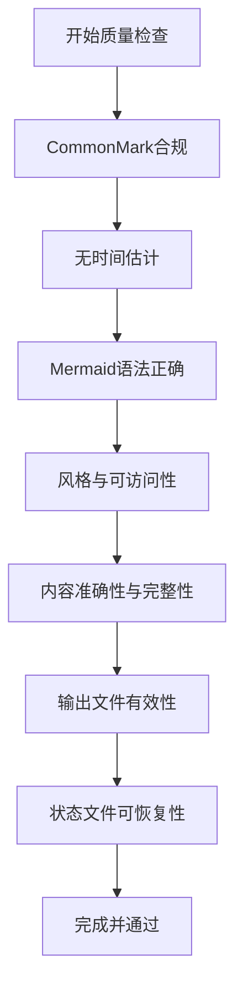
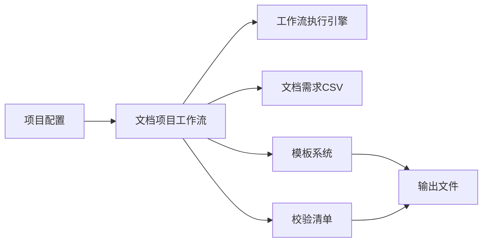

# 技术作家代理

<cite>
**本文引用的文件**
- [技术作家代理定义](file://_bmad/bmm/agents/tech-writer/tech-writer.md)
- [技术文档标准](file://_bmad/_memory/tech-writer-sidecar/documentation-standards.md)
- [项目配置](file://_bmad/bmm/config.yaml)
- [文档项目工作流配置](file://_bmad/bmm/workflows/document-project/workflow.yaml)
- [文档项目工作流路由器](file://_bmad/bmm/workflows/document-project/instructions.md)
- [全扫描工作流](file://_bmad/bmm/workflows/document-project/workflows/full-scan-instructions.md)
- [深潜工作流](file://_bmad/bmm/workflows/document-project/workflows/deep-dive-instructions.md)
- [深潜模板](file://_bmad/bmm/workflows/document-project/templates/deep-dive-template.md)
- [项目概览模板](file://_bmad/bmm/workflows/document-project/templates/project-overview-template.md)
- [索引模板](file://_bmad/bmm/workflows/document-project/templates/index-template.md)
- [文档需求CSV](file://_bmad/bmm/workflows/document-project/documentation-requirements.csv)
- [文档项目校验清单](file://_bmad/bmm/workflows/document-project/checklist.md)
- [工作流执行引擎](file://_bmad/core/tasks/workflow.xml)
- [示例项目文档](file://docs/README.md)
</cite>

## 目录
1. [简介](#简介)
2. [项目结构](#项目结构)
3. [核心组件](#核心组件)
4. [架构总览](#架构总览)
5. [详细组件分析](#详细组件分析)
6. [依赖关系分析](#依赖关系分析)
7. [性能考量](#性能考量)
8. [故障排除指南](#故障排除指南)
9. [结论](#结论)
10. [附录](#附录)

## 简介
本文件为技术作家代理（Technical Writer Agent）的综合技术文档，面向希望利用AI代理高效产出高质量技术文档的工程团队与个人作者。该代理专注于以下能力：
- 将复杂技术概念转化为清晰易懂的用户指南与架构说明
- 严格遵循CommonMark规范与BMAD文档标准，确保准确性与一致性
- 支持多种文档类型：架构文档、开发指南、API参考、用户手册、培训材料等
- 提供从“项目扫描”到“索引导航”的端到端文档生成流水线
- 支持Mermaid图表生成与审阅流程，提升可视化表达效果
- 提供多语言输出与本地化策略建议

## 项目结构
技术作家代理位于BMAD（Brainstorm-Mind-AI-Driven）框架内，采用模块化、工作流驱动的设计。关键结构包括：
- 代理定义：技术作家代理的角色、身份、沟通风格与菜单命令
- 侧车记忆：文档标准与最佳实践
- 工作流：文档项目（document-project）工作流及其子流程（全扫描、深潜）
- 模板：针对不同文档类型的模板（索引、概览、深潜）
- 执行引擎：通用工作流执行器，保障步骤顺序与输出质量
- 配置：项目级配置，决定输出语言、知识库路径、用户技能级别等

**图示来源**
- [技术作家代理定义:1-71](file://_bmad/bmm/agents/tech-writer/tech-writer.md#L1-L71)
- [文档项目工作流配置:1-23](file://_bmad/bmm/workflows/document-project/workflow.yaml#L1-L23)
- [文档项目工作流路由器:1-131](file://_bmad/bmm/workflows/document-project/instructions.md#L1-L131)
- [全扫描工作流:1-800](file://_bmad/bmm/workflows/document-project/workflows/full-scan-instructions.md#L1-L800)
- [深潜工作流:1-299](file://_bmad/bmm/workflows/document-project/workflows/deep-dive-instructions.md#L1-L299)
- [深潜模板:1-346](file://_bmad/bmm/workflows/document-project/templates/deep-dive-template.md#L1-L346)
- [项目概览模板:1-104](file://_bmad/bmm/workflows/document-project/templates/project-overview-template.md#L1-L104)
- [索引模板:1-170](file://_bmad/bmm/workflows/document-project/templates/index-template.md#L1-L170)
- [文档需求CSV:1-13](file://_bmad/bmm/workflows/document-project/documentation-requirements.csv#L1-L13)
- [文档项目校验清单:1-246](file://_bmad/bmm/workflows/document-project/checklist.md#L1-L246)
- [工作流执行引擎:1-235](file://_bmad/core/tasks/workflow.xml#L1-L235)
- [项目配置:1-17](file://_bmad/bmm/config.yaml#L1-L17)

**章节来源**
- [技术作家代理定义:1-71](file://_bmad/bmm/agents/tech-writer/tech-writer.md#L1-L71)
- [项目配置:1-17](file://_bmad/bmm/config.yaml#L1-L17)

## 核心组件
- 代理角色与能力
  - 角色：技术文档专家 + 知识整理者
  - 能力：文档撰写、Mermaid图表、标准合规、概念解释
  - 沟通风格：耐心教育式，善用类比，强调清晰度
- 文档标准与最佳实践
  - 严格遵守CommonMark规范
  - 禁止时间估计与容量估算
  - Mermaid语法与格式要求
  - 风格指南层次：项目特定 → BMAD约定 → Google开发者文档风格 → CommonMark
- 工作流引擎
  - 严格按步骤顺序执行
  - 模板输出后需用户确认或跳过
  - 支持“深潜模式”与“写在生成中”的架构
- 模板体系
  - 索引模板：主入口与导航
  - 项目概览模板：高层总结与快速参考
  - 深潜模板：特定区域的完整文件级分析

**章节来源**
- [技术作家代理定义:51-68](file://_bmad/bmm/agents/tech-writer/tech-writer.md#L51-L68)
- [技术文档标准:1-224](file://_bmad/_memory/tech-writer-sidecar/documentation-standards.md#L1-L224)
- [工作流执行引擎:19-104](file://_bmad/core/tasks/workflow.xml#L19-L104)

## 架构总览
技术作家代理通过“工作流路由 → 条件扫描 → 模板填充 → 输出校验”的闭环实现文档生成。其核心流程如下：

**图示来源**
- [文档项目工作流路由器:1-131](file://_bmad/bmm/workflows/document-project/instructions.md#L1-L131)
- [全扫描工作流:1-800](file://_bmad/bmm/workflows/document-project/workflows/full-scan-instructions.md#L1-L800)
- [深潜工作流:1-299](file://_bmad/bmm/workflows/document-project/workflows/deep-dive-instructions.md#L1-L299)
- [工作流执行引擎:1-235](file://_bmad/core/tasks/workflow.xml#L1-L235)

## 详细组件分析

### 代理菜单与交互流程
- 菜单项涵盖：聊天、文档生成、更新标准、Mermaid生成、文档审阅、概念解释、派对模式、退出
- 代理在激活时加载配置，读取项目配置并以指定语言进行沟通
- 严格遵循菜单处理器：根据类型（工作流/动作）执行相应指令

**图示来源**
- [技术作家代理定义:10-68](file://_bmad/bmm/agents/tech-writer/tech-writer.md#L10-L68)

**章节来源**
- [技术作家代理定义:58-68](file://_bmad/bmm/agents/tech-writer/tech-writer.md#L58-L68)

### 文档项目工作流（Brownfield扫描）
- 目标：对现有项目进行全面或增量的文档化，支持Brownfield PRD准备
- 模式：
  - 初始扫描：首次生成全套文档
  - 全部重扫：基于最新变更更新
  - 深潜模式：对特定区域进行文件级详尽分析
- 扫描级别：
  - 快速扫描：仅基于模式匹配，不读源码
  - 深度扫描：按项目类型的关键目录读取关键文件
  - 全面扫描：读取所有源文件（排除node_modules/dist/build等）

**图示来源**
- [文档项目工作流路由器:82-127](file://_bmad/bmm/workflows/document-project/instructions.md#L82-L127)
- [全扫描工作流:88-149](file://_bmad/bmm/workflows/document-project/workflows/full-scan-instructions.md#L88-L149)

**章节来源**
- [文档项目工作流配置:1-23](file://_bmad/bmm/workflows/document-project/workflow.yaml#L1-L23)
- [文档项目工作流路由器:1-131](file://_bmad/bmm/workflows/document-project/instructions.md#L1-L131)
- [全扫描工作流:1-800](file://_bmad/bmm/workflows/document-project/workflows/full-scan-instructions.md#L1-L800)

### 深潜工作流（文件级详析）
- 场景：需要对某个功能模块、API组或UI组件群进行深入理解
- 特点：
  - 对目标区域内每个文件进行逐行阅读
  - 提取导出、导入、用途、副作用、状态管理、错误处理、测试、TODO等信息
  - 生成依赖图、数据流、集成点、相关代码与复用机会
  - 填充深潜模板并更新索引

**图示来源**
- [深潜工作流:13-204](file://_bmad/bmm/workflows/document-project/workflows/deep-dive-instructions.md#L13-L204)
- [深潜模板:1-346](file://_bmad/bmm/workflows/document-project/templates/deep-dive-template.md#L1-L346)

**章节来源**
- [深潜工作流:1-299](file://_bmad/bmm/workflows/document-project/workflows/deep-dive-instructions.md#L1-L299)
- [深潜模板:1-346](file://_bmad/bmm/workflows/document-project/templates/deep-dive-template.md#L1-L346)

### 模板体系与文档类型
- 索引模板：主入口，提供项目概览、快速参考、已生成与现有文档链接、入门指引
- 项目概览模板：高层总结、技术栈、架构亮点、开发概览、仓库结构、文档地图
- 深潜模板：文件级清单、依赖图、数据流、集成点、测试分析、相关代码、实现建议

**图示来源**
- [索引模板:1-170](file://_bmad/bmm/workflows/document-project/templates/index-template.md#L1-L170)
- [项目概览模板:1-104](file://_bmad/bmm/workflows/document-project/templates/project-overview-template.md#L1-L104)
- [深潜模板:1-346](file://_bmad/bmm/workflows/document-project/templates/deep-dive-template.md#L1-L346)

**章节来源**
- [索引模板:1-170](file://_bmad/bmm/workflows/document-project/templates/index-template.md#L1-L170)
- [项目概览模板:1-104](file://_bmad/bmm/workflows/document-project/templates/project-overview-template.md#L1-L104)
- [深潜模板:1-346](file://_bmad/bmm/workflows/document-project/templates/deep-dive-template.md#L1-L346)

### 文档标准与质量控制
- CommonMark严格合规
- 禁止时间估计与容量估算
- Mermaid语法与格式要求
- 风格指南层次与可访问性要求
- 质量检查清单覆盖扫描级别、可恢复性、写在生成架构、项目检测、技术栈、扫描完整性、架构文档质量、开发与运维文档、多部件项目、索引与导航、文件完整性、内容质量、Brownfield就绪性、输出验证、最终验证、状态文件质量、完成条件等

**图示来源**
- [技术文档标准:1-224](file://_bmad/_memory/tech-writer-sidecar/documentation-standards.md#L1-L224)
- [文档项目校验清单:1-246](file://_bmad/bmm/workflows/document-project/checklist.md#L1-L246)

**章节来源**
- [技术文档标准:1-224](file://_bmad/_memory/tech-writer-sidecar/documentation-standards.md#L1-L224)
- [文档项目校验清单:1-246](file://_bmad/bmm/workflows/document-project/checklist.md#L1-L246)

### 多语言与本地化策略
- 代理在激活时读取项目配置中的通信语言与文档输出语言，并始终以该语言进行沟通与输出
- 本地化建议：
  - 使用前端i18n目录与消息文件作为参考，确保术语一致
  - 在文档中提供多语言资源清单与翻译路径
  - 保持Mermaid图表与代码示例的跨语言可读性

**章节来源**
- [技术作家代理定义:13-16](file://_bmad/bmm/agents/tech-writer/tech-writer.md#L13-L16)
- [项目配置:13-16](file://_bmad/bmm/config.yaml#L13-L16)

## 依赖关系分析
- 代理依赖于项目配置与工作流执行引擎
- 工作流依赖于文档需求CSV进行项目类型检测与文档需求推断
- 模板系统依赖于工作流生成的数据变量
- 校验清单贯穿全扫描与深潜流程，确保质量与完整性

**图示来源**
- [项目配置:1-17](file://_bmad/bmm/config.yaml#L1-L17)
- [文档项目工作流配置:1-23](file://_bmad/bmm/workflows/document-project/workflow.yaml#L1-L23)
- [工作流执行引擎:1-235](file://_bmad/core/tasks/workflow.xml#L1-L235)
- [文档需求CSV:1-13](file://_bmad/bmm/workflows/document-project/documentation-requirements.csv#L1-L13)
- [文档项目校验清单:1-246](file://_bmad/bmm/workflows/document-project/checklist.md#L1-L246)

**章节来源**
- [文档项目工作流配置:1-23](file://_bmad/bmm/workflows/document-project/workflow.yaml#L1-L23)
- [文档需求CSV:1-13](file://_bmad/bmm/workflows/document-project/documentation-requirements.csv#L1-L13)
- [工作流执行引擎:1-235](file://_bmad/core/tasks/workflow.xml#L1-L235)

## 性能考量
- 批处理策略：深度与全面扫描按子目录批处理，避免内存压力
- 写在生成架构：每生成一段即落盘并验证，减少上下文占用
- 智能缓存：状态文件记录已完成步骤与摘要，支持中断恢复
- 模式匹配优先：快速扫描阶段尽量使用模式匹配，降低IO开销

## 故障排除指南
- 无法加载配置：确认项目配置路径与字段存在
- 工作流未按步骤执行：检查工作流执行引擎的步骤顺序与模板输出标签
- 模板变量缺失：核对工作流路由与模板变量映射
- 输出链接失效：使用校验清单中的“输出验证”项逐项排查
- 深潜扫描异常：确认目标路径与文件权限，必要时切换为全面扫描

**章节来源**
- [工作流执行引擎:19-104](file://_bmad/core/tasks/workflow.xml#L19-L104)
- [文档项目校验清单:156-246](file://_bmad/bmm/workflows/document-project/checklist.md#L156-L246)

## 结论
技术作家代理通过标准化、可恢复、可扩展的工作流，将复杂的代码库转化为结构化、可检索、可维护的技术文档。其优势在于：
- 严格的CommonMark与风格标准，确保文档质量
- 多层次扫描与模板体系，覆盖从高层概览到文件级详析
- 可视化与可读性优先，辅以Mermaid图表与清晰结构
- 支持多语言与本地化，满足国际化团队协作

## 附录
- 示例项目文档入口：[示例项目文档:1-56](file://docs/README.md#L1-L56)
- 代理菜单命令参考：见“代理菜单与交互流程”
- 文档类型快速参考：见“模板体系与文档类型”