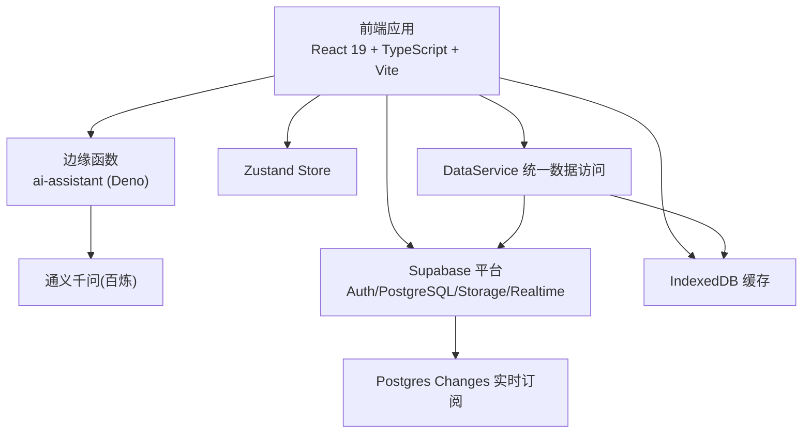
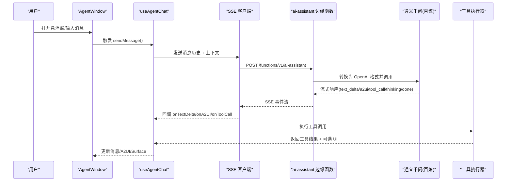
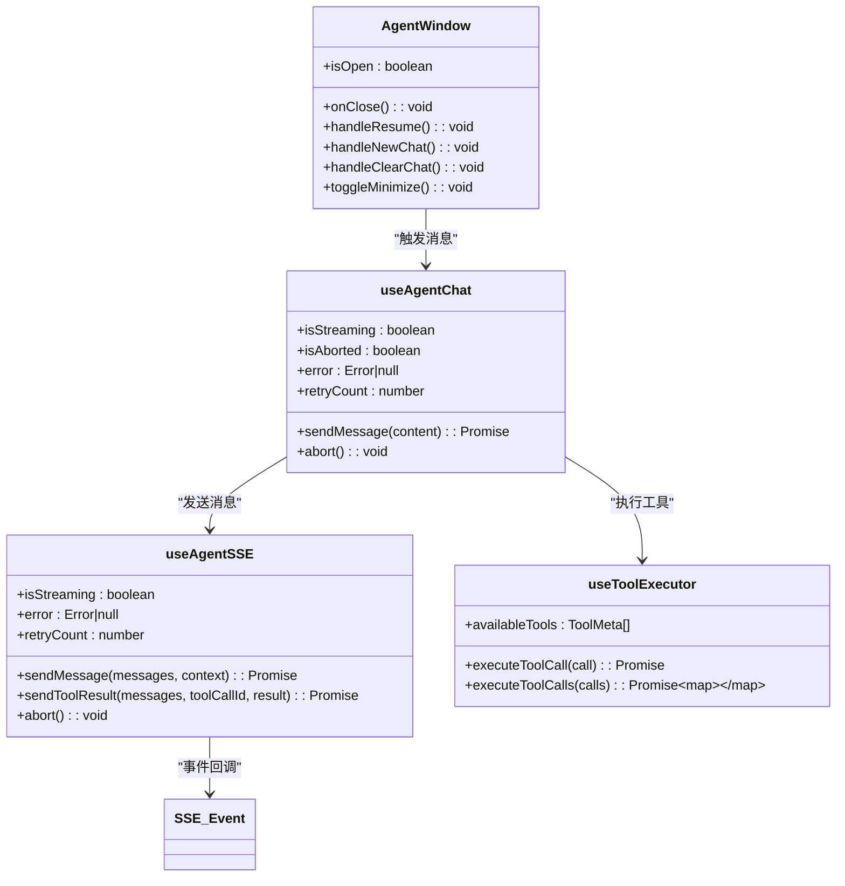
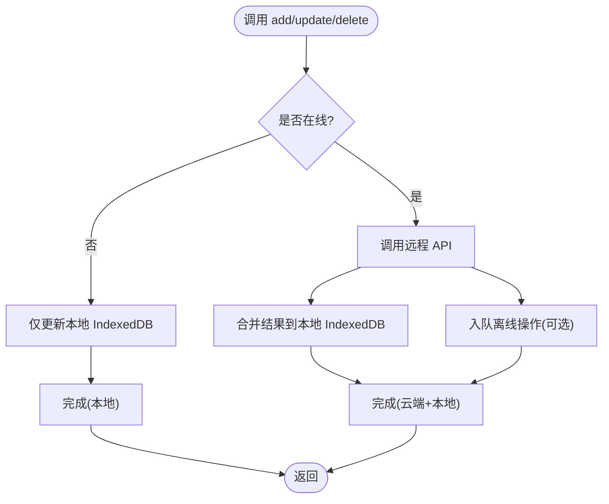
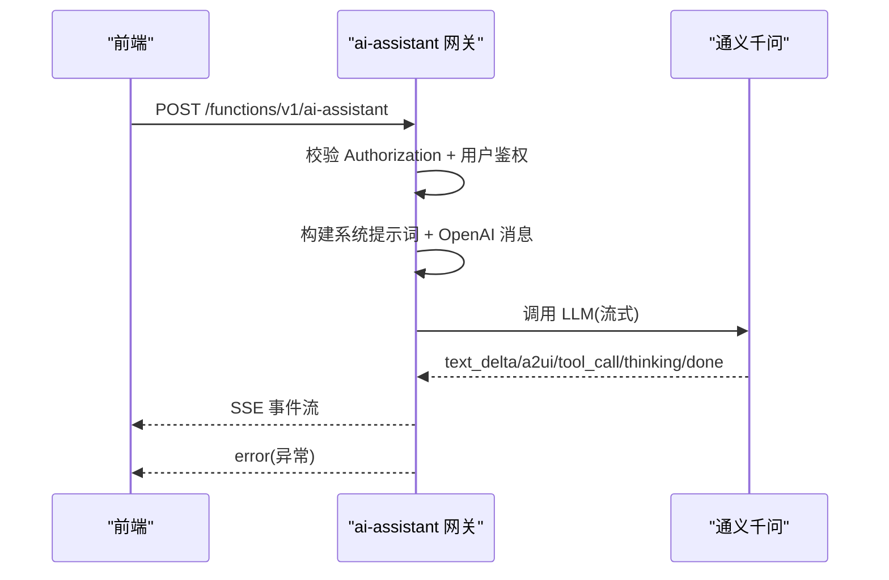
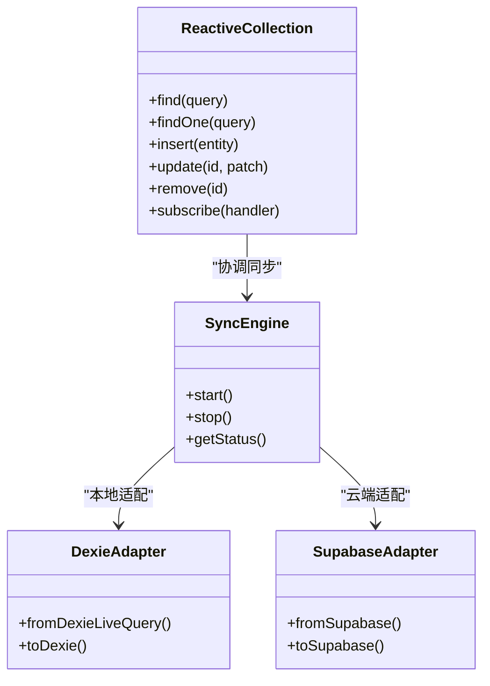
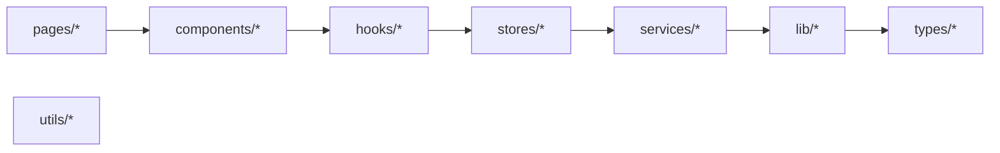

# 解决方案架构师代理

<cite>
**本文引用的文件**
- [README.md](file://README.md)
- [docs/Architecture.md](file://docs/Architecture.md)
- [docs/CONVENTIONS.md](file://docs/CONVENTIONS.md)
- [app/package.json](file://app/package.json)
- [app/src/lib/utils.ts](file://app/src/lib/utils.ts)
- [app/src/lib/agent/index.ts](file://app/src/lib/agent/index.ts)
- [app/src/services/data/DataService.ts](file://app/src/services/data/DataService.ts)
- [app/src/stores/useAgentStore.ts](file://app/src/stores/useAgentStore.ts)
- [app/src/components/agent/AgentWindow.tsx](file://app/src/components/agent/AgentWindow.tsx)
- [app/supabase/functions/ai-assistant/index.ts](file://app/supabase/functions/ai-assistant/index.ts)
- [app/src/test/architecture.test.ts](file://app/src/test/architecture.test.ts)
- [app/src/lib/reactive/index.ts](file://app/src/lib/reactive/index.ts)
- [app/src/hooks/useAgentChat.ts](file://app/src/hooks/useAgentChat.ts)
- [app/src/lib/agent/sseClient.ts](file://app/src/lib/agent/sseClient.ts)
- [app/src/lib/agent/toolExecutor.ts](file://app/src/lib/agent/toolExecutor.ts)
</cite>

## 目录
1. [简介](#简介)
2. [项目结构](#项目结构)
3. [核心组件](#核心组件)
4. [架构总览](#架构总览)
5. [详细组件分析](#详细组件分析)
6. [依赖关系分析](#依赖关系分析)
7. [性能考量](#性能考量)
8. [故障排查指南](#故障排查指南)
9. [结论](#结论)
10. [附录](#附录)

## 简介
本文件面向“解决方案架构师代理”，系统化阐述该代理在本项目中的专业能力与架构实践，涵盖系统设计、技术选型、架构决策与复杂问题解决。重点说明代理如何运用架构模式、设计原则与最佳实践构建可扩展、高性能的系统；如何在不同项目规模与复杂度下进行适配（微服务、分布式与云原生思路）；如何进行架构评估与优化，平衡性能、可维护性与成本；并通过具体案例展示从需求分析到技术实现的完整流程。同时，阐明代理与开发团队、产品经理及其他利益相关者的协作方式。

## 项目结构
项目采用“前端 + 后端边缘函数 + 文档”的三层结构，前端基于 React 19 + TypeScript + Vite，后端采用 Supabase Edge Functions 提供 AI 助手网关，结合本地 IndexedDB 与 Supabase Realtime 实现“缓存 + 实时”数据同步。编码规范与架构约束通过文档与自动化测试共同保障。

图表来源
- [docs/Architecture.md:22-39](file://docs/Architecture.md#L22-L39)
- [docs/Architecture.md:160-196](file://docs/Architecture.md#L160-L196)
- [app/package.json:48-84](file://app/package.json#L48-L84)

章节来源
- [README.md:114-144](file://README.md#L114-L144)
- [docs/Architecture.md:160-196](file://docs/Architecture.md#L160-L196)

## 核心组件
- 认证系统：基于 Supabase Auth，提供 JWT 管理与路由守卫。
- 组织架构：多层级组织结构与角色权限管理，配合 RLS 策略。
- Agent Studio：A2UI 动态 UI 协议 + SSE 流式交互 + 工具执行器。
- 数据同步层：DataService 统一抽象，实现“缓存 + 实时”双通道。
- 响应式数据层：ReactiveCollection/SyncEngine 抽象，适配本地与云端。
- 边缘函数：ai-assistant 作为 Agent 网关，负责认证、消息转换与流式输出。

章节来源
- [docs/Architecture.md:43-107](file://docs/Architecture.md#L43-L107)
- [docs/Architecture.md:109-158](file://docs/Architecture.md#L109-L158)
- [docs/Architecture.md:231-240](file://docs/Architecture.md#L231-L240)

## 架构总览
系统采用“前端 + 边缘函数 + LLM + Supabase”的云原生架构。前端通过 SSE 与边缘函数交互，边缘函数经由百炼 API 调用通义千问，同时将工具调用结果回传前端，前端通过 A2UI 协议渲染动态界面。数据层通过 IndexedDB 与 Supabase Realtime 实现“缓存 + 实时”双通道，确保离线可用与强一致。

图表来源
- [app/src/components/agent/AgentWindow.tsx:36-242](file://app/src/components/agent/AgentWindow.tsx#L36-L242)
- [app/src/hooks/useAgentChat.ts:47-377](file://app/src/hooks/useAgentChat.ts#L47-L377)
- [app/src/lib/agent/sseClient.ts:246-481](file://app/src/lib/agent/sseClient.ts#L246-L481)
- [app/supabase/functions/ai-assistant/index.ts:22-113](file://app/supabase/functions/ai-assistant/index.ts#L22-L113)
- [app/src/lib/agent/toolExecutor.ts:39-67](file://app/src/lib/agent/toolExecutor.ts#L39-L67)

章节来源
- [docs/Architecture.md:95-107](file://docs/Architecture.md#L95-L107)

## 详细组件分析

### 组件一：Agent Studio（A2UI + SSE + 工具）
- AgentWindow：可拖拽、可最小化的悬浮对话框，负责会话恢复、清空与窗口切换。
- useAgentChat：整合 SSE、工具执行器与状态管理，提供 H2A 异步转向（中断）能力。
- SSE 客户端：解析 SSE 事件、自动重试、中止控制。
- 工具执行器：按名称执行工具，支持导航回调与批量执行。
- A2UI 消息处理：根据 renderTarget 将组件渲染到 inline、main-area、fullscreen 或 split。

图表来源
- [app/src/components/agent/AgentWindow.tsx:36-242](file://app/src/components/agent/AgentWindow.tsx#L36-L242)
- [app/src/hooks/useAgentChat.ts:47-377](file://app/src/hooks/useAgentChat.ts#L47-L377)
- [app/src/lib/agent/sseClient.ts:246-481](file://app/src/lib/agent/sseClient.ts#L246-L481)
- [app/src/lib/agent/toolExecutor.ts:39-67](file://app/src/lib/agent/toolExecutor.ts#L39-L67)

章节来源
- [app/src/components/agent/AgentWindow.tsx:18-242](file://app/src/components/agent/AgentWindow.tsx#L18-L242)
- [app/src/hooks/useAgentChat.ts:47-377](file://app/src/hooks/useAgentChat.ts#L47-L377)
- [app/src/lib/agent/sseClient.ts:246-481](file://app/src/lib/agent/sseClient.ts#L246-L481)
- [app/src/lib/agent/toolExecutor.ts:39-67](file://app/src/lib/agent/toolExecutor.ts#L39-L67)

### 组件二：数据同步层（DataService）
- 设计原则：读本地、写云端、实时同步；离线队列与冲突解决。
- 核心能力：初始同步、增量同步、强制全量同步、队列处理、冲突统计。
- 网络监听：在线自动处理离线队列；离线时写入本地并排队。

图表来源
- [app/src/services/data/DataService.ts:335-414](file://app/src/services/data/DataService.ts#L335-L414)

章节来源
- [app/src/services/data/DataService.ts:71-419](file://app/src/services/data/DataService.ts#L71-L419)

### 组件三：边缘函数（ai-assistant）
- 职责：鉴权、消息格式转换、系统提示词构建、SSE 写入、错误处理。
- 交互：接收前端消息历史与上下文，调用 LLM，流式返回事件，支持工具调用结果回传。

图表来源
- [app/supabase/functions/ai-assistant/index.ts:22-113](file://app/supabase/functions/ai-assistant/index.ts#L22-L113)

章节来源
- [app/supabase/functions/ai-assistant/index.ts:1-116](file://app/supabase/functions/ai-assistant/index.ts#L1-L116)

### 组件四：响应式数据层（ReactiveCollection）
- 职责：统一本地与云端适配器、查询/变更钩子、同步状态管理。
- 价值：屏蔽本地 IndexedDB 与云端 Supabase 的差异，提供一致的响应式 API。

图表来源
- [app/src/lib/reactive/index.ts:5-22](file://app/src/lib/reactive/index.ts#L5-L22)

章节来源
- [app/src/lib/reactive/index.ts:1-22](file://app/src/lib/reactive/index.ts#L1-L22)

## 依赖关系分析
- 分层依赖方向：pages → components → hooks → stores → services → lib → types/utils，禁止逆向导入。
- 禁止直接使用 Supabase client：必须通过 DataService 统一入口。
- 文件体积限制：源文件不超过 500 行（测试文件除外），超大文件需拆分。
- Tailwind v4 合规：禁止使用 v2/v3 透明度与渐变语法。
- 循环依赖检测：services/lib 不应导入 pages/components；stores 文件间避免互相导入。

图表来源
- [docs/CONVENTIONS.md:49-59](file://docs/CONVENTIONS.md#L49-L59)

章节来源
- [docs/CONVENTIONS.md:1-107](file://docs/CONVENTIONS.md#L1-L107)
- [app/src/test/architecture.test.ts:42-374](file://app/src/test/architecture.test.ts#L42-L374)

## 性能考量
- 读写分离与缓存命中：读操作 100% 本地命中，写操作乐观更新，降低网络往返。
- 实时同步：Supabase Realtime 订阅，减少轮询与长连接开销。
- SSE 流式传输：边生成边渲染，降低首屏等待时间。
- 自动重试与指数退避：在网络抖动场景提升稳定性。
- 离线队列：在网络恢复后自动处理，保证一致性与用户体验。
- Tailwind v4 语法：减少样式计算复杂度，提升渲染性能。

## 故障排查指南
- 浏览器白屏/ERR_NAME_NOT_RESOLVED：清理浏览器站点数据，移除过期 Token。
- WebSocket 连接警告：MSW 模式下 Realtime 无对应 Handler 属预期，不影响功能。
- npm install 失败(ECONNRESET)：删除 package-lock.json 后重试，指定镜像源。
- SSE 连接中断：检查 Authorization 头、Supabase URL/Key 配置与网络连通性。
- 工具执行失败：确认工具名称与参数，查看工具注册表与执行器日志。
- 数据不一致：触发强制全量同步或检查冲突统计与队列状态。

章节来源
- [README.md:83-112](file://README.md#L83-L112)

## 结论
本项目通过“前端 + 边缘函数 + LLM + Supabase”的云原生架构，结合“缓存 + 实时”的数据同步策略与严格的架构约束，实现了可扩展、高性能、易维护的 AI 助手平台。架构师代理在此基础上，能够快速评估与优化系统，平衡性能、可维护性与成本，并在不同规模与复杂度的项目中提供一致的设计思路与落地方法。

## 附录

### 附录A：架构设计案例（从需求到实现）
- 需求分析：明确 AI 助手的对话能力、A2UI 动态渲染、工具调用与导航、离线可用性。
- 技术选型：React 19 + TypeScript + Vite（前端工程化）、Supabase（认证/数据库/实时）、Edge Functions（AI 网关）、通义千问（百炼 API）。
- 架构决策：采用 SSE 流式交互、A2UI 动态协议、IndexedDB + Supabase Realtime 的“缓存 + 实时”双通道。
- 实现路径：AgentWindow + useAgentChat + SSE 客户端 + 工具执行器 + 边缘函数 + DataService。
- 验收标准：端到端 E2E 测试、架构约束测试、覆盖率与构建质量门禁。

章节来源
- [docs/Architecture.md:1-282](file://docs/Architecture.md#L1-L282)
- [app/src/test/architecture.test.ts:1-374](file://app/src/test/architecture.test.ts#L1-L374)

### 附录B：协作方式
- 与开发团队：通过 BMAD 方法论与工作流，明确步骤、评审与验证；使用统一的类型、工具与测试规范。
- 与产品经理：基于 PRD/EPICS/STORIES 的规划与排期，通过 UX 设计与原型迭代对齐需求。
- 与 QA：端到端测试与架构约束测试并行，确保质量门槛。
- 与利益相关者：以文档与可视化图表呈现架构演进与收益，持续反馈与优化。

章节来源
- [docs/Architecture.md:195-198](file://docs/Architecture.md#L195-L198)