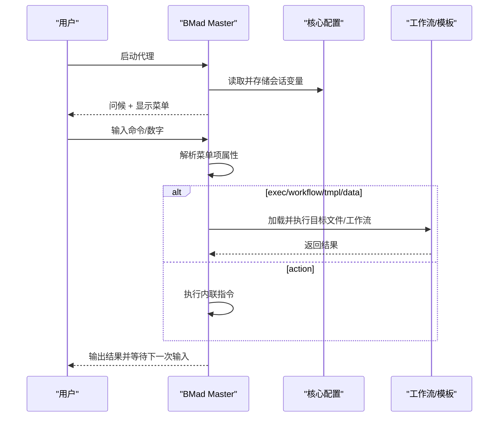
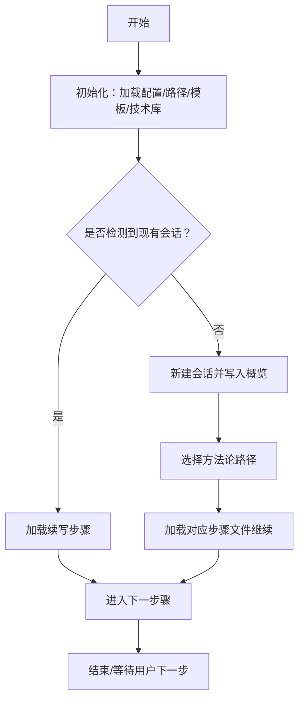
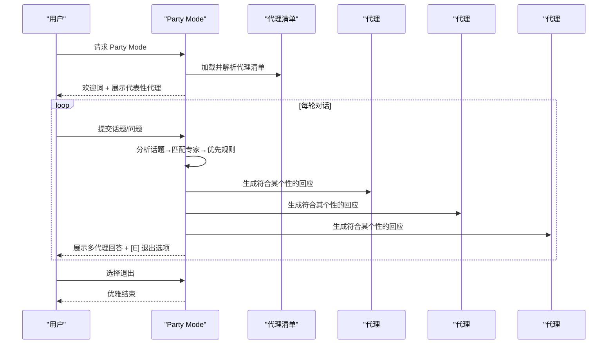
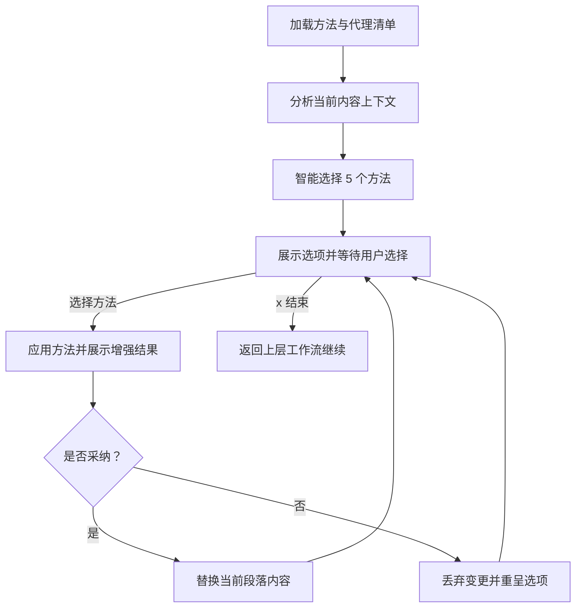
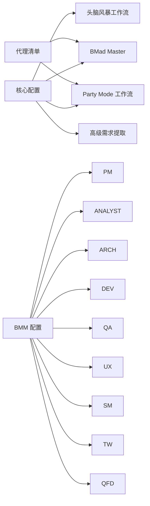

# BMA 核心代理

<cite>
**本文引用的文件**
- [bmad-master.md](file://_bmad/core/agents/bmad-master.md)
- [workflow.md（头脑风暴）](file://_bmad/core/workflows/brainstorming/workflow.md)
- [step-01-session-setup.md](file://_bmad/core/workflows/brainstorming/steps/step-01-session-setup.md)
- [workflow.md（Party Mode）](file://_bmad/core/workflows/party-mode/workflow.md)
- [step-02-discussion-orchestration.md](file://_bmad/core/workflows/party-mode/steps/step-02-discussion-orchestration.md)
- [workflow.xml（高级需求提取）](file://_bmad/core/workflows/advanced-elicitation/workflow.xml)
- [analyst.md](file://_bmad/bmm/agents/analyst.md)
- [architect.md](file://_bmad/bmm/agents/architect.md)
- [dev.md](file://_bmad/bmm/agents/dev.md)
- [pm.md](file://_bmad/bmm/agents/pm.md)
- [qa.md](file://_bmad/bmm/agents/qa.md)
- [ux-designer.md](file://_bmad/bmm/agents/ux-designer.md)
- [sm.md](file://_bmad/bmm/agents/sm.md)
- [tech-writer.md](file://_bmad/bmm/agents/tech-writer/tech-writer.md)
- [quick-flow-solo-dev.md](file://_bmad/bmm/agents/quick-flow-solo-dev.md)
- [config.yaml（核心）](file://_bmad/core/config.yaml)
- [config.yaml（BMM 模块）](file://_bmad/bmm/config.yaml)
- [agent-manifest.csv](file://_bmad/_config/agent-manifest.csv)
</cite>

## 目录
1. [引言](#引言)
2. [项目结构](#项目结构)
3. [核心组件](#核心组件)
4. [架构总览](#架构总览)
5. [详细组件分析](#详细组件分析)
6. [依赖关系分析](#依赖关系分析)
7. [性能考量](#性能考量)
8. [故障排查指南](#故障排查指南)
9. [结论](#结论)
10. [附录](#附录)

## 引言
本文件系统性梳理 BMA 核心代理系统，聚焦“BMad Master”作为知识守护者与工作流编排器的角色定位，覆盖项目统筹、决策支持与创意激发等核心能力。文档同时详解各专业代理（分析师、架构师、开发者、产品经理、QA 工程师、技术作家、UX 设计师、Scrum Master、快速开发代理）的职责边界与典型使用场景，并深入阐述“头脑风暴工作流”“Party Mode 协作模式”“高级需求提取”三大核心流程。最后提供代理协作模式、任务分配策略与效率优化建议，帮助读者在不同项目阶段选择合适的代理组合并高效完成复杂任务。

## 项目结构
BMA 系统以“模块化代理 + 工作流编排”的方式组织，核心由三部分构成：
- 核心层：定义全局配置、核心代理与通用工作流（如头脑风暴、Party Mode、高级需求提取）
- BMM 模块：面向产品管理与工程交付的专业代理与工作流（PRD、UX、架构、实现、测试等）
- BMB 模块：面向代理与模块构建的工作流与规范（用于扩展与治理）

下图给出与本文相关的文件级结构映射：

```mermaid
graph TB
subgraph "核心层"
CORE_CFG["_bmad/core/config.yaml"]
MASTER["_bmad/core/agents/bmad-master.md"]
BRAINSTORM["_bmad/core/workflows/brainstorming/workflow.md"]
PARTY["_bmad/core/workflows/party-mode/workflow.md"]
ELICIT["_bmad/core/workflows/advanced-elicitation/workflow.xml"]
end
subgraph "BMM 模块"
BMM_CFG["_bmad/bmm/config.yaml"]
AG_MAN["_bmad/_config/agent-manifest.csv"]
PM["_bmad/bmm/agents/pm.md"]
ANALYST["_bmad/bmm/agents/analyst.md"]
ARCH["_bmad/bmm/agents/architect.md"]
DEV["_bmad/bmm/agents/dev.md"]
QA["_bmad/bmm/agents/qa.md"]
UX["_bmad/bmm/agents/ux-designer.md"]
SM["_bmad/bmm/agents/sm.md"]
TW["_bmad/bmm/agents/tech-writer/tech-writer.md"]
QFD["_bmad/bmm/agents/quick-flow-solo-dev.md"]
end
CORE_CFG --> MASTER
CORE_CFG --> BRAINSTORM
CORE_CFG --> PARTY
CORE_CFG --> ELICIT
BMM_CFG --> PM
BMM_CFG --> ANALYST
BMM_CFG --> ARCH
BMM_CFG --> DEV
BMM_CFG --> QA
BMM_CFG --> UX
BMM_CFG --> SM
BMM_CFG --> TW
BMM_CFG --> QFD
AG_MAN --> MASTER
AG_MAN --> PM
AG_MAN --> ANALYST
AG_MAN --> ARCH
AG_MAN --> DEV
AG_MAN --> QA
AG_MAN --> UX
AG_MAN --> SM
AG_MAN --> TW
AG_MAN --> QFD
```

图表来源
- [bmad-master.md:1-57](file://_bmad/core/agents/bmad-master.md#L1-L57)
- [workflow.md（头脑风暴）:1-59](file://_bmad/core/workflows/brainstorming/workflow.md#L1-L59)
- [workflow.md（Party Mode）:1-195](file://_bmad/core/workflows/party-mode/workflow.md#L1-L195)
- [workflow.xml（高级需求提取）:1-118](file://_bmad/core/workflows/advanced-elicitation/workflow.xml#L1-L118)
- [config.yaml（核心）:1-10](file://_bmad/core/config.yaml#L1-L10)
- [config.yaml（BMM 模块）:1-17](file://_bmad/bmm/config.yaml#L1-L17)
- [agent-manifest.csv:1-15](file://_bmad/_config/agent-manifest.csv#L1-L15)

章节来源
- [bmad-master.md:1-57](file://_bmad/core/agents/bmad-master.md#L1-L57)
- [workflow.md（头脑风暴）:1-59](file://_bmad/core/workflows/brainstorming/workflow.md#L1-L59)
- [workflow.md（Party Mode）:1-195](file://_bmad/core/workflows/party-mode/workflow.md#L1-L195)
- [workflow.xml（高级需求提取）:1-118](file://_bmad/core/workflows/advanced-elicitation/workflow.xml#L1-L118)
- [config.yaml（核心）:1-10](file://_bmad/core/config.yaml#L1-L10)
- [config.yaml（BMM 模块）:1-17](file://_bmad/bmm/config.yaml#L1-L17)
- [agent-manifest.csv:1-15](file://_bmad/_config/agent-manifest.csv#L1-L15)

## 核心组件
- BMad Master 核心代理
  - 角色：执行引擎、知识守护者、工作流编排者
  - 能力：运行时资源管理、工作流编排、任务执行、菜单驱动交互
  - 关键行为：加载配置、显示菜单、处理用户输入、路由到具体工作流或命令
- 头脑风暴工作流
  - 目标：通过多样化创造性技术与思维方法，引导用户进行高产的发散式创意探索
  - 特点：微文件架构、按步推进、状态追踪、按需加载技术库
- Party Mode 协作模式
  - 目标：在所有已安装代理之间组织自然的多智能体对话
  - 特点：基于清单的代理罗列、上下文合并的人格、智能选角与跨代理互动
- 高级需求提取
  - 目标：推动模型重新审视、提炼与改进近期输出
  - 特点：方法注册表、上下文分析、智能选择、可迭代增强

章节来源
- [bmad-master.md:8-56](file://_bmad/core/agents/bmad-master.md#L8-L56)
- [workflow.md（头脑风暴）:1-59](file://_bmad/core/workflows/brainstorming/workflow.md#L1-L59)
- [workflow.md（Party Mode）:1-195](file://_bmad/core/workflows/party-mode/workflow.md#L1-L195)
- [workflow.xml（高级需求提取）:1-118](file://_bmad/core/workflows/advanced-elicitation/workflow.xml#L1-L118)

## 架构总览
下图展示 BMad Master 作为中枢，连接核心工作流与 BMM 专业代理的交互关系，体现“菜单驱动 + 工作流编排”的总体架构。

```mermaid
graph TB
BMAD_MASTER["BMad Master<br/>核心代理"]
CFG_CORE["_bmad/core/config.yaml<br/>核心配置"]
CFG_BMM["_bmad/bmm/config.yaml<br/>BMM 配置"]
BRAINSTORM["头脑风暴工作流<br/>workflow.md"]
PARTY_MODE["Party Mode 工作流<br/>workflow.md"]
ADV_ELI["高级需求提取<br/>workflow.xml"]
PM["产品经理代理<br/>pm.md"]
ANALYST["分析师代理<br/>analyst.md"]
ARCH["架构师代理<br/>architect.md"]
DEV["开发者代理<br/>dev.md"]
QA["QA 工程师代理<br/>qa.md"]
UX["UX 设计师代理<br/>ux-designer.md"]
SM["Scrum Master 代理<br/>sm.md"]
TW["技术作家代理<br/>tech-writer.md"]
QFD["快速开发代理<br/>quick-flow-solo-dev.md"]
BMAD_MASTER --> CFG_CORE
BMAD_MASTER --> BRAINSTORM
BMAD_MASTER --> PARTY_MODE
BMAD_MASTER --> ADV_ELI
BMAD_MASTER --> PM
BMAD_MASTER --> ANALYST
BMAD_MASTER --> ARCH
BMAD_MASTER --> DEV
BMAD_MASTER --> QA
BMAD_MASTER --> UX
BMAD_MASTER --> SM
BMAD_MASTER --> TW
BMAD_MASTER --> QFD
CFG_BMM --> PM
CFG_BMM --> ANALYST
CFG_BMM --> ARCH
CFG_BMM --> DEV
CFG_BMM --> QA
CFG_BMM --> UX
CFG_BMM --> SM
CFG_BMM --> TW
CFG_BMM --> QFD
```

图表来源
- [bmad-master.md:1-57](file://_bmad/core/agents/bmad-master.md#L1-L57)
- [workflow.md（头脑风暴）:1-59](file://_bmad/core/workflows/brainstorming/workflow.md#L1-L59)
- [workflow.md（Party Mode）:1-195](file://_bmad/core/workflows/party-mode/workflow.md#L1-L195)
- [workflow.xml（高级需求提取）:1-118](file://_bmad/core/workflows/advanced-elicitation/workflow.xml#L1-L118)
- [config.yaml（核心）:1-10](file://_bmad/core/config.yaml#L1-L10)
- [config.yaml（BMM 模块）:1-17](file://_bmad/bmm/config.yaml#L1-L17)
- [pm.md:1-73](file://_bmad/bmm/agents/pm.md#L1-L73)
- [analyst.md:1-79](file://_bmad/bmm/agents/analyst.md#L1-L79)
- [architect.md:1-59](file://_bmad/bmm/agents/architect.md#L1-L59)
- [dev.md:1-70](file://_bmad/bmm/agents/dev.md#L1-L70)
- [qa.md:1-93](file://_bmad/bmm/agents/qa.md#L1-L93)
- [ux-designer.md:1-58](file://_bmad/bmm/agents/ux-designer.md#L1-L58)
- [sm.md:1-71](file://_bmad/bmm/agents/sm.md#L1-L71)
- [tech-writer.md:1-71](file://_bmad/bmm/agents/tech-writer/tech-writer.md#L1-L71)
- [quick-flow-solo-dev.md:1-70](file://_bmad/bmm/agents/quick-flow-solo-dev.md#L1-L70)

## 详细组件分析

### 组件一：BMad Master 核心代理
- 身份与原则
  - 执行者、专家、指导者；强调直接高效、系统化呈现与即时命令响应
  - 运行时加载资源、从不预加载、始终提供编号列表供选择
- 启动流程
  - 加载自身 XML 人设
  - 读取核心配置（用户名称、通信语言、输出目录），校验后存为会话变量
  - 问候用户并展示菜单项
  - 等待用户输入，支持数字选择、模糊匹配与指令触发
  - 根据菜单项属性（exec/workflow/tmpl/data/action/validate-workflow）调用对应处理器
- 菜单与工作流
  - 列出可用任务与工作流
  - 支持 Party Mode 启动
  - 提供帮助与退出

图表来源
- [bmad-master.md:8-56](file://_bmad/core/agents/bmad-master.md#L8-L56)

章节来源
- [bmad-master.md:8-56](file://_bmad/core/agents/bmad-master.md#L8-L56)
- [config.yaml（核心）:6-10](file://_bmad/core/config.yaml#L6-L10)

### 组件二：头脑风暴工作流
- 目标与角色
  - 引导用户进行高产创意探索，保持“略感不适”的发散状态，避免过早收敛
  - 抗偏见协议：每约 10 个想法切换一次创意域（技术→体验→商业→极端场景）
  - 数量目标：至少产出 100+ 想法再组织
- 架构与执行
  - 微文件架构：步骤即文件，顺序推进，用户在每步控制进度
  - 初始化：加载核心配置，解析路径，准备模板与技术库，生成默认输出文件
  - 步骤一：会话设置与续写检测，收集主题与目标，选择方法论路径
  - 步骤二及后续：按所选路径加载相应子步骤，持续推进

图表来源
- [workflow.md（头脑风暴）:1-59](file://_bmad/core/workflows/brainstorming/workflow.md#L1-L59)
- [step-01-session-setup.md:1-198](file://_bmad/core/workflows/brainstorming/steps/step-01-session-setup.md#L1-L198)

章节来源
- [workflow.md（头脑风暴）:1-59](file://_bmad/core/workflows/brainstorming/workflow.md#L1-L59)
- [step-01-session-setup.md:1-198](file://_bmad/core/workflows/brainstorming/steps/step-01-session-setup.md#L1-L198)

### 组件三：Party Mode 协作模式
- 目标与角色
  - 在所有已安装代理之间组织自然的多智能体对话，维持各自个性与专长
  - 基于代理清单构建完整代理名单，合并人格数据以保持一致性
- 执行流程
  - 初始化：加载核心配置与代理清单，构建代理罗列
  - 会话激活：欢迎词 + 展示代表性代理，开启讨论
  - 智能选角：根据话题领域、复杂度、上下文与用户特定提及，选择 2-3 个最相关代理
  - 对话编排：保持角色一致性、允许跨代理互动、处理直接提问与自然追问
  - 退出条件：显式退出指令或自然收尾后的确认

图表来源
- [workflow.md（Party Mode）:1-195](file://_bmad/core/workflows/party-mode/workflow.md#L1-L195)
- [step-02-discussion-orchestration.md:1-188](file://_bmad/core/workflows/party-mode/steps/step-02-discussion-orchestration.md#L1-L188)

章节来源
- [workflow.md（Party Mode）:1-195](file://_bmad/core/workflows/party-mode/workflow.md#L1-L195)
- [step-02-discussion-orchestration.md:1-188](file://_bmad/core/workflows/party-mode/steps/step-02-discussion-orchestration.md#L1-L188)

### 组件四：高级需求提取（高级需求提取）
- 目标与流程
  - 推动模型重新审视、提炼与改进近期输出
  - 方法注册表：按类别与描述选择合适方法，平衡基础与专门技术
  - 可迭代增强：每次应用一个方法后询问是否采纳，累积改进
- 关键机制
  - 加载方法与代理派系清单
  - 上下文分析：内容类型、复杂度、利益相关者需求、风险等级、创意潜力
  - 智能选择：依据描述挑选 5 个最佳方法，覆盖不同类别与方法
  - 执行与反馈：展示增强版本，询问是否采纳，循环直至用户选择继续

图表来源
- [workflow.xml（高级需求提取）:1-118](file://_bmad/core/workflows/advanced-elicitation/workflow.xml#L1-L118)

章节来源
- [workflow.xml（高级需求提取）:1-118](file://_bmad/core/workflows/advanced-elicitation/workflow.xml#L1-L118)

### 组件五：专业代理角色与使用场景
- 分析师（analyst）
  - 职责：市场研究、竞争分析、需求挖掘、领域专家
  - 典型场景：头脑风暴引导、三类研究（市场/领域/技术）、产品简报、项目文档化
- 架构师（architect）
  - 职责：分布式系统、云架构、API 设计、可扩展模式
  - 典型场景：创建架构文档、检查实施就绪度
- 开发者（dev）
  - 职责：故事执行、测试驱动开发、代码实现
  - 典型场景：开发故事、代码审查、持续集成
- 产品经理（pm）
  - 职责：PRD 创建、需求发现、干系人对齐、用户访谈
  - 典型场景：PRD 创作/验证/编辑、史诗与故事清单、课程纠偏
- QA 工程师（qa）
  - 职责：测试自动化、API 测试、端到端测试、覆盖率分析
  - 典型场景：为既有功能生成测试、快速覆盖
- UX 设计师（ux-designer）
  - 职责：用户研究、交互设计、UI 模式、体验策略
  - 典型场景：创建 UX 设计，为架构与实现提供更细粒度指导
- Scrum Master（sm）
  - 职责：冲刺规划、故事准备、敏捷仪式、需求管理
  - 典型场景：冲刺规划、上下文故事、史诗回顾、课程纠偏
- 技术作家（tech-writer）
  - 职责：文档撰写、Mermaid 图表、标准合规、概念解释
  - 典型场景：项目文档化、写作与修订、Mermaid 生成、概念解释
- 快速开发代理（quick-flow-solo-dev）
  - 职责：快速规格、精简实施、最少仪式
  - 典型场景：快速规格、端到端实现、代码审查

章节来源
- [analyst.md:1-79](file://_bmad/bmm/agents/analyst.md#L1-L79)
- [architect.md:1-59](file://_bmad/bmm/agents/architect.md#L1-L59)
- [dev.md:1-70](file://_bmad/bmm/agents/dev.md#L1-L70)
- [pm.md:1-73](file://_bmad/bmm/agents/pm.md#L1-L73)
- [qa.md:1-93](file://_bmad/bmm/agents/qa.md#L1-L93)
- [ux-designer.md:1-58](file://_bmad/bmm/agents/ux-designer.md#L1-L58)
- [sm.md:1-71](file://_bmad/bmm/agents/sm.md#L1-L71)
- [tech-writer.md:1-71](file://_bmad/bmm/agents/tech-writer/tech-writer.md#L1-L71)
- [quick-flow-solo-dev.md:1-70](file://_bmad/bmm/agents/quick-flow-solo-dev.md#L1-L70)

## 依赖关系分析
- 配置依赖
  - 核心配置（communication_language、output_folder 等）贯穿 BMad Master 与所有工作流
  - BMM 配置（project_name、artifact 路径、技能级别）影响 BMM 代理菜单与工作流路径
- 清单依赖
  - 代理清单决定 Party Mode 的可用代理集合与合并人格
- 文件依赖
  - 头脑风暴与 Party Mode 的步骤文件按需加载，形成“微文件架构”
  - 高级需求提取以 CSV 方法库与代理清单为上下文

图表来源
- [config.yaml（核心）:1-10](file://_bmad/core/config.yaml#L1-L10)
- [config.yaml（BMM 模块）:1-17](file://_bmad/bmm/config.yaml#L1-L17)
- [agent-manifest.csv:1-15](file://_bmad/_config/agent-manifest.csv#L1-L15)
- [bmad-master.md:1-57](file://_bmad/core/agents/bmad-master.md#L1-L57)
- [workflow.md（头脑风暴）:1-59](file://_bmad/core/workflows/brainstorming/workflow.md#L1-L59)
- [workflow.md（Party Mode）:1-195](file://_bmad/core/workflows/party-mode/workflow.md#L1-L195)
- [workflow.xml（高级需求提取）:1-118](file://_bmad/core/workflows/advanced-elicitation/workflow.xml#L1-L118)

章节来源
- [config.yaml（核心）:1-10](file://_bmad/core/config.yaml#L1-L10)
- [config.yaml（BMM 模块）:1-17](file://_bmad/bmm/config.yaml#L1-L17)
- [agent-manifest.csv:1-15](file://_bmad/_config/agent-manifest.csv#L1-L15)

## 性能考量
- 按需加载与增量执行
  - 核心代理与工作流均采用“运行时加载、按步推进”，避免一次性预加载造成延迟
- 并行与串行权衡
  - Party Mode 的多代理对话在单轮内串行生成，确保角色一致性；若需要更高吞吐，可在外部并发调度（需注意角色一致性与状态同步）
- 输出与缓存
  - 头脑风暴与 Party Mode 的中间产物写入文档并追踪 frontmatter，便于续写与回溯
- 语言与本地化
  - 通过配置统一通信语言，减少翻译与适配成本

## 故障排查指南
- BMad Master 无法启动或菜单不显示
  - 检查核心配置是否成功加载（用户名称、通信语言、输出目录）
  - 确认代理 XML 中的激活步骤与菜单项未被误删或修改
- 头脑风暴工作流无法继续
  - 确认输出目录存在且可写
  - 检查续写步骤是否存在，或是否正确设置了 frontmatter 的 stepsCompleted
- Party Mode 无代理响应
  - 检查代理清单是否正确加载
  - 确认用户输入是否触发了退出条件（*exit/goodbye/end party/quit）
- 高级需求提取未生效
  - 确认方法 CSV 与代理派系清单可读
  - 检查用户是否在每次方法应用后明确采纳变更

章节来源
- [bmad-master.md:10-25](file://_bmad/core/agents/bmad-master.md#L10-L25)
- [step-01-session-setup.md:32-47](file://_bmad/core/workflows/brainstorming/steps/step-01-session-setup.md#L32-L47)
- [workflow.md（Party Mode）:168-178](file://_bmad/core/workflows/party-mode/workflow.md#L168-L178)
- [workflow.xml（高级需求提取）:62-95](file://_bmad/core/workflows/advanced-elicitation/workflow.xml#L62-L95)

## 结论
BMA 核心代理系统以“BMad Master”为核心中枢，结合“头脑风暴工作流”“Party Mode 协作模式”“高级需求提取”三大引擎，形成从创意发散到协同决策再到持续优化的闭环。专业代理在各自领域内提供深度能力，配合核心编排实现跨职能协作与高效交付。通过按需加载、微文件架构与统一配置，系统在灵活性与可维护性之间取得良好平衡。

## 附录
- 使用示例与最佳实践
  - 创意阶段：使用头脑风暴工作流，先进行会话设置与方法选择，再逐步深化
  - 协作阶段：Party Mode 下根据话题自动选角，鼓励跨代理交叉讨论
  - 需求阶段：高级需求提取用于反复打磨输出，确保质量与一致性
  - 实施阶段：产品经理/Scrum Master/开发者/QA 分工协作，技术作家负责文档化与知识沉淀
- 代理协作模式与任务分配策略
  - 以 PM 为总控，Analyst/Analyst/UX 设计师提供输入，Architect/Dev/QA 保障方案落地与质量
  - 快速项目可启用快速开发代理，缩短从规格到实现的周期
- 效率优化技巧
  - 使用 Party Mode 进行“自然讨论”，减少重复沟通成本
  - 将文档化与评审纳入工作流，避免事后补救
  - 通过高级需求提取建立“迭代增强”的质量回路