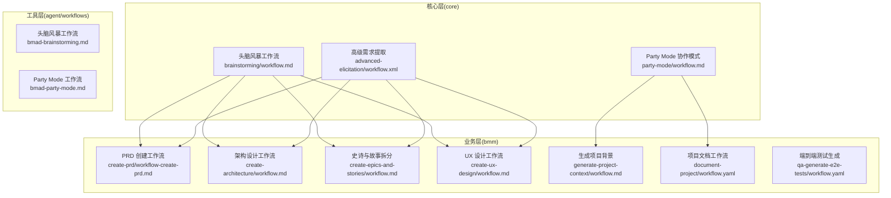
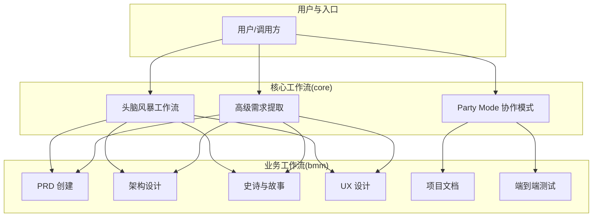
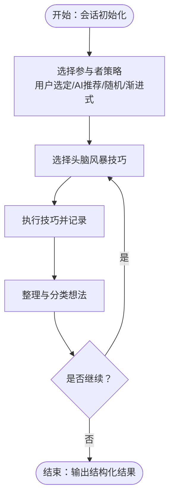
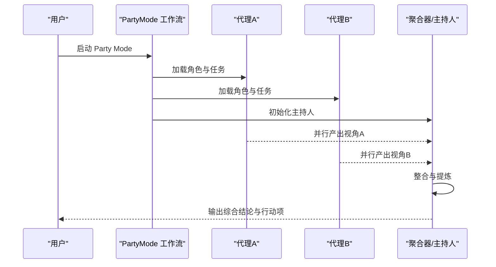
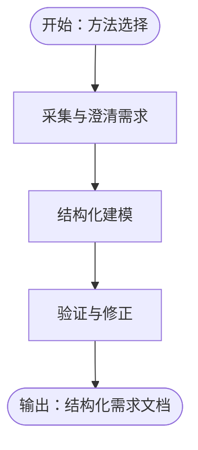
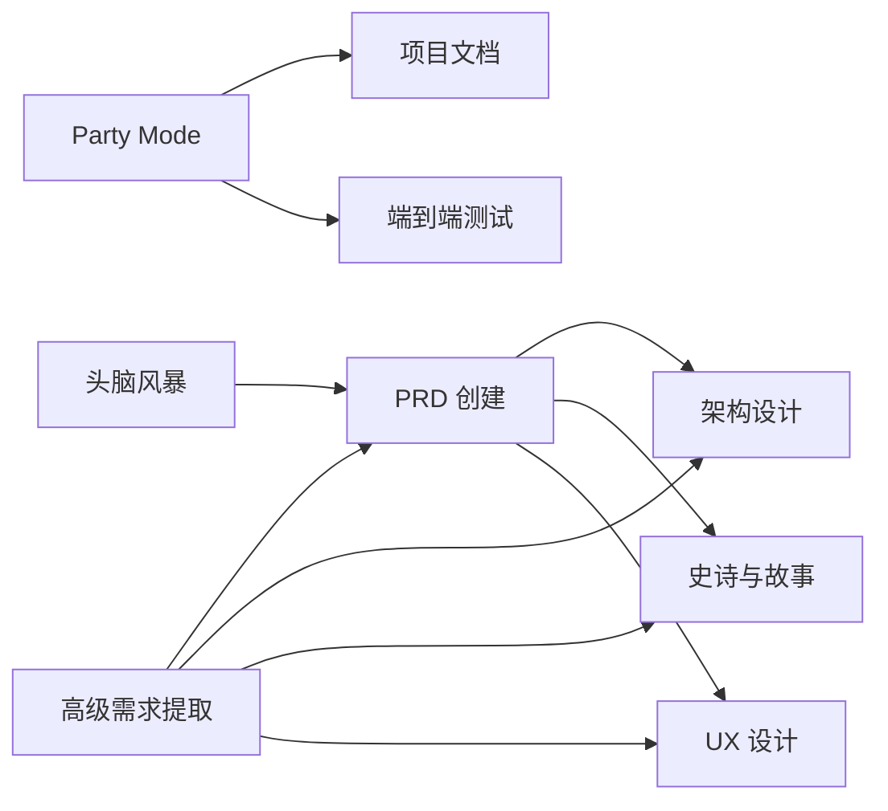
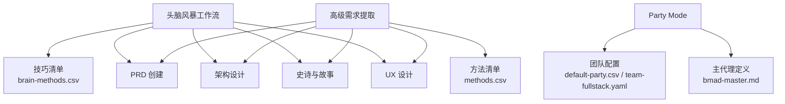

# BMA 核心工作流

<cite>
**本文引用的文件**
- [bmad-brainstorming.md](file://.agent/workflows/bmad-brainstorming.md)
- [bmad-party-mode.md](file://.agent/workflows/bmad-party-mode.md)
- [bmad-advanced-elicitation.md](file://_bmad/core/workflows/advanced-elicitation/workflow.xml)
- [brainstorming-workflow.md](file://_bmad/core/workflows/brainstorming/workflow.md)
- [party-mode-workflow.md](file://_bmad/core/workflows/party-mode/workflow.md)
- [bmad-master.md](file://_bmad/core/agents/bmad-master.md)
- [methods.csv](file://_bmad/core/workflows/advanced-elicitation/methods.csv)
- [brain-methods.csv](file://_bmad/core/workflows/brainstorming/brain-methods.csv)
- [default-party.csv](file://_bmad/bmm/teams/default-party.csv)
- [team-fullstack.yaml](file://_bmad/bmm/teams/team-fullstack.yaml)
- [workflow-create-prd.md](file://_bmad/bmm/workflows/2-plan-workflows/create-prd/workflow-create-prd.md)
- [workflow-create-architecture.md](file://_bmad/bmm/workflows/3-solutioning/create-architecture/workflow.md)
- [workflow-create-epics-and-stories.md](file://_bmad/bmm/workflows/3-solutioning/create-epics-and-stories/workflow.md)
- [workflow-create-ux-design.md](file://_bmad/bmm/workflows/2-plan-workflows/create-ux-design/workflow.md)
- [workflow-generate-project-context.md](file://_bmad/bmm/workflows/generate-project-context/workflow.md)
- [workflow-document-project.md](file://_bmad/bmm/workflows/document-project/workflow.yaml)
- [workflow-qa-generate-e2e-tests.md](file://_bmad/bmm/workflows/qa-generate-e2e-tests/workflow.yaml)
</cite>

## 目录
1. [引言](#引言)
2. [项目结构](#项目结构)
3. [核心组件](#核心组件)
4. [架构总览](#架构总览)
5. [详细组件分析](#详细组件分析)
6. [依赖关系分析](#依赖关系分析)
7. [性能考虑](#性能考虑)
8. [故障排除指南](#故障排除指南)
9. [结论](#结论)
10. [附录](#附录)

## 引言
本文件系统性梳理 BMA（Brainstorming Master Agent）的核心工作流体系，重点覆盖以下三大主线：
- 头脑风暴工作流：以“创意发散—方法选择—执行—整理”为主线，支持多种技巧与参与者动态编排。
- Party Mode 协作模式：多智能体并行讨论与协同，强调“加载—协调—优雅退出”的闭环流程。
- 高级需求提取：面向复杂场景的需求挖掘与结构化输出，结合方法论与工具链。

文档将从设计目标、触发条件、执行步骤、预期输出、参与者选择标准、协作机制、操作指南、最佳实践、常见问题与优化建议等维度进行深入解析，并给出在实际项目中的应用示例与效果对比。

## 项目结构
BMA 的工作流分布在三个层次：
- 核心层（core）：定义通用工作流模板与方法清单，如头脑风暴、Party Mode、高级需求提取。
- 业务层（bmm）：围绕产品/项目生命周期的端到端工作流，如 PRD 创建、架构设计、用户故事拆分、UX 设计、项目文档等。
- 工具层（agent/workflows）：面向代理与模块构建的辅助工作流，支撑 BMB（Brainstorming Master Builder）生态。

图表来源
- [brainstorming-workflow.md](file://_bmad/core/workflows/brainstorming/workflow.md)
- [party-mode-workflow.md](file://_bmad/core/workflows/party-mode/workflow.md)
- [bmad-advanced-elicitation.md](file://_bmad/core/workflows/advanced-elicitation/workflow.xml)
- [workflow-create-prd.md](file://_bmad/bmm/workflows/2-plan-workflows/create-prd/workflow-create-prd.md)
- [workflow-create-architecture.md](file://_bmad/bmm/workflows/3-solutioning/create-architecture/workflow.md)
- [workflow-create-epics-and-stories.md](file://_bmad/bmm/workflows/3-solutioning/create-epics-and-stories/workflow.md)
- [workflow-create-ux-design.md](file://_bmad/bmm/workflows/2-plan-workflows/create-ux-design/workflow.md)
- [workflow-generate-project-context.md](file://_bmad/bmm/workflows/generate-project-context/workflow.md)
- [workflow-document-project.md](file://_bmad/bmm/workflows/document-project/workflow.yaml)
- [workflow-qa-generate-e2e-tests.md](file://_bmad/bmm/workflows/qa-generate-e2e-tests/workflow.yaml)

章节来源
- [brainstorming-workflow.md](file://_bmad/core/workflows/brainstorming/workflow.md)
- [party-mode-workflow.md](file://_bmad/core/workflows/party-mode/workflow.md)
- [bmad-advanced-elicitation.md](file://_bmad/core/workflows/advanced-elicitation/workflow.xml)

## 核心组件
- 头脑风暴工作流：提供 session 初始化、参与者选择策略（用户选定/AI 推荐/随机/渐进式）、技巧执行与想法整理等步骤，支持多轮迭代与继续流程。
- Party Mode 协作模式：以多智能体并行讨论为核心，通过“加载代理—讨论编排—优雅退出”实现高效协作。
- 高级需求提取：基于方法清单与工作流模板，对复杂需求进行系统化提炼与结构化输出。

章节来源
- [brainstorming-workflow.md](file://_bmad/core/workflows/brainstorming/workflow.md)
- [party-mode-workflow.md](file://_bmad/core/workflows/party-mode/workflow.md)
- [bmad-advanced-elicitation.md](file://_bmad/core/workflows/advanced-elicitation/workflow.xml)

## 架构总览
下图展示了 BMA 核心工作流在三层之间的交互关系与数据流向：

图表来源
- [brainstorming-workflow.md](file://_bmad/core/workflows/brainstorming/workflow.md)
- [party-mode-workflow.md](file://_bmad/core/workflows/party-mode/workflow.md)
- [bmad-advanced-elicitation.md](file://_bmad/core/workflows/advanced-elicitation/workflow.xml)
- [workflow-create-prd.md](file://_bmad/bmm/workflows/2-plan-workflows/create-prd/workflow-create-prd.md)
- [workflow-create-architecture.md](file://_bmad/bmm/workflows/3-solutioning/create-architecture/workflow.md)
- [workflow-create-epics-and-stories.md](file://_bmad/bmm/workflows/3-solutioning/create-epics-and-stories/workflow.md)
- [workflow-create-ux-design.md](file://_bmad/bmm/workflows/2-plan-workflows/create-ux-design/workflow.md)
- [workflow-document-project.md](file://_bmad/bmm/workflows/document-project/workflow.yaml)
- [workflow-qa-generate-e2e-tests.md](file://_bmad/bmm/workflows/qa-generate-e2e-tests/workflow.yaml)

## 详细组件分析

### 头脑风暴工作流
- 设计目标
  - 快速发散创意，降低认知负担，提升跨领域洞察。
  - 提供可重复、可迭代的流程，支持继续/回溯与多轮讨论。
- 触发条件
  - 明确的议题或待探索方向；需要跨角色视角与多样化方法。
- 执行步骤
  - 会话初始化与上下文注入
  - 参与者选择策略：用户选定、AI 推荐、随机、渐进式
  - 技巧执行与记录
  - 想法组织与提炼
  - 继续流程或结束
- 预期输出
  - 结构化的创意清单、初步分类、后续行动项与责任人建议。
- 参与者选择标准
  - 基于议题相关性、角色互补性与知识覆盖面。
- 协作机制
  - 顺序执行与并行讨论结合；支持逐步推进与回退修正。
- 操作指南
  - 启动：准备议题与背景资料，选择合适参与者策略。
  - 迭代：根据输出调整方法与参与者，持续发散与收敛。
  - 评估：以创意数量、质量、可行性与关联度为指标。
- 最佳实践
  - 固定时间窗与明确截止；限制每次讨论主题数量。
  - 使用结构化模板记录要点，便于复盘与迁移。
- 常见问题与优化
  - 问题：参与者过多导致效率下降
    - 优化：采用“渐进式”策略，按阶段引入新角色。
  - 问题：创意质量参差不齐
    - 优化：引入“想法组织”步骤，统一格式与优先级。

图表来源
- [brainstorming-workflow.md](file://_bmad/core/workflows/brainstorming/workflow.md)
- [brain-methods.csv](file://_bmad/core/workflows/brainstorming/brain-methods.csv)

章节来源
- [brainstorming-workflow.md](file://_bmad/core/workflows/brainstorming/workflow.md)
- [bmad-brainstorming.md](file://.agent/workflows/bmad-brainstorming.md)
- [brain-methods.csv](file://_bmad/core/workflows/brainstorming/brain-methods.csv)

### Party Mode 协作模式
- 设计目标
  - 在同一议题下，多智能体并行讨论，最大化视角多样性与信息密度。
- 触发条件
  - 需要跨职能协同、快速汇总多方观点、形成共识。
- 执行步骤
  - 加载预设代理集合
  - 讨论编排：设定议程、分配角色、控制节奏
  - 优雅退出：汇总结论、输出行动项与后续计划
- 预期输出
  - 多视角综合报告、决策依据、分工与里程碑。
- 参与者选择标准
  - 基于团队配置文件（如默认 Party、全栈团队），按角色互补与职责边界选择。
- 协作机制
  - 代理间无直接竞争，强调“并行贡献—统一整合”，避免冲突。
- 操作指南
  - 启动：选择 Party 配置文件，确认议题与时间窗口。
  - 管理：监控讨论进度，必要时调整节奏或补充角色。
  - 评估：以共识达成度、信息完整性与可执行性为指标。
- 最佳实践
  - 明确主持人角色（由 master 或指定代理承担），确保流程可控。
  - 使用阶段性摘要，便于复盘与迭代。
- 常见问题与优化
  - 问题：讨论偏离主题
    - 优化：设置“回到议题”提醒与主持人干预机制。
  - 问题：输出碎片化
    - 优化：引入统一模板与结构化输出。

图表来源
- [party-mode-workflow.md](file://_bmad/core/workflows/party-mode/workflow.md)
- [default-party.csv](file://_bmad/bmm/teams/default-party.csv)
- [team-fullstack.yaml](file://_bmad/bmm/teams/team-fullstack.yaml)
- [bmad-master.md](file://_bmad/core/agents/bmad-master.md)

章节来源
- [party-mode-workflow.md](file://_bmad/core/workflows/party-mode/workflow.md)
- [bmad-party-mode.md](file://.agent/workflows/bmad-party-mode.md)
- [default-party.csv](file://_bmad/bmm/teams/default-party.csv)
- [team-fullstack.yaml](file://_bmad/bmm/teams/team-fullstack.yaml)
- [bmad-master.md](file://_bmad/core/agents/bmad-master.md)

### 高级需求提取
- 设计目标
  - 面向复杂业务场景，系统化识别、澄清与结构化表达需求，减少歧义与返工。
- 触发条件
  - 业务方提出模糊或冲突需求；需要跨域协同与深度分析。
- 执行步骤
  - 方法选择与准备
  - 需求采集与澄清
  - 结构化建模与验证
  - 输出与评审
- 预期输出
  - 结构化需求文档、风险点清单、依赖关系图与验收标准。
- 参与者选择标准
  - 覆盖业务、技术、产品、运营等关键角色，确保视角完整。
- 协作机制
  - 以“方法论驱动+工具链支撑”的方式，保证过程可追溯与结果可验证。
- 操作指南
  - 启动：选择合适方法，准备背景材料与干系人。
  - 迭代：按步骤推进，及时记录分歧与共识。
  - 评估：以完整性、一致性、可测试性为指标。
- 最佳实践
  - 使用标准化模板与检查清单，确保输出质量。
  - 将方法论固化为 CSV 清单，便于复用与培训。
- 常见问题与优化
  - 问题：需求漂移
    - 优化：引入“回到议题”机制与主持人监督。
  - 问题：方法不当
    - 优化：根据场景选择合适方法，必要时组合使用。

图表来源
- [bmad-advanced-elicitation.md](file://_bmad/core/workflows/advanced-elicitation/workflow.xml)
- [methods.csv](file://_bmad/core/workflows/advanced-elicitation/methods.csv)

章节来源
- [bmad-advanced-elicitation.md](file://_bmad/core/workflows/advanced-elicitation/workflow.xml)
- [methods.csv](file://_bmad/core/workflows/advanced-elicitation/methods.csv)

### 与业务工作流的衔接
- PRD 创建：承接头脑风暴与高级需求提取的结果，形成正式产品需求。
- 架构设计：基于 PRD 与需求模型，输出系统架构与决策记录。
- 用户故事拆分：将高层需求转化为可执行的史诗与故事。
- UX 设计：在需求与架构基础上，完成界面与交互设计。
- 项目文档：沉淀项目扫描、索引与深度文档，支撑长期演进。
- QA 端到端测试：基于需求与设计生成可执行的测试用例。

图表来源
- [workflow-create-prd.md](file://_bmad/bmm/workflows/2-plan-workflows/create-prd/workflow-create-prd.md)
- [workflow-create-architecture.md](file://_bmad/bmm/workflows/3-solutioning/create-architecture/workflow.md)
- [workflow-create-epics-and-stories.md](file://_bmad/bmm/workflows/3-solutioning/create-epics-and-stories/workflow.md)
- [workflow-create-ux-design.md](file://_bmad/bmm/workflows/2-plan-workflows/create-ux-design/workflow.md)
- [workflow-document-project.md](file://_bmad/bmm/workflows/document-project/workflow.yaml)
- [workflow-qa-generate-e2e-tests.md](file://_bmad/bmm/workflows/qa-generate-e2e-tests/workflow.yaml)

章节来源
- [workflow-create-prd.md](file://_bmad/bmm/workflows/2-plan-workflows/create-prd/workflow-create-prd.md)
- [workflow-create-architecture.md](file://_bmad/bmm/workflows/3-solutioning/create-architecture/workflow.md)
- [workflow-create-epics-and-stories.md](file://_bmad/bmm/workflows/3-solutioning/create-epics-and-stories/workflow.md)
- [workflow-create-ux-design.md](file://_bmad/bmm/workflows/2-plan-workflows/create-ux-design/workflow.md)
- [workflow-document-project.md](file://_bmad/bmm/workflows/document-project/workflow.yaml)
- [workflow-qa-generate-e2e-tests.md](file://_bmad/bmm/workflows/qa-generate-e2e-tests/workflow.yaml)

## 依赖关系分析
- 方法清单依赖
  - 头脑风暴：依赖技巧清单文件，用于指导参与者策略与技巧选择。
  - 高级需求提取：依赖方法清单文件，用于规范方法选择与执行流程。
- 团队配置依赖
  - Party Mode：依赖团队配置文件（CSV/YAML），用于加载代理集合与角色分配。
- 主代理依赖
  - Party Mode：依赖主代理定义，作为主持人与流程协调者。
- 业务工作流依赖
  - 头脑风暴与高级需求提取的结果作为输入，驱动后续 PRD、架构、故事与设计工作流。

图表来源
- [brain-methods.csv](file://_bmad/core/workflows/brainstorming/brain-methods.csv)
- [methods.csv](file://_bmad/core/workflows/advanced-elicitation/methods.csv)
- [default-party.csv](file://_bmad/bmm/teams/default-party.csv)
- [team-fullstack.yaml](file://_bmad/bmm/teams/team-fullstack.yaml)
- [bmad-master.md](file://_bmad/core/agents/bmad-master.md)
- [workflow-create-prd.md](file://_bmad/bmm/workflows/2-plan-workflows/create-prd/workflow-create-prd.md)
- [workflow-create-architecture.md](file://_bmad/bmm/workflows/3-solutioning/create-architecture/workflow.md)
- [workflow-create-epics-and-stories.md](file://_bmad/bmm/workflows/3-solutioning/create-epics-and-stories/workflow.md)
- [workflow-create-ux-design.md](file://_bmad/bmm/workflows/2-plan-workflows/create-ux-design/workflow.md)

章节来源
- [brain-methods.csv](file://_bmad/core/workflows/brainstorming/brain-methods.csv)
- [methods.csv](file://_bmad/core/workflows/advanced-elicitation/methods.csv)
- [default-party.csv](file://_bmad/bmm/teams/default-party.csv)
- [team-fullstack.yaml](file://_bmad/bmm/teams/team-fullstack.yaml)
- [bmad-master.md](file://_bmad/core/agents/bmad-master.md)

## 性能考虑
- 流程长度与并发
  - Party Mode 中代理数量与讨论轮次直接影响响应时间，应根据资源配额合理裁剪。
- 数据结构与模板
  - 使用结构化模板与清单可显著降低解析与校验成本，提高吞吐量。
- 缓存与复用
  - 对常用方法与技巧清单进行缓存，减少重复加载开销。
- 评估指标
  - 以“单位时间产出创意数/需求条目数/结论达成率”衡量效率与质量。

## 故障排除指南
- 头脑风暴
  - 症状：参与者策略无效或技巧不适用
  - 处理：切换至“AI 推荐”或“渐进式”策略，核对技巧清单与议题匹配度
- Party Mode
  - 症状：讨论偏离主题或输出碎片化
  - 处理：启用主持人角色，设置“回到议题”提醒；引入统一模板
- 高级需求提取
  - 症状：方法选择不当导致结果偏差
  - 处理：对照方法清单重新选择，必要时组合多种方法
- 业务工作流
  - 症状：输入不完整导致下游阻塞
  - 处理：回溯至上一步骤补齐材料，使用检查清单自检

章节来源
- [brainstorming-workflow.md](file://_bmad/core/workflows/brainstorming/workflow.md)
- [party-mode-workflow.md](file://_bmad/core/workflows/party-mode/workflow.md)
- [bmad-advanced-elicitation.md](file://_bmad/core/workflows/advanced-elicitation/workflow.xml)

## 结论
BMA 核心工作流通过“头脑风暴—Party Mode—高级需求提取”的闭环，有效覆盖从创意发散到结构化输出的关键环节。配合业务层工作流，可实现从需求到交付的全链路自动化与可复用。建议在实践中以方法论为纲、以模板为目，持续优化参与者策略与协作机制，以获得更稳定的质量与更高的效率。

## 附录
- 实际应用场景与效果对比
  - 场景一：新产品概念验证
    - 使用头脑风暴工作流快速发散，再用 Party Mode 汇总多方观点，最后用高级需求提取形成结构化需求，支撑 PRD 创建。
  - 场景二：跨团队协作
    - 使用 Party Mode 聚合产品、技术、运营视角，形成统一方案与行动项，降低沟通成本。
  - 场景三：复杂需求澄清
    - 使用高级需求提取方法，结合检查清单与模板，显著提升需求一致性与可测试性。
- 操作清单
  - 启动头脑风暴：准备议题→选择参与者策略→执行技巧→整理输出
  - 启动 Party Mode：选择团队配置→确认议题→监控讨论→汇总结论
  - 启动高级需求提取：选择方法→采集澄清→建模验证→输出文档
- 最佳实践
  - 固化方法清单与模板，建立复用与培训机制
  - 明确主持人与角色边界，确保流程可控
  - 定期复盘与迭代，持续优化参与者策略与协作机制