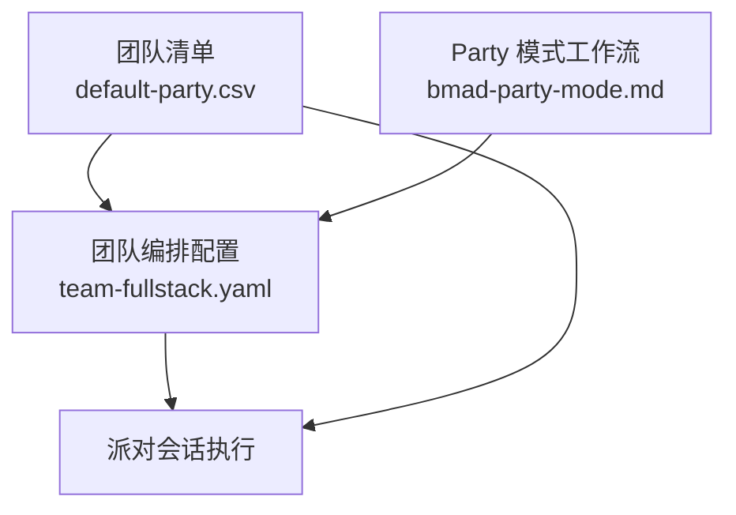
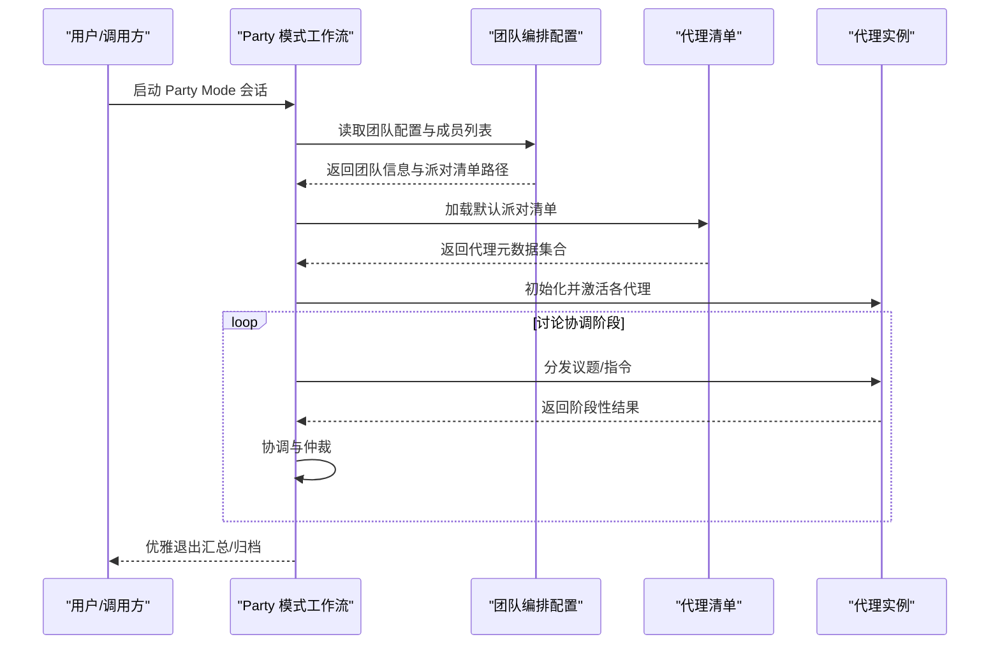
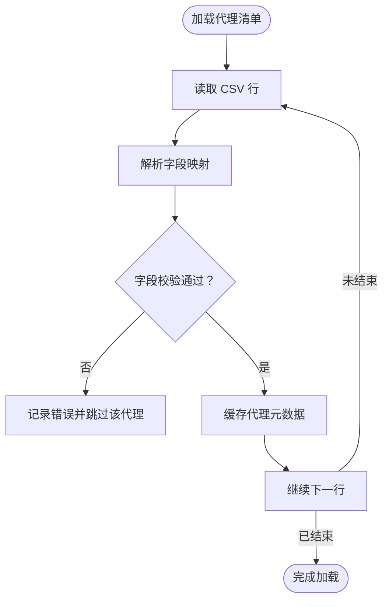
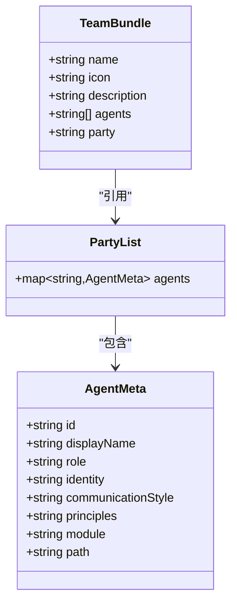
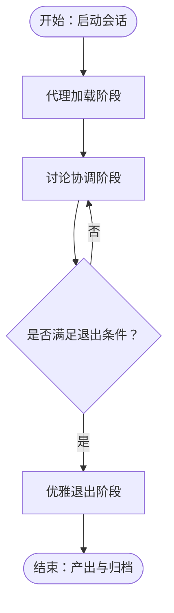
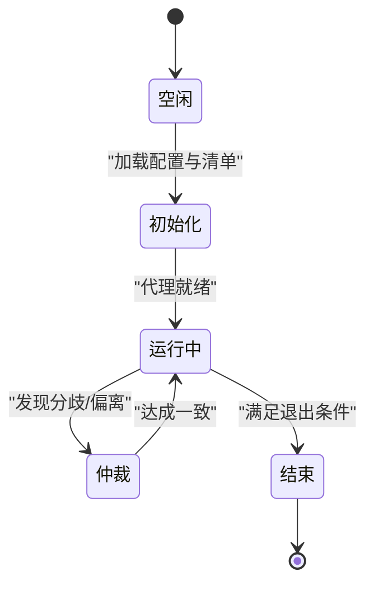
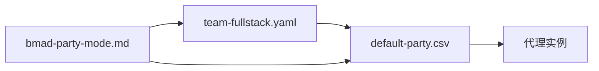

# Party Mode 协作模式

<cite>
**本文引用的文件**
- [default-party.csv](file://_bmad/bmm/teams/default-party.csv)
- [team-fullstack.yaml](file://_bmad/bmm/teams/team-fullstack.yaml)
- [bmad-party-mode.md](file://.agent/workflows/bmad-party-mode.md)
- [bmad-party-mode.md](file://.claude/commands/bmad-party-mode.md)
</cite>

## 目录
1. [引言](#引言)
2. [项目结构](#项目结构)
3. [核心组件](#核心组件)
4. [架构总览](#架构总览)
5. [详细组件分析](#详细组件分析)
6. [依赖关系分析](#依赖关系分析)
7. [性能考量](#性能考量)
8. [故障排查指南](#故障排查指南)
9. [结论](#结论)
10. [附录](#附录)

## 引言
本文件系统性阐述 Party Mode 协作模式的设计理念与工作机制，聚焦三阶段流程：代理加载、讨论协调与优雅退出。Party Mode 将多个 AI 代理以“派对”形式组织起来，围绕统一目标进行协同讨论与任务执行，强调角色分工、交互节奏与过程治理。本文面向不同技术背景读者，既提供高层概览，也给出可操作的使用指南与最佳实践。

## 项目结构
Party Mode 的实现由“团队清单”“团队编排配置”“Party 模式工作流”三部分构成：
- 团队清单：定义默认参与代理及其角色、身份、沟通风格与原则等元数据
- 团队编排配置：声明团队成员集合与派对入口（CSV 路径）
- Party 模式工作流：描述三阶段协作流程与交互规则

图表来源
- [default-party.csv:1-21](file://_bmad/bmm/teams/default-party.csv#L1-L21)
- [team-fullstack.yaml:1-13](file://_bmad/bmm/teams/team-fullstack.yaml#L1-L13)
- [bmad-party-mode.md](file://.agent/workflows/bmad-party-mode.md)

章节来源
- [default-party.csv:1-21](file://_bmad/bmm/teams/default-party.csv#L1-L21)
- [team-fullstack.yaml:1-13](file://_bmad/bmm/teams/team-fullstack.yaml#L1-L13)
- [bmad-party-mode.md](file://.agent/workflows/bmad-party-mode.md)

## 核心组件
- 代理清单与角色元数据
  - 通过 CSV 定义每个代理的标识、显示名、头衔、图标、角色、身份、沟通风格、原则、模块与路径等字段，用于派对会话中动态加载与呈现
- 团队编排配置
  - 声明团队名称、图标、描述与成员列表，并指向默认派对清单路径，形成“团队模板”
- Party 模式工作流
  - 描述三阶段协作流程：代理加载、讨论协调、优雅退出；为每次会话提供统一的控制流与治理规则

章节来源
- [default-party.csv:1-21](file://_bmad/bmm/teams/default-party.csv#L1-L21)
- [team-fullstack.yaml:6-12](file://_bmad/bmm/teams/team-fullstack.yaml#L6-L12)
- [bmad-party-mode.md](file://.agent/workflows/bmad-party-mode.md)

## 架构总览
Party Mode 的运行时架构如下：客户端或命令入口触发 Party 模式工作流；工作流根据团队编排配置加载团队成员清单；随后进入三阶段协作循环；最后在满足条件时优雅退出。

图表来源
- [team-fullstack.yaml:6-12](file://_bmad/bmm/teams/team-fullstack.yaml#L6-L12)
- [default-party.csv:1-21](file://_bmad/bmm/teams/default-party.csv#L1-L21)
- [bmad-party-mode.md](file://.agent/workflows/bmad-party-mode.md)

## 详细组件分析

### 组件一：代理清单与角色元数据（default-party.csv）
- 字段设计
  - 标识、显示名、头衔、图标、角色、身份、沟通风格、原则、模块、路径等，支撑派对中的动态加载与角色呈现
- 设计要点
  - 角色与身份明确边界，避免职责重叠
  - 沟通风格与原则作为交互约束，确保讨论一致性
  - 模块与路径便于按需加载对应能力
- 复杂度与性能
  - 元数据读取为 O(N) 遍历，N 为代理数量；建议在会话初始化阶段一次性加载并缓存
- 错误处理
  - 缺失关键字段时应降级或阻断，保证会话稳定性

图表来源
- [default-party.csv:1-21](file://_bmad/bmm/teams/default-party.csv#L1-L21)

章节来源
- [default-party.csv:1-21](file://_bmad/bmm/teams/default-party.csv#L1-L21)

### 组件二：团队编排配置（team-fullstack.yaml）
- 组织方式
  - 以 YAML 声明团队名称、图标、描述与成员集合，并通过相对路径指向默认派对清单
- 设计要点
  - bundle.name/icon/description 提供团队语义化标识
  - agents 列表决定派对初始成员集合
  - party 指向 default-party.csv，形成“模板-实例”的解耦关系
- 扩展性
  - 可基于同一模板快速生成不同规模与角色组合的派对

图表来源
- [team-fullstack.yaml:6-12](file://_bmad/bmm/teams/team-fullstack.yaml#L6-L12)
- [default-party.csv:1-21](file://_bmad/bmm/teams/default-party.csv#L1-L21)

章节来源
- [team-fullstack.yaml:1-13](file://_bmad/bmm/teams/team-fullstack.yaml#L1-L13)
- [default-party.csv:1-21](file://_bmad/bmm/teams/default-party.csv#L1-L21)

### 组件三：Party 模式工作流（bmad-party-mode.md）
- 三阶段协作
  - 代理加载：根据团队配置与清单初始化代理实例，建立会话上下文
  - 讨论协调：分发议题、收集反馈、进行交叉验证与仲裁，维持讨论焦点与效率
  - 优雅退出：在达成目标或超时后，输出总结、归档产物并释放资源
- 控制流与治理
  - 工作流定义了阶段边界与切换条件，确保会话可控、可审计
  - 协调阶段引入仲裁与回退机制，降低无效讨论与资源浪费
- 与前端/命令行集成
  - 通过命令入口触发工作流，结合团队配置与清单完成端到端协作

图表来源
- [bmad-party-mode.md](file://.agent/workflows/bmad-party-mode.md)

章节来源
- [bmad-party-mode.md](file://.agent/workflows/bmad-party-mode.md)

### 组件四：派对会话生命周期（概念性）
- 生命周期状态
  - 空闲 -> 初始化 -> 运行中 -> 仲裁 -> 结束
- 状态转换触发
  - 初始化：加载团队配置与代理清单
  - 运行中：持续接收议题与反馈
  - 仲裁：当出现分歧或偏离焦点时介入
  - 结束：达成目标或超时后释放资源

（本图为概念性说明，不直接映射具体源码）

## 依赖关系分析
Party Mode 的依赖关系围绕“配置-清单-工作流”展开：团队编排配置依赖代理清单；工作流依赖配置与清单；代理实例依赖其元数据与模块路径。

图表来源
- [team-fullstack.yaml:6-12](file://_bmad/bmm/teams/team-fullstack.yaml#L6-L12)
- [default-party.csv:1-21](file://_bmad/bmm/teams/default-party.csv#L1-L21)
- [bmad-party-mode.md](file://.agent/workflows/bmad-party-mode.md)

章节来源
- [team-fullstack.yaml:1-13](file://_bmad/bmm/teams/team-fullstack.yaml#L1-L13)
- [default-party.csv:1-21](file://_bmad/bmm/teams/default-party.csv#L1-L21)
- [bmad-party-mode.md](file://.agent/workflows/bmad-party-mode.md)

## 性能考量
- 代理加载
  - 采用延迟初始化与按需加载策略，减少启动开销
  - 对代理清单进行本地缓存，避免重复 IO
- 讨论协调
  - 引入批处理与合并策略，降低消息风暴
  - 设置最大并发与排队机制，防止资源争用
- 优雅退出
  - 统一清理会话上下文与临时资源，确保幂等性

（本节为通用指导，不直接分析具体文件）

## 故障排查指南
- 代理无法加载
  - 检查团队配置中的 agents 列表与清单路径是否匹配
  - 校验代理清单字段完整性与模块路径可达性
- 讨论偏离焦点
  - 使用工作流的仲裁阶段进行回正，必要时限制发言轮次或引入主持人角色
- 会话卡死
  - 设置超时与心跳检测，超时后自动进入优雅退出阶段
- 产物缺失
  - 在工作流中增加阶段性检查点与产物校验，失败时回滚至上一个稳定状态

（本节为通用指导，不直接分析具体文件）

## 结论
Party Mode 将多代理协作抽象为“配置-清单-工作流”的标准化范式，通过明确的角色分工、清晰的控制流与治理机制，实现从启动到退出的全生命周期管理。依托团队编排配置与代理清单，Party Mode 能够灵活适配不同场景，提升复杂项目讨论与团队协作的效率与质量。

## 附录

### 使用指南（基于现有文件的可操作步骤）
- 启动 Party Mode 会话
  - 通过命令入口触发 Party 模式工作流
  - 工作流将读取团队编排配置并加载代理清单
- 配置参与的代理
  - 在团队编排配置中维护 agents 列表
  - 确保 default-party.csv 中对应代理的模块与路径有效
- 协调多代理间的讨论
  - 在讨论协调阶段遵循工作流定义的议题分发与仲裁机制
  - 必要时引入主持人角色或设置发言轮次
- 优雅地结束会话
  - 当达成目标或超时后，工作流自动进入优雅退出阶段，输出总结并归档产物

章节来源
- [team-fullstack.yaml:6-12](file://_bmad/bmm/teams/team-fullstack.yaml#L6-L12)
- [default-party.csv:1-21](file://_bmad/bmm/teams/default-party.csv#L1-L21)
- [bmad-party-mode.md](file://.agent/workflows/bmad-party-mode.md)